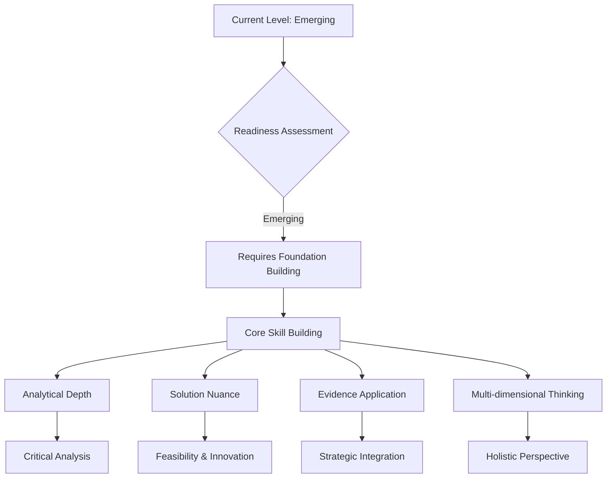
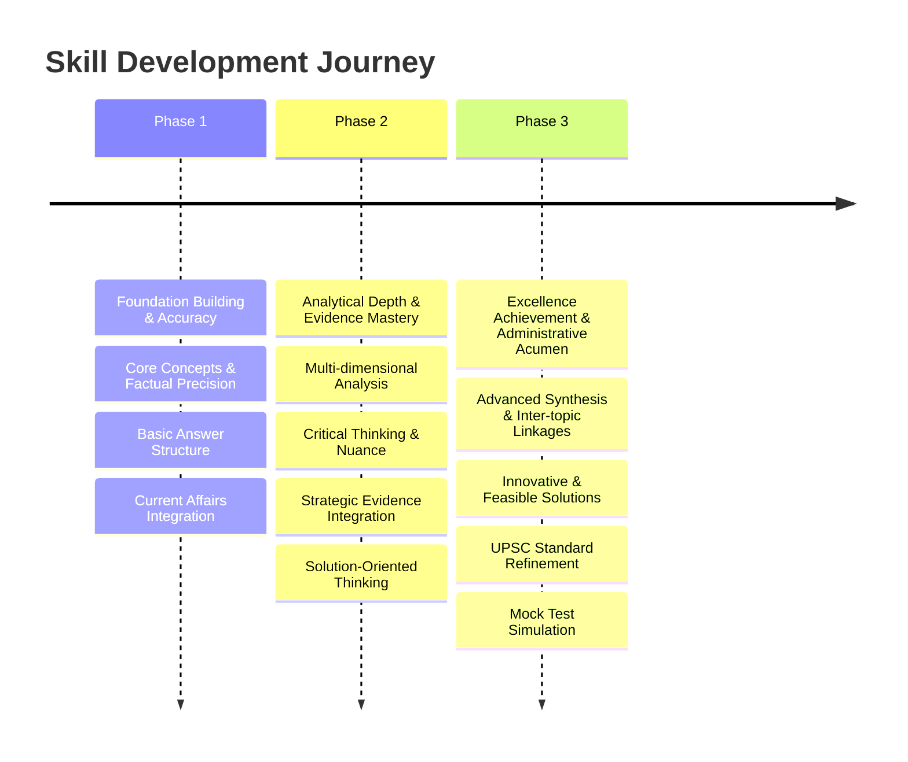
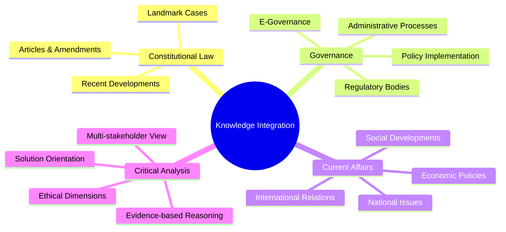

# ⚖️ UPSC GS Paper II Evaluation Report

## 📊 Overall Evaluation Dashboard

### 📈 Performance Summary
> The candidate demonstrates a foundational understanding of GS Paper II topics, covering a broad spectrum of Constitution, Governance, Social Justice, and International Relations. A notable strength lies in the consistent attempt to address multiple parts of a question and include relevant examples, government schemes, and constitutional articles. The overall structure of answers, including introductions and conclusions, is generally in place, and the use of headings/sub-headings enhances readability. The candidate also shows an awareness of current affairs and attempts to integrate them into static concepts.

> However, the evaluation reveals significant scope for enhancement in several critical areas to meet the rigorous standards of UPSC Mains. While examples are present, their strategic integration to strengthen arguments is often lacking. The depth of analytical rigor and critical thinking needs substantial development; answers often describe rather than deeply analyze or critically evaluate. Multi-dimensional analysis, a cornerstone of high-scoring GS-II answers, is present in parts but not consistently or comprehensively applied across all questions. Constitutional and factual accuracy, though generally fair, has instances of imprecision or superficiality that need rectification. The 'way forward' or solution-oriented suggestions, while present, frequently lack the administrative feasibility, innovative thinking, and progressive outlook expected of a civil servant. There's a tendency to list points without sufficient elaboration or linking them to a central argument. Mastering the art of precise articulation, structuring arguments logically, and substantiating claims with robust, specific evidence will be crucial for elevating performance from an average to an excellent level. Focus must shift from mere information reproduction to insightful analysis and critical commentary, reflecting a mature understanding of governance challenges and constitutional principles.

### ✅ Key Strengths
> 🌟 **Impact Areas**

- **🎯 Question Comprehension & Multi-part Addressing**: The candidate consistently attempts to address all parts of multi-faceted questions, demonstrating a good initial understanding of the question's demands. For instance, in Question 1 (Seventh Schedule) and Question 2 (ODR), both advantages/reasons and challenges/issues are discussed. This methodical approach ensures no major component of the question is left untouched, which is fundamental for securing basic marks.

- **💡 Awareness of Current Affairs & Examples**: There is a commendable effort to integrate contemporary examples and current events into answers, such as the Telangana CM's statement on the Concurrent List (Q1), COVID-19 (Q1, Q8), Karnataka Governor's role (Q3), and specific schemes like SVANIDHI (Q8) or committees like Tyagi Srinivas (Q14). This demonstrates active engagement with daily news and a recognition of the dynamic nature of GS-II topics, adding a layer of relevance to the responses.

- **✅ Structural Adherence & Readability**: The answers generally follow a logical structure with clear introductions, body paragraphs, and conclusions. The use of bullet points, sub-headings, and sometimes diagrams (like in Q1, Q2, Q3) significantly enhances readability and helps in presenting information concisely. This attention to presentation makes the answers easier for the examiner to follow and evaluate.

- **🌱 Solution-Oriented Approach (Basic Level)**: For most questions, the candidate attempts to provide a 'way forward' or suggestions for improvement, indicating an understanding of the problem-solving aspect critical for civil services. While the depth and feasibility of these solutions vary, the consistent inclusion of this component reflects an initial civil servant mindset. For example, suggesting Sarkaria/Punchhi Committee recommendations for Centre-State relations (Q3) or e-court projects for ODR (Q2).

### ⚡ Primary Development Areas
> ⚠️ **Priority Focus**

- **🚨 Constitutional & Factual Precision**: There are instances of imprecision in constitutional articles (Q1 mentions Article 2nd for Seventh Schedule, which is incorrect; it's Article 246 and the Seventh Schedule itself) and factual details (e.g., 15th FC recommendations in Q12 could be more precise). This is a critical priority because UPSC penalizes factual inaccuracies heavily. Accuracy is the bedrock of constitutional and governance answers.
  - **Reasoning**: Without absolute accuracy in constitutional provisions, articles, and factual data, the credibility of the entire argument is undermined. UPSC demands a high degree of precision in static portions of the syllabus.

- **⚠️ Depth of Analytical Rigor & Critical Thinking**: Answers often tend to be descriptive lists of points rather than deep, multi-dimensional analyses. For example, in Q1 (Seventh Schedule), while arguments for and against revisiting are listed, the nuanced critical evaluation of federal principles or the inter-play of political dynamics is missing. Similarly, in Q14 (CCI), the points are listed but lack a strong analytical thread connecting them to the "need to revamp" beyond mere description.
  - **Reasoning**: UPSC GS-II requires candidates to move beyond rote memorization to demonstrate an ability to critically examine, evaluate, and synthesize information. Superficial analysis limits the marks awarded for higher-order thinking skills.

- **🔥 Evidence Integration & Elaboration**: While examples and references are present, their integration is often perfunctory. Constitutional articles, landmark cases, or committee reports are mentioned but rarely elaborated upon to demonstrate how they specifically support the argument or add weight to the analysis. For instance, citing S.R. Bommai case (Q3) would have significantly strengthened the point on Governor's role.
  - **Reasoning**: Mere mention of evidence is insufficient; its effective and strategic integration, explaining its relevance and impact, is what distinguishes high-quality answers. This shows a deeper understanding and application of knowledge.

- **🌐 Multi-Dimensional Coverage & Nuance**: Many answers lack comprehensive multi-dimensional coverage. For instance, in Q4 (Lobbying), while benefits and issues are discussed, the ethical, regulatory, and democratic implications could be explored with greater depth and nuance, moving beyond a simple pro/con list. Similarly, in Q17 (PPP in Healthcare), the socio-economic and ethical dimensions of private sector involvement could be more rigorously analyzed.
  - **Reasoning**: GS-II questions often require an examination from legal, political, administrative, social, economic, and ethical angles. Missing these dimensions leads to an incomplete and less compelling answer.

- **🎯 Solution-Orientation & Administrative Feasibility**: While 'way forward' sections are included, the proposed solutions often lack administrative feasibility, innovation, or a clear implementation strategy. They tend to be generic rather than specific, practical, and progressive. For example, "rationalisation of CSS" (Q12) is a good point, but how it could be achieved or its specific challenges are not detailed.
  - **Reasoning**: A civil servant mindset demands practical, implementable solutions that consider ground realities and potential challenges. Generic suggestions indicate a lack of deeper engagement with the policy-making and implementation process.

### 🏛️ Civil Service Readiness
> 🧭 **Administrative Preparedness Assessment**

The candidate exhibits an emerging level of civil service readiness, demonstrating a foundational understanding of governance, policy, and constitutional issues. There's a clear intent to engage with the demands of the UPSC examination, particularly in attempting to provide structured answers and including 'way forward' sections. This indicates a nascent problem-solving aptitude and an awareness of the need for constructive suggestions, which are vital for an administrative role. The candidate's ability to recall contemporary examples and government initiatives showcases a desirable level of current affairs engagement, essential for a civil servant who must operate within the dynamic policy landscape.

However, significant enhancement is required to transition from an 'emerging' to a 'strong' or 'ready' state. The current approach often prioritizes breadth over depth, leading to answers that cover many points but lack the analytical rigor and critical evaluation necessary for complex administrative decision-making. A civil servant must not only identify problems but also diagnose their root causes, analyze multi-stakeholder perspectives, and propose nuanced, implementable solutions. The candidate's solutions, while present, sometimes lack this level of practicality, innovative thinking, and consideration for potential pitfalls or implementation challenges. For instance, discussions on federalism (Q1, Q3) could benefit from a more profound understanding of the political economy of Centre-State relations, moving beyond legislative and financial divisions to the operational realities and friction points.

Developing a truly solution-oriented mindset means delving into the 'how' and 'why' of policy implementation, understanding administrative feasibility, and anticipating consequences. This requires a shift from merely stating facts and listing points to constructing well-reasoned arguments, substantiated by robust evidence, and evaluated from multiple angles. The ability to integrate constitutional principles with administrative realities, assess policy impacts, and demonstrate a progressive outlook towards social justice and inclusive governance needs consistent cultivation. The candidate's current performance suggests a promising base, but the journey towards administrative excellence demands a more profound engagement with the complexities of governance, characterized by sharper analytical skills, deeper critical thinking, and a more robust, implementable problem-solving approach.

### 🎯 UPSC Standard Alignment
> 📈 **Benchmarking Against Excellence**

The candidate's performance aligns with UPSC standards at a foundational level, demonstrating an understanding of the structure and basic content expected in GS-II answers. The attempt to cover all parts of a question, include relevant examples, and provide a 'way forward' reflects an awareness of the examination's demands. The answers are generally legible and organized, which is a positive aspect in a time-bound examination setting. This indicates that the candidate has internalized the basic requirements for answer writing in UPSC Mains.

However, to achieve excellence and align with the highest UPSC standards, significant improvements are necessary, particularly in the areas of analytical depth, critical thinking, and precision. UPSC examiners look for answers that go beyond mere factual recall or descriptive summaries. They seek evidence of a candidate's ability to dissect complex issues, present nuanced arguments, and demonstrate a comprehensive understanding of the subject matter, integrating static knowledge with dynamic current affairs seamlessly. For instance, in discussions on judicial reforms (Q2) or electoral reforms (Q13), a top-tier answer would not only list challenges and solutions but also critically evaluate the underlying systemic issues, the political will required, and the constitutional implications of proposed changes. The current answers, while touching upon these, often lack the profound insights and layered analysis that distinguish high-scoring responses.

Furthermore, precision in constitutional references, factual accuracy, and the strategic deployment of evidence are non-negotiable at the UPSC level. While the candidate attempts these, there are instances of imprecision or generic application. A UPSC-quality answer would cite specific articles, landmark Supreme Court judgments (e.g., S.R. Bommai, Kesavananda Bharati for constitutional questions), and committee recommendations (e.g., Punchhi, Sarkaria, ARC for governance issues) not just as mentions, but as integral parts of the argument, demonstrating how they shape the understanding of the issue. The ability to present a balanced perspective, avoid bias, and maintain an objective, civil service-oriented tone throughout the answer is also crucial for aligning with UPSC's expectations of a future administrator. The candidate has a solid base, but the journey to excellence requires a deliberate focus on refining analytical acumen, deepening content mastery, and perfecting the art of persuasive, evidence-based argumentation.

---

## 📝 Individual Answer Analysis

### 🎯 Question 1: Do you agree with the view that time has come to revisit the Seventh Schedule of the Indian Constitution? Discuss with suitable arguments. (Answer in 150 words)
**🗺️ Syllabus Area**: `Constitution - Federalism, Centre-State Relations`

#### 🔄 Answer Comparison

##### 📝 Your Answer Summary
> The candidate defines the Seventh Schedule and its three lists. They argue for revisiting it due to centralisation (more Union subjects, Telangana CM's call) and state power encroachment (education, forests, Centre's use of State List in emergencies like COVID-19). They also argue against revisiting, citing federal ethos, flexibility, unity, and preventing fissiparous tendencies. The conclusion suggests minimal Concurrent subjects (Sarkaria) and state consultation for Concurrent List legislation (Punchhi).

##### ⭐ Ideal Answer Framework
> An ideal answer would begin by concisely defining the Seventh Schedule (Article 246) as the constitutional mechanism for distributing legislative powers between the Union and States. It would then present arguments for revisiting, such as the increasing centralisation of power, the need for states to have greater autonomy in specific sectors (e.g., health, education), and the dynamic nature of contemporary challenges like climate change or pandemics that blur traditional boundaries. Counter-arguments would emphasize the importance of a strong center for national unity, integrity, and coordinated policy responses (e.g., disaster management), highlighting the existing flexibility of the Concurrent List and the federal spirit. The conclusion would offer a balanced 'way forward', perhaps suggesting greater use of the Inter-State Council, cooperative federalism, and rationalization of entries based on contemporary needs rather than a complete overhaul, citing relevant committee recommendations like Sarkaria and Punchhi.

#### 📊 Evaluation Criteria

##### 🧠 Relevance and Understanding
> The candidate has accurately identified the core demand of the question, which is to discuss arguments for and against revisiting the Seventh Schedule. The answer directly addresses the "Do you agree" part by presenting both sides of the argument, which is crucial for a balanced discussion. The inclusion of specific examples like Telangana CM's statement and the Centre's actions during COVID-19 demonstrates good contemporary relevance. However, the initial mention of "Article 2nd of constitution" for the Seventh Schedule is a significant factual error. The Seventh Schedule is part of Article 246, which deals with the distribution of legislative powers. Article 2 deals with the admission or establishment of new states. This error, while minor in content, is a critical constitutional inaccuracy that undermines the foundational knowledge.

**✅ Suggestions**
- **✅ Precise Constitutional Referencing**: Always double-check and be absolutely precise with constitutional articles, schedules, and amendments. For the Seventh Schedule, refer to `Article 246` and the `Seventh Schedule` itself. This accuracy is non-negotiable in UPSC.
- **✅ Deeper Linkage to Federalism**: While you mention 'federal ethos', elaborate on how the proposed revisiting or status quo impacts the principles of cooperative vs. competitive federalism. How does it affect the administrative and financial autonomy of states?

##### 🏗️ Structure and Organization
> The answer is well-structured with a clear introduction (defining the Seventh Schedule), a body (arguments for and against revisiting), and a conclusion (way forward). The use of bullet points and clear demarcation between arguments for and against enhances readability. The diagram illustrating the three lists is a good visual aid. However, the flow within the arguments could be smoother. The points, while distinct, sometimes feel like a list rather than a cohesive argument. For example, 'centralisation' and 'encroachment' are valid points, but their interrelation could be better articulated.

**✅ Suggestions**
- **✅ Enhance Cohesion within Arguments**: Instead of just listing points, try to build a narrative. For example, explain how "centralisation" leads to "encroachment" and how this impacts federal balance. Use transition words to connect ideas.
- **✅ Optimize Diagram Placement**: While diagrams are good, ensure they don't break the flow of text abruptly. Perhaps integrate them more organically or ensure they are concise and directly support the adjacent text.

##### ⚖️ Constitutional and Governance Knowledge
> The candidate demonstrates a basic understanding of the Seventh Schedule and its lists. The arguments for and against revisiting touch upon relevant aspects of Centre-State relations, such as centralisation and state autonomy. However, the initial factual error regarding Article 2nd is a major concern. Additionally, while Sarkaria and Punchhi Commissions are correctly cited in the 'way forward', the depth of understanding of their specific recommendations could be more thoroughly demonstrated within the arguments themselves. For instance, how do the commissions' views on the Concurrent List directly support or refute the need for revisiting?

**📚 Study Recommendations**
- **📚 Master Constitutional Articles & Schedules**: Dedicate time to memorize and understand the precise content of key constitutional articles and schedules, especially those related to federalism (`Articles 1, 2, 3, 245-255, 268-281`, and the `Seventh Schedule`). Understand the nuances of each entry.
- **📚 In-depth Study of Key Commissions**: Study the reports and recommendations of major commissions on Centre-State relations (Sarkaria, Punchhi, M.M. Punchhi, ARC) in detail. Understand their rationale and specific suggestions for each area of federal relations (legislative, administrative, financial).
- **📚 Analyze Landmark Supreme Court Cases**: Study landmark Supreme Court judgments that have shaped federalism in India, such as `S.R. Bommai v. Union of India (1994)` (on Article 356 and federalism), `State of West Bengal v. Union of India (1962)` (on federal supremacy), and `R.C. Cooper v. Union of India (1970)` (on banking nationalization and federal powers).

##### 🧠 Analytical Rigor and Critical Thinking
> ⚡ **HIGH PRIORITY** - The candidate presents arguments for and against revisiting the Schedule, showing a two-sided approach. However, the analysis is largely descriptive rather than critical. There's a lack of deeper examination into the underlying reasons for the perceived centralisation (e.g., economic changes, national security needs, globalization) or the political motivations behind calls for revisiting. The arguments against revisiting are also somewhat generic ("unity, sovereignty, integrity"). A critical analysis would delve into the practical implications of revising the lists, such as the potential for increased inter-state disputes or the complexities of implementation.

**✅ Suggestions**
- **✅ Deepen Causal Analysis**: For each argument, explore the "why" behind it. Why is centralisation happening? Is it purely political, or are there functional reasons? Why is the current division "useful"? What specific benefits does it bring to governance?
- **✅ Introduce Nuance & Counter-arguments within Points**: For example, when discussing the Centre's legislation on the State List during emergencies, acknowledge that while it centralizes power, it also allows for a unified national response, which can be crucial. This shows a more sophisticated understanding.
- **✅ Systematize Multi-Dimensionality**: Think about the political, economic, social, and administrative implications of revisiting the schedule. How would it affect welfare schemes, industrial development, or social justice initiatives?

##### 📚 Evidence and Substantiation
> The candidate uses relevant contemporary examples like the Telangana CM's statement and COVID-19, which is commendable. The mention of Sarkaria and Punchhi Commissions adds weight. However, the integration of these pieces of evidence could be stronger. For instance, the specific recommendations of Sarkaria regarding the Concurrent List or the Inter-State Council could be briefly mentioned to substantiate the 'way forward' more effectively. The mention of "Salka Vikas" is unclear and might be a transcription error; ensure all proper nouns are accurate.

**⚡ Value Addition Suggestions**
- **⚡ Elaborate on Commission Recommendations**: When citing commissions, briefly state one or two key recommendations relevant to your point. For example, for Sarkaria, "recommended minimal subjects in Concurrent List and greater use of Inter-State Council."
- **⚡ Include More Specific Examples of Subjects**: When discussing "encroachment" on subjects like education or forests, briefly mention how these subjects were originally in the State List and were moved to the Concurrent List (e.g., 42nd Amendment, 1976 for Education, Forests). This adds historical and constitutional depth.

##### 🎯 Solution Orientation and Civil Service Mindset
> ⚡ **HIGH PRIORITY** - The 'way forward' section correctly identifies relevant solutions from key commissions (Sarkaria, Punchhi), which demonstrates a solution-oriented approach. However, the suggestions are quite brief. For instance, "state to be consulted before legislation on concurrent list" is a good point, but it could be expanded to discuss how this consultation would happen (e.g., through the Inter-State Council, specific mechanisms). The feasibility and practicality of these suggestions, especially in the context of current political dynamics, could be briefly touched upon. The conclusion "federalism is flexible" is a good civil service-oriented statement, emphasizing adaptability.

**✅ Suggestions**
- **✅ Detail Implementation Mechanisms**: For each suggestion, think about the practical steps for implementation. How can states be consulted effectively? What role can the Inter-State Council play beyond mere deliberation?
- **✅ Consider Political Feasibility**: Briefly acknowledge the challenges in implementing such recommendations in a politically diverse federal system. This shows a pragmatic civil servant mindset.

#### 💡 Key Insights
> 💡 **Strategic Takeaways**

- 💡 **Accuracy is Paramount**: Even a single factual error in constitutional articles can significantly impact the overall impression of constitutional knowledge. Precision must be the top priority.
- 💡 **From Description to Analysis**: The candidate effectively identifies points for and against an argument. The next step is to analyze these points critically, exploring their underlying causes, implications, and interconnections rather than merely listing them.
- 💡 **Strategic Use of Evidence**: While relevant examples and committee names are present, their power is unleashed when they are woven into the argument to substantiate claims effectively, rather than just being mentioned in passing.
- 💡 **Nuanced Way Forward**: Solutions should not only be relevant but also practical, detailing how they can be implemented and considering potential challenges, reflecting a mature administrative perspective.

#### 📝 Next Steps
> 🗓️ **Action Plan**

- [ ] **Review Constitutional Foundations**: Revisit `Indian Polity by M. Laxmikanth`, specifically chapters on `Union-State Relations` and `Schedules of the Constitution`. Focus on understanding the precise content and historical context of `Article 246` and the `Seventh Schedule`.
- [ ] **Practice Analytical Question Dissection**: Take past UPSC questions on federalism and practice creating detailed analytical frameworks. For each point, ask "Why?", "How?", and "What are the implications (political, economic, social, administrative)?"
- [ ] **Deep Dive into Committee Reports**: Read summaries or key highlights of the `Sarkaria Commission` and `Punchhi Commission` reports, focusing on their specific recommendations regarding legislative, administrative, and financial relations between the Centre and States. Identify how these recommendations address existing challenges.
- [ ] **Role-Play as a Policy Analyst**: For a given governance challenge, imagine you are a policy analyst. Draft a brief note that not only identifies the problem and its causes but also proposes concrete, implementable solutions with a brief justification for their feasibility and expected impact.

---

### 🎯 Question 2: Highlighting the advantages of online dispute resolution (ODR) mechanism for justice delivery, discuss the challenges associated with its effective implementation in India. (Answer in 150 words)
**🗺️ Syllabus Area**: `Governance - E-governance, Justice Delivery`

#### 🔄 Answer Comparison

##### 📝 Your Answer Summary
> The candidate defines Online Dispute Resolution (ODR) as online mechanisms for court cases. Advantages listed include better record maintenance, streamlined management, reduced time, and reduced litigation costs. Challenges identified are the digital divide (rural-urban internet access disparity), language barrier (English literacy), lack of digital infrastructure in courts, and the need for trained professionals. The way forward suggests leveraging the e-Court Mission Mode Project and establishing a National Judicial Infrastructure Authority.

##### ⭐ Ideal Answer Framework
> An ideal answer would start by defining ODR as a broad term encompassing online negotiation, mediation, and arbitration for dispute resolution, emphasizing its role in enhancing access to justice. Advantages would include increased accessibility (especially for remote areas), cost-effectiveness, time efficiency, convenience, and potentially reducing the burden on traditional courts. Challenges would cover the significant digital divide (access, literacy, affordability), data security and privacy concerns, legal enforceability and jurisdiction issues, lack of trust in online processes, and the need for robust digital infrastructure and trained personnel (both legal and technical). The conclusion would offer a balanced 'way forward', such as a phased implementation approach, digital literacy campaigns, ensuring robust data security, establishing a clear regulatory framework, and promoting hybrid models of dispute resolution to ensure inclusivity and efficiency.

#### 📊 Evaluation Criteria

##### 🧠 Relevance and Understanding
> The candidate has correctly understood the question's core demand to highlight both advantages and challenges of ODR. The definition of ODR is appropriate, and the points listed under both advantages and challenges are relevant to the topic. The incorporation of a diagram for the digital divide visually reinforces the point, showing good understanding of the issue.

**✅ Suggestions**
- **✅ Broaden ODR Definition**: While "arbitration of court causes" is correct, ODR encompasses a wider range of mechanisms like online negotiation and mediation, not just formal court processes. Briefly mention this broader scope in the introduction.
- **✅ Connect Challenges to Specific Impacts**: For each challenge, briefly explain how it specifically hinders justice delivery. For example, how does lack of infrastructure directly lead to delays or lack of access?

##### 🏗️ Structure and Organization
> The answer follows a clear and logical structure: definition, advantages, challenges, and way forward. The use of bullet points and sub-headings (Advantages of ODR, Challenges associated with it) makes the answer highly readable and easy to follow. The diagram for the digital divide is a good visual element. The flow is generally good, moving from concept to pros, cons, and solutions.

**✅ Suggestions**
- **✅ Refine Sub-points for Clarity**: Under "Management", the sub-points "Allocation of cases", "Online case tracking", and "Adjournment/updation" are a bit fragmented. Consider grouping them under a broader theme like "Enhanced Case Management" to improve coherence.
- **✅ Use More Formal Language in Diagrams**: While the diagram is effective, ensure the labels are precise and formal (e.g., "Rural Household Access" instead of "Rural Household").

##### ⚖️ Constitutional and Governance Knowledge
> The candidate demonstrates a good understanding of the practical aspects of justice delivery and governance mechanisms related to ODR. The points on record maintenance, streamlining, time, and cost are accurate benefits. The challenges identified (digital divide, language, infrastructure, professionals) are indeed critical barriers to effective implementation in India. The mention of the e-Court Mission Mode Project and National Judicial Infrastructure Authority shows awareness of government initiatives and proposed solutions in this domain.

**📚 Study Recommendations**
- **📚 Explore Legal & Regulatory Frameworks**: Research any existing or proposed legal and regulatory frameworks for ODR in India. Understand how ODR fits within the `Arbitration and Conciliation Act, 1996` or the `Code of Civil Procedure`.
- **📚 Case Studies of ODR Implementation**: Look for successful (or challenging) case studies of ODR implementation, both globally and within India (e.g., NALSA's Lok Adalat initiatives, specific High Court ODR projects).
- **📚 Understand the Digital India Initiative**: Relate ODR to the broader `Digital India` program and its pillars. This helps in understanding the overarching governance context for digital initiatives.

##### 🧠 Analytical Rigor and Critical Thinking
> ⚡ **HIGH PRIORITY** - The analysis is primarily descriptive, listing advantages and challenges. While the points are valid, the answer lacks deeper critical examination. For instance, in discussing the digital divide, a critical analysis would delve into the socio-economic factors contributing to it beyond just internet access (e.g., affordability of devices, digital literacy levels, quality of connectivity). Similarly, for advantages, an ideal answer would analyze how ODR could particularly benefit specific vulnerable groups or types of disputes. There's an opportunity to analyze the trade-offs between efficiency and access to justice, or the potential for exclusion if ODR is not implemented inclusively.

**✅ Suggestions**
- **✅ Analyze Interconnectedness of Challenges**: Explain how the digital divide exacerbates the language barrier and infrastructure issues. Discuss the cumulative impact of these challenges on access to justice.
- **✅ Explore Socio-Economic Dimensions**: When discussing the digital divide, go beyond just internet access. Consider the socio-economic factors: affordability of devices, digital literacy, and the varying comfort levels of different demographic groups with technology.
- **✅ Discuss Trade-offs**: Critically analyze potential downsides of ODR, such as the potential for depersonalization of justice, impact on due process, or challenges in handling complex cases online. This shows a balanced perspective.

##### 📚 Evidence and Substantiation
> The candidate effectively uses the "42% urban, 14% rural" internet access data point for the digital divide, which is a good piece of evidence. The mention of "e-Court Mission Mode Project" and "National Judicial Infrastructure Authority" are also strong examples of current initiatives. No specific committee reports or landmark cases are directly relevant to ODR's *implementation challenges* as much as they are to its broad concept, so their absence is understandable.

**⚡ Value Addition Suggestions**
- **⚡ Quote Relevant Reports/Initiatives**: If there are any government reports (e.g., NITI Aayog's recommendations on ODR) or specific pilot projects/initiatives related to ODR, briefly mentioning them would add further weight.
- **⚡ Provide Specific Examples of ODR Use**: Briefly mention types of cases or sectors where ODR is being successfully implemented (e.g., consumer disputes, small claims, matrimonial cases) to illustrate its advantages.

##### 🎯 Solution Orientation and Civil Service Mindset
> ⚡ **HIGH PRIORITY** - The 'way forward' section correctly points to the e-Court Mission Mode Project and the proposed National Judicial Infrastructure Authority, demonstrating awareness of existing and planned government efforts. This shows a constructive, solution-oriented mindset. However, the suggestions are broad. A civil servant mindset would delve deeper into *how* these initiatives can specifically address the identified challenges. For instance, what specific measures within the e-Court project target the language barrier or digital literacy?

**✅ Suggestions**
- **✅ Detail Specific Measures within Solutions**: For the e-Court Mission Mode Project, specify measures like providing digital literacy training, setting up common service centers (CSCs) for access, or developing multilingual interfaces to address the identified challenges.
- **✅ Emphasize Inclusivity**: Stress how solutions must ensure that ODR does not further marginalize those already disadvantaged by the digital divide. Propose hybrid models (online + offline) or community-based access points.

#### 💡 Key Insights
> 💡 **Strategic Takeaways**

- 💡 **Specific Data Points Add Weight**: Using precise statistics (like the internet access percentages) significantly strengthens arguments and substantiates claims effectively.
- 💡 **Beyond Description**: While listing pros and cons is a good start, the ability to critically analyze the underlying causes of challenges and the deeper implications of advantages is crucial for higher marks.
- 💡 **Actionable Solutions**: The 'way forward' should not just name initiatives but detail how they can specifically mitigate the identified problems, showing a practical administrative mindset.
- 💡 **Visual Aids for Impact**: Well-integrated diagrams can enhance understanding and presentation, but ensure clarity and formal language within them.

#### 📝 Next Steps
> 🗓️ **Action Plan**

- [ ] **Research ODR Frameworks and Best Practices**: Study the `NITI Aayog's report on ODR` and explore how countries like the UK or Singapore have implemented ODR, identifying their best practices and challenges.
- [ ] **Deepen Understanding of Digital Divide**: Go beyond internet access to research the multi-faceted nature of the digital divide in India, including affordability, digital literacy, gender gap, and regional disparities.
- [ ] **Analyze Government Initiatives in Detail**: Study the phases and objectives of the `e-Courts Mission Mode Project` and the proposed `National Judicial Infrastructure Authority` to understand their specific components and how they aim to address current challenges.
- [ ] **Practice Solution-Oriented Writing**: For identified problems, brainstorm and write down specific, actionable, and innovative solutions, considering their administrative feasibility, inclusivity, and potential for sustainable impact.

---

### 🎯 Question 3: Despite the constitutional division of powers, Centre-state disputes have been a perennial feature of Indian democracy. Discuss with examples. (Answer in 150 words)
**🗺️ Syllabus Area**: `Constitution - Federalism, Centre-State Relations, Governor`

#### 🔄 Answer Comparison

##### 📝 Your Answer Summary
> The candidate begins by labeling India as 'quasi-federal' (K.C. Wheare) and mentions a recent Centre-State dispute regarding CBI jurisdiction. They outline the constitutional division of powers (legislative, administrative, financial) with relevant articles. The answer then details various sources of disputes with examples: the Governor's partisan role (Karnataka example), division of finances (cess/surcharge, states' dependence on Centre as per 15th FC), and legislative powers (misuse of Concurrent List, lack of residuary powers for Disaster Management). Solutions proposed include appointing a politically neutral Governor (Sarkaria) and using the Inter-State Council (Art 263).

##### ⭐ Ideal Answer Framework
> An ideal answer would start by acknowledging India's unique 'quasi-federal' structure and the inherent tensions in power distribution. It would then systematically discuss key areas of Centre-State disputes, providing concrete examples for each:
> 1.  **Legislative Issues**: Misuse of Article 356, Centre legislating on Concurrent List without sufficient consultation, or on State List subjects during emergencies.
> 2.  **Administrative Issues**: Role of the Governor (partisan actions, delaying bills, Karnataka example), deployment of central forces without state consent, CBI jurisdiction (West Bengal example).
> 3.  **Financial Issues**: Imposition of cesses and surcharges (reducing divisible pool), states' demands for greater fiscal autonomy, issues with GST implementation, and dependence on central grants (15th FC context).
> 4.  **Planning & Policy Issues**: Centre-driven planning, lack of state participation in policy formulation.
> The conclusion would emphasize the need for cooperative federalism, strengthening institutions like the Inter-State Council, and adhering to the spirit of the Constitution, citing recommendations from bodies like the Sarkaria and Punchhi Commissions.

#### 📊 Evaluation Criteria

##### 🧠 Relevance and Understanding
> The candidate has fully understood the question's demand to discuss Centre-State disputes with examples. The answer correctly identifies key areas of friction (Governor's role, financial issues, legislative powers) and provides specific, relevant examples for each (Karnataka Governor, 15th FC, Disaster Management, WB vs CBI). The constitutional articles cited for division of powers are correct, except for an unclear reference to Article 268-293 for financial powers, which broadly cover finance but could be more specific (e.g., Article 280 for FC).

**✅ Suggestions**
- **✅ Specificity in Financial Articles**: While Art 268-293 broadly covers finance, consider mentioning `Article 280` (Finance Commission) or `Article 275` (Grants-in-Aid) when discussing financial disputes to add more precision.
- **✅ Explicitly State Dispute Nature**: When giving examples, clearly state *how* it constitutes a dispute. For instance, for CBI, mention the "general consent withdrawal" issue.

##### 🏗️ Structure and Organization
> The answer is well-structured, starting with a contextual introduction using K.C. Wheare's term and a recent example. The body systematically covers legislative, administrative, and financial disputes. The use of bullet points and bolded terms (like 'Apportionment of Governor', 'Division of finances') makes the answer easy to navigate. The conclusion offers a concise way forward. The flowchart showing constitutional divisions is a good visual aid.

**✅ Suggestions**
- **✅ Enhance Sub-heading Clarity**: While "Apportionment of Governor" is used, consider a more direct phrasing like "Role of Governor" for better clarity, as the dispute is about their functioning, not just appointment.
- **✅ Integrate Examples More Smoothly**: Ensure examples flow seamlessly within the paragraph rather than appearing as standalone points. For instance, "States believe that Governor plays a partisan role, e.g., Karnataka Governor did not invite..."

##### ⚖️ Constitutional and Governance Knowledge
> The candidate demonstrates a good grasp of the constitutional provisions regarding the division of powers, correctly citing `Articles 246, 256-263`. The understanding of the Governor's role (Article 153 is correct for appointment) and financial relations (cesses, 15th FC) is also sound. The mention of 'residuary powers' and 'Disaster Management' as a point of contention shows awareness of contemporary issues. The proposed solutions from Sarkaria and Punchhi Commissions are highly relevant.

**📚 Study Recommendations**
- **📚 Deep Dive into Governor's Role**: Study `Articles 153-161` related to the Governor. Understand their discretionary powers and the various controversies surrounding their office, citing landmark judgments like `S.R. Bommai v. Union of India` for its significance in limiting arbitrary use of Article 356.
- **📚 Understand Fiscal Federalism Nuances**: Explore the intricacies of fiscal federalism beyond just the divisible pool. Research the impact of `GST` on state finances, the concept of `vertical and horizontal fiscal imbalances`, and the role of `grants-in-aid`.
- **📚 Contemporary Centre-State Issues**: Keep updated on current Centre-State disputes, such as those related to `farm laws`, `GST compensation`, `control over bureaucracy`, and `management of concurrent subjects` (e.g., health during pandemics).

##### 🧠 Analytical Rigor and Critical Thinking
> ⚡ **HIGH PRIORITY** - The answer identifies various sources of disputes, which is good. However, the analysis could be more critical. For example, when discussing the Governor's role, the analysis could delve into *why* the office becomes controversial (e.g., political appointments, lack of clear guidelines for discretion, the 'double hat' role). Similarly, for financial issues, a deeper analysis would explore the structural reasons for states' dependence on the Centre beyond just cesses and surcharges. The answer lists the *what* but could improve on the *why* and *how* of these disputes.

**✅ Suggestions**
- **✅ Analyze Underlying Causes**: For each type of dispute, explore the deeper, systemic reasons. For the Governor, discuss the lack of clarity in discretionary powers or the politicization of the appointment process. For finances, discuss the inelasticity of state revenue sources versus expanding expenditure responsibilities.
- **✅ Multi-Stakeholder Perspective**: Briefly consider the perspective of different stakeholders – the Union government (e.g., national unity, uniform policy), state governments (autonomy, local needs), and citizens (impact on service delivery).
- **✅ Distinguish 'Dispute' from 'Tension'**: While the question asks for disputes, often there are inherent 'tensions' in a federal system. A nuanced answer might subtly differentiate between structural tensions and active political disputes.

##### 📚 Evidence and Substantiation
> The candidate provides good examples like the Karnataka Governor issue and the West Bengal-CBI dispute. The reference to the 15th Finance Commission for financial dependence is also strong. The use of Sarkaria and Punchhi Commission recommendations for solutions is excellent. However, a specific Supreme Court case related to the Governor's powers (like S.R. Bommai) would have significantly strengthened the administrative dispute section.

**⚡ Value Addition Suggestions**
- **⚡ Cite Landmark Cases for Governor**: Explicitly mention `S.R. Bommai v. Union of India (1994)` when discussing the Governor's role and misuse of Article 356. This adds legal weight to your argument.
- **⚡ Specific Examples for Concurrent List**: When discussing the Concurrent List, perhaps briefly mention an example of a specific Central law that states found intrusive (e.g., certain aspects of the `Education Act` or `Forest Conservation Act`).

##### 🎯 Solution Orientation and Civil Service Mindset
> ⚡ **HIGH PRIORITY** - The 'way forward' is concise and highly relevant, drawing from established commission recommendations. This demonstrates a clear solution-oriented approach. Suggesting a politically neutral Governor and using the Inter-State Council reflects a pragmatic and constitutional mindset. To enhance this further, the candidate could briefly elaborate on *how* these solutions contribute to cooperative federalism or improve Centre-State trust.

**✅ Suggestions**
- **✅ Elaborate on Inter-State Council's Role**: Beyond just "deliberation," explain how the Inter-State Council can be a forum for resolving disputes, fostering policy coordination, and building consensus, thereby promoting `cooperative federalism`.
- **✅ Emphasize Constitutional Spirit**: Conclude by reiterating the importance of adhering to the `spirit of cooperative federalism` and mutual respect, which are essential for the smooth functioning of a quasi-federal system.

#### 💡 Key Insights
> 💡 **Strategic Takeaways**

- 💡 **Concrete Examples are Gold**: Specific, current examples (like Karnataka Governor, WB-CBI) elevate an answer significantly.
- 💡 **Systematic Categorization**: Breaking down disputes into legislative, administrative, and financial categories provides a comprehensive and organized analysis.
- 💡 **Leverage Commission Reports**: Recommendations from Sarkaria and Punchhi Commissions are essential for solutions in federalism questions. Mentioning them explicitly and briefly elaborating on their relevance adds value.
- 💡 **Beyond Description: The 'Why' and 'How'**: Don't just list disputes; analyze the underlying reasons and mechanisms through which these disputes manifest, demonstrating critical thinking.

#### 📝 Next Steps
> 🗓️ **Action Plan**

- [ ] **Create a "Federalism Disputes" Matrix**: For each type of dispute (legislative, administrative, financial), list specific constitutional provisions, examples, relevant Supreme Court cases, and committee recommendations.
- [ ] **Practice Multi-Dimensional Analysis**: For a given Centre-State issue, think about its political, economic, social, legal, and administrative dimensions. How do these factors interact to create disputes?
- [ ] **Read Editorials on Centre-State Relations**: Follow current debates and analyses on federal issues from reputable newspapers and journals to understand the contemporary challenges and proposed solutions.
- [ ] **Draft Ideal Introductions/Conclusions**: Practice writing crisp, impactful introductions that set the context and strong conclusions that offer a balanced, implementable 'way forward' for federalism questions.

---

### 🎯 Question 4: Do you agree with the view that adopting a framework for lobbying will strengthen participative governance and ease of doing business in India? (Answer in 150 words)
**🗺️ Syllabus Area**: `Governance - Participative Governance, Ease of Doing Business`

#### 🔄 Answer Comparison

##### 📝 Your Answer Summary
> The candidate defines lobbying as influencing government policy by individuals or groups. They argue that lobbying strengthens participative governance by addressing grievances, providing opportunities for stakeholders (including women, transgenders, widows) to raise concerns, strengthening policy advocacy, and ensuring inclusive participation. For Ease of Doing Business, they suggest lobbying allows business groups to influence policy and regulatory frameworks. Challenges noted are crony capitalism, inequality, and social justice issues (marginalization of low-awareness groups), emphasizing the need for careful application.

##### ⭐ Ideal Answer Framework
> An ideal answer would begin by defining lobbying as a legitimate form of advocacy where organized groups attempt to influence public policy, contrasting it with illicit practices. It would then argue 'yes' (agreeing with the premise) by detailing how a regulated lobbying framework can enhance participative governance by formalizing stakeholder input, ensuring diverse voices (including marginalized groups) are heard, and improving policy formulation through expert insights. For Ease of Doing Business, it would explain how it can reduce uncertainty, streamline regulatory processes, and allow businesses to provide valuable feedback on policy impact. However, a critical assessment (the 'but' part) is crucial: concerns include crony capitalism, undue influence of money power, potential for corruption, undermining democratic principles, and exacerbating inequality by favoring well-resourced groups. The conclusion would advocate for a robust, transparent regulatory framework with strict disclosure norms, a code of conduct, and oversight mechanisms to harness benefits while mitigating risks, ensuring it genuinely serves public interest and not just private gain.

#### 📊 Evaluation Criteria

##### 🧠 Relevance and Understanding
> The candidate has correctly identified the two main aspects of the question: participative governance and ease of doing business, and discusses both advantages and associated issues. The definition of lobbying is apt. The arguments for strengthening participative governance are well-articulated, especially the inclusion of diverse stakeholders. The challenges identified (crony capitalism, inequality) are highly relevant to the Indian context of lobbying.

**✅ Suggestions**
- **✅ Clarify "Framework"**: While you discuss the effects of lobbying, briefly mention what a "framework" entails (e.g., registration, disclosure norms, code of conduct) to demonstrate a deeper understanding of the regulatory aspect.
- **✅ Explicitly Link to Public Interest**: When discussing benefits, emphasize how regulated lobbying can serve the *public interest* by bringing diverse perspectives to policymaking, not just private interests.

##### 🏗️ Structure and Organization
> The answer is logically structured, starting with a definition, then dividing the arguments into "participative governance" and "ease of doing business," followed by a section on "issues." The use of bullet points and bolded phrases ("participative Governance," "Ease of Doing Business") enhances clarity. The overall flow is good, moving from the positive aspects to the critical concerns.

**✅ Suggestions**
- **✅ Stronger Concluding Statement**: The current conclusion "needs to be careful" is a bit weak. Consider a stronger concluding statement that reiterates the necessity of a robust regulatory framework to harness benefits while mitigating risks.
- **✅ Balance in "Issues" Section**: Ensure the "issues" section is as detailed and well-elaborated as the "benefits" section, as critical assessment is key for such questions.

##### ⚖️ Constitutional and Governance Knowledge
> The candidate demonstrates a good understanding of governance concepts like "participative governance" and "policy advocacy." The awareness of different stakeholder groups, including vulnerable ones (women, transgenders, widows), is commendable and reflects a social justice perspective. The mention of 'stable regulatory policy' for businesses is also relevant to ease of doing business. The concept of 'crony capitalism' as a risk is well-identified.

**📚 Study Recommendations**
- **📚 Research Lobbying Regulations Globally**: Study how lobbying is regulated in other democracies (e.g., USA, Canada, EU) focusing on their `transparency laws`, `disclosure requirements`, and `ethical codes`.
- **📚 Understand Corporate Governance & Ethics**: Relate the discussion to broader principles of `corporate governance`, `business ethics`, and the prevention of `corruption` and `undue influence` in policy-making.
- **📚 NITI Aayog/ARC Reports on Governance**: Look for any relevant recommendations from NITI Aayog or Administrative Reforms Commission reports on citizen participation, transparency, or regulatory reforms that might touch upon formalizing stakeholder engagement.

##### 🧠 Analytical Rigor and Critical Thinking
> ⚡ **HIGH PRIORITY** - The analysis correctly identifies the duality of lobbying (benefits vs. risks). However, it could be more critically nuanced. For instance, while inclusive participation is mentioned, a critical point would be *how* a lobbying framework can genuinely ensure the voices of marginalized groups are heard, given the inherent power imbalance with well-resourced corporations. The analysis of "crony capitalism" is good, but it could be expanded to explain the mechanisms through which it operates and how a lack of transparency in lobbying exacerbates it. The point about "low awareness" leading to marginalization is insightful.

**✅ Suggestions**
- **✅ Analyze Power Dynamics**: When discussing inclusive participation, critically analyze how a formal lobbying framework might inadvertently reinforce the power of well-funded corporations over less organized or resourced groups. How can this be mitigated?
- **✅ Delve Deeper into "Crony Capitalism"**: Explain how opaque lobbying can lead to policies that favor specific businesses or individuals at the expense of fair competition and public welfare.
- **✅ Discuss Ethical Dilemmas**: Explore the ethical considerations of lobbying, such as conflicts of interest, revolving door syndrome, and the potential for regulatory capture.

##### 📚 Evidence and Substantiation
> The candidate provides examples like auto manufacturers lobbying in the USA, which is a good global reference. The inclusion of specific vulnerable groups (women, transgenders, widows) is a strong point. However, direct Indian examples of the current state of lobbying (even informal) or specific instances where it has led to crony capitalism (without naming specific entities) would strengthen the argument.

**⚡ Value Addition Suggestions**
- **⚡ Mention India's Current Informal Lobbying**: Briefly state that lobbying exists informally in India, often leading to opacity. A framework aims to formalize and regulate this.
- **⚡ Refer to Relevant Bills/Discussions**: If there have been any past discussions or proposed bills in India regarding lobbying regulation, a brief mention would show deeper research.

##### 🎯 Solution Orientation and Civil Service Mindset
> ⚡ **HIGH PRIORITY** - The conclusion "needs to be careful" is a starting point for a solution-oriented approach. However, a civil servant mindset would offer concrete recommendations for a robust framework. This would involve suggesting specific regulatory measures to mitigate the identified risks (crony capitalism, inequality) while maximizing the benefits. The emphasis on "careful application" is good, but it needs to translate into specific policy suggestions.

**✅ Suggestions**
- **✅ Propose Specific Regulatory Measures**: Suggest elements of a lobbying framework: mandatory registration of lobbyists, disclosure of clients and expenditures, a strict code of conduct, a cooling-off period for former civil servants, and independent oversight mechanisms.
- **✅ Emphasize Transparency**: Highlight the importance of transparency in all lobbying activities to prevent undue influence and foster public trust.
- **✅ Balance and Proportionality**: Stress that the framework should be balanced, not stifling legitimate advocacy but effectively curbing illicit practices.

#### 💡 Key Insights
> 💡 **Strategic Takeaways**

- 💡 **Dual Nature Analysis**: For questions asking "Do you agree...", always present a balanced view with arguments for and against, followed by a nuanced conclusion.
- 💡 **Beyond the Obvious**: While advantages like "efficiency" are good, delve into deeper benefits like "inclusive participation" and "improved policy formulation."
- 💡 **Identify Core Risks**: Clearly articulate the primary risks (crony capitalism, inequality, corruption) and explain how the lack of a framework exacerbates them.
- 💡 **Concrete Solutions for Mitigation**: The 'way forward' should propose specific, actionable regulatory measures to address the identified challenges, demonstrating a practical administrative outlook.

#### 📝 Next Steps
> 🗓️ **Action Plan**

- [ ] **Research Lobbying Laws & Debates**: Study the history of lobbying debates in India and the arguments for and against formal regulation. Explore relevant articles and reports on this topic.
- [ ] **Comparative Study of Lobbying Regulations**: Analyze the key features of lobbying laws in at least two other major democracies (e.g., USA, UK, Canada). Identify what India can learn from their successes and failures.
- [ ] **Develop a "Regulatory Framework" Checklist**: Create a checklist of essential components for a robust lobbying regulation framework (e.g., registration, disclosure, ethics code, enforcement mechanisms).
- [ ] **Practice Argument Construction**: For a contentious policy issue, practice constructing arguments for and against allowing lobbying, focusing on transparency, accountability, and public interest.

---

### 🎯 Question 5: Despite the government encouraging open source instead of proprietary technology for government applications, the true potential of Free and Open Source Software (FOSS) and digital platforms remains unrealized. Discuss. (Answer in 150 words)
**🗺️ Syllabus Area**: `Governance - E-governance, Digital Governance`

#### 🔄 Answer Comparison

##### 📝 Your Answer Summary
> The candidate defines FOSS as tools available for citizen use, modification, and application, citing Android as an example. They state that the government encourages FOSS for availability, transparency, and participative governance, and mention open data initiatives like GSI mapping. The answer then elaborates on the unrealized potential of FOSS across G2G, G2B, and G2C domains, providing examples like Khajane, PRAGATI (G2G); GSTN, Income Tax portal (G2B); and Gyandoot, Lokvani (G2C). The conclusion highlights cautions regarding data privacy and cybercrime, suggesting the need for an Open Data Framework.

##### ⭐ Ideal Answer Framework
> An ideal answer would begin by defining FOSS and the government's policy push towards it (e.g., National Policy on Open Standards for e-Governance, Policy on Open Source Software). It would then discuss why despite this encouragement, its true potential remains unrealized:
> 1.  **Challenges in Adoption**: Lack of awareness, perceived complexity, vendor lock-in with proprietary software, limited technical expertise for customization and maintenance, and concerns about security and support.
> 2.  **Implementation Gaps**: Insufficient training for government personnel, inadequate ecosystem development (developers, service providers), and resistance to change.
> 3.  **Data & Platform Issues**: Data silos, lack of interoperability between different government systems (even FOSS ones), and the need for robust `Open Data policies` and `API-driven governance`.
> The conclusion would offer a 'way forward' focusing on building capacity, fostering a vibrant FOSS ecosystem, ensuring data interoperability through open standards, strengthening cybersecurity, and promoting a culture of `Open Government` for true digital transformation.

#### 📊 Evaluation Criteria

##### 🧠 Relevance and Understanding
> The candidate has correctly understood the question's core: why FOSS potential remains unrealized despite government encouragement. The definition of FOSS is accurate, and the examples of existing government platforms (Khajane, PRAGATI, GSTN, Gyandoot, Lokvani) are highly relevant and demonstrate a good understanding of e-governance initiatives. The identified cautions (data privacy, cybercrime) are crucial challenges.

**✅ Suggestions**
- **✅ Explicitly State Government Policy**: Briefly mention the `National Policy on Open Standards for e-Governance` (2010) or the `Policy on Open Source Software` (2015) in the introduction to show deeper policy awareness.
- **✅ Connect Challenges to Unrealized Potential**: For each challenge (data privacy, cybercrime), clearly explain *how* it prevents the full realization of FOSS potential (e.g., fear of data breaches reduces trust and adoption).

##### 🏗️ Structure and Organization
> The answer is well-structured, starting with a definition, moving to the government's encouragement and then detailing the unrealized potential through various G2G/G2B/G2C examples. The "But cautions" section effectively addresses the challenges. The use of bullet points and bolded terms enhances readability. The overall flow is logical and easy to follow.

**✅ Suggestions**
- **✅ Grouping of Unrealized Potential**: While listing G2G, G2B, G2C is good, consider a brief introductory sentence for this section to frame it as "areas where potential exists but is not fully leveraged."
- **✅ Clearer Transition to Cautions**: A stronger transition sentence before "But cautions are there" would improve flow (e.g., "However, several critical challenges hinder the full realization of FOSS potential, necessitating caution and robust safeguards.").

##### ⚖️ Constitutional and Governance Knowledge
> The candidate demonstrates good knowledge of various e-governance initiatives and their categorization (G2G, G2B, G2C). The understanding of concepts like transparency, participative governance, and open data is evident. The recognition of data privacy and cybercrime as key concerns reflects an awareness of contemporary digital governance challenges. The Android example for FOSS is also relatable.

**📚 Study Recommendations**
- **📚 Understand Government Policies on FOSS**: Study the `National Policy on Open Standards for e-Governance (2010)` and the `Policy on Open Source Software (2015)`. Understand their objectives, provisions, and limitations.
- **📚 Research Digital India & e-Governance Initiatives**: Deepen knowledge of various components and projects under the `Digital India` program. Understand the underlying technologies and their impact on governance.
- **📚 Data Governance Frameworks**: Study the concepts of `data localization`, `data sovereignty`, `data protection bills`, and `open data policies`. Understand their implications for FOSS adoption and digital platforms in India.

##### 🧠 Analytical Rigor and Critical Thinking
> ⚡ **HIGH PRIORITY** - The analysis lists various uses of FOSS in government, which is descriptive of its potential. However, the critical analysis of *why* this potential remains unrealized is somewhat limited. Beyond data privacy and cybercrime, a deeper analysis would explore issues like: lack of technical expertise within government to adopt and customize FOSS, vendor lock-in with proprietary software, resistance to change, lack of a robust FOSS ecosystem in India (developers, support), or issues with interoperability. The answer focuses more on *what* FOSS can do rather than *why it isn't doing more*.

**✅ Suggestions**
- **✅ Focus on "Why Unrealized"**: Dedicate more analytical depth to the *reasons* for unrealized potential. Discuss institutional inertia, skill gaps, cost of migration from proprietary systems, or lack of sustained political will.
- **✅ Analyze Interoperability**: Discuss how the lack of open standards and interoperability between different government systems (even FOSS ones) hinders seamless data flow and service delivery.
- **✅ Discuss Ecosystem Development**: Analyze the need for a robust FOSS developer and service provider ecosystem in India to support widespread government adoption.

##### 📚 Evidence and Substantiation
> The candidate provides excellent examples of government platforms (Khajane, PRAGATI, GSTN, Gyandoot, Lokvani) to illustrate the potential of FOSS. The mention of "GSI (Geological Mapping)" for open data is also a good, specific example. These examples strongly substantiate the points made.

**⚡ Value Addition Suggestions**
- **⚡ Quote a Relevant Committee/Report**: If there's any committee report or policy document that has specifically identified barriers to FOSS adoption in India, a brief mention would add academic weight.
- **⚡ Comparative Examples (Optional)**: Briefly mention how some other countries have successfully leveraged FOSS in government (e.g., Germany, Brazil) to show a broader perspective, if word count allows.

##### 🎯 Solution Orientation and Civil Service Mindset
> ⚡ **HIGH PRIORITY** - The suggestion for an "Open Data Framework" is a relevant and good solution. This shows a progressive outlook. To further enhance the solution orientation, the candidate could elaborate on specific measures within such a framework that would address the identified cautions (data privacy, cybercrime) and also unlock the unrealized potential. A civil servant would think about the concrete steps needed for implementation.

**✅ Suggestions**
- **✅ Detail "Open Data Framework"**: Explain what an `Open Data Framework` would entail: clear data sharing protocols, anonymization techniques, secure data infrastructure, and robust cybersecurity measures.
- **✅ Propose Capacity Building**: Suggest specific measures for `capacity building` within government (training IT personnel, recruiting FOSS experts) to overcome the skill gap in FOSS adoption and maintenance.
- **✅ Foster Ecosystem**: Suggest government initiatives to `foster a FOSS ecosystem` (e.g., funding FOSS startups, promoting FOSS in academia, organizing hackathons).

#### 💡 Key Insights
> 💡 **Strategic Takeaways**

- 💡 **Balance of Potential and Reality**: For "unrealized potential" questions, focus equally on illustrating the potential and critically analyzing the *reasons* why it hasn't been fully achieved.
- 💡 **Beyond the Obvious Challenges**: Move beyond generic challenges like 'data privacy' to more systemic issues like 'lack of expertise', 'vendor lock-in', or 'interoperability'.
- 💡 **Specific Government Initiatives**: Naming specific government platforms and policies (`Khajane`, `PRAGATI`, `Policy on Open Source Software`) demonstrates detailed knowledge.
- 💡 **Concrete Solutions**: Solutions should be actionable and address the root causes of the identified problems, showcasing an administrative mindset.

#### 📝 Next Steps
> 🗓️ **Action Plan**

- [ ] **Research FOSS Implementation Challenges**: Conduct detailed research on the practical and institutional challenges faced by governments in implementing FOSS, beyond just policy declarations.
- [ ] **Study Data Governance & Cybersecurity Policies**: Deepen understanding of India's `data protection laws` and `cybersecurity strategies` and how they interact with FOSS adoption.
- [ ] **Analyze Case Studies of FOSS Success/Failure**: Look for specific examples where FOSS has been successfully implemented in government (e.g., Kerala's IT@School project) or where it has faced significant hurdles.
- [ ] **Develop a Policy Proposal Outline**: Practice outlining a policy proposal to enhance FOSS adoption in government, including sections on current status, challenges, proposed interventions, and expected outcomes.

---

### 🎯 Question 6: As a social safety-valve, non-governmental organisations (NGOs) can be the principal vehicles through which communities voice their concerns. Discuss. (Answer in 150 words)
**🗺️ Syllabus Area**: `Social Justice - NGOs, Vulnerable Sections`

#### 🔄 Answer Comparison

##### 📝 Your Answer Summary
> The candidate defines NGOs as organizations that alleviate suffering, provide basic services, and enhance service delivery, citing the World Bank definition. They argue that NGOs act as a social safety valve and vehicles for community voices through policy advocacy, basic service delivery (Hope Foundation in Kerala floods), channelizing citizen interest, and providing policy input (Bachpan Bachao Andolan, ILO Convention 182). Challenges mentioned include lack of transparency (only 10% file returns), limited rural presence, concerns about NGOs as channels for 'infowar' (Ajit Doval), and FCRA violations (1821 NGOs cancelled licenses). Reforms suggested are the S. Vijaykumar Committee for a nodal agency and Project Nao Darpan by NITI Aayog.

##### ⭐ Ideal Answer Framework
> An ideal answer would begin by defining NGOs as non-profit, voluntary organizations working for social welfare or development, emphasizing their role as intermediaries between the state and citizens. It would then strongly agree with their role as a 'social safety-valve' and a vehicle for community concerns by:
> 1.  **Advocacy & Voice**: Giving voice to marginalized communities, raising awareness on critical issues, and influencing policy (e.g., environmental groups, human rights organizations).
> 2.  **Service Delivery & Gap Filling**: Providing essential services where the state is absent or insufficient (e.g., health camps, education for slum children, disaster relief).
> 3.  **Accountability & Oversight**: Acting as watchdogs, holding government accountable, and promoting transparency.
> 4.  **Capacity Building & Empowerment**: Empowering communities through awareness, skill development, and self-help initiatives.
> However, a critical discussion of issues is crucial: concerns about transparency, accountability (financial and operational), foreign funding influence (FCRA issues), limited reach, sustainability, and sometimes, a lack of democratic internal structures. The conclusion would advocate for a robust regulatory framework that promotes transparency and accountability without stifling legitimate civil society action, recognizing NGOs as indispensable partners in governance and development.

#### 📊 Evaluation Criteria

##### 🧠 Relevance and Understanding
> The candidate has fully understood the question's premise regarding NGOs as social safety valves and vehicles for community concerns. The definition, roles (policy advocacy, service delivery, channelizing interest), and challenges (transparency, rural presence, foreign funding, 'infowar' concerns) are all highly relevant. The examples (Hope Foundation, Bachpan Bachao Andolan) are specific and appropriate.

**✅ Suggestions**
- **✅ Refine "Social Safety-Valve"**: While you mention it, briefly elaborate on what "social safety-valve" truly means in the context of NGOs (e.g., providing an outlet for grievances, preventing social unrest, addressing unmet needs).
- **✅ Broader Scope of NGO Activities**: In addition to service delivery and advocacy, briefly mention other key roles like `capacity building`, `research and analysis`, and `community mobilization`.

##### 🏗️ Structure and Organization
> The answer is well-structured, starting with a definition, then outlining the roles of NGOs, followed by a clear section on "However, there are issues," and concluding with suggested reforms. The use of bullet points and bolded terms makes the answer very readable. The overall flow is logical and easy to follow.

**✅ Suggestions**
- **✅ Stronger Transition to Reforms**: A smoother transition from the "issues" section to "Reforms by" would improve flow (e.g., "Recognizing these challenges, the government has undertaken several reforms...").
- **✅ Consistent Example Integration**: While examples are good, ensure they are seamlessly integrated into the sentence structure rather than appearing as standalone mentions.

##### ⚖️ Constitutional and Governance Knowledge
> The candidate demonstrates a good understanding of the role of NGOs in governance and social justice. The World Bank definition is a good starting point. Awareness of the `FCRA (Foreign Contribution Regulation Act)` and its controversies (license cancellations) is crucial and well-noted. The mention of the S. Vijaykumar Committee and Project Nao Darpan (NITI Aayog) shows knowledge of government initiatives concerning NGOs. The reference to `ILO Convention 182` (Child Labour) via Bachpan Bachao Andolan is also a good, specific detail.

**📚 Study Recommendations**
- **📚 Understand FCRA in Depth**: Study the `Foreign Contribution Regulation Act (FCRA)` thoroughly, including its objectives, key provisions, recent amendments, and the controversies surrounding its implementation.
- **📚 Role of Civil Society in Governance**: Broaden your understanding of the entire `civil society` ecosystem, including NGOs, self-help groups, community-based organizations, and their interface with government.
- **📚 Government-Civil Society Partnerships**: Research successful `Public-Private Partnerships (PPPs)` or `Government-NGO collaborations` in various sectors (e.g., health, education, disaster management) to understand best practices.

##### 🧠 Analytical Rigor and Critical Thinking
> ⚡ **HIGH PRIORITY** - The answer effectively lists the roles and issues of NGOs. However, the analysis could be more critical. For instance, when discussing NGOs as "vehicles for community voices," a deeper analysis would explore the challenges NGOs face in genuinely representing diverse community interests, especially if they are donor-driven or lack grassroots connectivity. The point about 'infowar' is critical, but a balanced analysis would also discuss the importance of `due process` and `evidence` in such allegations. The answer describes the 'what' but could improve on the 'why' and 'how' of these dynamics.

**✅ Suggestions**
- **✅ Analyze the "Voice" Aspect Critically**: Discuss how NGOs can genuinely ensure the voices of marginalized communities are heard, considering potential issues like `elite capture` within NGOs or `donor-driven agendas`.
- **✅ Nuance on "Infowar" Concerns**: While acknowledging national security concerns, also discuss the importance of `balancing security with civil liberties` and ensuring that FCRA is not used to stifle legitimate dissent or advocacy.
- **✅ Discuss Sustainability Challenges**: Analyze the sustainability issues faced by NGOs, particularly those reliant on foreign funding, and how this impacts their long-term effectiveness.

##### 📚 Evidence and Substantiation
> The candidate provides strong evidence: World Bank definition, Hope Foundation (Kerala floods), Bachpan Bachao Andolan (ILO Convention 182), Ajit Doval's statement, and FCRA statistics (1821 NGOs, 10% file returns). These are specific and add significant credibility to the arguments.

**⚡ Value Addition Suggestions**
- **⚡ Provide Specific Examples of Policy Advocacy**: For Bachpan Bachao Andolan, briefly mention specific policy changes or laws it influenced (e.g., `Child Labour (Prohibition and Regulation) Act`).
- **⚡ Quote a Relevant Report/Index**: If there's any report or index on the state of civil society or NGO transparency in India, a brief reference would add further academic weight.

##### 🎯 Solution Orientation and Civil Service Mindset
> ⚡ **HIGH PRIORITY** - The 'way forward' correctly identifies the S. Vijaykumar Committee and Project Nao Darpan, demonstrating awareness of government-led reforms. This shows a constructive, solution-oriented approach. To enhance this, the candidate could briefly elaborate on *how* these initiatives aim to improve transparency and accountability (e.g., Nao Darpan for online data sharing, nodal agency for streamlined regulation) and foster better government-NGO collaboration.

**✅ Suggestions**
- **✅ Detail Reform Objectives**: For S. Vijaykumar Committee and Nao Darpan, briefly explain their specific objectives related to improving NGO transparency, accountability, and collaboration with the government.
- **✅ Propose Broader Collaborative Frameworks**: Suggest initiatives like `joint capacity building programs` between government and NGOs, `formalizing consultation mechanisms`, and promoting `outcome-based funding` to foster genuine partnership.

#### 💡 Key Insights
> 💡 **Strategic Takeaways**

- 💡 **Concrete Examples are Crucial**: Specific examples like Hope Foundation or Bachpan Bachao Andolan significantly strengthen the answer.
- 💡 **Balance Strengths & Weaknesses**: For such questions, a clear delineation and detailed discussion of both the positive roles and the critical issues is essential.
- 💡 **Policy & Legal Awareness**: Knowledge of acts like FCRA and relevant government committees/projects (S. Vijaykumar, Nao Darpan) adds depth and shows policy awareness.
- 💡 **Beyond Description: Analyze the "How" and "Why"**: For instance, how do NGOs truly voice concerns, and why do issues like transparency or 'infowar' concerns arise?

#### 📝 Next Steps
> 🗓️ **Action Plan**

- [ ] **In-depth FCRA Study**: Read up on the `Foreign Contribution (Regulation) Act, 2010` and its subsequent amendments, understanding its history, purpose, and criticisms.
- [ ] **Research NGO Impact Studies**: Look for reports or case studies that analyze the actual impact of NGOs in India across various sectors (e.g., education, health, environment).
- [ ] **Explore Government-NGO Interface**: Understand different models of government-NGO collaboration, including funding mechanisms, policy consultation, and joint implementation of schemes.
- [ ] **Practice Analytical Critiques**: For any social sector initiative, practice analyzing its effectiveness, identifying potential challenges, and proposing improvements from multiple perspectives (government, NGO, beneficiaries).

---

### 🎯 Question 7: Despite being lauded for its patient centric approach, the implementation of the Mental Healthcare Act, 2017, remains sluggish and mired with various issues. Discuss. (Answer in 150 words)
**🗺️ Syllabus Area**: `Social Justice - Health, Vulnerable Sections`

#### 🔄 Answer Comparison

##### 📝 Your Answer Summary
> The candidate starts by stating a high prevalence of mental health patients (150 million) and a low rate of intervention (90%). They then highlight the patient-centric features of the Mental Healthcare Act (MHA) 2017: right to treatment, right to end life/decriminalize suicide, and prevention of discrimination. They also mention that the Act encourages society to recognize mental healthcare as an issue and promote sensitisation/awareness. The implementation issues identified are: not implemented by all states, weak enforcement by hospitals/private institutions, conflict with IPC regarding suicide, and lack of budgetary allocation/finance for awareness. The conclusion emphasizes addressing these issues for equity and social justice.

##### ⭐ Ideal Answer Framework
> An ideal answer would begin by acknowledging the MHA 2017 as a landmark, progressive legislation that shifts focus from institutional care to community-based, patient-centric care, upholding human rights. It would then detail the *sluggish implementation* and *issues*:
> 1.  **Lack of Infrastructure & Manpower**: Shortage of trained mental health professionals (psychiatrists, psychologists, nurses), inadequate community mental health facilities, and poor infrastructure.
> 2.  **Funding Gaps**: Insufficient budgetary allocation for mental health programs, leading to poor implementation of the Act's provisions.
> 3.  **Stigma & Awareness**: Persistent societal stigma surrounding mental illness, leading to low help-seeking behavior and lack of awareness about the Act's provisions.
> 4.  **Integration Challenges**: Poor integration of mental health services with primary healthcare, and lack of coordination between various stakeholders.
> 5.  **Legal & Regulatory Hurdles**: Gaps in enforcement mechanisms, and challenges in harmonizing the Act with other existing laws (e.g., IPC's Section 309).
> The conclusion would emphasize the urgent need for increased public spending, capacity building, destigmatization campaigns, and robust enforcement to realize the Act's transformative potential and ensure `universal access to mental healthcare` as a `human right`.

#### 📊 Evaluation Criteria

##### 🧠 Relevance and Understanding
> The candidate has accurately identified the core demand of the question: discussing the progressive aspects of MHA 2017 and its implementation issues. The statistics provided (150 million patients, 90% non-intervention) set a good context. The features of the Act and the challenges identified are highly relevant and accurate, especially the conflict with `IPC Section 309`.

**✅ Suggestions**
- **✅ Add Key Features of MHA 2017**: Besides the listed points, briefly mention other critical patient-centric features like `Advance Directives`, `Nominated Representative`, and the `Mental Health Review Boards`.
- **✅ Explicitly Link Issues to "Sluggishness"**: For each identified issue, clearly explain how it contributes to the "sluggish" implementation. For example, how does lack of budget directly lead to slow progress?

##### 🏗️ Structure and Organization
> The answer is well-structured, starting with a strong statistical introduction, then outlining the Act's features, followed by a clear section on implementation issues, and concluding with a call for action. The use of bullet points enhances readability. The flow from the Act's intent to its implementation challenges is logical.

**✅ Suggestions**
- **✅ Grouping of Act's Features**: Consider a clearer heading for the Act's features, like "Key Features of MHA 2017" or "Patient-Centric Provisions."
- **✅ Stronger Concluding Statement**: While "needs to be addressed" is good, a more impactful conclusion would reiterate the importance of mental health for national development or human rights.

##### ⚖️ Constitutional and Governance Knowledge
> The candidate demonstrates good knowledge of the Mental Healthcare Act 2017 and its key provisions. The understanding of `decriminalizing suicide` and the conflict with `IPC (Indian Penal Code)` is a critical and accurate point. Awareness of implementation challenges like state adoption and enforcement issues reflects a practical understanding of governance.

**📚 Study Recommendations**
- **📚 Detailed Study of MHA 2017**: Read a comprehensive summary or analysis of the `Mental Healthcare Act, 2017`. Pay attention to its key principles, rights of persons with mental illness, and institutional mechanisms (Mental Health Review Boards, Central/State Mental Health Authorities).
- **📚 Health Policy & Budgetary Allocations**: Research India's `National Health Policy` and the `budgetary allocations for health`, specifically for mental health. Understand the concept of `public health expenditure` and its impact.
- **📚 Social Stigma & Awareness Campaigns**: Study the sociological aspects of mental illness, including `stigma`, `discrimination`, and the role of `awareness campaigns` in changing societal attitudes.

##### 🧠 Analytical Rigor and Critical Thinking
> ⚡ **HIGH PRIORITY** - The analysis correctly identifies key issues. However, it could be more critical. For instance, in discussing "weak enforcement by hospitals/private institutions," a deeper analysis would explore the reasons for this, such as lack of regulatory oversight, insufficient training of medical staff on the Act, or financial disincentives. Similarly, for the "conflict with IPC," a critical point would be the lack of legislative harmonization efforts. The answer describes the problems but could delve more into their systemic roots and interconnections.

**✅ Suggestions**
- **✅ Analyze Systemic Root Causes**: For each issue, delve deeper into the underlying systemic causes. For example, for weak enforcement, discuss the lack of clear guidelines, monitoring mechanisms, or punitive measures for non-compliance.
- **✅ Discuss Manpower Shortage**: A critical issue not explicitly mentioned is the severe shortage of trained mental health professionals (psychiatrists, psychologists, counselors) in India, which is a major bottleneck for implementation.
- **✅ Explore Integration with Primary Healthcare**: Analyze the challenges in integrating mental healthcare with primary healthcare at the grassroots level, which is a key objective of the Act.

##### 📚 Evidence and Substantiation
> The candidate provides good statistical evidence (150 million patients, 90% non-intervention) and accurately highlights the conflict with `IPC Section 309`. These are strong substantiations.

**⚡ Value Addition Suggestions**
- **⚡ Quote a Relevant Report/Survey**: If there are any `National Mental Health Survey` findings or `WHO reports` on mental health in India, referencing them would add further weight.
- **⚡ Mention Specific Government Schemes**: Briefly mention schemes like `National Mental Health Programme (NMHP)` and how MHA 2017 seeks to strengthen them, and where the gaps lie.

##### 🎯 Solution Orientation and Civil Service Mindset
> ⚡ **HIGH PRIORITY** - The conclusion "These issues need to be addressed so that there is equity and social justice for mental health patients" correctly identifies the ultimate goal. This shows a compassionate and justice-oriented mindset. However, it lacks specific, actionable solutions. A civil servant would propose concrete measures to overcome the identified challenges, such as increased budget allocation, capacity building, legislative harmonization, and robust awareness campaigns.

**✅ Suggestions**
- **✅ Propose Specific Budgetary Measures**: Suggest `increasing public expenditure on mental health` to at least `5% of the total health budget` (WHO recommendation) and `earmarking funds` for specific provisions of the Act.
- **✅ Detail Capacity Building**: Suggest `training primary healthcare workers` to identify and manage common mental disorders, `increasing the number of mental health professionals`, and `integrating mental health into medical curricula`.
- **✅ Strengthen Enforcement & Awareness**: Propose `clear guidelines for enforcement`, `regular audits of compliance` by health facilities, and `national-level awareness campaigns` to combat stigma.

#### 💡 Key Insights
> 💡 **Strategic Takeaways**

- 💡 **Start with Impactful Statistics**: Using relevant data points at the beginning (e.g., prevalence, intervention rates) immediately establishes the significance of the issue.
- 💡 **Connect Policy to Ground Reality**: Effectively linking the progressive intent of an act (MHA 2017) with its sluggish implementation due to practical challenges is crucial.
- 💡 **Identify Legal Conflicts**: Highlighting specific legal conflicts (e.g., MHA vs. IPC 309) demonstrates a nuanced understanding of governance.
- 💡 **Actionable & Comprehensive Solutions**: The 'way forward' should be specific, multi-faceted, and address the root causes of the identified problems, reflecting a civil servant's practical approach.

#### 📝 Next Steps
> 🗓️ **Action Plan**

- [ ] **Comprehensive MHA 2017 Review**: Read the `Mental Healthcare Act, 2017` in detail (or a reliable summary) to understand all its provisions, institutions, and rights conferred.
- [ ] **Research Mental Health Ecosystem**: Study the existing `mental health infrastructure` in India (public vs. private, rural vs. urban) and the `manpower shortages` in this sector.
- [ ] **Analyze Funding and Policy Gaps**: Research `budgetary allocations` for mental health in India and compare them with global best practices. Identify specific policy gaps that hinder effective implementation.
- [ ] **Develop a "Mental Health Action Plan"**: Imagine you are a district magistrate. Outline a concrete action plan to improve mental healthcare services and MHA 2017 implementation in your district, considering local challenges and available resources.

---

### 🎯 Question 8: Do you agree with the view that time has come to formulate an Urban Employment Guarantee scheme at the national level? (Answer in 150 words)
**🗺️ Syllabus Area**: `Social Justice - Poverty, Employment, Urbanisation`

#### 🔄 Answer Comparison

##### 📝 Your Answer Summary
> The candidate uses PLFS 2019-21 data (unemployment rate 4.2%, LFPR 41.6%) to support the need for an Urban Employment Guarantee Scheme (UEGS). Arguments for include reducing unemployment and poverty (urban poverty 25.7% per Census 2011), preventing marginalisation of urban poor (street hawkers, slum dwellers), providing additional income, preventing vulnerability (especially from disasters/COVID-19, citing Azim Premji University data). They also link it to developing capabilities (Amartya Sen, rights-based approach). Challenges mentioned are limited fiscal resources (fiscal deficit 9.2%), multiplicity of schemes (SVANIDHI, Atmanirbhar Bharat), and potential misuse of money.

##### ⭐ Ideal Answer Framework
> An ideal answer would start by acknowledging the growing need for an Urban Employment Guarantee Scheme (UEGS) given increasing urbanization, disguised unemployment, and the vulnerability of the urban poor, exacerbated by economic shocks like pandemics. Arguments in favor would include:
> 1.  **Poverty Alleviation & Income Security**: Providing a safety net, especially for informal sector workers.
> 2.  **Skill Development & Urban Infrastructure**: Channeling labor into creating urban public goods (e.g., sanitation, green spaces) and potentially upskilling workers.
> 3.  **Counter-Cyclical Fiscal Tool**: Acting as an economic stabilizer during downturns.
> 4.  **Addressing Vulnerability**: Protecting marginalized groups (migrants, women) and promoting dignity of labor.
> However, critical challenges must be discussed:
> 1.  **Fiscal Burden**: High cost, especially for a national-level scheme.
> 2.  **Implementation Complexities**: Identifying beneficiaries, job creation, wage payment mechanisms, and monitoring in a dynamic urban environment.
> 3.  **Skill Mismatch**: Providing relevant, productive work for a diverse urban workforce.
> 4.  **Duplication & Leakage**: Overlap with existing schemes, and potential for corruption.
> The conclusion would advocate for a phased, demand-driven, and decentralized UEGS, focusing on urban public goods, skill development, and leveraging local bodies, ensuring fiscal prudence and effective monitoring.

#### 📊 Evaluation Criteria

##### 🧠 Relevance and Understanding
> The candidate has fully understood the question's demand to discuss the need for a national-level Urban Employment Guarantee Scheme. The use of PLFS data and Census 2011 data for urban poverty, along with the Azim Premji University finding, are excellent and highly relevant. The arguments for and against are well-identified, covering both the social necessity and the fiscal challenges.

**✅ Suggestions**
- **✅ Specify "Urban Poor"**: Briefly elaborate on who constitutes the "urban poor" (e.g., informal sector workers, daily wage earners, migrants, slum dwellers) to add more context to the target beneficiaries.
- **✅ Link to Economic Shocks**: Explicitly state how economic shocks (like COVID-19) disproportionately affect the urban informal sector, thereby increasing the need for such a scheme.

##### 🏗️ Structure and Organization
> The answer is well-structured, starting with relevant data, then presenting arguments for the scheme, followed by a clear "But Issues are" section, and concluding with a call for justice. The use of bullet points makes the answer highly readable. The overall flow is logical and easy to follow.

**✅ Suggestions**
- **✅ Stronger Concluding Statement**: The current conclusion "needs to be incorporated to have Urban Employment for Scheme to achieve justice" is a bit clunky. A more concise and impactful statement on the necessity and benefits of such a scheme would improve it.
- **✅ Sub-headings for Clarity**: While the points are clear, formal sub-headings like "Arguments for UEGS" and "Challenges in Implementation" would further enhance structure.

##### ⚖️ Constitutional and Governance Knowledge
> The candidate demonstrates good knowledge of socio-economic indicators (PLFS, Census data, fiscal deficit). The mention of Amartya Sen's 'capabilities approach' and 'rights-based approach' shows theoretical depth in social justice. Awareness of government schemes like SVANIDHI and Atmanirbhar Bharat indicates policy knowledge. The fiscal deficit data is also relevant to the challenge of resources.

**📚 Study Recommendations**
- **📚 Understand MGNREGA Model**: Study the successes and failures of `MGNREGA` in rural areas. Analyze its design principles (demand-driven, legal right, wage payment) and how they might be adapted or face challenges in an urban context.
- **📚 Urbanization & Informal Sector**: Deepen your understanding of `urbanization trends` in India, the growth of the `urban informal sector`, and the specific vulnerabilities faced by urban poor and migrant workers.
- **📚 Fiscal Capacity of ULBs**: Research the `fiscal health of Urban Local Bodies (ULBs)` and their capacity to implement large-scale employment schemes. Understand the role of `municipal bonds` and other funding mechanisms.

##### 🧠 Analytical Rigor and Critical Thinking
> ⚡ **HIGH PRIORITY** - The analysis identifies valid arguments for and against. However, it could be more critically nuanced. For example, when discussing "multiplicity of schemes," a deeper analysis would explore how a new UEGS could either consolidate existing efforts or create further fragmentation. For fiscal resources, a critical point would be to discuss the source of funding (Centre vs. State vs. ULBs) and the potential for crowding out other essential urban services. The connection to Amartya Sen is good, but elaboration on *how* the scheme builds capabilities would strengthen it.

**✅ Suggestions**
- **✅ Analyze Implementation Complexities in Urban Areas**: Discuss specific challenges unique to urban areas, such as the difficulty in identifying productive public works, managing diverse skill sets, and dealing with a transient workforce (migrants).
- **✅ Explore Skill Development Potential**: Elaborate on how a UEGS could be designed to include `skill development` components, linking work to formal sector jobs or promoting `entrepreneurship`.
- **✅ Discuss Funding Mechanisms**: Beyond just "limited fiscal resources," analyze potential funding models (e.g., Centre-State shared, leveraging CSR, municipal bonds) and their feasibility.

##### 📚 Evidence and Substantiation
> The candidate provides strong statistical evidence: PLFS 2019-21 data (unemployment, LFPR), Census 2011 (urban poverty), Azim Premji University (COVID-19 impact), and fiscal deficit (9.2%). The mention of Amartya Sen and Olga Tellis case (though its direct relevance to UEGS needs clearer linkage) adds academic weight. SVANIDHI and Atmanirbhar Bharat are relevant government initiatives.

**⚡ Value Addition Suggestions**
- **⚡ Provide Examples of Urban Public Works**: Briefly suggest concrete examples of urban public works that could be undertaken (e.g., urban sanitation, green infrastructure development, maintenance of public spaces, digital literacy camps).
- **⚡ Quote Relevant Committee Reports (if any)**: If any committee or expert group has specifically recommended a national UEGS, a brief reference would be valuable.

##### 🎯 Solution Orientation and Civil Service Mindset
> ⚡ **HIGH PRIORITY** - The conclusion "These concerns need to be incorporated to have Urban Employment Guarantee Scheme to achieve justice" indicates a solution-oriented approach focused on equity. However, it is quite general. A civil servant would offer more specific and practical recommendations to overcome the identified challenges, such as a phased approach, focus on urban local bodies, or specific funding models.

**✅ Suggestions**
- **✅ Propose a Phased & Decentralized Approach**: Suggest starting with pilot projects in vulnerable cities, progressively expanding, and empowering Urban Local Bodies (ULBs) for implementation.
- **✅ Focus on Urban Public Goods**: Emphasize creating `urban public infrastructure` (e.g., sanitation, waste management, public spaces, water harvesting) that benefits the community.
- **✅ Integration with Skill Development**: Propose linking the scheme with `skill development programs` to enhance employability and transition workers to formal jobs.
- **✅ Robust Monitoring & Evaluation**: Suggest strong mechanisms to prevent misuse of funds and ensure transparency and accountability.

#### 💡 Key Insights
> 💡 **Strategic Takeaways**

- 💡 **Data-Driven Arguments**: Starting with relevant statistics (PLFS, Census, fiscal deficit) provides a strong evidence base for the arguments.
- 💡 **Holistic Benefits Analysis**: Beyond just employment, discuss broader benefits like poverty reduction, vulnerability prevention, and capability building.
- 💡 **Critical Assessment of Challenges**: Go beyond listing challenges to analyze their underlying causes and potential policy responses.
- 💡 **Practical & Implementable Solutions**: The 'way forward' should be specific, multi-faceted, and consider administrative feasibility and fiscal prudence.

#### 📝 Next Steps
> 🗓️ **Action Plan**

- [ ] **Comparative Study of UEGS Models**: Research existing or proposed UEGS models in India (e.g., Kerala's Ayyankali Urban Employment Guarantee Scheme, Odisha's MUKTA) and other countries.
- [ ] **Analyze Fiscal Implications**: Deepen your understanding of the financial implications of a national UEGS and potential funding sources, including the role of the Union, States, and ULBs.
- [ ] **Identify Urban Public Works**: Brainstorm a list of productive urban public works that could be undertaken under such a scheme, considering sustainability and community benefit.
- [ ] **Practice Policy Brief Formulation**: Imagine you are advising the government. Draft a brief policy note arguing for or against a national UEGS, outlining its objectives, design principles, challenges, and recommendations.

---

### 🎯 Question 9: Discuss the relevance of BIMSTEC as a regional organisation to fulfil India's strategic aspirations in the Indian Ocean Region. (Answer in 150 words)
**🗺️ Syllabus Area**: `International Relations - Regional Groupings, India's Foreign Policy`

#### 🔄 Answer Comparison

##### 📝 Your Answer Summary
> The candidate defines BIMSTEC (Bangladesh, India, Myanmar, Sri Lanka, Thailand, Nepal, Bhutan) as an organization for scientific, technical, and economic cooperation in the Bay of Bengal. They discuss its relevance for India's strategic aspirations: as a gateway to Southeast Asia (through NIDCP projects in Myanmar, Thailand), strengthening the Act-East Policy, boosting intra-trade, enabling India as a Net Security Provider (military exercises), supporting the SAGAR vision (Secretariat, Charter), and enhancing connectivity (Jaffna-Colombo rail link, Kaladan, Trilateral Highway). Bottlenecks mentioned include low trade potential (5%), China's presence, limited agreements, and Bhutan opting out of BBIN. The conclusion states that addressing these ensures greater strategic autonomy for India.

##### ⭐ Ideal Answer Framework
> An ideal answer would begin by defining BIMSTEC as a bridge between South Asia and Southeast Asia, focusing on the Bay of Bengal region, crucial for India's `Neighbourhood First` and `Act East` policies. Its relevance for India's strategic aspirations in the Indian Ocean Region (IOR) stems from:
> 1.  **Geopolitical Significance**: Providing a platform for regional cooperation in the strategically vital Bay of Bengal, countering China's growing influence.
> 2.  **Connectivity**: Enhancing multi-modal connectivity (Kaladan Multi-Modal Transit Transport Project, Trilateral Highway) linking India's Northeast to Southeast Asia.
> 3.  **Economic Integration**: Boosting trade, investment, and tourism, unlocking the economic potential of the Bay of Bengal.
> 4.  **Security Cooperation**: Addressing traditional (piracy, human trafficking) and non-traditional (disaster management, climate change) security challenges, with India as a Net Security Provider.
> 5.  **Soft Power & Diplomacy**: Fostering cultural ties and regional good-will.
> Challenges/bottlenecks include slow progress on agreements, lack of sufficient funding, bilateral issues among members, and the overriding influence of other regional groupings. The conclusion would advocate for revitalizing BIMSTEC through focused projects, regular summits, and strengthening its secretariat to realize its full potential for India's IOR strategy.

#### 📊 Evaluation Criteria

##### 🧠 Relevance and Understanding
> The candidate has accurately identified the core demand of the question: discussing BIMSTEC's relevance for India's strategic aspirations in the Indian Ocean Region. The definition of BIMSTEC and its members is correct. The arguments for relevance (gateway to SE Asia, Act-East, trade, security, connectivity, SAGAR) are all highly relevant and well-articulated. The bottlenecks identified (low trade, China's presence, Bhutan's BBIN exit) are also pertinent.

**✅ Suggestions**
- **✅ Clarify SAGAR Link**: Briefly explain `SAGAR (Security and Growth for All in the Region)` and how BIMSTEC specifically contributes to its vision beyond just mention.
- **✅ Add Non-Traditional Security Threats**: In addition to military exercises, briefly mention how BIMSTEC helps address `non-traditional security threats` like disaster management, climate change, or human trafficking, which are critical for the IOR.

##### 🏗️ Structure and Organization
> The answer is well-structured, starting with a definition, then outlining the relevance points, followed by a clear "Bottlenecks" section, and concluding with a strong statement on strategic autonomy. The use of bullet points and bolded terms makes the answer very readable. The map of BIMSTEC countries is a good visual aid, although some country labels are missing.

**✅ Suggestions**
- **✅ Improve Map Labels**: Ensure all countries in the map are clearly labeled for maximum effectiveness.
- **✅ Sub-headings for Clarity**: Consider using clear sub-headings like "Relevance for India's Strategic Aspirations" and "Challenges/Bottlenecks" to further enhance readability.

##### ⚖️ Constitutional and Governance Knowledge
> The candidate demonstrates good knowledge of India's foreign policy doctrines (`Act-East Policy`, `SAGAR vision`, `Neighbourhood First` implicitly). The understanding of regional connectivity projects (`Kaladan Multi-Modal`, `Trilateral Highway`, `BBIN`) is also strong. The mention of India as a "Net Security Provider" shows an understanding of India's strategic role in the IOR.

**📚 Study Recommendations**
- **📚 Deep Dive into India's IOR Strategy**: Study India's comprehensive `Indian Ocean Region (IOR) strategy`, including its security, economic, and diplomatic dimensions.
- **📚 Compare BIMSTEC with other Regional Groupings**: Understand `BIMSTEC's unique position` compared to SAARC, ASEAN, or IORA. What are its advantages and disadvantages?
- **📚 Connectivity Projects in Detail**: Research the status and strategic importance of key connectivity projects like `Kaladan Multi-Modal Transit Transport Project`, `India-Myanmar-Thailand Trilateral Highway`, and `BBIN Motor Vehicles Agreement`.

##### 🧠 Analytical Rigor and Critical Thinking
> ⚡ **HIGH PRIORITY** - The analysis effectively identifies various facets of BIMSTEC's relevance. However, it could be more critical in analyzing the *effectiveness* of these contributions. For instance, while connectivity projects are mentioned, a deeper analysis would discuss the slow pace of implementation or the geopolitical challenges (e.g., China's influence) that hinder them. Similarly, for "Net Security Provider," a critical analysis would acknowledge the capacity gaps or trust deficits that might exist. The "bottlenecks" section is good but could be integrated more analytically into the discussion of relevance.

**✅ Suggestions**
- **✅ Analyze Effectiveness vs. Potential**: For each point of relevance, briefly analyze whether the potential has been fully realized or if there are gaps in implementation. For example, "BIMSTEC *has the potential* to boost trade, but current trade remains low due to..."
- **✅ Deeper Analysis of China's Role**: Discuss *how* China's growing presence in the IOR (e.g., through Belt and Road Initiative, debt diplomacy) specifically impacts BIMSTEC's efficacy and India's strategic space.
- **✅ Internal Challenges of BIMSTEC**: Beyond China, analyze internal challenges like the `lack of a strong secretariat`, `insufficient funding`, or `bilateral tensions` between member states (if any).

##### 📚 Evidence and Substantiation
> The candidate provides strong evidence with specific connectivity projects (Jaffna-Colombo rail link, Kaladan, Trilateral Highway) and the mention of BBIN. The reference to SAGAR vision and Act-East Policy also substantiates India's strategic aspirations.

**⚡ Value Addition Suggestions**
- **⚡ Quote Trade/Investment Statistics**: If possible, mention specific `intra-BIMSTEC trade figures` to highlight the "low trade potential" or "limited agreement" point with data.
- **⚡ Refer to Recent Summits/Declarations**: Briefly mention outcomes of recent BIMSTEC summits or ministerial meetings to show ongoing engagement and progress (or lack thereof).

##### 🎯 Solution Orientation and Civil Service Mindset
> ⚡ **HIGH PRIORITY** - The conclusion "Addressing them will ensure greater strategic autonomy for India in region" is a good, solution-oriented statement. To enhance this, the candidate could propose specific measures for addressing the identified bottlenecks, demonstrating a practical administrative approach to regional diplomacy.

**✅ Suggestions**
- **✅ Propose Concrete Steps to Address Bottlenecks**: For "limited agreement," suggest `fast-tracking negotiations` for a Free Trade Agreement (FTA). For "China's presence," suggest `strengthening India's own connectivity projects` and `soft power initiatives`.
- **✅ Emphasize Strengthening BIMSTEC Institutions**: Propose measures like `strengthening the BIMSTEC Secretariat` with more resources and autonomy, and `regularizing summit-level meetings`.
- **✅ Focus on Project-Based Cooperation**: Suggest a `project-based approach` focusing on tangible outcomes in specific sectors (e.g., disaster management, tourism, energy cooperation) to build momentum.

#### 💡 Key Insights
> 💡 **Strategic Takeaways**

- 💡 **Comprehensive Relevance**: Analyze BIMSTEC's importance across multiple dimensions: geopolitical, economic, security, and connectivity.
- 💡 **Acknowledge Bottlenecks**: A balanced answer must critically assess the challenges and limitations of the grouping.
- 💡 **Specific Projects as Evidence**: Naming specific connectivity projects (Kaladan, Trilateral Highway) provides strong substantiation.
- 💡 **Actionable & Forward-Looking Solutions**: The 'way forward' should propose concrete steps to overcome challenges and unlock the grouping's full potential, reflecting a diplomatic and administrative mindset.

#### 📝 Next Steps
> 🗓️ **Action Plan**

- [ ] **BIMSTEC Deep Dive**: Read articles and reports on BIMSTEC's history, objectives, achievements, and challenges. Understand its role in India's `Neighbourhood First` and `Act East` policies.
- [ ] **Connectivity Project Status**: Research the current status and future plans of key connectivity projects like the `Kaladan Multi-Modal Transit Transport Project` and the `India-Myanmar-Thailand Trilateral Highway`.
- [ ] **Geopolitical Analysis of Bay of Bengal**: Understand the `geopolitical dynamics` in the Bay of Bengal, including the interests and influence of major powers like China and the US.
- [ ] **Practice IR Policy Recommendations**: For a given regional challenge, practice drafting policy recommendations for India to strengthen its engagement with the grouping, considering both opportunities and constraints.

---

### 🎯 Question 10: Discuss the relevance of the Gujral Doctrine for India with regard to its relations with its immediate neighbours in the present times. (Answer in 150 words)
**🗺️ Syllabus Area**: `International Relations - India's Neighbourhood Policy`

#### 🔄 Answer Comparison

##### 📝 Your Answer Summary
> The candidate defines the Gujral Doctrine's principles: mutual beneficial working relations, non-interference, no mutual aggression, and respect for integrity/sovereignty. They discuss its relevance with Afghanistan (India's close coordination during USA withdrawal, non-interference, belief in Afghan-led process, mutual respect) and Sri Lanka (maintained working relations, Line of Credit during debt crisis, India not interfering with 'debt-trap' or 'wolf warrior diplomacy' like China). The conclusion states that the doctrine helps manage conflicting interests in geopolitics, citing MEA.

##### ⭐ Ideal Answer Framework
> An ideal answer would begin by concisely defining the Gujral Doctrine as a set of five principles for India's foreign policy towards its immediate neighbours, emphasizing non-reciprocity for smaller states. Its relevance in present times, despite a more assertive Indian foreign policy, lies in:
> 1.  **Trust Building**: Fostering goodwill and reducing suspicion, crucial for a stable neighbourhood.
> 2.  **Conflict Avoidance**: Emphasizing non-interference and peaceful resolution, preventing escalation of bilateral issues.
> 3.  **Economic & Connectivity Benefits**: A stable neighbourhood facilitates trade, investment, and regional connectivity initiatives.
> 4.  **Countering External Influence**: A strong, trust-based relationship with neighbours can mitigate the influence of adversarial external powers (e.g., China).
> However, critical assessment is needed: the doctrine's non-reciprocity principle may be challenging in dynamic geopolitical scenarios (e.g., with Pakistan, or in dealing with anti-India elements in neighbours). While the spirit of the doctrine remains relevant for fostering goodwill and mutual respect, its strict non-reciprocity might need adaptation in a more complex, competitive regional environment. The conclusion would advocate for retaining the doctrine's spirit of benign engagement while adapting its application to contemporary realities and challenges, ensuring India's national interests are also robustly protected.

#### 📊 Evaluation Criteria

##### 🧠 Relevance and Understanding
> The candidate has accurately defined the Gujral Doctrine's principles and correctly identified its relevance for India's relations with immediate neighbours. The choice of Afghanistan and Sri Lanka as examples is appropriate and current, demonstrating good awareness of contemporary foreign policy. The arguments of non-interference, mutual respect, and assistance (Line of Credit) are well-linked to the doctrine's principles.

**✅ Suggestions**
- **✅ Explicitly State "Non-Reciprocity"**: While implicit in your definition, explicitly stating "non-reciprocity" as a core principle of the Gujral Doctrine would add precision.
- **✅ Broader Application of Principles**: Briefly discuss how the doctrine's principles apply to other neighbours (e.g., Nepal, Bangladesh) beyond just Afghanistan and Sri Lanka, if word count allows.

##### 🏗️ Structure and Organization
> The answer is well-structured, starting with a clear definition, then discussing relevance with two specific examples (Afghanistan, Sri Lanka), and concluding with a statement on managing conflicting interests. The use of bullet points and bolded terms (like 'stakeholders', 'Line of Credit') enhances readability. The flow is logical and easy to follow.

**✅ Suggestions**
- **✅ Sub-headings for Clarity**: Consider using sub-headings for each country (e.g., "Relevance with Afghanistan", "Relevance with Sri Lanka") to improve organization.
- **✅ Stronger Concluding Statement**: While the conclusion is good, a more impactful statement on the doctrine's enduring value in a complex geopolitical landscape would enhance it.

##### ⚖️ Constitutional and Governance Knowledge
> The candidate demonstrates good knowledge of India's foreign policy principles and its engagement with neighbours. The understanding of concepts like `non-interference`, `mutual respect`, and `debt-trap diplomacy` (in the context of China) is accurate and relevant. The mention of `MEA (Ministry of External Affairs)` in the conclusion is also appropriate.

**📚 Study Recommendations**
- **📚 Deep Dive into Gujral Doctrine**: Study the `Gujral Doctrine` in detail, including its five principles and the context of its formulation. Understand its historical significance and debates around its applicability.
- **📚 India's Neighbourhood First Policy**: Understand how the `Gujral Doctrine` has evolved into or influenced India's current `Neighbourhood First Policy`. What are the continuities and changes?
- **📚 China's Influence in South Asia**: Research `China's growing economic and strategic influence` in India's neighbourhood (e.g., Belt and Road Initiative, debt diplomacy) and how India counters it.

##### 🧠 Analytical Rigor and Critical Thinking
> ⚡ **HIGH PRIORITY** - The analysis effectively applies the doctrine's principles to current scenarios. However, it could be more critical in assessing its limitations or challenges in the present context. For instance, while non-interference is good, a critical perspective might ask if strict non-interference is always feasible or desirable when national security interests are at stake (e.g., with Pakistan). The comparison with China's diplomacy is good, but a deeper analysis of the complexities of managing relations with neighbours who also engage with China would be beneficial.

**✅ Suggestions**
- **✅ Discuss Limitations/Challenges**: Critically analyze situations where the strict application of the Gujral Doctrine might be challenging or insufficient in the current geopolitical scenario (e.g., cross-border terrorism from Pakistan, internal political instability in neighbours affecting India).
- **✅ Nuance on "Non-Interference"**: Discuss the fine line between non-interference and responsible engagement, especially in cases of humanitarian crises or democratic backsliding in neighbouring countries.
- **✅ Analyze Reciprocity**: While the doctrine emphasizes non-reciprocity, briefly discuss when and why a degree of reciprocity might become necessary for India's national interests in certain relationships.

##### 📚 Evidence and Substantiation
> The candidate provides strong, current examples: USA withdrawal from Afghanistan, Sri Lankan debt crisis, and China's 'debt-trap'/'wolf warrior' diplomacy. These are highly specific and effectively substantiate the relevance of the doctrine's principles.

**⚡ Value Addition Suggestions**
- **⚡ Quote a Foreign Policy Expert**: If there's any prominent foreign policy expert who has commented on the Gujral Doctrine's contemporary relevance, a brief quote or reference would add academic weight.
- **⚡ Mention Specific Line of Credit Figures (if possible)**: For Sri Lanka, while "USD 5 Bn" is mentioned, if there's a more precise figure for the Line of Credit extended during the crisis, it would be even better.

##### 🎯 Solution Orientation and Civil Service Mindset
> ⚡ **HIGH PRIORITY** - The conclusion "Gujral Doctrine has given a way to manage conflicting interests in geo-politics" is a good, solution-oriented statement, emphasizing the doctrine's utility. This reflects a pragmatic administrative mindset. To further enhance this, the candidate could briefly suggest how India can continue to uphold the spirit of the doctrine while adapting to new challenges, ensuring its national interests are also protected.

**✅ Suggestions**
- **✅ Adaptability of the Doctrine**: Emphasize that while the core spirit of benign engagement remains, the `application of the doctrine needs to be dynamic` and adaptable to evolving geopolitical realities and national security imperatives.
- **✅ Promote Connectivity & People-to-People Ties**: Suggest furthering regional connectivity projects and `people-to-people exchanges` as concrete ways to build trust and strengthen relationships, in line with the doctrine's spirit.

#### 💡 Key Insights
> 💡 **Strategic Takeaways**

- 💡 **Define & Apply**: Clearly define the doctrine's principles and then apply them directly to contemporary examples.
- 💡 **Current & Specific Examples**: Using recent, specific instances (Afghanistan withdrawal, Sri Lanka crisis) strengthens the answer significantly.
- 💡 **Balance Relevance & Limitations**: Acknowledge the doctrine's enduring relevance but also critically assess its limitations or the need for its adaptation in a changed geopolitical landscape.
- 💡 **Connect to Broader Foreign Policy**: Link the doctrine to India's `Neighbourhood First` policy and its strategic objectives in the region.

#### 📝 Next Steps
> 🗓️ **Action Plan**

- [ ] **Study Gujral Doctrine Principles**: Memorize the five core principles of the `Gujral Doctrine` and understand the rationale behind each.
- [ ] **Analyze Neighbourhood Relations**: Systematically review India's relations with each immediate neighbour, identifying specific challenges and opportunities, and how the Gujral Doctrine's spirit is (or isn't) applied.
- [ ] **Research Geo-Political Dynamics**: Understand the `geopolitical competition` in South Asia and the Indian Ocean Region, particularly the roles of India, China, and other major powers.
- [ ] **Practice "Adaptation" Questions**: For any foreign policy doctrine, practice answering questions that ask for its relevance in "present times" or "changing scenarios," focusing on how it needs to be adapted.

---

### 🎯 Question 11: Highlight the pivotal role of the "Officers of Parliament" in the Indian Parliamentary system. Also, discuss the constitutional and statutory provisions for their impartial functioning. (Answer in 250 words)
**🗺️ Syllabus Area**: `Constitution - Parliament, Constitutional Bodies`

#### 🔄 Answer Comparison

##### 📝 Your Answer Summary
> The candidate defines "Officers of Parliament" as the Secretary General (SG) and Presiding Officers (Speaker, Deputy Speaker of Lok Sabha; Chairman, Deputy Chairman of Rajya Sabha). They outline the pivotal role of Presiding Officers in ensuring proceedings per rules, chairing committees, deciding business, taking up resolutions, suspending unruly members, and calling secret sessions. The SG's role is described as the senior official assisting the Presiding Officer. For impartial functioning, they mention constitutional/statutory provisions: removal by special majority, fixed term, salary/service conditions defined by Parliament, and non-partisan nature for Presiding Officers; and for SG, salary/service conditions by Rules of Business and changeability by Parliament. The conclusion states these officers ensure Parliament functions as a "temple of democracy."

##### ⭐ Ideal Answer Framework
> An ideal answer would begin by identifying the key "Officers of Parliament" – the Presiding Officers (Speaker, Deputy Speaker of Lok Sabha; Chairman, Deputy Chairman of Rajya Sabha) and the Secretary General. Their pivotal role would be highlighted as:
> 1.  **Maintaining Order & Decorum**: Ensuring smooth conduct of proceedings, enforcing rules, and upholding the dignity of the House.
> 2.  **Impartial Adjudication**: Interpreting rules, deciding on points of order, and ruling on disqualification under the anti-defection law (Speaker/Chairman).
> 3.  **Administrative Head**: Overseeing the Parliament Secretariat, managing day-to-day business, and acting as the custodian of records.
> 4.  **Preserving Autonomy**: Protecting the rights and privileges of members and the House, and representing Parliament externally.
> For impartial functioning, constitutional and statutory provisions include:
> 1.  **Difficult Removal Process**: Removal by special majority (Speaker, Deputy Speaker) or effective majority (Chairman, Deputy Chairman), requiring broad consensus.
> 2.  **Fixed Term & Security of Tenure**: Not subject to the pleasure of the executive.
> 3.  **Salary & Allowances**: Charged on the Consolidated Fund of India, not subject to annual vote.
> 4.  **Powers & Privileges**: Protected from judicial scrutiny for actions within the House.
> 5.  **Role of Secretary General**: Permanent, non-political civil servant, assisting the Presiding Officers.
> The conclusion would emphasize that these robust provisions are vital for upholding the independence and integrity of the legislative branch in a parliamentary democracy.

#### 📊 Evaluation Criteria

##### 🧠 Relevance and Understanding
> The candidate has accurately identified the "Officers of Parliament" and their pivotal roles. The constitutional articles cited for Speaker/Deputy Speaker (`Article 93`) and Chairman/Deputy Chairman (`Article 89`) are correct. The discussion of their roles (maintaining order, deciding business, etc.) and the provisions for impartial functioning (removal process, fixed term, salary) are all highly relevant to the question's demands.

**✅ Suggestions**
- **✅ Role of SG - More Detail**: While you mention SG assists PO, briefly elaborate on SG's specific responsibilities (e.g., administrative head of Secretariat, preparing agenda, advising members on procedure).
- **✅ Explicitly Mention Anti-Defection Role**: For the Speaker/Chairman, explicitly mention their crucial role as the final authority on `disqualification under the Anti-Defection Law (10th Schedule)`.

##### 🏗️ Structure and Organization
> The answer is well-structured, clearly defining the officers, then detailing their pivotal roles, followed by a separate section on constitutional and statutory provisions for impartial functioning. The use of bullet points and bolded terms enhances readability. The flow is logical, moving from role to safeguards for impartiality.

**✅ Suggestions**
- **✅ Improve Flow between Role & Provisions**: A transition sentence before the "Constitutional & Statutory Provision" section would improve flow (e.g., "To ensure their impartiality, the Indian Constitution and various statutes provide several safeguards...").
- **✅ Consistent Formatting**: Ensure consistency in using bolding or highlighting for key terms.

##### ⚖️ Constitutional and Governance Knowledge
> The candidate demonstrates sound knowledge of parliamentary procedures and constitutional provisions. Correctly citing `Articles 89` and `93` is a strong point. The understanding of the removal process (special majority), fixed tenure, and salary aspects for impartiality is accurate. The distinction between Presiding Officers and Secretary General's roles and provisions is also well-made.

**📚 Study Recommendations**
- **📚 Detailed Study of Parliamentary Procedures**: Read a comprehensive source on `parliamentary procedures` and the `Rules of Procedure and Conduct of Business` of Lok Sabha and Rajya Sabha. This will help in understanding the nuances of the officers' roles.
- **📚 Landmark Judgments on Speaker's Powers**: Study landmark Supreme Court judgments related to the Speaker's powers, especially concerning the `Anti-Defection Law` (e.g., `Kihoto Hollohan v. Zachillhu (1992)`) and `judicial review of Speaker's decisions`.
- **📚 Role of Parliament Secretariat**: Understand the functioning and importance of the `Parliament Secretariat` and the `Secretary General` as its administrative head.

##### 🧠 Analytical Rigor and Critical Thinking
> ⚡ **HIGH PRIORITY** - The analysis is largely descriptive, outlining the roles and provisions. To enhance critical thinking, the candidate could briefly discuss the challenges to impartiality in practice (e.g., Speaker's political party affiliation, controversies surrounding anti-defection rulings, Executive influence). A deeper analysis would explain *how* each provision (e.g., difficult removal process) specifically contributes to impartiality.

**✅ Suggestions**
- **✅ Analyze the "How" of Impartiality**: For each provision, explain *how* it ensures impartiality. For example, "Removal by special majority ensures impartiality by making removal difficult, thus insulating them from political pressures."
- **✅ Discuss Challenges to Impartiality (Briefly)**: Acknowledge that despite these provisions, challenges to impartiality can arise (e.g., Speaker's party affiliation, executive pressure on SG). This adds a critical dimension.
- **✅ Interplay of Roles**: Analyze how the roles of Presiding Officers and Secretary General complement each other to ensure the smooth functioning of Parliament.

##### 📚 Evidence and Substantiation
> The candidate effectively uses `Articles 89` and `93` to substantiate the constitutional basis of the officers. The mention of removal by special majority and fixed tenure are strong pieces of evidence for impartiality.

**⚡ Value Addition Suggestions**
- **⚡ Cite a Specific Rule of Procedure**: Briefly mention a specific rule (e.g., Rule 373 for suspension of members) to substantiate the point on maintaining order.
- **⚡ Mention Consolidated Fund of India**: Explicitly state that their salaries are charged on the `Consolidated Fund of India`, making them non-votable and thus ensuring financial independence.

##### 🎯 Solution Orientation and Civil Service Mindset
> ⚡ **HIGH PRIORITY** - The conclusion "These officers ensure that Parliament functions as temple of Democracy" is a good, value-driven statement. This reflects a positive outlook. While the question doesn't explicitly ask for solutions, a civil servant mindset could briefly suggest strengthening these provisions further or ensuring their spirit is always upheld in practice.

**✅ Suggestions**
- **✅ Emphasize Upholding Spirit**: Beyond just legal provisions, emphasize the importance of political will and adherence to the `spirit of impartiality` by all stakeholders for these safeguards to be truly effective.
- **✅ Suggestions for Further Strengthening (Optional)**: Briefly suggest measures like `resignation from party membership` upon assuming office (for Speaker) or `clearer guidelines for anti-defection rulings` to enhance impartiality.

#### 💡 Key Insights
> 💡 **Strategic Takeaways**

- 💡 **Precise Constitutional Referencing**: Correctly citing articles (`89`, `93`) is fundamental for such questions.
- 💡 **Categorize Roles & Safeguards**: Clearly separate the discussion of "pivotal roles" from "provisions for impartial functioning."
- 💡 **Beyond Description**: For each provision, explain *how* it contributes to impartiality and *why* it is important.
- 💡 **Acknowledge Practical Challenges**: Briefly touching upon challenges to impartiality in practice demonstrates a nuanced understanding.

#### 📝 Next Steps
> 🗓️ **Action Plan**

- [ ] **Master Parliamentary Functioning**: Study the `Rules of Procedure and Conduct of Business` of Lok Sabha and Rajya Sabha, focusing on the powers and duties of the Presiding Officers and the Secretary General.
- [ ] **Review Anti-Defection Law**: Understand the `Tenth Schedule` of the Constitution and the Speaker's role in its enforcement, along with related Supreme Court judgments.
- [ ] **Analyze Case Studies of Controversies**: Research past controversies surrounding the impartiality of Presiding Officers or the Secretary General to understand the practical challenges to their independent functioning.
- [ ] **Practice Explaining "How"**: For any institutional feature, practice explaining *how* it works and *how* it contributes to its stated objective (e.g., how the removal process ensures independence).

---

### 🎯 Question 12: The Finance Commission plays a crucial role in balancing fiscal federalism in India. In this context, examine the recommendations given by the 15th Finance Commission. (Answer in 250 words)
**🗺️ Syllabus Area**: `Constitution - Fiscal Federalism, Finance Commission`

#### 🔄 Answer Comparison

##### 📝 Your Answer Summary
> The candidate defines the Finance Commission (Art 280) as a balancing wheel for fiscal federalism. They then examine the 15th FC's recommendations: 41% vertical devolution (plus 1% for J&K/Ladakh), and horizontal devolution criteria (population 2011, demographic performance, income distance, forest cover, area, tax efforts). Other grants mentioned are revenue deficit grants, performance-based devolution (ULB reforms, One Nation One Ration Card), and Disaster Management grants. The examination section discusses how it balances population growth and considers taxing efforts. Issues raised are Southern states' complaint about fertility reduction disincentive, advisory nature of FC recommendations, and the need for CSS rationalisation (only 12% of expenditure). Way forward suggests binding FC recommendations, CSS rationalisation, and states reducing fiscal deficit.

##### ⭐ Ideal Answer Framework
> An ideal answer would begin by defining the Finance Commission (Article 280) as a quasi-judicial body responsible for recommending the distribution of tax revenues between the Union and States, and among States, thus ensuring `fiscal federalism`. It would then detail the 15th FC's key recommendations:
> 1.  **Vertical Devolution**: Reduced share to 41% (from 42% for 14th FC), with 1% reserved for J&K and Ladakh.
> 2.  **Horizontal Devolution Criteria**: Specific weights for Income Distance (45%), Population (15% for 2011), Demographic Performance (12.5%), Forest & Ecology (10%), Area (15%), and Tax & Fiscal Effort (2.5%). Explain the rationale behind demographic performance (incentivizing population control) and tax effort.
> 3.  **Grants-in-Aid**: Revenue Deficit Grants (RDGs) to states, Sector-Specific Grants (health, education), State-Specific Grants, and Performance-Based Grants (power sector, ease of doing business, ULB reforms).
> 4.  **Disaster Management**: Specific recommendations for `National Disaster Response Fund (NDRF)` and `State Disaster Response Fund (SDRF)`.
> Critical examination would involve discussing the implications of these recommendations:
> *   **Positives**: Incentivizing population control and tax efforts, promoting ULB reforms, addressing specific sector needs.
> *   **Challenges**: Concerns from Southern states regarding demographic performance, the continued importance of non-shareable cesses/surcharges, and the debate over the advisory nature of FC recommendations.
> The conclusion would highlight the 15th FC's attempt to balance equity, efficiency, and sustainability in fiscal transfers, while acknowledging the ongoing need for cooperative federalism and greater fiscal autonomy for states.

#### 📊 Evaluation Criteria

##### 🧠 Relevance and Understanding
> The candidate has accurately identified the crucial role of the Finance Commission and correctly examines the recommendations of the 15th FC. The vertical and horizontal devolution criteria are correctly listed with their weights. The mention of various grants and the issues (Southern states' concerns, advisory nature of FC, CSS rationalisation) are all highly relevant and accurate.

**✅ Suggestions**
- **✅ Rationale for 1% Reduction**: Briefly explain the rationale behind the 1% reduction in the divisible pool for J&K/Ladakh.
- **✅ Clarify "Demographic Performance"**: Briefly explain that "Demographic Performance" incentivizes `population control` by using `2011 population data` for states that have successfully controlled population growth.

##### 🏗️ Structure and Organization
> The answer is very well-structured, starting with a definition, listing recommendations, then providing an examination/critique, and concluding with a clear way forward. The use of bullet points and specific percentages for weights enhances clarity and makes the answer easy to read. The diagram for population growth balance is a good visual aid.

**✅ Suggestions**
- **✅ Improve Diagram Clarity**: While the population diagram is creative, ensure its exact message is immediately clear and directly supports the text without ambiguity.
- **✅ Consistent Formatting**: Ensure consistent use of bolding or highlighting for key terms throughout the answer.

##### ⚖️ Constitutional and Governance Knowledge
> The candidate demonstrates excellent knowledge of the Finance Commission (`Article 280`) and the intricacies of fiscal federalism. The detailed breakdown of the 15th FC's horizontal devolution criteria with their weights is impressive and accurate. Understanding the `revenue deficit grants`, `performance-based grants`, and `disaster management grants` shows comprehensive knowledge of the FC's mandate. The issues raised (Southern states' complaints, CSS rationalisation) are critical and reflect a deep understanding of contemporary fiscal challenges.

**📚 Study Recommendations**
- **📚 Detailed Study of Finance Commissions**: Read a comprehensive analysis of the `roles and recommendations of various Finance Commissions`, especially the `14th and 15th FCs`, to understand the evolution of fiscal federalism in India.
- **📚 Concepts of Fiscal Federalism**: Deepen your understanding of key concepts like `vertical and horizontal fiscal imbalances`, `grants-in-aid`, `tied vs. untied grants`, `cesses and surcharges`, and their impact on states' fiscal autonomy.
- **📚 Role of GST in Fiscal Federalism**: Analyze the impact of `GST (Goods and Services Tax)` on India's fiscal federalism, particularly on the revenue buoyancy of states and the compensation mechanism.

##### 🧠 Analytical Rigor and Critical Thinking
> ⚡ **HIGH PRIORITY** - The analysis effectively examines the recommendations, highlighting both their positive aspects (balancing population growth, taxing efforts) and critical issues (Southern states' concerns, advisory nature, CSS). The point on Southern states feeling disincentivized for population control is a key critical insight. The discussion of the advisory nature of FC recommendations and the need for CSS rationalisation shows good critical thinking. The diagram visually supports the population argument.

**✅ Suggestions**
- **✅ Elaborate on Southern States' Concerns**: Briefly explain *why* Southern states feel disincentivized (i.e., they controlled population, leading to lower 2011 population share, while states that didn't control population get a larger share).
- **✅ Analyze Impact of Cesses/Surcharges**: Briefly discuss how the increasing reliance on `cesses and surcharges` by the Centre reduces the divisible pool, affecting states' share and autonomy.
- **✅ Interplay of Grants & Devolution**: Analyze how various types of grants (revenue deficit, performance-based) complement or complicate the general devolution formula.

##### 📚 Evidence and Substantiation
> The candidate provides strong numerical evidence with the 41% vertical devolution, and the specific weights for each horizontal devolution criterion. The mention of `Rs 3 lakh Cr revenue deficit grants` and `53.3% debt-GDP ratio for Punjab` are specific and effective. The reference to `One Nation One Ration Card` for performance-based grants is also good.

**⚡ Value Addition Suggestions**
- **⚡ Compare with 14th FC**: Briefly compare the 15th FC's recommendations with the 14th FC's (e.g., 42% devolution) to highlight the shift and its implications.
- **⚡ Mention Specific Performance-Based Grants**: If possible, mention other specific performance-based grants recommended by the 15th FC (e.g., for health, education, power sector reforms).

##### 🎯 Solution Orientation and Civil Service Mindset
> ⚡ **HIGH PRIORITY** - The 'way forward' is clear and proposes concrete solutions: making FC recommendations binding, rationalising CSS, and states reducing fiscal deficit. This demonstrates a strong solution-oriented and pragmatic civil servant mindset. The suggestion for binding recommendations is bold and shows an understanding of the need for greater fiscal autonomy and accountability.

**✅ Suggestions**
- **✅ Elaborate on "Binding Recommendations"**: Discuss the pros and cons of making FC recommendations binding, and the potential constitutional implications. This shows a nuanced understanding.
- **✅ Detail CSS Rationalization**: Propose *how* CSS could be rationalized (e.g., reducing number, increasing flexibility for states, shifting to block grants) to enhance states' autonomy and effective utilization of funds.
- **✅ Strategies for States to Reduce Fiscal Deficit**: Briefly suggest measures states can take, such as `improving own tax and non-tax revenues`, `expenditure rationalization`, and `better debt management`.

#### 💡 Key Insights
> 💡 **Strategic Takeaways**

- 💡 **Master Numerical Data**: Accurately quoting percentages and figures for devolution and criteria weights is crucial for Finance Commission questions.
- 💡 **Comprehensive Coverage of Recommendations**: Include all major categories of recommendations (vertical, horizontal, various grants, disaster management).
- 💡 **Critical Examination from Multiple Angles**: Analyze the recommendations from the perspective of both the Centre and different categories of states (e.g., populous vs. well-performing).
- 💡 **Actionable & Debatable Solutions**: Propose solutions that are not only relevant but also practical and potentially subject to policy debate (like making FC recommendations binding), showing depth of thought.

#### 📝 Next Steps
> 🗓️ **Action Plan**

- [ ] **In-depth Study of 15th FC Report**: Read the key recommendations and rationale of the `15th Finance Commission Report`. Pay attention to the specific criteria and their implications.
- [ ] **Analyze CSS & Central Transfers**: Understand the different types of `Central Transfers to States` (Finance Commission recommendations, Centrally Sponsored Schemes, Central Sector Schemes) and the debate around their effectiveness and impact on fiscal federalism.
- [ ] **Practice Fiscal Federalism Case Studies**: Take a specific state and analyze its fiscal position, revenue sources, and expenditure patterns in the context of Finance Commission recommendations.
- [ ] **Formulate Policy Arguments**: Practice drafting arguments for and against making Finance Commission recommendations binding, considering constitutional, political, and economic implications.

---

### 🎯 Question 13: Critically assess whether according statutory backing to the Model Code of Conduct will contribute towards free and fair elections in India. (Answer in 250 words)
**🗺️ Syllabus Area**: `Constitution - Elections, ECI, Electoral Reforms`

#### 🔄 Answer Comparison

##### 📝 Your Answer Summary
> The candidate defines MCC and then argues that statutory backing would contribute to free and fair elections by reducing muscle power (criminal prosecution, countermand), money power (despite limits), and criminal interference (legislators with criminal cases data). It would also strengthen ECI (as per S.Y. Qureshi), give statutory power to election officers, and streamline prosecution (bribery, false affidavits). However, issues identified are: loss of flexibility due to uniformity, increase in litigations leading to delay, ECI lacking tribunal powers (burdened High Courts), and frivolous allegations. Solutions proposed include ensuring filing of false affidavits leads to disqualification (RPA Sec 123), strengthening ECI with a dedicated prosecution agency, and state funding of elections (Indrajit Gupta Committee). SC (Subramanian Balaji case) asked for MCC reforms.

##### ⭐ Ideal Answer Framework
> An ideal answer would begin by defining the Model Code of Conduct (MCC) as a set of guidelines evolved through consensus, regulating political parties and candidates during elections to ensure a level playing field. It would then critically assess whether statutory backing will contribute to free and fair elections:
> **Arguments for Statutory Backing**:
> 1.  **Enhanced Enforcement**: Give MCC legal teeth, leading to stricter penalties and deterring violations (e.g., hate speech, misuse of government machinery).
> 2.  **Clarity & Uniformity**: Provide clear legal definitions and consistent application across all elections.
> 3.  **Reduced Delays**: Expedite action against violators by bypassing reliance on IPC/RPA.
> 4.  **Strengthen ECI**: Empower the Election Commission of India (ECI) with explicit legal authority, reducing challenges to its pronouncements.
> **Arguments Against/Challenges**:
> 1.  **Loss of Flexibility**: The MCC's strength lies in its adaptability; statutory backing might make it rigid and slow to adapt to new challenges.
> 2.  **Increased Litigation**: Could lead to a flood of court cases, burdening the judiciary and delaying electoral processes.
> 3.  **Politicization of Enforcement**: Potential for misuse or selective application, leading to political vendetta.
> 4.  **Overlap with Existing Laws**: Much of the MCC is already covered by IPC or RPA; statutory backing might create redundancy or conflict.
> 5.  **Requires Consensus**: Achieving political consensus for a comprehensive law is challenging.
> The conclusion would suggest a balanced approach: strengthening the MCC's enforcement through administrative means, enhancing ECI's powers, and focusing on other electoral reforms (e.g., state funding, decriminalization) rather than solely relying on statutory backing, while preserving its flexible and consensus-based nature.

#### 📊 Evaluation Criteria

##### 🧠 Relevance and Understanding
> The candidate has accurately identified the core demand of the question: critically assessing the statutory backing of MCC. The definition of MCC is concise. The arguments for and against statutory backing are well-articulated and highly relevant, covering key issues like muscle/money power, ECI's role, litigation, and flexibility. The inclusion of specific data (criminal legislators) and committee/case references (S.Y. Qureshi, Indrajit Gupta, Subramanian Balaji) is excellent.

**✅ Suggestions**
- **✅ Explicitly State "Level Playing Field"**: In the introduction, explicitly state that MCC aims to ensure a `level playing field` for all parties and candidates.
- **✅ Clarify "Statutory Backing"**: Briefly explain what statutory backing implies (e.g., making MCC a part of `Representation of the People Act (RPA)` or a separate law).

##### 🏗️ Structure and Organization
> The answer is very well-structured, starting with a definition, then presenting arguments for benefits, followed by a clear "But there may be issues" section, and concluding with streamlining suggestions and a relevant SC case. The use of bullet points and specific data/diagrams (criminal legislators) enhances readability. The flow is logical and easy to follow.

**✅ Suggestions**
- **✅ Stronger Concluding Statement**: The conclusion currently lists suggestions. A more impactful conclusion would synthesize the arguments and offer a final stance on the pros and cons of statutory backing.
- **✅ Integrate SC Case More Smoothly**: The mention of Subramanian Balaji case could be integrated more smoothly into the discussion of reforms or the need for MCC improvements.

##### ⚖️ Constitutional and Governance Knowledge
> The candidate demonstrates strong knowledge of electoral reforms and the Election Commission of India (ECI). The correct mention of `S.Y. Qureshi` (former CEC) adds credibility. The understanding of `muscle power`, `money power`, `criminalization of politics`, and `false affidavits` (with `RPA Section 123` reference) is accurate and detailed. The reference to the `Indrajit Gupta Committee` (state funding) and `Subramanian Balaji case` (MCC reforms) shows deep domain knowledge.

**📚 Study Recommendations**
- **📚 Detailed Study of Electoral Reforms**: Read a comprehensive analysis of `electoral reforms in India`, covering areas like `criminalization of politics`, `money power`, `anti-defection law`, `role of ECI`, and `state funding of elections`.
- **📚 Role and Powers of ECI**: Study `Article 324` of the Constitution and the `Representation of the People Act, 1951`. Understand the `powers and functions of the ECI`, its challenges, and proposals for strengthening its autonomy.
- **📚 Landmark Cases on Electoral Law**: Study `landmark Supreme Court judgments` related to electoral law, such as `Union of India v. Association for Democratic Reforms (2002)` (disclosure of criminal antecedents) and `Lily Thomas v. Union of India (2013)` (disqualification of convicted MPs/MLAs).

##### 🧠 Analytical Rigor and Critical Thinking
> ⚡ **HIGH PRIORITY** - The analysis is strong, presenting a balanced view with compelling arguments for and against statutory backing. The critical points about `loss of flexibility`, `increased litigation`, and `ECI's lack of tribunal powers` are insightful. The diagram showing criminal legislators adds a strong analytical dimension. The answer moves beyond mere description to critically assess the implications of statutory backing.

**✅ Suggestions**
- **✅ Deeper Analysis of Flexibility Loss**: Elaborate on how MCC's current strength lies in its `flexibility` to adapt to evolving election dynamics and new forms of violations, which might be lost with rigid statutory backing.
- **✅ Interplay of ECI Powers & MCC**: Analyze how strengthening ECI's existing powers (e.g., power to deregister parties, greater financial autonomy) might be a more effective path than statutory MCC.
- **✅ Explore Political Will**: Briefly touch upon the `lack of political will` to enact comprehensive electoral reforms as a major underlying challenge.

##### 📚 Evidence and Substantiation
> The candidate provides excellent evidence: `criminal legislator data` (34% in 18th LS vs 43% in 17th LS), `S.Y. Qureshi's quote`, `RPA Section 123` (false affidavits), `Indrajit Gupta Committee` (state funding), and `Subramanian Balaji case` (MCC reforms). These are specific, accurate, and highly effective in substantiating the arguments.

**⚡ Value Addition Suggestions**
- **⚡ Quote a Specific ECI Recommendation**: Briefly mention a specific recommendation by the ECI for strengthening its powers or for MCC reform.
- **⚡ Mention a Specific MCC Violation Example**: Briefly refer to a type of MCC violation that is difficult to enforce without statutory backing (e.g., hate speech, misuse of government machinery).

##### 🎯 Solution Orientation and Civil Service Mindset
> ⚡ **HIGH PRIORITY** - The 'streamlining' suggestions are concrete and relevant, drawing from established reform proposals (RPA, ECI strengthening, state funding, Indrajit Gupta Committee, SC case). This demonstrates a strong solution-oriented and pragmatic civil servant mindset. The suggestions are actionable and address the identified challenges comprehensively.

**✅ Suggestions**
- **✅ Prioritize Reforms**: Briefly indicate which of the proposed reforms are `immediate priorities` and which are `long-term goals`.
- **✅ Emphasize Holistic Approach**: Conclude by emphasizing that `no single reform is a panacea`, and a `holistic approach` combining legal, administrative, and political reforms is needed for truly free and fair elections.

#### 💡 Key Insights
> 💡 **Strategic Takeaways**

- 💡 **Balanced Critical Assessment**: For "critically assess" questions, present strong arguments for both sides and then offer a nuanced conclusion.
- 💡 **Deep Domain Knowledge**: Demonstrating knowledge of specific sections of acts (`RPA 123`), committee recommendations (`Indrajit Gupta`), and Supreme Court cases (`Subramanian Balaji`) significantly elevates the answer.
- 💡 **Data & Visuals for Impact**: Using statistics and simple diagrams can powerfully illustrate complex points (e.g., criminal legislators).
- 💡 **Actionable & Comprehensive Solutions**: The 'way forward' should be specific, multi-faceted, and draw upon expert recommendations, reflecting a practical administrative approach.

#### 📝 Next Steps
> 🗓️ **Action Plan**

- [ ] **Comprehensive Electoral Reforms Study**: Read a detailed analysis of `electoral reforms` in India, including the history of the MCC, its evolution, and the various proposals for its strengthening.
- [ ] **ECI Powers & Autonomy**: Study `Article 324` and the `Representation of the People Act, 1951` to understand the `powers and functions of the ECI` and the constitutional provisions for its independence.
- [ ] **Landmark Judgments on Elections**: Review key Supreme Court judgments that have shaped electoral law and the ECI's powers (e.g., `ADR case`, `Lily Thomas case`).
- [ ] **Practice Policy Arguments**: For contentious electoral reforms (e.g., state funding, simultaneous elections), practice developing arguments for and against, considering their practical implications and feasibility.

---

### 🎯 Question 14: The market disruption caused by digital revolution warrants renewed focus and perspective to ensure fair competition in the digital economy. In this light, discuss the need to revamp the Competition Commission of India (CCI). (Answer in 250 words)
**🗺️ Syllabus Area**: `Governance - Regulatory Bodies, Digital Economy, Competition Law`

#### 🔄 Answer Comparison

##### 📝 Your Answer Summary
> The candidate begins by mentioning proposed amendments to the CCI Act (2002) to strengthen its regulatory process. They argue that digital disruption necessitates fair competition due to the dominance of AI/GAFA (Google, Facebook, Amazon, Apple) and high entry barriers for new players. The need to revamp CCI is justified by its lack of strong regulatory powers compared to US Anti-Trust agencies, limited penalties (Rs 60 Cr), failure to address new monopolies (e-commerce, digital transactions), weak enforcement (criminal sanction, license cancellation), time-consuming decisions, limited resources, and lack of a single nodal agency. The utility of CCI is highlighted in ensuring fair competition, preventing monopolistic tendencies (cement manufacturers example), preventing dominant player misuse (BCC2 example), and addressing information asymmetry (Google 20% searches). Ways to revamp include giving CCI more teeth (Tyagi Srinivas Committee), a nodal agency, and defining dominant position. The conclusion mentions unleashing market spirit (Economic Survey 2021).

##### ⭐ Ideal Answer Framework
> An ideal answer would start by defining the `digital economy` and explaining how its unique characteristics (network effects, data-driven monopolies, rapid innovation, winner-take-all markets) pose distinct challenges to traditional competition law. It would then discuss the `need to revamp the Competition Commission of India (CCI)`:
> 1.  **Addressing Digital Monopolies**: Current laws may not adequately address `data-driven dominance`, `anti-competitive acquisitions` (killer acquisitions), and `platform neutrality`.
> 2.  **Regulatory Gaps**: Need for a `digital markets unit` or `ex-ante regulations` to prevent anti-competitive behavior rather than just ex-post penalties.
> 3.  **Jurisdictional Challenges**: Difficulty in regulating global tech giants with cross-border operations.
> 4.  **Capacity Building**: Strengthening CCI's technical expertise (data scientists, economists) and resources.
> 5.  **Enforcement Effectiveness**: Limited penalties, long investigation periods, and challenges in proving harm in dynamic digital markets.
> The answer would then discuss solutions for revamping:
> *   **New Digital Competition Law**: Introduce `Digital Competition Act` (based on EU's Digital Markets Act).
> *   **Strengthening CCI's Powers**: Granting powers for `ex-ante interventions`, `data access`, `interoperability mandates`, and `higher penalties`.
> *   **Capacity Building**: Investing in digital forensics, data analytics, and specialized personnel.
> *   **International Cooperation**: Collaborating with global competition authorities.
> The conclusion would emphasize that a revamped CCI, equipped for the digital age, is crucial for fostering innovation, protecting consumer interests, and ensuring a vibrant, fair digital economy in India.

#### 📊 Evaluation Criteria

##### 🧠 Relevance and Understanding
> The candidate has accurately identified the core demand: the need to revamp CCI due to digital market disruptions. The arguments for revamping (dominance of tech giants, entry barriers, CCI's limitations) are highly relevant and well-articulated. The utility of CCI is also well-explained. The mention of `AI/GAFA` and `e-commerce/digital transactions` shows good contemporary awareness.

**✅ Suggestions**
- **✅ Define "Digital Economy Challenges"**: In the introduction, explicitly state the unique characteristics of the digital economy that challenge traditional competition law (e.g., network effects, data as new oil, winner-take-all markets).
- **✅ Clarify "Ex-ante" vs. "Ex-post"**: When discussing new monopolies, briefly explain the difference between `ex-ante regulation` (preventive) and `ex-post regulation` (corrective) and why ex-ante might be needed for digital markets.

##### 🏗️ Structure and Organization
> The answer is very well-structured, starting with context (amendments), detailing the "need to revamp" (challenges to fair competition + CCI's limitations), then outlining CCI's "utility," and concluding with "ways to revamp" and a relevant economic survey reference. The use of bullet points and bolded terms (like 'GAFA', 'digital transactions') enhances readability. The flow is logical and comprehensive.

**✅ Suggestions**
- **✅ Clearer Categorization of "Need to Revamp"**: Consider separating "Challenges posed by Digital Economy to Competition" from "Limitations of Current CCI" for better clarity under "Need to Revamp."
- **✅ Stronger Concluding Statement**: While the Economic Survey mention is good, a more impactful conclusion would synthesize the arguments and offer a final statement on the importance of a future-ready CCI.

##### ⚖️ Constitutional and Governance Knowledge
> The candidate demonstrates strong knowledge of `competition law` and `regulatory bodies`. The mention of `CCI Act (2002)` and its proposed amendments is accurate. The understanding of `monopolies`, `oligopoly`, `dominant position`, `information asymmetry`, and `crony capitalism` (implicitly) is sound. The comparison with `US Anti-Trust Agency` and reference to `Tyagi Srinivas Committee` and `Economic Survey 2021` shows deep domain knowledge. The examples of cement manufacturers and BCC2 are good.

**📚 Study Recommendations**
- **📚 Detailed Study of Competition Act, 2002**: Read a comprehensive analysis of the `Competition Act, 2002`, its objectives, key provisions, and how it addresses anti-competitive practices.
- **📚 Digital Competition Law**: Research the emerging field of `digital competition law`, including concepts like `killer acquisitions`, `platform neutrality`, and `data-driven market power`. Study relevant committee reports (e.g., `Digital Competition Law Committee`).
- **📚 Global Best Practices**: Study how other major jurisdictions (e.g., `EU's Digital Markets Act`, `US antitrust enforcement`) are regulating digital markets and their approach to competition.

##### 🧠 Analytical Rigor and Critical Thinking
> ⚡ **HIGH PRIORITY** - The analysis is strong, identifying unique challenges posed by the digital economy and the limitations of the current CCI. The points on `new forms of monopolies` (e-commerce, digital transactions), `cross-border flows`, and `information asymmetry` are critically insightful. The analysis moves beyond mere description to explain *why* CCI needs revamping. The utility section also critically analyzes how CCI tackles these issues.

**✅ Suggestions**
- **✅ Deeper Analysis of "Killer Acquisitions"**: Briefly discuss how large tech firms acquire smaller innovative startups to eliminate potential competition, and how current laws struggle to address this.
- **✅ Challenges of Proving Harm**: Analyze the difficulty in proving `consumer harm` in digital markets where services are often "free" (e.g., data as payment).
- **✅ "Regulatory Capture" Potential**: Briefly discuss the risk of `regulatory capture` by large tech firms if the CCI is not sufficiently independent and resourced.

##### 📚 Evidence and Substantiation
> The candidate provides excellent evidence: `CCI Act (2002)`, `Rs 60 Cr penalty limit`, `GAFA (Google, Facebook, Amazon, Apple)`, `cement manufacturers example`, `BCC2 example`, `Google's 20% searches`, `Tyagi Srinivas Committee`, and `Economic Survey 2021`. These are specific, accurate, and highly effective in substantiating the arguments.

**⚡ Value Addition Suggestions**
- **⚡ Refer to Digital Competition Law Committee**: If relevant, mention the `Committee on Digital Competition Law` (CDCL) and its ongoing work or recommendations.
- **⚡ Quote Specific Data on Digital Market Share**: If available, quote a statistic on the market share or revenue of a dominant digital platform in India to underscore the scale of the problem.

##### 🎯 Solution Orientation and Civil Service Mindset
> ⚡ **HIGH PRIORITY** - The "ways to revamp" are concrete and directly address the identified limitations (more teeth, nodal agency, defining dominant position). The mention of the `Tyagi Srinivas Committee` adds credibility. The conclusion about unleashing market spirit is forward-looking. This demonstrates a strong solution-oriented and progressive civil servant mindset.

**✅ Suggestions**
- **✅ Propose Specific Powers for CCI**: Detail what "more teeth" means: `ex-ante powers` (e.g., to review digital mergers below traditional thresholds), `data access powers`, `interoperability mandates`, and `higher, deterrent penalties`.
- **✅ Capacity Building for CCI**: Suggest `investing in human resources` (data scientists, digital economists) and `technological tools` (AI/ML for market analysis) within CCI.
- **✅ International Cooperation**: Emphasize the need for `international cooperation` with other competition authorities to regulate cross-border digital markets effectively.

#### 💡 Key Insights
> 💡 **Strategic Takeaways**

- 💡 **Understand Digital Economy Nuances**: Recognize that the `digital economy` presents unique challenges to traditional competition law due to its characteristics (network effects, data, platforms).
- 💡 **Critically Assess Regulatory Gaps**: Identify how existing regulatory bodies (like CCI) are ill-equipped for these new challenges and why they need specific revamping.
- 💡 **Strong Evidence Base**: Use specific examples, reports, and data to substantiate arguments (e.g., `GAFA`, `Tyagi Srinivas Committee`, `Economic Survey`).
- 💡 **Actionable & Forward-Looking Solutions**: Propose concrete, specific reforms that address the identified challenges and prepare the regulatory body for the future.

#### 📝 Next Steps
> 🗓️ **Action Plan**

- [ ] **Study Digital Competition Law**: Research the concept of `digital competition law` and its evolution globally. Understand the arguments for and against a separate law for digital markets in India.
- [ ] **Analyze CCI's Enforcement History**: Review some of CCI's past decisions related to digital markets to understand its current approach and limitations.
- [ ] **Read Relevant Committee Reports**: Study reports or discussions by Indian committees (e.g., `Digital Competition Law Committee`, `Tyagi Srinivas Committee`) on competition in the digital economy.
- [ ] **Develop a "Regulatory Reform" Proposal**: Practice outlining a proposal for reforming a regulatory body like CCI, including sections on the problem, current limitations, proposed solutions, and expected impact.

---

### 🎯 Question 15: There is an urgent need for effective whistle-blowing mechanisms and ensuring that necessary safeguards for the protection of whistle-blowers are established in both public and private spheres in India. Discuss. (Answer in 250 words)
**🗺️ Syllabus Area**: `Governance - Transparency, Accountability, Citizen Charters`

#### 🔄 Answer Comparison

##### 📝 Your Answer Summary
> The candidate begins by citing Justice Lokur's statement on 1 million whistleblowers due to the RTI Act (2005), emphasizing the urgent need for a mechanism. They discuss benefits in the private sphere (reduces crony capitalism, bureaucratic corruption, unearths scams like Harshad Mehta) and public sphere (reduces corruption, brings transparency, citizen-centric governance, improves audit). The urgent need for safeguards is highlighted by instances of RTI activists losing lives (Satark Nagarik Sangathana: 100 lives), and issues like lack of empowerment, anonymity, police protection, and job security/pressure from superiors. Government steps mentioned are the Whistleblower Protection Act (allowing disclosure without identity, identity kept secret, reduced fee). The conclusion suggests further strengthening (anonymous complaints not entertained in Lokpal) to achieve 'Paham Vaibhav Bharat'.

##### ⭐ Ideal Answer Framework
> An ideal answer would begin by defining whistleblowing as the act of revealing wrongdoing within an organization to the public or those in authority, emphasizing its crucial role in fostering `transparency`, `accountability`, and `good governance`. It would then strongly argue for the urgent need for effective mechanisms and safeguards:
> 1.  **Benefits of Whistleblowing**:
>     *   **Public Sphere**: Unearths corruption, misuse of power, financial irregularities (e.g., scams), promotes ethical conduct, and strengthens public trust.
>     *   **Private Sphere**: Exposes corporate fraud, unethical practices, environmental violations, and ensures compliance with laws and regulations.
> 2.  **Urgent Need for Safeguards**:
>     *   **Protection from Retaliation**: Whistleblowers face threats, harassment, arbitrary transfers, job loss, and even physical harm (citing examples of RTI activists).
>     *   **Anonymity & Confidentiality**: Ensuring the identity of the whistleblower is protected.
>     *   **Legal Aid & Support**: Providing legal and psychological support.
>     *   **Clear Reporting Channels**: Establishing accessible and credible mechanisms for reporting.
> Critical assessment would include the limitations of the existing `Whistleblower Protection Act, 2014` (e.g., exclusion of certain security agencies, lack of strong implementation framework, challenges in ensuring anonymity) and the need for its robust enforcement. The conclusion would advocate for strengthening the legal framework, building institutional capacity, fostering a culture that values ethical reporting, and ensuring swift action against retaliation, recognizing whistleblowers as guardians of public interest.

#### 📊 Evaluation Criteria

##### 🧠 Relevance and Understanding
> The candidate has accurately identified the urgent need for effective whistleblowing mechanisms and safeguards in both public and private spheres. The definition is implied through its benefits. The examples of benefits (Harshad Mehta scam) and the critical need for safeguards (RTI activists losing lives, Satark Nagarik Sangathana) are highly relevant and impactful. The mention of the `Whistleblower Protection Act` and its limitations (anonymous complaints not entertained in Lokpal) shows good understanding.

**✅ Suggestions**
- **✅ Explicitly Define Whistleblowing**: In the introduction, provide a concise definition of whistleblowing (e.g., exposing wrongdoing within an organization).
- **✅ Link to Good Governance**: Explicitly state how effective whistleblowing mechanisms are foundational to `good governance`, `transparency`, and `accountability`.

##### 🏗️ Structure and Organization
> The answer is well-structured, starting with a strong contextual statement (Justice Lokur, RTI Act), then outlining benefits in both private and public spheres, followed by a detailed section on the urgent need for safeguards, and concluding with government steps and a forward-looking statement. The use of bullet points and bolded terms enhances readability. The flow is logical and easy to follow.

**✅ Suggestions**
- **✅ Clearer Section Headings**: Consider using explicit sub-headings like "Benefits of Whistleblowing" and "Challenges/Need for Safeguards" to improve clarity.
- **✅ Integrate Act's Limitations More Smoothly**: The point about anonymous complaints in Lokpal could be integrated more smoothly into the "Government steps" section as a limitation of the current act.

##### ⚖️ Constitutional and Governance Knowledge
> The candidate demonstrates strong knowledge of `transparency` and `accountability` mechanisms. The link between `RTI Act (2005)` and whistleblowing is insightful. Awareness of the `Whistleblower Protection Act, 2014` and its provisions (identity protection, reduced fee) is accurate. The mention of `Satark Nagarik Sangathana` and the `Lokpal` context (for anonymous complaints) shows detailed domain knowledge. The Harshad Mehta scam as an example is relevant.

**📚 Study Recommendations**
- **📚 Detailed Study of Whistleblower Protection Act, 2014**: Read a comprehensive analysis of the `Whistleblower Protection Act, 2014`. Understand its scope, key provisions, exclusions (e.g., security agencies), and the challenges in its implementation.
- **📚 Role of RTI in Transparency**: Study the `Right to Information Act, 2005`, its impact on `transparency and accountability`, and how it has empowered citizens to expose corruption.
- **📚 Lokpal and Lokayuktas Act**: Understand the `Lokpal and Lokayuktas Act, 2013`, its mandate, and the provisions related to receiving complaints of corruption.

##### 🧠 Analytical Rigor and Critical Thinking
> ⚡ **HIGH PRIORITY** - The analysis effectively argues for the urgent need for whistleblowing mechanisms and safeguards. The critical points about `RTI activists losing lives`, `lack of anonymity`, `police protection`, and `job security` are very strong. The recognition that the `Lokpal` does not entertain anonymous complaints is a key critical insight into the limitations of existing frameworks. The answer moves beyond description to highlight the severe risks faced by whistleblowers.

**✅ Suggestions**
- **✅ Analyze Implementation Gaps of WBP Act**: Beyond just anonymous complaints, discuss other implementation challenges of the `Whistleblower Protection Act, 2014` (e.g., lack of clear rules, insufficient awareness, delays in inquiry, exclusions).
- **✅ Discuss the "Chilling Effect"**: Analyze how the lack of robust safeguards creates a `chilling effect`, deterring potential whistleblowers from coming forward.
- **✅ Explore Institutional Mechanisms**: Discuss the need for independent and credible institutional mechanisms to receive and investigate whistleblower complaints, beyond just the Lokpal.

##### 📚 Evidence and Substantiation
> The candidate provides strong, specific evidence: `Justice Lokur's statement (1 million whistleblowers)`, `RTI Act (2005)`, `Harshad Mehta scam`, `Satark Nagarik Sangathana (100 RTI activists lost lives)`, and `Whistleblower Protection Act`. These are highly effective in substantiating the arguments.

**⚡ Value Addition Suggestions**
- **⚡ Quote a Specific Committee/Report**: If any committee or expert group has recommended specific measures for whistleblower protection in India, a brief reference would add academic weight.
- **⚡ Global Best Practices**: Briefly mention how some other countries (e.g., US, UK) have robust whistleblower protection laws and what India can learn from them.

##### 🎯 Solution Orientation and Civil Service Mindset
> ⚡ **HIGH PRIORITY** - The 'way forward' points to "further strengthening" and specifically mentions the issue of anonymous complaints not being entertained by Lokpal. This demonstrates a clear solution-oriented approach. The conclusion aiming for 'Paham Vaibhav Bharat' is aspirational. To further enhance this, the candidate could propose concrete measures to overcome the identified limitations of the existing Act.

**✅ Suggestions**
- **✅ Propose Amendments to WBP Act**: Suggest specific amendments to the `Whistleblower Protection Act, 2014`, such as `including security agencies`, `strengthening protection against retaliation`, and `establishing a dedicated authority` for processing complaints.
- **✅ Detail Support Mechanisms**: Propose `legal aid`, `counseling`, and `rehabilitation support` for whistleblowers who face adverse consequences.
- **✅ Promote Cultural Shift**: Emphasize the need for a `cultural shift` within organizations and government to `value whistleblowing` as a tool for good governance, rather than punishing it.

#### 💡 Key Insights
> 💡 **Strategic Takeaways**

- 💡 **Start with Impactful Data/Quotes**: Using a specific quote (Justice Lokur) or statistic (RTI activists' lives) immediately highlights the urgency of the issue.
- 💡 **Balance Benefits & Risks**: Clearly articulate the advantages of whistleblowing and the severe risks faced by whistleblowers.
- 💡 **Deep Legal & Institutional Knowledge**: Demonstrating knowledge of acts (`RTI Act`, `WBP Act`) and institutions (`Lokpal`, `Satark Nagarik Sangathana`) is crucial.
- 💡 **Actionable & Comprehensive Solutions**: The 'way forward' should propose specific amendments to existing laws and institutional strengthening to ensure genuine protection.

#### 📝 Next Steps
> 🗓️ **Action Plan**

- [ ] **In-depth WBP Act Study**: Read the `Whistleblower Protection Act, 2014` in detail, understanding its provisions, limitations, and the ongoing debates surrounding its implementation.
- [ ] **Research Whistleblower Cases**: Study prominent whistleblower cases in India (e.g., Satyendra Dubey, Manjunath Shanmugam) to understand the real-world challenges and risks.
- [ ] **Comparative Study of WBP Laws**: Analyze whistleblower protection laws in other countries (e.g., USA, UK, Australia) to identify best practices and potential lessons for India.
- [ ] **Develop a "Protection Framework"**: Practice outlining a comprehensive framework for whistleblower protection, including legal, institutional, and cultural components.

---

### 🎯 Question 16: State the reasons behind the poor performance of cooperatives in India. Also, discuss the reforms undertaken by the government to overcome the shortcomings. (Answer in 250 words)
**🗺️ Syllabus Area**: `Governance - Cooperatives, Social Justice`

#### 🔄 Answer Comparison

##### 📝 Your Answer Summary
> The candidate defines cooperatives (International Cooperative Alliance). They list reasons for poor performance: lack of scale (concentrated in regions), lack of proper audit/accounting, lack of managerial expertise, absence of proper elections, 'elite capture', connected lending (lack of monitoring), limited awareness, and limited marketability (except for AMUL, Haryana Handloom, Royanik). Government reforms include Constitutional provisions (Art 19(1)(c) for freedom to form, Art 43B for voluntary/autonomous functioning, Part IXB for multi-state/single state cooperatives). Legislative provisions mentioned are the Multi-State Cooperative Act 2002 (for scale/presence), NABARD as a regulator, powers to supersede/debar Boards, and the formation of the Ministry of Cooperatives. The conclusion links these reforms to achieving Mohammad Yunus's 'three zeroes' (no poverty, unemployment, emissions).

##### ⭐ Ideal Answer Framework
> An ideal answer would begin by defining cooperatives as voluntary associations of individuals united to meet common economic, social, and cultural needs, emphasizing their role in `inclusive growth` and `social justice`. It would then outline the reasons for their poor performance:
> 1.  **Internal Weaknesses**:
>     *   **Lack of Professional Management**: Inadequate managerial expertise, poor governance, and outdated business practices.
>     *   **Democratic Deficit**: Domination by a few individuals (`elite capture`), lack of regular and fair elections, and low member participation.
>     *   **Financial Irregularities**: Poor accounting, lack of timely audits, and `connected lending`.
>     *   **Lack of Scale & Diversification**: Many are small, localized, and undiversified, limiting their economic viability.
> 2.  **External Challenges**:
>     *   **Excessive Government Control**: Interference in management, elections, and financial affairs.
>     *   **Lack of Awareness**: Limited understanding among potential members about cooperative principles and benefits.
>     *   **Competition**: Inability to compete with large private sector entities.
> Government reforms undertaken:
> 1.  **Constitutional Reforms**: `97th Constitutional Amendment Act, 2011` (added `Article 19(1)(c)` for freedom to form, `Article 43B` for promotion, and `Part IXB` for cooperative societies).
> 2.  **Legislative & Regulatory Steps**: `Multi-State Cooperative Societies Act, 2002`, `Ministry of Cooperation (2021)` for a separate administrative, legal, and policy framework.
> 3.  **Financial Support**: Role of `NABARD` for refinancing, `Cooperative Development Fund`.
> 4.  **Capacity Building**: Training programs for management and members.
> The conclusion would emphasize that while reforms are underway, sustained efforts are needed to foster genuine autonomy, professional management, and member-centric governance for cooperatives to realize their full potential in India's development journey.

#### 📊 Evaluation Criteria

##### 🧠 Relevance and Understanding
> The candidate has accurately identified the reasons for poor performance and the government's reform efforts. The definition of cooperatives (International Cooperative Alliance) is a good start. The reasons for poor performance (management, elections, elite capture, connected lending, scale) are relevant. The reforms (Constitutional amendments, Multi-State Act, NABARD, Ministry of Cooperation) are also accurate and directly address the shortcomings.

**✅ Suggestions**
- **✅ Specific Constitutional Amendment**: Explicitly mention the `97th Constitutional Amendment Act, 2011`, as it introduced the key constitutional provisions for cooperatives.
- **✅ Elaborate "Connected Lending"**: Briefly explain "connected lending" as a conflict of interest where loans are given to individuals or entities connected to the cooperative's management, leading to defaults.

##### 🏗️ Structure and Organization
> The answer is very well-structured, starting with a definition, then outlining reasons for poor performance, followed by a clear section on government reforms (Constitutional and Legislative), and concluding with an aspirational statement. The use of bullet points and bolded terms (like 'elite capture', 'connected lending') enhances readability. The flow is logical and comprehensive.

**✅ Suggestions**
- **✅ Clearer Section Headings**: Consider using explicit sub-headings like "Reasons for Poor Performance" and "Government Reforms Undertaken" to improve clarity.
- **✅ Integrate Examples More Smoothly**: While AMUL, Haryana Handloom, and Royanik are good examples of successful cooperatives, their integration into the "limited marketability" point could be smoother.

##### ⚖️ Constitutional and Governance Knowledge
> The candidate demonstrates strong knowledge of cooperative governance and relevant constitutional provisions. Correctly citing `Article 19(1)(c)`, `Article 43B`, and `Part IXB` is excellent. The mention of the `Multi-State Cooperative Societies Act, 2002`, `NABARD` as a regulator, and the recent formation of the `Ministry of Cooperation (2021)` shows up-to-date and specific knowledge of reforms. The understanding of concepts like `elite capture` and `connected lending` is accurate.

**📚 Study Recommendations**
- **📚 Detailed Study of 97th Constitutional Amendment Act, 2011**: Read a comprehensive analysis of the `97th Constitutional Amendment Act, 2011`, its provisions, and its impact on the cooperative movement. Understand why it was needed and its legal challenges.
- **📚 Role of Ministry of Cooperation**: Understand the `mandate and objectives of the newly formed Ministry of Cooperation`. What are its key focus areas for strengthening the cooperative sector?
- **📚 Cooperative Principles**: Study the `International Cooperative Alliance (ICA) principles` of cooperatives (voluntary and open membership, democratic member control, member economic participation, autonomy and independence, education, training and information, cooperation among cooperatives, concern for community).

##### 🧠 Analytical Rigor and Critical Thinking
> ⚡ **HIGH PRIORITY** - The analysis effectively identifies the reasons for poor performance and the reforms. However, it could be more critical in assessing the *effectiveness* of these reforms or the remaining challenges. For instance, while the constitutional amendment is good, a critical point would be the `lack of uniform implementation` across states or the `challenges in enforcing autonomy` given state interference. The conclusion linking to Mohammad Yunus's 'three zeroes' is aspirational but needs to be grounded in a more realistic assessment of current achievements.

**✅ Suggestions**
- **✅ Analyze Effectiveness of Reforms**: For each reform, briefly analyze whether it has been effective in overcoming the shortcomings. For example, has the `Multi-State Cooperative Act` truly led to scale, or are there still hurdles?
- **✅ Discuss Remaining Challenges**: Beyond the initial reasons, discuss persistent challenges even after reforms, such as `lack of political will for genuine autonomy`, `skill gaps in management`, or `competition from the private sector`.
- **✅ Interplay of Factors**: Analyze how internal weaknesses and external challenges interact to hinder cooperative growth.

##### 📚 Evidence and Substantiation
> The candidate provides strong evidence: `International Cooperative Alliance definition`, `Articles 19(1)(c), 43B, Part IXB`, `Multi-State Cooperative Act 2002`, `NABARD`, and the `Ministry of Cooperation`. The examples of `AMUL`, `Haryana Handloom`, and `Royanik` are good illustrations of successful cooperatives.

**⚡ Value Addition Suggestions**
- **⚡ Quote Specific Data on Cooperative Performance**: If available, quote a statistic on the number of non-performing cooperatives or the percentage of cooperatives that are dormant to underscore the "poor performance" point.
- **⚡ Mention a Specific Success Story (beyond just names)**: Briefly elaborate on one success story (e.g., AMUL's model) to highlight best practices that reforms aim to replicate.

##### 🎯 Solution Orientation and Civil Service Mindset
> ⚡ **HIGH PRIORITY** - The conclusion linking reforms to Mohammad Yunus's 'three zeroes' is a positive, aspirational statement, reflecting a progressive mindset. However, it lacks specific, actionable solutions beyond merely listing government reforms. A civil servant would propose concrete steps to further strengthen cooperatives and ensure the reforms achieve their intended impact.

**✅ Suggestions**
- **✅ Propose Further Steps for Reforms**: Suggest concrete measures like `strengthening cooperative education and training`, `promoting professional management`, `leveraging technology for transparency and efficiency`, and `fostering inter-cooperative cooperation`.
- **✅ Emphasize Autonomy & Democratic Control**: Stress the need to `reduce government interference` and `ensure genuine democratic control` by members.
- **✅ Focus on Financial Inclusion**: Suggest ways cooperatives can contribute more effectively to `financial inclusion` and `rural development`.

#### 💡 Key Insights
> 💡 **Strategic Takeaways**

- 💡 **Comprehensive Coverage**: Discuss both internal and external factors contributing to poor performance.
- 💡 **Specific Constitutional & Legal References**: Accurately citing the 97th Amendment and relevant acts is crucial.
- 💡 **Up-to-date Policy Knowledge**: Mentioning the newly formed Ministry of Cooperation demonstrates current affairs awareness.
- 💡 **Beyond Description: Critical Assessment**: Analyze the effectiveness of reforms and the remaining challenges, rather than just listing them.
- 💡 **Actionable & Aspirational Solutions**: Solutions should be practical, forward-looking, and align with broader development goals.

#### 📝 Next Steps
> 🗓️ **Action Plan**

- [ ] **In-depth 97th Amendment Study**: Understand the `97th Constitutional Amendment Act, 2011` in detail, including its background, provisions, and its impact on the cooperative movement.
- [ ] **Ministry of Cooperation Mandate**: Research the `mandate, objectives, and initial initiatives of the Ministry of Cooperation`.
- [ ] **Cooperative Sector Challenges**: Identify specific challenges faced by different types of cooperatives (e.g., credit, dairy, housing) and potential solutions tailored to each.
- [ ] **Practice Policy Recommendations**: Formulate a short policy brief on how to revitalize the cooperative sector, focusing on specific interventions in governance, finance, and marketing.

---

### 🎯 Question 17: Public-Private Partnership model, if harnessed properly, has the potential to bridge the gaps in India's healthcare system. Discuss. (Answer in 250 words)
**🗺️ Syllabus Area**: `Social Justice - Health, PPP`

#### 🔄 Answer Comparison

##### 📝 Your Answer Summary
> The candidate highlights the existing gaps in India's healthcare system: low public expenditure (2.1% of GDP), high out-of-pocket expenditure (48.8%), lack of doctors (1/1440), rural-urban divide (11% beds rural), lack of infrastructure (PHC, CHC), and lack of insurance. They argue that PPPs can bridge these gaps by improving penetration in rural areas, enhancing infrastructure (X-ray, imaging, ventilators), increasing manpower (doctors, nurses per WHO guidelines), boosting private investment, improving insurance penetration, and fostering data-based decision-making. Challenges identified are private sector's lack of interest (risk-return), conceptual clarity, contract understanding, cost sharing, and private sector inhibitions in rural areas. Solutions proposed include pilot projects, Ayushman Bharat, and SDG-3.

##### ⭐ Ideal Answer Framework
> An ideal answer would begin by outlining the significant gaps in India's healthcare system (e.g., low public spending, high OOP expenditure, infrastructure deficit, shortage of manpower, urban-rural disparity). It would then argue that `Public-Private Partnerships (PPPs)`, if properly designed and regulated, can indeed bridge these gaps by:
> 1.  **Leveraging Private Sector Efficiency**: Bringing in private sector capital, technology, and managerial expertise for infrastructure development (hospitals, diagnostic centers) and service delivery.
> 2.  **Addressing Manpower Shortage**: Training and deploying healthcare professionals, especially in underserved areas.
> 3.  **Improving Access & Quality**: Expanding reach to remote areas, enhancing quality of care through modern equipment and practices.
> 4.  **Innovation & Technology**: Introducing new healthcare technologies and digital solutions.
> However, a critical discussion of challenges and risks associated with PPPs is crucial:
> 1.  **Profit Motive vs. Public Health**: Potential for private partners to prioritize profit over equitable access, leading to exclusion of the poor.
> 2.  **Regulatory & Oversight Gaps**: Lack of robust regulatory frameworks, leading to quality issues, cost escalation, and lack of accountability.
> 3.  **Risk Allocation**: Uneven distribution of risks between public and private partners.
> 4.  **Affordability & Accessibility**: May increase healthcare costs for patients, defeating the purpose of universal healthcare.
> 5.  **Ethical Concerns**: Data privacy issues, commercialization of health.
> The conclusion would advocate for well-structured PPPs with clear contracts, robust regulatory oversight, strong public sector capacity, a focus on equitable access and affordability, and a commitment to public health goals to ensure they truly serve the public interest and contribute to `Universal Health Coverage (UHC)` (SDG 3).

#### 📊 Evaluation Criteria

##### 🧠 Relevance and Understanding
> The candidate has accurately identified the core demand of the question, outlining the gaps in India's healthcare system and discussing how PPPs can bridge them, along with associated challenges. The statistics provided (2.1% GDP expenditure, 48.8% OOP, doctor-population ratio, rural beds) are excellent and set a strong context. The arguments for PPPs and the challenges (private sector interest, contract issues, rural inhibitions) are highly relevant.

**✅ Suggestions**
- **✅ Explicitly Define PPP in Healthcare**: Briefly define `Public-Private Partnership (PPP)` in the context of healthcare (e.g., collaboration for financing, building, operating healthcare infrastructure or services).
- **✅ Link Gaps to PPP Potential**: For each gap identified, explicitly link *how* a PPP can specifically bridge it (e.g., "lack of infrastructure can be bridged by PPPs leveraging private capital for hospital construction").

##### 🏗️ Structure and Organization
> The answer is very well-structured, starting with a strong statistical introduction highlighting gaps, then outlining how PPPs can bridge these, followed by a clear section on challenges, and concluding with solutions. The use of bullet points and bolded terms enhances readability. The flow is logical and comprehensive.

**✅ Suggestions**
- **✅ Clearer Section Headings**: Consider using explicit sub-headings like "Gaps in Indian Healthcare," "Potential of PPPs," and "Challenges of PPPs" for better clarity.
- **✅ Refine Sub-points for Clarity**: Under "Manpower," the sub-points on doctor/nurse ratios should be clearly framed as a gap that PPPs can help address, perhaps by linking to private medical education or training.

##### ⚖️ Constitutional and Governance Knowledge
> The candidate demonstrates good knowledge of India's healthcare statistics and challenges. The understanding of `out-of-pocket expenditure (OOP)`, `rural-urban disparities`, and `infrastructure deficits` is accurate. The mention of `WHO guidelines` for manpower is a good external benchmark. Awareness of `Ayushman Bharat` (a major health scheme) and `SDG-3` (Good Health and Well-being) shows a broader policy understanding. The concept of `risk-return` for private sector interest is also relevant.

**📚 Study Recommendations**
- **📚 Detailed Study of National Health Policy**: Read the `National Health Policy, 2017`, its objectives, and strategies, including its stance on PPPs.
- **📚 PPP Models in Healthcare**: Research different `PPP models` applicable to healthcare (e.g., Build-Operate-Transfer, Management Contracts, Lease arrangements) and their success/failure stories in India.
- **📚 Health Economics & Financing**: Deepen your understanding of `health financing mechanisms`, `public health expenditure`, and the `role of insurance` in achieving Universal Health Coverage.
- **📚 Ethical Dimensions of PPPs**: Explore the `ethical considerations` and `equity concerns` related to private sector involvement in healthcare, especially regarding affordability and access for vulnerable populations.

##### 🧠 Analytical Rigor and Critical Thinking
> ⚡ **HIGH PRIORITY** - The analysis effectively identifies both the potential of PPPs and their inherent challenges. The critical points about `private sector's profit motive`, `contract understanding`, and `inhibitions in rural areas` are insightful. The answer moves beyond description to highlight the practical difficulties in harnessing PPPs. The `Vijay Kelkar` reference for contract understanding is a good, specific detail.

**✅ Suggestions**
- **✅ Deeper Analysis of Private Sector Motives**: Analyze how the private sector's `profit motive` can conflict with public health goals, potentially leading to `cherry-picking of profitable services/locations` and `exclusion of the poor`.
- **✅ Discuss Regulatory Oversight**: A critical point would be the need for `robust regulatory mechanisms` to ensure quality, ethical practices, and affordability in PPPs, and the challenges in establishing such oversight.
- **✅ Risk Allocation in PPPs**: Analyze the complexities of `risk allocation` between the public and private partners in PPP contracts and how unequal risk sharing can lead to project failures or public burden.

##### 📚 Evidence and Substantiation
> The candidate provides strong statistical evidence for healthcare gaps (`2.1% GDP expenditure`, `48.8% OOP`, `1/1440 doctors`, `11% rural beds`). The mention of `WHO guidelines` for manpower and `Vijay Kelkar` for contract understanding are good substantiations. `Ayushman Bharat` and `SDG-3` are relevant policy frameworks.

**⚡ Value Addition Suggestions**
- **⚡ Quote a Specific PPP Project (Success/Failure)**: Briefly mention an example of a successful (or problematic) PPP project in Indian healthcare (e.g., Dial 108 ambulance services, certain diagnostic centers) to illustrate your points.
- **⚡ Refer to NITI Aayog/Planning Commission Reports**: If any relevant reports by these bodies have discussed PPPs in healthcare, a brief reference would add academic weight.

##### 🎯 Solution Orientation and Civil Service Mindset
> ⚡ **HIGH PRIORITY** - The proposed solutions (`pilot projects`, `Ayushman Bharat`, `SDG-3`) are relevant. `Ayushman Bharat` is a key government scheme for health. The mention of `SDG-3` shows a commitment to global health goals. However, the solutions could be more specific in *how* they address the identified challenges of PPPs. A civil servant would propose concrete steps for designing and implementing effective PPPs.

**✅ Suggestions**
- **✅ Detail "Harnessing Properly"**: Propose specific measures for `harnessing PPPs properly`: `clear, well-defined contracts`, `robust regulatory frameworks`, `strong public sector capacity` for oversight, and `focus on equity and affordability`.
- **✅ Risk Mitigation Strategies**: Suggest strategies for `mitigating risks` identified (e.g., performance-linked payments, output-based contracts, independent monitoring).
- **✅ Focus on Public Health Goals**: Emphasize that PPPs must be aligned with the broader goal of `Universal Health Coverage` and not just financial viability.

#### 💡 Key Insights
> 💡 **Strategic Takeaways**

- 💡 **Data-Driven Problem Definition**: Start with strong statistics to clearly define the problem (healthcare gaps) before proposing solutions.
- 💡 **Balanced Analysis of PPPs**: Discuss both the immense potential and the significant challenges/risks associated with PPPs in a critical sector like healthcare.
- 💡 **Policy & Expert References**: Incorporate relevant policies (`Ayushman Bharat`, `SDG-3`) and expert opinions (`WHO`, `Vijay Kelkar`) to strengthen arguments.
- 💡 **Actionable & Ethical Solutions**: Propose specific, practical solutions that also address the ethical and equity concerns inherent in PPPs, reflecting a responsible administrative mindset.

#### 📝 Next Steps
> 🗓️ **Action Plan**

- [ ] **Research PPP Models in Healthcare**: Study different `PPP models` (e.g., BOT, BOOT, O&M contracts) and their application in the healthcare sector, along with their advantages and disadvantages.
- [ ] **Analyze Case Studies**: Look for specific `case studies of successful and unsuccessful PPPs` in Indian healthcare to understand the practical challenges and best practices.
- [ ] **Study Health Financing**: Deepen your understanding of `health financing mechanisms` in India, including public expenditure, private expenditure, and the role of health insurance.
- [ ] **Develop a "PPP Framework"**: Practice outlining a framework for designing and implementing effective PPPs in healthcare, including sections on risk allocation, regulatory oversight, and performance monitoring.

---

### 🎯 Question 18: Although the New Education Policy brings with itself a commendable vision, its success will depend on its ability to effectively integrate with the government's other policy initiatives. Discuss. (Answer in 250 words)
**🗺️ Syllabus Area**: `Social Justice - Education, Policy Integration`

#### 🔄 Answer Comparison

##### 📝 Your Answer Summary
> The candidate states that NEP 2020 replaced NEP 1986 and has a commendable vision. They highlight its features: inter-disciplinarity, multi-disciplinarity, 15% GDP allocation to education, 50% Gross Enrolment Ratio (GER) by 2035, teacher training (NISHTHA), social inclusion (SEDG, funds). They also mention curriculum changes (10+2 to 5+3+3+2) and academic credit. The answer then argues that NEP's success depends on integration with other policies: Funding (from other policies to meet 15% target), Inclusion (with health policies to reduce stunting/wasting, Beti Bachao Beti Padhao for patriarchal attitudes, POSHAN/food fortification for nutrition, SC/ST Act 2013 for exclusion), and Skilling (Skill India Mission, PMKVY). The conclusion suggests Centre-State collaboration (education is concurrent) to enlighten Vivekananda's thought.

##### ⭐ Ideal Answer Framework
> An ideal answer would begin by acknowledging the `National Education Policy (NEP) 2020` as a visionary and comprehensive reform aiming to transform India's education system. It would then strongly agree that its success is intrinsically linked to its effective integration with other government policy initiatives due to its `holistic and inter-sectoral nature`:
> 1.  **Health & Nutrition**: Integration with `Poshan Abhiyaan` and `health programs` is crucial for early childhood care (ECC), reducing malnutrition, and ensuring readiness to learn.
> 2.  **Skill Development & Employment**: Synergy with `Skill India Mission`, `PMKVY`, and `Make in India` for vocational education, skill mapping, and industry linkages to enhance employability.
> 3.  **Social Justice & Inclusion**: Collaboration with `schemes for vulnerable groups` (SCs, STs, OBCs, Divyangjan, girls) and `social welfare policies` to address equity gaps and ensure inclusive access.
> 4.  **Digital India & Technology**: Integration with `digital infrastructure projects` and `e-governance initiatives` for digital learning, online education, and teacher training.
> 5.  **Fiscal & Governance Reforms**: Alignment with `fiscal policies` for increased public expenditure (6% of GDP target) and `governance reforms` for effective implementation, especially given education is on the Concurrent List.
> The conclusion would emphasize that NEP 2020 is not a standalone policy but a `national mission` requiring a `whole-of-government approach`, robust Centre-State cooperation, and effective convergence of various schemes to realize its transformative potential and build a knowledge society envisioned by Vivekananda.

#### 📊 Evaluation Criteria

##### 🧠 Relevance and Understanding
> The candidate has accurately identified the core demand: the dependence of NEP's success on integration with other policies. The key features of NEP 2020 (inter/multi-disciplinarity, GER, teacher training, social inclusion, curriculum changes) are well-listed. The arguments for integration across various sectors (Funding, Inclusion, Skilling) are highly relevant and supported by specific government schemes/acts (`Poshan Abhiyaan`, `Beti Bachao Beti Padhao`, `SC/ST Act 2013`, `Skill India Mission`, `PMKVY`).

**✅ Suggestions**
- **✅ Explicitly State "Holistic Nature"**: In the introduction, explicitly state that NEP's success depends on integration due to its `holistic and inter-sectoral nature`.
- **✅ Clarify "15% GDP Allocation"**: The NEP aims for 6% of GDP, not 15%. This is a critical factual inaccuracy. `6% of GDP` is the Kothari Commission recommendation and NEP's target.

##### 🏗️ Structure and Organization
> The answer is very well-structured, starting with a definition/vision, listing key features of NEP, then outlining the arguments for integration across different policy areas, and concluding with a philosophical statement. The use of bullet points and bolded terms enhances readability. The flow is logical and comprehensive.

**✅ Suggestions**
- **✅ Clearer Section Headings**: Consider using explicit sub-headings like "Key Features of NEP 2020" and "Inter-sectoral Integration for Success" for better clarity.
- **✅ Consistent Formatting**: Ensure consistent use of bolding or highlighting for key terms.

##### ⚖️ Constitutional and Governance Knowledge
> The candidate demonstrates strong knowledge of NEP 2020 and various government schemes. The mention of `NISHTHA` (teacher training), `SEDG` (Socio-Economically Disadvantaged Groups), `Poshan Abhiyaan`, `Beti Bachao Beti Padhao`, `SC/ST (Prevention of Atrocities) Act 2013`, `Skill India Mission`, and `PMKVY` shows detailed policy awareness. The understanding that `education is on the Concurrent List` and requires Centre-State collaboration is accurate and crucial. The reference to Vivekananda's thought is a good value addition. However, the `15% GDP allocation` is a significant factual error (it's `6%`).

**📚 Study Recommendations**
- **📚 Detailed Study of NEP 2020**: Read the `National Education Policy 2020` in detail, focusing on its `key principles`, `structural changes`, `governance reforms`, and `targets` (e.g., 6% GDP, 50% GER).
- **📚 Inter-Ministerial Convergence**: Study the concept of `inter-ministerial convergence` and `whole-of-government approach` in policy implementation.
- **📚 Concurrent List & Centre-State Cooperation**: Revisit the `Concurrent List` and `Centre-State relations` in the context of social sector policies like education and health. Understand the mechanisms for coordination.

##### 🧠 Analytical Rigor and Critical Thinking
> ⚡ **HIGH PRIORITY** - The analysis effectively argues for policy integration by linking NEP to various schemes. The breakdown into funding, inclusion, and skilling is a good analytical framework. The connection to health (stunting, wasting) and social justice acts shows a multi-dimensional perspective. However, the analysis could be more critical in assessing the *challenges* of such integration (e.g., bureaucratic silos, funding overlaps, lack of coordination mechanisms). The `15% GDP allocation` is a major factual error that impacts the credibility of the analysis.

**✅ Suggestions**
- **✅ Rectify Factual Error**: Immediately correct the `GDP allocation target to 6%` as per NEP 2020. This is a critical error.
- **✅ Analyze Challenges of Integration**: Discuss practical challenges in achieving `inter-sectoral convergence` (e.g., bureaucratic silos, differing targets/timelines of schemes, data sharing issues, funding complexities).
- **✅ Role of Technology in Integration**: Briefly discuss how `technology` (e.g., integrated data platforms, common portals) can facilitate policy integration.

##### 📚 Evidence and Substantiation
> The candidate provides strong evidence with specific government schemes and acts (`NISHTHA`, `SEDG`, `Beti Bachao Beti Padhao`, `POSHAN`, `SC/ST Act 2013`, `Skill India Mission`, `PMKVY`). The mention of `Vivekananda's thought` adds a philosophical dimension. However, the `15% GDP allocation` is a critical factual error.

**⚡ Value Addition Suggestions**
- **⚡ Quote NEP's Vision Statement**: Briefly quote a key vision statement from NEP 2020 to set the context (e.g., "India's education system should be rooted in Indian ethos...").
- **⚡ Mention Specific Inter-Ministerial Initiatives**: If there are any specific inter-ministerial committees or platforms established for NEP implementation, a brief mention would add detail.

##### 🎯 Solution Orientation and Civil Service Mindset
> ⚡ **HIGH PRIORITY** - The conclusion emphasizes `Centre-State collaboration` due to education being on the Concurrent List, which is a key solution. The reference to Vivekananda's thought is aspirational. To further enhance the solution orientation, the candidate could propose specific mechanisms for achieving this integration and collaboration.

**✅ Suggestions**
- **✅ Detail Integration Mechanisms**: Propose concrete mechanisms for `inter-sectoral integration`: `joint planning committees`, `shared data platforms`, `common monitoring frameworks`, and `outcome-based budgeting`.
- **✅ Strengthen Centre-State Coordination**: Suggest strengthening forums like the `Central Advisory Board of Education (CABE)` for policy dialogue and consensus-building on NEP implementation.
- **✅ Emphasize Capacity Building**: Propose `capacity building programs` for administrators and teachers to understand and implement the integrated approach of NEP.

#### 💡 Key Insights
> 💡 **Strategic Takeaways**

- 💡 **Factual Accuracy is Paramount**: Even a single factual error (like the GDP allocation target) can significantly undermine the credibility of the entire answer.
- 💡 **Holistic Policy Analysis**: Understand that major policies like NEP are not standalone but require `inter-sectoral convergence` for success.
- 💡 **Specific Scheme Integration**: Link the main policy to specific government schemes and acts to demonstrate detailed knowledge of policy implementation.
- 💡 **Beyond Description: Analyze Challenges of Integration**: Critically assess the practical difficulties in achieving policy integration (bureaucratic silos, funding issues).
- 💡 **Actionable & Collaborative Solutions**: Propose specific mechanisms for integration and emphasize `Centre-State cooperation` for effective implementation.

#### 📝 Next Steps
> 🗓️ **Action Plan**

- [ ] **NEP 2020 Comprehensive Study**: Read the `National Education Policy 2020` thoroughly, paying close attention to its `targets` (especially GDP allocation), `implementation strategy`, and `inter-sectoral linkages`.
- [ ] **Inter-Ministerial Convergence Research**: Study case studies or reports on `inter-ministerial convergence` in India (e.g., for `Poshan Abhiyaan`) to understand best practices and challenges.
- [ ] **Concurrent List & Federalism in Education**: Revisit the `Concurrent List` and the dynamics of `Centre-State cooperation` in the education sector.
- [ ] **Practice Policy Integration Scenarios**: Take another major government policy (e.g., National Health Policy) and practice outlining how its success depends on integration with other policy initiatives, proposing specific mechanisms.

---

### 🎯 Question 19: The Indo-Pacific Economic Framework for Prosperity (IPEF) is born from a collective desire to make the Indo-Pacific region an engine of global economic growth. Comment. Also, discuss India's concerns in this context. (Answer in 250 words)
**🗺️ Syllabus Area**: `International Relations - India's Foreign Policy, Regional Groupings, Global Economy`

#### 🔄 Answer Comparison

##### 📝 Your Answer Summary
> The candidate defines IPEF as an economic partnership launched by 12 countries (including India, USA) to make the Indo-Pacific an engine of growth. They outline its four components: Connected Economy (goods, services, data flows), Resilient Economy (supply chain resilience), Clean Economy, and Fair Economy (anti-tax evasion, money laundering). Other benefits mentioned include boosting trade, investment, manufacturing bases, and integration of economies. India's concerns are: no clarity on investment mobilization, limited progress on other initiatives (BDN, B3W), Chinese response, ambiguity over cross-border data flows (India's data localization stance), and lack of timelines/mechanisms for investment/trade integration. The conclusion states that these issues need to be addressed for India to become a strategic player (Rajiv Bhatra).

##### ⭐ Ideal Answer Framework
> An ideal answer would begin by defining the `Indo-Pacific Economic Framework for Prosperity (IPEF)` as a US-led initiative to strengthen economic engagement among partner countries in the Indo-Pacific, focusing on four pillars: `Trade, Supply Chain Resilience, Clean Economy, and Fair Economy`. It would then `comment` on its potential to be an engine of global economic growth:
> 1.  **Economic Integration**: Fostering deeper trade and investment ties, setting high standards for digital trade, and promoting regional economic growth.
> 2.  **Supply Chain Resilience**: Diversifying supply chains away from over-reliance on single countries, enhancing regional stability.
> 3.  **Clean & Fair Economy**: Promoting sustainable practices and combating corruption, which are crucial for long-term growth.
> India's concerns would include:
> 1.  **Exclusion of Market Access**: IPEF is not a traditional free trade agreement and does not offer market access, which is a key interest for India.
> 2.  **Data Governance**: Divergence on `cross-border data flow` norms (US preference for free flow vs. India's for data localization).
> 3.  **China Factor**: Potential for IPEF to be seen as a China-containment strategy, risking economic decoupling.
> 4.  **Existing Commitments**: Overlap with existing regional commitments (e.g., ASEAN-centric FTAs).
> 5.  **Lack of Clarity**: Ambiguity on deliverables, funding mechanisms, and concrete benefits for developing economies.
> The conclusion would suggest that while IPEF presents opportunities for supply chain resilience and standards-setting, India needs to carefully navigate its participation to ensure its economic interests, particularly market access and data sovereignty, are adequately addressed, transforming it into a truly beneficial framework.

#### 📊 Evaluation Criteria

##### 🧠 Relevance and Understanding
> The candidate has accurately identified the core demand of the question: commenting on IPEF's potential and discussing India's concerns. The definition of IPEF and its four components (Connected, Resilient, Clean, Fair Economy) is correct. The benefits and India's concerns are highly relevant and well-articulated, demonstrating good contemporary international relations knowledge. The mention of BDN and B3W, and India's data localization stance, are specific and appropriate.

**✅ Suggestions**
- **✅ Clarify Pillars**: The four pillars are typically `Trade, Supply Chain Resilience, Clean Economy, and Fair Economy`. Your "Connected Economy" is a good interpretation but may not be the official terminology. Be precise with the official names.
- **✅ Explicitly State "Not a FTA"**: In India's concerns, explicitly state that IPEF is `not a traditional Free Trade Agreement (FTA)` and does not offer market access, which is a key concern for India.

##### 🏗️ Structure and Organization
> The answer is very well-structured, starting with a definition, outlining IPEF's components and benefits, then clearly detailing India's concerns, and concluding with a strategic statement. The use of bullet points and bolded terms enhances readability. The flow is logical and comprehensive. The map showing Indo-Pacific countries is a good visual aid, though some country labels are missing.

**✅ Suggestions**
- **✅ Improve Map Labels**: Ensure all countries in the map are clearly labeled for maximum effectiveness.
- **✅ Stronger Concluding Statement**: While the conclusion is good, a more impactful statement on how India should strategically engage with IPEF would enhance it.

##### ⚖️ Constitutional and Governance Knowledge
> The candidate demonstrates good knowledge of international economic frameworks and India's foreign policy. The understanding of `supply chain resilience`, `anti-tax evasion`, `money laundering`, and `cross-border data flows` is accurate. Awareness of `BDN (Blue Dot Network)` and `B3W (Build Back Better World)` as alternative infrastructure initiatives is commendable. The mention of `India's data localization stance` is a crucial specific detail. The reference to `Rajiv Bhatra` (though the exact quote/context is unclear) shows engagement with expert opinions.

**📚 Study Recommendations**
- **📚 Detailed Study of IPEF**: Read official documents and analyses of the `Indo-Pacific Economic Framework for Prosperity (IPEF)`, focusing on its four pillars, objectives, and the commitments made by member countries.
- **📚 India's Indo-Pacific Strategy**: Understand India's broader `Indo-Pacific strategy`, its objectives, and how IPEF fits into it, alongside other initiatives like Quad.
- **📚 Digital Trade & Data Governance**: Deepen your understanding of `digital trade rules`, `data localization vs. cross-border data flows`, and `data sovereignty` debates in international trade agreements.
- **📚 Global Supply Chains**: Study the concept of `global supply chains`, their vulnerabilities, and strategies for `supply chain diversification` and `resilience`.

##### 🧠 Analytical Rigor and Critical Thinking
> ⚡ **HIGH PRIORITY** - The analysis effectively identifies the potential of IPEF and India's specific concerns. The critical points about `no clarity on investment mobilization`, `limited progress on other initiatives`, `Chinese response`, and `ambiguity over data flows` are insightful. The answer moves beyond description to highlight the strategic dilemmas for India. The diagram showing a large portion of global GDP in the Indo-Pacific is a good analytical point.

**✅ Suggestions**
- **✅ Deeper Analysis of Market Access**: Emphasize that India's primary interest in trade agreements is `market access`, which IPEF currently does not offer. This is a fundamental concern.
- **✅ Nuance on "Chinese Response"**: Analyze *how* China's response to IPEF (e.g., through RCEP, alternative economic partnerships) might affect India's strategic calculations.
- **✅ Explore Trade-offs for India**: Analyze the trade-offs India faces in joining IPEF, balancing potential benefits (supply chain resilience, standards-setting) against concerns (data sovereignty, market access).

##### 📚 Evidence and Substantiation
> The candidate provides strong evidence: `12 countries`, `four components`, `BDN`, `B3W`, `India's data localization stance`. The diagram showing "40% of global GDP" from the Indo-Pacific is also a good substantiation for the region's economic importance.

**⚡ Value Addition Suggestions**
- **⚡ Quote Specific Data on Indo-Pacific Economy**: If possible, quote more specific data on trade or investment flows within the Indo-Pacific to underscore its economic importance.
- **⚡ Refer to Indian Official Statements**: If any Indian official (e.g., Minister of Commerce) has made specific statements about India's concerns or expectations from IPEF, a brief reference would add weight.

##### 🎯 Solution Orientation and Civil Service Mindset
> ⚡ **HIGH PRIORITY** - The conclusion "These issues need to be looked at so that India can become strategic player" is a good, solution-oriented statement. This demonstrates a strategic mindset. To further enhance this, the candidate could propose concrete steps for India to engage with IPEF strategically, ensuring its interests are addressed.

**✅ Suggestions**
- **✅ Propose Strategic Engagement**: Suggest that India should `actively negotiate` for its interests within each pillar of IPEF, particularly on data governance and market access.
- **✅ Advocate for Inclusivity**: Propose that India should advocate for IPEF to be `more inclusive` and responsive to the development needs of developing countries in the region.
- **✅ Leverage Other Forums**: Suggest that India should continue to leverage other regional and multilateral forums (e.g., Quad, ASEAN-led mechanisms) to advance its Indo-Pacific strategic and economic objectives.

#### 💡 Key Insights
> 💡 **Strategic Takeaways**

- 💡 **Define & Detail Frameworks**: Clearly define international frameworks like IPEF and detail their key pillars/components.
- 💡 **Identify National Interests**: Analyze the framework from India's perspective, focusing on how it aligns with or challenges India's strategic and economic interests (e.g., market access, data sovereignty).
- 💡 **Contextualize with Other Initiatives**: Link the framework to other relevant global/regional initiatives (e.g., BDN, B3W) to show a broader understanding.
- 💡 **Balanced & Nuanced Analysis**: Present both the potential benefits and the significant concerns, offering a strategic way forward for India.

#### 📝 Next Steps
> 🗓️ **Action Plan**

- [ ] **IPEF Official Documents Review**: Read the official statements and fact sheets released by the US and other member countries on the `Indo-Pacific Economic Framework for Prosperity`.
- [ ] **India's Stance on Digital Trade**: Deepen your understanding of `India's stance on digital trade rules` and `data governance` in international agreements.
- [ ] **Geopolitical Dynamics of Indo-Pacific**: Study the `geopolitical and geo-economic dynamics` of the Indo-Pacific region, including the roles of major powers and regional groupings.
- [ ] **Practice Strategic Policy Briefs**: For a new international economic initiative, practice drafting a policy brief for India, outlining its potential, concerns, and recommended engagement strategy.

---

### 🎯 Question 20: India needs to identify the priority areas to further its techno-diplomacy amidst the complexities of expanding digital space and New and Emerging Strategic Technologies. Discuss. (Answer in 250 words)
**🗺️ Syllabus Area**: `International Relations - Technology, Diplomacy, Cyber Security`

#### 🔄 Answer Comparison

##### 📝 Your Answer Summary
> The candidate states that there's been an impetus towards technology-driven diplomacy, citing the formation of NEST (New and Emerging Strategic Technologies Division) in the MEA. Priority areas for techno-diplomacy include: protection of digital rights, creating a rule-based global order in digital space, engaging with nations through online meetings/conferences (e.g., PM's 13th BRICS 2021), smooth data flows, and tackling cybercrime (consensus, Budapest Convention, though India hasn't ratified). They also suggest using techno-diplomacy to interact with broad stakeholders (e.g., non-state actors like Taliban in Afghanistan). The conclusion states it is useful.

##### ⭐ Ideal Answer Framework
> An ideal answer would begin by defining `techno-diplomacy` as the use of technology as a tool and subject of diplomacy, crucial for India amidst the complexities of the digital age and emerging technologies (e.g., AI, quantum computing, biotech). It would then identify priority areas:
> 1.  **Digital Governance & Norms**: Advocating for a `rule-based, open, secure, and inclusive internet governance model`, balancing state sovereignty with individual rights, and participating actively in multilateral forums (UN, ITU).
> 2.  **Cyber Security & Cyber Warfare**: Building international `consensus on cyber norms`, combating cybercrime, and developing capabilities for `cyber deterrence` and `cyber defense` through bilateral and multilateral cooperation (e.g., `Budapest Convention`, `Quad`).
> 3.  **Emerging Technologies**: Collaborating on `R&D` and `standards-setting` for critical and emerging technologies (AI, Quantum, 5G/6G) to ensure ethical development, responsible use, and preventing technological dependencies.
> 4.  **Data Governance & Flow**: Shaping global norms on `data localization`, `cross-border data flows`, and `data privacy`, balancing economic imperatives with national security.
> 5.  **Capacity Building & Digital Partnerships**: Assisting developing countries in digital transformation, fostering digital literacy, and building `trusted technology partnerships`.
> The conclusion would emphasize that effective techno-diplomacy is vital for India to protect its national interests, enhance its strategic autonomy, and play a leadership role in shaping the future of global digital governance, ensuring `technology serves humanity`.

#### 📊 Evaluation Criteria

##### 🧠 Relevance and Understanding
> The candidate has accurately identified the core demand of the question: priority areas for techno-diplomacy. The mention of `NEST (New and Emerging Strategic Technologies Division)` in MEA is highly relevant and sets a good context. The priority areas identified (digital rights, rule-based order, data flows, cybercrime) are appropriate. The example of PM's BRICS meeting and the `Budapest Convention` is good. The inclusion of non-state actors (Taliban) shows a nuanced understanding of modern diplomacy.

**✅ Suggestions**
- **✅ Broader Definition of Emerging Technologies**: Briefly mention specific examples of `new and emerging strategic technologies` (e.g., AI, quantum computing, biotech, 5G/6G) beyond just "digital space."
- **✅ Link to National Security**: Explicitly state how techno-diplomacy is crucial for `national security` in the digital age (e.g., protecting critical infrastructure).

##### 🏗️ Structure and Organization
> The answer is well-structured, starting with context (NEST), then outlining priority areas, providing examples, and concluding with a statement on utility. The use of bullet points enhances readability. The flow is logical and easy to follow.

**✅ Suggestions**
- **✅ Clearer Section Headings**: Consider using explicit sub-headings like "Priority Areas for India's Techno-Diplomacy" for better clarity.
- **✅ Integrate Examples More Smoothly**: Ensure examples like "PM's 13th BRICS 2021" are integrated more smoothly into the discussion of online engagement.

##### ⚖️ Constitutional and Governance Knowledge
> The candidate demonstrates good knowledge of India's foreign policy apparatus (`MEA`, `NEST`). The understanding of `digital rights`, `rule-based global order`, `data flows`, and `cybercrime` is accurate and relevant to contemporary international relations. Awareness of the `Budapest Convention` and India's stance (not ratified) is a crucial specific detail. The mention of non-state actors like `Taliban` shows a contemporary understanding of diplomatic engagement.

**📚 Study Recommendations**
- **📚 Role of NEST in MEA**: Study the `mandate and functions of the New and Emerging Strategic Technologies (NEST) Division` in the Ministry of External Affairs.
- **📚 Global Digital Governance Debates**: Deepen your understanding of `global digital governance debates`, including `internet governance models`, `cyber norms`, and `data governance frameworks` (e.g., free flow with trust, data localization).
- **📚 Emerging Technologies & Geopolitics**: Research the `geopolitical implications of emerging technologies` like AI, quantum computing, and 5G/6G, and their impact on power dynamics.
- **📚 Cyber Security & International Law**: Study `international law related to cybersecurity` and the various conventions and initiatives (`Budapest Convention`, `UN GGE`, `OEWG`) aimed at addressing cyber threats.

##### 🧠 Analytical Rigor and Critical Thinking
> ⚡ **HIGH PRIORITY** - The analysis effectively identifies key priority areas. The critical point about India not ratifying the `Budapest Convention` is important and shows a nuanced understanding of India's position. The inclusion of non-state actors in techno-diplomacy is an advanced analytical point. The answer moves beyond description to highlight the strategic importance of these areas for India.

**✅ Suggestions**
- **✅ Deeper Analysis of "Rule-Based Order"**: Elaborate on *what* a `rule-based global order in digital space` entails for India (e.g., multi-stakeholder governance, avoidance of state-centric control, respect for human rights online).
- **✅ India's Stance on Data Flows**: Analyze the tension between `India's data localization stance` and the global push for `free cross-border data flows`, and how techno-diplomacy navigates this.
- **✅ Capacity Building as a Priority**: Briefly discuss `capacity building` for developing nations as a priority area for India's techno-diplomacy, enhancing its soft power.

##### 📚 Evidence and Substantiation
> The candidate provides strong evidence: `NEST in MEA`, `PM's 13th BRICS 2021 meeting`, and `Budapest Convention` (with India's non-ratification). The mention of `Taliban` as a non-state actor is a good example for modern diplomacy.

**⚡ Value Addition Suggestions**
- **⚡ Quote Specific Policy Documents**: If any Indian policy document (e.g., National Cyber Security Policy) has articulated priorities for techno-diplomacy, a brief reference would add weight.
- **⚡ Mention India's Initiatives**: Briefly mention India's specific initiatives in digital cooperation with other countries (e.g., `India Stack`, `Co-WIN` platform sharing during COVID-19) as examples of techno-diplomacy in action.

##### 🎯 Solution Orientation and Civil Service Mindset
> ⚡ **HIGH PRIORITY** - The conclusion "hence, it is useful" is a basic solution-oriented statement. To further enhance this, the candidate could propose concrete steps for India to strengthen its techno-diplomacy, demonstrating a proactive and strategic civil servant mindset.

**✅ Suggestions**
- **✅ Propose Institutional Strengthening**: Suggest `strengthening NEST` with more resources, expertise, and cross-ministerial coordination.
- **✅ Detail Multilateral Engagement**: Propose `active participation` in multilateral forums (e.g., UN, G20, Quad) to shape global digital norms and standards.
- **✅ Foster Public-Private-Academia Collaboration**: Suggest `promoting collaboration` between government, private sector, and academia to develop cutting-edge technologies and inform techno-diplomacy.
- **✅ Promote Digital Capacity Building**: Propose `digital capacity building initiatives` for partner countries, especially in the Global South, as a key component of India's techno-diplomacy.

#### 💡 Key Insights
> 💡 **Strategic Takeaways**

- 💡 **Define & Contextualize**: Clearly define `techno-diplomacy` and place it within the context of `digital space` and `emerging technologies`.
- 💡 **Comprehensive Priority Areas**: Identify priorities across various domains: `digital governance`, `cybersecurity`, `emerging tech`, `data governance`.
- 💡 **Nuanced Understanding of India's Stance**: Show awareness of India's specific positions on global issues (e.g., `Budapest Convention`, `data localization`).
- 💡 **Actionable & Forward-Looking Solutions**: Propose specific steps for India to strengthen its techno-diplomacy, reflecting a strategic and proactive administrative mindset.

#### 📝 Next Steps
> 🗓️ **Action Plan**

- [ ] **NEST Mandate & Activities**: Research the `New and Emerging Strategic Technologies (NEST) Division` of MEA and its key activities.
- [ ] **Global Cyber Norms Debate**: Study the ongoing international debates on `cyber norms`, `internet governance`, and `data governance`, including India's position in these discussions.
- [ ] **Emerging Technologies & IR**: Read articles on the `geopolitical implications of AI, quantum computing, 5G/6G`, and how countries are leveraging these in their foreign policy.
- [ ] **Practice Policy Recommendations**: Formulate a policy brief for India on strengthening its techno-diplomacy, outlining key objectives, strategies, and institutional requirements.

---

## 📈 Comprehensive Development Plan

### ⚡ Immediate Priorities
> 🚨 **Critical Focus Areas**

#### 🚨 Priority 1: Absolute Constitutional and Factual Accuracy
**🗺️ Improvement Strategy**
> This is the most critical area. Even strong analysis can be undermined by factual errors in constitutional articles, government policies, or data points. The candidate needs to develop a rigorous system for ensuring accuracy.
> 1.  **Dedicated Static Revision**: Allocate specific time daily for revising core static topics (Constitution, Governance frameworks, Social Justice acts/schemes, IR doctrines). Focus on precise articles, sections, dates, and names. Use a high-quality, reliable source (e.g., M. Laxmikanth for Polity, specific government websites for schemes).
> 2.  **Fact-Checking Checklist**: Before finalizing an answer, have a mental or physical checklist to verify all factual claims, especially constitutional articles, committee names, and data. If unsure, omit or rephrase to avoid inaccuracy.
> 3.  **Active Recall & Spaced Repetition**: Instead of passive reading, actively test recall of facts. Use flashcards or digital tools for spaced repetition to reinforce memory of specific details.
> 4.  **"Precision Drills"**: Practice answering specific factual questions (e.g., "List the articles related to Finance Commission", "Name the key features of MHA 2017") under timed conditions to build precision under pressure.
> 5.  **Peer Review/Mentor Feedback**: If possible, get factual details reviewed by a peer or mentor who can spot inaccuracies.

#### 🚨 Priority 2: Deepening Analytical Rigor and Critical Thinking
**🗺️ Improvement Strategy**
> The candidate often describes rather than analyzes. This limits the ability to score high marks. The shift must be from 'what' to 'why', 'how', and 'so what'.
> 1.  **"5 Whys" Technique**: For every point made, ask "Why is this happening?" or "Why is this important?" at least five times to delve into the root causes and implications.
> 2.  **Multi-Dimensional Frameworks**: Train the mind to analyze every topic from multiple perspectives:
>     *   **Political**: Power dynamics, governance, Centre-State relations, political will.
>     *   **Economic**: Fiscal implications, resource allocation, market dynamics.
>     *   **Social**: Equity, inclusion, vulnerable groups, societal impact.
>     *   **Legal/Constitutional**: Relevant articles, laws, judgments, legal challenges.
>     *   **Administrative**: Implementation challenges, bureaucratic capacity, institutional effectiveness.
>     *   **Ethical**: Moral considerations, justice, fairness.
> 3.  **Critical Questioning**: Practice asking critical questions about policy or phenomena: "What are the unintended consequences?", "Who benefits/loses?", "What are the trade-offs?", "Is this sustainable/feasible?", "How does this compare to alternatives?".
> 4.  **Reading Editorials & Op-Eds**: Regularly read high-quality editorials (e.g., The Hindu, Indian Express, Livemint) that offer critical analysis. Identify how authors construct arguments, use evidence, and present nuanced perspectives. Summarize these analyses in your own words.
> 5.  **"Devil's Advocate" Practice**: For any given policy or statement, intentionally argue against it, even if you agree, to develop the ability to see multiple sides and anticipate counter-arguments.

#### 🚨 Priority 3: Strategic Evidence Integration and Elaboration
**🗺️ Improvement Strategy**
> While the candidate includes evidence, it often feels like a checklist rather than integral to the argument. Evidence must *substantiate* claims, not just be mentioned.
> 1.  **"Show, Don't Just Tell"**: Instead of just saying "lack of infrastructure," provide data (e.g., doctor-population ratio, rural bed availability) or a specific example (e.g., lack of PHCs).
> 2.  **Connect Evidence to Argument**: For every piece of evidence (article, scheme, report, data), explicitly state *how* it supports or contradicts your argument. For example, "The 15th FC's use of 2011 population data (15% weight) *incentivizes states like Kerala that have controlled population growth*, thereby addressing the demographic performance aspect."
> 3.  **Contextualize References**: When citing a committee report (e.g., Sarkaria, Punchhi) or a Supreme Court case (e.g., S.R. Bommai), briefly provide its context and key finding relevant to your point.
> 4.  **"Evidence Bank"**: Maintain a structured notebook or digital file of key constitutional articles, landmark judgments, committee recommendations, government schemes, and relevant statistics for each GS-II topic. This makes recall and integration easier during practice.
> 5.  **Practice "Evidence-Based Paragraphs"**: For a given topic, practice writing paragraphs where each sentence builds upon the previous one, with evidence seamlessly woven in to support the claims, leading to a strong conclusion for that paragraph.

### 🗺️ Skill Building Roadmap

#### 🧭 Phase 1: Foundation Building & Accuracy
**💡 Focus Areas**:
- 💡 **Core Constitutional & Governance Concepts**: Solidify understanding of fundamental principles (federalism, separation of powers, rule of law, democracy, welfare state) and their application in the Indian context.
- 💡 **Factual Precision**: Absolute accuracy in constitutional articles, amendments, landmark judgments, key government schemes, and relevant statistics. This is non-negotiable.
- 💡 **Basic Answer Structure**: Mastering clear introductions, well-organized body paragraphs (using sub-headings, bullet points), and concise conclusions.
- 💡 **Current Affairs Integration (Basic)**: Identifying relevant current events and examples for static topics.

**✅ Activities**:
- ✅ **Daily Static Revision**: Allocate 2-3 hours daily to revise core GS-II syllabus topics from standard textbooks (e.g., M. Laxmikanth for Polity, VisionIAS notes for Governance/SJ/IR). Focus on memorizing key facts, articles, and definitions.
- ✅ **Create Fact Sheets**: For each major topic, create concise fact sheets listing relevant articles, acts, committees, schemes, and data points. Regularly review and update these.
- ✅ **Practice 10-Mark Questions**: Focus on writing answers for 10-mark questions within 7-8 minutes. This forces conciseness and structural discipline. Prioritize accuracy over exhaustive points initially.
- ✅ **Newspaper Analysis (Fact-Focused)**: Read one national daily (e.g., The Hindu/Indian Express) daily. Identify and note down relevant facts, names, and scheme details from editorials and news articles that can be used as examples.

#### 🧭 Phase 2: Analytical Depth & Evidence Mastery
**💡 Focus Areas**:
- 💡 **Multi-dimensional Analysis**: Systematically analyzing issues from legal, political, administrative, social, economic, ethical, and international perspectives.
- 💡 **Critical Thinking & Nuance**: Moving beyond descriptive points to critically evaluate, compare, contrast, and identify underlying causes, implications, and trade-offs.
- 💡 **Strategic Evidence Integration**: Seamlessly weaving in facts, data, examples, and expert opinions to substantiate arguments and add credibility.
- 💡 **Solution-Oriented Thinking**: Developing practical, feasible, and innovative 'way forward' suggestions that reflect a civil servant's mindset.

**✅ Activities**:
- ✅ **"Deep Dive" into Editorials**: For 2-3 editorials per week, analyze how the author constructs arguments, uses evidence, and presents a nuanced perspective. Try to replicate this analytical depth in your own writing.
- ✅ **Practice "Why & How" Questions**: Take 15-mark questions and dedicate time to brainstorming the 'why' and 'how' behind each point, rather than just the 'what'.
- ✅ **Evidence Integration Drills**: For each answer, identify specific points where evidence (article, case, scheme, data) can be integrated. Practice writing paragraphs where the evidence is not just mentioned but explained in its relevance.
- ✅ **Brainstorm Solution Frameworks**: For common governance problems (e.g., policy implementation gaps, social inequalities), develop a framework for generating comprehensive solutions (e.g., legal, administrative, financial, technological, social solutions).

#### 🧭 Phase 3: Excellence Achievement & Administrative Acumen
**💡 Focus Areas**:
- 💡 **Advanced Synthesis & Inter-topic Linkages**: Connecting concepts across different GS-II domains (e.g., federalism with social justice, governance with international relations).
- 💡 **Innovative & Feasible Solutions**: Proposing solutions that are not only practical but also forward-looking, innovative, and aligned with India's long-term development goals.
- 💡 **UPSC Standard Refinement**: Fine-tuning answer writing for maximum impact, including compelling introductions, impactful conclusions, and precise language.
- 💡 **Mock Test Simulation**: Practicing full-length mock tests under examination conditions to improve time management, consistency, and pressure handling.

**✅ Activities**:
- ✅ **Inter-disciplinary Question Practice**: Seek out or create questions that require integrating knowledge from multiple GS-II sub-domains (e.g., "Discuss how digital governance initiatives impact social justice outcomes in a federal setup").
- ✅ **"Policy Proposal" Writing**: Select a contemporary governance challenge and draft a mini-policy proposal, outlining the problem, analysis, proposed solutions (with feasibility check), and expected outcomes.
- ✅ **Peer Review & Self-Assessment**: Exchange answers with peers and critically evaluate each other's responses against UPSC criteria. Also, regularly self-assess your own answers for areas of improvement.
- ✅ **Full-Length Mock Tests**: Take 3-4 full-length mock tests to simulate exam conditions. Analyze performance against time limits, content depth, and coverage. Focus on improving weak areas identified in previous evaluations.

---

## 🚀 Meta Learning Guidance

### 🧠 Self-Assessment Skills
> 💡 **Developing Internal Evaluation Capabilities**

Developing robust self-assessment skills is paramount for continuous improvement in UPSC preparation. It transforms you from a passive recipient of feedback to an active participant in your learning journey. Start by internalizing the UPSC evaluation criteria. For every answer you write, become your own examiner. After completing an answer, step away for a short while, then come back to it with a critical eye. Ask yourself:
1.  **Question Understanding**: Did I address all parts of the question? Did I correctly interpret the directive verbs (analyze, discuss, critically examine)? Is there any misinterpretation?
2.  **Structure**: Is my introduction compelling and does it set the context? Is the body logically structured with clear arguments? Does the conclusion offer a relevant 'way forward' or summary?
3.  **Content Accuracy**: Are all my facts, figures, constitutional articles, and scheme names absolutely correct? Have I cited relevant judgments or committee reports accurately?
4.  **Analytical Depth**: Have I gone beyond mere description? Have I explored the 'why' and 'how'? Have I presented multiple perspectives and critically evaluated them?
5.  **Evidence Integration**: Is my evidence (examples, data, articles) seamlessly integrated and does it truly strengthen my arguments, or is it just listed?
6.  **Civil Servant Mindset**: Do my solutions demonstrate feasibility, practicality, and a progressive outlook? Have I considered all stakeholders, including vulnerable sections?
7.  **Word Limit & Time Management**: Did I complete the answer within the word limit? Did I finish it within the allocated time?
Rate yourself honestly on each dimension. This rigorous self-reflection, when done consistently, will make you increasingly adept at identifying your own strengths and weaknesses, allowing you to target your study and practice more effectively. It cultivates an internal compass for UPSC excellence.

### 🔄 Error Pattern Recognition
> 💡 **Identifying and Breaking Negative Cycles**

Beyond identifying individual errors, it's crucial to recognize recurring error patterns. Are you consistently making factual errors in a particular GS-II domain (e.g., IR treaties, specific constitutional articles)? Do you frequently struggle with analytical questions, defaulting to descriptive answers? Is your 'way forward' always generic?
1.  **Maintain an Error Log**: After each mock test or answer writing session, categorize your mistakes (e.g., factual inaccuracy, shallow analysis, poor structure, missing multi-dimensionality, generic solutions).
2.  **Quantify & Prioritize**: If you notice that "shallow analysis" accounts for 40% of your improvement areas across multiple answers, then this becomes a high-priority pattern to break.
3.  **Root Cause Analysis**: For each pattern, ask: "Why is this happening?" Is it a knowledge gap (need more reading)? A conceptual misunderstanding (need to clarify concepts)? A practice deficit (need more analytical writing practice)? A time management issue (need to prioritize points)?
4.  **Targeted Intervention**: Once the root cause is identified, devise specific interventions. For instance, if it's "shallow analysis," commit to reading 2-3 analytical editorials per week and summarizing their arguments, or practice the "5 Whys" technique for every major point in your answers.
5.  **Monitor Progress**: Regularly review your error log to see if the frequency of specific patterns is decreasing. This feedback loop is essential for breaking negative cycles and building new, effective habits. Recognizing these patterns empowers you to implement targeted strategies, transforming your weaknesses into strengths systematically.

### 🔗 Integration Mastery
> 💡 **Connecting Knowledge Across Domains**

UPSC Mains GS papers, especially GS-II, demand a highly integrated understanding of various topics. Questions rarely fit neatly into one box. Mastering integration means seeing the interconnections between different syllabus components.
1.  **Mind Mapping**: Create mind maps for core topics. For example, a mind map on "Federalism" could branch out to link it with "Centre-State Financial Relations" (Finance Commission), "Social Justice" (state's role in welfare schemes), "Governance" (role of Governor, local self-government), and "International Relations" (impact of global agreements on state powers).
2.  **Cross-Referencing while Studying**: When reading about a topic (e.g., education policy), actively think about how it relates to other areas: "How does NEP 2020 impact social justice for marginalized groups?" "What are the fiscal implications for states?" "How does it align with India's demographic dividend?"
3.  **"Bridge the Gap" Exercises**: Take two seemingly disparate topics from GS-II (e.g., "Cybersecurity" and "Social Justice") and brainstorm how they might be connected in a UPSC question. How does cybercrime affect vulnerable sections? How can digital literacy promote social justice?
4.  **Integrated Question Practice**: Seek out or formulate questions that explicitly require drawing knowledge from multiple areas. For instance, "Examine the role of technology in strengthening participative governance and addressing social justice issues in India's federal structure."
5.  **Case Study Analysis**: When studying a case study (e.g., a specific government scheme or a recent policy debate), analyze it from all relevant GS-II angles – constitutional, governance, social justice, and international relations (if applicable). This holistic approach will enable you to present comprehensive, well-rounded, and insightful answers that demonstrate a sophisticated understanding of complex issues.

---

## 🌟 End of Evaluation Report

**🚀 Remember**: Excellence is a journey, not a destination. Keep growing! 📈

