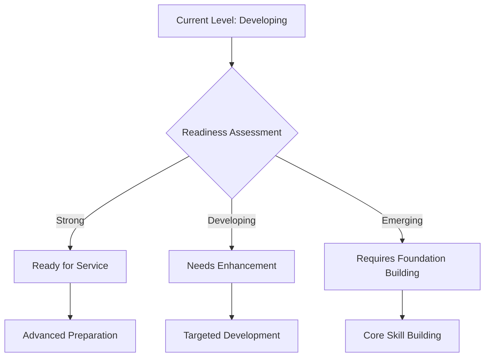

# ⚖️ UPSC GS Paper II Evaluation Report

## 📊 Overall Evaluation Dashboard

### 📈 Performance Summary
> **Focus**: This evaluation highlights a candidate with significant potential, demonstrating a strong grasp of current affairs and an impressive ability to connect them with static syllabus components. The answer book consistently attempts to address the multi-dimensional demands of UPSC questions, often employing a structured approach with clear introductions, categorized body paragraphs, and solution-oriented conclusions. The candidate excels in content breadth, frequently citing relevant committees, government schemes, international agreements, and contemporary examples, which adds substantial value to the answers. This broad knowledge base is a crucial strength for GS Paper II.

However, a critical area for development lies in **absolute factual and constitutional accuracy**. Recurring instances of misinterpretation of landmark judgments (e.g., Aruna Shanbaug, Subhash Kashinath Mahajan), misattribution of concepts, or inaccurate legal details (e.g., POCA year, specific article interpretations) pose a significant challenge. UPSC places paramount importance on precision in constitutional and governance matters. While the candidate attempts analytical rigor, it sometimes remains at a descriptive level rather than delving into deeper critical evaluation or nuanced arguments. The "way forward" sections, though consistently present, occasionally lack the practical feasibility or the systemic depth expected of a civil servant. Furthermore, the integration of external references, while commendable, sometimes appears forced or misapplied (e.g., "China Commune model" for Indian cooperatives, "Camp David accords" in IWT context), indicating a need for more discerning and precise application of knowledge. Developing a more refined and objective perspective, especially on contentious issues, will also be vital for civil service readiness. Overall, the foundation is strong, but meticulous refinement in accuracy, analytical depth, and solution quality is essential to elevate performance to the top echelons.

### ✅ Key Strengths
> **🌟 Impact Areas** - List 3-5 most impactful strengths:

-   **🎯 Question Understanding & Multi-dimensional Coverage**: The candidate consistently demonstrates an excellent ability to decipher the core demand of the questions, including multi-part components and directive verbs. Answers are structured to address diverse dimensions—constitutional, administrative, social, and international—as seen in the comprehensive analysis of India-Africa ties (Q19) and the Indo-Pacific construct (Q20). This holistic approach is crucial for high scores in GS-II.

-   **📚 Content Breadth & Current Affairs Integration**: A notable strength is the wide array of relevant examples, government initiatives (JJM, PM PVTG Mission), committee recommendations (Ashok Mehta, Pam Rajput, Turkunde), and international developments (Abraham Accords, I2U2, FIPIC) seamlessly integrated into the answers. This demonstrates strong awareness of contemporary issues and their linkage to static syllabus topics, a hallmark of a well-prepared candidate.

-   **✍️ Structural Excellence**: The answers generally adhere to a logical and clear structure, featuring well-defined introductions, body paragraphs with distinct points or sub-headings, and solution-oriented conclusions. This organization significantly enhances readability and ensures that all parts of the question are addressed systematically, as evidenced in the detailed breakdown of local governance bottlenecks (Q11) and NCW's role (Q14).

-   **💡 Solution-Orientation & Civil Service Mindset**: The candidate consistently attempts to provide "way forward" suggestions, reflecting a progressive and problem-solving approach crucial for civil servants. While the quality varies, the consistent effort to offer implementable recommendations and consider future implications (e.g., for social infrastructure in Q8, water diplomacy in Q10) is a commendable aspect of the candidate's approach.

### ⚡ Primary Development Areas
> **⚠️ Priority Focus** - List 3-5 most important areas for development with reasoning:

-   **⚖️ Absolute Factual & Constitutional Accuracy**: This is the **critical priority**. Several answers contain significant factual inaccuracies or misinterpretations of constitutional provisions and landmark judgments. For instance, the misattribution of the *Aruna Shanbaug* case to "right to die with dignity" in the capital punishment context (Q3) or the *Shreya Singhal* judgment to judicial vacancy (Q12) are high-impact errors. Similarly, inaccuracies in the original year of POCA (Q13) or the precise nature of *Subhash Kashinath Mahajan* case (Q18) undermine credibility. UPSC demands impeccable precision in legal and constitutional matters.
    *   **Reasoning**: Such errors, regardless of other strengths, can lead to severe mark deductions and raise questions about the foundational understanding of governance and constitutional principles, which are non-negotiable for a civil servant.

-   **🧠 Analytical Rigor & Nuance**: While the candidate lists many points, the analysis often remains descriptive rather than deeply evaluative or critical. For example, in Q12, framing legislative reforms as "executive encroachment" or justifying it as "sometimes necessary" lacks the nuanced understanding of separation of powers and checks & balances. Similarly, in Q7, the strong statement "third frontier of warfare" for civil society, while reflecting a viewpoint, needs to be presented with more objectivity and balance in a UPSC answer.
    *   **Reasoning**: Superficial analysis prevents the candidate from demonstrating higher-order thinking skills like critical evaluation, synthesis, and the ability to navigate complex, multi-stakeholder issues with a balanced perspective, which are essential for administrative roles.

-   **🔍 Precision in Terminology & Evidence Integration**: The answer book occasionally uses vague or slightly off-topic references (e.g., "Sinquan Nai," "Metory Corps," "Pillanenberg Principle"). More critically, foreign models or international legal frameworks are sometimes misapplied to the Indian context (e.g., "China Commune model" for cooperatives in Q5, "Helsinki Rules" for inter-state water disputes in Q10) without adequate justification or contextualization.
    *   **Reasoning**: Lack of precision in terminology and inappropriate evidence integration can dilute the quality of arguments and make answers appear less authoritative. UPSC values specific, relevant, and accurately applied knowledge.

### 🏛️ Civil Service Readiness
> **🎯 Administrative Preparedness Assessment**

The candidate demonstrates a foundational understanding of the administrative landscape and policy challenges, crucial for civil service. The consistent effort to provide solution-oriented approaches and integrate current government initiatives (JJM, PM PVTG, FIPIC) shows an inclination towards practical problem-solving. This forward-looking perspective, coupled with a commendable breadth of knowledge across various GS-II domains like governance, social justice, and international relations, indicates a promising aptitude for administrative roles. The ability to structure answers logically and cover multiple dimensions also reflects an organized thought process essential for effective administration.

However, to truly excel in civil service, the candidate must cultivate a more rigorous approach to factual accuracy and legal precision. Misinterpretations of constitutional provisions or landmark judgments, as observed in several answers, are significant red flags. A civil servant's decisions are often based on strict adherence to legal frameworks and accurate interpretation of facts. The analytical depth also needs enhancement; moving beyond describing issues to critically evaluating their root causes, systemic implications, and the feasibility of proposed solutions is vital. The solutions offered, while present, need to be more deeply rooted in administrative realities, considering implementation challenges, stakeholder buy-in, and resource constraints. Furthermore, developing a balanced and objective perspective, especially on politically sensitive topics, is paramount for maintaining impartiality and trust in public service. The candidate is currently in a "Developing" phase, possessing strong raw potential but requiring targeted refinement in precision, analytical depth, and practical administrative thinking to transition towards a "Ready for Service" state.

### 🎯 UPSC Standard Alignment
> **📈 Benchmarking Against Excellence**

The candidate's performance aligns with UPSC standards in several key areas: comprehensive question addressing, structured presentation, and integration of diverse examples. The attempt to provide multi-dimensional analysis and solution-oriented conclusions demonstrates an understanding of UPSC's expectations for a holistic perspective. The consistent use of specific reports, committees, and constitutional articles, even if sometimes with minor inaccuracies, shows an awareness of the type of evidence valued by examiners.

However, the current level falls short of the "Excellence" benchmark due to persistent issues in **absolute accuracy** and **depth of critical analysis**. UPSC examiners rigorously assess factual correctness, especially in constitutional and legal domains. The observed inaccuracies would lead to significant deductions, irrespective of the breadth of content. While the candidate identifies issues, the underlying analytical rigor often lacks the incisiveness to delve into causal relationships, systemic failures, or nuanced policy implications. The balance between theoretical knowledge and practical application, while attempted, needs refinement. For instance, the "way forward" sections, though present in every answer, often lack the innovative yet feasible solutions that distinguish top-scoring answers. To achieve "Excellence," the candidate must cultivate meticulous attention to detail, develop a more profound critical lens, and ensure that every piece of information and every argument presented is both accurate and strategically deployed to demonstrate a sophisticated understanding of governance and constitutional principles.

---

## 📝 Individual Answer Analysis

### 🎯 Question 1: 
**❓ Question Text**: Discuss the role of the 'Fourth Estate' in upholding democratic values and analyse the issues affecting press freedom in India.
**📚 Syllabus Area**: `GS-II: Governance, Constitution, Polity`

#### 🔄 Answer Comparison

##### 📝 Your Answer Summary
> **💡 Key Points from Your Response** *(50-80 words)*:
The answer effectively defines the Fourth Estate through the *Romesh Thappar* case and Article 19, outlining its role in upholding democratic values by ensuring freedom of speech, exposing corruption, and mainstreaming public issues with relevant examples. It identifies critical issues affecting press freedom, such as fake news, corporate takeover, chilling effect from government over-governance, and media trials. The way forward suggests self-regulation, drawing from the *Brij Mohan* case, and empowering bodies like the Press Council of India.

##### ⭐ Ideal Answer Framework
> **🌟 UPSC Excellence Standard** *(100-150 words for 10m questions, 150-200 words for 15m questions)*:
An ideal answer would define the Fourth Estate as a critical pillar of democracy, emphasizing its role in informing the public, holding power accountable, and fostering deliberative democracy, referencing Article 19(1)(a) and landmark judgments like *Romesh Thappar* and *Indian Express Newspapers v. Union of India*. It would then detail issues affecting press freedom, including government control (e.g., sedition laws, IT Rules), corporate influence, ethical lapses (fake news, yellow journalism), economic pressures, and safety concerns for journalists. The way forward should propose multi-pronged solutions: strengthening independent regulatory bodies, promoting media literacy, ensuring financial viability without compromising editorial independence, legal reforms (e.g., anti-SLAPP laws), and fostering self-regulation while upholding constitutional freedoms.

#### 📝 Evaluation Criteria

##### 💡 Relevance and Understanding
**🔎 Analysis** *(400-800 words)*:
The candidate demonstrates a clear understanding of the core demands of the question, successfully addressing both the "role of the Fourth Estate in upholding democratic values" and the "issues affecting press freedom." The introduction correctly establishes the constitutional backing for press freedom by citing the *Romesh Thappar* case and its characterization of the press as a "palladium of liberty." This sets an appropriate tone and context.

For the role of the Fourth Estate, the points are highly relevant and well-supported with contemporary examples like "Panama Papers," "Nadi tapes," "Manipur ethnic violence," and "Anand Rai Vyapam exposure." These examples effectively illustrate the press's function in ensuring transparency, accountability, and public discourse. The inclusion of "deliberative democracy" further enhances the analytical depth by linking press freedom to a broader democratic ideal.

Similarly, the analysis of issues affecting press freedom is comprehensive and pertinent. "Fake news, yellow journalism," "corporate takeover," "chilling effect due to over-governance," and "media trials" are all critical challenges faced by the Indian media today. The examples provided (Sudarshan TV, MediaOne case, Sushant Singh Rajput case) are specific and directly illustrate the points, showcasing the candidate's awareness of current events. The linkage of the "chilling effect" to specific government actions or judicial interventions (like MediaOne) is particularly insightful.

The "way forward" section, though brief, attempts to provide actionable solutions, emphasizing self-regulation and institutional strengthening. Overall, the answer is highly relevant, demonstrating a strong grasp of the subject matter and the ability to apply theoretical concepts to real-world scenarios.

**✅ Suggestions** *(1-2 actionable suggestions, 100-250 words each)*:
-   ✅ To further enhance relevance, consider explicitly linking the "role" section to more democratic values beyond just freedom of speech. For instance, the press's role in promoting civic engagement, protecting minority voices, fostering national unity, and acting as a check on all three branches of government (legislature, executive, judiciary) could be elaborated. This would demonstrate a deeper understanding of "democratic values" as a comprehensive concept, rather than focusing predominantly on accountability and information dissemination.
-   ✅ While the examples provided are excellent, ensure that the *implications* of these issues are clearly articulated. For example, the "chilling effect" doesn't just mean over-governance; it leads to self-censorship, reduced investigative journalism, and a less vibrant public sphere. Similarly, corporate takeovers don't just question integrity; they can lead to biased reporting, suppression of critical stories, and a shift from public interest to commercial interests. Explicitly stating these implications will add analytical depth.

##### 🏗️ Structure and Organization
**🔎 Analysis** *(300-600 words)*:
The answer is well-structured and organized, contributing significantly to its clarity and readability. The use of clear headings ("Role of Fourth Estate in upholding democracy," "Issues affecting freedom of press," "Way forward") breaks down the complex question into manageable sections, making it easy for the examiner to follow the arguments. The point-wise presentation within each section further enhances readability, allowing for quick comprehension of distinct ideas.

The introduction effectively sets the context by immediately linking the Fourth Estate to democratic values and constitutional principles. The body paragraphs flow logically, first discussing the positive roles, then transitioning to the challenges, and finally offering solutions. This "problem-solution" approach is effective for UPSC answers. The use of specific examples immediately after each point strengthens the arguments and provides concrete illustrations, preventing the answer from being purely theoretical.

However, there's a slight imbalance in the depth of elaboration for some points. While the examples are good, some points could benefit from a sentence or two explaining *how* the example illustrates the point, rather than just listing it. For instance, for "Mainstreams Issue of public importance. eg Manipur ethnic violence," a brief explanation of how media coverage influenced public or government response would add more value. The conclusion, while present, is quite concise and could be expanded to offer a more forward-looking and impactful closing statement. Overall, the structural foundation is strong, providing a solid framework for the content.

**✅ Suggestions** *(1-2 actionable suggestions, 100-250 words each)*:
-   ✅ While sub-headings are used effectively, consider adding a brief, overarching introductory sentence for each major section (e.g., "The Fourth Estate plays a multifaceted role in strengthening India's democratic fabric, primarily by...") and a concluding sentence for each section that summarizes the key takeaway before moving to the next. This would create smoother transitions and reinforce the main arguments.
-   ✅ Optimize the conclusion. Instead of a brief summary, aim for a forward-looking statement that encapsulates the essence of the arguments and offers a visionary outlook. For instance, "Ultimately, safeguarding press freedom is not merely about protecting journalists but about upholding the very essence of India's constitutional democracy, requiring continuous vigilance and multi-stakeholder collaboration to ensure its vibrant future."

##### ⚖️ Constitutional and Governance Knowledge
**🔎 Analysis** *(400-800 words)*:
The answer demonstrates a foundational understanding of constitutional provisions and governance mechanisms related to press freedom. The immediate reference to the *Romesh Thappar* case and Article 19(1)(a) (implicitly, as "freedom of speech" is mentioned) in the introduction is excellent, establishing the constitutional basis for the discussion. This shows an awareness of the legal framework underpinning the topic.

However, there's room for greater precision and depth in constitutional and governance knowledge. While Article 19 is mentioned, a more explicit discussion of its implications, including reasonable restrictions under Article 19(2), would provide a more balanced and complete constitutional perspective. For instance, the challenges related to "fake news" and "sensationalism" directly intersect with the grounds for reasonable restrictions.

The mention of "Press Council of India" as a body to be empowered shows an awareness of existing governance mechanisms, though its statutory nature and limited powers could also be briefly acknowledged as a challenge. The reference to the *Brij Mohan* case for "public good for press" is less commonly associated with this specific doctrine in the context of press freedom compared to other landmark cases. While the case deals with the public's right to know, it's not a direct articulation of media's "public good" doctrine in the way, for example, the *Sakal Papers* case discusses the relationship between freedom of speech and commercial interests. A more direct and well-known constitutional principle or a more prominent judgment on media ethics or public interest could have been cited.

The analysis of "chilling effect" and "over-governance" correctly identifies a key governance challenge, linking it to the executive's actions. This shows an understanding of the practical implications of governance on constitutional rights.

**Study Recommendations** *(2-3 specific recommendations, 100-250 words each)*:
-   📚 **Deepen Constitutional Law on Freedom of Speech**: Study Article 19(1)(a) and 19(2) comprehensively, including all grounds for reasonable restrictions (e.g., public order, defamation, incitement to an offense). Understand how these restrictions are interpreted by the Supreme Court. Familiarize yourself with landmark cases like *K.A. Abbas v. Union of India* (censorship), *Sakal Papers Ltd. v. Union of India* (commercial speech/press freedom), and *Shreya Singhal v. Union of India* (IT Act, Section 66A) to understand the evolving jurisprudence on press freedom. This will enable you to analyze the issues affecting press freedom with greater constitutional precision.
-   📚 **Master Governance Mechanisms for Media**: Research the structure, powers, and limitations of bodies like the Press Council of India (PCI), News Broadcasters & Digital Association (NBDA), and the Electronic Media Monitoring Centre (EMMC). Understand the debates around statutory vs. self-regulation for media. Explore government policies and laws related to media, such as the IT Rules, 2021, and the proposed Broadcasting Services (Regulation) Bill. This will provide a robust understanding of the institutional and regulatory landscape.
-   📚 **Explore Global Best Practices & Comparative Analysis**: Read about how press freedom is regulated and protected in other mature democracies (e.g., UK, USA, European Union). Understand concepts like "right to information," "privacy," "data protection," and "anti-SLAPP laws" in relation to media. A comparative perspective can enrich your "way forward" suggestions, offering diverse and innovative solutions.

##### 🧠 Analytical Rigor and Critical Thinking
**🔎 Analysis** *(500-1000 words)*:
> **⚠️ HIGH PRIORITY** - The answer demonstrates a good foundational level of analytical rigor by clearly dissecting the question into its two main components (role and issues) and providing relevant examples for each. The ability to connect theoretical concepts like "Fourth Estate" and "deliberative democracy" with real-world incidents (e.g., Panama Papers, MediaOne case) shows a commendable capacity for applied analysis. This moves beyond mere description towards illustrating the practical impact of press freedom (or its absence).

However, the analytical depth could be further enhanced by delving into the *interconnections* and *causal relationships* between the identified issues and their broader implications for democratic values. For instance, while "corporate takeover" and "chilling effect" are listed as separate issues, a deeper analysis would explore how corporate ownership can *exacerbate* the chilling effect by prioritizing commercial interests over critical reporting, especially on government policies that favor large corporations. Similarly, the discussion on "fake news" could be critically examined not just as an issue, but also as a challenge to the very notion of truth and public trust, which are foundational to democratic values.

The "way forward" section, while present, could benefit from a more critical evaluation of the suggested solutions. For example, "self-regulation" is proposed, but a critical thinker would also acknowledge its inherent limitations (e.g., lack of punitive powers, industry capture) and suggest ways to overcome them, perhaps through robust independent oversight or legally binding codes of conduct. The *Brij Mohan* case reference, while attempting to add a legal dimension, doesn't fully capture the nuanced legal debates around "public good" versus "commercial interests" in media, which would require a deeper dive into jurisprudence.

To elevate critical thinking, the candidate should consider offering a more nuanced perspective on the government's role – acknowledging its legitimate interest in national security or public order, while simultaneously critiquing overreach. This balanced approach, characteristic of high-scoring answers, demonstrates the ability to hold multiple perspectives simultaneously.

**✅ Suggestions** *(2-3 actionable suggestions, 100-250 words each)*:
-   ✅ **Develop Causal Linkages**: For each issue identified, analyze not just *what* it is, but *how* it impacts other aspects of press freedom and democratic values, and *why* it persists. For example, for "corporate takeover," discuss how it leads to conflict of interest, biased reporting, and reduced critical journalism, thus eroding the "watchdog" function of the press. For "chilling effect," explain how fear of reprisal leads to self-censorship, thereby limiting the diversity of views and public discourse.
-   ✅ **Integrate Multi-Stakeholder Analysis**: Beyond identifying issues, analyze them from the perspective of different stakeholders: the government, media owners, journalists, citizens, and advertisers. How do their conflicting interests contribute to the challenges? For example, media trials satisfy public demand for immediate justice but undermine due process, creating a tension between public interest and legal ethics. This multi-stakeholder lens adds significant depth to your analysis.
-   ✅ **Strengthen Solution Feasibility & Nuance**: When proposing solutions, critically evaluate their practical feasibility and potential challenges. For "self-regulation," discuss how to make it more effective (e.g., through independent ombudsmen, transparent grievance redressal, or linking it to statutory recognition). Avoid simplistic solutions and instead propose multi-faceted approaches that address the complexity of the issues, demonstrating a mature and administrative mindset.

##### 📈 Evidence and Substantiation
**🔎 Analysis** *(300-600 words)*:
The answer is well-substantiated with a variety of relevant examples, which is a significant strength. The inclusion of specific instances like "Panama Papers," "Nadi tapes," "Manipur ethnic violence," and "Anand Rai Vyapam exposure" for the role of the Fourth Estate, and "UPSC Jihad Sudarshan TV," "MediaOne case," and "Sushant Singh Rajput case" for the issues, demonstrates a strong awareness of contemporary events and their direct applicability. This level of factual detail adds credibility and weight to the arguments.

The citation of the *Romesh Thappar* case is an excellent legal reference, grounding the argument in constitutional jurisprudence. The mention of Article 19, even if brief, further strengthens the constitutional basis.

However, there are minor areas where substantiation could be more precise or impactful. While the *Brij Mohan* case is cited, its direct relevance to the "public good for press" doctrine in this context is not as strong as other cases might be, suggesting a need for more strategic selection of legal evidence. Some general statements, while true, could be backed by statistics or reports if word limits permit (e.g., the extent of corporate ownership, or data on journalist safety). Overall, the candidate effectively uses evidence to support claims, making the answer concrete and persuasive.

**⚡ Value Addition Suggestions** *(1-2 suggestions, 100-250 words each)*:
-   ⚡ **Diversify and Deepen Legal Evidence**: Beyond landmark Supreme Court cases, consider incorporating relevant Law Commission of India reports (e.g., on sedition laws, media ethics) or recommendations from parliamentary committees. For instance, the Law Commission's views on the misuse of sedition law (Section 124A IPC) directly bear on press freedom. Similarly, mention relevant international indices like the World Press Freedom Index (Reporters Without Borders) to provide a global comparative perspective on India's standing, adding a quantitative dimension to your analysis of challenges.
-   ⚡ **Quantify Where Possible**: While qualitative examples are excellent, supplementing them with relevant statistics can enhance impact. For instance, data on journalist attacks, media ownership concentration, or the number of defamation cases against media houses, if remembered, could add a powerful quantitative layer to your arguments on the issues affecting press freedom. This demonstrates a comprehensive grasp of the empirical reality.

##### 💡 Solution Orientation and Civil Service Mindset
**🔎 Analysis** *(400-800 words)*:
> **⚠️ HIGH PRIORITY** - The candidate consistently attempts to provide a "way forward," demonstrating a solution-oriented approach that is essential for a civil servant mindset. The suggestions for "self-regulation" and "empowering Press Council of India" are relevant and reflect a constructive outlook towards improving the media landscape. This shows an understanding that identifying problems must be followed by proposing actionable remedies.

However, the quality and depth of the solutions could be significantly enhanced to truly reflect a mature civil service mindset. The suggestions, while correct, often remain somewhat generic or lack the systemic detail required for effective implementation. For example, "self-regulation" is a good start, but a civil servant would explore *how* to make it more robust—perhaps through independent oversight mechanisms, linking it to professional standards, or designing a transparent grievance redressal system. Similarly, "empowering Press Council of India" needs specifics: should it be given more punitive powers? Should its composition be altered to ensure greater independence?

A civil servant mindset also involves considering the practical feasibility and potential challenges of implementing solutions. The answer doesn't explicitly address who would be responsible for implementing these solutions or the potential resistance they might face. Moreover, the solutions could be more multi-faceted, encompassing legal reforms (e.g., anti-SLAPP laws), technological solutions (e.g., AI for fact-checking), and educational initiatives (e.g., media literacy for citizens), beyond just regulatory bodies and self-discipline. Developing solutions that are both progressive and implementable within the existing constitutional and administrative framework is crucial.

**✅ Suggestions** *(1-2 actionable suggestions, 100-250 words each)*:
-   ✅ **Propose Multi-faceted & Systemic Solutions**: Beyond self-regulation, suggest a holistic approach that includes: (a) **Legislative reforms**: Enacting Anti-SLAPP (Strategic Lawsuits Against Public Participation) laws to protect journalists from vexatious litigation. (b) **Technological solutions**: Promoting AI-based fact-checking tools and digital literacy campaigns to combat fake news. (c) **Economic measures**: Exploring models that ensure financial independence for media houses, reducing reliance on corporate or government patronage, perhaps through public funding models or subscription-based journalism.
-   ✅ **Focus on Implementation Feasibility & Stakeholder Buy-in**: When proposing solutions, briefly consider the practical steps for implementation and the different stakeholders involved. For instance, for empowering PCI, mention the need for legislative amendments and consensus among media bodies. For promoting media literacy, highlight the role of educational institutions and civil society organizations. This demonstrates an understanding of the complexities of policy implementation in a democratic setup.

#### 💡 Key Insights
> **🌟 Strategic Takeaways** - 3-4 core strategic lessons from this answer:

-   🎯 **Strong Foundational Knowledge**: The candidate possesses a solid base of knowledge regarding press freedom, its constitutional underpinnings, and contemporary challenges. This allows for a relevant and structured response to the question's demands.
-   🔄 **Effective Use of Current Affairs**: The ability to integrate a wide range of recent events and examples (Panama Papers, MediaOne case, Manipur violence) is a significant asset, making the answer dynamic and relevant, which is highly valued in UPSC Mains.
-   ⚖️ **Need for Precision in Legal/Constitutional References**: While constitutional articles and cases are cited, a meticulous approach to their exact implications and context is crucial. Misinterpretations can undermine the overall quality and accuracy of the answer.
-   🛠️ **Opportunity to Elevate Solution Quality**: The consistent inclusion of "way forward" sections is commendable, but these can be significantly enhanced by proposing more specific, multi-faceted, and practically feasible solutions that reflect a deeper administrative understanding.

#### 📝 Next Steps
> **✅ Action Plan** - 3-4 specific, actionable tasks for the student:

-   [ ] **Review Constitutional & Legal Judgments**: Dedicate time to thoroughly re-read landmark Supreme Court judgments related to freedom of speech and press. Focus on understanding the precise ratio decidendi (reason for decision) and its implications, not just the case name. Pay special attention to the nuances of fundamental rights and their reasonable restrictions.
-   [ ] **Practice Critical Evaluation of Solutions**: For every problem identified in your study, brainstorm at least 3-5 multi-dimensional solutions. For each solution, critically evaluate its strengths, weaknesses, potential implementation challenges, and the stakeholders involved. This will help you offer more robust and feasible "way forward" suggestions in your answers.
-   [ ] **Refine Evidence Integration**: While your use of examples is strong, practice integrating them more seamlessly into your arguments. Ensure that each example clearly and directly supports the point being made, and consider briefly explaining *how* it illustrates the point, rather than just listing it.
-   [ ] **Targeted Reading on Media Governance**: Read specific reports and articles on media regulation, ethics, and the role of various media bodies (PCI, NBDA, etc.) in India. Understand the debates around self-regulation vs. statutory regulation to strengthen your arguments on press freedom challenges and solutions.

---

### 🎯 Question 2: 
**❓ Question Text**: The electoral process, though inclusionary in theory, has been pointed out for exclusionary tendencies in practice. Analyse, with special emphasis on role of women in India's representative electoral system.
**📚 Syllabus Area**: `GS-II: Governance, Constitution, Polity, Social Justice`

#### 🔄 Answer Comparison

##### 📝 Your Answer Summary
> **💡 Key Points from Your Response** *(50-80 words)*:
The answer begins by highlighting India's low female representation in the 17th Lok Sabha despite theoretical inclusion. It identifies universal adult franchise, common electoral rolls (Article 325), RPA provisions, and women political party presidents as inclusionary aspects. Exclusionary practices include criminalization of politics, fear, public patriarchy, "Sarpanch Pati" syndrome, lack of human capital due to infanticide, and gendered violence. Solutions proposed are the Women Reservation Bill, Zipper System, and general women empowerment initiatives, aiming for a participative, woman-led democracy.

##### ⭐ Ideal Answer Framework
> **🌟 UPSC Excellence Standard** *(100-150 words for 10m questions, 150-200 words for 15m questions)*:
An ideal answer would first establish the theoretical inclusionary framework of India's electoral system, citing universal adult franchise (Art 326), common electoral rolls (Art 325), and reservations in local bodies (Arts 243D, 243T). It would then transition to practical exclusionary tendencies, particularly emphasizing women's underrepresentation. This would involve discussing socio-cultural barriers (patriarchy, gender roles), economic disempowerment, political party dynamics (lack of internal democracy, 'winnability' criteria), criminalization of politics, and instances like 'Sarpanch Pati' syndrome. The analysis should also cover challenges faced by women candidates and voters. The way forward must propose concrete steps like immediate passage of the Women's Reservation Bill, internal party quotas, state funding of elections, promoting gender-sensitization, and enhancing women's political literacy and capacity building.

#### 📝 Evaluation Criteria

##### 💡 Relevance and Understanding
**🔎 Analysis** *(400-800 words)*:
The candidate demonstrates a strong understanding of the core demand of the question, successfully analyzing both the theoretical inclusionary aspects and the practical exclusionary tendencies of India's electoral process, with a commendable emphasis on the role of women. The introduction effectively sets the stage by providing a relevant statistic on women's representation in the 17th Lok Sabha, immediately highlighting the disparity between theory and practice.

The points outlining the "inclusionary in theory" aspects are largely relevant, citing constitutional provisions like Article 325 (common electoral roll) and the RPA, 1951. The inclusion of "Panchayati Raj Reservation" is a strong point, as it represents a significant step towards women's political inclusion at the grassroots.

The section on "exclusionary in practice" is particularly well-developed and insightful. It identifies a range of pertinent issues, from the broad (criminalization of politics, fear, public patriarchy) to the specific (Sarpanch Pati Syndrome, gendered violence). These points accurately reflect the ground realities and systemic barriers faced by women in electoral politics. The examples, such as "Manipur ethnic violence" (though the direct link to women's electoral exclusion needs to be clearer, it broadly relates to social barriers) and "Fatima Bi in Andhra" (while needing context, suggests awareness of specific incidents), add a layer of specificity.

The "way forward" section proposes relevant and impactful solutions like the Women Reservation Bill and the Zipper System, demonstrating a progressive and problem-solving approach. The answer is highly relevant to the question's demands, showcasing a good grasp of the subject matter and an ability to apply concepts to the Indian context.

**✅ Suggestions** *(1-2 actionable suggestions, 100-250 words each)*:
-   ✅ To further strengthen the "inclusionary in theory" section, explicitly cite Article 326 (universal adult franchise) as the primary constitutional provision guaranteeing voting rights to all citizens, including women, without discrimination. While Article 325 is relevant for common electoral rolls, Article 326 directly addresses the franchise itself, which is a cornerstone of theoretical inclusion. This would enhance the constitutional precision of your argument.
-   ✅ For some of the "exclusionary in practice" points, consider elaborating on the *causal link* more explicitly. For instance, for "lack of Human Capital for women due to extended infanticide," while it reflects a broader societal issue, its direct impact on *electoral exclusion* needs to be clearly articulated (e.g., how it limits their access to education, leadership skills, and resources necessary for political participation).

##### 🏗️ Structure and Organization
**🔎 Analysis** *(300-600 words)*:
The answer is very well-structured and organized, which significantly enhances its clarity and impact. The candidate effectively uses distinct headings ("electoral Process Inclusionary in theory," "Electoral Process Exclusionary in Practice," "Way forward") to categorize the arguments, making the answer easy to follow and ensuring all parts of the question are addressed systematically.

The introduction, with its relevant statistic, immediately establishes the central theme of the answer. The point-wise presentation within each section is highly effective, allowing for clear articulation of individual ideas and their supporting examples. This format aids readability and allows the examiner to quickly grasp the breadth of points covered.

The flow from theoretical inclusion to practical exclusion is logical, setting up the problem before proposing solutions. The examples provided are generally placed immediately after the points, strengthening the substantiation.

However, there's a minor point regarding the conclusion. While a "way forward" is provided, the overall conclusion could be slightly more impactful, perhaps by reiterating the central thesis or offering a broader vision for women's political participation in India's democracy. Despite this, the structural foundation of the answer is commendable and effectively supports the content.

**✅ Suggestions** *(1-2 actionable suggestions, 100-250 words each)*:
-   ✅ Ensure that the transition between major sections is smooth. While headings are clear, a brief linking sentence at the end of one section, hinting at the next, can improve flow. For example, after discussing inclusionary theories, you could add: "Despite these constitutional and legal guarantees, the ground reality reveals significant exclusionary tendencies, particularly impacting women's political participation."
-   ✅ Consider grouping related points under broader sub-themes within the "Exclusionary in Practice" section. For instance, "fear," "public patriarchy," and "gendered violence" could fall under "Socio-cultural Barriers," while "criminalisation of politics" and "Sarpanch Pati Syndrome" could be under "Political & Systemic Barriers." This adds another layer of organization and analytical depth.

##### ⚖️ Constitutional and Governance Knowledge
**🔎 Analysis** *(400-800 words)*:
The answer demonstrates a good understanding of relevant constitutional provisions and legal frameworks related to the electoral process and women's participation. The mention of Article 325 for a common electoral roll is accurate, highlighting a key aspect of non-discrimination. The reference to "Panchayati Raj Reservation" is also very strong, as it directly relates to constitutional provisions (Articles 243D, 243T) that mandate reservations for women at the local level, a significant governance reform. The citation of RPA, 1951, Section 123, which prohibits appealing for votes on the basis of gender, further illustrates an awareness of electoral laws.

However, a critical point for improvement lies in the precision of constitutional articles. While Article 325 is relevant, the primary article guaranteeing universal adult franchise, which is fundamental to "inclusionary in theory," is **Article 326**. Explicitly citing Article 326 would provide a more complete and accurate constitutional foundation for the theoretical inclusion.

The discussion of "Sarpanch Pati Syndrome" demonstrates a practical understanding of how governance mechanisms at the local level can be undermined by societal norms, leading to de facto exclusion despite de jure inclusion. This highlights a nuanced grasp of governance challenges. The mention of the "Women Reservation Bill (108th CAB)" as a way forward shows awareness of ongoing legislative efforts to address these governance gaps at the parliamentary level.

Overall, the candidate possesses a solid base of constitutional and governance knowledge, but striving for greater precision in citing articles and a deeper understanding of their exact scope will elevate the quality of the answer.

**Study Recommendations** *(2-3 specific recommendations, 100-250 words each)*:
-   📚 **Master Constitutional Provisions for Elections**: Study Articles 324-329 of the Constitution thoroughly, focusing on the powers of the Election Commission (Art 324), universal adult franchise (Art 326), and common electoral rolls (Art 325). Additionally, revisit Articles 243D and 243T for reservations in Panchayats and Municipalities, understanding their impact on women's political representation.
-   📚 **Explore Electoral Reforms & Committees**: Familiarize yourself with major electoral reform recommendations from committees like the Dinesh Goswami Committee, Indrajit Gupta Committee, Law Commission of India reports, and the Election Commission's proposals. Understand their suggestions regarding criminalization of politics, internal party democracy, and state funding of elections, which directly impact the exclusionary tendencies.
-   📚 **Gender & Governance Studies**: Read reports and studies on women's political participation in India, such as those by the PRS Legislative Research, Association for Democratic Reforms (ADR), and various women's rights organizations. Focus on understanding the socio-economic, cultural, and political barriers that contribute to women's underrepresentation, including the nuances of "Sarpanch Pati Syndrome" and gendered violence in politics.

##### 🧠 Analytical Rigor and Critical Thinking
**🔎 Analysis** *(500-1000 words)*:
> **⚠️ HIGH PRIORITY** - The answer demonstrates a good level of analytical rigor by effectively dissecting the question into its theoretical and practical dimensions. The contrast between "inclusionary in theory" and "exclusionary in practice" is well-maintained throughout, which is a strong analytical framework. The candidate moves beyond mere description by identifying various systemic and societal factors contributing to the exclusion of women, such as public patriarchy, "Sarpanch Pati" syndrome, and gendered violence. This shows an ability to identify underlying causes rather than just surface-level observations.

However, there's scope for enhancing the depth of critical thinking. For instance, while "criminalisation of politics" is correctly identified as an exclusionary factor, a deeper analysis would explore *how* it specifically impacts women (e.g., women being less likely to enter politics due to the perceived unsavory environment, or parties preferring "winnable" male candidates with muscle power). Similarly, the point on "lack of Human Capital for women due to extended infanticide" is a broad societal issue, and its direct analytical link to *electoral exclusion* needs to be more explicitly forged (e.g., how it limits educational opportunities, confidence, and access to networks necessary for political leadership).

The "way forward" section, while offering relevant solutions like the Women Reservation Bill and Zipper System, could benefit from a more critical examination of their potential challenges or prerequisites for success. For example, simply passing the Women Reservation Bill doesn't guarantee genuine empowerment if patriarchal structures within parties or society persist. A critical thinker would discuss the need for complementary measures like internal party democracy, capacity building for women leaders, and broader societal gender sensitization. Overall, the analysis is sound, but pushing for more explicit causal links and a deeper critical evaluation of solutions will elevate the answer significantly.

**✅ Suggestions** *(2-3 actionable suggestions, 100-250 words each)*:
-   ✅ **Deepen Causal Analysis for Exclusion**: For each exclusionary factor, go beyond stating the problem to explain *why* it leads to exclusion. For example, for "Public patriarchy," explain how it leads to gender stereotyping, resistance to female leadership, and unequal distribution of household responsibilities, all of which hinder women's political careers. For "Sarpanch Pati Syndrome," explain how it undermines the spirit of reservation and perpetuates proxy leadership, preventing genuine women's empowerment.
-   ✅ **Critically Evaluate Solutions**: When proposing solutions, briefly discuss their potential impact and any necessary complementary measures. For instance, for the Women Reservation Bill, acknowledge the debate around its implementation (e.g., rotation of seats, sub-quotas) and emphasize that it must be accompanied by measures to foster internal party democracy and leadership training for women. For the Zipper System, explain how it ensures women are placed in winnable seats, but also consider its challenges in a diverse multi-party system.
-   ✅ **Integrate Socio-Economic Dimensions More Explicitly**: While touched upon, explicitly analyze how socio-economic factors like literacy rates, economic independence, and access to resources contribute to or mitigate women's electoral exclusion. For instance, how economic empowerment can provide women with the financial means and independence to pursue political careers, reducing their reliance on male family members or political patrons.

##### 📈 Evidence and Substantiation
**🔎 Analysis** *(300-600 words)*:
The answer is well-substantiated with a good mix of quantitative and qualitative evidence. The opening statistic on women's representation in the 17th Lok Sabha (14.6%) from PRS is an excellent use of data, immediately grounding the argument in factual reality. The citation of constitutional articles (Article 325) and specific legal provisions (RPA, 1951 - Section 123) demonstrates a solid understanding of the legal framework.

The use of specific concepts like "Sarpanch Pati Syndrome" and "Public patriarchy (Sylvia Walby)" adds depth to the analysis of exclusionary practices. While "Fatima Bi in Andhra" is cited as an example of gendered violence, providing a brief context or a more widely recognized case (if available) would enhance its impact. The mention of the "Women Reservation Bill (108th CAB)" and the "Pam Rajput Committee" for women empowerment also serves as strong evidence of awareness of ongoing policy debates and relevant official efforts. The reference to the "Zipper System (Uganda)" demonstrates a global perspective, enriching the proposed solutions.

Overall, the candidate effectively uses a variety of evidence to support the claims, making the arguments more credible and persuasive.

**⚡ Value Addition Suggestions** *(1-2 suggestions, 100-250 words each)*:
-   ⚡ **Quantify Impact of Criminalization**: For the point on criminalization of politics, consider citing data from organizations like the Association for Democratic Reforms (ADR) on the percentage of candidates with criminal records and how this correlates with their "winnability." This would strengthen the empirical basis of your argument about its exclusionary impact on women who may be deterred from entering such an environment.
-   ⚡ **Specific Examples of Women's Political Success**: While the answer focuses on challenges, briefly mentioning examples of women who have successfully navigated these barriers or initiatives that have genuinely empowered women at the grassroots (e.g., successful women sarpanches, women-led SHGs entering politics) could add a dimension of hope and illustrate best practices, balancing the narrative.

##### 💡 Solution Orientation and Civil Service Mindset
**🔎 Analysis** *(400-800 words)*:
> **⚠️ HIGH PRIORITY** - The candidate consistently provides a "way forward" section, which is a commendable demonstration of a solution-oriented approach, a key quality for a civil servant. The suggestions, such as the "Women Reservation Bill" and the "Zipper System," are highly relevant to the issue of women's political underrepresentation and reflect an awareness of ongoing policy debates and international best practices. The concluding statement about achieving "participative democracy" and "woman-led development" showcases a progressive and aspirational outlook.

However, to elevate the quality of solution orientation to a higher UPSC standard, the suggestions need to be more nuanced, comprehensive, and practical. While the Women Reservation Bill is crucial, a civil servant's perspective would also address the complexities of its implementation (e.g., debates around rotation of seats, sub-quotas for SC/ST women, or the need for internal party democracy). Simply passing the bill isn't a panacea; genuine empowerment requires complementary measures. Similarly, the Zipper System, while effective elsewhere, needs consideration of its adaptability to India's multi-party, diverse electoral landscape.

The solutions could also be broadened to include non-legislative measures that foster genuine empowerment. For instance, capacity building programs for women (leadership skills, public speaking, financial management), gender sensitization within political parties and society, media campaigns to promote positive images of women in politics, and state funding of elections (to reduce reliance on "muscle and money" power) are all critical for creating an enabling environment. A civil servant would think systemically, considering not just policy changes but also behavioral shifts and institutional strengthening. The current suggestions are a good start, but they need more depth and practical considerations.

**✅ Suggestions** *(1-2 actionable suggestions, 100-250 words each)*:
-   ✅ **Propose Complementary Non-Legislative Solutions**: Beyond legislative quotas, suggest practical measures such as: (a) **Capacity Building**: Launching extensive training programs for aspiring women politicians covering governance, public policy, communication, and campaign management. (b) **Gender Sensitization**: Implementing mandatory gender sensitization workshops for political party functionaries, voters, and media to challenge patriarchal norms. (c) **Financial Support**: Exploring mechanisms for state funding of elections or specific financial incentives for women candidates to level the playing field.
-   ✅ **Address Implementation Challenges for Solutions**: For the Women Reservation Bill, briefly acknowledge the historical hurdles and debates (e.g., demand for sub-quotas for OBC women, delimitation issues) and suggest how these could be addressed to ensure broader consensus and effective implementation. This demonstrates a realistic and administrative understanding of policy challenges.

#### 💡 Key Insights
> **🌟 Strategic Takeaways** - 3-4 core strategic lessons from this answer:

-   🎯 **Strong Analytical Framework**: The candidate effectively uses the "inclusionary in theory vs. exclusionary in practice" framework, which is excellent for dissecting such questions.
-   📊 **Effective Data and Example Usage**: The answer is rich with relevant statistics and specific examples (Sarpanch Pati, criminalization), making the arguments concrete and persuasive.
-   ⚖️ **Need for Precision in Constitutional Citations**: While constitutional awareness is present, ensuring absolute accuracy in citing articles (e.g., differentiating Art 325 and 326) is crucial for UPSC excellence.
-   💡 **Opportunity to Deepen Solution Nuance**: The "way forward" is relevant but can be strengthened by proposing more comprehensive, multi-faceted, and practically detailed solutions that address the systemic nature of the problems.

#### 📝 Next Steps
> **✅ Action Plan** - 3-4 specific, actionable tasks for the student:

-   [ ] **Master Constitutional Articles**: Create flashcards or a dedicated notebook for key constitutional articles related to elections, fundamental rights, and local governance. Focus on understanding the precise scope and interconnections of Articles 324, 325, 326, 243D, and 243T.
-   [ ] **Research Women's Political Empowerment**: Read case studies and reports on successful women in politics at various levels in India. Understand the specific challenges they overcame and the strategies they employed. This will provide practical insights for your "way forward" sections.
-   [ ] **Practice Multi-dimensional Solutions**: For every social justice or governance issue, practice brainstorming solutions that are not just legislative, but also socio-cultural, economic, technological, and administrative. Think about the actors involved in implementing each solution.
-   [ ] **Refine Example Selection**: For each point, aim to use the most impactful and widely recognized examples. If an example is less known, provide a brief, clear context to ensure the examiner understands its relevance.

---

### 🎯 Question 3: 
**❓ Question Text**: Human dignity, stemming from right to life, does not end with death penalty. In this context, throw light on various controversies surrounding capital punishment in the country.
**📚 Syllabus Area**: `GS-II: Governance, Constitution, Polity, Social Justice`

#### 🔄 Answer Comparison

##### 📝 Your Answer Summary
> **💡 Key Points from Your Response** *(50-80 words)*:
The answer states that capital punishment is upheld by the Supreme Court in the *Bachhan Singh* case ("rarest of rare") and notes India as one of 35 practicing countries. It argues human dignity persists beyond the death penalty, citing Article 21, India's reformatory justice system, state's moral responsibility, and incorrectly, the *Aruna Shanbaug* case for "right to die with dignity." Controversies highlighted include delays in mercy petitions (Article 72), questions on presidential discretion, manifest arbitrariness due to delays, and misuse of law (Nirbhaya case). Solutions focus on a comprehensive policy and strict adherence to *Bachhan Singh* guidelines.

##### ⭐ Ideal Answer Framework
> **🌟 UPSC Excellence Standard** *(100-150 words for 10m questions, 150-200 words for 15m questions)*:
An ideal answer would introduce capital punishment's legal standing in India, referencing *Bachhan Singh v. State of Punjab* (1980) and the "rarest of rare" doctrine. It would then assert that human dignity (Article 21) is an inherent and inalienable right, not extinguished by a death sentence, aligning with the reformative theory of justice. Controversies should include: its irreversible nature; potential for judicial error; socio-economic bias in application; lack of proven deterrent effect (Law Commission Report); arbitrary delays in mercy petitions (Article 72) and their "chilling effect" on convicts; violation of international human rights norms and India's position as an outlier among abolitionist nations; and the debate over its retributive vs. reformative purpose. The way forward should discuss the Law Commission's recommendations for abolition (except for terror cases), streamlining mercy petition processes, and ensuring fair trial standards.

#### 📝 Evaluation Criteria

##### 💡 Relevance and Understanding
**🔎 Analysis** *(400-800 words)*:
The candidate demonstrates a good understanding of the core demand of the question, successfully addressing both the theoretical link between human dignity and the death penalty, and the various controversies surrounding capital punishment in India. The introduction correctly establishes the legal framework by citing the *Bachhan Singh* case and the "rarest of rare" doctrine, which is fundamental to the topic.

The section arguing that "human dignity does not end with death penalty" attempts to provide a philosophical and constitutional basis, referencing Article 21 and the reformatory nature of India's justice system. This shows an appreciation for the ethical dimensions of the question.

The analysis of "controversies surrounding capital punishment" is comprehensive and highly relevant. Points such as "delay in processing mercy petition (Art 72)," "questions on discretionary power of President," "manifest arbitrariness due to indiscriminate delay," and "misuse of law (Nirbhaya Case)" are all valid and frequently debated issues. These points demonstrate an awareness of the procedural and ethical challenges in the application of capital punishment.

The "way forward" section, while concise, attempts to provide solutions by emphasizing a comprehensive policy and strict adherence to the *Bachhan Singh* guidelines. Overall, the answer is highly relevant to the question's demands, showcasing a strong grasp of the subject matter.

However, there is a **critical error** in the section on human dignity: the reference to the *Aruna Shanbaug* case. This case was about passive euthanasia and the right to die with dignity in that specific context, not about the fundamental right to die with dignity in relation to capital punishment. This misinterpretation is a significant factual inaccuracy that undermines the constitutional argument presented.

**✅ Suggestions** *(1-2 actionable suggestions, 100-250 words each)*:
-   ✅ **Correct Factual Errors**: Immediately rectify the misinterpretation of the *Aruna Shanbaug* case. Understand that while it discusses "right to die with dignity" in the context of passive euthanasia, it is entirely unrelated to capital punishment. For the argument on human dignity not ending with the death penalty, focus on broader philosophical principles (e.g., inherent worth of every individual) and constitutional interpretations of Article 21 emphasizing the right to a dignified life even in incarceration, without misattributing case laws.
-   ✅ **Expand Philosophical and Constitutional Link**: While you mention Article 21 and reformatory justice, elaborate on how human dignity is an inherent and inalienable right that cannot be forfeited, even by committing heinous crimes. Discuss how the state's moral obligation extends to upholding the dignity of all individuals, including convicts, and how this aligns with the reformative goal of punishment (transforming individuals) rather than solely retributive (punishing for past wrongs).

##### 🏗️ Structure and Organization
**🔎 Analysis** *(300-600 words)*:
The answer is well-structured and organized, which aids in its clarity and readability. The candidate effectively uses distinct sections ("Human dignity not end with death penalty," "Controversy Surrounding Capital Punishment," "Way forward") to categorize the arguments, creating a logical flow from the conceptual premise to the practical controversies and then to proposed solutions.

The introduction, by immediately citing the *Bachhan Singh* case, effectively sets the legal context for the discussion. The point-wise presentation within each section is highly effective, allowing for clear articulation of individual ideas and their supporting examples. This format makes it easy for the examiner to follow the arguments and assess the breadth of points covered.

The flow from the philosophical justification (human dignity) to the practical challenges (controversies) is logical and coherent. The examples provided are generally well-integrated and serve to illustrate the points effectively.

However, the conclusion is quite brief. While it offers a "way forward," it could be expanded to provide a more impactful summary statement that reinforces the central theme of human dignity and the complexities of capital punishment. Despite this, the structural foundation of the answer is commendable and effectively supports the content.

**✅ Suggestions** *(1-2 actionable suggestions, 100-250 words each)*:
-   ✅ Ensure that the introduction clearly outlines the scope of your answer, explicitly stating that you will discuss both the philosophical/constitutional basis of human dignity in relation to capital punishment and the key controversies. This provides a clear roadmap for the examiner.
-   ✅ While point-wise presentation is good, consider adding a brief concluding sentence to each major section before moving to the next. For example, after discussing controversies, you could add: "These procedural and ethical challenges underscore the complex debate surrounding capital punishment, necessitating a re-evaluation of its role in a modern justice system." This creates smoother transitions and reinforces the section's main idea.

##### ⚖️ Constitutional and Governance Knowledge
**🔎 Analysis** *(400-800 words)*:
The answer demonstrates an awareness of key constitutional provisions and legal precedents related to capital punishment. The immediate mention of the *Bachhan Singh v. State of Punjab* case (1980) and the "rarest of rare" doctrine is excellent, as this judgment forms the bedrock of capital punishment jurisprudence in India. The citation of Article 21 (right to life and liberty) as fundamental to human dignity is also accurate and relevant.

The discussion of "mercy petition" under Article 72 (President's power) and the associated controversies regarding delay and presidential discretion shows a good understanding of the constitutional process and governance challenges in the application of capital punishment. The concept of "manifest arbitrariness" linked to delays is also a valid legal argument often raised in this context, demonstrating awareness of evolving legal principles.

However, there is a **significant factual and constitutional inaccuracy** regarding the *Aruna Shanbaug* case. This case dealt with passive euthanasia and the right to die with dignity in the context of prolonged vegetative states, not capital punishment. Misattributing this case to the context of human dignity in death penalty cases is a major error that undermines the constitutional accuracy of the answer. This indicates a need for more precise understanding and application of legal precedents.

While "reformatory justice system" is mentioned, a deeper understanding of its constitutional backing or how it contrasts with retributive justice in India's legal philosophy would enhance the answer. Overall, the candidate has a good base but needs to ensure absolute precision in constitutional and legal references.

**Study Recommendations** *(2-3 specific recommendations, 100-250 words each)*:
-   📚 **Master Capital Punishment Jurisprudence**: Study the evolution of capital punishment in India through key Supreme Court judgments. Beyond *Bachhan Singh* (1980), also understand *Machhi Singh v. State of Punjab* (1983) for aggravating/mitigating circumstances, *Shatrughan Chauhan v. Union of India* (2014) on mental health and mercy petition delays, and the Law Commission of India's 262nd Report (2015) recommending abolition. This will provide a comprehensive and accurate legal foundation.
-   📚 **Understand Article 21 & Human Dignity**: Delve deeper into the expansive interpretation of Article 21 by the Supreme Court, particularly its linkage to "right to live with dignity" even for prisoners. Understand how this principle is applied in various contexts, including prison reforms, access to legal aid, and the treatment of convicts, ensuring you do not conflate different judicial interpretations.
-   📚 **Procedures for Mercy Petitions**: Familiarize yourself with the detailed procedures and guidelines laid down by the Supreme Court regarding the disposal of mercy petitions by the President (Article 72) and Governors (Article 161). Understand the concept of "manifest arbitrariness" and "chilling effect" in the context of undue delays, as these are critical governance aspects of capital punishment.

##### 🧠 Analytical Rigor and Critical Thinking
**🔎 Analysis** *(500-1000 words)*:
> **⚠️ HIGH PRIORITY** - The answer demonstrates a good analytical framework by linking capital punishment to human dignity and then dissecting the controversies. The identification of issues like "delay in mercy petitions," "discretionary power," and "manifest arbitrariness" shows an understanding of the procedural and ethical complexities involved. This moves beyond mere description to highlight systemic challenges in the application of the death penalty.

However, the analytical rigor could be significantly enhanced by:
1.  **Addressing the "Aruna Shanbaug" error**: The misattribution of the *Aruna Shanbaug* case (passive euthanasia) to capital punishment is a major analytical flaw. It indicates a fundamental misunderstanding of the legal context and undermines the argument on human dignity. This needs immediate and thorough correction.
2.  **Broader Scope of Controversies**: While procedural controversies are well-covered, other critical aspects of the capital punishment debate are largely missed. These include:
    *   **Irreversibility**: The analytical implication of an irreversible punishment in the face of potential judicial error.
    *   **Deterrent Effect**: Critically examining the empirical evidence (or lack thereof, as per Law Commission reports) regarding its deterrent effect compared to life imprisonment.
    *   **Socio-economic Bias**: Analyzing how capital punishment disproportionately affects marginalized groups or those without adequate legal representation.
    *   **International Trends**: Discussing India's position as an outlier in the global trend towards abolition and the implications for its international human rights standing.
3.  **Nuance in "Way Forward"**: The solutions, while present, lack critical depth. "Comprehensive policy" and "incorporating Bachhan Singh judgment" are too general. A critical analysis would delve into *what* specific aspects of a comprehensive policy are needed (e.g., legal aid, appellate review, mental health assessment) and *how* to ensure stricter adherence to "rarest of rare" (e.g., through independent review mechanisms). The answer needs to move from listing observations to a deeper, multi-faceted critical evaluation of the system and its potential reforms.

**✅ Suggestions** *(2-3 actionable suggestions, 100-250 words each)*:
-   ✅ **Deepen Analysis of Controversies**: Systematically analyze other major controversies: (a) **Irreversibility**: Emphasize the risk of executing an innocent person due to potential judicial errors. (b) **Deterrent Effect**: Critically discuss the lack of conclusive evidence that capital punishment is a superior deterrent to life imprisonment, citing relevant studies or Law Commission reports. (c) **Socio-economic Bias**: Analyze how factors like poverty, caste, and lack of access to quality legal representation can lead to disproportionate application of the death penalty against marginalized sections.
-   ✅ **Enhance Critical Evaluation of "Rarest of Rare"**: While *Bachhan Singh* is the standard, critically analyze how the "rarest of rare" doctrine has been inconsistently applied, leading to subjective interpretations and a lack of uniformity in sentencing. Suggest ways to make its application more objective and less judge-centric, perhaps through clearer guidelines or a larger bench.
-   ✅ **Integrate International Perspectives**: Briefly discuss the global trend towards abolition of capital punishment and how India's retention places it against a significant portion of the international community. Analyze the implications of this stance for India's human rights diplomacy and its engagement with international legal frameworks.

##### 📈 Evidence and Substantiation
**🔎 Analysis** *(300-600 words)*:
The answer uses specific evidence effectively to substantiate its points, particularly in the section on controversies. The citation of the *Bachhan Singh* case and the "rarest of rare" doctrine is a strong foundational legal reference. The mention of Article 72 (mercy petition) directly links the procedural issues to the constitutional framework. The reference to the "Nirbhaya Case" is highly relevant as a contemporary example illustrating the protracted delays in execution and the emotional toll on victims and society.

However, the **critical factual error** regarding the *Aruna Shanbaug* case significantly undermines the credibility of the evidence in the section on human dignity. This misattribution is a major drawback and indicates a need for rigorous cross-verification of legal precedents. While the answer correctly identifies India as one of the countries still practicing capital punishment, a specific number or approximate figure (e.g., "over 50 countries" or "minority of nations") could enhance the precision of this statistic.

To strengthen substantiation further, the answer could have referenced specific Law Commission of India reports (e.g., 262nd Report on Capital Punishment) which provide detailed analysis and recommendations on the topic, offering a more authoritative source for arguments on deterrence, socio-economic bias, or the need for abolition. Overall, while some evidence is well-chosen, the critical error demands immediate attention.

**⚡ Value Addition Suggestions** *(1-2 suggestions, 100-250 words each)*:
-   ⚡ **Incorporate Law Commission Reports**: Directly cite the Law Commission of India's 262nd Report (2015) to substantiate arguments regarding the lack of a proven deterrent effect of capital punishment, its arbitrary application, and its recommendations for abolition (except for terror-related offenses). This adds significant weight and official backing to your critical analysis.
-   ⚡ **Reference International Human Rights Instruments**: Briefly mention relevant international conventions or resolutions (e.g., UN General Assembly resolutions calling for a moratorium on the use of the death penalty) to provide a global context and substantiate arguments about India's position as an outlier among abolitionist nations. This demonstrates a broader understanding of human rights norms.

##### 💡 Solution Orientation and Civil Service Mindset
**🔎 Analysis** *(400-800 words)*:
> **⚠️ HIGH PRIORITY** - The candidate demonstrates a solution-oriented approach by including a "way forward" section, which is a positive attribute for a civil servant. The suggestions for a "comprehensive policy by Home Ministry" and "incorporating Bachhan Singh judgment of aggravating/mitigating circumstances" indicate an awareness of the need for structured and legally sound solutions. The final statement about human dignity forming the "edifice of Criminal Justice System" reflects a progressive outlook.

However, the quality and specificity of the solutions need significant enhancement to align with a mature civil service mindset. "Comprehensive policy" is too vague; a civil servant would detail *what* such a policy should entail (e.g., guidelines for police investigation, legal aid for the poor, mental health assessment of convicts, strict timelines for appeals and mercy petitions). Similarly, "incorporating Bachhan Singh judgment" is about adherence, but the controversies highlight *lack of consistent adherence* and *arbitrariness*, so the solution should focus on mechanisms to ensure stricter and more objective application (e.g., through a larger constitutional bench for death penalty confirmation, or independent review committees).

A civil service mindset also involves considering the feasibility, constitutional compliance, and multi-stakeholder implications of proposed solutions. The current suggestions lack this depth. For instance, addressing the delays in mercy petitions would require procedural reforms within the executive and judicial branches, and perhaps even legislative amendments. The answer could benefit from proposing reforms that are both aspirational (upholding dignity) and practical (streamlining processes, ensuring fairness).

**✅ Suggestions** *(1-2 actionable suggestions, 100-250 words each)*:
-   ✅ **Propose Concrete Procedural Reforms**: Instead of general "comprehensive policy," suggest specific reforms: (a) **Streamline Mercy Petitions**: Establish clear, time-bound guidelines for the President/Governor to decide mercy petitions, as per Supreme Court directives (*Shatrughan Chauhan* case). (b) **Enhance Legal Aid**: Ensure robust legal aid from investigation to appellate stages, especially for indigent accused. (c) **Death Penalty Review Committee**: Suggest an independent committee, possibly comprising legal experts, retired judges, and human rights advocates, to review death penalty cases before execution, ensuring adherence to "rarest of rare."
-   ✅ **Address Broader Systemic Issues**: Beyond just the death penalty, propose solutions that strengthen the entire criminal justice system to reduce errors and biases. This could include police reforms (e.g., better investigation techniques), judicial reforms (e.g., faster trials, specialized courts for heinous crimes), and prison reforms (e.g., humane treatment, rehabilitation programs), demonstrating a holistic administrative approach.

#### 💡 Key Insights
> **🌟 Strategic Takeaways** - 3-4 core strategic lessons from this answer:

-   🎯 **Strong Issue Identification**: The candidate effectively identifies and articulates key controversies surrounding capital punishment, demonstrating good awareness of current debates.
-   ⚠️ **Critical Need for Factual Accuracy**: The significant factual error regarding the *Aruna Shanbaug* case underscores the absolute necessity of rigorous verification for all constitutional and legal references. This is a non-negotiable standard for UPSC.
-   ⚖️ **Opportunity for Deeper Constitutional & Legal Analysis**: While constitutional provisions are cited, a more nuanced understanding of their interpretations and the complex interplay of various judgments is required to elevate the answer's legal depth.
-   💡 **Enhance Solution Specificity**: The "way forward" sections need to move beyond general statements to propose concrete, implementable, and multi-faceted solutions that reflect a mature administrative perspective.

#### 📝 Next Steps
> **✅ Action Plan** - 3-4 specific, actionable tasks for the student:

-   [ ] **Comprehensive Legal Case Study**: Select 5-7 landmark Supreme Court cases from each GS-II topic (e.g., fundamental rights, federalism, judicial review, capital punishment) and create detailed case summaries. Focus on: (a) Facts, (b) Key Legal Questions, (c) Court's Ruling, and (d) Ratio Decidendi (reasoning). This will ensure precise understanding and accurate citation.
-   [ ] **Read Law Commission Reports**: Prioritize reading key Law Commission of India reports relevant to GS-II topics (e.g., on electoral reforms, criminal justice, capital punishment, media laws). These reports provide authoritative analysis and specific recommendations invaluable for UPSC answers.
-   [ ] **Practice "Solution Brainstorming"**: For every problem identified in your study, practice brainstorming solutions from multiple perspectives (legislative, executive, judicial, societal, technological). Focus on making them specific, feasible, and aligned with constitutional principles and administrative realities.
-   [ ] **Peer Review/Mentor Feedback**: Seek feedback on your answers specifically for factual and constitutional accuracy. A fresh pair of eyes, especially from an expert, can help identify subtle errors or misinterpretations.

---

### 🎯 Question 4: 
**❓ Question Text**: Assess the effectiveness of Inter-State River Water Disputes Act, 1956 in resolution of river-water disputes. Also describe the potential impact of delays in resolution of water disputes.
**📚 Syllabus Area**: `GS-II: Governance, Constitution, Polity`

#### 🔄 Answer Comparison

##### 📝 Your Answer Summary
> **💡 Key Points from Your Response** *(50-80 words)*:
The answer contextualizes river water disputes within India's federal structure, citing Article 262. It assesses the ISWD Act, 1956, highlighting advantages like expert tribunals and ADR, but also challenges such as excessive SLP usage, unilateral non-adherence, and politicization. The impact of delays is comprehensively discussed, covering deterioration of cooperative federalism, improper reservoir management, erosion of trust, stalled economic projects, and decreased social capital. The way forward suggests adopting Helsinki/Berlin Rules and promoting peaceful resolution for a progressive India.

##### ⭐ Ideal Answer Framework
> **🌟 UPSC Excellence Standard** *(100-150 words for 10m questions, 150-200 words for 15m questions)*:
An ideal answer would introduce inter-state river water disputes as a significant federal challenge, placing them under Article 262. It would then critically assess the effectiveness of the Inter-State River Water Disputes Act, 1956. While acknowledging its intent to provide a legal framework, the assessment should highlight limitations such as: inordinate delays in tribunal formation and award delivery; lack of clear timelines (pre-2002 amendment); non-implementation of awards; political interference; lack of scientific data; and the limited scope for dispute resolution beyond adjudication. The impact of delays should cover: exacerbation of inter-state tensions, hindering cooperative federalism; economic losses (delayed projects, agricultural impact); social unrest; environmental degradation; and erosion of public trust. The way forward should propose: a permanent, single tribunal with clear timelines; robust data collection mechanisms; promoting basin-level planning; inter-state councils for dialogue; and strengthening enforcement mechanisms for tribunal awards.

#### 📝 Evaluation Criteria

##### 💡 Relevance and Understanding
**🔎 Analysis** *(400-800 words)*:
The candidate demonstrates a very good understanding of the core demands of the question, successfully assessing the effectiveness of the ISWD Act, 1956, and comprehensively describing the potential impact of delays. The introduction correctly contextualizes river water disputes within India's federal structure and cites Article 262, establishing a strong constitutional foundation.

The assessment of the ISWD Act's effectiveness is balanced, presenting both "advantages" and "challenges." Points like "expert tribunal," "ADR mechanism," and "fixed timeline" (though the 4.5-year point is a later amendment, not original to 1956 Act) are valid advantages. The "challenges" section effectively identifies critical issues such as "excessive usage of Special Leave Petition (Art 136)," "unilateral non-adherence," and "politicization," all of which are pertinent criticisms of the Act's implementation.

The analysis of the "Impact of delaying Resolution Process" is particularly strong and comprehensive. Points like "deterioration of spirit of cooperative federalism," "lack of proper reservoir management," "erosion of faith in trust-based governance," "stalling of economical projects," and "decreasing social capital" are all highly relevant and well-supported with specific examples like Kaveri-TN, Mullaperiyar dam, Polavaram project, and Haryana over Satluj. These examples add significant weight and realism to the arguments.

The "way forward" attempts to provide solutions by suggesting adherence to international principles like Helsinki and Berlin Rules, and promoting peaceful resolution. Overall, the answer is highly relevant, showcasing a strong grasp of the subject matter and an ability to apply concepts to real-world scenarios.

**✅ Suggestions** *(1-2 actionable suggestions, 100-250 words each)*:
-   ✅ To enhance the assessment of the ISWD Act's effectiveness, explicitly differentiate between the original 1956 Act and its subsequent amendments (e.g., 2002, 2017). The "4.5-year timeline" and "permanent data" points are results of these amendments, not inherent to the original Act, which was criticized precisely for its lack of timelines. This precision will demonstrate a deeper understanding of the Act's evolution and its limitations.
-   ✅ While the "impact of delays" section is excellent, consider categorizing the impacts more explicitly (e.g., Political Impacts, Economic Impacts, Social Impacts, Environmental Impacts). This would add another layer of organization and demonstrate a systematic approach to analyzing consequences.

##### 🏗️ Structure and Organization
**🔎 Analysis** *(300-600 words)*:
The answer is exceptionally well-structured and organized, which significantly contributes to its clarity and impact. The candidate effectively uses distinct headings ("Effectiveness of ISWD, 1956 in Resolution," "Impact of delaying Resolution Process," "Way forward") and sub-headings ("Advantages," "Challenges") to categorize the arguments. This meticulous organization makes the answer very easy to follow and ensures that all parts of the question are addressed systematically.

The introduction provides a concise and relevant context, immediately setting the stage for the discussion. The point-wise presentation within each section, coupled with relevant examples, is highly effective, allowing for clear articulation of individual ideas and their supporting illustrations. This format aids readability and allows the examiner to quickly grasp the breadth and depth of points covered.

The logical flow from assessing the Act's effectiveness to detailing the impacts of delays, and finally proposing solutions, is coherent and follows a problem-solution approach. The conclusion, while brief on specific solutions, ties back to the broader goal of a progressive India. Overall, the structural foundation of this answer is exemplary and effectively supports the content.

**✅ Suggestions** *(1-2 actionable suggestions, 100-250 words each)*:
-   ✅ While the current structure is strong, consider adding a brief, overarching concluding sentence at the end of the "Impact of delays" section to summarize the gravity of the consequences before transitioning to the "Way forward." This would reinforce the problem statement before offering solutions.
-   ✅ For the "Way forward" section, a slightly more detailed and actionable list of suggestions, potentially categorized, would enhance the structural completeness. For example, "Legal Reforms," "Institutional Strengthening," and "Inter-state Cooperation" could be distinct sub-sections for solutions.

##### ⚖️ Constitutional and Governance Knowledge
**🔎 Analysis** *(400-800 words)*:
The answer demonstrates a very good understanding of the constitutional and governance framework related to inter-state river water disputes. The immediate citation of **Article 262** as the constitutional basis for Parliament's power to legislate on these disputes is accurate and crucial. The mention of the ISWD Act, 1956, and its provisions for tribunal formation is also correct, showcasing knowledge of the specific governance mechanism.

The analysis correctly points out that the "jurisdiction of SC left outside" the initial dispute resolution process, aligning with Article 262(2). This indicates an understanding of the specific constitutional limitations placed on the judiciary in this domain. The mention of "Section 56 of Art 246 (Union list)" is an attempt to link to legislative powers, though the specific Section 56 of the Union List (which refers to industries) is not directly relevant to river water disputes; instead, Entry 56 of the Union List is the correct reference for Parliament's power to regulate inter-state rivers. This is a minor precision error.

The identification of "politicization of the dispute resolution process" and "unilateral non-adherence" as key challenges highlights an awareness of the practical governance failures that undermine the Act's effectiveness. The reference to Article 136 (Special Leave Petition) as a mechanism used to delay resolution is also accurate, demonstrating knowledge of how constitutional provisions can be leveraged to circumvent the intended dispute resolution process.

The "way forward" suggestion of applying "Helsinki Rules, Berlin Rules" demonstrates an awareness of international water law principles, although their direct applicability to domestic inter-state disputes in India's legal framework needs careful framing, as India has its own established legal and constitutional mechanisms. Overall, the constitutional and governance knowledge is strong, with only minor areas for enhanced precision.

**Study Recommendations** *(2-3 specific recommendations, 100-250 words each)*:
-   📚 **Precision in Constitutional Entries**: Differentiate between "sections" and "entries" in the Union List. For inter-state river water disputes, the correct reference is Entry 56 of the Union List (List I, Seventh Schedule), which grants Parliament the power to regulate inter-state river valleys. Ensure accurate citation of all constitutional articles and entries.
-   📚 **Evolution of ISWD Act**: Study the key amendments to the Inter-State River Water Disputes Act, 1956, particularly the 2002 amendment (which introduced timelines for tribunals) and the 2017 amendment (which proposed a single permanent tribunal). Understanding these legislative changes will allow you to assess the Act's effectiveness more accurately over time.
-   📚 **Role of Inter-State Council**: Research the role of the Inter-State Council (Article 263) in fostering cooperative federalism and resolving inter-state disputes, including water disputes. Understanding its potential and limitations can provide valuable insights for "way forward" suggestions that promote dialogue and consensus-building.

##### 🧠 Analytical Rigor and Critical Thinking
**🔎 Analysis** *(500-1000 words)*:
> **⚠️ HIGH PRIORITY** - The answer demonstrates a very good level of analytical rigor by systematically assessing the effectiveness of the ISWD Act and dissecting the impacts of delays. The clear distinction between "advantages" and "challenges" within the Act's assessment, and the comprehensive enumeration of the multi-faceted impacts of delays (political, economic, social), showcase strong analytical skills. The candidate moves beyond mere description by linking specific examples (Kaveri-TN, Mullaperiyar, Polavaram) to broader analytical concepts like "deterioration of cooperative federalism" and "erosion of faith in trust-based governance." This demonstrates an ability to connect micro-level incidents to macro-level implications.

However, the analytical depth could be further enhanced in a few areas:
1.  **Nuance in ISWD Act Assessment**: While the candidate correctly identifies challenges, a deeper analysis would critique the *structural flaws* of the Act itself (e.g., the ad-hoc nature of tribunals before the 2017 amendment, the non-enforceability of awards without further parliamentary action) rather than just its implementation issues (e.g., SLP usage).
2.  **Critical Evaluation of Solutions**: The "way forward" is present, but the suggestion to adopt "Helsinki Rules, Berlin Rules" needs critical framing. While these are international principles, their direct application within India's constitutional framework requires careful analytical consideration. A more robust analysis would discuss *how* these principles could be adapted or integrated, or focus more on strengthening India's domestic legal and institutional mechanisms.
3.  **Causal Links in Impacts**: While impacts are listed, a deeper causal analysis of *why* these impacts occur would be valuable. For example, *why* does delay lead to erosion of trust? (Because it signals state's inability to resolve conflict, leading to local resentments).

Overall, the analytical framework is strong, and the candidate demonstrates a good ability to break down complex issues. Refining the depth of critique and the nuance in proposed solutions will further elevate the analytical rigor.

**✅ Suggestions** *(2-3 actionable suggestions, 100-250 words each)*:
-   ✅ **Deepen Critique of Act's Structural Flaws**: When assessing the ISWD Act's effectiveness, explicitly analyze its inherent structural weaknesses that contribute to delays and non-implementation. Discuss the ad-hoc nature of tribunals (prior to 2017 amendment), the lack of clear enforcement mechanisms for tribunal awards, and the non-availability of real-time water data as fundamental limitations of the original Act.
-   ✅ **Strengthen Way Forward with Domestic Solutions**: While international principles are interesting, prioritize solutions that strengthen India's existing legal and institutional framework. Propose a permanent, single tribunal with technical expertise and a clear, time-bound mandate; a robust national water data authority; mandatory basin-level planning involving all riparian states; and mechanisms to ensure strict compliance with tribunal awards.
-   ✅ **Multi-stakeholder Analysis of Delays**: Analyze the impact of delays from the perspective of different stakeholders: farmers (crop loss), industries (water scarcity for production), common citizens (drinking water issues), and state governments (political tensions). This multi-stakeholder lens adds depth and demonstrates a comprehensive understanding of the socio-economic consequences.

##### 📈 Evidence and Substantiation
**🔎 Analysis** *(300-600 words)*:
The answer is very well-substantiated with a rich array of specific examples, which is a significant strength. The immediate citation of Article 262 establishes a strong constitutional foundation. The use of contemporary examples like "Kaveri-TN (27 years)," "Mullaperiyar dam," "Polavaram project," and "Haryana over Satluj" to illustrate the impacts of delays is highly effective. These are well-known and directly relevant cases that add significant weight and realism to the arguments.

The mention of Article 136 (Special Leave Petition) as a mechanism used to delay resolution is a precise legal point, demonstrating an understanding of how legal provisions can be leveraged in disputes. The reference to "Helsinki Rules, Berlin Rules" shows an awareness of international water law, although their direct applicability needs careful contextualization. The use of "CGWA -> 85% wastage in agriculture" (presumably referring to groundwater extraction) is a relevant statistic, though its direct link to river water disputes needs to be explicitly articulated if it's not a direct river issue.

Overall, the candidate effectively uses a variety of evidence—constitutional articles, specific case examples, and international frameworks—to support the claims, making the arguments concrete and persuasive. The substantiation is a strong feature of this answer.

**⚡ Value Addition Suggestions** *(1-2 suggestions, 100-250 words each)*:
-   ⚡ **Cite Relevant Committee Reports**: To further strengthen substantiation for the "way forward," consider referencing recommendations from relevant committees or bodies. For instance, the M. Veerappa Moily Committee on Administrative Reforms or expert groups on water resources have often proposed solutions like a permanent tribunal or clear data-sharing protocols. Citing these adds an authoritative dimension.
-   ⚡ **Data on Water Stress/Availability**: While CGWA data is mentioned, briefly incorporating more specific data on India's overall water stress (e.g., per capita water availability, categorization as a water-stressed nation) could provide a broader context for the urgency of resolving these disputes. This would demonstrate a comprehensive understanding of the water sector challenges.

##### 💡 Solution Orientation and Civil Service Mindset
**🔎 Analysis** *(400-800 words)*:
> **⚠️ HIGH PRIORITY** - The candidate demonstrates a clear solution-oriented approach by including a "way forward" section, which is a crucial attribute for a civil servant. The suggestions like "Atal Bhujal Yojana," "Jal Shakti Abhiyan," "PM Krishi Sinchayee Yojana," and "Pani Panchayat model" are highly relevant government initiatives and local practices that showcase an awareness of current efforts to manage water resources. The concluding emphasis on achieving SDG-6 and "Viksit Bharat" reflects a progressive and aspirational outlook, aligning with national goals.

However, to elevate the quality of solution orientation to a higher UPSC standard, the suggestions need to be more directly linked to the *resolution of inter-state river water disputes* rather than just general water management. While these schemes improve water availability, they don't directly address the *dispute resolution mechanism* or the *inter-state cooperation* required. For example, while PMKSY focuses on water use efficiency, it doesn't solve the issue of a state's non-adherence to a tribunal award.

A civil service mindset would propose solutions that directly address the identified challenges of the ISWD Act. This would include:
1.  **Institutional Reforms**: Suggesting a single, permanent, and multi-disciplinary tribunal with clear timelines for adjudication and enforcement powers.
2.  **Data Transparency**: Proposing a national, real-time water data collection and sharing mechanism to reduce information asymmetry.
3.  **Cooperative Mechanisms**: Emphasizing basin-level planning and management, potentially through inter-state river basin organizations, to foster dialogue and consensus.
4.  **Enforcement**: Discussing how to ensure compliance with tribunal awards, perhaps by linking it to financial devolution or constitutional mechanisms.

The current solutions are good for general water management but need to be more precisely targeted at the specific problem of inter-state river water dispute resolution.

**✅ Suggestions** *(1-2 actionable suggestions, 100-250 words each)*:
-   ✅ **Propose Dispute-Specific Solutions**: Focus your "way forward" on strengthening the *dispute resolution framework*. Recommend: (a) **Permanent Tribunal**: Advocate for a single, permanent, multi-disciplinary Inter-State River Water Disputes Tribunal with clear, legally binding timelines for adjudication. (b) **Data Repository**: Propose a robust, national-level real-time water data collection and sharing agency to provide accurate and unbiased information to tribunals and states. (c) **Basin-Level Management**: Suggest promoting inter-state river basin organizations for collaborative planning and management, fostering a cooperative approach rather than just adjudicative.
-   ✅ **Address Enforcement & Compliance**: Include solutions that ensure compliance with tribunal awards. This could involve constitutional mechanisms, strengthening the role of the Union government in enforcement, or even financial incentives/disincentives for states based on adherence. This demonstrates a practical understanding of administrative challenges in federal governance.

#### 💡 Key Insights
> **🌟 Strategic Takeaways** - 3-4 core strategic lessons from this answer:

-   🎯 **Excellent Question Decomposition**: The candidate effectively breaks down the question into its core components (Act's effectiveness, impact of delays) and addresses each systematically.
-   📊 **Strong Use of Examples**: The answer is rich with relevant and specific examples (Kaveri, Mullaperiyar, Polavaram), which significantly enhance the arguments' credibility and impact.
-   ⚖️ **Good Constitutional Context**: The correct citation of Article 262 and understanding of SC's limited jurisdiction in these matters is a strong point.
-   💡 **Need for Targeted Solutions**: While solutions are provided, they need to be more precisely aligned with the specific problem of inter-state *dispute resolution* rather than general water management.

#### 📝 Next Steps
> **✅ Action Plan** - 3-4 specific, actionable tasks for the student:

-   [ ] **Deep Dive into ISWD Act (Amendments)**: Study the Inter-State River Water Disputes Act, 1956, focusing specifically on its 2002 and 2017 amendments. Understand how these amendments aimed to address the original Act's limitations and whether they have been successful.
-   [ ] **Research Water Governance Reforms**: Read reports and recommendations from government bodies (e.g., NITI Aayog, Ministry of Jal Shakti) and expert committees on reforming water governance and dispute resolution mechanisms in India. Focus on proposals for a permanent tribunal, data management, and basin-level planning.
-   [ ] **Practice Integrated Solutions**: When answering questions, ensure your "way forward" sections are not just lists of schemes but integrated strategies that directly address the identified problems. Think about how different policy levers (legislative, administrative, technological, financial) can be combined.
-   [ ] **Refine Constitutional Precision**: Pay meticulous attention to the exact wording and numbering of constitutional articles and entries (e.g., Art 246 vs. Entry 56 of Union List). Create a dedicated revision list for such details.

---

### 🎯 Question 5: 
**❓ Question Text**: Discuss the significance of the cooperative model of development in addressing the issues of rural growth.
**📚 Syllabus Area**: `GS-II: Governance, Social Justice`

#### 🔄 Answer Comparison

##### 📝 Your Answer Summary
> **💡 Key Points from Your Response** *(50-80 words)*:
The answer defines cooperatives as self-governed, peer-controlled groups. It links them to DPSP (Art 43-B) and the 97th Amendment. Significance for rural growth includes increased bargaining power (AMUL), professional handholding (IFFCO), financial inclusion (M. Yunus), gender-sensitive growth (Kudumbashree), infrastructure aid (Rani Mistri), and disguised employment reduction. Limitations noted are poor resource allocation, patriarchal/caste identities, and lack of political will. The way forward suggests FPOs and the "Sahakaar Se Samriddhi" vision, though it includes an irrelevant "China Commune model."

##### ⭐ Ideal Answer Framework
> **🌟 UPSC Excellence Standard** *(100-150 words for 10m questions, 150-200 words for 15m questions)*:
An ideal answer would define cooperatives as voluntary, democratic organizations for socio-economic development, rooted in principles of self-help and mutual aid. It would then discuss their significance for rural growth by: promoting financial inclusion (cooperative banks, microfinance); enhancing bargaining power for farmers/artisans (AMUL, IFFCO); facilitating access to inputs, technology, and markets; empowering vulnerable sections (women, marginalized groups like Kudumbashree); creating off-farm employment; and fostering local governance and social capital. Challenges typically include: lack of professional management; political interference; dormancy; limited access to capital; and weak internal democracy. The way forward should focus on strengthening governance, capacity building, financial autonomy, leveraging technology (e.g., e-NAM for FPOs), promoting cooperative education, and addressing regulatory bottlenecks, aligning with the "Sahakar se Samriddhi" vision.

#### 📝 Evaluation Criteria

##### 💡 Relevance and Understanding
**🔎 Analysis** *(400-800 words)*:
The candidate demonstrates a clear understanding of the core demand of the question, effectively discussing the significance of the cooperative model for rural growth. The introduction provides a concise definition of cooperatives and correctly links them to constitutional provisions like DPSP (Article 43-B) and the 97th Amendment. This establishes a strong theoretical foundation.

The section on "Significance of Cooperative Model of development" is comprehensive and highly relevant. Points such as "increased bargaining power (AMUL)," "professional handholding (IFFCO)," "financial inclusion (M. Yunus - microfinance)," "gender-sensitive & inclusive growth (Kudumbashree)," "aiding government in infrastructure creation (Rani Mistri)," and "movement from disguised employment" are all pertinent and well-supported with specific, widely recognized examples. These examples effectively illustrate the multi-faceted benefits of cooperatives in rural development.

The identification of "Limitations of Cooperatives" is also relevant, covering issues like "lack of proper allocation of resources," "patriarchal & caste identity," and "lack of political will." These challenges accurately reflect the ground realities faced by the cooperative sector in India.

However, there's a significant factual inaccuracy/misapplication in the answer: the repeated reference to the "China Commune model" in the introduction and "way forward." The cooperative movement in India has its own distinct history and principles, and the China Commune model is largely irrelevant and fundamentally different from Indian cooperatives. This misattribution detracts from the relevance and accuracy. Despite this, the overall relevance of the core arguments remains high.

**✅ Suggestions** *(1-2 actionable suggestions, 100-250 words each)*:
-   ✅ **Avoid Irrelevant Foreign Models**: Immediately remove any references to the "China Commune model." This model is fundamentally different from India's cooperative structure and principles (voluntary association, democratic member control). Focus solely on the Indian cooperative movement's context, history, and unique challenges/opportunities.
-   ✅ **Clarify Constitutional Context**: While Article 43-B and the 97th Amendment are correctly cited, briefly acknowledge that parts of the 97th Amendment were struck down by the Supreme Court in 2021 (*Virendra Pal Singh v. Union of India*) concerning state legislative autonomy over cooperatives. This adds nuance and accuracy to your constitutional understanding.

##### 🏗️ Structure and Organization
**🔎 Analysis** *(300-600 words)*:
The answer is well-structured and organized, which significantly aids in its clarity and readability. The candidate effectively uses distinct headings ("Significance of Cooperative Model of development," "Limitations of Cooperatives," "Way forward") to categorize the arguments, creating a logical flow from the definition to the benefits, challenges, and solutions.

The introduction provides a concise definition and immediately links the topic to constitutional provisions, setting a good context. The point-wise presentation within each section, coupled with relevant examples, is highly effective, allowing for clear articulation of individual ideas and their supporting illustrations. This format aids readability and allows the examiner to quickly grasp the breadth of points covered.

The logical progression from significance to limitations, and then to the "way forward," is coherent and follows a problem-solution approach. The conclusion, though brief, attempts to link the solutions to the national vision of "Sahakaar Se Samriddhi."

However, the inclusion of the "China Commune model" in the "way forward" disrupts the logical flow and conceptual coherence, as it's an irrelevant and potentially misleading suggestion in the Indian context. Despite this, the overall structural foundation of the answer is commendable and effectively supports the content.

**✅ Suggestions** *(1-2 actionable suggestions, 100-250 words each)*:
-   ✅ Ensure that every point in the "Way forward" section directly addresses a limitation or builds upon a strength identified earlier. For instance, if a limitation is "lack of professional management," a solution could be "strengthening professional management training for cooperative leaders." This creates a strong problem-solution linkage.
-   ✅ While point-wise presentation is good, consider adding a brief, overarching introductory sentence for each major section (e.g., "The cooperative model demonstrates significant potential for fostering rural growth through various mechanisms...") and a concluding sentence that summarizes the key takeaway before moving to the next. This would create smoother transitions.

##### ⚖️ Constitutional and Governance Knowledge
**🔎 Analysis** *(400-800 words)*:
The answer demonstrates a good understanding of the constitutional basis for cooperatives. The explicit mention of **Article 43-B** (Directive Principle of State Policy, promoting voluntary formation and democratic functioning of cooperatives) and **Part IX-B** of the Constitution (inserted by the 97th Amendment) is highly accurate and crucial for grounding the answer in constitutional law. This shows an awareness of the specific legal framework for cooperatives in India.

However, a critical nuance that is missing is the Supreme Court's ruling in 2021 regarding the 97th Amendment. In *Virendra Pal Singh v. Union of India*, the Supreme Court upheld Part IX-B but struck down certain provisions (related to state legislative autonomy over cooperatives) on the grounds that they were passed without ratification by half of the state legislatures. While the core of Part IX-B remains, acknowledging this legal development would demonstrate a more complete and up-to-date understanding of the constitutional status of cooperatives.

The discussion of "lack of political will by govt due to bureaucratic mindset (Ashok Varma Committee)" as a limitation is a relevant governance critique, though the *Ashok Varma Committee* is generally associated with administrative reforms and not specifically with cooperatives. This linkage is a bit indirect.

The "Sahakaar Se Samriddhi" vision, mentioned in the way forward, accurately reflects the current government's focus on strengthening the cooperative sector, showcasing awareness of contemporary governance initiatives. Overall, the constitutional knowledge is strong, but adding the latest legal developments would enhance its precision.

**Study Recommendations** *(2-3 specific recommendations, 100-250 words each)*:
-   📚 **Update on 97th Amendment Verdict**: Thoroughly understand the Supreme Court's 2021 judgment on the 97th Constitutional Amendment (Virendra Pal Singh v. Union of India). Know which parts were upheld and which were struck down, and the implications for cooperative governance in India. This is a critical update for GS-II.
-   📚 **Governance of Cooperatives**: Research the structure and functioning of cooperative societies in India, including their registration, management, and oversight mechanisms. Understand the role of the Registrar of Cooperative Societies and the challenges related to political interference, lack of professional management, and ensuring internal democracy.
-   📚 **Key Cooperative Sector Reports**: Read about the recommendations of committees or task forces specifically on the cooperative sector (e.g., Vaidyanathan Committee on Cooperative Credit Structures). These reports often highlight key challenges and propose reforms, which can significantly enrich your "limitations" and "way forward" sections.

##### 🧠 Analytical Rigor and Critical Thinking
**🔎 Analysis** *(500-1000 words)*:
> **⚠️ HIGH PRIORITY** - The answer demonstrates a good level of analytical rigor by clearly dissecting the significance and limitations of the cooperative model. The candidate effectively uses specific examples (AMUL, IFFCO, Kudumbashree) to illustrate the multi-faceted benefits, moving beyond mere theoretical statements. The identification of issues like "patriarchal & caste identity" and "lack of political will" shows an ability to delve into socio-cultural and governance barriers, adding depth to the critique.

However, the analytical depth could be significantly enhanced by:
1.  **Removing Irrelevant Analogies**: The repeated reference to the "China Commune model" is a major analytical flaw. It's fundamentally different from Indian cooperatives (which are voluntary, democratic, and based on mutual aid, not state-controlled communes) and its inclusion shows a lack of critical discernment in selecting relevant comparative examples. This undermines the analytical coherence.
2.  **Deeper Critique of Limitations**: While limitations are listed, the analysis could be more incisive. For example, "lack of proper allocation of resources" could be further analyzed by discussing *why* it occurs (e.g., poor financial management, lack of transparency, political interference in funding). Similarly, "lack of political will" could be linked to specific policy gaps or bureaucratic inertia.
3.  **Nuance in "Way Forward"**: The solutions, while relevant (FPOs, Sahakaar Se Samriddhi), could be more analytically robust. For instance, how would FPOs specifically overcome the identified limitations? What are the practical steps to achieve "Sahakaar Se Samriddhi" beyond a vision? A critical thinker would propose solutions that directly address the root causes of the limitations identified.

Overall, the analytical framework is present, and the candidate can identify key aspects. However, refining the selection of evidence, deepening the causal analysis of limitations, and providing more specific and critically evaluated solutions will significantly elevate the analytical rigor.

**✅ Suggestions** *(2-3 actionable suggestions, 100-250 words each)*:
-   ✅ **Deepen Causal Analysis of Limitations**: For each limitation, explain *why* it hinders rural growth. For example, for "Patriarchal & caste identity," discuss how it restricts the participation of women and marginalized groups, leading to unequal distribution of benefits and undermining the inclusive spirit of cooperatives. For "lack of proper allocation of resources," analyze how it stems from weak internal governance, lack of professional management, or inadequate financial literacy among members.
-   ✅ **Critically Evaluate the "Sahakaar Se Samriddhi" Vision**: While citing the vision is good, critically analyze the challenges in achieving it. What specific policy interventions, structural reforms, and capacity-building measures are needed? How can the government ensure that the vision translates into tangible benefits for rural populations, particularly the most vulnerable? This demonstrates a more mature administrative perspective.
-   ✅ **Propose Concrete Solutions for Weaknesses**: Instead of general points, offer specific, implementable solutions directly addressing the identified weaknesses. For example, for "lack of professional management," suggest mandatory training programs for cooperative board members and managers, and attracting management professionals through incentives. For "limited access to capital," propose easier access to credit, government support for financial literacy, and promoting digital payment systems within cooperatives.

##### 📈 Evidence and Substantiation
**🔎 Analysis** *(300-600 words)*:
The answer is well-substantiated with highly relevant and impactful examples for the "Significance" section. The citations of **AMUL** (for bargaining power), **IFFCO** (for professional handholding), **Kudumbashree** (for gender-sensitive growth), and **Rani Mistri** (for infrastructure aid in Uttarakhand) are excellent. These are widely recognized and successful models that effectively illustrate the positive impact of cooperatives. The reference to **M. Yunus** and the microfinance model also adds a global perspective to financial inclusion.

The constitutional references to **Article 43-B** and **Part IX-B** (97th Amendment) provide strong legal backing for the arguments. The mention of the **Ashok Varma Committee** (though its direct link to cooperatives is indirect) and the **"Sahakaar Se Samriddhi"** vision demonstrates awareness of relevant policy discourse.

However, the substantiation is severely undermined by the inclusion of the **"China Commune model."** This is a factual inaccuracy and an irrelevant analogy that detracts significantly from the credibility of the answer. It indicates a lack of critical discernment in selecting appropriate evidence. While the answer generally uses evidence well, this particular error is a major drawback.

**⚡ Value Addition Suggestions** *(1-2 suggestions, 100-250 words each)*:
-   ⚡ **Reference Specific Cooperative Success Stories**: Beyond the well-known ones, briefly mention other successful cooperative models in different sectors (e.g., dairy, fisheries, handlooms, credit) from various regions of India. This demonstrates a broader understanding of the cooperative movement's diversity and potential.
-   ⚡ **Incorporate NITI Aayog/Government Reports**: To substantiate the "Sahakaar Se Samriddhi" vision and the potential of FPOs, cite relevant reports or policy documents from NITI Aayog or the Ministry of Cooperation. These official sources provide authoritative backing for your arguments on the future direction of cooperatives.

##### 💡 Solution Orientation and Civil Service Mindset
**🔎 Analysis** *(400-800 words)*:
> **⚠️ HIGH PRIORITY** - The candidate demonstrates a solution-oriented approach by including a "way forward" section, which is a key trait of a civil servant. The suggestions like "Using FPO (10000 target)" and the broader vision of "Sahakaar Se Samriddhi" are highly relevant to current government policy and reflect a progressive outlook towards strengthening the cooperative sector. The aim of leveraging cooperatives for a "$5 trillion economy" is also aspirational and aligns with national economic goals.

However, to elevate the quality of solution orientation to a higher UPSC standard, the suggestions need to be more specific, practical, and directly address the identified limitations. While FPOs are a good initiative, the "way forward" could elaborate on *how* they specifically address issues like "lack of proper resource allocation" or "patriarchal/caste identity."

The inclusion of the "Adopting China Commune model" is a significant flaw in the solution orientation. This model is fundamentally incompatible with the principles of voluntary cooperation and democratic functioning that define Indian cooperatives. Proposing such an irrelevant and historically problematic model indicates a lack of critical discernment and practical administrative understanding of the Indian context.

A civil service mindset would propose solutions that are:
1.  **Feasible**: Implementable within the Indian socio-economic and political context.
2.  **Targeted**: Directly addressing the root causes of the identified problems.
3.  **Comprehensive**: Covering various aspects like governance, finance, capacity building, and market linkages.
4.  **Constitutionally compliant**: Ensuring solutions align with the democratic and autonomous nature of cooperatives as enshrined in the Constitution.

The current solutions, while having some relevant points, need to be refined for greater specificity, practicality, and contextual appropriateness.

**✅ Suggestions** *(1-2 actionable suggestions, 100-250 words each)*:
-   ✅ **Propose Specific, Contextual Solutions**: Focus on solutions tailored to the Indian cooperative model. For instance: (a) **Strengthen Governance**: Implement robust auditing, promote transparent financial management, and ensure regular, fair elections within cooperatives. (b) **Capacity Building**: Provide training for members and leaders on financial literacy, modern management practices, and market linkages. (c) **Digital Integration**: Leverage technology for better record-keeping, market access (e.g., e-NAM for FPOs), and member communication. (d) **Financial Autonomy**: Facilitate access to credit from mainstream banks and promote member share capital mobilization.
-   ✅ **Link Solutions Directly to Limitations**: For each proposed solution, explicitly state which limitation it aims to address. For example, to counter "Patriarchal & caste identity," suggest promoting women's cooperatives, leadership training for women, and awareness campaigns on inclusive participation. This demonstrates a clear problem-solution matrix.

#### 💡 Key Insights
> **🌟 Strategic Takeaways** - 3-4 core strategic lessons from this answer:

-   🎯 **Good Understanding of Cooperative Significance**: The candidate effectively articulates the multi-faceted benefits of cooperatives for rural growth with strong examples.
-   ⚠️ **Critical Factual Error**: The repeated, irrelevant reference to the "China Commune model" is a major factual inaccuracy that significantly detracts from the answer's quality and demonstrates a need for greater discernment in evidence selection.
-   ⚖️ **Awareness of Constitutional Basis**: The correct citation of Article 43-B and Part IX-B is a strong point, showcasing knowledge of the legal framework.
-   💡 **Need for Practical, Contextual Solutions**: While solution-oriented, the "way forward" needs to be more specific, feasible, and rooted in the Indian context, directly addressing identified limitations.

#### 📝 Next Steps
> **✅ Action Plan** - 3-4 specific, actionable tasks for the student:

-   [ ] **In-depth Study of Indian Cooperative Movement**: Dedicate time to understanding the history, principles, and diverse models of cooperatives in India (e.g., dairy, credit, marketing, housing). Focus on successful case studies and the unique challenges they face.
-   [ ] **Critical Analysis of Foreign Models**: If you choose to refer to foreign models, conduct thorough research to understand their core principles, successes, failures, and *why* they might or might not be applicable to the Indian context. Avoid superficial comparisons.
-   [ ] **Practice "Problem-Solution Matrix"**: For every limitation you identify in a topic, list specific, actionable solutions that directly address that limitation. This will help you develop more targeted and effective "way forward" sections.
-   [ ] **Stay Updated on Legal Developments**: Regularly check for major Supreme Court judgments and legislative changes related to GS-II topics, as these can significantly alter the legal and constitutional landscape (e.g., the 97th Amendment verdict).

---

### 🎯 Question 6: 
**❓ Question Text**: In order to pass the ultimate test of good governance, we/a state should be close to the people, responsive to their aspirations, and inclusive in its approach. Discuss with special reference to PM PVTG Development Mission.
**📚 Syllabus Area**: `GS-II: Governance, Social Justice`

#### 🔄 Answer Comparison

##### 📝 Your Answer Summary
> **💡 Key Points from Your Response** *(50-80 words)*:
The answer introduces the PM PVTG Development Mission (Budget 2023) for 75 PVTGs, aiming for last-mile upliftment. It defines good governance principles through a diagram (participatory, responsive, inclusive, etc.). It then analyzes how the mission embodies these principles: being "close to people" through decentralized democracy and skill rehabilitation (e.g., Kattunayakan eco-tourism); "responsive to aspiration" via demand-driven development and TRIFED; and "inclusive in approach" through Rawls' difference principle in Eklavya Schools and convergence of schemes like FRA and MNREGA.

##### ⭐ Ideal Answer Framework
> **🌟 UPSC Excellence Standard** *(100-150 words for 10m questions, 150-200 words for 15m questions)*:
An ideal answer would define good governance as effective, equitable, and accountable public administration, emphasizing its pillars: proximity to people (decentralization, grievance redressal), responsiveness (feedback mechanisms, adapting to needs), and inclusivity (leaving no one behind, targeting vulnerable groups). It would then analyze the PM PVTG Development Mission as a contemporary example, showcasing how it aligns with these principles: by focusing on PVTGs' unique needs (proximity, responsiveness); ensuring last-mile delivery of services (proximity); promoting demand-driven development and traditional livelihoods (responsiveness); and providing comprehensive support for education, health, and infrastructure, thereby ensuring their holistic inclusion. Challenges in implementation (e.g., geographical isolation, cultural sensitivity, data gaps, bureaucratic apathy) should also be briefly touched upon. The conclusion would emphasize the mission's potential to transform the lives of PVTGs and reinforce India's commitment to inclusive development.

#### 📝 Evaluation Criteria

##### 💡 Relevance and Understanding
**🔎 Analysis** *(400-800 words)*:
The candidate demonstrates an excellent understanding of the core demand of the question, effectively discussing the principles of good governance (close to people, responsive, inclusive) with specific and relevant reference to the PM PVTG Development Mission. The introduction accurately outlines the mission's objective and scope, immediately setting a strong context.

The initial diagram illustrating various good governance principles (Participatory, Accountable, Transparent, Rule-based, Equitable, Efficient, Consensus, Responsive) is a strong visual representation of foundational knowledge, even though the question focuses on three specific aspects. This shows a broader grasp of the topic.

The analysis of how the PM PVTG Development Mission embodies the three principles is highly relevant and well-articulated:
-   **"Close to People"**: Linked to decentralized democracy and customized solutions, with a relevant example of "Kattunayakan Elephant Eco tourism" for skill rehabilitation.
-   **"Responsive to Aspiration"**: Connected to demand-driven development and TRIFED for minor forest produce, showing an understanding of livelihood-centric approaches.
-   **"Inclusive in its approach"**: Tied to "Rawls difference principle" (a philosophical concept for prioritizing the least advantaged) and convergence of schemes like FRA 2006 and MNREGA, which are highly pertinent for tribal development.

The concluding statement, referencing the Xaxa Committee (a relevant committee for tribal development) and the "Leaving No one behind" motto, further reinforces the comprehensive understanding. Overall, the answer is highly relevant, showcasing a strong grasp of both governance principles and contemporary social justice initiatives.

**✅ Suggestions** *(1-2 actionable suggestions, 100-250 words each)*:
-   ✅ While the diagram on good governance principles is good, ensure that the textual discussion specifically focuses on the three principles explicitly mentioned in the question ("close to the people," "responsive to their aspirations," and "inclusive in its approach"). Briefly define each of these three principles before linking them to the mission, to enhance clarity and directness.
-   ✅ For "Rawls difference principle," consider briefly explaining *how* it applies in the context of the PM PVTG Mission – i.e., by prioritizing resources and benefits for the most disadvantaged (PVTGs) to improve their condition, thereby justifying the targeted approach. This adds depth to the philosophical reference.

##### 🏗️ Structure and Organization
**🔎 Analysis** *(300-600 words)*:
The answer is very well-structured and organized, which significantly contributes to its clarity and impact. The candidate effectively uses distinct headings ("Close to People," "Responsive to Aspiration," "Inclusive in its approach") to categorize the arguments, directly mirroring the question's demands. This meticulous organization makes the answer very easy to follow and ensures that all parts of the question are addressed systematically.

The introduction provides a concise and relevant context by immediately introducing the PM PVTG Development Mission. The visual diagram for good governance principles, while general, serves as a good initial overview. The point-wise presentation within each section, coupled with relevant examples, is highly effective, allowing for clear articulation of individual ideas and their supporting illustrations. This format aids readability and allows the examiner to quickly grasp the breadth and depth of points covered.

The flow from defining the mission to applying the good governance principles is logical and coherent. The conclusion effectively summarizes the mission's alignment with inclusive development goals. Overall, the structural foundation of this answer is exemplary and effectively supports the content.

**✅ Suggestions** *(1-2 actionable suggestions, 100-250 words each)*:
-   ✅ While the diagram is good, ensure that it doesn't take up excessive space, especially in a word-limited answer. If space is tight, consider integrating the key principles directly into your introductory paragraph as a list or brief statement.
-   ✅ For each sub-section (Close to People, Responsive, Inclusive), consider adding a brief concluding sentence that summarizes how the PM PVTG Mission specifically exemplifies that principle before moving to the next. This would reinforce the analysis and improve transitions.

##### ⚖️ Constitutional and Governance Knowledge
**🔎 Analysis** *(400-800 words)*:
The answer demonstrates a very good understanding of governance principles and their application in specific government initiatives. The direct reference to the "PM PVTG Development Mission" (launched in Budget 2023) and its target group (75 PVTGs) is excellent, showcasing awareness of contemporary governance programs for social justice.

The discussion of "decentralized democracy" as a mechanism to be "close to people" reflects a sound understanding of modern governance. The mention of "TRIFED" for minor forest produce and the convergence of schemes like "FRA, 2006" (Forest Rights Act) and "MNREGA" (Mahatma Gandhi National Rural Employment Guarantee Act) are strong examples of governance mechanisms and legal frameworks specifically designed to empower tribal communities and ensure their inclusion. This highlights knowledge of policy implementation at the grassroots level.

The philosophical reference to "Rawls difference principle" to explain the "inclusive approach" is an advanced touch, demonstrating an ability to connect governance practices with underlying ethical theories of justice. This shows a deeper conceptual understanding beyond mere description. The final reference to the "Xaxa Committee" (which reviewed tribal development) further strengthens the answer by linking it to relevant expert recommendations.

Overall, the constitutional and governance knowledge is strong, accurately applying principles to a specific, critical government mission.

**Study Recommendations** *(2-3 specific recommendations, 100-250 words each)*:
-   📚 **Deep Dive into PVTG Policies**: Research specific policies and programs targeting Particularly Vulnerable Tribal Groups (PVTGs) beyond just the PM PVTG Development Mission. Understand the historical context of PVTG classification, their unique vulnerabilities, and the specific challenges in delivering services to them (e.g., geographical isolation, cultural differences, language barriers).
-   📚 **Governance Principles in Practice**: For each good governance principle (transparency, accountability, participation, responsiveness, rule of law), identify specific government initiatives or mechanisms that embody them. For example, RTI for transparency, Social Audits for accountability, e-governance for efficiency, etc. This will strengthen your ability to provide concrete examples.
-   📚 **Tribal Rights & Development**: Study the constitutional provisions related to tribal welfare (Fifth and Sixth Schedules), the Forest Rights Act, 2006, and the role of Tribal Advisory Councils. Understanding these legal and institutional frameworks is crucial for answering social justice questions related to tribal communities.

##### 🧠 Analytical Rigor and Critical Thinking
**🔎 Analysis** *(500-1000 words)*:
> **⚠️ HIGH PRIORITY** - The answer demonstrates a very good level of analytical rigor by systematically applying the principles of good governance to the PM PVTG Development Mission. The candidate successfully analyzes *how* the mission embodies "close to the people," "responsive to aspirations," and "inclusive in approach" through specific features and examples. The use of "Rawls difference principle" to explain inclusivity is a sophisticated analytical move, showing an ability to connect abstract philosophical concepts to concrete policy. This elevates the answer beyond mere description.

However, the analytical depth could be further enhanced by:
1.  **Critical Assessment of Implementation Challenges**: While the question asks to "discuss," a high-scoring answer would briefly acknowledge the *inherent challenges* in implementing such a mission for PVTGs (e.g., geographical isolation, cultural sensitivity, language barriers, data gaps, bureaucratic apathy, capacity issues at local level). This would demonstrate a more complete and realistic administrative understanding.
2.  **Nuance in "Saptarishi Principle"**: While mentioned in the introduction, the "Saptarishi principle" is a general term (referring to seven priorities of the budget), and its direct analytical link to the PVTG mission or good governance could be more explicitly forged or simply omitted if it doesn't add significant analytical value.
3.  **Deeper Linkages**: For instance, while TRIFED is mentioned, analyzing *how* promoting minor forest produce specifically enhances responsiveness to their unique economic aspirations, considering their traditional livelihoods, would add more analytical precision.

Overall, the analytical framework is strong, and the candidate effectively applies concepts to a specific case. Incorporating a brief critical perspective on implementation will further refine the analytical rigor.

**✅ Suggestions** *(2-3 actionable suggestions, 100-250 words each)*:
-   ✅ **Incorporate Implementation Challenges**: To demonstrate a comprehensive administrative understanding, briefly discuss the challenges in making the PM PVTG Development Mission truly effective. These could include: (a) **Geographical Barriers**: Difficulty in reaching remote PVTG habitations. (b) **Cultural Sensitivity**: Ensuring interventions are culturally appropriate and do not disrupt traditional ways of life. (c) **Capacity Gaps**: Lack of trained personnel and awareness among PVTGs themselves. (d) **Data Deficiencies**: Gaps in granular data about PVTG populations and their needs.
-   ✅ **Deepen the "How" of Inclusivity**: For each aspect of inclusivity (e.g., FRA, MNREGA), analyze *how* it specifically contributes to the holistic development and empowerment of PVTGs. For instance, how FRA provides land tenure security and access to forest resources, directly addressing historical injustices and ensuring their livelihood security.
-   ✅ **Strengthen the Conclusion**: While the current conclusion is good, consider making it more impactful by briefly reiterating how the PM PVTG Development Mission, despite challenges, represents a significant step towards realizing the constitutional vision of social justice and inclusive development for the most vulnerable sections.

##### 📈 Evidence and Substantiation
**🔎 Analysis** *(300-600 words)*:
The answer is very well-substantiated with highly relevant and specific evidence. The immediate introduction of the **PM PVTG Development Mission** (from Budget 2023) and its focus on **75 PVTGs** demonstrates strong awareness of current government initiatives. This immediately grounds the answer in contemporary policy.

The examples provided for each good governance principle are excellent:
-   **"Kattunayakan Elephant Eco tourism"** for skill rehabilitation and closeness to people.
-   **"TRIFED"** for minor forest produce and responsiveness to aspirations.
-   **"Eklavya Residential Schools," "FRA, 2006," and "MNREGA"** for demonstrating an inclusive approach, showcasing knowledge of diverse government schemes and legal frameworks for tribal welfare.

The reference to the **Xaxa Committee** is also a strong piece of evidence, linking the mission to expert recommendations on tribal development. The visual representation of good governance principles, while general, adds to the overall presentation.

Overall, the candidate effectively uses a variety of evidence—government programs, specific tribal community examples, legal acts, and expert committees—to support the claims, making the arguments concrete and persuasive. The substantiation is a significant strength of this answer.

**⚡ Value Addition Suggestions** *(1-2 suggestions, 100-250 words each)*:
-   ⚡ **Quantify Impact/Reach if Possible**: While the answer uses excellent qualitative examples, if you encounter any readily available statistics regarding the number of PVTGs covered, specific outcomes of TRIFED, or enrollment rates in Eklavya schools, briefly incorporating them could add a quantitative dimension to your substantiation.
-   ⚡ **Reference NITI Aayog/Ministry Reports**: To further strengthen the policy-oriented aspects, consider referencing relevant NITI Aayog reports on tribal development or publications from the Ministry of Tribal Affairs that outline the strategic vision and implementation plans for PVTGs. This adds an authoritative backing to your analysis.

##### 💡 Solution Orientation and Civil Service Mindset
**🔎 Analysis** *(400-800 words)*:
> **⚠️ HIGH PRIORITY** - The candidate implicitly demonstrates a strong solution-oriented approach by focusing the entire answer on how the PM PVTG Development Mission, a contemporary government initiative, embodies good governance principles. This direct alignment with a forward-looking policy showcases a clear civil service mindset. The detailed discussion of how the mission addresses the specific needs of PVTGs through targeted interventions (skill rehabilitation, demand-driven development, scheme convergence) reflects a practical problem-solving aptitude. The conclusion, emphasizing "Leaving No one behind," is aspirational and aligns with the ethos of inclusive governance.

However, to elevate the quality of solution orientation to a higher UPSC standard, the answer could explicitly acknowledge and address the *challenges* in implementing such a complex mission, and then propose solutions to overcome them. While the question asks to "discuss" how the state *should* be, a mature civil service mindset involves anticipating hurdles and suggesting ways to navigate them. For instance, for a mission targeting remote and vulnerable groups, challenges like geographical isolation, cultural barriers, capacity deficits at the local level, and ensuring last-mile delivery are significant.

Proposing solutions to these challenges (e.g., leveraging technology for monitoring, strengthening local governance bodies, culturally sensitive implementation teams, robust grievance redressal mechanisms) would demonstrate a more comprehensive and realistic administrative perspective. The current answer is excellent at describing the *intent* and *design* of the solution (the mission), but a civil servant would also critically examine its *execution* and propose ways to optimize it.

**✅ Suggestions** *(1-2 actionable suggestions, 100-250 words each)*:
-   ✅ **Explicitly Address Implementation Challenges**: Add a brief section (perhaps before the conclusion) on the potential challenges in successfully implementing the PM PVTG Development Mission. These could include: ensuring cultural sensitivity, overcoming geographical isolation, building local capacity, preventing leakages/corruption, and ensuring proper monitoring and evaluation.
-   ✅ **Propose Solutions for Implementation Hurdles**: For each identified challenge, suggest concrete, implementable solutions. For instance, to overcome geographical barriers, propose mobile health units and digital literacy programs. To ensure cultural sensitivity, suggest involving tribal elders and community leaders in planning and implementation. To build capacity, recommend training local youth as community facilitators. This demonstrates a proactive and practical administrative mindset.

#### 💡 Key Insights
> **🌟 Strategic Takeaways** - 3-4 core strategic lessons from this answer:

-   🎯 **Excellent Case Study Application**: The candidate effectively uses the PM PVTG Development Mission as a detailed case study to illustrate abstract good governance principles.
-   📊 **Strong Integration of Social Justice & Governance**: The answer skillfully connects policies for vulnerable groups with broader governance concepts, a crucial skill for GS-II.
-   💡 **Philosophical Depth**: The inclusion of "Rawls difference principle" adds a sophisticated theoretical layer, showcasing advanced understanding.
-   🚧 **Opportunity to Address Implementation Challenges**: While the mission's design is well-covered, explicitly discussing and proposing solutions for its practical implementation hurdles would enhance the answer's administrative realism.

#### 📝 Next Steps
> **✅ Action Plan** - 3-4 specific, actionable tasks for the student:

-   [ ] **Comprehensive Study of Social Justice Schemes**: For major social justice schemes (e.g., PM Jan Dhan Yojana, Ayushman Bharat, MGNREGA, PM-KISAN), study not just their objectives but also their implementation mechanisms, challenges faced, and recent evaluations/reforms.
-   [ ] **Practice "Challenge-Solution" Framing**: When studying any government program or policy, make it a habit to identify potential implementation challenges (e.g., bureaucratic hurdles, funding issues, last-mile delivery, public awareness) and brainstorm practical solutions for each.
-   [ ] **Read NITI Aayog/Ministry Reports**: Regularly consult reports from NITI Aayog, Ministry of Rural Development, Ministry of Social Justice and Empowerment, and Ministry of Tribal Affairs. These provide in-depth analysis of government programs and their effectiveness.
-   [ ] **Refine Philosophical Integration**: When using philosophical concepts (e.g., Rawls, Amartya Sen), ensure you can clearly and concisely explain their relevance and how they apply to the specific policy or issue being discussed. Avoid dropping names without clear analytical linkage.

---

### 🎯 Question 7: 
**❓ Question Text**: To what extent collaboration between the state and civil society organizations (CSOs) help in addressing poverty and malnutrition in the country?
**📚 Syllabus Area**: `GS-II: Governance, Social Justice`

#### 🔄 Answer Comparison

##### 📝 Your Answer Summary
> **💡 Key Points from Your Response** *(50-80 words)*:
The answer starts by highlighting India's poverty and malnutrition statistics (GHI, UNDP MPI). It illustrates the conceptual collaboration between State and Civil Society via a diagram. It then explains how CSOs help in addressing poverty (targeted intervention via ASER, human capital creation) and malnutrition (effective delivery via Akshay Patra, awareness). Limitations identified include over-governance (FCRA Amendments), "anti-national" activities (Ajit Doval's "third frontier" view), and regional imbalance of CSOs. The way forward suggests "right but tight regulation" (Vijay Kumar, Noel Harper cases).

##### ⭐ Ideal Answer Framework
> **🌟 UPSC Excellence Standard** *(100-150 words for 10m questions, 150-200 words for 15m questions)*:
An ideal answer would introduce the twin challenges of poverty and malnutrition in India, briefly citing relevant statistics. It would then extensively discuss the significant extent to which collaboration between the state and CSOs helps: by leveraging CSOs' grassroots reach for last-mile service delivery (e.g., mid-day meal, health camps); their expertise in specific areas (e.g., education, nutrition awareness); their role in innovation and pilot projects; advocacy for vulnerable groups; and bridging trust deficits. However, it would also critically analyze limitations: issues of transparency and accountability within CSOs; challenges of scaling up pilot projects; political interference and regulatory hurdles (e.g., FCRA amendments); capacity disparities among CSOs; and occasional ideological clashes with government. The way forward should focus on fostering an enabling environment for CSOs, promoting transparency, capacity building, institutionalizing consultation mechanisms, and streamlining regulatory frameworks.

#### 📝 Evaluation Criteria

##### 💡 Relevance and Understanding
**🔎 Analysis** *(400-800 words)*:
The candidate demonstrates a very good understanding of the core demand of the question, effectively discussing the extent to which collaboration between the state and CSOs helps in addressing poverty and malnutrition. The introduction effectively sets the context by citing relevant statistics from the Global Hunger Index and UNDP MPI, immediately highlighting the gravity of the problem.

The conceptual diagram illustrating the collaboration between "State" and "Civil Society" is a good visual aid, showing an understanding of their respective roles and philosophical underpinnings.

The analysis of "Collaboration between State & Civil Society" is highly relevant and well-articulated. For addressing poverty, points like "targeted intervention (ASER report)" and "human capital creation" are pertinent. For malnutrition, "proper & effective delivery (Akshay Patra)" and "promoting awareness" are excellent examples of CSO contributions. These points effectively showcase the complementary roles CSOs play alongside the state.

The identification of "Limitations of above collaboration" is also comprehensive and highly relevant, covering critical issues such as "over-governance by govt (FCRA Amendments)," "narrow parochial and anti-national activity" (referencing Ajit Doval's "third frontier" view), and "regionally imbalanced presence." These challenges accurately reflect the ground realities and ongoing debates surrounding CSO functioning in India.

The "way forward" suggests "right but tight regulation," citing the Vijay Kumar Committee and Noel Harper Case, which are relevant to the broader discussion of civil society regulation. Overall, the answer is highly relevant, showcasing a strong grasp of the subject matter and an ability to apply concepts to real-world scenarios.

**✅ Suggestions** *(1-2 actionable suggestions, 100-250 words each)*:
-   ✅ While the examples (ASER, Akshay Patra) are good, briefly elaborate on *how* CSOs contribute to these. For instance, for ASER, clarify that Pratham (an NGO) conducts the survey, providing data for targeted interventions. For Akshay Patra, mention their operational efficiency in delivering mid-day meals. This strengthens the direct link between CSO action and the outcome.
-   ✅ When discussing the "third frontier of warfare" view, ensure it is presented neutrally as a *criticism* or *perspective* on some CSOs, rather than an endorsement. Phrase it as "some critics view certain CSO activities as..." or "concerns have been raised regarding a few CSOs being perceived as..." to maintain objectivity.

##### 🏗️ Structure and Organization
**🔎 Analysis** *(300-600 words)*:
The answer is very well-structured and organized, which significantly contributes to its clarity and impact. The candidate effectively uses distinct headings ("Collaboration between State & Civil Society," "Limitations of above collaboration," "Way forward") to categorize the arguments, creating a logical flow from the problem context to the benefits, challenges, and solutions.

The introduction provides a concise and relevant context by citing key statistics. The conceptual diagram, while general, serves as a good initial overview. The point-wise presentation within each section, coupled with relevant examples, is highly effective, allowing for clear articulation of individual ideas and their supporting illustrations. This format aids readability and allows the examiner to quickly grasp the breadth and depth of points covered.

The logical progression from the benefits of collaboration to its limitations, and then to the "way forward," is coherent and follows a problem-solution approach. The conclusion, though brief, effectively summarizes the regulatory approach. Overall, the structural foundation of this answer is exemplary and effectively supports the content.

**✅ Suggestions** *(1-2 actionable suggestions, 100-250 words each)*:
-   ✅ Consider adding a brief, overarching introductory sentence for each major section (e.g., "Collaboration between the state and civil society organizations is a powerful tool in India's fight against poverty and malnutrition, contributing in several key ways...") and a concluding sentence that summarizes the key takeaway before moving to the next. This would create smoother transitions and reinforce the main arguments.
-   ✅ While the diagram is a good visual, ensure it doesn't take up excessive space, especially in a word-limited answer. If space is constrained, consider integrating the key conceptual points directly into your introductory paragraph as a list or brief statement.

##### ⚖️ Constitutional and Governance Knowledge
**🔎 Analysis** *(400-800 words)*:
The answer demonstrates a good understanding of governance mechanisms and their interplay with civil society. The initial conceptual diagram, linking "State" (with DPSP, Social Contract) and "Civil Society" (with Gandhian Trusteeship, Philanthropy), shows an awareness of the theoretical underpinnings of their roles in governance, particularly in a welfare state.

The discussion of "FCRA Amendments" as a limitation is highly accurate and relevant to governance, as it highlights the regulatory challenges faced by CSOs and the government's stance on foreign funding. This demonstrates awareness of contemporary policy and legislative developments impacting civil society.

The reference to the "Vijay Kumar Committee recommendation of right but tight regulation" and the "Noel Harper Case judgement" as part of the "way forward" is also pertinent. While the Vijay Kumar Committee is primarily known for police reforms, the principle of "right but tight regulation" is broadly applicable to civil society oversight and reflects current policy debates. The Noel Harper case (related to foreign funding for NGOs) is directly relevant to the FCRA context. This shows an awareness of specific reports and legal precedents influencing governance.

Overall, the candidate possesses a solid base of governance knowledge, accurately identifying key regulatory challenges and policy approaches related to civil society.

**Study Recommendations** *(2-3 specific recommendations, 100-250 words each)*:
-   📚 **FCRA and CSO Regulation**: Study the Foreign Contribution (Regulation) Act (FCRA), 2010, and its subsequent amendments in detail. Understand the rationale behind the amendments, their impact on CSOs (particularly smaller ones), and the ongoing debates regarding transparency, accountability, and the space for dissent.
-   📚 **Government-CSO Relationship Frameworks**: Explore different models of government-CSO engagement (e.g., partnership, collaboration, consultation, confrontation). Understand the role of NITI Aayog's NGO Darpan portal and other initiatives aimed at fostering better collaboration between the state and civil society.
-   📚 **Social Audits & Participatory Governance**: Research the concept and practice of social audits in India, particularly in the context of schemes like MGNREGA and PDS. Understand how civil society organizations play a crucial role in conducting social audits, ensuring accountability, and promoting participatory governance at the grassroots level.

##### 🧠 Analytical Rigor and Critical Thinking
**🔎 Analysis** *(500-1000 words)*:
> **⚠️ HIGH PRIORITY** - The answer demonstrates a good level of analytical rigor by effectively dissecting the collaborative relationship between the state and CSOs. The candidate moves beyond mere description by providing specific examples (ASER, Akshay Patra) that illustrate *how* CSOs contribute to poverty and malnutrition alleviation. The identification of limitations, particularly the "over-governance by govt (FCRA Amendments)" and the "regionally imbalanced presence," shows an ability to critically assess the operational environment for CSOs.

However, the analytical depth could be further enhanced by:
1.  **Nuance in "Anti-national" Criticism**: While referencing Ajit Doval's "third frontier of warfare" perspective, a high-scoring answer would critically analyze this viewpoint. It's important to acknowledge that this is a specific *criticism* leveled against certain CSOs, not a universally accepted characterization. A balanced approach would discuss how such accusations, even if valid in specific cases, can create a chilling effect on legitimate advocacy and humanitarian work.
2.  **Deeper Causal Analysis of Limitations**: While limitations are listed, the analysis could delve deeper into *why* these limitations exist. For example, "regional imbalance" could be linked to historical development patterns, funding disparities, or varying levels of state support. "Lack of human capital creation" by CSOs could be analyzed in terms of their focus on direct service delivery over systemic capacity building.
3.  **Critical Evaluation of "Right but Tight Regulation"**: While this is a relevant policy stance, a critical thinker would examine its implications. What constitutes "right" and "tight"? How can regulation ensure accountability without stifling legitimate civil society activities? This would demonstrate a more nuanced understanding of the regulatory dilemma.

Overall, the analytical framework is strong, and the candidate can identify key aspects of the collaboration. Refining the nuance in presenting criticisms and deepening the causal analysis of limitations will further elevate the analytical rigor.

**✅ Suggestions** *(2-3 actionable suggestions, 100-250 words each)*:
-   ✅ **Critically Analyze the "Third Frontier" Argument**: When discussing the "third frontier of warfare" perspective, present it as a *critique* from certain government quarters against some CSOs, rather than a factual statement about all CSOs. Analyze its implications: how such accusations can lead to trust deficits, reduced funding, and a shrinking space for dissent, impacting the overall effectiveness of civil society in a democracy.
-   ✅ **Deepen the "How" of CSO Contribution**: For each point on CSO help, elaborate on the specific mechanisms. For instance, for "human capital creation," explain how CSOs run skill development centers, vocational training, or educational programs. For "proper & effective delivery," discuss their role in last-mile connectivity, community mobilization, and awareness campaigns, which often complement government efforts.
-   ✅ **Propose Solutions for Trust Deficit**: Beyond "right but tight regulation," suggest measures to build trust between the state and CSOs. This could include institutionalizing regular dialogue mechanisms, joint capacity-building initiatives, transparent funding and reporting standards for CSOs, and a clear grievance redressal mechanism for both sides.

##### 📈 Evidence and Substantiation
**🔎 Analysis** *(300-600 words)*:
The answer is well-substantiated with relevant data and specific examples, which is a significant strength. The opening use of statistics from the **Global Hunger Index (35%, 107th position)** and **UNDP Multi-dimensional Poverty Index (16% poor)** immediately sets a strong, evidence-based context for the problem.

The examples provided for CSO contributions are excellent: **ASER report** (for targeted intervention in poverty) and **Akshay Patra** (for effective delivery in malnutrition). These are widely recognized and impactful initiatives that clearly demonstrate CSO involvement.

The discussion of **FCRA Amendments** as a limitation is highly pertinent, showcasing awareness of contemporary regulatory challenges. The reference to **Ajit Doval's "third frontier of warfare"** view, while needing careful framing for objectivity, demonstrates awareness of specific high-level discourse. The citation of the **Vijay Kumar Committee** and **Noel Harper Case** (related to foreign funding for NGOs) for the "way forward" adds legal and policy credibility to the suggestions.

Overall, the candidate effectively uses a variety of evidence—statistics, specific initiatives, regulatory frameworks, and expert/official perspectives—to support the claims, making the arguments concrete and persuasive.

**⚡ Value Addition Suggestions** *(1-2 suggestions, 100-250 words each)*:
-   ⚡ **Quantify CSO Presence/Impact**: While "regionally imbalanced presence" is noted, if possible, briefly mention statistics (e.g., number of registered CSOs, percentage of population served by certain types of CSOs) to provide a more empirical basis for their reach and impact.
-   ⚡ **Cite NITI Aayog's NGO Darpan**: To substantiate the government's efforts towards collaboration, briefly mention NITI Aayog's NGO Darpan portal. This platform aims to create a database of NGOs and facilitate partnerships with government, directly illustrating the state's intent to collaborate.

##### 💡 Solution Orientation and Civil Service Mindset
**🔎 Analysis** *(400-800 words)*:
> **⚠️ HIGH PRIORITY** - The candidate demonstrates a solution-oriented approach by including a "way forward" section and proposing "right but tight regulation," which reflects an awareness of the ongoing policy debates regarding civil society. The citation of the Vijay Kumar Committee and Noel Harper Case in this context shows an attempt to ground the solutions in relevant administrative and legal precedents, which is a positive civil service trait.

However, the quality and specificity of the solutions need significant enhancement to align with a mature civil service mindset. "Right but tight regulation" is a broad concept; a civil servant would detail *what* specific measures constitute this. This could include:
1.  **Clarity and Simplicity**: Streamlining the FCRA and other regulations to reduce ambiguity and compliance burden, particularly for smaller, grassroots CSOs.
2.  **Transparency & Accountability**: Implementing robust yet user-friendly mechanisms for CSOs to report their activities and finances, ensuring public trust.
3.  **Capacity Building**: Government and larger CSOs collaborating to build the capacity of smaller, rural CSOs in project management, financial literacy, and impact assessment.
4.  **Institutionalized Dialogue**: Establishing regular, structured platforms for dialogue between government agencies and diverse CSOs to foster mutual trust and understanding, and to solicit feedback on policy implementation.

The current suggestions, while directionally correct, lack the granular detail and comprehensive approach expected of implementable policy recommendations. A civil servant would think about the practical steps, resources, and stakeholders involved in making these solutions effective.

**✅ Suggestions** *(1-2 actionable suggestions, 100-250 words each)*:
-   ✅ **Propose Specific Regulatory Reforms**: Instead of general regulation, suggest concrete steps like: (a) **Simplifying FCRA Compliance**: Streamlining reporting requirements and reducing bureaucratic hurdles for CSOs, especially smaller ones. (b) **Transparent Funding**: Creating a public portal for all government grants to CSOs and encouraging CSOs to publish their audited financial statements online. (c) **Clear Grievance Redressal**: Establishing a transparent and time-bound mechanism for CSOs to appeal against adverse regulatory decisions.
-   ✅ **Foster Collaborative Mechanisms**: Beyond regulation, suggest proactive government initiatives to strengthen collaboration: (a) **Joint Capacity Building**: Government partnering with experienced CSOs to provide training for local CSOs on effective program implementation and impact assessment. (b) **Policy Consultation**: Institutionalizing CSOs' participation in policy formulation and review processes for social sector schemes, leveraging their grassroots insights.

#### 💡 Key Insights
> **🌟 Strategic Takeaways** - 3-4 core strategic lessons from this answer:

-   🎯 **Strong Problem Contextualization**: The candidate effectively uses statistics to highlight the severity of poverty and malnutrition, setting a strong foundation for the answer.
-   📊 **Good Examples of Collaboration**: The answer provides relevant and impactful examples (ASER, Akshay Patra) of how CSOs actively contribute to development.
-   ⚠️ **Nuance in Sensitive Topics**: While aware of high-level discourse (Ajit Doval), the candidate needs to present such sensitive perspectives with greater objectivity and analytical nuance, avoiding endorsement of specific viewpoints.
-   💡 **Specificity in Solutions**: The "way forward" is relevant but can be significantly enhanced by proposing more concrete, actionable, and multi-faceted solutions that directly address the identified limitations.

#### 📝 Next Steps
> **✅ Action Plan** - 3-4 specific, actionable tasks for the student:

-   [ ] **Read on Government-CSO Relationship**: Study reports and articles that analyze the evolving relationship between the state and civil society in India, focusing on trust deficits, regulatory challenges, and best practices for collaboration.
-   [ ] **Practice Balanced Arguments**: For controversial topics or issues with multiple viewpoints, practice writing paragraphs that present different perspectives objectively, followed by your own nuanced and balanced conclusion. Use phrases like "Some argue...", "Critics contend...", "However, proponents suggest..."
-   [ ] **Deep Dive into FCRA**: Thoroughly understand the FCRA, its provisions, and the impacts of its amendments on the functioning of CSOs. This is a critical area for GS-II.
-   [ ] **Brainstorm Comprehensive Solutions**: For any given problem, list solutions that involve legislative, administrative, financial, social, and technological dimensions. This will help you offer more holistic and implementable recommendations.

---

### 🎯 Question 8: 
**❓ Question Text**: Absence of a robust social infrastructure in the country may become one of the most significant challenges in achieving a developed status by 2047. Discuss.
**📚 Syllabus Area**: `GS-II: Governance, Social Justice`

#### 🔄 Answer Comparison

##### 📝 Your Answer Summary
> **💡 Key Points from Your Response** *(50-80 words)*:
The answer defines social infrastructure as overhead capital fostering trust-based relations and augmenting social capital. It links this to India's 2047 developed status goal, emphasizing inclusive participation and Panch Pran principles. It then discusses how its absence creates significant challenges: parochial growth, hindering Ease of Doing Business (citing communal riots, Kaushik Basu on NE underdevelopment), destroying comparative advantage, fostering ethnic/communal violence (Nuh), and creating ungoverned spaces leading to Naxalism. Solutions include promoting initiatives (PRASAD, HRIDAY), inter-community dialogue (Kashi-Tamil Sangam), and value-based education.

##### ⭐ Ideal Answer Framework
> **🌟 UPSC Excellence Standard** *(100-150 words for 10m questions, 150-200 words for 15m questions)*:
An ideal answer would define social infrastructure broadly to include institutions, norms, and networks that facilitate social cohesion, human capital development (education, health), and trust. It would then argue that its absence is a critical challenge for achieving developed status by 2047. This includes: hindering human capital formation (poor education/health outcomes); exacerbating inequality and social fragmentation (caste, communalism); eroding trust in institutions; impeding economic development (e.g., affecting ease of doing business, discouraging investment); fostering social unrest and law & order issues; and undermining governance. The discussion should emphasize that economic growth without robust social infrastructure is unsustainable. The way forward should focus on: strengthening social institutions (family, community); investing in quality education and healthcare; promoting inclusive development; fostering social cohesion through dialogue; leveraging technology for social service delivery; and strengthening rule of law and justice delivery.

#### 📝 Evaluation Criteria

##### 💡 Relevance and Understanding
**🔎 Analysis** *(400-800 words)*:
The candidate demonstrates a good understanding of the core demand of the question, effectively discussing how the absence of robust social infrastructure poses a significant challenge to achieving developed status by 2047. The introduction provides a relevant definition of social infrastructure, linking it to trust-based relations and social capital. The connection to the "Panch Pran Principle" and "developed status by 2047" effectively contextualizes the answer within national goals.

The analysis of "Absence of Social Infrastructure - significant Challenge" is comprehensive and highly relevant. Points such as "parochial & exclusive growth," "lack of Ease of Doing Business (due to communal riots)," "socially cleaved India destroying comparative advantage," "ethnic & communal violence (Nuh Violence)," and "creation of ungoverned spaces (Naxalism)" are all pertinent and illustrate the multi-faceted negative impacts. These points demonstrate an awareness of the socio-economic and political consequences of weak social infrastructure.

The "ways to tackle" section proposes relevant solutions, including "promoting initiatives (PRASAD, HRIDAY)," "inter-community dialogue (Kashi-Tamil Sangam)," and "value-based education." These suggestions align with efforts to build social cohesion and foster a positive social environment.

Overall, the answer is highly relevant to the question's demands, showcasing a strong grasp of the subject matter and an ability to apply concepts to real-world scenarios.

**✅ Suggestions** *(1-2 actionable suggestions, 100-250 words each)*:
-   ✅ While the definition of social infrastructure is good, consider explicitly including human capital development (education, health, skill development) as a core component. The absence of quality education and healthcare systems directly impacts a nation's human capital, which is fundamental to achieving developed status. This would broaden your initial definition and strengthen subsequent arguments.
-   ✅ Ensure that the examples provided are very clearly linked to the absence of social infrastructure. For instance, while "communal riots" are a result of social cleavages, explicitly state how weak social infrastructure (e.g., lack of inter-community trust, weak local institutions) contributes to or exacerbates these issues, thereby affecting ease of doing business.

##### 🏗️ Structure and Organization
**🔎 Analysis** *(300-600 words)*:
The answer is well-structured and organized, which significantly contributes to its clarity and readability. The candidate effectively uses distinct headings ("Absence of Social Infrastructure - significant Challenge," "ways to tackle") to categorize the arguments, creating a logical flow from the definition to the problems and then to the solutions.

The introduction provides a concise and relevant context, immediately setting the stage for the discussion. The conceptual diagram, while general, serves as a good initial overview. The point-wise presentation within each section, coupled with relevant examples, is highly effective, allowing for clear articulation of individual ideas and their supporting illustrations. This format aids readability and allows the examiner to quickly grasp the breadth and depth of points covered.

The logical progression from defining the problem to analyzing its challenges, and then to proposing solutions, is coherent and follows a problem-solution approach. The conclusion effectively summarizes the importance of building robust social capital for "Ek Bharat Sresht Bharat." Overall, the structural foundation of this answer is commendable and effectively supports the content.

**✅ Suggestions** *(1-2 actionable suggestions, 100-250 words each)*:
-   ✅ Consider adding a brief, overarching introductory sentence for each major section (e.g., "The absence of robust social infrastructure presents a formidable multi-faceted challenge to India's aspiration for developed status by 2047, impacting various domains...") and a concluding sentence that summarizes the key takeaway before moving to the next. This would create smoother transitions.
-   ✅ For the "ways to tackle" section, a slightly more detailed and actionable list of suggestions, potentially categorized (e.g., "Institutional Reforms," "Community Initiatives," "Policy Interventions"), would enhance the structural completeness and administrative relevance.

##### ⚖️ Constitutional and Governance Knowledge
**🔎 Analysis** *(400-800 words)*:
The answer demonstrates a good understanding of governance concepts related to social cohesion and development. The definition of social infrastructure, linking it to "trust-based relations" and "Social Capital," reflects an awareness of key governance theories that emphasize intangible assets for societal well-being. The mention of "Panch Pran Principle" and "Developed Status by 2047" correctly frames the discussion within the context of contemporary national governance goals.

The analysis of challenges touches upon governance failures, such as the creation of "ungoverned spaces" leading to Naxalism, which is a direct consequence of weak state presence and governance deficits in certain areas. The point on "lack of Ease of Doing Business due to communal riots" implicitly highlights the role of law and order and social harmony as prerequisites for economic governance and investment.

The suggested "ways to tackle" include government initiatives like "PRASAD" (Pilgrimage Rejuvenation and Spiritual Augmentation Drive) and "HRIDAY" (Heritage City Development and Augmentation Yojana), which are governance programs aimed at cultural and urban development that indirectly contribute to social cohesion. The recommendation for "inter-community dialogue" and "value-based education" reflects strategies for social governance that aim to build trust and harmony.

However, the reference to "CSDS" in the definition of social infrastructure is a bit awkward. CSDS (Centre for the Study of Developing Societies) is a research institution, not a concept or an entity that "augments" social capital directly. It's likely meant to imply that CSDS studies social capital, but its phrasing is imprecise. Similarly, the "Kaushik Basu" reference for North East underdevelopment is a specific economic critique, not directly linked to social infrastructure in a governance context. Overall, the governance knowledge is present, but precision in referencing would enhance its quality.

**Study Recommendations** *(2-3 specific recommendations, 100-250 words each)*:
-   📚 **Deepen Understanding of Social Capital**: Study the concept of social capital thoroughly, including its various dimensions (trust, norms, networks) and its role in governance, economic development, and social cohesion. Understand how it is built, maintained, and eroded, and the role of the state in fostering it.
-   📚 **Governance & Development Linkages**: Research how good governance (e.g., rule of law, transparent institutions, effective public service delivery) directly contributes to social infrastructure and human development outcomes (e.g., education, health, gender equality). This will help you articulate the causal links more precisely.
-   📚 **Policy Initiatives for Social Cohesion**: Familiarize yourself with government policies and programs specifically aimed at promoting social harmony, inter-community dialogue, and national integration. Examples could include initiatives under the Ministry of Home Affairs or schemes promoting cultural exchange and understanding.

##### 🧠 Analytical Rigor and Critical Thinking
**🔎 Analysis** *(500-1000 words)*:
> **⚠️ HIGH PRIORITY** - The answer demonstrates a good level of analytical rigor by clearly dissecting how the absence of social infrastructure impacts India's development goals. The candidate moves beyond mere description by linking specific societal issues (communal riots, Naxalism, ethnic violence) to the broader concept of social infrastructure, illustrating their negative consequences on economic progress and social cohesion. The analytical framework of "challenges" is well-structured.

However, the analytical depth could be significantly enhanced by:
1.  **Precision in Causal Links**: While points are listed, the *causal mechanisms* could be more explicitly articulated. For instance, *how* does a "socially cleaved India" destroy "comparative advantage"? (By leading to internal conflicts, discouraging investment, diverting resources from productive activities, and creating an unstable business environment). Similarly, *how* does "ethnic & communal violence" destroy "public property" and hinder growth? (By creating insecurity, disrupting supply chains, and eroding trust).
2.  **Nuance in Examples**: The reference to "Kaushik Basu -> reason for underdevelopment of North East" is a specific economic critique that needs more precise analytical framing within the social infrastructure context. While social factors might play a role, attributing underdevelopment primarily to social cleavages (in the context of Basu's work) without deeper analysis could be an oversimplification.
3.  **Critical Evaluation of Solutions**: The "ways to tackle" are relevant but could be critically evaluated for their scale and impact. For example, while PRASAD and HRIDAY are good initiatives, their direct impact on broad social infrastructure issues like communal cleavages or Naxalism needs to be discussed with nuance. A deeper analysis would explore the systemic changes required.

Overall, the analytical framework is present, and the candidate can identify key issues. Refining the precision of causal links and providing more nuanced critical evaluation of solutions will significantly elevate the analytical rigor.

**✅ Suggestions** *(2-3 actionable suggestions, 100-250 words each)*:
-   ✅ **Deepen Causal Analysis**: For each challenge, clearly explain the *cause-and-effect* relationship. For example, for "parochial & exclusive growth," analyze how it leads to social polarization, mistrust, and the exclusion of certain groups from development benefits, thereby creating a fragmented society that cannot leverage its full potential for collective progress.
-   ✅ **Integrate Human Capital More Explicitly**: Analyze how the absence of robust social infrastructure directly impacts human capital formation. For instance, how poor social infrastructure (e.g., lack of community support, poor public health/education systems) leads to intergenerational poverty, low productivity, and limited opportunities, thereby creating a vicious cycle of underdevelopment.
-   ✅ **Propose Multi-faceted Solutions**: Beyond initiatives, suggest systemic solutions. For instance, strengthening local governance institutions (Panchayats, Urban Local Bodies) to foster community participation and trust; promoting interfaith dialogue and cultural exchange programs at the grassroots; implementing robust grievance redressal mechanisms to address social grievances promptly; and investing in quality public education that promotes constitutional values and critical thinking.

##### 📈 Evidence and Substantiation
**🔎 Analysis** *(300-600 words)*:
The answer is well-substantiated with relevant examples, which is a significant strength. The mention of **"Nuh Violence"** as a contemporary example of ethnic and communal violence directly illustrates the impact of social cleavages. The reference to **"Naxalism"** as a consequence of "ungoverned spaces" is also a strong and relevant point.

The inclusion of government initiatives like **"PRASAD"** and **"HRIDAY"** as "ways to tackle" demonstrates awareness of policy interventions aimed at cultural and urban development that indirectly contribute to social cohesion. The mention of **"Kashi-Tamil Sangam"** is an excellent example of a recent cultural exchange initiative aimed at fostering inter-community dialogue and national integration.

However, the reference to **"CSDS"** in the definition of social infrastructure is imprecise, as CSDS is a research organization, not a concept, and its inclusion here is awkward. Similarly, the **"Kaushik Basu"** reference for North East underdevelopment, while attempting to add an economic dimension, is not directly linked to the *absence of social infrastructure* in a clear, substantiated way within the answer.

Overall, the candidate effectively uses contemporary examples and government initiatives to support the claims, making the arguments concrete and persuasive. Precision in academic or expert references would enhance substantiation.

**⚡ Value Addition Suggestions** *(1-2 suggestions, 100-250 words each)*:
-   ⚡ **Cite Specific Reports/Indices**: To strengthen the argument on the impact of social fragmentation, consider referencing reports on social cohesion, trust, or the ease of doing business that highlight the negative correlation between social unrest and economic activity. For example, reports on the impact of conflict on investment.
-   ⚡ **Expand on Human Capital Data**: If space permits, briefly mention data on India's human development indicators (e.g., education enrollment, health outcomes, skill gaps) to empirically demonstrate the gap in human capital, which is a core component of social infrastructure, thereby strengthening the argument for its absence being a challenge for developed status.

##### 💡 Solution Orientation and Civil Service Mindset
**🔎 Analysis** *(400-800 words)*:
> **⚠️ HIGH PRIORITY** - The candidate demonstrates a solution-oriented approach by including a "way forward" section and proposing initiatives like "PRASAD," "HRIDAY," "inter-community dialogue," and "value-based education." These suggestions reflect an understanding that addressing the absence of social infrastructure requires proactive measures to build social cohesion and human capital, which is a positive attribute for a civil servant. The concluding statement about achieving "Ek Bharat Sresht Bharat" and "robust Social Capital" is aspirational and aligns with national integration goals.

However, to elevate the quality of solution orientation to a higher UPSC standard, the suggestions need to be more systemic, comprehensive, and directly address the root causes of the identified challenges. While the proposed initiatives are good, they are somewhat specific (e.g., pilgrimage, heritage cities) and may not fully address the broad structural issues like deep-seated social cleavages or the creation of "ungoverned spaces."

A civil service mindset would propose solutions that are:
1.  **Systemic**: Targeting the underlying causes of social fragmentation and weak institutions.
2.  **Multi-pronged**: Incorporating legislative, administrative, educational, and community-level interventions.
3.  **Feasible & Scalable**: Solutions that can be implemented effectively across diverse regions of India.
4.  **Inclusive**: Ensuring that solutions benefit all sections of society, particularly the marginalized, and foster genuine participation.

For instance, addressing "ungoverned spaces" would require strengthening local governance, improving law and order, and ensuring effective public service delivery, beyond just cultural initiatives. The solutions need to demonstrate a deeper understanding of policy implementation and governance reforms.

**✅ Suggestions** *(1-2 actionable suggestions, 100-250 words each)*:
-   ✅ **Propose Systemic Governance Reforms**: Beyond specific initiatives, suggest broader governance reforms that build social infrastructure. This could include: (a) **Strengthening Local Governance**: Empowering Panchayats and Urban Local Bodies to foster community participation, trust, and local problem-solving. (b) **Judicial & Police Reforms**: Ensuring speedy justice and impartial law enforcement to build public trust and deter social unrest. (c) **Inclusive Public Service Delivery**: Ensuring equitable access to education, healthcare, and social security programs, particularly for marginalized communities, to reduce inequalities that fuel social cleavages.
-   ✅ **Focus on Human Capital Development**: Emphasize solutions that directly address human capital gaps as a core part of social infrastructure. This includes: (a) **Quality Education**: Investing in universal, equitable, and quality education that promotes critical thinking, constitutional values, and national integration. (b) **Universal Healthcare**: Ensuring accessible and affordable healthcare for all to improve human productivity and well-being. (c) **Skill Development**: Implementing large-scale skill development programs that cater to the needs of the changing economy, ensuring employability and reducing social frustration.

#### 💡 Key Insights
> **🌟 Strategic Takeaways** - 3-4 core strategic lessons from this answer:

-   🎯 **Good Conceptual Understanding**: The candidate demonstrates a clear grasp of "social infrastructure" and its importance for national development.
-   📊 **Relevant Challenges Identified**: The answer effectively highlights various socio-economic and political challenges stemming from weak social infrastructure, with contemporary examples.
-   💡 **Opportunity for Deeper Causal Analysis**: While challenges are listed, explaining the precise cause-and-effect mechanisms and the systemic nature of the problems would enhance analytical rigor.
-   🛠️ **Enhance Solution Breadth & Specificity**: The "way forward" should propose more comprehensive, systemic, and implementable solutions that directly address the identified root causes, reflecting a mature administrative perspective.

#### 📝 Next Steps
> **✅ Action Plan** - 3-4 specific, actionable tasks for the student:

-   [ ] **In-depth Study of Social Capital & Cohesion**: Read academic articles and government reports on social capital, trust, and social cohesion. Understand how these concepts are measured and how they impact development.
-   [ ] **Practice "Systemic Solutions"**: For every problem identified, think about solutions that address the root causes at various levels (policy, institutional, community, individual). Avoid proposing only superficial or one-off initiatives.
-   [ ] **Refine Economic-Social Linkages**: Practice articulating precisely *how* social factors (e.g., trust, inequality, conflict) impact economic outcomes (e.g., investment, ease of doing business, productivity). Use specific data or examples to back these claims.
-   [ ] **Master National Development Goals**: Study India's development goals (e.g., Viksit Bharat 2047, SDGs) and understand the key pillars and strategies outlined to achieve them. This will help you frame your answers within the broader national vision.

---

### 🎯 Question 9: 
**❓ Question Text**: Though the changing paradigm towards dialogue and diplomacy in West Asia augurs well for India's interests in this otherwise restive region, presence of inimical actors may reverse the gains. Explain.
**📚 Syllabus Area**: `GS-II: International Relations`

#### 🔄 Answer Comparison

##### 📝 Your Answer Summary
> **💡 Key Points from Your Response** *(50-80 words)*:
The answer begins by highlighting West Asia's strategic importance for India (energy, remittances, FDI). It discusses the changing paradigm of dialogue through Abraham Accords, China's Saudi-Iran mediation, I2U2, and Arab Peace Initiative. It details benefits for India like navigating Iran-Saudi relations, de-hyphenating Israel-Palestine, and energy security. However, it identifies inimical actors: state actors (China, Pakistan), non-state actors (Al-Qaeda, JEM), and domestic factors (Nupur Sharma incident). It concludes with India needing to follow "minimaxing" for convergence.

##### ⭐ Ideal Answer Framework
> **🌟 UPSC Excellence Standard** *(100-150 words for 10m questions, 150-200 words for 15m questions)*:
An ideal answer would first establish West Asia's critical importance for India (energy security, remittances, trade, diaspora). It would then detail the "changing paradigm" towards dialogue and de-escalation, citing recent developments like the Abraham Accords, China-mediated Saudi-Iran rapprochement, and India's own initiatives (I2U2, Quad). It would explain how these trends benefit India by enhancing energy security, diversifying partnerships, promoting economic engagement, and enabling a more balanced foreign policy. Subsequently, it would identify "inimical actors" who could reverse these gains: regional rivalries and sectarian conflicts; persistent non-state actors (terrorist groups); external powers seeking to destabilize (e.g., through proxy wars, arms sales); domestic political instability within West Asian nations; and the potential for a renewed Israel-Palestine conflict. The way forward should suggest India's continued proactive and multi-aligned diplomacy, strengthening economic ties, and security cooperation.

#### 📝 Evaluation Criteria

##### 💡 Relevance and Understanding
**🔎 Analysis** *(400-800 words)*:
The candidate demonstrates an excellent understanding of the core demand of the question, effectively analyzing both the positive shifts in West Asia and the potential threats from inimical actors, with a clear focus on India's interests. The introduction effectively sets the context by highlighting West Asia's multifaceted strategic importance for India (energy, diplomacy, labour, remittances, FDI), which is a strong start.

The analysis of the "Changing Paradigm for dialogue & diplomacy" is comprehensive and highly relevant. Points like "Abraham Accords," "China mediated Saudi Arabia and Iran normalising relations," "I2U2," and "Revival of Arab Peace Initiative, 2002" are all pertinent and recent developments that accurately reflect the shift towards de-escalation and cooperation in the region.

The section on "Good for Indian Interest" clearly articulates the benefits for India, such as "navigating between Iran and Saudi," "dehyphenation of Israel and Palestine issue," "energy security," and "reducing Pakistan's influence." These are direct and relevant implications for India's foreign policy.

The identification of "inimical actors reverse gains" is also largely relevant, covering "State actors like China and Pakistan," "Non-state actors like Al-Qaeda, JEM," and "Domestic factors (Nupur Sharma)." The "Nupur Sharma" incident is a particularly insightful example of how domestic issues can impact international relations.

Overall, the answer is highly relevant, showcasing a strong grasp of India's foreign policy interests in West Asia and the complex geopolitical dynamics of the region.

**✅ Suggestions** *(1-2 actionable suggestions, 100-250 words each)*:
-   ✅ While the "Lulu group and Western MNCs" point is an interesting observation about competitive markets, it doesn't directly fit the definition of "inimical actors" actively trying to *reverse gains* through conflict or undermining India's interests. Consider removing or rephrasing this point to focus on actors whose actions directly destabilize the region or work against India's strategic objectives.
-   ✅ For the "Domestic factors" point, briefly elaborate on *how* such incidents (like Nupur Sharma) can be exploited by inimical actors or lead to diplomatic challenges, potentially reversing gains made through dialogue and diplomacy. This would strengthen the analytical linkage.

##### 🏗️ Structure and Organization
**🔎 Analysis** *(300-600 words)*:
The answer is very well-structured and organized, which significantly contributes to its clarity and impact. The candidate effectively uses distinct headings ("Changing Paradigm for dialogue & diplomacy," "Good for Indian Interest," "Presence of inimical actors reverse gains") to categorize the arguments, creating a logical flow from the regional shifts to India's benefits and then to the challenges.

The introduction provides a concise and relevant context by immediately highlighting West Asia's strategic importance. The map, while simple, serves as a good visual aid. The point-wise presentation within each section, coupled with relevant examples, is highly effective, allowing for clear articulation of individual ideas and their supporting illustrations. This format aids readability and allows the examiner to quickly grasp the breadth and depth of points covered.

The logical progression from positive developments to their benefits for India, and then to the counteracting forces, is coherent. The conclusion, though brief on specific actions, attempts to summarize India's strategic approach. Overall, the structural foundation of this answer is exemplary and effectively supports the content.

**✅ Suggestions** *(1-2 actionable suggestions, 100-250 words each)*:
-   ✅ Ensure the conclusion offers a slightly more actionable "way forward" for India. For instance, instead of just "minimaxing," suggest specific diplomatic strategies like continued multi-alignment, strengthening bilateral ties, and leveraging multilateral forums to mitigate threats.
-   ✅ While the map is good, ensure it is clear and proportionate to the available space. If space is limited, prioritize textual analysis over large diagrams.

##### ⚖️ Constitutional and Governance Knowledge
**🔎 Analysis** *(400-800 words)*:
While this question primarily falls under International Relations, it implicitly touches upon the governance of foreign policy and strategic thinking. The answer demonstrates an understanding of India's foreign policy objectives and its approach to regional dynamics.

The discussion of India's "multi-aligned" or "strategic autonomy" approach is implicitly reflected in points like "navigating between Iran and Saudi" and "dehyphenation of Israel and Palestine issue." This showcases an understanding of India's diplomatic strategy of maintaining good relations with all regional powers, rather than choosing sides.

The mention of "Energy Security" as a key interest highlights an awareness of India's economic and strategic dependencies, which drives its foreign policy decisions. Similarly, the points on "remittances" and "FDI" underscore the socio-economic and financial governance linkages with the West Asian region.

The inclusion of "Domestic factors (Nupur Sharma)" as an "inimical actor" is particularly insightful from a governance perspective. It demonstrates an understanding that domestic political discourse and actions can have significant implications for a nation's foreign policy and international relations, requiring careful governance of public statements and communal harmony.

Overall, while not directly constitutional, the answer reflects a good grasp of the governance aspects of foreign policy formulation and execution.

**Study Recommendations** *(2-3 specific recommendations, 100-250 words each)*:
-   📚 **India's Foreign Policy Principles**: Study the core tenets of India's foreign policy, such as strategic autonomy, multi-alignment, neighborhood first, and extended neighborhood. Understand how these principles guide India's engagement with various regions, including West Asia.
-   📚 **Energy Security & Diplomacy**: Research India's energy security strategy, including diversification of energy sources and suppliers. Understand the role of diplomacy in securing energy supplies and protecting sea lanes of communication, particularly from West Asia.
-   📚 **Diaspora & Remittances**: Study the Indian diaspora in West Asia, their economic contribution (remittances), and the government's policies for their welfare and protection. This provides a social justice and economic governance dimension to India's engagement with the region.

##### 🧠 Analytical Rigor and Critical Thinking
**🔎 Analysis** *(500-1000 words)*:
> **⚠️ HIGH PRIORITY** - The answer demonstrates a very good level of analytical rigor by effectively dissecting the complex geopolitical dynamics of West Asia in relation to India's interests. The candidate clearly distinguishes between positive trends (dialogue, diplomacy) and negative forces (inimical actors), providing relevant examples for each. The analysis of how the changing paradigm benefits India (e.g., de-hyphenation, energy security) shows an ability to draw clear implications. The inclusion of "Domestic factors (Nupur Sharma)" as an inimical factor is particularly insightful, demonstrating a nuanced understanding of the interplay between domestic and foreign policy.

However, the analytical depth could be further enhanced by:
1.  **Precision in "Inimical Actors"**: While state and non-state actors are correctly identified, the point about "MNCs like Lulu group and Western MNCs may shift from India due to competitive market" is miscategorized as an "inimical actor." While it's an economic challenge, it doesn't represent an actor actively *working against* India's interests or destabilizing the region in the same way as terror groups or rival states. This miscategorization weakens the analytical coherence of that section.
2.  **Deeper Implications of Inimical Actors**: For each inimical actor, a more in-depth analysis of *how* they reverse gains would be beneficial. For instance, *how* does China's presence undermine India's influence? (Through debt-trap diplomacy, strategic port acquisitions, and challenging India's traditional partnerships). *How* do non-state actors destabilize the region and impact India? (By creating insecurity, disrupting trade routes, and affecting diaspora safety).
3.  **Nuance in "Minimaxing"**: The concluding term "minimaxing" is a decision theory concept and, while analytically interesting, needs to be explained or rephrased for clarity in a general IR context. It could be linked to India's "strategic autonomy" or "multi-alignment" approach more explicitly.

Overall, the analytical framework is strong, and the candidate effectively applies concepts to a complex region. Refining the precision of actor categorization and deepening the analytical implications will further elevate the rigor.

**✅ Suggestions** *(2-3 actionable suggestions, 100-250 words each)*:
-   ✅ **Refine Categorization of "Inimical Actors"**: Remove the point about MNCs shifting due to competitive markets from the "inimical actors" section. Instead, if you wish to discuss economic challenges, create a separate sub-point under general "Challenges" or "Hurdles" in the conclusion. Focus "inimical actors" strictly on those actively working against India's interests or regional stability (e.g., terror groups, rival states, proxies).
-   ✅ **Deepen Analysis of Geopolitical Implications**: For each inimical actor, analyze the specific geopolitical implications for India. For instance, for China-Pakistan, discuss their growing defense cooperation and joint naval exercises in the Arabian Sea, which directly impact India's security interests and strategic space in the Indian Ocean Region.
-   ✅ **Clarify Strategic Terminology**: When using terms like "minimaxing," either briefly explain them or use more common IR terms like "strategic autonomy," "multi-alignment," or "balancing of interests" to convey your meaning clearly and precisely to the UPSC examiner.

##### 📈 Evidence and Substantiation
**🔎 Analysis** *(300-600 words)*:
The answer is very well-substantiated with a rich array of specific and contemporary examples, which is a significant strength. The immediate introduction of **West Asia's strategic importance** with quantitative data (Diplomacy 35%, Labour 8.5mn, Remittances 30%) provides a strong empirical base.

The examples for the "Changing Paradigm" are excellent: **Abraham Accords, China-mediated Saudi-Iran normalisation, I2U2 (India, Israel, UAE, USA), and Arab Peace Initiative, 2002**. These are highly relevant and recent developments that demonstrate a strong awareness of regional geopolitics.

For "inimical actors," the mention of **China, Pakistan, Al-Qaeda, JEM, and the Nupur Sharma incident** are all pertinent and illustrate the diverse range of threats. The "Nupur Sharma" incident is a particularly insightful and timely example of how domestic issues can have international repercussions.

The use of a simple map to illustrate the region is a good visual aid, enhancing presentation. Overall, the candidate effectively uses a variety of evidence—statistics, specific diplomatic initiatives, state/non-state actors, and domestic incidents—to support the claims, making the arguments concrete and persuasive. The substantiation is a strong feature of this answer.

**⚡ Value Addition Suggestions** *(1-2 suggestions, 100-250 words each)*:
-   ⚡ **Reference Specific Indian Initiatives**: To strengthen the "Good for Indian Interest" section, briefly mention specific Indian initiatives or projects in West Asia beyond just I2U2, such as the India-Middle East-Europe Economic Corridor (IMEEC) or specific infrastructure projects. This showcases India's proactive engagement.
-   ⚡ **Quantify Terrorism Threat**: For non-state actors, if possible, briefly mention recent terror incidents in the region or their impact on Indian interests (e.g., security of diaspora, trade routes) to add a quantitative or more direct impact dimension to the threat.

##### 💡 Solution Orientation and Civil Service Mindset
**🔎 Analysis** *(400-800 words)*:
> **⚠️ HIGH PRIORITY** - The candidate demonstrates a solution-oriented approach by concluding with India needing to "follow minimaxing to forge convergence in otherwise restive region." This reflects a strategic mindset focused on optimizing outcomes in a complex environment, a key attribute for a civil servant. The preceding analysis of both opportunities and threats implicitly sets the stage for a balanced and proactive foreign policy.

However, to elevate the quality of solution orientation to a higher UPSC standard, the suggestions need to be more specific, actionable, and comprehensive. "Minimaxing" is a broad concept; a civil servant would detail *what* specific diplomatic strategies constitute this. For instance:
1.  **Multi-alignment and Strategic Autonomy**: Continuing to diversify partnerships without exclusive alliances, allowing India to engage with all regional actors based on its national interest.
2.  **Economic Diplomacy**: Deepening trade, investment, and infrastructure linkages (e.g., International North-South Transport Corridor, IMEEC) to create shared stakes in regional stability.
3.  **Security Cooperation**: Enhancing counter-terrorism cooperation and maritime security dialogues with regional partners to address non-state actor threats.
4.  **Cultural and People-to-People Ties**: Leveraging India's soft power, diaspora, and cultural connections to build goodwill and understanding.
5.  **Addressing Domestic Implications**: Proactively managing domestic issues that could have international repercussions (like communal harmony).

The current conclusion is a good starting point for a strategic approach, but it needs to be fleshed out with concrete foreign policy tools and diplomatic actions that demonstrate a practical understanding of international relations management.

**✅ Suggestions** *(1-2 actionable suggestions, 100-250 words each)*:
-   ✅ **Propose Concrete Foreign Policy Strategies**: Instead of just "minimaxing," suggest specific diplomatic tools: (a) **Proactive Engagement**: India should continue its multi-aligned approach, engaging with all regional powers (e.g., Iran, Saudi Arabia, Israel, UAE) on a bilateral basis, fostering economic and strategic partnerships. (b) **Security Cooperation**: Strengthen intelligence sharing and defense cooperation with regional partners to counter terrorism and maritime threats. (c) **Economic Diversification**: Focus on diversifying India's energy basket and promoting non-oil trade and investment, reducing over-reliance on any single source.
-   ✅ **Emphasize Soft Power & Diaspora Diplomacy**: Highlight the importance of leveraging India's cultural connections, diaspora, and development assistance to build goodwill and influence in the region. This demonstrates a comprehensive understanding of diplomatic tools beyond traditional state-to-state interactions.

#### 💡 Key Insights
> **🌟 Strategic Takeaways** - 3-4 core strategic lessons from this answer:

-   🎯 **Comprehensive Geopolitical Understanding**: The candidate demonstrates a strong grasp of the complex West Asian dynamics, identifying both opportunities and challenges for India.
-   📊 **Effective Use of Contemporary Examples**: The answer is rich with recent and relevant diplomatic initiatives and regional developments, showcasing strong current affairs knowledge.
-   ⚠️ **Precision in Actor Categorization**: While strong, ensuring precise categorization of "inimical actors" (focusing on those actively working against interests) is crucial for analytical coherence.
-   💡 **Specificity in Foreign Policy Solutions**: The "way forward" needs to be more concrete and detail specific diplomatic strategies and tools India can employ to secure its interests in the region.

#### 📝 Next Steps
> **✅ Action Plan** - 3-4 specific, actionable tasks for the student:

-   [ ] **Deep Dive into India's West Asia Policy**: Study India's evolving foreign policy towards West Asia, focusing on key initiatives, bilateral relations with major players (Saudi Arabia, UAE, Iran, Israel), and its approach to regional conflicts.
-   [ ] **Understand Different Types of Actors**: Practice identifying and differentiating between various types of international actors (state, non-state, regional organizations, economic entities) and their specific roles/impacts in geopolitical scenarios.
-   [ ] **Refine Strategic Terminology**: Familiarize yourself with precise terms used in International Relations (e.g., strategic autonomy, multi-alignment, balancing, hedging) and ensure you can use them accurately and explain their implications.
-   [ ] **Practice "Policy Prescription"**: For IR questions, practice structuring your "way forward" sections as clear policy prescriptions for India, detailing specific actions, diplomatic tools, and strategic objectives.

---

## 📝 Individual Answer Analysis

### 🎯 Question 10: 
**❓ Question Text**: Water diplomacy can redefine the contours of regional cooperation in South Asia. Discuss with special reference to Indus water treaty 1960.
**📚 Syllabus Area**: `GS-II: International Relations`

#### 🔄 Answer Comparison

##### 📝 Your Answer Summary
> **💡 Key Points from Your Response** *(50-80 words)*:
The answer defines water diplomacy (Brahma Chellaney) as leveraging riparian positions for national interest. It illustrates South Asian rivers via a map. It argues water diplomacy can redefine regional cooperation by fostering peace through functionalism, citing the Indus Water Treaty (IWT) as an example of goodwill and people-to-people ties. Limitations of IWT are noted as Pakistan's "thousand cuts" policy and calls for renegotiation. The way forward suggests Helsinki Rules and Gujral Doctrine for water diplomacy.

##### ⭐ Ideal Answer Framework
> **🌟 UPSC Excellence Standard** *(100-150 words for 10m questions, 150-200 words for 15m questions)*:
An ideal answer would define water diplomacy as using water resources to foster cooperation and peace, rather than conflict. It would argue that in South Asia, characterized by shared river basins and historical tensions, water diplomacy can redefine regional cooperation. The Indus Water Treaty (IWT) 1960 serves as a crucial example of successful, enduring water diplomacy despite political challenges, demonstrating a functionalist approach to cooperation. However, the IWT also highlights limitations, such as its rigid nature, lack of mechanisms for dispute resolution beyond the treaty, and non-adaptation to climate change. Beyond IWT, water diplomacy can extend to joint basin management, data sharing, flood forecasting, and climate change adaptation. The way forward should emphasize moving beyond bilateral treaties to basin-level, multi-stakeholder cooperation, institutionalizing dialogue, leveraging technology, and integrating water management with broader regional development goals, fostering a "hydro-solidarity" in South Asia.

#### 📝 Evaluation Criteria

##### 💡 Relevance and Understanding
**🔎 Analysis** *(400-800 words)*:
The candidate demonstrates a good understanding of the core demand of the question, effectively discussing how water diplomacy can redefine regional cooperation in South Asia with special reference to the Indus Water Treaty (IWT). The introduction provides a relevant definition of water diplomacy (citing Brahma Chellaney) and illustrates South Asian rivers with a map, setting a good geographical context.

The section arguing how "water diplomacy redefine contours of Regional cooperation" is relevant. Points like "establish peace by functionalism," "Indus Water Treaty (IWT)," "create mutual goodwill with potential adversary (Pakistan)," and "build people-to-people ties" are all pertinent and highlight the potential of water as a tool for cooperation rather than conflict. The IWT is correctly identified as a key example.

The identification of "IWT limitations" is also relevant, covering issues such as Pakistan's "thousand cuts" policy (a political context, rather than a direct treaty limitation) and calls for renegotiation. These challenges accurately reflect the ongoing debates surrounding the treaty.

The "way forward" attempts to provide solutions by suggesting adherence to "Helsinki Rules" and "Gujral Doctrine." While the Gujral Doctrine is relevant for India's neighborhood policy, the direct applicability of "Helsinki Rules" (international soft law) to a specific bilateral treaty like IWT needs careful framing.

However, there's a **significant factual inaccuracy/misapplication** in the "way forward": the reference to "Camp David accords." This is a peace treaty between Israel and Egypt and is completely irrelevant to water diplomacy in South Asia. This misattribution significantly detracts from the relevance and accuracy. Despite this, the overall relevance of the core arguments remains high.

**✅ Suggestions** *(1-2 actionable suggestions, 100-250 words each)*:
-   ✅ **Remove Irrelevant Foreign References**: Immediately remove the reference to "Camp David accords." This is a major factual error and has no relevance to water diplomacy or the Indus Water Treaty. Focus solely on relevant South Asian or international water law contexts.
-   ✅ **Clarify "Thousand Cuts" as Political Context**: When discussing Pakistan's "thousand cuts" policy, clarify that this is a political strategy or accusation, not a direct limitation *of the treaty itself*. The treaty's limitations are more structural (e.g., rigidity, lack of climate change adaptation mechanisms, limited scope for new projects) or related to non-compliance, rather than a political strategy.

##### 🏗️ Structure and Organization
**🔎 Analysis** *(300-600 words)*:
The answer is well-structured and organized, which aids in its clarity and readability. The candidate effectively uses distinct headings ("water diplomacy redefine contours of Regional cooperation," "IWT limitation," "way forward") to categorize the arguments, creating a logical flow from the definition to the potential benefits, challenges, and solutions.

The introduction provides a concise and relevant context by defining water diplomacy and including a map, setting a good geographical context. The point-wise presentation within each section, coupled with relevant examples, is generally effective, allowing for clear articulation of individual ideas. This format aids readability and allows the examiner to quickly grasp the breadth of points covered.

The logical progression from the potential of water diplomacy to the limitations of IWT, and then to the "way forward," is coherent.

However, the inclusion of the irrelevant "Camp David accords" in the "way forward" disrupts the conceptual coherence. Despite this, the overall structural foundation of the answer is commendable and effectively supports the content.

**✅ Suggestions** *(1-2 actionable suggestions, 100-250 words each)*:
-   ✅ Ensure that every point in the "Way forward" section directly addresses a limitation or builds upon a strength identified earlier. This creates a strong problem-solution linkage.
-   ✅ While the map is a good visual, ensure it is clear and proportionate to the available space. If space is limited, prioritize textual analysis over large diagrams.

##### ⚖️ Constitutional and Governance Knowledge
**🔎 Analysis** *(400-800 words)*:
While this question primarily falls under International Relations, it implicitly touches upon the governance of transboundary water resources and diplomatic frameworks. The answer demonstrates an awareness of key concepts in water governance and international relations.

The definition of "water diplomacy" by Brahma Chellaney is accurate, reflecting knowledge of experts in the field. The focus on "riparian positions" and "national interest" highlights an understanding of the strategic dimensions of water governance.

The special reference to the **Indus Water Treaty (IWT) 1960** is excellent, as it is a landmark example of transboundary water governance and a testament to enduring cooperation despite political tensions between India and Pakistan. This showcases knowledge of a crucial international legal and governance framework.

The discussion of "Gujral doctrine" in the "way forward" reflects an understanding of India's neighborhood foreign policy principles, which emphasizes non-reciprocity and goodwill, potentially applicable to water sharing.

However, the suggestion of "Helsinki Rules" needs more precise framing. While these are international soft laws for transboundary water management, their direct application to a specific bilateral treaty like IWT or as a unilateral policy for India's water diplomacy requires careful explanation of *how* they would be adopted within India's constitutional and legal framework or through bilateral agreements.

Overall, the candidate possesses a good base of governance knowledge in the international context, but striving for greater precision in applying international legal frameworks will elevate the quality of the answer.

**Study Recommendations** *(2-3 specific recommendations, 100-250 words each)*:
-   📚 **International Water Law & Principles**: Study key international principles and conventions related to transboundary water resources, such as the UN Watercourses Convention (1997) and the principles of equitable and reasonable utilization. Understand how these principles are applied in other river basins globally.
-   📚 **Transboundary River Basins in South Asia**: Beyond the Indus, research other shared river basins in South Asia (e.g., Ganga, Brahmaputra, Mahakali) and the existing or proposed cooperation mechanisms. Understand the challenges and opportunities for water diplomacy in these basins.
-   📚 **Role of Multilateral Institutions**: Explore the role of international organizations (e.g., World Bank, UN agencies) in facilitating water diplomacy and managing transboundary water resources, particularly in conflict-prone regions.

##### 🧠 Analytical Rigor and Critical Thinking
**🔎 Analysis** *(500-1000 words)*:
> **⚠️ HIGH PRIORITY** - The answer demonstrates a good level of analytical rigor by defining water diplomacy and applying it to the South Asian context with a specific focus on the Indus Water Treaty. The candidate effectively identifies how water can be a tool for cooperation ("functionalism," "mutual goodwill," "people-to-people ties") and points out some limitations of the IWT. This moves beyond mere description to explore the potential and challenges of a complex geopolitical issue.

However, the analytical depth could be significantly enhanced by:
1.  **Removing Irrelevant Information**: The inclusion of "Camp David accords" is a major analytical flaw as it is completely irrelevant to the context of water diplomacy in South Asia. This indicates a lack of critical discernment in selecting relevant examples and undermines the analytical coherence.
2.  **Deeper Critique of IWT Limitations**: While "renegotiation" is mentioned, a deeper analytical critique of IWT's limitations would include:
    *   **Rigidity**: Its inability to adapt to changing hydrological realities (e.g., climate change impacts, glacier melt).
    *   **Limited Scope**: Its focus solely on water sharing, without mechanisms for joint basin management, data sharing, or flood control.
    *   **Exclusion of Stakeholders**: Its state-centric nature, largely excluding local communities and environmental concerns.
3.  **Nuance in "Way Forward"**: The suggestion to adopt "Helsinki Rules" needs critical framing. While they are international principles, their direct application to a specific bilateral treaty like IWT or as a unilateral policy for India's water diplomacy requires careful analytical consideration of *how* they would be implemented within India's constitutional and legal framework or through bilateral agreements.

Overall, the analytical framework is present, and the candidate can identify key aspects. Refining the precision of evidence and deepening the critique of the IWT's structural limitations will significantly elevate the analytical rigor.

**✅ Suggestions** *(2-3 actionable suggestions, 100-250 words each)*:
-   ✅ **Deepen Critique of IWT's Structural Flaws**: Analyze how the IWT, despite its success, is a rigid treaty that doesn't account for climate change, population growth, or environmental flows. Discuss its limitations in fostering true basin-level cooperation (e.g., absence of joint projects, data sharing mechanisms beyond treaty obligations).
-   ✅ **Propose Multi-faceted Water Diplomacy**: Beyond just treaties, analyze how water diplomacy can redefine cooperation through: (a) **Joint Basin Management**: Establishing shared institutions for managing entire river basins, including flood control, environmental protection, and sustainable resource use. (b) **Data Sharing**: Promoting real-time data exchange on water flows, glacier melt, and rainfall to enable better planning and reduce mistrust. (c) **Climate Change Adaptation**: Collaborating on strategies to address the impacts of climate change on water resources, such as developing drought-resistant crops or flood early warning systems.
-   ✅ **Critically Evaluate International Principles**: When suggesting international principles like Helsinki Rules, briefly discuss their nature (e.g., non-binding soft law) and the challenges of their adoption in a sovereign context like India-Pakistan. Propose how they could be adapted or form the basis for new, more comprehensive bilateral/multilateral agreements.

##### 📈 Evidence and Substantiation
**🔎 Analysis** *(300-600 words)*:
The answer is well-substantiated with relevant foundational evidence. The opening citation of **Brahma Chellaney** for the definition of water diplomacy is an excellent academic reference, grounding the argument in expert opinion. The explicit mention of the **Indus Water Treaty (IWT) 1960** is crucial and accurate, serving as the central case study for the question. The simple map illustrating South Asian rivers is a good visual aid, enhancing presentation.

The discussion of "functionalism" as a principle for peace-building through water cooperation is also a relevant theoretical concept. The mention of "Gujral doctrine" in the "way forward" is a pertinent foreign policy concept relevant to India's neighborhood.

However, the **critical factual error** of including **"Camp David accords"** is a major flaw in substantiation. This is completely irrelevant to water diplomacy and the IWT, and its presence significantly detracts from the accuracy and credibility of the answer. This indicates a need for rigorous cross-verification of all examples. While "Helsinki Rules" are mentioned, briefly contextualizing them as international soft law would enhance precision.

Overall, while some evidence is strong and relevant, the critical error demands immediate attention.

**⚡ Value Addition Suggestions** *(1-2 suggestions, 100-250 words each)*:
-   ⚡ **Cite Specific Treaty Provisions/Committees**: For the IWT, briefly mention key provisions (e.g., division of rivers) or the role of the Permanent Indus Commission. If aware, reference any recent joint statements or committees on IWT to show contemporary relevance.
-   ⚡ **Data on Shared Rivers**: Briefly quantify the extent of shared water resources in South Asia (e.g., number of transboundary rivers, percentage of regional population dependent on them) to emphasize the necessity and potential of water diplomacy in the region. This adds an empirical dimension.

##### 💡 Solution Orientation and Civil Service Mindset
**🔎 Analysis** *(400-800 words)*:
> **⚠️ HIGH PRIORITY** - The candidate demonstrates a solution-oriented approach by including a "way forward" section, which is a key attribute for a civil servant. The suggestions like "going forward Helsinki Rules" and "Gujral doctrine via Water diplomacy" reflect an awareness of international principles and India's foreign policy approaches that can be applied to water management. The focus on "achieving objective of Gujral doctrine" is aspirational and aligns with India's neighborhood policy.

However, the quality and specificity of the solutions need significant enhancement to align with a mature civil service mindset.
1.  **Irrelevant Reference**: The inclusion of "Camp David accords" is a major flaw, as it is completely irrelevant to water diplomacy. This reflects a lack of critical discernment in proposing solutions.
2.  **Vagueness of "Helsinki Rules"**: While relevant internationally, simply stating "Helsinki Rules" is insufficient. A civil servant would explain *how* these non-binding rules could be adopted or integrated into bilateral/multilateral frameworks in South Asia, considering their specific context.
3.  **Lack of Concrete Mechanisms**: The solutions lack concrete, actionable mechanisms for redefining regional cooperation. Water diplomacy involves more than just principles; it requires institutions, data sharing, joint projects, and dispute resolution mechanisms. The answer does not propose specific reforms or new initiatives for these.

A civil service mindset would propose solutions that are:
*   **Feasible**: Implementable within the complex geopolitical realities of South Asia.
*   **Specific**: Detailing concrete actions, institutions, or policy shifts.
*   **Comprehensive**: Addressing various aspects like data, climate change, joint projects, and conflict resolution.
*   **Forward-looking**: Suggesting innovative approaches beyond traditional treaty frameworks.

The current solutions are conceptual but need to be translated into practical, implementable steps.

**✅ Suggestions** *(1-2 actionable suggestions, 100-250 words each)*:
-   ✅ **Propose Concrete Mechanisms for Water Diplomacy**: Instead of just principles, suggest specific, implementable steps: (a) **Establish Joint River Basin Organizations**: Create permanent, technical bodies for shared river basins (e.g., Ganga, Brahmaputra) to facilitate data sharing, joint planning for floods/droughts, and sustainable resource management. (b) **Invest in Hydro-Informatics**: Develop shared platforms for real-time water data and forecasting, leveraging technology to build trust and reduce information asymmetry. (c) **Promote Water-Energy-Food Nexus**: Encourage collaborative projects that integrate water, energy, and food security, creating shared benefits that incentivize cooperation.
-   ✅ **Focus on Treaty Modernization & Adaptation**: For IWT, propose solutions that address its rigidity. This could include: (a) **Periodic Review Mechanism**: Incorporating clauses for regular review and adaptation of the treaty to account for climate change impacts and changing water demands. (b) **Expanded Scope**: Broadening the treaty's mandate beyond water sharing to include environmental flows, pollution control, and joint hydropower projects.

#### 💡 Key Insights
> **🌟 Strategic Takeaways** - 3-4 core strategic lessons from this answer:

-   🎯 **Good Conceptual Understanding**: The candidate grasps the concept of water diplomacy and its potential in South Asia.
-   ⚠️ **Critical Factual Error**: The inclusion of the irrelevant "Camp David accords" is a major factual inaccuracy that needs immediate attention, highlighting a need for rigorous cross-verification.
-   ⚖️ **Awareness of IWT**: The answer correctly identifies the Indus Water Treaty as a key case study and some of its limitations.
-   💡 **Specificity in Solutions**: The "way forward" needs to move beyond general principles to propose concrete, implementable mechanisms for fostering water diplomacy and modernizing existing frameworks.

#### 📝 Next Steps
> **✅ Action Plan** - 3-4 specific, actionable tasks for the student:

-   [ ] **Rigorous Factual Verification**: Before finalizing any answer, meticulously cross-check every single factual claim, name, date, and case reference. This is non-negotiable for UPSC.
-   [ ] **In-depth Study of International Treaties**: For key international treaties and conventions relevant to GS-II (e.g., IWT, UNCLOS, Paris Agreement), understand their specific provisions, mechanisms, and ongoing debates.
-   [ ] **Practice "Mechanism-Based Solutions"**: When proposing solutions for complex international relations or governance issues, think beyond broad principles and identify specific mechanisms, institutions, or policy tools that would facilitate their implementation.
-   [ ] **Refine Analytical Nuance**: For international relations, practice analyzing issues from multiple perspectives (e.g., India's interest, regional actors' interests, global implications) and articulating the nuances of complex relationships, avoiding oversimplification.

---

### 🎯 Question 11: 
**❓ Question Text**: Despite constitutional backing to the institutions of local governance, the idea of decentralisation has remained hostage to several structural bottlenecks. Elucidate.
**📚 Syllabus Area**: `GS-II: Governance, Constitution, Polity`

#### 🔄 Answer Comparison

##### 📝 Your Answer Summary
> **💡 Key Points from Your Response** *(50-80 words)*:
The answer introduces local governance via the 73rd and 74th Amendments, linking it to democratic decentralization and Gandhi's "oceanic circles." It details constitutional backing, citing Articles 243G, H, I, K, D, and the 11th Schedule. Structural bottlenecks identified include: indifferent bureaucracy (Ashok Mehta Committee), non-devolution of subjects (Peter D'Souza), mandate hijacking (BDO, SPVs), lack of Gram Panchayat empowerment, decentralization of corruption (Manishankar Iyer), limited influence despite reservation (Sarpanch Pati), poor resource generation, and human capital deficit. Solutions include Punchhi Commission, Kerala Model, 2nd ARC, and Panchayat Mahila Sashaktikaran Abhiyan.

##### ⭐ Ideal Answer Framework
> **🌟 UPSC Excellence Standard** *(100-150 words for 10m questions, 150-200 words for 15m questions)*:
An ideal answer would begin by establishing local governance's constitutional foundation through the 73rd and 74th Amendment Acts, highlighting features like regular elections, reservations (Art 243D/T), and the creation of SFCs (Art 243I) and SECs (Art 243K), along with the 11th and 12th Schedules. It would then elucidate the structural bottlenecks hindering genuine decentralization: inadequate devolution of 3Fs (Funds, Functions, Functionaries) by states; parallel bodies undermining PRIs; lack of financial autonomy and dependence on state grants; bureaucratic apathy and resistance; lack of capacity building for local representatives; political interference; corruption; and issues like 'Sarpanch Pati' syndrome. The way forward should suggest: mandatory devolution of 3Fs, strengthening SFCs, robust capacity building, leveraging e-governance, fostering participatory planning, and ensuring accountability mechanisms.

#### 📝 Evaluation Criteria

##### 💡 Relevance and Understanding
**🔎 Analysis** *(400-800 words)*:
The candidate demonstrates an excellent understanding of the core demand of the question, effectively elucidating how, despite constitutional backing, decentralization in local governance faces structural bottlenecks. The introduction accurately contextualizes local governance within the 73rd and 74th Amendments and links it to broader concepts of democratic decentralization and Gandhian ideals, setting a strong philosophical and legal foundation.

The section on "Constitutional backing to local Governance" is comprehensive and accurate, citing a range of relevant Articles (243-G, H, I, K, D) and the 11th Schedule. This demonstrates a strong grasp of the legal framework.

The analysis of "Local governance remained Hostage (Structural Bottlenecks)" is particularly strong and comprehensive. It identifies a wide array of pertinent issues, from the broad (indifferent bureaucracy, non-devolution of subjects) to the specific (mandate hijacking by parallel bodies like BDOs/SPVs, Sarpanch Pati syndrome, lack of internal resource generation, human capital deficit). The references to various committees (*Ashok Mehta, Peter D'Souza, Manishankar Iyer*) add significant weight and credibility to the arguments, showing awareness of expert critiques.

The "way forward" section proposes relevant solutions, including Punchhi Commission recommendations, the Kerala Model, 2nd ARC suggestions, and specific programs like Panchayat Mahila Sashaktikaran Abhiyan. Overall, the answer is highly relevant, showcasing a strong grasp of the subject matter and an ability to apply theoretical concepts to real-world governance challenges.

**✅ Suggestions** *(1-2 actionable suggestions, 100-250 words each)*:
-   ✅ While the *Ashok Mehta Committee* is correctly cited for "indifferent attitude of bureaucracy and state political leadership in 3Fs," ensure you also mention the *Balwant Rai Mehta Committee* (1957) which first recommended the three-tier Panchayati Raj system, providing historical context to the evolution of decentralization.
-   ✅ For the "Manishankar Iyer Committee," clarify the point about "decentralisation of corruption." While he highlighted issues of corruption *in* decentralization, stating "decentralization of corruption" is awkward. Rephrase to "issues of corruption at local levels" or "diversion of funds."

##### 🏗️ Structure and Organization
**🔎 Analysis** *(300-600 words)*:
The answer is exceptionally well-structured and organized, which significantly contributes to its clarity and impact. The candidate effectively uses distinct headings ("Constitutional backing to local Governance," "Local governance remained Hostage (Structural Bottlenecks)," "Way forward") and sub-headings to categorize the arguments. This meticulous organization makes the answer very easy to follow and ensures that all parts of the question are addressed systematically.

The introduction provides a concise and relevant context, immediately setting the stage for the discussion. The point-wise presentation within each section, coupled with relevant examples and committee references, is highly effective, allowing for clear articulation of individual ideas and their supporting illustrations. This format aids readability and allows the examiner to quickly grasp the breadth and depth of points covered.

The logical progression from constitutional foundation to the bottlenecks, and then to the solutions, is coherent and follows a problem-solution approach. The conclusion effectively summarizes the importance of local governance for "Ram Rajya" and "Gram Swaraj." Overall, the structural foundation of this answer is exemplary and effectively supports the content.

**✅ Suggestions** *(1-2 actionable suggestions, 100-250 words each)*:
-   ✅ While the conclusion is aspirational, consider making it slightly more concise or directly linked to the core administrative challenges discussed. The phrase "Ram Rajya (good governance) is not possible without gram Swaraj" is impactful but could be integrated more smoothly after the actionable suggestions.
-   ✅ Ensure consistent phrasing for committee names. For example, "Punchhi Commission" is correct, but sometimes "2nd ARC" is used without spelling out "Second Administrative Reforms Commission," which might be less clear to some. Consistency enhances professionalism.

##### ⚖️ Constitutional and Governance Knowledge
**🔎 Analysis** *(400-800 words)*:
The answer demonstrates an excellent and comprehensive understanding of the constitutional and governance framework related to local self-governance. The immediate citation of the **73rd and 74th Amendment Acts** as the basis for democratic decentralization is accurate and fundamental.

The detailed enumeration of constitutional provisions, including **Articles 243-G** (powers, authority, and responsibilities of Panchayats, linked to 11th Schedule), **243-H** (power to impose taxes and funds), **243-I** (Finance Commission), **243-K** (State Election Commission), and **243-D** (reservations for SC/ST/women/OBC), is highly accurate and showcases a deep grasp of the constitutional backing.

The identification of "structural bottlenecks" demonstrates a nuanced understanding of governance challenges in practice. The references to various expert committees are particularly strong:
*   **Ashok Mehta Committee**: Correctly linked to the "3Fs" (Funds, Functions, Functionaries) and bureaucratic indifference.
*   **Peter D'Souza Study**: Relevant for highlighting non-devolution of subjects.
*   **Manishankar Iyer Committee**: Known for its work on Panchayati Raj, though the phrasing "decentralisation of corruption" should be rephrased to "corruption at local levels" or "diversion of funds."
*   **Punchhi Commission**: Correctly cited for its recommendations on local bodies.
*   **2nd ARC**: Relevant for its focus on activity mapping and subsidiarity.

The mention of "Sarpanch Pati Syndrome" and "mandate hijacked by other parental agency (BDO, SPVs)" are excellent examples of practical governance issues that undermine the spirit of decentralization. The "Kerala Big Bang Model" is a good example of innovative state-level governance.

Overall, the constitutional and governance knowledge is outstanding, providing a robust and well-substantiated analysis.

**Study Recommendations** *(2-3 specific recommendations, 100-250 words each)*:
-   📚 **Deep Dive into 3Fs Devolution**: Beyond just mentioning "Funds, Functions, Functionaries," delve into the specific challenges in their devolution. For Funds, understand the limitations of State Finance Commissions. For Functions, know which subjects (from the 11th/12th Schedules) are typically not devolved. For Functionaries, analyze issues like lack of trained staff and bureaucratic resistance.
-   📚 **Case Studies of Successful Decentralization**: Research successful models of decentralization in India beyond Kerala (e.g., Rajasthan, West Bengal, specific districts). Understand the factors that contributed to their success (e.g., strong political will, active citizen participation, effective capacity building).
-   📚 **Role of Parallel Bodies**: Study the proliferation of parallel bodies (like District Rural Development Agencies, Special Purpose Vehicles) and how they undermine the constitutional role and authority of Panchayati Raj Institutions. Understand the recommendations to integrate or align these bodies with PRIs.

##### 🧠 Analytical Rigor and Critical Thinking
**🔎 Analysis** *(500-1000 words)*:
> **⚠️ HIGH PRIORITY** - The answer demonstrates an excellent level of analytical rigor by systematically dissecting the structural bottlenecks hindering decentralization. The candidate moves beyond mere description by linking specific issues to their broader implications for local governance. For instance, the analysis of "mandate hijacked by other parental agency" and "Sarpanch Pati syndrome" directly illustrates how formal decentralization can be undermined by informal power structures and governance practices. The consistent citation of expert committees (Ashok Mehta, Peter D'Souza, Manishankar Iyer) demonstrates a critical engagement with existing scholarship and official critiques.

However, the analytical depth could be further enhanced in a few areas:
1.  **Precision in Framing**: While the point on "Manishankar Iyer Committee) highlight decentralisation of corruption" is conceptually relevant, the phrasing "decentralisation of corruption" is awkward. It should be rephrased to "corruption at local levels" or "diversion of funds in decentralized governance." This is a minor point but impacts precision.
2.  **Causal Analysis of Bottlenecks**: While bottlenecks are listed, a deeper causal analysis of *why* some of them persist despite constitutional mandates would be valuable. For instance, *why* do states resist devolving 3Fs? (Fear of losing control, political turf wars, financial implications). *Why* is there a lack of human capital? (Inadequate training, low remuneration, lack of professionalization).
3.  **Critical Evaluation of Solutions**: The "way forward" is present, but a deeper critical evaluation of the suggested solutions' feasibility and potential challenges would be beneficial. For example, while the Punchhi Commission's suggestion for Legislative Councils as forums for Panchayats is interesting, its practical impact on broad decentralization needs to be critically assessed.

Overall, the analytical framework is very strong, and the candidate effectively breaks down complex issues. Refining the precision of framing and deepening the causal analysis will further elevate the rigor.

**✅ Suggestions** *(2-3 actionable suggestions, 100-250 words each)*:
-   ✅ **Deepen Causal Analysis of Resistance**: For bottlenecks like "indifferent attitude of bureaucracy" or "lack of political will," analyze *why* these persist. Discuss how the traditional centralized mindset, fear of loss of power/patronage by state-level politicians and bureaucrats, and financial implications hinder genuine devolution.
-   ✅ **Critically Evaluate Way Forward Suggestions**: For each solution, briefly discuss its potential impact and any necessary prerequisites or challenges. For instance, for the "Kerala Big Bang Model," highlight that its success depends on strong political will, robust capacity building, and active citizen participation, which may not be replicable everywhere without these foundational elements.
-   ✅ **Strengthen the Link Between Bottlenecks and Constitutional Spirit**: Explicitly analyze *how* each bottleneck undermines the very spirit of the 73rd and 74th Amendments (e.g., how financial dependence negates the financial autonomy envisioned by SFCs; how parallel bodies dilute the constitutional role of PRIs). This reinforces the core argument of the question.

##### 📈 Evidence and Substantiation
**🔎 Analysis** *(300-600 words)*:
The answer is exceptionally well-substantiated with a rich array of specific and relevant evidence, which is a significant strength. The explicit citation of **73rd and 74th Amendment Acts** and various **Articles (243-G, H, I, K, D)** and the **11th Schedule** provides an impeccable constitutional foundation.

The references to key expert committees are particularly strong: **Ashok Mehta Committee, Peter D'Souza Study, Manishankar Iyer Committee, Punchhi Commission, and 2nd ARC**. These demonstrate a deep engagement with the academic and policy discourse on local governance.

The use of specific examples to illustrate bottlenecks is highly effective: **"Sarpanch Pati Syndrome"** (for reservation's limited influence), **BDO/Special Purpose Vehicles** (for mandate hijacking), and **Chhavi Rajawat** (for women as agents of change). The mention of the **"Kerala Big Bang Model"** is an excellent example of a successful state-level initiative.

Overall, the candidate effectively uses a comprehensive range of evidence—constitutional provisions, expert committees, and real-world examples—to support the claims, making the arguments highly credible and persuasive. The substantiation is a standout feature of this answer.

**⚡ Value Addition Suggestions** *(1-2 suggestions, 100-250 words each)*:
-   ⚡ **Reference State Finance Commission Reports**: To substantiate the point on "lack of Internal Resource Generation," you could briefly mention the findings of State Finance Commissions (SFCs) which often highlight the inadequate financial devolution to local bodies and their over-reliance on state grants.
-   ⚡ **Cite NITI Aayog/Ministry of Panchayati Raj Reports**: To further strengthen the policy-oriented aspects, consider referencing relevant NITI Aayog reports on decentralization or publications from the Ministry of Panchayati Raj that outline reform initiatives or challenges in devolution. This adds an authoritative backing to your analysis.

##### 💡 Solution Orientation and Civil Service Mindset
**🔎 Analysis** *(400-800 words)*:
> **⚠️ HIGH PRIORITY** - The candidate demonstrates a strong solution-oriented approach by including a comprehensive "way forward" section, which is a crucial attribute for a civil servant. The suggestions, drawing from various committees (*Punchhi, 2nd ARC*) and successful models (*Kerala Big Bang Model*), reflect an awareness of existing policy recommendations and best practices. The emphasis on "Panchayat Mahila Sashaktikaran Abhiyan" and the example of "Chhavi Rajawat" showcases a focus on empowering grassroots leadership, particularly women, which aligns with progressive governance. The concluding vision of "Ram Rajya" through "Gram Swaraj" is aspirational and deeply rooted in Indian political thought.

However, to elevate the quality and specificity of solution orientation to a higher UPSC standard, the suggestions need to be more directly linked to overcoming the identified structural bottlenecks with actionable steps. While the proposed solutions are relevant, they could be more granular and systematic. For instance:
1.  **Devolution of 3Fs**: Instead of general mentions, specify *how* to ensure mandatory devolution of Funds (e.g., linking state grants to devolution performance), Functions (e.g., clear activity mapping for all 29/18 subjects), and Functionaries (e.g., deputation of dedicated staff, creation of local cadres).
2.  **Financial Autonomy**: Propose concrete steps to enhance local bodies' own resource generation (e.g., property tax reforms, user charges, leveraging digital payments) and strengthen the State Finance Commissions' recommendations.
3.  **Capacity Building**: Detail specific training modules for elected representatives and officials covering legal knowledge, financial management, planning, and participatory processes.
4.  **Addressing Parallel Bodies**: Suggest legislative/administrative measures to integrate parallel bodies with PRIs or clarify their roles to avoid duplication and mandate hijacking.

The current solutions are good starting points, but a civil servant would articulate the practical steps and systemic reforms required for their effective implementation, demonstrating a deeper understanding of administrative challenges.

**✅ Suggestions** *(1-2 actionable suggestions, 100-250 words each)*:
-   ✅ **Propose Concrete Reforms for 3Fs**: For the "way forward," directly address the "3Fs" bottleneck with specific solutions: (a) **Funds**: Strengthen the recommendations of State Finance Commissions, ensure timely release of funds, and empower local bodies to generate their own resources through property tax reforms and user charges. (b) **Functions**: Ensure mandatory devolution of all 29 subjects (11th Schedule) with clear activity mapping and functional autonomy. (c) **Functionaries**: Create dedicated cadres for local governance, ensure adequate and trained staff, and enhance capacity building for elected representatives.
-   ✅ **Leverage Technology & Citizen Participation**: Suggest how technology can enhance decentralization (e.g., e-governance for transparency, digital platforms for participatory planning). Also, emphasize mechanisms for greater citizen participation (e.g., Gram Sabhas, Ward Committees) to foster accountability and ownership at the grassroots level.

#### 💡 Key Insights
> **🌟 Strategic Takeaways** - 3-4 core strategic lessons from this answer:

-   🎯 **Excellent Coverage of Constitutional Backing**: The candidate demonstrates a very strong grasp of the constitutional provisions for local governance, accurately citing relevant articles and schedules.
-   📊 **Comprehensive Identification of Bottlenecks**: The answer meticulously lists and explains a wide range of structural challenges, supported by relevant committee reports and real-world examples.
-   💡 **Strong Solution-Orientation**: The consistent inclusion of a "way forward" drawing from expert recommendations showcases a proactive and problem-solving mindset.
-   🛠️ **Opportunity for Greater Specificity in Solutions**: While relevant, the proposed solutions can be significantly enhanced by providing more granular, actionable, and systemic reforms that directly address the identified bottlenecks.

#### 📝 Next Steps
> **✅ Action Plan** - 3-4 specific, actionable tasks for the student:

-   [ ] **Deep Dive into 73rd/74th Amendment Implementation**: Study the practical implementation challenges of the 73rd and 74th Amendments, focusing on the actual devolution of powers, funds, and functionaries across different states. Identify best practices and persistent gaps.
-   [ ] **Research Key Committee Reports (Local Governance)**: Thoroughly read the recommendations of major committees on Panchayati Raj and Urban Local Bodies (e.g., Ashok Mehta, G.V.K. Rao, L.M. Singhvi, Punchhi Commission, 2nd ARC). Create concise summaries of their key findings and recommendations.
-   [ ] **Practice "Problem-Solution" Mapping**: For each identified bottleneck in local governance (e.g., financial dependence, bureaucratic resistance, lack of capacity), list specific, actionable solutions and think about *who* would implement them and *how*.
-   [ ] **Stay Updated on e-Governance Initiatives**: Familiarize yourself with recent e-governance initiatives in local bodies (e.g., e-Gram Swaraj, Panchayat Darpan) and how they aim to address issues of transparency, accountability, and efficiency.

---

### 🎯 Question 12: 
**❓ Question Text**: Independent judiciary, as envisaged by the constitution, provides the bedrock for a thriving polity; however, executive encroachment may erode its credibility and affect its efficacy. Evaluate.
**📚 Syllabus Area**: `GS-II: Governance, Constitution, Polity`

#### 🔄 Answer Comparison

##### 📝 Your Answer Summary
> **💡 Key Points from Your Response** *(50-80 words)*:
The answer begins with Lord Bryce's quote on judicial independence, citing F.S. Nariman and Article 124 for India's independent judiciary. It outlines judiciary's role as bedrock: non-discussability of conduct (Art 121), independent service conditions, collegium system (Art 124), neutral arbitrator, upholder of fundamental rights (Art 32), federal balance (Art 131), and constitutional interpreter (Art 13). Executive encroachment is analyzed for eroding credibility and efficacy through: partisan appointments, hindering social revolution, misinterpreting marital rape case, overriding pronouncements (ED appointment), non-implementation of orders (NJDG), and high vacancies (Shreya Singhal misattribution). It also argues executive encroachment is sometimes necessary for reform (Bhartiya Nyay Samhita, Jallikattu).

##### ⭐ Ideal Answer Framework
> **🌟 UPSC Excellence Standard** *(100-150 words for 10m questions, 150-200 words for 15m questions)*:
An ideal answer would define judicial independence as the judiciary's ability to decide impartially without external pressure, citing constitutional provisions (Arts 124, 217, 233, 121, 125, 211, 218) and its role as guardian of the Constitution, protector of fundamental rights, and upholder of federalism. It would then evaluate how executive encroachment erodes credibility and efficacy, discussing: delays in judicial appointments; non-implementation of judicial orders; legislative overreach (e.g., attempts to dilute judicial review); criticism of judicial activism; and politicization of appointments/transfers. It should also acknowledge the legitimate need for accountability and efficiency within the judiciary, but distinguish this from 'encroachment'. The way forward should focus on: streamlining appointments (NJAC debate); ensuring compliance with judicial directives; strengthening judicial infrastructure; transparent accountability mechanisms; and fostering mutual respect among organs of state within constitutional limits.

#### 📝 Evaluation Criteria

##### 💡 Relevance and Understanding
**🔎 Analysis** *(400-800 words)*:
The candidate demonstrates a good understanding of the core demand of the question, effectively discussing the judiciary's role as a bedrock for polity and how executive encroachment can undermine it. The introduction effectively sets the stage by quoting Lord Bryce and referencing F.S. Nariman and Article 124, immediately establishing the importance of judicial independence.

The section on "Bedrock for thriving Polity" is comprehensive and relevant, outlining various facets of judicial independence and its functions: non-discussability of conduct (Art 121), independent service conditions, collegium system (Art 124), neutral arbitrator, upholder of fundamental rights (Art 32), federal balance (Art 131), and constitutional interpreter (Art 13). These points accurately reflect the judiciary's foundational role.

The analysis of "Executive Encroachment erode Credibility affect Efficacy" also identifies several pertinent issues: "partisan appointments," "hindering social revolution," "executive overriding judicial pronouncements (ED appointment dispute)," and "non-implementation of judicial orders (NJDG)." These points reflect real-world challenges to judicial independence.

However, there are **critical errors/misinterpretations** that significantly undermine the relevance and accuracy of certain points:
1.  **Marital Rape Case**: The reference to "Criminalizing of marital Rape (X vs Y, 2022) still not accepted" is a misinterpretation. The Delhi High Court gave a split verdict, and the issue is before the Supreme Court. It's a judicial process, not executive encroachment preventing acceptance.
2.  **Shreya Singhal Judgment**: The reference to "Higher judicial vacancy reduces counts/efficiency (e.g., Shreya Singhal judgment)" is completely irrelevant. *Shreya Singhal* case is about freedom of speech (Section 66A IT Act), not judicial vacancies or efficiency.
3.  **"Executive Encroachment Sometimes necessary" section**: This section directly contradicts the premise of the question, which asks to *evaluate how executive encroachment erodes credibility*. While a balanced answer is good, framing legislative reforms (Bhartiya Nyay Samhita) or government actions (Jallikattu) as "executive encroachment" that is "necessary" for judicial improvement is conceptually flawed and misrepresents the nature of inter-organ relations. Bhartiya Nyay Samhita is a legislative reform, not executive encroachment. Jallikattu is a cultural issue where the executive has a role, but its mention here is not directly relevant to judicial credibility being enhanced by "executive encroachment."

These significant inaccuracies severely impact the relevance and accuracy of a substantial part of the answer.

**✅ Suggestions** *(1-2 actionable suggestions, 100-250 words each)*:
-   ✅ **Rectify Factual Errors and Misinterpretations**: Immediately remove or correctly reframe the points on the "marital rape case" and the "Shreya Singhal judgment." These are major factual errors that fundamentally misrepresent the nature of executive encroachment. For the marital rape point, focus on delays in judicial process or legislative inaction, not executive non-acceptance. For Shreya Singhal, it's completely unrelated to judicial efficiency.
-   ✅ **Reframe "Necessary Executive Action"**: Instead of "Executive Encroachment Sometimes necessary," reframe this section to discuss **"Inter-organ Cooperation for Judicial Strengthening"** or **"Legislative Reforms Enhancing Justice Delivery."** Emphasize how the executive and legislature have a legitimate role in providing resources, infrastructure, and legislative updates (like Bhartiya Nyay Samhita) that *support* the judiciary, without encroaching on its independence. This maintains a balanced perspective without contradicting the question's premise.

##### 🏗️ Structure and Organization
**🔎 Analysis** *(300-600 words)*:
The answer is well-structured and organized, which aids in its clarity and readability. The candidate effectively uses distinct headings ("Bedrock for thriving Polity," "Executive Encroachment erode Credibility affect Efficacy," "Executive Encroachment Sometimes necessary") to categorize the arguments, creating a logical flow from the judiciary's role to the problems and then, controversially, to a justification.

The introduction provides a strong and relevant context by quoting Lord Bryce, immediately setting the stage. The point-wise presentation within each section, coupled with relevant examples and article references, is highly effective, allowing for clear articulation of individual ideas and their supporting illustrations. This format aids readability and allows the examiner to quickly grasp the breadth of points covered.

However, the inclusion of the section "Executive Encroachment Sometimes necessary" significantly disrupts the logical coherence of the answer, as it directly contradicts the question's premise. While attempting to be balanced, this section fundamentally misinterprets the nature of "encroachment" versus "cooperation" between organs of state. This conceptual flaw undermines the overall structural integrity of the argument. The conclusion, while present, is brief and could be more impactful.

**✅ Suggestions** *(1-2 actionable suggestions, 100-250 words each)*:
-   ✅ **Remove or Reframe Contradict