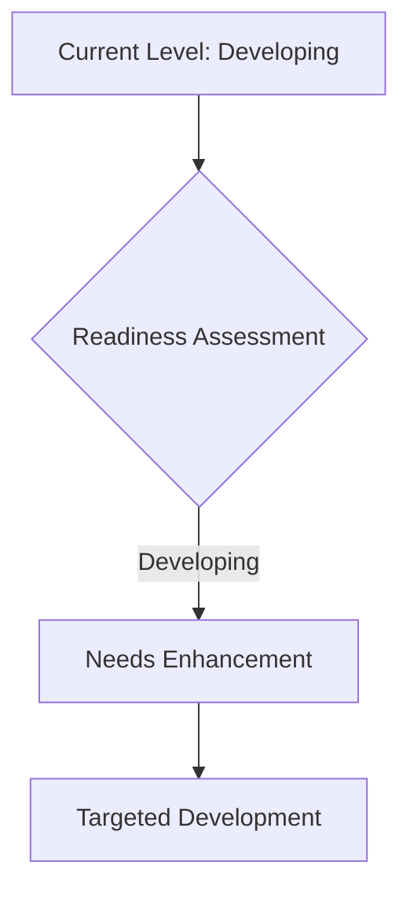
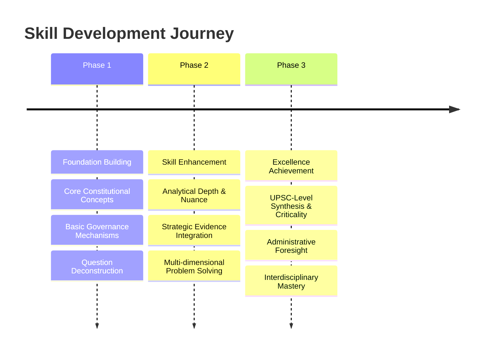
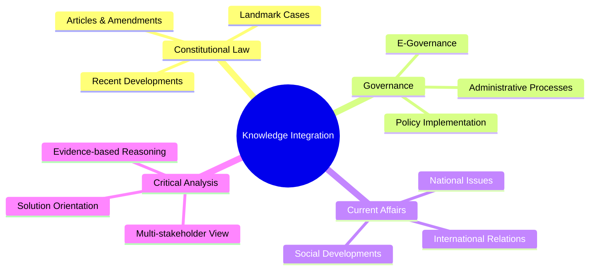

# ⚖️ UPSC GS Paper II Evaluation Report

## 📊 Overall Evaluation Dashboard

### 📈 Performance Summary
> **Focus**: The candidate demonstrates a foundational understanding of key concepts in Governance, Polity, and International Relations. There's a clear attempt to address the core demand of each question, often presenting both positive and negative aspects as required by directive verbs like 'examine' or 'discuss'. The structure is generally point-wise, aiding readability. However, a significant area for development lies in deepening the analytical rigor, moving beyond mere description to a more critical and multi-dimensional examination of issues. Constitutional accuracy, especially in the nuanced application of articles and landmark judgments, requires substantial improvement. While the candidate attempts to provide solutions or 'way forward' suggestions, these often lack the administrative feasibility and comprehensive stakeholder consideration expected of a civil servant. The integration of contemporary examples and specific data points, while present, needs to be more strategic and impactful. Overall, the answers reflect a developing stage, needing to transition from factual recall to insightful analysis and solution-oriented thinking in line with UPSC's demanding standards.

### ✅ Key Strengths
> **🌟 Impact Areas** - List 3-5 most impactful strengths:

-   **💡 Question Understanding**: The candidate consistently attempts to grasp the core demand of the questions, identifying keywords and directive verbs accurately. For instance, in Q1 on Fundamental Rights, both the "north star" (positive) and "examine" (limitations) aspects were addressed. This foundational skill is crucial for scoring well.
-   **📚 Broad Content Coverage**: The answers touch upon a wide range of relevant points for each topic, indicating a decent breadth of knowledge. In Q3 (India-Sri Lanka), similarities and differences in political systems were covered, and multiple factors contributing to the economic crisis were listed. This comprehensive approach ensures that multiple facets of a question are considered.
-   **📝 Structured Presentation**: The use of point-wise format and sub-headings (e.g., "Issues with its use," "However, IPC-295 & 153 has achieved") significantly enhances the readability and organization of the answers. This structural clarity helps in conveying information effectively and is a positive attribute for Mains examination.
-   **🔄 Balanced Perspective**: For many questions, the candidate attempts to present a balanced view by discussing both the strengths/achievements and the limitations/issues of a given topic (e.g., NGT's contribution vs. structural issues, Reservation's success vs. issues). This shows an understanding of the need for a nuanced approach in governance analysis.

### ⚡ Primary Development Areas
> **⚠️ Priority Focus** - List 3-5 most important areas for development with reasoning:

-   **⚖️ Constitutional Accuracy & Nuance**: A critical gap identified is the lack of absolute constitutional accuracy and nuanced understanding. For example, in Q1, the use of Mandamus for private excesses is incorrect, and the framing of DPSP as a "limitation" on FRs is problematic. In Q5, citing Article 325 for NGT is a significant factual error (NGT is a statutory body under NGT Act, 2010; Article 323A/B deals with tribunals but not specifically environmental). Such errors can be severely penalized as they undermine the very foundation of GS-II.
-   **🧠 Analytical Depth & Critical Thinking**: While points are listed, the analysis often remains descriptive rather than truly critical or in-depth. For instance, in Q2 (IPC Sections), the issues are listed but not deeply analyzed in terms of their constitutional implications or impact on civil liberties. The "examine" or "analyze" directives require probing deeper, exploring causal links, and presenting multi-stakeholder perspectives. This is crucial for moving beyond average scores.
-   **🎯 Strategic Evidence Integration**: The use of evidence (constitutional articles, case laws, committee reports, contemporary examples) is present but not consistently strategic or impactful. Many opportunities to cite landmark Supreme Court judgments (e.g., S.R. Bommai for federalism, Puttaswamy for Right to Privacy, various FR cases) or specific committee recommendations (e.g., Law Commission, ARC reports) are missed. Evidence should not just be mentioned but integrated to strengthen arguments and demonstrate a comprehensive understanding.
-   **💡 Solution-Orientation & Feasibility**: The "way forward" or solution-oriented suggestions, while present, often lack administrative feasibility, innovation, or a comprehensive understanding of implementation challenges. For example, in Q12 (Judicial Accountability), while good points are made, the solutions could be more specific and practical, reflecting a deeper civil servant mindset rather than general statements. Solutions must be implementable within the existing governance framework.

### 🏛️ Civil Service Readiness
> **🧑‍💻 Administrative Preparedness Assessment**

The candidate exhibits foundational knowledge and a structured approach, which are essential building blocks for civil service. There is a discernible effort to think broadly about issues, covering multiple dimensions as seen in the discussion of various factors in the Sri Lankan economic crisis (Q3) or the issues surrounding investigative agencies (Q14). This multi-faceted consideration is a positive sign for administrative roles where complex problems require holistic understanding.

However, the current level of readiness requires significant enhancement in critical areas. The most pressing concern is the **lack of absolute precision in constitutional and legal frameworks**. A civil servant must operate within the strict confines of the law and the Constitution. Errors in citing articles, understanding the scope of legal provisions (e.g., Mandamus against private individuals), or misattributing the basis of statutory bodies (e.g., NGT's constitutional basis) indicate a need for rigorous study and conceptual clarity. These are not minor errors but fundamental flaws that could impact decision-making in an administrative capacity.

Furthermore, the **analytical depth** needs to evolve from descriptive listing to insightful, cause-and-effect reasoning. While the candidate identifies problems, the ability to dissect *why* these problems exist, *how* they impact various stakeholders, and *what* their broader implications are, is still developing. This analytical gap is critical for a civil servant who must anticipate consequences and devise effective strategies.

The **solution-orientation**, while present, often lacks the practicality and innovation required. A civil servant is a problem-solver, and the proposed solutions must be grounded in administrative realities, considering resource constraints, political will, and societal impact. Generic recommendations will not suffice; specific, implementable, and forward-looking suggestions are needed.

Finally, the **integration of current affairs and specific examples** needs to be more strategic. While some examples are present, they are not always leveraged to strengthen arguments or demonstrate a dynamic understanding of governance challenges. A successful civil servant must constantly connect theoretical knowledge with real-world scenarios.

In summary, the candidate has the potential, but needs to focus intensely on **precision in constitutional knowledge, deepening analytical capabilities, and developing a more practical, solution-oriented mindset**. This transition will be crucial for moving from an aspiring candidate to a competent civil servant.

### 🎯 UPSC Standard Alignment
> **📈 Benchmarking Against Excellence**

The candidate's performance currently aligns with the 'average to good' range in UPSC standards, demonstrating a foundational understanding but falling short of the 'excellent' benchmark required for top scores.

**Strengths in Alignment**:
The candidate consistently attempts to address the core demand of the question, which is the first step towards UPSC alignment. The structured presentation, often using bullet points and sub-headings, facilitates easy evaluation and is a practice encouraged in UPSC Mains. The effort to present a balanced view, discussing both positive and negative aspects, reflects an understanding of the nuanced approach UPSC expects. This avoids one-sided arguments and showcases a comprehensive thought process.

**Areas for Improvement in Alignment**:
1.  **Constitutional and Factual Accuracy (Critical)**: This is the most significant area where the candidate deviates from UPSC standards. UPSC demands absolute precision in constitutional articles, legal provisions, and factual details related to governance. Errors, as seen in the NGT's constitutional basis or the scope of Mandamus, are high-impact and can severely pull down scores, regardless of other strengths. UPSC examiners look for a thorough grasp of the legal and institutional framework.
2.  **Analytical Rigor (High Priority)**: UPSC values critical analysis over mere description. While the candidate lists relevant points, the 'why' and 'how' are often missing. For instance, in analyzing issues, merely stating them is not enough; one must delve into their root causes, implications, and interlinkages. This multi-dimensional analysis, connecting constitutional, social, economic, and political aspects, is a hallmark of high-scoring answers.
3.  **Evidence and Substantiation (High Priority)**: UPSC expects arguments to be well-substantiated with concrete evidence. This includes precise citation of constitutional articles, relevant Supreme Court judgments (e.g., Kesavananda Bharati, S.R. Bommai, Puttaswamy, Indra Sawhney), committee reports (e.g., ARC, Law Commission, Punchhi Commission), and contemporary examples/data (e.g., NCRB data, NITI Aayog reports). The current answers often lack this specific, impactful substantiation, relying more on general statements or basic article numbers.
4.  **Solution-Orientation & Administrative Perspective (High Priority)**: A key differentiator in UPSC Mains is the ability to offer practical, implementable, and progressive solutions. The 'way forward' sections should reflect a civil servant's mindset – empathetic, inclusive, administratively feasible, and forward-looking. The solutions provided by the candidate are often generic and do not demonstrate a deep understanding of implementation challenges or a multi-stakeholder approach.
5.  **Interdisciplinary Integration**: While the answers touch upon various aspects, the seamless integration of knowledge across different GS-II domains (e.g., connecting governance issues with social justice implications, or constitutional principles with international relations) is an area for growth. UPSC rewards candidates who can draw connections and present a holistic picture.

To align with UPSC excellence, the candidate must move beyond rote learning and descriptive answers. The focus should shift to *understanding*, *critically analyzing*, and *synthesizing* information, all while maintaining impeccable factual and constitutional accuracy. This requires dedicated practice in answer writing, rigorous revision of core concepts, and extensive reading of current affairs from a governance perspective.

---

## 📝 Individual Answer Analysis

###  Question 1: Fundamental rights chapter of the constitution is the "north star" of the universe of constitutionalism. Examine.
**📚 Syllabus Area**: `Constitution - Fundamental Rights, Constitutionalism`

#### 📊 Answer Comparison

##### ✍️ Your Answer Summary
> **🌟 Key Points from Your Response** :
The candidate defines Fundamental Rights as the "north star" or guiding light, enumerating their roles in establishing political democracy, upholding constitutional principles, preventing arbitrary actions (executive and legislative), establishing rule of law, and providing remedies through writs. They also discuss limitations like excessive restrictions, creation of privileges, non-applicability against private individuals, impact on meritocracy, and delayed enforcement. The conclusion suggests FRs balance rights and limitations, citing Jaspal Roy Kapoor.

##### ⭐ Ideal Answer Framework
> **💡 UPSC Excellence Standard** :
An ideal answer would introduce Fundamental Rights (FRs) from Part III as indispensable for a democratic-republic, defining "constitutionalism" as limited government and rule of law. It would then elaborate how FRs serve as the "north star" by:
1.  **Limiting State Power**: Bulwark against tyranny (Art 13, checks arbitrary executive/legislative action).
2.  **Upholding Core Values**: Guaranteeing equality, liberty, justice (Arts 14, 19, 21).
3.  **Ensuring Rule of Law**: Establishing a government of laws, not men.
4.  **Providing Remedies**: Making rights enforceable (Art 32, 226).
It would then "examine" limitations:
1.  **Not Absolute**: Subject to reasonable restrictions.
2.  **Negative Rights**: Primarily against the state, not private individuals.
3.  **Balancing Act**: Potential conflict with DPSPs, social justice.
4.  **Emergency Provisions**: Suspension during emergencies.
Conclusion would reiterate their foundational role while acknowledging their dynamic interpretation and essential nature for a vibrant democracy.

#### 📈 Evaluation Criteria

#####  Relevance and Understanding
**🔎 Analysis** :
The candidate has a good understanding of the question's core demand, correctly identifying the need to discuss both the positive aspects (how FRs are the "north star") and the limitations, as indicated by the directive "examine." The introduction clearly sets the stage by linking FRs to the concept of a "guiding light." The points listed for both the positive role and the limitations are generally relevant to the topic. However, there's a slight misinterpretation in the "limitations" section where the candidate lists "not establishment of social justice (that part is covered by DPSP)" as a limitation. While FRs and DPSPs are distinct and sometimes create tension, DPSPs are meant to *complement* FRs in achieving a welfare state, not primarily act as a limitation in the sense of restricting the scope of FRs. This point needs to be rephrased to reflect the complementary yet sometimes conflicting nature of the two, rather than a direct limitation. Similarly, "prevents meritocracy" needs very careful and nuanced articulation, as affirmative action (Art 16) aims for substantive equality, not necessarily to prevent meritocracy but to ensure equitable opportunities.

**✅ Suggestions** :
-   ✅ When encountering "examine," ensure a balanced discussion, thoroughly exploring both the positive and negative (or challenging) dimensions. Practice framing the relationship between Fundamental Rights and Directive Principles of State Policy as complementary, even if they sometimes present points of tension, rather than seeing DPSPs as a direct "limitation" on FRs.
-   ✅ For nuanced points like "prevents meritocracy," consider rephrasing to "challenges associated with balancing merit and equity" or "debates around affirmative action's impact on meritocracy," and then briefly explain the constitutional rationale for such provisions (e.g., substantive equality, historical disadvantage).

##### 🏛️ Structure and Organization
**🔎 Analysis** :
The answer demonstrates a clear and organized structure, beginning with an introduction, followed by a point-wise discussion of the "north star" aspects, then a separate section for "limitations," and concluding remarks. The use of bullet points greatly enhances readability and helps in presenting distinct ideas. The separation into "North Star" and "However, some limitations" effectively addresses the "examine" directive. However, the conclusion feels somewhat abrupt and introduces a new quote (Jaspal Roy Kapoor) without sufficient integration or a strong concluding synthesis. An ideal conclusion should summarize the key arguments and offer a forward-looking perspective, reinforcing the central thesis without introducing new, unelaborated points. The handwriting is generally legible, contributing to ease of evaluation.

**✅ Suggestions** :
-   ✅ Strengthen your conclusions by synthesizing the key arguments presented in the body. Avoid introducing new information or quotes without proper context or elaboration. Aim for a concise summary that ties back to the question and offers a forward-looking perspective or a balanced judgment.
-   ✅ While bullet points are effective, consider using brief, descriptive sub-headings within the main body (e.g., "Role as a Bulwark against Arbitrary Power," "Challenges and Criticisms") to further segment and clarify your arguments, especially for 15-mark questions.

##### ⚖️ Constitutional and Governance Knowledge
**🔎 Analysis** :
The candidate displays a fair understanding of constitutional provisions, correctly citing articles like 13, 14, 19, 21, 32, and 226. This shows a basic grasp of the relevant legal framework. However, there are significant inaccuracies and conceptual misunderstandings that need urgent correction. For example, stating that Mandamus prevents "private or individual excesses" is fundamentally incorrect; Mandamus is a writ issued by a higher court to a public authority to compel the performance of a public duty. Its scope does not extend to private individuals or bodies unless they are performing a public function. This error is critical as it reflects a misunderstanding of the very nature and scope of constitutional remedies. Similarly, the phrasing "prevents meritocracy" in the context of affirmative action (Art 16) is a highly debated and sensitive point that needs careful, constitutionally sound framing, acknowledging the aim of substantive equality. The conclusion's reference to "Jaspal Roy Kapoor" is not a widely recognized constitutional authority in this context, and such a citation without proper elaboration adds little value and can raise questions about authenticity or relevance.

** Study Recommendations** :
-    **Master Fundamental Rights and Writs**: Conduct a thorough review of all Fundamental Rights (Articles 12-35) and the five types of writs (Habeas Corpus, Mandamus, Prohibition, Certiorari, Quo Warranto), understanding their specific scope, applicability, and limitations. Focus on *who* they can be issued against (state, public authority, private individual) and *for what purpose*. Refer to standard textbooks like M. Laxmikanth or D.D. Basu.
-    **Study Landmark Judgments**: Go beyond merely citing article numbers. Learn the key takeaways and principles established in landmark Supreme Court cases related to Fundamental Rights. For instance, for Article 13 and arbitrary action, cases like *A.K. Gopalan vs. State of Madras* (early interpretation) and *Maneka Gandhi vs. Union of India* (due process of law, expanded scope of Art 21) are crucial. For Art 14, *E.P. Royappa vs. State of Tamil Nadu* (new dimension of equality). For Art 32, *Romesh Thappar vs. State of Madras* (FRs cannot be abridged).
-    **Understand Affirmative Action Nuances**: Study the constitutional basis and judicial interpretations of affirmative action (e.g., Articles 15(4), 16(4)). Understand that these provisions aim to achieve substantive equality and social justice for historically disadvantaged groups, not to "prevent meritocracy" but to ensure equitable opportunities. Familiarize yourself with cases like *Indra Sawhney vs. Union of India* (Mandal Commission case) and the concept of 'creamy layer'.

##### 🧠 Analytical Rigor and Critical Thinking
**⚡ HIGH PRIORITY** - **🔎 Analysis** :
The answer largely remains at a descriptive level, listing various functions and limitations of Fundamental Rights. While it identifies relevant points, it falls short in providing deep analytical insight. For instance, when stating "establishes rule of law: Art 21/14," it merely mentions the articles without explaining *how* these articles contribute to the rule of law principle beyond a superficial level (e.g., linking Art 21 to "procedure established by law" and its transformation to "due process" through judicial interpretation). There's a missed opportunity to critically examine the *tension* between certain rights (e.g., freedom of speech vs. public order) or the *dynamic evolution* of FRs through judicial activism. The answer lacks a clear thread of causal analysis – explaining *why* certain aspects are strengths or limitations, rather than just stating *what* they are. The conclusion, by introducing a new quote, further demonstrates a lack of synthesis and critical evaluation of the arguments presented earlier.

**✅ Suggestions** :
-   ✅ **Deepen Causal Analysis**: For each point you make, ask yourself "Why?" and "How?". For example, instead of just stating "prevents arbitrary executive action," explain *how* Article 13 acts as a check, citing the principle of judicial review. Similarly, for limitations, analyze *why* certain restrictions are deemed necessary (e.g., public order, national security) and the constitutional balancing act involved.
-   ✅ **Explore Interlinkages and Tensions**: Develop the ability to analyze the interplay between different Fundamental Rights, or between FRs and other constitutional principles (like DPSPs). Discuss inherent tensions (e.g., individual liberty vs. collective good) and how the judiciary often navigates these. This shows a mature understanding of constitutional dynamics.
-   ✅ **Integrate Judicial Interpretation**: The "north star" analogy implies a guiding and evolving light. Analyzing how the Supreme Court's interpretations (e.g., expanding the scope of Article 21 to include various unarticulated rights) have shaped and strengthened the role of Fundamental Rights would significantly enhance analytical rigor.

##### 📊 Evidence and Substantiation
**🔎 Analysis** :
The candidate uses constitutional article numbers (Art 13, 14, 19, 21, 32, 226) as evidence, which is a good starting point. However, the substantiation is largely limited to these bare citations. There is a significant lack of integration of landmark Supreme Court judgments, which are crucial for demonstrating a comprehensive understanding of Fundamental Rights. For example, when discussing "prevents arbitrary executive action" or "establishes rule of law," cases like *Maneka Gandhi vs. Union of India* or *Kesavananda Bharati vs. State of Kerala* are essential for providing depth and authority to the arguments. Without these, the points remain abstract and lack the concrete legal backing expected in a UPSC answer. The mention of "Jaspal Roy Kapoor" in the conclusion is an unsubstantiated quote that does not add value and could be replaced by a more robust constitutional or judicial perspective.

**⚡ Value Addition Suggestions** :
-    **Strategic Use of Landmark Judgments**: For every point related to Fundamental Rights, identify and integrate at least one relevant landmark Supreme Court judgment. For instance:
    *   **Art 13 & Judicial Review**: *A.K. Gopalan* (initial view) vs. *Maneka Gandhi* (due process).
    *   **Art 14 & Rule of Law/Arbitrariness**: *E.P. Royappa* (new dimension of equality), *Maneka Gandhi* (arbitrariness test).
    *   **Art 21 (Right to Life and Liberty)**: *Maneka Gandhi* (due process), *Kharak Singh* (privacy), *Puttaswamy* (Right to Privacy).
    *   **Art 32 (Right to Constitutional Remedies)**: *Dr. B.R. Ambedkar's* statement calling it the "heart and soul" of the Constitution.
-    **Incorporate Constitutional Principles**: Beyond articles, explicitly mention and explain core constitutional principles like Judicial Review, Rule of Law, Due Process of Law, and Basic Structure Doctrine, demonstrating how Fundamental Rights embody or are protected by these principles.

##### 🎯 Solution Orientation and Civil Service Mindset
**⚡ HIGH PRIORITY** - **🔎 Analysis** :
This question, being an "examine" type on a static concept, doesn't directly call for policy solutions or a "way forward" in the typical sense. However, a civil servant mindset would still be reflected in the conclusion's ability to offer a nuanced, forward-looking, and dynamic perspective on Fundamental Rights. The current conclusion, while attempting a balanced view, introduces a new, less-known quote ("Jaspal Roy Kapoor") which doesn't effectively synthesize the arguments or offer a compelling future outlook. An ideal conclusion for such a question would emphasize the continuous evolution of FRs through judicial interpretation, their role in adapting to new societal challenges (e.g., digital rights, environmental rights), and their indispensable nature for a progressive and inclusive democracy. It should reflect an understanding of FRs as living documents, constantly interpreted and applied to new contexts.

**✅ Suggestions** :
-   ✅ For questions on constitutional concepts that don't explicitly ask for solutions, frame your conclusion to reflect the **dynamic nature and future relevance** of the concept. Emphasize how constitutional principles evolve through judicial interpretation and societal changes, and their enduring importance for governance.
-   ✅ Conclude by reiterating the **indispensable role of Fundamental Rights** in a vibrant democracy, their continuous adaptation to new challenges (e.g., privacy in the digital age, environmental rights), and their fundamental contribution to a just and equitable society. This demonstrates a progressive outlook aligned with civil service values.

#### 🌟 Key Insights
> **💡 Strategic Takeaways** - 3-4 core strategic lessons from this answer:

-    **Accuracy is Paramount**: Any factual or conceptual error in constitutional provisions or legal terms can significantly undermine the quality of the answer, regardless of other strengths. Prioritize absolute accuracy in GS-II.
-    **Beyond Description, Towards Analysis**: UPSC demands critical examination and analysis, not just listing points. Focus on explaining *why* and *how* things work, exploring causal links and interdependencies.
-    **Strategic Evidence Integration**: Evidence, especially landmark judgments and relevant committee reports, must be integrated effectively to substantiate arguments and add depth, rather than being a mere afterthought or a general citation.
-    **Refined Conclusion**: The conclusion is your final impression. It should synthesize arguments, offer a balanced perspective, and provide a forward-looking or solution-oriented outlook, without introducing new, unelaborated points.

#### 🗓️ Next Steps
> **✅ Action Plan** - 3-4 specific, actionable tasks for the student:

-   [ ] **Comprehensive Review of Fundamental Rights and Writs**: Dedicate specific study sessions to meticulously revise all Fundamental Rights (Part III) and the five types of writs, focusing on their scope, limitations, and specific applicability. Pay special attention to common misconceptions, like the scope of Mandamus.
-   [ ] **Study Landmark Supreme Court Judgments**: Create a concise list of 15-20 crucial Supreme Court judgments related to Fundamental Rights (e.g., Kesavananda Bharati, Maneka Gandhi, S.R. Bommai, Minerva Mills, Puttaswamy, Indra Sawhney). Understand the core principle established by each case and how it impacted constitutional interpretation.
-   [ ] **Practice Analytical Writing**: Take 2-3 previous year UPSC questions on Fundamental Rights or related constitutional concepts. For each, first brainstorm all relevant points, then consciously structure your answer to include "why" and "how" explanations, interlinkages, and a strong, synthesizing conclusion.
-   [ ] **Develop a "Civil Servant" Conclusion Template**: For questions that don't explicitly ask for a "way forward," practice concluding with a forward-looking, progressive, and balanced perspective that highlights the dynamic nature and enduring relevance of the constitutional concept, reflecting administrative foresight.

---

## ⚡ Comprehensive Development Plan

### ⚡ Immediate Priorities
> **⚠️ Critical Focus Areas** - 3 key areas requiring immediate attention:

#### ⚖️ Priority 1: Absolute Constitutional and Factual Accuracy
**🎯 Improvement Strategy** :
This is the most critical area. Errors in constitutional articles, legal provisions, or institutional facts are fundamental and severely penalize marks. The strategy must involve a multi-pronged approach. First, **rigorous revision of core constitutional texts**: Go through the bare act of the Constitution, focusing particularly on Fundamental Rights, Directive Principles, and the structure/powers of key institutions. Create flashcards for articles, amendments, and their precise implications. Second, **deep dive into landmark judgments**: Understanding the nuances of constitutional law often comes from judicial interpretations. For every major concept (e.g., federalism, judicial review, fundamental rights), study the 2-3 most important Supreme Court cases. Focus on the *ratio decidendi* (reason for the decision) and the principles established. Third, **verify all factual data**: For governance and IR topics, cross-check statistics, committee names, and policy details from credible government sources (e.g., PIB, NITI Aayog reports, Annual Reports of Ministries). Fourth, **seek expert feedback**: Regularly get your answers reviewed by mentors or peers who have a strong grasp of constitutional law to immediately identify and correct any inaccuracies. This will build a strong, error-free foundation for GS-II.

#### 🧠 Priority 2: Enhancing Analytical Rigor and Critical Thinking
**🎯 Improvement Strategy** :
Moving beyond descriptive answers to analytical ones is crucial for UPSC success. The strategy here involves developing a critical mindset. First, **Socratic questioning**: For every point you write, ask "Why?", "How?", "What are the implications?", "Who benefits/loses?", "What are the counter-arguments?". This habit will force you to delve deeper than surface-level information. Second, **multi-dimensional analysis**: Train yourself to look at every issue from constitutional, political, social, economic, ethical, and international perspectives (where applicable). Use frameworks like PESTEL (Political, Economic, Social, Technological, Environmental, Legal) or 5W1H (Who, What, When, Where, Why, How) to ensure comprehensive coverage. Third, **cause-and-effect mapping**: When discussing problems or policies, explicitly map out their causes, immediate effects, and long-term consequences. This demonstrates a mature understanding. Fourth, **comparison and contrast**: Where relevant, compare Indian scenarios with global best practices or contrasting approaches to deepen your analysis. Finally, **practice "examine," "analyze," "critically evaluate" questions**: These directives specifically demand analytical rigor. Practice structuring your answers to build arguments, present counter-arguments, and arrive at a nuanced conclusion.

#### 💡 Priority 3: Developing a Solution-Oriented Civil Servant Mindset
**🎯 Improvement Strategy** :
UPSC seeks future administrators who can identify problems and propose practical, implementable solutions. The strategy involves cultivating a solution-centric approach. First, **focus on "Way Forward" sections**: Treat the conclusion not just as a summary but as a mandatory space for constructive, actionable recommendations. Second, **administrative feasibility**: Ensure your proposed solutions are realistic, considering resource constraints, existing institutional frameworks, and political realities. Avoid utopian or politically biased suggestions. Third, **multi-stakeholder approach**: Always consider how solutions impact different groups – vulnerable sections, various government agencies, private sector, civil society. Emphasize inclusivity and equity. Fourth, **progressive and innovative thinking**: Look for modern, technology-driven, or governance best-practice solutions (e.g., e-governance, citizen charters, behavioral change). Fifth, **learn from government reports**: Read NITI Aayog reports, ARC reports, Parliamentary Committee reports – they often contain practical recommendations that reflect an administrative perspective. Finally, **practice problem-solving questions**: Regularly attempt questions that explicitly ask for solutions, challenges, or the way forward. This will train you to think like a civil servant addressing real-world issues.

### 🗺️ Skill Building Roadmap

#### 📚 Phase 1: Foundation Building
** Focus Areas**:
-    **Core Constitutional Concepts**: Thorough understanding of the Indian Constitution, including Preamble, Fundamental Rights, DPSP, Fundamental Duties, Union and State Executive/Legislature, Judiciary, Federalism, Emergency Provisions. Focus on accuracy of articles and basic principles.
-    **Basic Governance Mechanisms**: Grasping the functions of key government bodies, policy cycles, and administrative processes. Understanding the roles of institutions like Parliament, Ministries, Public Sector Undertakings.
-    **Question Deconstruction**: Mastering the art of breaking down UPSC questions, identifying directive verbs (examine, discuss, analyze, critically evaluate), and understanding multi-part demands.

** Activities**:
-   ✅ **Structured Reading**: Complete a comprehensive reading of M. Laxmikanth for Polity and Governance. Take detailed notes, focusing on accuracy of facts and articles.
-   ✅ **Basic Answer Writing**: Practice writing answers for 10-mark questions focusing on clear structure (Intro-Body-Conclusion) and covering all parts of the question. Aim for factual correctness.
-   ✅ **Mind Mapping Key Concepts**: Create mind maps for major topics (e.g., Federalism, Judicial Review, Local Self-Government) to visualize interconnections and key components.

#### 📈 Phase 2: Skill Enhancement
** Focus Areas**:
-    **Analytical Depth & Nuance**: Moving beyond description to explanation, interpretation, and critical assessment. Understanding the 'why' and 'how' behind issues.
-    **Strategic Evidence Integration**: Learning to effectively incorporate constitutional articles, landmark Supreme Court judgments, committee reports, and current affairs examples to strengthen arguments.
-    **Multi-dimensional Problem Solving**: Developing the ability to analyze governance issues from various perspectives (social, economic, political, ethical) and propose practical, implementable solutions.

** Activities**:
-   ✅ **Case Study Analysis**: Regularly read and analyze current affairs issues as case studies, identifying the constitutional/governance dimensions, stakeholders, challenges, and potential solutions.
-   ✅ **Advanced Answer Writing**: Practice 15-mark questions, consciously integrating analytical arguments, relevant judgments/reports, and a strong 'way forward.' Seek peer or mentor feedback specifically on depth and substantiation.
-   ✅ **Targeted Reading**: Supplement textbook knowledge with specific government reports (e.g., ARC reports, NITI Aayog strategies), Law Commission reports, and detailed analyses from reputable sources like PRS Legislative Research, IDSA, ORF.

#### 🚀 Phase 3: Excellence Achievement
** Focus Areas**:
-    **UPSC-Level Synthesis & Criticality**: Achieving the ability to synthesize vast amounts of information from different domains into coherent, persuasive arguments. Developing a highly critical yet balanced perspective.
-    **Administrative Foresight**: Cultivating a deep understanding of policy implications, implementation challenges, and long-term consequences, reflecting the mindset of a proactive civil servant.
-    **Interdisciplinary Mastery**: Seamlessly connecting concepts across GS-II domains (Constitution with Social Justice, Governance with IR) and even with other GS papers (e.g., ethical dimensions from GS-IV, economic aspects from GS-III).

** Activities**:
-   ✅ **Full-Length Mock Tests**: Regularly attempt full-length mock tests under timed conditions to refine time management, answer selection, and sustained writing quality.
-   ✅ **Debate and Discussion**: Engage in discussions or debates on complex governance issues with peers to sharpen your analytical and argumentative skills, and to gain diverse perspectives.
-   ✅ **Review Topper Copies**: Analyze high-scoring UPSC answer copies to understand how top candidates structure their arguments, integrate evidence, and present solutions at an advanced level.

---

## 🧠 Meta Learning Guidance

### 💡 Self-Assessment Skills
> **🔍 Developing Internal Evaluation Capabilities**

Developing strong self-assessment skills is paramount for continuous improvement in UPSC preparation. It transforms you from a passive recipient of feedback to an active participant in your learning journey. Start by internalizing the UPSC syllabus and the evaluation criteria provided (Question Understanding, Structure, Content, Analysis, Evidence, Solution-Orientation). After writing each answer, critically review it *before* anyone else sees it. Ask yourself:
1.  **Did I fully understand the question's demand and directive verb?** (e.g., "examine" means both pros and cons, "analyze" means breaking down and explaining relationships).
2.  **Is my answer well-structured?** Does it have a clear introduction, logical flow in the body with distinct points, and a strong conclusion/way forward?
3.  **Is my content accurate and comprehensive?** Have I included all relevant facts, articles, judgments, schemes, and contemporary examples? Are there any factual errors or omissions?
4.  **Is my analysis deep enough?** Have I explained the 'why' and 'how'? Have I explored interlinkages and multiple dimensions? Or is it merely descriptive?
5.  **Is my evidence strong and strategically placed?** Am I just listing articles, or am I using them to substantiate my arguments effectively?
6.  **Does my conclusion offer a practical and progressive way forward?** Does it reflect a civil servant's mindset?
7.  **Have I adhered to the word limit and time constraint?**
Be brutally honest in this self-evaluation. Use a checklist based on the evaluation criteria. Over time, this practice will refine your internal quality control mechanism, allowing you to identify weaknesses and correct them even before external evaluation.

### 🔄 Error Pattern Recognition
> **🚫 Identifying and Breaking Negative Cycles**

Merely getting feedback is not enough; you must systematically identify and address recurring error patterns. After reviewing your evaluated answer books (both self-assessed and externally evaluated), maintain an "Error Log." For each answer, note down:
1.  **The specific error type**: (e.g., factual inaccuracy, lack of analysis, poor introduction, missing judgments, generic solutions, time management issue).
2.  **The question topic**: (e.g., Fundamental Rights, NGT, Civil Society).
3.  **Why the error occurred**: (e.g., lack of revision, hurried writing, conceptual confusion, insufficient practice).
4.  **Actionable steps to correct it**: (e.g., revise Part III more thoroughly, read specific committee reports, practice analytical prompts for 15-markers).

Review this error log weekly. If you see the same error type appearing across different questions or test papers, it indicates a systemic weakness. For instance, if "lack of analytical depth" is a recurring theme, it means your current study method or thinking process isn't fostering deep analysis. This systematic identification allows you to create targeted strategies (as outlined in the "Comprehensive Development Plan") rather than making generic improvements. Breaking these negative cycles is key to unlocking your full potential.

### 🔗 Integration Mastery
> **🌐 Connecting Knowledge Across Domains**

UPSC Mains often demands a holistic understanding, requiring candidates to integrate knowledge from different parts of the syllabus and across different GS papers. This skill is crucial for high-scoring answers.
1.  **Conceptual Linkages**: Understand how concepts in one area relate to another. For example, how Fundamental Rights (GS-II) relate to social justice (GS-II) or ethical governance (GS-IV), or how economic policies (GS-III) have social implications (GS-II).
2.  **Current Affairs as a Bridge**: Use current events as a tool for integration. A recent Supreme Court judgment on privacy (GS-II) can be linked to data protection laws (GS-II/III), technological advancements (GS-III), and individual liberty (GS-II).
3.  **Multi-Dimensional Thinking**: For any topic, consciously think about its various facets. For instance, when discussing a governance reform, consider its constitutional validity, its social impact, its economic implications, and its political feasibility.
4.  **Practice Inter-Topic Questions**: Seek out or create questions that deliberately blend multiple topics (e.g., "Discuss the role of NITI Aayog in promoting cooperative federalism and achieving sustainable development goals"). This forces you to draw connections.
5.  **Create Integration Notes**: After studying a topic, make a separate note on how it connects to other topics in GS-I, II, III, and IV. This proactive approach ensures that when a multi-faceted question appears, you are prepared to address it comprehensively.

---

## 🌟 End of Evaluation Report

**🚀 Remember**: Excellence is a journey, not a destination. Keep growing! 📈

