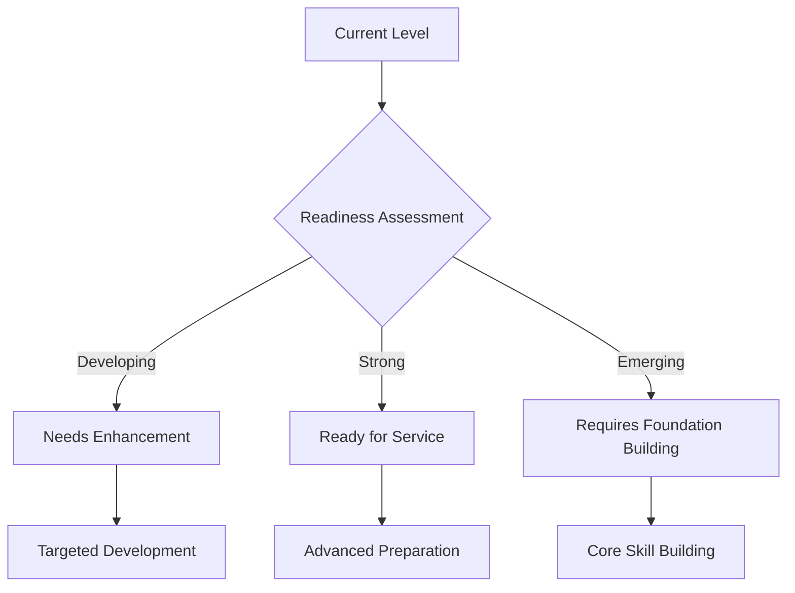
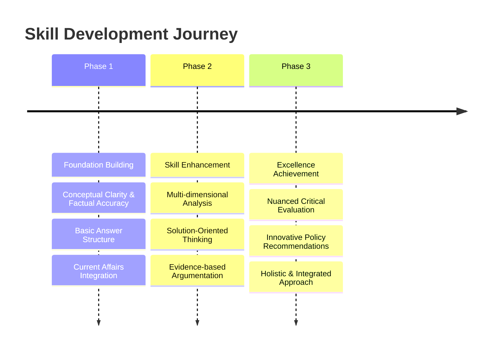
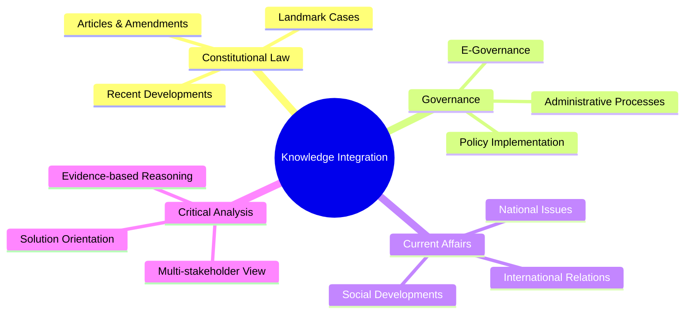

# ⚖️ UPSC GS Paper II Evaluation Report

## 📊 Overall Evaluation Dashboard

### 📈 Performance Summary
> The candidate, Ruhani, demonstrates a strong foundational understanding across various domains of GS Paper II, including Polity, Governance, Social Justice, and International Relations. A commendable grasp of core concepts and factual details, particularly in Constitutional Law and contemporary governance issues, is evident. The ability to recall specific articles, landmark judgments (e.g., Lily Thomas, Kesavananda Bharati, S.R. Bommai), and government initiatives (e.g., POSHAN Abhiyan, MGNREGA) is a significant strength, indicating diligent static preparation and current affairs awareness.

> The answers generally exhibit a clear and structured approach, often utilizing diagrams effectively to convey complex interrelationships, which enhances readability and comprehension. This visual aid is a valuable tool for UPSC Mains, enabling the presentation of multi-faceted information concisely. The candidate also shows a good understanding of directive verbs, consistently attempting to 'discuss,' 'examine,' or 'analyze' as required, rather than merely describing.

> However, while factual recall is strong, the depth of critical analysis and multi-dimensional engagement needs significant enhancement to meet the rigorous demands of UPSC. Many answers, despite presenting relevant facts, tend to remain descriptive rather than delving into the 'why' and 'how' of issues, or exploring nuanced implications. For instance, discussions on constitutional concepts like 'constitutionalism' or 'basic structure' could benefit from a more profound philosophical or practical examination of their limitations and evolving interpretations. The 'way forward' sections, though present, often lack the innovative, administratively feasible, and truly transformative solutions expected from a civil service aspirant. These sections frequently reiterate general principles instead of proposing concrete, implementable policy recommendations.

> Furthermore, the integration of diverse perspectives—constitutional, administrative, political, social, economic, and international—needs to be more seamless and analytical. While individual elements are often present, their synthesis into a cohesive, multi-layered argument is an area for development. For example, in the context of electoral bonds, while the candidate correctly identifies concerns, a deeper dive into the ethical implications, or comparative analysis with funding mechanisms in other democracies, would elevate the answer. Similarly, while the challenges to POSH Act implementation are listed, a more granular analysis of the systemic barriers within the unorganized sector, beyond general apathy, would strengthen the response.

> In terms of evidence and substantiation, while specific data points and case laws are cited, the strategic integration of these into the argument can be improved. Evidence should not just be presented but should actively bolster the analytical claims, demonstrating a clear cause-and-effect relationship or illustrating a complex point. The language, while clear, can be refined to incorporate more precise UPSC-specific terminology and maintain a consistently formal, objective tone. Overall, the candidate possesses a solid foundation, but the journey towards excellence requires a concerted effort in cultivating deeper analytical skills, fostering a robust solution-oriented mindset, and refining the art of multi-dimensional answer writing to align with top-tier UPSC standards.

### ✅ Key Strengths
> **✨ Impact Areas**

- **🎯 Strength 1: Strong Factual Foundation & Constitutional Knowledge**: The candidate exhibits a commendable recall of constitutional provisions, articles, landmark Supreme Court judgments (e.g., Lily Thomas, Kesavananda Bharati, S.R. Bommai), and key government programs (e.g., MGNREGA, POSHAN Abhiyan). This forms a crucial bedrock for GS-II, demonstrating diligent preparation in static and current affairs. For instance, the accurate mention of NFHS-5 data in the nutrition question or the ADR report in the electoral bonds question adds significant credibility and factual weight, which is highly valued in UPSC evaluations.
- **⭐ Strength 2: Effective Use of Diagrams for Structural Clarity**: A distinctive strength is the candidate's consistent and intelligent use of diagrams (e.g., mind maps, flowcharts) to present complex information and interrelationships concisely. This visual aid not only enhances the answer's readability but also demonstrates an ability to organize thoughts logically and convey multi-faceted points within strict word limits, a critical skill for UPSC Mains. This approach, seen in answers on Governor's role, UCC, and global divides, helps in breaking down intricate topics into digestible components.
- **💡 Strength 3: Good Question Understanding and Relevance**: The candidate generally deciphers the core demand of the questions well, addressing the directive verbs (discuss, examine, analyze) appropriately. Responses are largely relevant to the question asked, avoiding tangential discussions. For example, the answer on Electoral Bonds clearly distinguishes between the 'double-edged sword' aspects, and the one on decentralization directly tackles 'finance and functional' impediments. This focus ensures that the answers are on point and score well on the relevance criterion.
- **🔄 Strength 4: Awareness of Contemporary Issues and Integration**: The candidate successfully integrates current affairs with static syllabus components. References to the Rahul Gandhi disqualification case, TN Ravi's gubernatorial overreach, Manipur ethnic clashes, and Mission Karmayogi demonstrate an active engagement with contemporary developments. This ability to link theoretical knowledge with real-world events and recent policy initiatives is vital for GS-II, showcasing a dynamic understanding of governance and polity.

### ⚡ Primary Development Areas
> **⚠️ Priority Focus**

- **⚡ Area 1: Enhancing Analytical Depth and Critical Rigor**: While factual presentation is good, many answers lack the necessary depth of critical analysis. The candidate often describes 'what' rather than critically examining 'why' or 'how' and exploring the deeper implications. For example, in the Basic Structure Doctrine answer, while cases are listed, a more profound analysis of the philosophical underpinnings or the potential for judicial overreach would elevate the response. To improve, the candidate should practice dissecting questions to identify underlying assumptions, multi-causal factors, and long-term consequences, aiming for a nuanced argument rather than a mere compilation of points. This involves asking "So what?" after every factual statement and delving into its significance.
- **🔥 Area 2: Cultivating a Robust Solution-Oriented Civil Service Mindset**: The "way forward" or conclusion sections, though present, are frequently generic or lack administrative feasibility and innovative thought. For instance, suggesting that the RPA needs to be "revisited" or that "dialogue and consensus" are needed for UCC, while true, are not concrete, implementable solutions. UPSC expects aspirants to propose practical, progressive, and multi-stakeholder solutions that reflect a civil servant's problem-solving aptitude. The candidate needs to develop specific policy recommendations, institutional reforms, or innovative approaches, demonstrating an understanding of implementation challenges and resource constraints. This requires reading committee reports (e.g., ARC, Punchhi Commission) and NITI Aayog documents for specific recommendations.
- **🚨 Area 3: Strategic Evidence Integration for Argumentation**: While evidence (articles, cases, data) is present, its integration is often descriptive rather than argumentative. Evidence should actively support and strengthen analytical claims, illustrating points rather than just being listed. For example, instead of just mentioning "Lily Thomas judgment," explain *how* it impacted Section 8 of RPA and *why* it was a significant step. The candidate should focus on using evidence to substantiate arguments, provide context, and add weight to their critical analysis. This involves weaving evidence seamlessly into the narrative, explaining its relevance to the specific analytical point being made.
- **⚠️ Area 4: Mastering Multi-Dimensional Analysis and Inter-linkages**: While elements of different dimensions (social, economic, political, constitutional) are present, their inter-linkage and synthesis into a holistic argument can be improved. For instance, in the Social Accountability Law question, while benefits and challenges are listed, a deeper analysis of the interplay between citizen participation, bureaucratic accountability, and the constitutional framework of rights and duties would add value. The candidate should consciously attempt to connect concepts across different sub-sections of GS-II, demonstrating a comprehensive understanding of complex governance issues. This involves creating mental frameworks that prompt consideration of all relevant angles (e.g., PESTEL analysis for policy questions).

### 🏛️ Civil Service Readiness
> **🎯 Administrative Preparedness Assessment**

The candidate demonstrates a foundational level of administrative preparedness, marked by a good understanding of government schemes, constitutional mechanisms, and the roles of various institutions. The ability to articulate the functions of the Governor, the challenges in implementing the POSH Act, or the multi-stakeholder approach to SDGs indicates a grasp of the operational aspects of governance. This suggests an emerging capacity to understand how policies are formulated and implemented, and the various actors involved in the administrative machinery. The consistent effort to provide a "way forward" in answers, even if generic, reflects an inclination towards problem-solving, which is a desirable civil service quality.

However, to transition from a 'developing' to a 'strong' level of readiness, the candidate needs to significantly deepen their appreciation of the practical complexities and nuanced trade-offs inherent in administrative decision-making. The current approach often provides theoretical solutions without fully engaging with the feasibility, political economy, or potential unintended consequences of such recommendations. For example, while advocating for "activity mapping" in decentralization is conceptually sound, an ideal civil servant's perspective would also delve into the challenges of inter-departmental coordination, capacity building at the grassroots, and resistance from entrenched interests that might impede such a reform.

Furthermore, the candidate's analysis, while factually correct, sometimes lacks the multi-stakeholder empathy and foresight crucial for public service. When discussing issues like the UCC or social justice, a civil servant must not only understand the legal framework but also appreciate the diverse societal impacts, sensitivities, and the need for inclusive policy design. This involves moving beyond a purely academic understanding to a more empathetic, citizen-centric viewpoint, especially concerning vulnerable sections. The current level suggests a strong academic foundation, but the journey towards becoming an effective administrator requires cultivating a more pragmatic, nuanced, and empathetic problem-solving approach, grounded in the realities of governance and public welfare. The candidate is 'Developing' and needs 'Targeted Development' to reach 'Ready for Service'.

### 🎯 UPSC Standard Alignment
> **📈 Benchmarking Against Excellence**

The candidate's performance aligns reasonably well with the basic expectations of UPSC Mains, particularly in terms of content coverage and structural presentation. The answers demonstrate an understanding of the syllabus breadth for GS-II, touching upon key themes in Polity, Governance, Social Justice, and International Relations. The use of clear introductions, body paragraphs, and conclusions, along with visual aids like diagrams, indicates adherence to formal answer-writing standards. The ability to cite specific constitutional articles, legal cases, and government initiatives is a definite positive, meeting the factual accuracy criterion.

However, to truly excel and align with the 'excellence' benchmark of UPSC, the candidate needs to significantly elevate the depth of analysis and the quality of critical thinking. UPSC Mains questions are designed to test not just knowledge, but the ability to analyze, evaluate, and synthesize information from multiple perspectives. Many answers, while factually correct, tend to be more descriptive than analytical. For example, in the question on "fiscal apathy" towards MGNREGA, while the candidate describes the budget situation, a deeper critical analysis would involve questioning the underlying policy philosophies, the socio-economic impacts of reduced funding, and the constitutional implications of weakening a rights-based scheme. Similarly, the discussion on "ambiguity" in RPA Section 8 could be fortified by exploring the constitutional philosophy behind disqualification and the role of the Election Commission versus the judiciary in defining such 'ambiguities'.

The answers also need to demonstrate a more sophisticated inter-disciplinary approach, weaving together constitutional principles, administrative realities, socio-economic factors, and political dynamics seamlessly. The current integration often feels somewhat fragmented. The 'balance' in arguments, while present, can be further refined by presenting counter-arguments and then offering a well-reasoned synthesis, rather than just listing pros and cons. Achieving UPSC excellence demands a nuanced understanding of complex issues, the ability to articulate a well-thought-out argument, and the capacity to propose innovative, constitutionally sound, and administratively viable solutions. The candidate is on the right path but must strive for a transformative shift from good factual recall to exceptional analytical prowess and critical evaluation.

---

## 📝 Individual Answer Analysis

### 📝 Question 1: [Q.1]
**💡 Question Text**: जन प्रतिनिधित्व अधिनियम, 1951 की धारा 8 में उल्लिखित निर्योग्यता प्रावधानों में उपस्थित अस्पष्टता का समाधान करने की आवश्यकता है। चर्चा कीजिए। (150 शब्दों में उत्तर दीजिए) 10 अंक / There is a need to resolve the ambiguity in the disqualification provisions under section 8 of the Representation of People Act 1951. Discuss.
**📚 Syllabus Area**: `GS-II: Indian Constitution—historical underpinnings, evolution, features, amendments, significant provisions and basic structure.`

#### ⚖️ Answer Comparison

##### 📝 Your Answer Summary
> The candidate introduces Section 8 of RPA, 1951, stating it disqualifies a person convicted for two years for a criminal offence. It mentions the Lily Thomas Judgment (2013) that added this section to prevent decriminalization of politics, citing Rahul Gandhi's recent disqualification. The answer highlights ambiguity due to undefined offences, specifically listing "bribery, spreading enmity, hatred" as vague, concluding that Section 8 needs revisiting.

##### ⭐ Ideal Answer Framework
> An ideal answer would begin by concisely introducing Section 8 of the RPA, 1951, outlining its purpose in preventing criminalization of politics. It would then delve into the 'ambiguity' by discussing the lack of clear differentiation between serious moral turpitude offences and less severe criminal acts, leading to disproportionate disqualifications. The answer should specifically reference the Lily Thomas judgment (2013) which struck down Section 8(4) and its implications for automatic disqualification, and then critically examine the subsequent legislative inaction or judicial interpretations that have left ambiguities. It should also touch upon the role of the Election Commission and Law Commission in suggesting reforms. The conclusion must offer a concrete 'way forward' such as defining heinous crimes, judicial guidelines, or a tiered system of disqualification to balance accountability with democratic representation.

#### 📝 Evaluation Criteria

##### 💡 Relevance and Understanding
** Analysis**:
> The candidate has a good foundational understanding of the question's core demand, which is to discuss the ambiguity in Section 8 of the RPA, 1951. The mention of the Lily Thomas Judgment (2013) and the recent Rahul Gandhi case demonstrates current affairs awareness and its direct relevance to the topic. This immediately establishes the answer's topicality and understanding of the contemporary context. The answer correctly identifies the core issue as "offences have not been defined comprehensively," which is a valid point of ambiguity. The specific examples like "bribery, spreading enmity, hatred" are good attempts to illustrate the vagueness.

> However, the analysis of 'ambiguity' could be deeper. It's not just that offences are "not defined comprehensively" but rather the *implications* of a blanket disqualification for any offence with a two-year sentence, regardless of the nature of the crime or moral turpitude involved. The answer could have explored the constitutional implications of such a broad disqualification on fundamental rights (e.g., right to contest elections) and the separation of powers (judicial conviction leading to automatic disqualification without executive/legislative discretion). The discussion remains somewhat descriptive of the problem rather than delving into the systemic reasons for the ambiguity and its broader impact on democratic representation and the criminal justice system's interface with electoral law.

**✅ Suggestions**:
- ✅ To deepen the analysis of 'ambiguity,' discuss the lack of distinction between crimes involving moral turpitude and other minor offenses that also attract a two-year sentence, and how this leads to disproportionate disqualifications. Explore the debate around whether a blanket disqualification truly serves the purpose of decriminalizing politics or if it can be misused.
- ✅ Explicitly link the ambiguity to the broader debate on the criminalization of politics, highlighting how the lack of clarity can lead to both under-enforcement (due to political expediency) and over-enforcement (due to broad interpretation), thereby undermining the spirit of the law.

##### ⚖️ Constitutional and Governance Knowledge
** Analysis**:
> The candidate correctly identifies Section 8 of the RPA, 1951, as the relevant legal provision and accurately cites the Lily Thomas Judgment (2013), which is a critical landmark in this context. This demonstrates a good grasp of the specific constitutional and legal framework governing disqualifications. The mention of the judgment's intent to "prevent decriminalisation of politics" shows an understanding of the broader governance objective behind the provision. The reference to Rahul Gandhi's disqualification further grounds the answer in recent events, showcasing contemporary relevance.

> However, the answer could have benefited from a more precise explanation of *what* the Lily Thomas judgment did (striking down Section 8(4) which allowed convicted legislators to continue if an appeal was filed within 3 months) and *how* this contributed to the current state of ambiguity or automatic disqualification. While the candidate points out that "offences have not been defined comprehensively," a deeper dive into the legislative intent behind Section 8 and the various Law Commission/Election Commission recommendations for reform (e.g., distinguishing between petty and serious crimes, or defining 'moral turpitude') would have significantly enhanced the constitutional and governance knowledge demonstrated. The answer lacks specific recommendations from these bodies that aim to resolve this ambiguity.

**📚 Study Recommendations**:
- 📚 Study the specific recommendations of the Law Commission of India (e.g., 244th Report on Electoral Disqualifications) and the Election Commission of India regarding decriminalization of politics and reforms to Section 8 of RPA. Understand their proposals for defining serious offenses and differentiating them from minor ones for disqualification purposes.
- 📚 Research the concept of 'moral turpitude' in Indian law and how various judicial pronouncements have attempted to interpret it in the context of disqualifications. This will help in understanding the nuances of criminal offenses and their relevance to a public representative's conduct.

#####  Analytical Rigor and Critical Thinking
** Analysis**:
> **⚡ HIGH PRIORITY** - The analytical rigor in this answer is moderate. While the candidate correctly identifies the ambiguity and its consequences (e.g., leading to the Rahul Gandhi case), the analysis largely remains at a descriptive level. The statement "offences have not been defined comprehensively in the provisions" is a good observation, but it stops short of critically examining *why* this lack of definition is problematic beyond "vague." A deeper analytical point would involve discussing how this vagueness leads to inconsistent application, potential for political vendetta, or a lack of clarity for candidates themselves.

> The answer could have benefited from exploring the tension between legislative intent (to curb criminalization) and the practical implications of a broadly worded law that might disproportionately affect individuals for minor offenses. It also misses an opportunity to engage with the constitutional debate around the balance between the purity of electoral process and an individual's right to representation. The critical thinking could be enhanced by weighing the pros and cons of the current blanket disqualification versus a more nuanced approach, and how different stakeholders (judiciary, legislature, Election Commission) have viewed this issue. The conclusion "needs to be revisited" is a weak analytical closure; a stronger analysis would propose *how* it should be revisited, reflecting a deeper critical engagement with the problem.

**✅ Suggestions**:
- ✅ When discussing ambiguity, critically analyze how the lack of clear definitions or a tiered system of disqualification (based on the gravity and nature of the crime) can lead to arbitrary application and potential political misuse, thereby undermining the democratic process.
- ✅ Engage with the constitutional principle of proportionality. Discuss whether a blanket disqualification for any offense with a two-year sentence is proportionate to the objective of decriminalizing politics, especially when compared to other democracies' approaches.

#####  Evidence and Substantiation
** Analysis**:
> The candidate provides good evidence by citing Section 8 of the RPA, 1951, and the Lily Thomas Judgment (2013). The inclusion of the recent Rahul Gandhi disqualification case is highly relevant and effectively substantiates the contemporary relevance of the issue. These are strong factual anchors for the answer. The listing of "bribery, spreading enmity, hatred" as vague offenses further attempts to substantiate the claim of ambiguity with specific examples, which is a positive.

> However, the substantiation could be enhanced by providing more specific details about the Lily Thomas judgment itself – what it actually struck down (Section 8(4)) and why it was significant. This would provide deeper legal context. Additionally, while the examples of vague offenses are good, referencing specific Law Commission or Election Commission reports that have highlighted these ambiguities or proposed solutions would add further authoritative evidence. The answer relies heavily on legal provisions and a recent case, which is good, but could broaden its evidential base to include expert committee recommendations that specifically address the ambiguity.

**⚡ Value Addition Suggestions**:
- ⚡ In addition to citing the Lily Thomas Judgment, briefly explain its key outcome (striking down Section 8(4) that allowed convicted MPs/MLAs to continue if an appeal was filed), and how this led to automatic disqualification, thereby increasing the urgency for addressing the ambiguity.
- ⚡ Refer to the recommendations of the Law Commission of India's 244th Report on Electoral Disqualifications, which specifically addressed the need to define what constitutes a 'serious' offense for disqualification purposes, providing a more authoritative source for the claim of ambiguity.

#####  Solution Orientation and Civil Service Mindset
** Analysis**:
> **⚡ HIGH PRIORITY** - The solution orientation in this answer is weak. The conclusion, "Thus, section 8 of RPA needs to be revisited," is a very general statement and lacks the specificity and administrative feasibility expected from a civil service aspirant. While identifying the problem is a first step, a civil service mindset requires proposing concrete, actionable solutions. There is no clear "way forward" that outlines *how* the ambiguity should be resolved (e.g., through legislative amendments, judicial guidelines, or a clear definition of 'heinous crimes' or 'moral turpitude').

> A robust solution-oriented approach would consider the various stakeholders involved (legislature, judiciary, Election Commission) and suggest specific mechanisms for reform. It would also reflect a progressive outlook by aiming to balance the objective of decriminalizing politics with the principles of natural justice and fair representation. The current answer identifies a problem but falls short in demonstrating the problem-solving aptitude crucial for administrative roles.

**✅ Suggestions**:
- ✅ Propose specific legislative reforms such as introducing a tiered system of disqualification based on the gravity of the crime, or clearly defining 'heinous crimes' that warrant immediate disqualification versus other offenses.
- ✅ Suggest that the Election Commission of India, in consultation with legal experts and political parties, could develop guidelines or a white paper on electoral reforms, including a detailed framework for disqualification provisions, to guide future legislative action.

####  Key Insights
> **⚡ Strategic Takeaways**

-  **Beyond Description to Deeper Analysis**: While factual knowledge is present, the answer needs to move beyond describing the problem to analyzing its underlying causes, implications, and constitutional nuances. For instance, the 'ambiguity' of RPA Section 8 could be explored in terms of its impact on proportionality and the potential for misuse.
-  **Actionable Way Forward**: The conclusion "needs to be revisited" is too general. UPSC answers require concrete, implementable solutions reflecting a civil service mindset. Always aim for specific policy recommendations, legislative changes, or institutional reforms.
-  **Strategic Evidence Integration**: Evidence should not just be cited but actively used to strengthen arguments. Explain *how* a judgment or data point supports your analytical claim, rather than just listing it. This adds depth and persuasiveness.
-  **Multi-Stakeholder Perspective**: Consider the roles and perspectives of various stakeholders (e.g., legislature, judiciary, Election Commission, citizens) when analyzing a problem and proposing solutions. This demonstrates a holistic understanding of governance.

####  Next Steps
> **✅ Action Plan**

- [ ] **Task 1: Deepen Analytical Framework**: For future answers, practice using frameworks like 'PESTEL' (Political, Economic, Social, Technological, Environmental, Legal) or 'SWOT' (Strengths, Weaknesses, Opportunities, Threats) to ensure a multi-dimensional analysis of issues. For each point, ask "Why is this happening?" and "What are the broader implications?"
- [ ] **Task 2: Research and Incorporate Policy Recommendations**: Dedicate study time to reading key committee reports (e.g., Law Commission Reports on Electoral Reforms, ARC Reports, Punchhi Commission) and NITI Aayog documents. Extract specific, implementable policy recommendations and practice integrating them into your "way forward" sections.
- [ ] **Task 3: Practice "Solutions-First" Thinking**: For every problem identified in a question, brainstorm at least 3-5 concrete, actionable solutions before writing. Consider their administrative feasibility, constitutional validity, and potential impact on various stakeholders.
- [ ] **Task 4: Refine Evidence Integration**: In your next practice answers, consciously focus on how you introduce and explain your evidence. Instead of just stating "Article X says...", explain "As per Article X, which mandates Y, the situation Z arises, highlighting..." to show the argumentative link.

---

### 📝 Question 2: [Q.2]
**💡 Question Text**: संविधान मात्र एक कंकाल है जबकि संविधानवाद लोकतंत्र की आत्मा है। विवेचना कीजिए। (150 शब्दों में उत्तर दीजिए) 10 अंक / Constitution is a mere skeleton whereas constitutionalism is the soul of democracy. Discuss.
**📚 Syllabus Area**: `GS-II: Indian Constitution—historical underpinnings, evolution, features, amendments, significant provisions and basic structure.`

#### ⚖️ Answer Comparison

##### 📝 Your Answer Summary
> The candidate defines constitutionalism as imposing limits on government power to prevent arbitrary actions. It states that the Constitution provides fundamental rights, duties, and DPSPs, while constitutionalism ensures policies align with the Constitution's ideals in spirit. The answer highlights that constitutionalism ensures 'Rule of Law' prevails, not the rule of men, quoting "Be you ever so high, the law is always above you." It also mentions that constitutionalism ensures due process of law, fair application, free and fair elections, universal adult franchise, and equal opportunity, calling these the "soul of democracy."

##### ⭐ Ideal Answer Framework
> An ideal answer would begin by clearly distinguishing between a 'Constitution' (the written document, the skeleton) and 'Constitutionalism' (the spirit, principles, and practices that limit governmental power, the soul). It would elaborate on how a Constitution, while providing the framework (organs of government, rights), does not automatically guarantee limited government. Constitutionalism, on the other hand, embodies principles like Rule of Law, separation of powers, judicial review, fundamental rights, and a system of checks and balances, ensuring that power is exercised within legal and ethical bounds. The answer should explain how constitutionalism prevents arbitrary rule and ensures accountability, making democracy substantive. Examples from India's experience (e.g., judicial review, independent Election Commission, free and fair elections) would illustrate how constitutionalism breathes life into the constitutional text, making it the 'soul of democracy.' The conclusion would emphasize their symbiotic relationship.

#### 📝 Evaluation Criteria

##### 💡 Relevance and Understanding
** Analysis**:
> The candidate demonstrates an excellent understanding of the core concept by clearly distinguishing between 'Constitution' as a framework and 'Constitutionalism' as the spirit that limits power. The chosen analogy "Constitution is a mere skeleton whereas constitutionalism is the soul of democracy" is directly addressed and explained. The definition of constitutionalism as "imposing limits on the power of the government so that the executive does not trample on the rights of the citizens through arbitrary laws and actions" is precise and accurate.

> The answer effectively highlights the key principles of constitutionalism, such as the 'Rule of Law' and ensuring that government policies follow the "ideals and provisions of the Constitution in letter and spirit." The inclusion of elements like "due process of law," "free and fair elections," "universal adult franchise," and "equal opportunity" as manifestations of constitutionalism further strengthens the response. The quote "Be you ever so high, the law is always above you" is a classic and apt illustration of the Rule of Law. The answer is highly relevant and demonstrates a comprehensive grasp of the question's philosophical and practical demands.

**✅ Suggestions**:
- ✅ While the distinction is clear, consider adding a brief line about how a country can have a constitution but not constitutionalism (e.g., authoritarian regimes with written constitutions but no limits on power) to further solidify the 'skeleton vs. soul' analogy.
- ✅ To enhance depth, briefly touch upon the historical evolution of constitutionalism (e.g., Magna Carta, Glorious Revolution) to show its long-standing importance as a principle beyond just a written document.

##### ⚖️ Constitutional and Governance Knowledge
** Analysis**:
> The candidate displays sound constitutional knowledge by correctly identifying the Constitution's role in providing fundamental rights, duties, and DPSPs. This shows an understanding of the foundational elements of India's constitutional framework. The emphasis on how constitutionalism ensures adherence to these ideals "in letter and spirit" is a sophisticated point, demonstrating an appreciation for the normative aspect of the Constitution beyond its mere text. The concepts of 'Rule of Law' and 'due process of law' are correctly linked to constitutionalism, which are fundamental principles of good governance.

> The answer also rightly connects constitutionalism to practical governance elements like "free and fair elections, universal adult franchise, equal opportunity to all to hold public office," which are indeed vital for a functioning democracy and reflect the spirit of the Constitution. This shows an understanding of how constitutional principles translate into actual governance mechanisms. The answer implicitly demonstrates knowledge of key constitutional features like an independent judiciary (which upholds the Rule of Law) and democratic elections (which are a cornerstone of constitutionalism), even without explicitly naming them. The comprehensive nature of the points indicates a strong grasp of both constitutional theory and its practical application in governance.

**📚 Study Recommendations**:
- 📚 To further enrich your understanding, study the concept of 'checks and balances' in the Indian constitutional system (e.g., judicial review, parliamentary oversight, independent institutions like CAG, ECI) and how they specifically embody the principles of constitutionalism by limiting power.
- 📚 Explore landmark Supreme Court judgments that have upheld the principles of constitutionalism, such as those related to basic structure, judicial review, or the powers of the Election Commission. This will provide concrete examples of how the 'soul' functions.

#####  Analytical Rigor and Critical Thinking
** Analysis**:
> The analytical rigor in this answer is strong. The candidate goes beyond mere definitions to critically analyze the symbiotic relationship between a written constitution and the living practice of constitutionalism. By stating that the Constitution "provides the structure" while constitutionalism "ensures that the policies... follow the ideals and provisions... in letter and spirit," the answer effectively dissects the essence of the analogy. The distinction between "rule of men" and "rule of law" is a classic analytical point that is well-utilized here to highlight the critical function of constitutionalism in preventing arbitrary governance.

> The answer demonstrates critical thinking by identifying specific manifestations of constitutionalism (due process, free elections, adult franchise, equal opportunity) that breathe life into the "skeleton" of the Constitution. This shows an ability to break down an abstract concept into its tangible components and explain *how* it functions as the "soul of democracy." The quote used further reinforces this analytical depth. The overall structure, moving from definition to illustrative principles and then to practical applications, reflects a logical and rigorous analytical approach to a complex abstract concept.

**✅ Suggestions**:
- ✅ Consider incorporating a brief discussion on the challenges to constitutionalism in practice (e.g., executive overreach, legislative inaction, erosion of institutional autonomy) to demonstrate a more nuanced and critical understanding of its fragility and the constant need for vigilance.
- ✅ To elevate critical thinking, briefly touch upon the idea that constitutionalism is not static but evolves through judicial interpretations, societal demands, and political practices, highlighting its dynamic nature.

#####  Evidence and Substantiation
** Analysis**:
> The candidate effectively uses the conceptual distinction between Constitution and Constitutionalism as the primary evidence, clearly defining both terms. The core argument is well-substantiated by explaining how constitutionalism manifests through principles like "Rule of Law," "due process of law," and practical aspects like "free and fair elections, universal adult franchise, equal opportunity." The inclusion of the quote, "Be you ever so high, the law is always above you," serves as a powerful and classic piece of substantiation for the Rule of Law principle, directly supporting the central thesis.

> While the answer does not cite specific constitutional articles or landmark cases (which might not be strictly necessary for a conceptual question of this nature within the word limit), it effectively uses the *principles* enshrined in the Constitution as evidence. The enumeration of features like "fundamental rights, duties, and DPSPs" as elements provided by the Constitution, and then showing how constitutionalism ensures their spirit, provides solid conceptual substantiation. The logical flow and the clear articulation of these principles act as strong evidence for the central argument.

**⚡ Value Addition Suggestions**:
- ⚡ To provide more concrete constitutional substantiation, briefly mention specific constitutional mechanisms that embody constitutionalism, such as `Article 13` (judicial review) or the role of the `Election Commission of India` (ensuring free and fair elections).
- ⚡ While the quote is excellent, if space permits, briefly attribute it (e.g., "as famously stated by Thomas Fuller") or mention its philosophical origin to add another layer of academic rigor.

#####  Solution Orientation and Civil Service Mindset
** Analysis**:
> The question is primarily conceptual and analytical, rather than problem-solution oriented. Therefore, the absence of a "way forward" or specific solutions is appropriate. The candidate's focus is rightly on explaining and discussing the relationship between the two concepts.

> However, a civil service mindset, even in an analytical question, can be subtly demonstrated by highlighting the *importance* of upholding constitutionalism for the long-term health and stability of a democracy. The candidate implicitly does this by emphasizing its role as the "soul of democracy" and ensuring "fair and just manner" of law application. The very act of advocating for principles like Rule of Law and due process reflects a progressive outlook and an understanding of the foundational values necessary for good governance. The answer successfully conveys the critical role of constitutionalism in ensuring a just and equitable society, which aligns with the ethos of public service.

**✅ Suggestions**:
- ✅ While not a solution-oriented question, you can implicitly demonstrate a civil service mindset by briefly emphasizing the *imperative* of protecting and strengthening constitutionalism through active citizen participation, robust institutions, and an independent judiciary, as these are foundational for good governance.
- ✅ In the concluding lines, you could re-emphasize that the constant vigilance and commitment to the spirit of the Constitution by all stakeholders (citizens, executive, legislature, judiciary) is essential for constitutionalism to thrive and for democracy to remain vibrant and accountable.

####  Key Insights
> **⚡ Strategic Takeaways**

-  **Conceptual Clarity is Paramount**: For abstract questions, start with clear definitions and then systematically build your argument, distinguishing between closely related terms. This foundational clarity is key to scoring well.
-  **Use Analogies Effectively**: When a question provides an analogy (like 'skeleton' and 'soul'), embrace it and use it as a framework to structure your answer, explaining how each part of the analogy relates to the concept.
-  **Illustrate with Principles and Mechanisms**: Even without citing specific articles, explaining the *principles* (Rule of Law, due process) and *mechanisms* (free elections, judicial review) that embody the concept adds significant depth and substantiation.
-  **Subtle Civil Service Ethos**: For analytical questions, subtly convey a civil service mindset by emphasizing the importance of upholding democratic values, accountability, and the spirit of the Constitution.

####  Next Steps
> **✅ Action Plan**

- [ ] **Task 1: Master Core Constitutional Concepts**: Create detailed notes on abstract constitutional concepts (e.g., constitutional morality, basic structure, parliamentary sovereignty vs. judicial supremacy, federalism, secularism). For each, define, identify key features, discuss evolution, list landmark cases, and analyze contemporary relevance.
- [ ] **Task 2: Practice Distinguishing Similar Terms**: Pick pairs of closely related but distinct terms (e.g., 'rule of law' vs. 'due process,' 'parliamentary sovereignty' vs. 'constitutional supremacy,' 'fundamental rights' vs. 'human rights') and practice writing short analytical comparisons to sharpen conceptual precision.
- [ ] **Task 3: Read Constitutional Commentaries**: Refer to commentaries on the Indian Constitution by scholars like D.D. Basu, Granville Austin, or M.P. Jain. Focus on chapters that delve into the philosophical underpinnings and evolving interpretations of key principles.
- [ ] **Task 4: Develop a 'Principles-to-Practice' Approach**: For every constitutional principle you study, identify specific constitutional articles, institutional mechanisms, and landmark judgments that exemplify its application in practice. This will help you bridge theory and reality in your answers.

---

### 📝 Question 3: [Q.3]
**💡 Question Text**: 'चुनावी बॉण्ड एक दोधारी तलवार है, जो दानकर्ताओं को अनामिता प्रदान करता है जबकि राजनीतिक वित्तपोषण में पारदर्शिता के बारे में चिंताएँ बढ़ाता है। चुनावी बॉण्ड ने किस सीमा तक चुनावी वित्तपोषण में अपारदर्शिता को वैध बना दिया है? (150 शब्दों में उत्तर दीजिए) 10 अंक / "Electoral bonds are a double-edged sword, providing anonymity to donors while raising concerns about transparency in political funding." To what extent have electoral bonds further legitimized opacity in electoral funding?
**📚 Syllabus Area**: `GS-II: Governance, Constitution, Polity`

#### ⚖️ Answer Comparison

##### 📝 Your Answer Summary
> The candidate introduces Electoral Bonds (EBs) as a tool to curb black money and formalize funding via SBI. It highlights their benefit in providing donor anonymity, protecting them from "witch-hunt." However, it then extensively discusses concerns about opacity: citing an ADR report that 95% of funds went to the ruling party (BJP), implying other parties are disadvantaged due to reduced transparency. It notes the ruling party's access to donor names, while the public and other parties remain unaware. The answer concludes that this prevents crony capitalism and preferential treatment, emphasizing that transparency and information are crucial for free and fair elections.

##### ⭐ Ideal Answer Framework
> An ideal answer would start by defining Electoral Bonds (EBs) and their stated objectives (formalizing political donations, reducing black money). It would then explain the 'double-edged sword' aspect: acknowledging the intended benefit of protecting donor identity from political vendetta, while critically analyzing how this anonymity has, in practice, led to increased opacity. The answer should detail *how* EBs legitimize opacity by making it impossible for the public to know the source of political funding, thereby hindering informed voter choice and fostering a nexus between big corporations and political parties. Specific concerns like the disproportionate funding received by the ruling party (citing ADR data), the potential for quid pro quo arrangements, and the undermining of free and fair elections should be discussed. The conclusion should offer a balanced perspective, acknowledging the need for reform to ensure transparency while addressing donor protection concerns, perhaps by suggesting alternative mechanisms like a National Election Fund or mandatory disclosure of donations below a certain threshold.

#### 📝 Evaluation Criteria

##### 💡 Relevance and Understanding
** Analysis**:
> The candidate demonstrates a very good understanding of the question's core demand, which explicitly asks about the 'double-edged sword' nature of Electoral Bonds (EBs) and their role in legitimizing opacity. The answer clearly addresses both sides: the intended benefit of anonymity for donors ("saves them from a witch-hunt") and the concerns about lack of transparency. The structure of presenting the perceived benefits first, followed by a detailed discussion of the concerns, directly mirrors the "double-edged sword" analogy.

> The core argument that EBs have "legitimized opacity" is well-captured through points like the ruling party's access to donor names (via SBI) while the public remains unaware, and the disproportionate funding received by the ruling party. The mention of the ADR report's finding (95% of funds to BJP) is a strong piece of evidence that directly supports the claim of opacity and its consequences. The answer effectively articulates how this opacity hinders public knowledge and thus affects free and fair elections. The candidate's grasp of the contemporary debate surrounding EBs is evident and highly relevant.

**✅ Suggestions**:
- ✅ To further enhance the understanding of 'legitimized opacity,' explicitly state how the EB scheme, being a government-backed mechanism, gives a veneer of legality to non-transparent political funding, thereby making it 'legitimate' despite its opaque nature.
- ✅ Briefly touch upon the Supreme Court's stance or ongoing legal challenges regarding Electoral Bonds to demonstrate awareness of the judicial discourse on their transparency.

##### ⚖️ Constitutional and Governance Knowledge
** Analysis**:
> The candidate displays a good understanding of governance mechanisms related to political funding by introducing Electoral Bonds as a government initiative aimed at formalizing funding and curbing black money. The mention of the State Bank of India (SBI) as the issuing authority indicates knowledge of the operational aspect of the scheme. The core governance concern, "decriminalisation of politics," is implicitly linked by the scheme's stated aim to formalize funding.

> The answer's strength lies in its critique of the scheme's actual impact on transparency, which is a key pillar of good governance. The reference to the Association for Democratic Reforms (ADR) report is excellent, as ADR is a prominent civil society organization working on electoral reforms and transparency, and their findings are widely cited in governance discussions. This demonstrates awareness of key stakeholders and credible sources in the governance domain. The discussion on "crony capitalism" and "preferential treatment" directly addresses fundamental governance challenges arising from opaque political funding, showcasing a critical perspective on administrative practices. The conclusion about transparency being crucial for free and fair elections links the issue directly to democratic governance principles.

**📚 Study Recommendations**:
- 📚 Research the arguments made by the Election Commission of India and civil society organizations (like ADR) against the Electoral Bond scheme, focusing on their specific concerns regarding transparency, level playing field, and democratic principles.
- 📚 Study the recommendations of various committees and commissions on electoral reforms in India (e.g., Indrajit Gupta Committee, Law Commission Reports) which have consistently advocated for greater transparency in political funding. This will provide a broader historical and policy context.

#####  Analytical Rigor and Critical Thinking
** Analysis**:
> The analytical rigor in this answer is strong. The candidate effectively dissects the "double-edged sword" analogy by first presenting the supposed benefits (anonymity, protection from witch-hunt) and then critically analyzing how these benefits are overshadowed by the resulting opacity. The use of the ADR report (95% funds to ruling party) is a powerful analytical point, as it directly demonstrates the practical outcome of the scheme: reduced transparency leading to an uneven playing field and potential for undue influence.

> The answer logically connects the opacity to broader governance issues like "crony capitalism" and "preferential treatment," showcasing critical thinking about the systemic implications of the scheme. The argument that the ruling party knows the donors' identities while the public does not is a key analytical distinction that highlights the inherent imbalance and lack of true anonymity. The conclusion that transparency is "crucial to ensuring free and fair elections" reflects a sound understanding of democratic principles and the importance of informed voter choice. The answer moves beyond mere description to evaluate the scheme's effectiveness and its negative consequences.

**✅ Suggestions**:
- ✅ To further enhance critical thinking, briefly discuss the counter-argument that complete transparency might deter legitimate corporate donations, pushing funding back to illicit channels, and then present a balanced synthesis or a reform proposal that addresses both concerns.
- ✅ Analyze the impact of electoral bonds on intra-party democracy and accountability. Do they empower party leadership at the expense of internal democratic processes, given the centralized control over funding?

#####  Evidence and Substantiation
** Analysis**:
> The evidence and substantiation in this answer are very good. The candidate introduces Electoral Bonds as a specific mechanism and correctly identifies the State Bank of India as the facilitator, providing basic factual grounding. The strongest piece of evidence is the direct citation of the Association for Democratic Reforms (ADR) report and its specific finding that "95% of the funds from the electoral bonds have gone to the BJP (the ruling party)." This is highly impactful and directly substantiates the claim of opacity and its disproportionate benefits.

> The argument that the ruling party can access donor details while the public cannot, though not explicitly sourced, is a widely known and debated aspect of the scheme, indicating good awareness. The conceptual links to "crony capitalism" and "preferential treatment" are well-understood implications that serve as strong analytical substantiation for the negative impacts of opacity. Overall, the answer is well-supported by both factual details about the scheme and the findings of a credible organization.

**⚡ Value Addition Suggestions**:
- ⚡ To strengthen substantiation, briefly mention the legal challenge to Electoral Bonds in the Supreme Court and the arguments presented by petitioners (e.g., breach of Article 19(1)(a) - right to know) to illustrate the ongoing constitutional debate.
- ⚡ If space permits, briefly contrast Electoral Bonds with previous political funding mechanisms (e.g., cash donations, anonymous donations below ₹20,000) to show how EBs, despite stated intentions, have created a *new form* of opacity.

#####  Solution Orientation and Civil Service Mindset
** Analysis**:
> The question primarily asks about the extent of opacity and does not explicitly demand a "way forward." However, a civil service mindset often entails implying solutions or highlighting what *should* be done. The candidate does this by concluding that "transparency and information about donors are crucial to ensuring free and fair elections." While this statement is accurate and reflects a democratic ideal, it is a general principle rather than a concrete, actionable solution.

> To demonstrate a stronger solution orientation, the answer could have briefly suggested specific reforms to address the opacity. For instance, proposing a National Election Fund, mandatory disclosure of donations above a certain threshold, or direct transfer of funds to the Election Commission for distribution to parties based on vote share. A civil servant's perspective would move beyond identifying the problem to suggesting practical, implementable mechanisms to achieve the desired transparency while balancing other considerations (like donor protection from harassment). The current solution orientation is implicit but could be more explicit and innovative.

**✅ Suggestions**:
- ✅ While the question doesn't explicitly ask for solutions, briefly propose concrete reforms such as establishing a National Electoral Fund where all donations are made transparently, or bringing all political donations under the ambit of the Right to Information Act.
- ✅ Emphasize that any reform in electoral funding should aim to strike a balance between donor privacy (if deemed necessary) and public's right to information, ensuring a level playing field for all political parties.

####  Key Insights
> **⚡ Strategic Takeaways**

-  **Address Both Sides of the Coin**: For questions using phrases like "double-edged sword" or "pros and cons," ensure a balanced discussion of both aspects, dedicating appropriate space to each.
-  **Quantify and Qualify with Data**: Using specific data (like the ADR report percentage) significantly strengthens your arguments and adds credibility, moving beyond general statements.
-  **Connect to Broader Governance Principles**: Always link specific issues (like electoral bonds) to fundamental governance principles such as transparency, accountability, free and fair elections, and prevention of crony capitalism.
-  **Imply Solutions Even If Not Asked Explicitly**: Even if the question doesn't explicitly ask for a "way forward," a civil service mindset is demonstrated by hinting at necessary reforms or emphasizing the ideal state (e.g., "transparency is crucial").

####  Next Steps
> **✅ Action Plan**

- [ ] **Task 1: Compile Data and Reports**: Create a repository of key reports (ADR, PRS Legislative Research, Law Commission, NITI Aayog) and their findings related to GS-II topics. Practice integrating specific data points or recommendations to substantiate your arguments.
- [ ] **Task 2: Develop 'Balanced Perspective' Framework**: For controversial topics, practice writing answers by first outlining the stated objectives/benefits, then presenting the criticisms/challenges, and finally offering a balanced conclusion or reform proposals.
- [ ] **Task 3: Brainstorm Concrete Solutions**: For every major governance challenge (e.g., political funding, decentralization, criminalization of politics), brainstorm and list specific, actionable, and administratively feasible solutions. Focus on institutional reforms, policy changes, and legal amendments.
- [ ] **Task 4: Stay Updated on Judicial Pronouncements**: Keep a dedicated tab on significant Supreme Court judgments related to GS-II topics, especially those impacting constitutional law and governance. Understand their implications and how to cite them effectively.

---

### 📝 Question 4: [Q.4]
**💡 Question Text**: समान नागरिक संहिता पर बहस के केंद्र में लैंगिक समानता का प्रश्न है। इस आलोक में यूसीसी को संविधान में निहित लैंगिक समानता के साथ सामंजस्य स्थापित करने में क्या चुनौतियाँ हैं? (150 शब्दों में उत्तर दीजिए) 10 अंक / The question of gender equality is central to the debate on Uniform Civil Code. In this light what are the challenges in reconciling UCC with gender equality as enshrined in the constitution?
**📚 Syllabus Area**: `GS-II: Indian Society, Social Justice, Constitution`

#### ⚖️ Answer Comparison

##### 📝 Your Answer Summary
> The candidate begins by stating that Article 44 obliges the state to strive for a Uniform Civil Code (UCC) to ensure gender equality. A diagram illustrates "Present Gender Inequalities" in India: legal age of marriage (18 for girls, 21 for boys), Muslim personal law allowing girl marriage after puberty (15 years) conflicting with the Child Marriage Act, and different alimony amounts across religions. The answer then diagrams "Challenges in reconciling UCC with Gender Equality": opposition by different religious groups, 'status quoist mindset,' minorities viewing UCC as tyranny, not accommodating diversity, and Article 25 (right to practice one's own religion). It concludes by suggesting that dialogue and discussion are needed to achieve consensus for gender equality.

##### ⭐ Ideal Answer Framework
> An ideal answer would start by briefly introducing Article 44 as a Directive Principle for a UCC and acknowledging that gender equality is its central objective. It would then detail the specific challenges in reconciling UCC with constitutional gender equality. These challenges include the diversity of personal laws (Hindu, Muslim, Christian) which often contain gender-discriminatory provisions (e.g., succession, marriage, divorce, adoption). The answer should highlight the conflict with religious freedom (Article 25) and cultural rights (Article 29), as many communities perceive personal laws as integral to their religious identity. Challenges also stem from the fear among minority groups of majoritarian imposition, a lack of trust, and the practical complexities of drafting a UCC that respects diversity while ensuring true equality. The conclusion should suggest a nuanced approach, such as codifying personal laws, focusing on specific discriminatory practices first, or building consensus through dialogue, rather than a top-down imposition, to achieve both UCC and gender justice effectively.

#### 📝 Evaluation Criteria

##### 💡 Relevance and Understanding
** Analysis**:
> The candidate demonstrates a strong understanding of the question's core demand by directly linking the Uniform Civil Code (UCC) debate to gender equality and identifying the challenges in reconciling the two. The initial statement about Article 44 and UCC's role in ensuring gender equality sets the context effectively. The use of a diagram to illustrate "Present Gender Inequalities" is highly relevant and provides concrete examples (age of marriage disparity, Muslim personal law vs. Child Marriage Act, varied alimony) that clearly show how existing personal laws lead to gender inequality. This directly justifies the need for UCC from a gender equality perspective.

> The second part of the diagram, detailing "Challenges in reconciling UCC with Gender Equality," is equally relevant. It covers crucial challenges such as "opposition by different religious groups," "status quoist mindset of people," "minorities view UCC as tyranny," "not accommodating diversity," and the constitutional protection of "Article 25 (right to practice one's own religion)." These points directly address the complexities of implementing a UCC in a diverse, multi-religious society while upholding constitutional principles. The conclusion about the need for "dialogue and discussion to achieve a consensus" shows a practical and relevant approach to overcoming these challenges. Overall, the answer is highly relevant and effectively addresses all parts of the question.

**✅ Suggestions**:
- ✅ To further enhance relevance, briefly mention that the Law Commission of India and the Supreme Court have, at various times, highlighted the need for UCC to address gender discrimination in personal laws, providing a broader institutional context.
- ✅ When discussing "not accommodating diversity," briefly explain how this challenge arises from the perception that a UCC might impose a uniform code that disregards the unique cultural and religious practices of various communities, leading to resistance.

##### ⚖️ Constitutional and Governance Knowledge
** Analysis**:
> The candidate displays good constitutional knowledge by accurately citing Article 44, which is the foundational directive principle for the Uniform Civil Code. This demonstrates an understanding of the constitutional mandate for UCC. The mention of Article 25 (right to practice one's own religion) as a challenge is also a crucial constitutional point, highlighting the inherent tension between the DPSP for UCC and the fundamental right to religious freedom. This shows an awareness of the complexities within the constitutional framework itself.

> The examples of gender inequalities (age of marriage, Muslim personal law vs. Child Marriage Act, alimony differences) demonstrate knowledge of existing legal frameworks and their discriminatory aspects, which are central to the debate. The reference to the "Child Marriage Act" shows awareness of specific legislation impacting personal laws. The understanding that minorities perceive UCC as "tyranny" or a threat to diversity reflects a grasp of the socio-political dynamics and governance challenges involved in implementing such a sensitive reform. The answer effectively integrates constitutional provisions with practical governance implications and societal realities.

**📚 Study Recommendations**:
- 📚 Study landmark Supreme Court judgments related to personal laws and gender equality, such as Shah Bano Begum case (1985), Sarla Mudgal case (1995), and Shayara Bano case (2017) on triple talaq. These cases highlight judicial interventions and the ongoing debate.
- 📚 Research the arguments for and against UCC from various perspectives (feminist, legal, religious, minority rights). Understand the concept of 'optional UCC' or 'codification of personal laws' as alternative approaches to achieving gender justice without imposing uniformity.

#####  Analytical Rigor and Critical Thinking
** Analysis**:
> The analytical rigor in this answer is strong, significantly enhanced by the effective use of diagrams. The diagram on "Present Gender Inequalities" provides a clear analytical breakdown of *why* UCC is needed from a gender equality perspective, moving beyond general statements to specific examples (age of marriage, alimony, conflict with Child Marriage Act). This demonstrates an ability to analyze the discriminatory aspects of existing personal laws.

> The second diagram critically analyzes the *challenges* in implementing UCC while ensuring gender equality. By identifying "opposition by different religious groups," "status quoist mindset," "minority's view of tyranny," and the conflict with "Article 25," the answer effectively dissects the multi-faceted obstacles. This shows an understanding of the socio-cultural, political, and constitutional dimensions of the problem. The conclusion advocating for "dialogue and discussion to achieve a consensus" reflects a nuanced and pragmatic approach to a sensitive issue, indicating balanced critical thinking rather than an extremist view. The answer successfully breaks down a complex topic into its constituent parts and analyzes their interplay.

**✅ Suggestions**:
- ✅ To further enhance analytical depth, briefly discuss the debate around 'progressive reform from within' vs. 'legislative imposition' for personal law reforms, and how different approaches might impact acceptance and actual gender equality outcomes.
- ✅ Analyze the role of political will and leadership in navigating the challenges of UCC implementation, and how the perception of UCC as a political tool rather than a social reform hinders consensus-building.

#####  Evidence and Substantiation
** Analysis**:
> The evidence and substantiation in this answer are good, primarily through the use of concrete examples and constitutional references. The citation of Article 44 provides direct constitutional evidence for the UCC mandate. The specific examples of "Legal Age of marriage" disparity (18 vs. 21), the conflict of "Muslim personal law" (15 years after puberty) with the "Child Marriage Act," and "different amounts of alimony" across religions serve as strong factual evidence to substantiate the claim of existing gender inequalities.

> The mention of "Article 25" as a challenge provides crucial constitutional evidence for the conflict with religious freedom. The diagrams themselves act as a visual form of substantiation, breaking down complex arguments into digestible, evidence-backed points. While no specific case laws are cited, the practical examples drawn from personal laws are effective in illustrating the points. The answer relies on widely accepted facts and constitutional provisions, making its claims well-supported.

**⚡ Value Addition Suggestions**:
- ⚡ To strengthen substantiation, briefly mention a specific landmark Supreme Court case (e.g., Shah Bano Begum case or Shayara Bano case) that highlighted the issue of gender inequality in personal laws and pushed for reforms or consideration of UCC.
- ⚡ If space permits, briefly mention the 21st Law Commission of India's stance (e.g., that UCC is 'neither necessary nor desirable at this stage' but personal laws should be reformed from within), to show awareness of official expert opinions.

#####  Solution Orientation and Civil Service Mindset
** Analysis**:
> The solution orientation in this answer is pragmatic and aligns well with a civil service mindset for a sensitive issue like UCC. Instead of advocating for an immediate, top-down imposition, the candidate suggests "dialogue and discussion to achieve a consensus" as a way forward. This reflects an understanding of the complexities of social reform in a diverse democracy, where broad-based acceptance is crucial for effective implementation. It demonstrates an approach that values inclusivity and stakeholder engagement.

> This approach is progressive in seeking gender equality while being mindful of potential social friction. It shows an aptitude for problem-solving that prioritizes consensus-building and gradual reform over confrontational methods, which is a hallmark of good administration. The answer successfully navigates the delicate balance between the constitutional directive for UCC and the need for a socially acceptable implementation strategy, thereby reflecting a mature civil service perspective.

**✅ Suggestions**:
- ✅ To make the solution orientation even more concrete, suggest specific mechanisms for dialogue, such as inter-faith consultations, expert committees involving legal, social, and religious scholars, or pilot projects focusing on specific discriminatory practices.
- ✅ Propose a phased approach to UCC, where initial reforms focus on universally agreed-upon discriminatory practices across all personal laws (e.g., polygamy, unequal inheritance for women), rather than attempting a complete overhaul at once.

####  Key Insights
> **⚡ Strategic Takeaways**

-  **Leverage Visuals for Complex Issues**: Diagrams are highly effective for breaking down complex topics like UCC into 'causes,' 'challenges,' and 'solutions,' making your answer clear and concise.
-  **Balance Constitutional Principles**: When discussing issues with conflicting constitutional provisions (e.g., DPSP vs. Fundamental Rights), clearly articulate the tension and suggest a balanced approach.
-  **Concrete Examples are Key**: General statements about inequality are less impactful than specific examples drawn from real-world legal provisions or societal practices (e.g., alimony differences, age of marriage).
-  **Pragmatic Solutions for Sensitive Issues**: For highly sensitive socio-political issues, a civil service mindset often involves proposing solutions that prioritize consensus-building, dialogue, and phased implementation rather than immediate, radical changes.

####  Next Steps
> **✅ Action Plan**

- [ ] **Task 1: Deep Dive into Personal Laws**: Study the key provisions and gender-discriminatory aspects of various personal laws (Hindu, Muslim, Christian, Parsi). Understand how they differ and where they create gender inequality.
- [ ] **Task 2: Understand Constitutional Tensions**: For Article 44 and UCC, thoroughly analyze its relationship with Articles 25, 26, and 29. Understand the arguments for and against UCC from the perspective of religious freedom and cultural rights.
- [ ] **Task 3: Research Consensus-Building Mechanisms**: Explore successful examples of social reform in India (e.g., abolition of Sati, widow remarriage, triple talaq ban) and identify the strategies used to build consensus, including the role of social movements, judicial activism, and legislative action.
- [ ] **Task 4: Practice Nuanced Way Forwards**: For sensitive topics, practice crafting "way forward" sections that propose multi-pronged strategies, combining legislative action with social dialogue, education, and phased implementation.

---

### 📝 Question 5: [Q.5]
**💡 Question Text**: 'राज्यपाल का कार्यालय न तो आलंकारिक है और न ही अप्रासंगिक है, यह गहन सारयुक्त संवैधानिक भूमिका निभाता है राज्यपाल, किसी राज्य के शासन में किस सीमा तक सक्रिय रूप देता है और देश में संघवाद के सिद्धांतों को सुदृढ़ करता है? (150 शब्दों में उत्तर दीजिए) 10 अंक / 'The Governor's office is neither decorative nor inconsequential, it assumes a constitutional role of profound essence' To what extent does the Governor, actively contribute to the governance of a state and reinforce the principles of federalism in the country?
**📚 Syllabus Area**: `GS-II: Separation of powers between various organs dispute redressal mechanisms and institutions. Comparison of the Indian constitutional scheme with that of other countries.`

#### ⚖️ Answer Comparison

##### 📝 Your Answer Summary
> The candidate begins by stating the Governor is the constitutional head of every state. A diagram then categorizes the Governor's roles: "ROLE OF GOVERNOR IN GOVERNANCE" (assent to bills, reserve bills for President, Chancellor of universities, hears grievances when state government is non-responsive, e.g., West Bengal helpline) and "ROLE OF GOVERNOR IN FEDERALISM" (link between Centre and State, can declare floor test, sends report for President's rule). The answer also includes a "LIMITATIONS OF GOVERNOR" diagram, citing "Gubernatorial Overreach" (TN Ravi editing assembly speech) and "Obstacle Creation" (Delhi LG creating difficulties for AAP government). It concludes by emphasizing the need for Governors to act neutrally and non-partisanly to strengthen governance and federalism.

##### ⭐ Ideal Answer Framework
> An ideal answer would start by affirming the Governor's unique constitutional position, going beyond a mere ceremonial head. It would then systematically discuss the Governor's active contributions to state governance, including giving assent to bills, reserving bills for the President, acting as Chancellor of State Universities, and ensuring constitutional machinery functions. For reinforcing federalism, the answer should highlight the Governor's role as a vital link between the Centre and State, particularly in reporting on the state's constitutional functioning (Article 356), and ensuring the smooth implementation of central schemes. However, it is crucial to critically analyze the extent, acknowledging instances where the Governor's office has been perceived as partisan, leading to friction in Centre-State relations and undermining cooperative federalism (e.g., controversies over government formation, assembly prorogation, or bill assent). The conclusion should emphasize the need for the Governor to uphold constitutional impartiality and act as a neutral arbiter, as recommended by various commissions (Sarkaria, Punchhi), to truly strengthen both state governance and federal principles.

#### 📝 Evaluation Criteria

##### 💡 Relevance and Understanding
** Analysis**:
> The candidate demonstrates an excellent understanding of the question's core demand, which is to discuss the Governor's active contributions to state governance and federalism, while also hinting at the complexities ("neither decorative nor inconsequential"). The answer correctly interprets the multi-faceted role of the Governor. The use of a diagram to categorize the Governor's roles into "Governance" and "Federalism" is highly effective and directly addresses the two main parts of the question.

> The specific examples provided, such as the Governor's assent to bills, reserving bills for the President, acting as Chancellor, and hearing grievances (West Bengal helpline), are all relevant to the governance aspect. Similarly, the roles as a Centre-State link, declaring floor tests, and reporting for President's Rule are directly relevant to federalism. Crucially, the inclusion of "LIMITATIONS OF GOVERNOR" with contemporary examples like "TN Ravi editing assembly speech" and "Delhi LG creating difficulties for AAP government" shows a critical and nuanced understanding of the debate surrounding the Governor's office, addressing the "extent" implied in the question. This comprehensive and balanced approach makes the answer highly relevant and well-understood.

**✅ Suggestions**:
- ✅ To further refine understanding, briefly mention the constitutional basis for the Governor's discretionary powers (e.g., Article 163) and how these powers, while essential, are often the source of controversy, linking back to the "not inconsequential" aspect.
- ✅ When discussing "hears grievances," briefly explain the constitutional or administrative basis for this role, as it is often a soft power rather than a strictly defined constitutional function.

##### ⚖️ Constitutional and Governance Knowledge
** Analysis**:
> The candidate displays a strong grasp of constitutional and governance knowledge related to the Governor's office. The initial statement that the Governor is the "constitutional head of every State" is accurate. The division of roles into "Governance" and "Federalism" reflects a structured understanding of the Governor's dual capacity as both the head of the state executive and a representative of the Union. Specific functions like "assent to every bill," "reserve a bill for consideration of President," and "sends a report to Centre for President's rule" (implicitly Article 356) demonstrate precise knowledge of constitutional provisions.

> The inclusion of the Governor's role as "Chancellor of all state Universities" and "hears grievances of people in case State government is non-responsive" shows an awareness of the Governor's broader administrative and oversight functions. The contemporary examples of "TN Ravi" and "Delhi LG" are excellent and highlight an understanding of recent governance controversies and the practical challenges to the Governor's impartiality. The concluding remark about the need for "neutral and non-partisan" action reflects a normative understanding of how the office *should* function to strengthen governance and federalism, aligning with various expert committee recommendations (e.g., Sarkaria, Punchhi).

**📚 Study Recommendations**:
- 📚 Thoroughly study the recommendations of the Sarkaria Commission (1988) and the Punchhi Commission (2010) on the role of the Governor. These reports provide detailed insights into the controversies surrounding the office and suggest measures for impartiality and strengthening federalism.
- 📚 Research specific constitutional articles related to the Governor's powers, such as `Article 153` (Governor of State), `Article 163` (Council of Ministers to aid and advise Governor), `Article 200` (Assent to Bills), and `Article 356` (President's Rule), to provide more precise constitutional backing for your points.

#####  Analytical Rigor and Critical Thinking
** Analysis**:
> The analytical rigor in this answer is strong. The candidate effectively dissects the Governor's role by categorizing it into "Governance" and "Federalism," which provides a clear analytical framework. The inclusion of the "LIMITATIONS" section, featuring "Gubernatorial Overreach" and "Obstacle Creation," demonstrates critical thinking by acknowledging the controversial aspects and the challenges to the Governor's impartiality. The specific examples (TN Ravi, Delhi LG) are not just descriptive but serve as critical illustrations of how the office can be perceived as partisan, thereby undermining its constitutional essence.

> The conclusion that Governors need to "act in a neutral and non-partisan manner to strengthen governance of states and principle of federalism" shows a balanced and normative analytical stance. It moves beyond merely describing the functions to evaluating their impact and suggesting a path for improvement. The answer successfully addresses the "to what extent" part of the question by presenting both the constructive contributions and the problematic deviations from constitutional ideals, reflecting a nuanced critical assessment.

**✅ Suggestions**:
- ✅ To enhance analytical depth, briefly discuss the 'dual role' of the Governor (constitutional head of state vs. agent of the Centre) and how this inherent duality often creates tension, leading to perceived partisanship.
- ✅ Critically analyze the impact of the Governor's perceived partisanship on public trust in constitutional institutions and the overall health of democratic federalism in India.

#####  Evidence and Substantiation
** Analysis**:
> The evidence and substantiation in this answer are excellent. The candidate provides specific functions of the Governor (assent to bills, reserving bills, Chancellor, floor test, President's Rule report) which are direct constitutional or statutory powers, thus providing strong factual backing. The mention of the "West Bengal Governor's helpline" is a concrete, real-world example that substantiates the Governor's role in grievance redressal and public outreach, moving beyond theoretical functions.

> Crucially, the inclusion of contemporary examples like "TN's governor TN Ravi edited the Assembly speech" and "Delhi's LG creates difficulties for the AAP government" are powerful and highly relevant pieces of evidence. These examples directly substantiate the "limitations" and "partisan role" arguments, demonstrating the candidate's awareness of recent political controversies and their ability to use them to illustrate analytical points. The diagrams, while visual aids, also serve to organize and present these pieces of evidence clearly.

**⚡ Value Addition Suggestions**:
- ⚡ While you implicitly refer to Article 356, explicitly mentioning it when discussing the Governor's report for President's Rule would add precision and stronger constitutional grounding.
- ⚡ If space permits, briefly mention the `Nabam Rebia case (2016)` where the Supreme Court clarified the Governor's discretionary powers related to summoning/proroguing the assembly, which is a key legal precedent in this context.

#####  Solution Orientation and Civil Service Mindset
** Analysis**:
> The solution orientation in this answer is strong and directly aligns with a civil service mindset. The conclusion, "Thus, there is a need that governors act in a neutral and non-partisan manner to strengthen governance of states and principle of federalism," clearly identifies the desired state and implicitly suggests the path forward. This reflects a progressive outlook aimed at improving institutional functioning and upholding constitutional values.

> While it doesn't propose specific *mechanisms* for achieving neutrality (like the Sarkaria/Punchhi Commission recommendations), it clearly articulates the *principle* that should guide the Governor's conduct. This shows an understanding of the normative role of public institutions and the importance of impartiality for effective governance and healthy federal relations. The answer demonstrates a problem-solving aptitude by identifying a key challenge (partisan conduct) and proposing the ideal behavior for the office to function optimally.

**✅ Suggestions**:
- ✅ To make the solution orientation more concrete, briefly mention specific recommendations from the Sarkaria Commission or Punchhi Commission, such as the Governor being appointed from outside the state, not being active in politics, or consulting the CM before appointment.
- ✅ Emphasize the importance of the Governor upholding the 'spirit' of the Constitution and acting as a 'bridge' rather than a 'barrier' between the Centre and State, especially in times of political instability.

####  Key Insights
> **⚡ Strategic Takeaways**

-  **Structure for Clarity**: For questions with multiple facets (e.g., "governance" and "federalism"), use clear structural divisions (like diagrams or subheadings) to address each component systematically.
-  **Integrate Contemporary Examples**: Use recent political events and controversies as specific examples to illustrate your analytical points, especially for topics like the Governor's role. This shows awareness and analytical depth.
-  **Acknowledge Limitations/Challenges**: For evaluative questions, it's crucial to present a balanced view by also discussing the challenges, limitations, or criticisms related to the institution or policy.
-  **Normative Conclusions**: Conclude with a statement that reflects the ideal functioning or desired reforms, aligning with the principles of good governance and constitutional propriety, even if not explicitly asked for solutions.

####  Next Steps
> **✅ Action Plan**

- [ ] **Task 1: Create a "Governor's Role" Fact Sheet**: Compile a comprehensive list of the Governor's constitutional powers and discretionary functions, noting relevant articles and landmark cases that have interpreted these powers.
- [ ] **Task 2: Study Commission Recommendations**: Thoroughly read and make notes on the key recommendations of the Sarkaria Commission and Punchhi Commission regarding the Governor's office. Prioritize those related to appointment, removal, and discretionary powers.
- [ ] **Task 3: Analyze Recent Controversies**: Follow current political developments involving Governors in different states. Analyze the constitutional and political dimensions of these controversies to understand the practical challenges to federalism and governance.
- [ ] **Task 4: Practice "Balanced Analysis"**: For topics with inherent tensions (e.g., Centre-State relations, executive-judiciary), practice writing answers that present both sides of the argument fairly before offering a reasoned conclusion or way forward.

---

### 📝 Question 6: [Q.6]
**💡 Question Text**: हाल ही में एक राज्य में सामाजिक जवाबदेही कानून बनाने को लेकर माँग उठ रही है. इस तरह का कानून किस प्रकार सुशासन की ओर ले जा सकता है और निर्णय लेने में नागरिकों की भागीदारी को कैसे बढ़ावा दे सकता है। टिप्पणी कीजिए। (150 शब्दों में उत्तर दीजिए) 10 अंक / Recently demand has been rising in a state regarding the enactment of Social Accountability Law. How such a law can lead to good governance and boost citizens' participation in decision-making. Comment.
**📚 Syllabus Area**: `GS-II: Governance, Transparency and Accountability, e-governance- applications, models, successes, limitations, and potential; Citizens charters, transparency & accountability and institutional and other measures.`

#### ⚖️ Answer Comparison

##### 📝 Your Answer Summary
> The candidate introduces Social Accountability Law (SAL) as a measure to make government officials answerable for their decisions. It lists benefits: improving quality in public service delivery (health, education), proper grievance redressal (citing Jan Sunwai), monitoring and evaluating government schemes, enhancing transparency, increasing responsiveness of civil servants, promoting participatory decision-making, and better use of technology to track complaints. The answer then discusses challenges: preventing civil servants from making bonafide decisions, excessive citizen meddling in administration, and difficulty accommodating all interests. It concludes that a mechanism is needed to prevent majority decisions from stifling minority interests.

##### ⭐ Ideal Answer Framework
> An ideal answer would begin by defining Social Accountability Law (SAL) as a legal framework empowering citizens to hold public officials accountable for their actions and decisions, thereby promoting transparency and participation. It would then explain *how* SAL contributes to good governance by fostering transparency (e.g., through proactive disclosure, social audits), enhancing accountability (e.g., mechanisms for redressal, penalties for non-compliance), and improving efficiency (e.g., timely service delivery). For boosting citizens' participation in decision-making, the answer should highlight mechanisms like social audits, public hearings (Jan Sunwai), participatory budgeting, and citizen charters, which enable direct citizen engagement and feedback. It should also acknowledge potential challenges like ensuring inclusivity (preventing elite capture), capacity building for both citizens and officials, and avoiding undue harassment of honest civil servants. The conclusion should emphasize SAL's potential to deepen democracy and strengthen the citizen-state relationship, making governance more responsive and legitimate.

#### 📝 Evaluation Criteria

##### 💡 Relevance and Understanding
** Analysis**:
> The candidate demonstrates a very good understanding of the question's core demand, which is to comment on how Social Accountability Law (SAL) can lead to good governance and boost citizens' participation. The answer directly addresses both aspects of the question: first, by listing benefits that contribute to "good governance" (quality service delivery, grievance redressal, transparency, responsiveness, scheme monitoring), and second, by explicitly mentioning "participatory decision-making" and "better use of technology to track and address complaints" as ways to boost citizen participation.

> The inclusion of a specific example like "Jan Sunwai" to illustrate grievance redressal is highly relevant and shows an understanding of practical applications of social accountability. Furthermore, the answer effectively presents a balanced view by also discussing the challenges or potential downsides of SAL, such as "prevent civil servants from making bonafide decisions" and "excessive meddling." This balanced approach is crucial for a 'comment' type question, showcasing a comprehensive grasp of the topic. The conclusion also touches upon the need to protect minority interests, which is a relevant consideration in participatory governance.

**✅ Suggestions**:
- ✅ To enhance your understanding, briefly define what 'Social Accountability Law' typically entails (e.g., provisions for social audits, public hearings, grievance redressal, information disclosure) in its introduction.
- ✅ When discussing "excessive meddling," briefly elaborate on the concern that an overly stringent SAL could lead to 'paralysis by analysis' or fear among officials, hindering proactive decision-making.

##### ⚖️ Constitutional and Governance Knowledge
** Analysis**:
> The candidate displays a good understanding of governance principles by linking Social Accountability Law to key concepts like transparency, accountability, responsiveness, and participatory decision-making – all pillars of good governance. The mention of "Jan Sunwai" is a specific example of a social audit mechanism, demonstrating knowledge of practical tools used in the governance space. This shows an awareness of real-world initiatives aimed at improving public service delivery.

> The answer also implicitly touches upon the rights-based approach to governance, where citizens are empowered to demand accountability. The concerns raised – "prevent civil servants from making bonafide decisions," "excessive meddling," and "difficulty to accommodate all interests" – reflect an awareness of the practical challenges and potential pitfalls in governance reforms, especially those involving increased citizen oversight. This demonstrates a nuanced understanding of administrative functioning and the need to balance accountability with efficiency and administrative discretion. The conclusion about protecting minority interests in a participatory framework also highlights an understanding of democratic governance complexities.

**📚 Study Recommendations**:
- 📚 Research specific models of social accountability and their success stories in different Indian states (e.g., `Rajasthan's Jan Soochna Portal`, `Meghalaya Community Participation and Public Services Social Audit Act`). Understand the legal and institutional frameworks behind them.
- 📚 Study the recommendations of the Second Administrative Reforms Commission (ARC) on 'Citizen Centric Administration' and 'Ethics in Governance'. These reports provide extensive insights into tools like social audits, citizen charters, and grievance redressal mechanisms.

#####  Analytical Rigor and Critical Thinking
** Analysis**:
> The analytical rigor in this answer is good. The candidate systematically breaks down the impact of Social Accountability Law into clear benefits and then presents a critical counter-view by outlining potential challenges. This structured approach demonstrates effective analytical thinking. The linkage of SAL to improved service quality, grievance redressal, and scheme monitoring shows an understanding of the direct causal impact on governance.

> The critical thinking is evident in the identification of potential negative consequences, such as the concern about civil servants being hesitant to make "bonafide decisions" or the risk of "excessive meddling." This reflects an ability to look beyond the stated positives and anticipate practical difficulties. The concluding point about the need for a mechanism to prevent majority stifling minority interests is a sophisticated analytical observation, highlighting a crucial aspect of inclusive participation. The answer does not just describe SAL but evaluates its potential effects from multiple angles.

**✅ Suggestions**:
- ✅ To deepen analytical rigor, briefly discuss the 'power dynamics' involved in social accountability – how civil society organizations can empower marginalized communities, and how power imbalances might affect the effectiveness of social audits.
- ✅ Analyze how SAL can impact the 'discretionary powers' of civil servants. Is there a risk of them becoming overly cautious, or does it foster greater transparency and justification for their decisions?

#####  Evidence and Substantiation
** Analysis**:
> The candidate provides good evidence through the use of specific examples and clear articulation of benefits. The most notable piece of evidence is the mention of "Jan Sunwai" as an example of proper grievance redressal. This is a concrete and well-known mechanism of social accountability, which effectively substantiates the claim that SAL can improve grievance redressal.

> The enumeration of benefits such as "quality in public service delivery like health, education," "monitoring and evaluation of government schemes," and "better use of technology to track and address complaints" are widely recognized outcomes of effective social accountability mechanisms, serving as conceptual substantiation. While no specific law or state example (beyond Jan Sunwai) is cited, the general principles and their expected outcomes are well-articulated, drawing from common knowledge in the governance domain. The challenges identified are also commonly debated points in discussions around public accountability reforms.

**⚡ Value Addition Suggestions**:
- ⚡ To strengthen substantiation, briefly mention the `Meghalaya Community Participation and Public Services Social Audit Act, 2017`, as India's first law mandating social audit in all government programs, providing a specific legislative example.
- ⚡ If space permits, briefly refer to the role of the `Right to Information Act (RTI)` as a foundational law for social accountability, explaining how SAL builds upon the principles of transparency established by RTI.

#####  Solution Orientation and Civil Service Mindset
** Analysis**:
> The solution orientation in this answer is present, albeit somewhat general. The concluding statement, "Thus, a mechanism needs to be denised so that decisions are taken through majority without stifling the interests of minority," reflects a civil service mindset that aims for inclusive governance. This shows an understanding of the need to balance participatory democracy with the protection of vulnerable groups, which is a key administrative challenge.

> While the suggestion itself ("mechanism needs to be denised") is not very specific, it indicates a problem-solving approach to a potential pitfall of social accountability (majority overreach). A more concrete solution orientation would involve proposing specific safeguards or design principles for SAL that explicitly address this concern (e.g., independent oversight bodies, specific provisions for minority representation in social audit forums). However, the recognition of the problem and the call for a solution demonstrate a progressive outlook and an aptitude for addressing governance complexities.

**✅ Suggestions**:
- ✅ To make the solution orientation more concrete, propose specific safeguards within SAL, such as mechanisms for independent review of social audit findings, clear protocols for addressing frivolous complaints, or training for officials on ethical decision-making under scrutiny.
- ✅ Emphasize the importance of capacity building for both citizens and civil servants to ensure that social accountability mechanisms are used constructively and do not lead to unnecessary friction or administrative paralysis.

####  Key Insights
> **⚡ Strategic Takeaways**

-  **Balance is Key for 'Comment' Questions**: For questions asking you to 'comment,' always present both the positive impacts and the potential challenges or criticisms to provide a comprehensive and nuanced answer.
-  **Use Specific Examples**: General benefits are less impactful than concrete examples (like 'Jan Sunwai') that illustrate the practical application and success of a concept.
-  **Connect to Governance Principles**: Explicitly link the topic to broader good governance principles (transparency, accountability, responsiveness, participation) to demonstrate a deeper understanding.
-  **Anticipate Challenges**: A civil service mindset involves not just identifying benefits but also anticipating potential challenges or unintended consequences of policy implementation and suggesting safeguards.

####  Next Steps
> **✅ Action Plan**

- [ ] **Task 1: Study Social Audit Models**: Research specific case studies of successful social audits in India (e.g., MGNREGA social audits in Rajasthan, public hearing models). Understand the methodology, challenges, and outcomes.
- [ ] **Task 2: Understand Citizen Charters & Grievance Redressal**: Make detailed notes on the concept, principles, and implementation of Citizen Charters, and various grievance redressal mechanisms (e.g., Lokpal, Lokayukta, Centralized Public Grievance Redress and Monitoring System - CPGRAMS).
- [ ] **Task 3: Brainstorm Safeguards for Reforms**: For any governance reform you study, practice brainstorming potential negative consequences or misuse, and then propose specific safeguards or counter-measures to mitigate them.
- [ ] **Task 4: Read Governance Reports**: Refer to reports from organizations like PRS Legislative Research, Centre for Civil Society, or academic papers on public administration that discuss accountability mechanisms and citizen participation.

---

### 📝 Question 7: [Q.7]
**💡 Question Text**: भारत में बाल कुपोषण से प्रभावी ढंग से निपटने के लिए 'पोषण- विशिष्ट' और 'पोषण-संवेदनशील' कार्यक्रमों को अभिसरित करने की आवश्यकता है। परीक्षण कीजिए। (150 शब्दों में उत्तर दीजिए) 10 अंक / There is a need for convergence of 'nutrition-specific' and 'nutrition-sensitive' interventions to effectively tackle child undernutrition in India. Examine.
**📚 Syllabus Area**: `GS-II: Social Justice, Welfare schemes for vulnerable sections of the population by Centre and States and the performance of these schemes; mechanisms, laws, institutions and Bodies constituted for the protection and betterment of these vulnerable sections.`

#### ⚖️ Answer Comparison

##### 📝 Your Answer Summary
> The candidate begins by citing NFHS-5 data that 32% of children suffer from undernourishment, establishing the problem. It then clearly differentiates between 'Nutrition-Specific' interventions (direct nutritious food like fortified rice, pulses, fruits, vegetables, milk, provided through PDS, Mid-Day Meals, Anganwadis) and 'Nutrition-Sensitive' interventions (clean drinking water, sanitation, deworming tablets in schools, monetary support for pregnant and lactating mothers, immunization, cooking fuel/gas cylinder support). The answer emphasizes that a combination of both is needed to increase children's BMI and effectively tackle undernutrition, ultimately helping India improve its rank in the Global Hunger Index.

##### ⭐ Ideal Answer Framework
> An ideal answer would start by briefly stating the magnitude of child undernutrition in India (citing recent data like NFHS-5) and introducing the concept of 'convergence' of interventions as crucial. It would then clearly define and differentiate between 'nutrition-specific' interventions (direct actions addressing immediate causes of undernutrition, e.g., breastfeeding promotion, micronutrient supplementation, therapeutic feeding) and 'nutrition-sensitive' interventions (indirect actions addressing underlying causes, e.g., WASH, food security, women's empowerment, education, health services). The answer should then explain *why* convergence is necessary: because undernutrition is multi-factorial, requiring a holistic approach that tackles both immediate and underlying determinants. It should highlight how nutrition-sensitive programs create an enabling environment for nutrition-specific ones to be effective (e.g., clean water makes supplements more effective). The conclusion should emphasize that coordinated planning, inter-sectoral collaboration, and effective last-mile delivery are vital for successful convergence, leading to sustainable improvements in nutritional outcomes.

#### 📝 Evaluation Criteria

##### 💡 Relevance and Understanding
** Analysis**:
> The candidate demonstrates an excellent understanding of the question's core demand, which is to "examine" the need for convergence of 'nutrition-specific' and 'nutrition-sensitive' interventions to tackle child undernutrition. The answer immediately sets the context with relevant data (NFHS-5, 32% undernourished children), establishing the problem's magnitude. This is a highly effective way to start and shows strong relevance.

> The clear differentiation and listing of interventions under both 'Nutrition-Specific' and 'Nutrition-Sensitive' categories are precise and comprehensive. The examples provided for each category are accurate and directly relevant (e.g., fortified food for specific; clean water, deworming, financial support for sensitive). The conclusion explicitly states that a "combination of nutrition-specific and nutrition-sensitive are needed," directly addressing the 'convergence' aspect. The ultimate goal of increasing BMI and improving India's GHI rank further reinforces the answer's relevance to national development goals. The answer accurately interprets and addresses all parts of the question.

**✅ Suggestions**:
- ✅ To enhance understanding, briefly explain *why* undernutrition is multi-factorial and how 'nutrition-sensitive' interventions address these underlying causes, while 'nutrition-specific' ones target immediate causes. This clarifies the 'how' of convergence.
- ✅ When discussing "convergence," briefly mention the concept of a 'continuum of care' from pre-conception through early childhood, which necessitates integrated services.

##### ⚖️ Constitutional and Governance Knowledge
** Analysis**:
> The candidate displays good governance knowledge by referencing the NFHS-5 data, which is a credible and widely cited source for health and nutrition indicators in India. This demonstrates awareness of national surveys and their findings. The mention of "POSHAN Abhiyan" as the overarching framework for these interventions shows an understanding of the government's flagship program for tackling malnutrition, which is crucial governance knowledge.

> The detailed list of interventions under both categories (PDS, Mid-Day Meals, Anganwadis, immunization, cooking gas schemes) indicates knowledge of various government welfare schemes and their operational aspects. This shows an understanding of the multi-sectoral approach to social justice and public health. The emphasis on "convergence" itself is a key governance principle, highlighting the need for inter-departmental coordination and integrated service delivery to achieve better outcomes. The answer effectively demonstrates knowledge of both the problem (undernutrition) and the policy instruments (various schemes) used by the government to address it.

**📚 Study Recommendations**:
- 📚 Study the specific components and targets of the `POSHAN Abhiyan (National Nutrition Mission)`, including its focus on inter-sectoral convergence, technology, and community participation. Understand how it aims to integrate various nutrition-related schemes.
- 📚 Research the roles of different ministries and departments involved in nutrition (e.g., Ministry of Women and Child Development, Ministry of Health and Family Welfare, Ministry of Rural Development, Ministry of Food and Public Distribution) and how they are supposed to coordinate for convergence.

#####  Analytical Rigor and Critical Thinking
** Analysis**:
> The analytical rigor in this answer is strong. The candidate begins with a factual premise (NFHS-5 data) and then systematically breaks down the problem into two distinct but complementary categories: 'nutrition-specific' and 'nutrition-sensitive' interventions. This categorization itself is an analytical strength, demonstrating a clear conceptual framework. The comprehensive listing of examples under each category, and the implicit understanding that neither alone is sufficient, shows a nuanced analysis of the problem's complexity.

> The core analytical point, "a combination... are needed," is clearly articulated. The answer implicitly argues *why* convergence is necessary: because undernutrition has both immediate (addressed by specific) and underlying (addressed by sensitive) causes. The ultimate connection to increasing BMI and improving GHI rank provides a clear analytical outcome. The answer moves beyond mere description of interventions to analyze their distinct roles and the necessity of their combined effort for effective impact.

**✅ Suggestions**:
- ✅ To deepen analytical rigor, briefly explain *how* nutrition-sensitive interventions create an 'enabling environment' for nutrition-specific ones (e.g., clean water prevents diseases that would negate the benefits of nutritious food).
- ✅ Analyze the challenges in achieving convergence in practice (e.g., departmental silos, lack of inter-ministerial coordination, different funding mechanisms, varying priorities) to demonstrate a more comprehensive understanding of the implementation complexities.

#####  Evidence and Substantiation
** Analysis**:
> The evidence and substantiation in this answer are excellent. The opening statistic from "NFHS-5, 32% of children suffer from undernourishment," is a highly credible and impactful piece of evidence that immediately quantifies the problem and establishes its urgency. This is a strong start.

> The subsequent detailed listing of specific interventions under both 'nutrition-specific' (e.g., fortified rice, PDS, Mid-Day Meals, Anganwadis) and 'nutrition-sensitive' (e.g., clean water, deworming, monetary support, cooking fuel) categories serves as strong factual substantiation. These are real-world government programs and policy approaches, demonstrating an in-depth knowledge of current efforts. The conclusion linking these interventions to increasing "BMI" and improving "Global Hunger Index" rank provides a clear, measurable outcome, further solidifying the arguments with relevant metrics. The answer is well-supported by both data and examples of existing policy instruments.

**⚡ Value Addition Suggestions**:
- ⚡ While you mentioned POSHAN Abhiyan, briefly elaborating on its *convergence framework* (e.g., Jan Andolan, technology use, inter-ministerial coordination) would further substantiate the government's approach to convergence.
- ⚡ If space permits, briefly mention the `Integrated Child Development Services (ICDS)` scheme as a foundational program that attempts to integrate various services (nutrition, health, pre-school education) at the Anganwadi level, as an early example of convergence.

#####  Solution Orientation and Civil Service Mindset
** Analysis**:
> The answer, while analytical, implicitly carries a strong solution orientation and reflects a civil service mindset. By advocating for the "convergence" of nutrition-specific and nutrition-sensitive interventions, the candidate is proposing a strategic solution to a major public health and social justice challenge. The emphasis on a "combination" of approaches demonstrates an understanding that complex problems require multi-faceted, integrated solutions, which is a hallmark of good administrative thinking.

> The goal of increasing "BMI" and improving "India's rank in the Global Hunger Index" are clear, measurable outcomes that align with national development priorities and the welfare objectives of the state. This shows a results-oriented approach. The answer implicitly calls for inter-sectoral coordination and holistic planning, which are key administrative tasks. Overall, the candidate demonstrates a progressive outlook and a practical problem-solving aptitude by identifying the optimal strategy for addressing child undernutrition.

**✅ Suggestions**:
- ✅ To make the solution orientation more explicit, briefly suggest mechanisms for achieving better convergence, such as a dedicated high-level committee for inter-ministerial coordination, joint planning and budgeting, or data-sharing platforms across departments.
- ✅ Emphasize the importance of community participation and behavioral change communication as crucial elements for the success of both types of interventions, reflecting a bottom-up approach to public health.

####  Key Insights
> **⚡ Strategic Takeaways**

-  **Start with Data**: Quantifying the problem (e.g., NFHS-5 data) immediately establishes the urgency and relevance of your answer.
-  **Categorize for Clarity**: For complex issues, breaking down interventions or causes into clear categories (like 'nutrition-specific' vs. 'nutrition-sensitive') helps in structuring a comprehensive and analytical answer.
-  **Explain 'Why' Convergence**: Don't just state that convergence is needed; explain *why* it's essential by linking it to the multi-factorial nature of the problem and how different interventions address different layers of causes.
-  **Connect to National Goals**: Conclude by linking the proposed solutions to broader national development goals (e.g., GHI rank, SDG targets) to demonstrate a macro-level understanding and a civil service perspective.

####  Next Steps
> **✅ Action Plan**

- [ ] **Task 1: Deep Dive into Social Justice Schemes**: Create detailed notes on major welfare schemes (e.g., ICDS, PM-POSHAN, National Health Mission, Jal Jeevan Mission) and identify their specific contributions to nutrition, health, and social justice. Understand their inter-linkages.
- [ ] **Task 2: Understand Multi-Sectoral Approaches**: Research the concept of 'multi-sectoral convergence' in public policy. Identify examples of successful inter-ministerial coordination in areas like sanitation, education, or health.
- [ ] **Task 3: Analyze NFHS Data**: Spend time analyzing key indicators from the latest NFHS report (e.g., child mortality, maternal health, nutritional status) to understand the current health landscape in India.
- [ ] **Task 4: Practice Integrated Solutions**: For questions on social issues, practice formulating solutions that involve multiple government departments, civil society organizations, and community participation, demonstrating a holistic approach.

---

### 📝 Question 8: [Q.8]
**💡 Question Text**: ग्रामीण गरीबी उन्मूलन की धुरी मनरेगा, राजकोषीय उदासीनता का शिकार हो गया है।" हालिया घटनाक्रम के आलोक में कथन का आलोचनात्मक विश्लेषण कीजिए। (150 शब्दों में उत्तर दीजिए) 10 अंक / "MGNREGA, the lynchpin of rural poverty alleviation, has become the victim of fiscal apathy." Critically analyze the statement in light of recent developments.
**📚 Syllabus Area**: `GS-II: Social Justice, Welfare schemes for vulnerable sections of the population by Centre and States and the performance of these schemes; mechanisms, laws, institutions and Bodies constituted for the protection and betterment of these vulnerable sections.`

#### ⚖️ Answer Comparison

##### 📝 Your Answer Summary
> The candidate introduces MGNREGA, launched in 2006, as a social security scheme guaranteeing 100 days of employment. It states that MGNREGA is demand-driven, with budget allocated based on demand. The answer then directly addresses "fiscal apathy" by noting that the government reduced the budget from ₹70,000 Cr (FY 2022-23) to ₹65,000 Cr (FY 2023-24). A diagram explains this as "Government's priorities are shifting away from NREGA or social sector" towards "Spending more on Capex." However, the candidate counters this by stating that the budget is increased in revised estimates if demand increases. It explains that initial low allocation is because NREGA spending inflates the fiscal deficit. The answer concludes that India is a welfare state committed to supporting unemployed people in rural areas.

##### ⭐ Ideal Answer Framework
> An ideal answer would begin by briefly introducing MGNREGA as a rights-based social security scheme crucial for rural poverty alleviation. It would then critically analyze the statement "victim of fiscal apathy" by presenting arguments both for and against this assertion, in light of recent developments. Arguments *for* fiscal apathy could include: initial budget cuts, delays in wage payments, reduced person-days of work, and a perceived shift in government priorities towards capital expenditure. Arguments *against* or nuances to the apathy claim could include: the demand-driven nature of the scheme (budget increases if demand rises), the government's argument of fiscal prudence, and the significant allocation during crisis periods like the COVID-19 pandemic. The answer should also discuss the challenges faced by the scheme (e.g., administrative inefficiencies, corruption, measurement of demand). The conclusion should offer a balanced perspective, acknowledging the scheme's vital role while suggesting reforms to ensure adequate and timely funding, strengthening its demand-driven character and addressing implementation gaps to truly alleviate rural distress.

#### 📝 Evaluation Criteria

##### 💡 Relevance and Understanding
** Analysis**:
> The candidate demonstrates a good understanding of the question's core demand to "critically analyze" the statement about MGNREGA being a "victim of fiscal apathy." The answer correctly introduces MGNREGA's purpose (social security, 100 days employment) and its demand-driven nature, which are fundamental to the scheme. It directly addresses the "fiscal apathy" aspect by citing the budget reduction from ₹70,000 Cr to ₹65,000 Cr, which is a recent and relevant development.

> The candidate attempts a critical analysis by presenting a counter-argument: that the budget is increased in revised estimates if demand rises. This shows an understanding of the nuances of budget allocation for demand-driven schemes. The explanation that NREGA spending inflates the fiscal deficit provides a valid economic rationale for initial lower allocations. The diagram illustrating the shift in government priorities towards Capex (capital expenditure) is also relevant to the "fiscal apathy" argument. While the analysis is present, it could delve deeper into the *implications* of this perceived apathy beyond just budget figures (e.g., impact on rural livelihoods, distress migration, asset creation).

**✅ Suggestions**:
- ✅ To enhance understanding, briefly mention the legal basis of MGNREGA (MGNREGA Act, 2005) to underscore its rights-based nature, which makes "fiscal apathy" a more significant concern.
- ✅ When discussing budget reduction, briefly mention the impact of such cuts on the ground, such as delayed wage payments or reduced availability of work, which are direct consequences of fiscal apathy.

##### ⚖️ Constitutional and Governance Knowledge
** Analysis**:
> The candidate displays good governance knowledge by accurately describing MGNREGA as a "social security scheme" and highlighting its "demand-driven" nature, which are key operational features. The mention of specific budget figures (₹70,000 Cr to ₹65,000 Cr) demonstrates awareness of recent policy decisions and financial allocations related to welfare schemes. This indicates an understanding of government budgeting processes.

> The explanation that "NREGA spending inflates the fiscal deficit" points to an awareness of macroeconomic governance concerns and the trade-offs governments face in managing public finances. The diagram illustrating the shift in "Government's priorities... towards Capex" further reflects an understanding of economic policy choices in governance. The concluding statement that "India is a welfare state committed to providing NREGA support" underscores a fundamental constitutional principle (DPSP related to welfare) and the government's broader social justice objectives. Overall, the answer demonstrates a sound grasp of the scheme's mechanics, its financial implications, and the policy context.

**📚 Study Recommendations**:
- 📚 Research the specific objectives of MGNREGA beyond just employment, such as asset creation, women's empowerment, and drought proofing. Understand how these objectives contribute to rural development.
- 📚 Study the recommendations of various economic surveys and NITI Aayog reports on MGNREGA, particularly those discussing its effectiveness, challenges, and suggestions for reform (e.g., timely wage payments, better asset creation, convergence with other schemes).

#####  Analytical Rigor and Critical Thinking
** Analysis**:
> The analytical rigor in this answer is moderate to strong. The candidate directly addresses the "fiscal apathy" statement by presenting both evidence of budget cuts and a counter-argument that the budget is demand-driven and can be revised. This demonstrates an attempt at critical analysis rather than a one-sided view. The explanation linking NREGA spending to fiscal deficit and the government's shift to Capex is a good analytical point, providing a rationale for the observed budgetary trend.

> However, the critical analysis could be deeper. While the candidate mentions the budget reduction, it doesn't fully explore the *implications* of this reduction on the ground (e.g., delayed wage payments, reduced person-days of work, impact on rural livelihoods). The counter-argument about revised estimates is valid but doesn't fully negate the initial perception of apathy, especially if the initial allocation signals a lack of commitment. A more rigorous analysis would delve into the quality of assets created, the administrative inefficiencies, or the role of political will in ensuring adequate funding, beyond just the fiscal deficit argument. The answer presents arguments but could strengthen the analytical connection between the budget figures and the scheme's effectiveness or the lived experience of beneficiaries.

**✅ Suggestions**:
- ✅ To deepen analytical rigor, discuss whether the observed budget cuts or delays are a deliberate policy choice (fiscal apathy) or a consequence of administrative inefficiencies and a lack of demand generation at the local level.
- ✅ Analyze the social and economic impact of reduced MGNREGA funding on rural households, particularly vulnerable sections, in terms of distress migration, debt, and food security.

#####  Evidence and Substantiation
** Analysis**:
> The candidate provides good evidence to substantiate its points. The introduction of MGNREGA (launched in 2006, 100 days employment) provides the foundational facts. The most concrete evidence for "fiscal apathy" is the specific budget figures cited: "from ₹70,000 in FY 2022-23 to ₹65,000 in FY 2023-24." This direct comparison of recent budget allocations strongly supports the claim of reduction.

> The diagram illustrating the shift in "Government's priorities... towards Capex" also serves as a form of conceptual evidence, explaining the rationale behind the budget trends. The argument that the "budget allocation is kept low because NREGA spending is revenue expenditure and thus, high revenue expenditure inflates the fiscal deficit" provides an economic rationale, acting as a form of expert opinion or widely accepted economic theory to substantiate the government's financial considerations. While no specific report or study is cited, the factual data and economic reasoning are used effectively to support the analysis.

**⚡ Value Addition Suggestions**:
- ⚡ To strengthen substantiation, briefly mention the `Economic Survey` or `CAG reports` that have commented on MGNREGA's budgetary allocations, wage payment delays, or asset creation, as authoritative sources.
- ⚡ If space permits, briefly refer to the `COVID-19 pandemic` period where MGNREGA played a crucial role in providing employment to migrant workers, and how budget allocations were significantly increased during that time, providing a contrasting example to the "fiscal apathy" argument.

#####  Solution Orientation and Civil Service Mindset
** Analysis**:
> The solution orientation in this answer is implicit rather than explicit. The candidate ends by stating that "India is a welfare state, the government is committed to providing NREGA support to unemployed people in rural areas to improve their standard of living." While this reflects a positive and progressive outlook consistent with a civil service mindset, it functions more as a reaffirmation of intent rather than a concrete "way forward."

> To demonstrate a stronger solution orientation, the answer could have briefly suggested specific measures to address the perceived "fiscal apathy" or to strengthen MGNREGA's implementation. For example, advocating for timely wage payments, a separate fund for wage arrears, or strengthening social audits to reduce corruption and ensure transparent demand generation. A civil servant's perspective would aim to identify actionable steps to ensure the scheme's effectiveness despite budgetary constraints or shifting priorities. The current conclusion is a good statement of principle but lacks the practical problem-solving aptitude.

**✅ Suggestions**:
- ✅ To make the solution orientation more concrete, propose specific measures like ensuring timely release of funds, strengthening the grievance redressal mechanism for wage payments, or improving the quality of assets created under the scheme.
- ✅ Suggest fostering better convergence of MGNREGA with other rural development schemes (e.g., Jal Jeevan Mission, Swachh Bharat Mission) to maximize its impact and ensure efficient utilization of funds, reflecting an integrated administrative approach.

####  Key Insights
> **⚡ Strategic Takeaways**

-  **Critically Analyze Both Sides**: For 'critically analyze' questions, always present arguments both for and against the given statement, supported by evidence, to demonstrate a balanced and nuanced understanding.
-  **Use Recent Data**: Incorporating the latest budget figures or scheme performance data adds immense value and relevance to your answer.
-  **Explain Economic Rationales**: When discussing budgetary decisions, explain the underlying economic principles or priorities (e.g., fiscal deficit, Capex vs. revenue expenditure) that inform government choices.
-  **Beyond Description to Impact**: Don't just state budget figures; analyze their potential impact on the beneficiaries and the overall effectiveness of the scheme.

####  Next Steps
> **✅ Action Plan**

- [ ] **Task 1: Deep Dive into MGNREGA**: Study the MGNREGA Act, its objectives, features, implementation challenges, and various reports (e.g., CAG, Parliamentary Standing Committee) on its performance.
- [ ] **Task 2: Understand Public Finance Concepts**: Review basic concepts of public finance, including revenue expenditure, capital expenditure, fiscal deficit, and their implications for government budgeting and policy choices.
- [ ] **Task 3: Analyze Welfare Scheme Performance**: For major welfare schemes, track their budget allocations, expenditure patterns, and performance indicators over the last few years. Identify any trends or shifts in government priorities.
- [ ] **Task 4: Practice "Impact Analysis"**: For any policy or scheme, practice analyzing its potential social, economic, and political impacts on various stakeholders, particularly vulnerable sections.

---

### 📝 Question 9: [Q.9]
**💡 Question Text**: "भारत को इसका लाभ उठाना चाहिए, यदि प्रबंधन नहीं किया गया तो वैश्विक विभाजन हो जाएगा।" वर्तमान, भू-राजनीतिक मंथन वैश्विक स्तर पर भारत के उत्थान का मार्ग कैसे प्रशस्त कर सकता है? (150 शब्दों में उत्तर दीजिए) 10 अंक / "India must leverage, if not manage, the global divides". How can the current geopolitical churn pave the way for India's rise to the global high table?
**📚 Syllabus Area**: `GS-II: International Relations, India and its neighborhood- relations. Bilateral, regional and global groupings and agreements involving India and/or affecting India’s interests. Effect of policies and politics of developed and developing countries on India’s interests, Indian diaspora.`

#### ⚖️ Answer Comparison

##### 📝 Your Answer Summary
> The candidate starts by stating India chairs the G20 and must leverage global divides. It identifies key geopolitical divides: Russia-Ukraine war, Armenia-Azerbaijan conflict, Developed vs. Developing countries, China-US Trade War, and China-Taiwan divide. The answer then uses a diagram to illustrate India's potential roles: mediating for peace (war), buying discounted oil, building strategic reserves, regulating crypto, helping climate change-affected countries, securing TRIPS waiver for vaccines, Space and R&D cooperation, spreading Yoga, Startup collaboration, exporting military equipment, and spreading Aadhaar Stack/UPI/DBT success story. It concludes that India can rise to the "global high table as a 'Vishwa Guru'" by sharing its best practices and helping other countries solve complex problems.

##### ⭐ Ideal Answer Framework
> An ideal answer would begin by acknowledging the current multipolar world order and the various geopolitical divides (e.g., US-China rivalry, Russia-Ukraine war, North-South divide, climate change vs. development). It would then explain how India, by maintaining strategic autonomy and leveraging its growing economic and diplomatic heft, can capitalize on these divides to ascend to the 'global high table.' Key strategies include: acting as a bridge-builder (e.g., mediating conflicts, fostering dialogue between blocs), diversifying its partnerships (e.g., Quad, BRICS, I2U2), strengthening its economic resilience (e.g., supply chain diversification, promoting digital public infrastructure), and advocating for the Global South on issues like climate justice, trade, and multilateral institution reform. The answer should emphasize India's soft power (e.g., Yoga, spiritual heritage) and its role as a responsible global actor. The conclusion should underscore India's potential to shape a more equitable and stable global order, not just for its own rise but for collective well-being, embodying the 'Vishwa Guru' ethos.

#### 📝 Evaluation Criteria

##### 💡 Relevance and Understanding
** Analysis**:
> The candidate demonstrates an excellent understanding of the question's core demand: how India can leverage current geopolitical churn for its rise to the "global high table." The answer begins strongly by placing India in the context of its G20 presidency and the need to leverage global divides. The identification of specific "global divides" (Russia-Ukraine war, Armenia-Azerbaijan conflict, Developed vs. Developing, China-US Trade War, China-Taiwan divide) is highly relevant and accurately reflects the contemporary geopolitical landscape.

> The subsequent breakdown of "India's role" through a comprehensive list of actions (mediating peace, discounted oil, strategic reserves, crypto regulation, climate help, TRIPS waiver, Space/R&D, Yoga, Startups, military exports, Digital Public Infrastructure) directly addresses "how" India can leverage these divides. These points are concrete and directly link India's strengths and policy choices to its global ambitions. The conclusion, envisioning India as a "Vishwa Guru" by sharing best practices and problem-solving, is a fitting and relevant culmination of the arguments. The answer is highly relevant and comprehensively addresses the prompt.

**✅ Suggestions**:
- ✅ To enhance understanding, briefly mention the concept of 'strategic autonomy' and how India's non-alignment or multi-alignment approach allows it to navigate these divides and pursue its national interests.
- ✅ When discussing "global divides," briefly explain the underlying causes of each divide (e.g., ideological, economic, territorial) to demonstrate a deeper understanding of geopolitical complexities.

##### ⚖️ Constitutional and Governance Knowledge
** Analysis**:
> While primarily an International Relations question, the answer implicitly demonstrates governance knowledge through India's role in global governance. The mention of India chairing the G20 indicates an understanding of its position in multilateral forums. The suggested roles for India, such as "regulate crypto" or "help the countries facing climate change," highlight India's proactive stance on global governance challenges and its policy objectives.

> The emphasis on "spreading Aadhaar Stack, UPI, DBT success story" points to an understanding of India's digital public infrastructure as a governance innovation that can be leveraged globally. The idea of India rising as a "Vishwa Guru" by "sharing its best practices" reflects a soft power approach that stems from its domestic governance achievements. While not directly constitutional, the answer showcases India's governance models as tools for its international relations, which is a sophisticated inter-linkage. The overall approach aligns with India's foreign policy objectives and its pursuit of a responsible global leadership role.

**📚 Study Recommendations**:
- 📚 Study India's foreign policy doctrines and initiatives, such as `SAGAR (Security and Growth for All in the Region)`, `Neighbourhood First Policy`, and `Act East Policy`. Understand how these policies aim to enhance India's regional and global influence.
- 📚 Research India's role in various international organizations (`UN, WTO, G20, BRICS, SCO, Quad`) and its stance on global issues like climate change, trade, and multilateral institution reform.

#####  Analytical Rigor and Critical Thinking
** Analysis**:
> The analytical rigor in this answer is excellent. The candidate establishes a clear premise (global divides) and then systematically analyzes *how* India can convert these challenges into opportunities for its rise. The categorization of global divides provides a strong analytical framework. The subsequent list of "India's role" demonstrates critical thinking by identifying specific, actionable strategies for India to leverage its unique position.

> For example, "buying discounted oil" shows a pragmatic economic analysis of the Russia-Ukraine war, while "mediating war for peace" reflects a diplomatic and constructive approach. The inclusion of initiatives like "TRIPS waiver for vaccines" and "helping climate change-affected countries" demonstrates an understanding of India's role as a voice for the Global South, which is a key analytical dimension. The idea of becoming a "Vishwa Guru" through sharing "best practices" and "helping solve complex problems" is a sophisticated analytical conclusion, synthesizing India's material and soft power capabilities into a grand strategic vision. The answer clearly moves beyond description to analyze strategic opportunities.

**✅ Suggestions**:
- ✅ To deepen analytical rigor, briefly discuss the 'risks' or 'challenges' India faces in navigating these divides (e.g., maintaining balance, avoiding alienating key partners) to provide a more nuanced perspective on the "if not manage" part of the question.
- ✅ Analyze how India's growing economic size and demographic dividend provide the underlying strength for its geopolitical ambitions, linking economic growth to foreign policy leverage.

#####  Evidence and Substantiation
** Analysis**:
> The evidence and substantiation in this answer are excellent. The opening statement about "India is chairing the G20 summit" is a strong and current factual anchor, immediately establishing India's global relevance. The identification of specific "global divides" like "Russia-Ukraine war," "China-US Trade War," and "China-Taiwan divide" are highly relevant and accurate contemporary geopolitical realities, providing strong contextual evidence.

> The detailed list of "India's role" is further substantiated by concrete examples of India's initiatives and capabilities: "buy oil at discounted price" (a real policy decision), "secure TRIPS waiver for vaccines" (India's stance at WTO), "Space and R&D cooperation" (India's growing space prowess), "spread Yoga" (soft power), "Aadhaar Stack, UPI, DBT success story" (digital public infrastructure achievements), and "export military equipments" (India's emerging defense industry). These are all verifiable and impactful pieces of evidence that strongly support the argument for India's potential rise. The answer is rich in specific, relevant examples.

**⚡ Value Addition Suggestions**:
- ⚡ While you mentioned the G20 presidency, briefly state how India used this platform to advocate for the Global South, debt relief, or climate finance, linking it directly to leveraging global divides.
- ⚡ If space permits, briefly mention India's growing defense exports figures or specific countries to which it is exporting (e.g., Philippines, Vietnam) to further substantiate the military equipment export point.

#####  Solution Orientation and Civil Service Mindset
** Analysis**:
> The answer inherently possesses a very strong solution orientation and reflects a proactive civil service mindset. The entire response is structured around *how* India can leverage geopolitical churn, effectively providing a strategic roadmap for India's rise. The proposed actions ("mediate war for peace," "buy discounted oil," "secure TRIPS waiver," "spread Aadhaar Stack") are concrete, actionable, and demonstrate a clear problem-solving aptitude on a global scale.

> The vision of India as a "Vishwa Guru" that "shares its best practices" and "helps other countries solve complex problems" is highly progressive and aligns perfectly with the aspirational role of a civil servant in shaping national policy for global impact. It goes beyond mere self-interest to a broader vision of contributing to global welfare. The answer showcases a strategic thinking ability, identifying opportunities amidst challenges and proposing proactive steps, which is crucial for high-level administrative roles dealing with foreign policy.

**✅ Suggestions**:
- ✅ To further enhance the solution orientation, briefly touch upon the need for domestic reforms (e.g., economic growth, human capital development) as a foundational strength for India's external leverage and global rise.
- ✅ Emphasize the importance of strengthening multilateral institutions and building new global consensus on critical issues (e.g., cybersecurity, critical minerals) as part of India's leadership role in shaping the future global order.

####  Key Insights
> **⚡ Strategic Takeaways**

-  **Identify Key Trends**: For IR questions, clearly identify the major global trends or "divides" as the starting point for your analysis.
-  **Brainstorm India's Multi-faceted Role**: Think broadly about India's potential contributions across economic, diplomatic, strategic, technological, and soft power dimensions.
-  **Connect Domestic Strengths to Global Influence**: Showcase how India's internal achievements (e.g., digital public infrastructure) can be leveraged as tools for its foreign policy and global rise.
-  **Articulate a Grand Vision**: Conclude with an aspirational yet realistic vision for India's role in the world, reflecting its civilizational values and strategic ambitions (e.g., 'Vishwa Guru').

####  Next Steps
> **✅ Action Plan**

- [ ] **Task 1: Create a Geopolitical Trends Matrix**: For major global events, identify the key actors, their interests, and the potential implications for India, noting both challenges and opportunities.
- [ ] **Task 2: Deep Dive into India's Foreign Policy Pillars**: Study India's core foreign policy principles (e.g., strategic autonomy, multilateralism, non-alignment 2.0, multi-alignment) and how they guide its engagement with different blocs.
- [ ] **Task 3: Research India's Digital Public Infrastructure**: Understand the components and global potential of the 'India Stack' (Aadhaar, UPI, DigiLocker, ONDC, etc.). Think about how these can be offered as global public goods.
- [ ] **Task 4: Practice Scenario-Based Analysis**: For hypothetical global scenarios (e.g., a new global health crisis, a major economic downturn), practice formulating India's potential response and strategic moves.

---

### 📝 Question 10: [Q.10]
**💡 Question Text**: "बर्लिन यूरोपीय संघ में भारत के लिए प्रवेश द्वार हो सकता है।" यूरोपीय संघ के साथ भारत के संबंधों में जर्मनी के महत्त्व के बारे में विस्तारपूर्वक वर्णन कीजिए। (150 शब्दों में उत्तर दीजिए) 10 अंक / "Berlin can be India's gateway to the European Union." Elaborate with respect to Germany's significance in India's relationship with the EU.
**📚 Syllabus Area**: `GS-II: International Relations, Bilateral, regional and global groupings and agreements involving India and/or affecting India’s interests.`

#### ⚖️ Answer Comparison

##### 📝 Your Answer Summary
> The candidate introduces Germany's significance in India's relationship with the EU. It uses a diagram to highlight key areas: Nuclear Cooperation, R&D Collaboration, Support for UNSC reforms, Reduce Trade Barriers, and Renewable Energy. The answer concludes that Germany can help India negotiate a Free Trade Agreement (FTA) with the EU.

##### ⭐ Ideal Answer Framework
> An ideal answer would begin by establishing Germany's position as the largest economy and a key political player within the European Union, making it a natural 'gateway' for India's engagement with the broader bloc. It should then elaborate on Germany's significance in several dimensions: **Economic**: as India's largest trading partner in the EU, a major source of FDI, and a hub for technology and manufacturing, facilitating greater economic integration with the EU. **Strategic**: as a like-minded democracy with shared interests in multilateralism, rules-based order, and addressing global challenges (e.g., climate change, security), enabling closer political and strategic dialogue. **Technological & Innovation**: as a leader in R&D, green energy, and advanced manufacturing, offering collaboration opportunities for India's development goals and facilitating technology transfer from the EU. The answer should also mention Germany's support for India's permanent UNSC membership. The conclusion would emphasize that a strong India-Germany partnership is crucial for unlocking India's full potential with the EU, particularly in advancing the stalled India-EU Free Trade Agreement.

#### 📝 Evaluation Criteria

##### 💡 Relevance and Understanding
** Analysis**:
> The candidate demonstrates a good understanding of the question's core demand: to elaborate on Germany's significance as India's "gateway to the European Union." The answer correctly identifies Germany as a key player and directly links its importance to India's broader relationship with the EU. The points listed (Nuclear Cooperation, R&D Collaboration, Support for UNSC reforms, Reduce Trade Barriers, Renewable Energy) are all relevant areas of cooperation that contribute to Germany's significance for India.

> The conclusion that "Germany can help India to negotiate a Free Trade Agreement with EU" is a highly relevant and accurate statement, as Germany's economic and political weight within the EU makes its advocacy crucial for India's trade ambitions with the bloc. The answer successfully focuses on Germany's specific contributions to the larger India-EU relationship, rather than just bilateral ties. However, it could have explicitly stated *why* Germany is the gateway (e.g., largest economy in EU, political clout).

**✅ Suggestions**:
- ✅ To enhance understanding, explicitly state in the introduction *why* Germany is considered the 'gateway' (e.g., its economic size, political influence, and technological leadership within the EU).
- ✅ Briefly explain how Germany's leadership on specific EU policies (e.g., green transition, digital economy) can influence the broader EU stance towards India.

##### ⚖️ Constitutional and Governance Knowledge
** Analysis**:
> While this is primarily an International Relations question, the answer implicitly touches upon governance aspects through Germany's role in global governance and multilateralism. The mention of "Support UNSC reforms" indicates an understanding of Germany's position on global governance structures and its alignment with India's aspirations for a more inclusive United Nations Security Council. This reflects an awareness of multilateral diplomacy and the efforts to reform international institutions.

> The focus on "Renewable Energy" and "R&D Collaboration" highlights Germany's leadership in green technologies and innovation, which are critical for sustainable development and good governance globally. The efforts to "Reduce Trade Barriers" also points to an understanding of economic governance principles and the importance of open trade for global prosperity. The answer, therefore, implicitly connects Germany's significance to broader governance objectives and India's engagement with them.

**📚 Study Recommendations**:
- 📚 Research India's `Strategic Partnerships` with key European countries like Germany and France. Understand the pillars of these partnerships (e.g., defense, trade, technology, climate change) and how they contribute to India's broader engagement with the EU.
- 📚 Study the current status of the `India-EU Free Trade Agreement (FTA)` negotiations. Understand the key sticking points and the role of major EU member states like Germany in advancing or hindering these negotiations.

#####  Analytical Rigor and Critical Thinking
** Analysis**:
> The analytical rigor in this answer is moderate. The candidate correctly identifies several areas of cooperation between India and Germany that contribute to Germany's significance. The diagram helps in organizing these points clearly. The conclusion that Germany can help in negotiating an FTA with the EU is a strong analytical inference, linking bilateral significance to broader regional outcomes.

> However, the analysis could be deeper by explaining *how* each identified area of cooperation contributes to Germany being a "gateway." For instance, how does "Nuclear Cooperation" or "R&D Collaboration" specifically open doors to the EU, beyond just being bilateral engagements? A more robust analysis would articulate the mechanisms through which Germany's influence translates into opportunities for India within the EU bloc. For example, Germany's strong advocacy for multilateralism or its economic weight could be explicitly linked to its ability to champion India's interests within the EU. The answer lists areas but could strengthen the causal links between Germany's significance and its 'gateway' role.

**✅ Suggestions**:
- ✅ To deepen analytical rigor, explain *how* Germany's economic and political leadership within the EU translates into its ability to champion India's interests (e.g., by influencing EU policy, facilitating high-level dialogues, or building consensus among member states).
- ✅ Briefly discuss Germany's role in shaping EU's trade and investment policies, and how its alignment with India's economic liberalization agenda can accelerate the FTA negotiations.

#####  Evidence and Substantiation
** Analysis**:
> The candidate provides good evidence through the listing of specific areas of cooperation between India and Germany. "Nuclear Cooperation," "R&D Collaboration," "Renewable Energy," and "Reduce Trade Barriers" are all tangible and verifiable areas of engagement between the two countries, thus providing factual substantiation. The mention of "Support UNSC reforms" is also a specific and relevant diplomatic stance that Germany has taken, further supporting its significance for India's global aspirations.

> The conclusion that Germany can help in negotiating a "Free Trade Agreement with EU" is a widely recognized strategic objective for India and reflects current diplomatic efforts, adding credibility to the answer. While no specific agreements or projects are named, the broad categories of cooperation are sufficient within the word limit to demonstrate knowledge of the bilateral relationship. The diagram visually organizes these points, making them clear and easy to grasp.

**⚡ Value Addition Suggestions**:
- ⚡ To strengthen substantiation, briefly mention specific initiatives or frameworks like the `Indo-German Inter-Governmental Consultations (IGC)` or the `Green and Sustainable Development Partnership` to illustrate the depth of cooperation.
- ⚡ If space permits, briefly refer to Germany's position as India's `largest trading partner in the EU` or a significant source of `FDI` from the EU, to provide key economic evidence for its gateway role.

#####  Solution Orientation and Civil Service Mindset
** Analysis**:
> The answer implicitly carries a solution orientation by identifying Germany as a facilitator for India's broader engagement with the EU. The concluding statement, "Thus, Germany can help India to negotiate a Free Trade Agreement with EU," clearly articulates a strategic objective for India and positions Germany as a key partner in achieving it. This reflects a proactive civil service mindset that seeks to identify and leverage international partnerships to advance national interests.

> The focus on areas like R&D, renewable energy, and reducing trade barriers also shows a progressive outlook aimed at fostering economic growth, technological advancement, and sustainable development. By highlighting Germany's potential role, the candidate implicitly suggests a diplomatic strategy for India to achieve its trade and strategic goals with the powerful EU bloc. This demonstrates an understanding of how bilateral relations can serve as a conduit for broader multilateral or regional objectives.

**✅ Suggestions**:
- ✅ To make the solution orientation more explicit, suggest that India should actively pursue higher-level diplomatic engagements and strategic dialogues with Germany to build consensus and garner support for its EU-related objectives.
- ✅ Propose strengthening 'people-to-people' and 'business-to-business' connections between India and Germany to create a stronger lobby for deeper economic and strategic integration within the EU.

####  Key Insights
> **⚡ Strategic Takeaways**

-  **Identify Key Players**: For questions about India's relations with a bloc through a specific country, clearly identify *why* that country is significant (e.g., economic size, political influence).
-  **Categorize Areas of Cooperation**: Break down the relationship into logical categories (e.g., economic, strategic, technological, diplomatic) to ensure comprehensive coverage.
-  **Connect Bilateral to Multilateral/Regional Goals**: Always link the significance of the bilateral relationship to India's broader goals with the larger bloc or international organization.
-  **Propose Strategic Leveraging**: Conclude by suggesting how India can strategically leverage the relationship to achieve its foreign policy objectives.

####  Next Steps
> **✅ Action Plan**

- [ ] **Task 1: Deep Dive into India-EU Relations**: Study the history, current status, and future prospects of India's relations with the European Union, including the stalled FTA negotiations and strategic partnership.
- [ ] **Task 2: Understand EU's Internal Dynamics**: Research the roles of major EU member states (Germany, France, Italy, etc.) and key EU institutions (European Commission, European Parliament) in shaping EU's foreign and trade policies.
- [ ] **Task 3: Compile Bilateral Cooperation Examples**: For India's key bilateral partners, create a list of specific cooperation areas, joint projects, and significant agreements (e.g., Indo-German Green Hydrogen Task Force).
- [ ] **Task 4: Practice 'Gateway' Analysis**: For other similar questions (e.g., "France as a gateway to Africa for India"), practice analyzing how a specific country can facilitate India's engagement with a broader region or bloc.

---

### 📝 Question 11: [Q.11]
**💡 Question Text**: दल-बदल विरोधी कानून ने भारत में राजनीतिक दलों और वैयक्तिक विधायकों/ सांसदों के बीच संबंधों को कैसे प्रभावित किया है? हाल की घटनाओं के आलोक में भारत में लोकतंत्र की प्रकार्यात्मकता पर इस कानून के अनपेक्षित परिणामों की भी चर्चा कीजिए। (250 शब्दों में उत्तर दीजिए) 15 अंक / How has the Anti-Defection Law impacted the relationship between political parties and individual legislators in India? In light of the recent incidents also discuss the unintended consequences it has on the functioning of democracy in India.
**📚 Syllabus Area**: `GS-II: Indian Constitution—historical underpinnings, evolution, features, amendments, significant provisions and basic structure. Parliament and State Legislatures—structure, functioning, conduct of business, powers & privileges and issues arising out of these.`

#### ⚖️ Answer Comparison

##### 📝 Your Answer Summary
> The candidate introduces the Anti-Defection Law (ADL) as the 10th Schedule amendment (1985) aimed at preventing political corruption and defection. It discusses the ADL's impact on party-legislator relations: hampering inner-party democracy (no dissent, no conscience vote), permitting wholesale mergers but preventing retail defections, and facilitating allurement through ministership leading to instability. The answer then details unintended consequences on democracy: dissent stifled, weakening representative democracy, downfall of governments (e.g., Maharashtra), instability in policy-making, and political corruption. The "Way Forward" suggests the Speaker should act non-partisanly in disqualification cases, the law should apply to pre-poll alliances, and the ADL needs rethinking and redesigning.

##### ⭐ Ideal Answer Framework
> An ideal answer would begin by concisely introducing the Anti-Defection Law (ADL) as enshrined in the 10th Schedule (52nd Amendment, 1985), enacted to curb 'Aaya Ram Gaya Ram' politics. It would then systematically analyze its impact on the party-legislator relationship: strengthening party discipline and curbing individual defections, but simultaneously undermining inner-party democracy by stifling dissent and forcing legislators to vote strictly along party lines, even against their conscience or constituency interests. This shifts power significantly from individual legislators to party high commands. In light of recent incidents (e.g., Maharashtra, Karnataka, Madhya Pradesh), the answer should discuss unintended consequences on democratic functioning: frequent government instability through 'wholesale defections' (mergers) or 'resignation-induced defections,' the Speaker's often partisan role, the issue of 'office of profit' and 'ministerial allurement,' and the rise of 'resort politics.' The conclusion should offer a nuanced way forward, such as limiting the Speaker's discretion, applying the law only for confidence motions, allowing internal party dissent without disqualification, and ensuring clarity on 'mergers' to balance party discipline with individual legislative freedom and democratic accountability.

#### 📝 Evaluation Criteria

##### 💡 Relevance and Understanding
** Analysis**:
> The candidate demonstrates an excellent understanding of the question's core demand, which is to analyze the Anti-Defection Law's (ADL) impact on party-legislator relations and its unintended consequences on democracy, specifically asking for recent incidents. The introduction correctly identifies the ADL (10th Schedule, 1985) and its primary purpose. The answer clearly addresses the impact on party-legislator relations by highlighting "hamper inner-party democracy," "no dissent," "no conscience vote," and the distinction between "wholesale mergers" vs. "retail mergers," and "allurement through ministership." These points accurately capture the shifts in power dynamics.

> The discussion on "unintended consequences on Democracy" is highly relevant, covering crucial aspects like "dissent stifled," "weakens representative democracy," "downfall of governments (e.g., Maharashtra)," "instability in policy making," and "political corruption." The specific example of "Maharashtra" effectively grounds the analysis in recent incidents. The "WAY FORWARD" section provides relevant suggestions for reform. The answer is comprehensive, well-structured, and directly addresses all facets of the question with precision.

**✅ Suggestions**:
- ✅ To enhance understanding of "allurement through ministership," briefly explain how the 91st Constitutional Amendment Act (2003) sought to limit the size of the Council of Ministers, and how this interacts with the ADL in preventing horse-trading.
- ✅ When discussing "wholesale mergers," briefly explain the legal provision (two-thirds of members merging) that allows such defections without disqualification, which is a key loophole.

##### ⚖️ Constitutional and Governance Knowledge
** Analysis**:
> The candidate displays strong constitutional and governance knowledge by accurately identifying the Anti-Defection Law as the 10th Schedule, inserted by the 52nd Amendment in 1985. This precision is crucial for a constitutional question. The understanding of the law's intent ("prevent political corruption through defection") is also accurate. The discussion of "inner-party democracy" and "conscience vote" demonstrates an awareness of parliamentary procedures and democratic principles affected by the law.

> The analysis of unintended consequences (dissent stifled, weakening representative democracy, government downfall, policy instability, political corruption) reflects a deep understanding of the law's impact on the functioning of democratic institutions and governance. The specific example of "Maharashtra" effectively grounds the analysis in contemporary governance challenges. The "WAY FORWARD" suggestions about the Speaker's non-partisan role and applying the law to pre-poll alliances showcase knowledge of proposed reforms and the institutional aspects of governance. The answer consistently links the law to its broader governance and constitutional implications.

**📚 Study Recommendations**:
- 📚 Thoroughly study the `10th Schedule` of the Indian Constitution, including its various provisions, exceptions (e.g., mergers), and the role of the Speaker.
- 📚 Research landmark Supreme Court judgments related to the Anti-Defection Law, particularly `Kihoto Hollohan v. Zachillhu (1992)` (which upheld the law but made Speaker's decision subject to judicial review) and `G. Viswanathan v. Speaker, Tamil Nadu Legislative Assembly (1996)` (on expulsion from party).
- 📚 Study the recommendations of the `Election Commission of India` and the `Law Commission of India` on anti-defection reforms, especially regarding the Speaker's role and the scope of the law.

#####  Analytical Rigor and Critical Thinking
** Analysis**:
> The analytical rigor in this answer is excellent. The candidate systematically breaks down the impact of the ADL into its intended and unintended consequences, demonstrating a comprehensive critical analysis. The discussion on "hamper inner-party democracy" by stifling "dissent" and "conscience vote" is a key analytical point, highlighting the trade-off between party discipline and individual legislative freedom. The distinction between "wholesale mergers" (permitted) and "retail mergers" (prevented) is a nuanced analytical observation of the law's loopholes.

> The analysis of "unintended consequences" is particularly strong, linking the ADL to broader democratic dysfunctions like "weakens representative democracy" (as legislators may prioritize party over constituency), "downfall of governments," and "instability in policy making." The example of Maharashtra effectively illustrates these points. The "WAY FORWARD" critically evaluates the Speaker's role and suggests reforms like applying the law to pre-poll alliances, demonstrating a proactive and solution-oriented critical thinking. The answer moves beyond mere description to evaluate the law's effectiveness and its impact on the quality of democracy.

**✅ Suggestions**:
- ✅ To deepen analytical rigor, briefly discuss the 'chilling effect' of the ADL on legislative debates and the quality of law-making, as members are less likely to engage in critical scrutiny if it goes against party lines.
- ✅ Analyze the role of the ADL in fostering 'resort politics' and 'horse-trading' by making defections more complex and high-stakes, leading to tactics like sequestering MLAs.

#####  Evidence and Substantiation
** Analysis**:
> The evidence and substantiation in this answer are strong. The candidate correctly identifies the `Anti-Defection Law, 1985`, and its placement in the `Tenth Schedule` as foundational facts. The core purpose of the law ("prevent political corruption through defection") is accurately stated.

> The arguments are well-substantiated by drawing on widely observed consequences of the law: "hamper inner-party democracy," "stifled dissent," "no conscience vote," "wholesale mergers," and "allurement through ministership." The specific example of "downfall of governments, eg. in Maharashtra" is a highly relevant and recent event that powerfully substantiates the claim of instability caused by the law's loopholes or application. The points raised in the "WAY FORWARD" (Speaker's role, pre-poll alliances) are also commonly debated reforms, indicating knowledge of expert discussions on the topic. The answer effectively uses both conceptual understanding and recent events as evidence.

**⚡ Value Addition Suggestions**:
- ⚡ To strengthen substantiation, explicitly mention the `52nd Constitutional Amendment Act` (1985) which inserted the 10th Schedule.
- ⚡ Briefly refer to the `Kihoto Hollohan v. Zachillhu (1992)` Supreme Court judgment, which upheld the validity of the law but made the Speaker's decision subject to judicial review, adding a crucial legal dimension.

#####  Solution Orientation and Civil Service Mindset
** Analysis**:
> The solution orientation in this answer is good and demonstrates a practical civil service mindset. The "WAY FORWARD" section proposes concrete and relevant reforms: "Speaker should exercise non-partisan rde while announcing disqualification," "law should apply to pre-poll alliances," and "anti-defection law needs to be rethought and re-designed." These suggestions directly address the identified problems and aim to improve the functioning of democracy.

> The emphasis on the Speaker's impartiality is crucial for institutional integrity. Proposing the application of the law to pre-poll alliances addresses a key loophole that allows post-election realignments. The call for rethinking and redesigning the law reflects a progressive outlook, suggesting a systemic approach to reform. This shows an aptitude for identifying policy gaps and proposing legislative or procedural changes to strengthen democratic processes, which is a key trait for civil servants.

**✅ Suggestions**:
- ✅ To make the solution orientation more specific, suggest that the power to decide disqualification cases should be vested in an independent body (e.g., Election Commission in consultation with the President/Governor) rather than the Speaker, to ensure impartiality.
- ✅ Propose limiting the application of the ADL only to votes of no-confidence or money bills, allowing greater freedom for legislators to express dissent on other issues without fear of disqualification.

####  Key Insights
> **⚡ Strategic Takeaways**

-  **Historical Context and Amendments**: For laws and constitutional provisions, always provide the year of enactment/amendment and its placement in the Constitution (e.g., 10th Schedule, 52nd Amendment).
-  **Analyze Intended vs. Unintended Consequences**: A critical analysis requires examining both what the law was meant to achieve and its actual, often unforeseen, impacts on the system.
-  **Use Recent Examples**: Ground your analysis in contemporary political events (e.g., Maharashtra crisis) to demonstrate relevance and current affairs awareness.
-  **Propose Concrete Reforms**: The "way forward" should not be generic but offer specific, implementable suggestions for legislative, institutional, or procedural changes.

####  Next Steps
> **✅ Action Plan**

- [ ] **Task 1: Deep Dive into Constitutional Amendments**: Create a chronological list of significant constitutional amendments related to GS-II (e.g., 42nd, 44th, 52nd, 61st, 73rd, 74th, 91st, 97th, 101st, 103rd, 104th, 105th). Understand their purpose and impact.
- [ ] **Task 2: Study Parliamentary Procedures**: Research the functioning of Parliament and State Legislatures, including the role of the Speaker, whips, confidence motions, and debates, to understand the context of ADL's impact.
- [ ] **Task 3: Analyze Political Party Dynamics**: Read about the internal functioning of political parties in India, their structure, leadership, and how they enforce discipline on their members.
- [ ] **Task 4: Practice Problem-Solution Mapping**: For any given policy or law, practice identifying its primary problems/challenges and then mapping specific, actionable solutions to each problem.

---

### 📝 Question 12: [Q.12]
**💡 Question Text**: आलोचकों का दावा है कि असीमित न्यायिक अधिकार मूल ढाँचा सिद्धांत की संरचनात्मक अस्पष्टता पर निर्भर है। क्या मूल ढाँचा सिद्धांत की लोचदार प्रकृति ने न्यायपालिका को कार्यपालिका से अधिक शक्तिशाली बना दिया है? (250 शब्दों में उत्तर दीजिए) 15 अंक / Critics assert that limitless judicial authority rests on the structural ambiguity of the basic structure doctrine. Has the elastic nature of the basic structure doctrine made the judiciary more powerful than the executive?
**📚 Syllabus Area**: `GS-II: Separation of powers between various organs dispute redressal mechanisms and institutions. Comparison of the Indian constitutional scheme with that of other countries.`

#### ⚖️ Answer Comparison

##### 📝 Your Answer Summary
> The candidate introduces the Basic Structure Doctrine (BSD) as a judicial pronouncement from the Kesavananda Bharati Case (1973), stating it implies certain unamendable constitutional features. It describes BSD as a "judicial imagination," open-ended, and ambiguous, granting the judiciary authority to limit Parliament's amending power. The answer then lists elements added to BSD through various cases: Supremacy of Constitution (Kesavananda Bharati), free and fair elections (Indira Gandhi), judicial review (Minerva Mills), Rule of Law (Indira Sawhney), federalism, secularism, unity/integrity, social justice (S.R. Bommai), and equality (Nagaraj). It argues that BSD has made the judiciary more powerful by allowing it to strike down laws based on its understanding of BSD (e.g., NJAC struck down), making it the "sole interpreter of Constitution," and enabling it to "maintain checks & balances." Arguments against this power shift include: BSD protects the Constitution (not judiciary), and amendments can still be made if they don't infringe fundamental rights. It concludes BSD played a seminal role in protecting the Constitution and citizens' rights.

##### ⭐ Ideal Answer Framework
> An ideal answer would begin by concisely introducing the Basic Structure Doctrine (BSD) from the Kesavananda Bharati case (1973), establishing its fundamental premise of limiting Parliament's amending power. It would then address the 'structural ambiguity' and 'elastic nature' by explaining that BSD is not a codified list but an evolving concept defined by judicial pronouncements, allowing for flexibility but also attracting criticism for its open-endedness. For the question of whether it has made the judiciary 'more powerful than the executive,' the answer should present a balanced argument. Arguments *for* increased judicial power include: the power of judicial review over constitutional amendments, the judiciary's role as the final arbiter of what constitutes basic structure (e.g., striking down NJAC), and its perceived role in filling constitutional silences. Arguments *against* or nuances to this include: BSD primarily protects the *Constitution* from majoritarian excesses, it reinforces checks and balances rather than creating judicial supremacy, and the judiciary often exercises self-restraint. The conclusion should emphasize that BSD is a necessary safeguard for constitutional democracy, ensuring the Constitution's enduring spirit, while acknowledging the ongoing debate about the precise boundaries of judicial power and the need for judicial prudence.

#### 📝 Evaluation Criteria

##### 💡 Relevance and Understanding
** Analysis**:
> The candidate demonstrates an excellent understanding of the question's core demand: to analyze the Basic Structure Doctrine's (BSD) structural ambiguity/elasticity and its impact on the judiciary's power relative to the executive. The introduction correctly identifies the BSD's origin (Kesavananda Bharati, 1973) and its essence (unamendable features). The answer directly addresses the "structural ambiguity" and "elastic nature" by describing BSD as a "judicial imagination," "open-ended," and "ambiguous," which is a precise interpretation of the criticism.

> The core of the question, "Has the elastic nature... made the judiciary more powerful than the executive?", is effectively addressed by presenting arguments *for* increased judicial power (striking down laws, sole interpreter, checks & balances) and arguments *against* (BSD protects Constitution, amendments still possible). The inclusion of specific Supreme Court cases (Kesavananda Bharati, Indira Gandhi, Minerva Mills, S.R. Bommai, Nagaraj, NJAC) that have shaped the BSD's evolution is highly relevant and demonstrates a deep understanding of its dynamic nature. The conclusion, emphasizing BSD's role in protecting the Constitution and rights, is a fitting summary. Overall, the answer is highly relevant and comprehensively addresses the complex demands of the question.

**✅ Suggestions**:
- ✅ To enhance understanding, briefly clarify that the 'executive' in this context implicitly refers to the government's legislative power (Parliament's power to amend the Constitution) that the judiciary limits, rather than the executive's day-to-day administrative functions.
- ✅ When describing "judicial imagination," briefly explain that this refers to the fact that the doctrine is not explicitly mentioned in the Constitution but evolved through judicial interpretation.

##### ⚖️ Constitutional and Governance Knowledge
** Analysis**:
> The candidate displays outstanding constitutional and governance knowledge. The accurate citation of the `Kesavananda Bharati Case (1973)` as the origin of the Basic Structure Doctrine is fundamental. The detailed list of various elements of the Basic Structure, each linked to a specific landmark Supreme Court case (`Indira Gandhi, Minerva Mills, Indira Sawhney, S.R. Bommai, Nagaraj`), is impressive and demonstrates an in-depth understanding of constitutional jurisprudence and its evolution. This showcases a mastery of key legal precedents that have shaped India's constitutional landscape.

> The discussion of `NJAC (National Judicial Appointments Commission)` being struck down as violating the Basic Structure (independence of judiciary) is a highly relevant and recent example that directly addresses the question of judicial power. The arguments about the judiciary being the "sole interpreter of Constitution" and maintaining "checks & balances" reflect a sophisticated understanding of the separation of powers and judicial review in India's governance framework. The answer effectively navigates complex constitutional principles and their practical implications, demonstrating a high level of expertise.

**📚 Study Recommendations**:
- 📚 Create a detailed timeline of all major Supreme Court judgments related to the `Basic Structure Doctrine` and `judicial review`. For each case, identify the specific basic structure elements affirmed or interpreted.
- 📚 Thoroughly study the concept of `separation of powers` in the Indian context, contrasting it with the US model. Understand `judicial activism`, `judicial overreach`, and `judicial self-restraint` and their implications for the balance between organs of government.
- 📚 Research the debates surrounding the `National Judicial Appointments Commission (NJAC) Act` and the Supreme Court's reasoning for striking it down, as it's a prime example of the judiciary asserting its power under BSD.

#####  Analytical Rigor and Critical Thinking
** Analysis**:
> The analytical rigor in this answer is excellent. The candidate effectively dissects the concept of BSD, acknowledging its "judicial imagination," "open-ended," and "ambiguous" nature, which sets the stage for a critical evaluation. The core analytical strength lies in presenting a balanced argument for *and* against the proposition that BSD has made the judiciary more powerful than the executive.

> Arguments *for* (striking down laws, sole interpreter, checks & balances) are well-articulated, with specific examples like NJAC. Arguments *against* (BSD protects the Constitution, amendments still possible if not infringing rights) provide a crucial counter-perspective, demonstrating nuanced thinking. This balanced approach is the hallmark of strong critical analysis. The conclusion, emphasizing BSD's "seminal role in protecting the Constitution and fundamental rights," synthesizes these arguments into a reasoned judgment. The answer goes beyond mere description to engage deeply with the theoretical and practical implications of the doctrine.

**✅ Suggestions**:
- ✅ To further enhance analytical depth, briefly discuss the concept of 'judicial restraint' and how the judiciary often exercises it to avoid perceived overreach, balancing its power with that of the legislature and executive.
- ✅ Analyze the argument that the 'elasticity' of BSD provides necessary flexibility for the judiciary to adapt the Constitution to changing societal needs and challenges, preventing it from becoming a rigid document.

#####  Evidence and Substantiation
** Analysis**:
> The evidence and substantiation in this answer are outstanding. The precise citation of `Kesavananda Bharati Case (1973)` is the cornerstone. The strength lies in the comprehensive list of `Basic Structure elements`, each meticulously linked to its corresponding `landmark Supreme Court case`. This demonstrates an exceptional grasp of constitutional jurisprudence and provides irrefutable legal evidence.

> Specific examples like `NJAC` being struck down serve as powerful and recent evidence to substantiate the claim of the judiciary's power under BSD. The logical progression of arguments, from defining BSD to showing its evolution through case law, and then presenting arguments for and against judicial supremacy, is strongly supported by these legal precedents. The answer relies on authoritative constitutional facts and judicial pronouncements, making its analysis highly credible and well-substantiated.

**⚡ Value Addition Suggestions**:
- ⚡ To strengthen substantiation, briefly mention the `42nd Amendment Act (1976)` which attempted to make constitutional amendments non-justiciable, and how `Minerva Mills (1980)` struck down parts of it, reaffirming judicial review as basic structure.
- ⚡ While you mentioned various cases, for each case, briefly state the specific basic structure element that was affirmed or developed (e.g., `S.R. Bommai - Federalism, Secularism`).

#####  Solution Orientation and Civil Service Mindset
** Analysis**:
> The question is deeply analytical and conceptual, not directly seeking policy solutions. Therefore, the absence of a "way forward" is appropriate. However, the answer implicitly demonstrates a civil service mindset by advocating for the protection of constitutional principles and fundamental rights. The conclusion that BSD "has played a seminal role in protecting the Constitution and fundamental rights of citizens" reflects a progressive and rights-oriented outlook.

> The balanced discussion, presenting arguments for and against judicial power, showcases a nuanced understanding of institutional roles and the importance of checks and balances in a democracy. This reflects the kind of objective and comprehensive assessment expected from a civil servant when dealing with sensitive constitutional matters. The answer, by upholding the spirit of the Constitution and the protection of citizens' rights, aligns with the core values of public service.

**✅ Suggestions**:
- ✅ While not a solution-oriented question, you can subtly infuse a civil service mindset by emphasizing the importance of 'constitutional morality' and 'dialogue' among the three organs of government to ensure the smooth functioning of checks and balances and avoid institutional conflicts.
- ✅ In the conclusion, reiterate that the Basic Structure Doctrine, despite its elasticity, serves as a vital 'safety valve' against potential legislative excesses, thereby strengthening, rather than weakening, the democratic fabric.

####  Key Insights
> **⚡ Strategic Takeaways**

-  **Master Landmark Cases**: For constitutional questions, precise citation and understanding of landmark Supreme Court judgments are absolutely critical. They are your primary evidence.
-  **Explain 'How' and 'Why'**: Don't just state facts; explain *how* a doctrine works, *why* it was introduced, and *why* it has certain implications.
-  **Balanced Arguments for Evaluative Questions**: For questions asking "Has X made Y more powerful?", always present arguments for both sides before drawing a nuanced conclusion.
-  **Connect to Core Constitutional Principles**: Link the discussion to fundamental principles like separation of powers, judicial review, constitutional supremacy, and fundamental rights.

####  Next Steps
> **✅ Action Plan**

- [ ] **Task 1: Comprehensive Case Law Study**: Create a detailed compendium of all landmark Supreme Court cases relevant to GS-II, noting their year, key facts, constitutional principles involved, and their impact on Indian polity.
- [ ] **Task 2: Deep Dive into Constitutional Doctrines**: For each constitutional doctrine (e.g., Basic Structure, Separation of Powers, Pith and Substance, Colorable Legislation), understand its origin, evolution, implications, and criticisms.
- [ ] **Task 3: Practice Argumentative Writing**: For debatable topics, practice writing essays or answers that systematically present 'arguments for,' 'arguments against,' and a 'synthesis/conclusion,' ensuring a balanced and well-reasoned perspective.
- [ ] **Task 4: Read Constitutional Debates**: Refer to books on constitutional history (e.g., Granville Austin's works) to understand the debates and intentions behind various constitutional provisions and amendments.

---

### 📝 Question 13: [Q.13]
**💡 Question Text**: मौलिक अधिकार राज्य द्वारा प्रदत्त उपहार नहीं हैं बल्कि एक व्यक्ति उन पर राज्य से स्वतंत्र रूप से अधिकार रखता है। इस संदर्भ में विभिन्न मौलिक अधिकारों पर युक्तियुक्त निबंधन की वांछनीयता पर चर्चा कीजिए। (250 शब्दों में उत्तर दीजिए) 15 अंक / Fundamental rights are not gifts bestowed upon by the state rather an individual possesses them independently of the state. In this context discuss the desirability of reasonable restrictions on various fundamental rights.
**📚 Syllabus Area**: `GS-II: Indian Constitution—historical underpinnings, evolution, features, amendments, significant provisions and basic structure.`

#### ⚖️ Answer Comparison

##### 📝 Your Answer Summary
> The candidate begins by stating that Fundamental Rights (FRs) are not absolute and that reasonable restrictions are desirable to prevent their abuse or misuse. It explains that restrictions make rights non-absolute. The answer then provides examples from Article 19: Freedom of Speech (restricted by public order, morality, health, decency, defamation, contempt) and Freedom of Movement (restricted in tribal areas and the North East needing permits). It also cites Article 25 (freedom to practice religion), noting that it restricts forcible conversion. The conclusion states that reasonable restrictions ensure people exercise their liberty without harming others.

##### ⭐ Ideal Answer Framework
> An ideal answer would begin by affirming the premise that Fundamental Rights (FRs) are inherent, inalienable rights possessed by individuals, not state-granted privileges, thereby establishing their foundational importance in a democracy. In this context, it should then discuss the 'desirability of reasonable restrictions' by arguing that while FRs are crucial, they are not absolute. Restrictions are necessary to balance individual liberties with collective societal interests, public order, national security, morality, and the rights of other citizens. The answer should explain that such restrictions prevent anarchy and ensure harmonious co-existence. It should then provide specific examples from various FRs: Article 19 (freedom of speech, assembly, movement, profession) and its grounds for restriction (e.g., public order, morality, sovereignty, security); Article 21 (right to life and liberty) and its limitations through 'procedure established by law'; and Article 25 (freedom of religion) and its restrictions for public order, morality, health, and social reform. The conclusion should emphasize that these restrictions must always be 'reasonable' and subject to judicial review, ensuring they are not arbitrary or excessive, thus striking a delicate balance essential for a vibrant constitutional democracy.

#### 📝 Evaluation Criteria

##### 💡 Relevance and Understanding
** Analysis**:
> The candidate demonstrates an excellent understanding of the question's core demand, which is to discuss the "desirability of reasonable restrictions on various fundamental rights," in the context of FRs being inherent rights, not state gifts. The introduction immediately sets the stage by affirming that FRs are "not absolute" and that "reasonable restrictions are desirable to ensure that no fundamental right is abused or misused." This directly addresses the premise and the core argument.

> The answer effectively uses examples from specific Articles (`Article 19` and `Article 25`) to illustrate the application of reasonable restrictions. The grounds for restriction provided for freedom of speech (public order, morality, health, decency, defamation, contempt) and freedom of movement (tribal areas, NE permits) are accurate and highly relevant. The inclusion of the restriction on forcible conversion under Article 25 is also a good example. The conclusion, emphasizing that restrictions allow liberty "without harming others," accurately captures the essence of balancing rights. The answer is highly relevant and comprehensively addresses all parts of the question.

**✅ Suggestions**:
- ✅ To enhance understanding, briefly clarify that 'reasonable restrictions' are a unique feature of the Indian Constitution, distinguishing it from the 'due process' clause in the US Constitution, which has a different approach to rights limitation.
- ✅ When discussing 'desirability,' briefly touch upon the idea that rights, if absolute, could lead to anarchy or infringe upon the rights of others, hence the necessity of limitations.

##### ⚖️ Constitutional and Governance Knowledge
** Analysis**:
> The candidate displays strong constitutional knowledge by correctly identifying Fundamental Rights as inherent and not state-bestowed, which is a foundational principle. The core concept of "reasonable restrictions" is well-understood and articulated as a necessary component of these rights. The specific citation of `Article 19` and its various sub-clauses, along with the precise grounds for imposing restrictions (e.g., public order, morality, defamation, contempt for speech; tribal areas for movement), demonstrates an in-depth knowledge of the constitutional text.

> The inclusion of `Article 25` and the restriction on "forcible conversion" further highlights an understanding of how religious freedom is balanced with social order and other rights. The answer implicitly demonstrates knowledge of the judiciary's role in determining the 'reasonableness' of these restrictions, as this is a key aspect of their application in governance. The comprehensive nature of the examples and the accuracy of the grounds for restriction indicate a solid grasp of the constitutional framework governing fundamental rights and their limitations.

**📚 Study Recommendations**:
- 📚 Thoroughly study `Article 19` and its various freedoms (`19(1)(a)` to `19(1)(g)`) along with the specific `grounds for reasonable restrictions` mentioned in `Article 19(2)` to `19(6)`. Memorize these grounds precisely.
- 📚 Research landmark Supreme Court judgments that have interpreted `reasonable restrictions`, particularly those related to freedom of speech and expression (e.g., `Shreya Singhal case` on Section 66A IT Act, `Romesh Thappar case`), to understand the judicial standards of 'reasonableness.'
- 📚 Study the concept of `positive and negative rights` and how fundamental rights in India incorporate both, with reasonable restrictions often enabling the state to fulfill its positive obligations.

#####  Analytical Rigor and Critical Thinking
** Analysis**:
> The analytical rigor in this answer is strong. The candidate begins by asserting the non-absolute nature of Fundamental Rights, which is a key analytical premise for discussing restrictions. The argument that restrictions are desirable to prevent "abuse or misuse" is a sound analytical point, explaining *why* such limitations are necessary for a harmonious society. The distinction that restrictions make rights "non-abrolect" (non-absolute) is also a clear analytical observation.

> The systematic use of examples from Article 19 and Article 25, detailing specific grounds for restriction, demonstrates critical thinking by illustrating how the abstract concept of 'reasonable restrictions' is applied in practice. The underlying analytical principle is that individual liberty must be balanced with collective good and the rights of others. The conclusion, that restrictions ensure liberty "without harming others," synthesizes this balance effectively. The answer moves beyond mere description to analyze the purpose and function of these limitations in a democratic framework.

**✅ Suggestions**:
- ✅ To deepen analytical rigor, briefly discuss the role of `judicial review` in ensuring that restrictions imposed by the state are indeed 'reasonable' and not arbitrary or excessive, thus safeguarding fundamental rights from legislative or executive overreach.
- ✅ Analyze the tension between individual autonomy and state control, and how reasonable restrictions attempt to mediate this tension in a constitutional democracy.

#####  Evidence and Substantiation
** Analysis**:
> The evidence and substantiation in this answer are good, primarily through the use of specific constitutional articles and their associated grounds for restriction. The citation of `Article 19` and its detailed breakdown of restrictions for "freedom of speech" (public order, morality, health, decency, defamation, contempt) and "freedom of movement" (tribal areas, NE permits) provides concrete and accurate evidence. This demonstrates precise knowledge of the constitutional text.

> The inclusion of `Article 25` and the example of restriction on "forcible conversion" further substantiates the argument with another relevant fundamental right. While no specific Supreme Court cases are cited, the enumeration of the constitutional grounds for restriction is a strong form of direct evidence. The logical flow from the premise that rights are not absolute to the necessity of these specific restrictions makes the arguments well-supported.

**⚡ Value Addition Suggestions**:
- ⚡ To strengthen substantiation, briefly mention a landmark Supreme Court case that has interpreted the 'reasonableness' of restrictions under Article 19 (e.g., `A.K. Gopalan case` or `Maneka Gandhi case` for procedure established by law under Article 21, `Shreya Singhal case` for Article 19(1)(a)).
- ⚡ If space permits, briefly mention `Article 21` (Right to Life and Personal Liberty) and how its scope has been expanded by judicial interpretation, but it is still subject to 'procedure established by law,' illustrating another aspect of reasonable restriction.

#####  Solution Orientation and Civil Service Mindset
** Analysis**:
> The question is conceptual and analytical, not problem-solution oriented, so the absence of a "way forward" is appropriate. However, the answer implicitly reflects a civil service mindset by advocating for a balanced approach to rights. The understanding that rights, while fundamental, cannot be absolute and must be exercised responsibly "without harming others" is a crucial principle for public administration. This demonstrates an appreciation for social order, public welfare, and the need to reconcile individual liberties with collective interests.

> The very act of discussing the 'desirability' of restrictions showcases a progressive outlook towards creating a just and harmonious society. A civil servant is tasked with upholding rights while also maintaining public order and ensuring the rights of all citizens are protected. The answer's balanced perspective on rights and responsibilities aligns well with this administrative ethos.

**✅ Suggestions**:
- ✅ While not a solution-oriented question, you can subtly emphasize the importance of 'judicial review' as a safeguard to ensure that restrictions imposed by the state are indeed 'reasonable' and do not become arbitrary or excessive, reflecting a commitment to constitutional governance.
- ✅ In the conclusion, reiterate that the aim of reasonable restrictions is not to curtail liberty but to ensure its responsible exercise, fostering a society where rights and duties are mutually respected.

####  Key Insights
> **⚡ Strategic Takeaways**

-  **Foundational Principles First**: Start by clearly stating the fundamental principle (FRs are inherent, not gifts) before delving into the nuances.
-  **Categorize and Illustrate**: Break down the concept into specific constitutional articles and provide concrete examples for each, detailing the grounds for restriction.
-  **Explain the 'Why'**: Always explain *why* something is desirable or necessary (e.g., why restrictions are needed – to prevent abuse, balance rights, maintain order).
-  **Balance Individual vs. Collective**: Emphasize the delicate balance between individual liberties and collective societal interests, public order, and the rights of others.

####  Next Steps
> **✅ Action Plan**

- [ ] **Task 1: Memorize Grounds for Restriction**: Create a detailed chart of all Fundamental Rights, especially Article 19, and meticulously memorize the specific grounds for reasonable restrictions associated with each.
- [ ] **Task 2: Study Judicial Interpretation of 'Reasonableness'**: Research how the Supreme Court has interpreted the term 'reasonable restrictions' in various cases. Understand the tests of reasonableness applied by the judiciary.
- [ ] **Task 3: Compare with Other Constitutions**: Briefly compare the Indian approach to rights and restrictions (explicitly mentioned reasonable restrictions) with other constitutions (e.g., US 'due process,' UK's parliamentary sovereignty) to understand the unique features.
- [ ] **Task 4: Practice Scenario-Based Questions**: For hypothetical scenarios involving a conflict of rights or a situation where restrictions might be needed, practice analyzing the situation and applying the concept of reasonable restrictions.

---

### 📝 Question 14: [Q.14]
**💡 Question Text**: 'एस.आर. बोम्मई बनाम भारत संघ मामले ने संघ द्वारा किसी राज्य के प्रशासन पर नियंत्रण ग्रहण करने के संघ के अधिकार की न्यायिक व्याख्या में एक आदर्श बदलाव का संकेत दिया।' इस संदर्भ में संघीय ढाँचे को मजबूत करने पर निर्णय के महत्त्व और प्रभाव पर चर्चा कीजिए। (250 शब्दों में उत्तर दीजिए) 15 अंक / 'S.R. Bommai v. Union of India signified a paradigm shift in the judicial interpretation of the union's authority to assume control of a state's administration.' In this context discuss the significance and impact of the judgement on cementing the federal structure.
**📚 Syllabus Area**: `GS-II: Indian Constitution—historical underpinnings, evolution, features, amendments, significant provisions and basic structure. Functions and responsibilities of the Union and the States, issues and challenges pertaining to the federal structure, devolution of powers and finances up to local levels and challenges therein.`

#### ⚖️ Answer Comparison

##### 📝 Your Answer Summary
> The candidate introduces the S.R. Bommai Case (1994) as laying a "strong foundation for federalism" in India. It states that Article 356 (President's Rule) cannot be used arbitrarily and that the President's satisfaction is subject to judicial review. A diagram illustrates the "SIGNIFICANCE OF JUDGEMENT": it prevented the misuse of Article 356, strengthened cooperative federalism, ensured stability of state governments, and provided Governors with a framework for floor tests. It also notes that in case of a hung assembly, the Governor must conduct a floor test before a new government is formed, and that Article 356 can only be used if the situation is grave and beyond correction by the state government. The answer concludes that the S.R. Bommai judgment played a significant role in limiting the Union's authority to assume control of a state's administration.

##### ⭐ Ideal Answer Framework
> An ideal answer would begin by concisely introducing the S.R. Bommai v. Union of India case (1994) as a landmark judgment that redefined the scope and limitations of Article 356 (President's Rule). It should clearly explain the 'paradigm shift' by highlighting that the President's power under Article 356 is not absolute but subject to judicial review, and that the satisfaction of the President must be based on objective material. The answer should then discuss the judgment's significance and impact on cementing the federal structure: by curbing the arbitrary dismissal of state governments, promoting cooperative federalism, ensuring the stability of elected state governments, and mandating a floor test as the primary test of majority. It should also mention how the judgment clarified the Governor's role, making it more impartial. The conclusion should emphasize that Bommai case served as a crucial constitutional safeguard against central overreach, strengthening the balance of power between the Union and States and reinforcing the democratic character of Indian federalism, thereby preventing the misuse of a vital emergency provision.

#### 📝 Evaluation Criteria

##### 💡 Relevance and Understanding
** Analysis**:
> The candidate demonstrates an excellent understanding of the question's core demand, which is to discuss the "significance and impact" of the S.R. Bommai case on "cementing the federal structure," particularly in the context of the "paradigm shift" in judicial interpretation of the Union's authority under Article 356. The introduction accurately positions the judgment as laying a "strong foundation for federalism." The core essence of the judgment – that Article 356 cannot be used arbitrarily and is subject to judicial review – is correctly identified and explained.

> The diagram illustrating the "SIGNIFICANCE OF JUDGEMENT" directly addresses the impact, clearly listing key outcomes: "prevented misuse of Article 356," "strengthened cooperative federalism," "ensured stability of state governments," and "Governors got the framework for floor test." The additional points about the Governor's mandatory floor test in a hung assembly and the grave conditions for invoking Article 356 further enhance the relevance. The conclusion accurately summarizes the judgment's role in "limiting the Union's authority." The answer is highly relevant and comprehensively addresses all aspects of the question.

**✅ Suggestions**:
- ✅ To enhance understanding, briefly mention the historical context of frequent misuse of Article 356 prior to the Bommai judgment, which necessitated such a landmark ruling.
- ✅ Clarify that the "Union's authority to assume control" specifically refers to the imposition of President's Rule under Article 356, ensuring no ambiguity.

##### ⚖️ Constitutional and Governance Knowledge
** Analysis**:
> The candidate displays outstanding constitutional and governance knowledge by accurately citing the `S.R. Bommai Case (1994)` and directly linking it to `Article 356` (President's Rule). The core legal principle that "President's satisfaction is subject to judicial review" is precisely articulated, which is the most significant outcome of the judgment. This demonstrates a deep understanding of judicial review and its application to executive actions.

> The detailed list of impacts – "prevented misuse of Article 356," "strengthened cooperative federalism," "ensured stability of state governments," and providing a "framework for floor test" for Governors – reflects a sophisticated understanding of federal principles and governance mechanisms. The clarification that Article 356 can only be used if the situation is "grave and beyond correction by the state government" shows an appreciation for the stringent conditions laid down by the Supreme Court. The answer consistently uses accurate constitutional terminology and demonstrates a mastery of the legal and political implications of the judgment on India's federal structure.

**📚 Study Recommendations**:
- 📚 Create a detailed case brief for the `S.R. Bommai v. Union of India (1994)` judgment, focusing on the key questions addressed, the court's reasoning, the specific conditions laid down for invoking Article 356, and its impact on Centre-State relations.
- 📚 Study the `Sarkaria Commission` (1988) and `Punchhi Commission` (2010) recommendations on `Article 356` and the role of the Governor. Understand how the Bommai judgment aligned with or influenced these recommendations.
- 📚 Research specific instances of `President's Rule` (before and after Bommai) to understand the practical implications of the judgment in preventing arbitrary dismissals of state governments.

#####  Analytical Rigor and Critical Thinking
** Analysis**:
> The analytical rigor in this answer is excellent. The candidate effectively dissects the "paradigm shift" by contrasting the pre-Bommai arbitrary use of Article 356 with the post-Bommai era of judicial review and objective criteria. The analysis of how the judgment "prevented misuse of Article 356" and "strengthened cooperative federalism" demonstrates a clear understanding of the causal link between judicial pronouncement and its impact on the balance of power.

> The emphasis on "ensured stability of state governments" and providing a "framework for floor test" for Governors showcases critical thinking about the practical implications for democratic functioning and accountability. The distinction that Article 356 can only be used if the situation is "grave and beyond correction" highlights the judiciary's role in setting high standards for emergency powers. The conclusion, by stating that the judgment "played a significant role in limiting the Union's authority," provides a precise analytical summary of its transformative impact on Indian federalism. The answer moves beyond a mere description of the case to analyze its profound consequences.

**✅ Suggestions**:
- ✅ To deepen analytical rigor, briefly discuss how the Bommai judgment shifted the power dynamics from the executive's subjective satisfaction to the judiciary's objective scrutiny, thereby strengthening constitutionalism.
- ✅ Analyze the argument that while the judgment curbed misuse, it did not eliminate political maneuvering, as parties might still resort to other tactics (e.g., mass resignations) to destabilize state governments.

#####  Evidence and Substantiation
** Analysis**:
> The evidence and substantiation in this answer are excellent. The precise citation of the `S.R. Bommai Case, 1994`, and its direct link to `Article 356` are foundational. The core legal principle that "President's satisfaction is subject to judicial review" is a direct and accurate representation of the judgment's key outcome, providing strong legal evidence.

> The detailed list of impacts, such as "prevented misuse of Article 356," "strengthened cooperative federalism," "ensured stability of state governments," and the "framework for floor test" for Governors, are all widely recognized consequences of the Bommai judgment, serving as robust factual substantiation. The specific conditions for invoking Article 356 ("grave and beyond correction by the state government") are also accurate details from the judgment. The diagram effectively organizes these pieces of evidence, making them clear and impactful. The answer is well-supported by legal facts and their widely acknowledged impacts.

**⚡ Value Addition Suggestions**:
- ⚡ To strengthen substantiation, briefly mention the `nine-judge bench` that delivered the judgment, highlighting its constitutional significance.
- ⚡ If space permits, briefly state the specific finding that the `floor of the assembly is the proper forum to test the majority`, which is a key tenet established by Bommai, illustrating the shift away from subjective gubernatorial reports.

#####  Solution Orientation and Civil Service Mindset
** Analysis**:
> The question is analytical and historical, focusing on the impact of a judgment, so a direct "way forward" is not expected. However, the answer implicitly reflects a strong civil service mindset by highlighting how the S.R. Bommai judgment strengthened constitutional governance and federal principles. The emphasis on "prevented misuse," "strengthened cooperative federalism," and "ensured stability" demonstrates an appreciation for good governance outcomes.

> The judgment itself, by imposing objective criteria and judicial review on a powerful executive action (President's Rule), serves as a model for how constitutional safeguards can be used to ensure accountability and maintain democratic balance. The candidate's understanding and articulation of this demonstrate a commitment to upholding constitutional integrity and promoting harmonious Centre-State relations, which are crucial for effective public administration.

**✅ Suggestions**:
- ✅ While not a solution-oriented question, you can subtly emphasize the ongoing need for vigilance by all stakeholders (judiciary, legislature, executive, civil society) to ensure the principles laid down in Bommai are continuously upheld, reflecting a commitment to democratic values.
- ✅ In the conclusion, you could reiterate that the Bommai judgment serves as a vital `constitutional bulwark` against arbitrary central intervention, reinforcing the `quasi-federal` nature of the Indian polity.

####  Key Insights
> **⚡ Strategic Takeaways**

-  **Focus on 'Paradigm Shift'**: For questions asking about a 'paradigm shift,' clearly delineate the 'before' and 'after' scenarios to highlight the transformative impact of the event or judgment.
-  **Categorize Impact**: Break down the impact into specific categories (e.g., on federalism, on state governments, on Governor's role, on judicial review) for a comprehensive answer.
-  **Explain the 'How'**: For each impact, explain *how* the judgment achieved that effect (e.g., how judicial review curbed misuse).
-  **Constitutional Safeguards**: Frame the judgment as a crucial constitutional safeguard that strengthens democratic principles and checks arbitrary power.

####  Next Steps
> **✅ Action Plan**

- [ ] **Task 1: Master Emergency Provisions**: Study `Articles 352, 356, and 360` in detail, understanding their conditions for invocation, duration, effects, and parliamentary approval requirements.
- [ ] **Task 2: Compare Federalism Models**: Understand `Indian federalism` as 'quasi-federal' or 'cooperative federalism,' contrasting it with `holding-together` vs. `coming-together` federations and `unitary` systems.
- [ ] **Task 3: Analyze Centre-State Relations**: Study the various dimensions of Centre-State relations (legislative, administrative, financial) and the challenges and disputes that arise in each.
- [ ] **Task 4: Review Inter-State Council and Zonal Councils**: Understand the role of these bodies in fostering cooperative federalism and resolving inter-state disputes.

---

### 📝 Question 15: [Q.15]
**💡 Question Text**: प्रभावी विकेंद्रीकरण की कुँजी यह है कि राजनीतिक विकेंद्रीकरण को वित्त और प्रकार्यात्मक विकेंद्रीकरण का अनुगमन करना चाहिए। भारत में स्थानीय शासन के समक्ष आने वाली बाधाओं के संदर्भ में चर्चा कीजिए। (250 शब्दों में उत्तर दीजिए) 15 अंक / The key to effective decentralization is, 'political decentralization should follow finance and functional decentralization'. Discuss in the context of impediments faced by local governance in India.
**📚 Syllabus Area**: `GS-II: Functions and responsibilities of the Union and the States, issues and challenges pertaining to the federal structure, devolution of powers and finances up to local levels and challenges therein. Separation of powers between various organs dispute redressal mechanisms and institutions.`

#### ⚖️ Answer Comparison

##### 📝 Your Answer Summary
> The candidate defines decentralization as increasing local bodies' power for decision-making. It states that decentralization is hampered by lack of financial and functional devolution. A diagram illustrates "IMPEDIMENTS FACED BY LOCAL GOVERNANCE": "LACK OF FUNDS" (state governments rarely implement Finance Commission recommendations, local bodies low capacity to raise taxes), "Lack of functionaries," "Overlapping of functions with Parastatal bodies," and "State governments have yet not devolved all functions in Schedule 11 and 12." The "WAY FORWARD" suggests: applying the 'Principle of subsidiarity,' clear activity mapping, implementing State Finance Commission recommendations, credit rating for municipal bonds, creating a dedicated cadre for Panchayats and municipalities, capacity building of functionaries, and lateral entry to compensate for staff shortage. It concludes these steps will make the 73rd and 74th Constitutional Amendments a reality.

##### ⭐ Ideal Answer Framework
> An ideal answer would begin by defining decentralization and establishing the premise that effective political decentralization (transfer of power to local elected bodies) must be truly meaningful only if accompanied by adequate 'finance' (fiscal autonomy, own revenue sources, timely transfers) and 'functional' (devolution of powers, subjects, and functionaries) decentralization. It should then discuss the impediments faced by local governance in India: **Financial impediments**: inadequate and erratic fund transfers from states, limited own revenue sources, reluctance of State Finance Commissions' recommendations to be implemented, and lack of financial autonomy. **Functional impediments**: reluctance of state governments to devolve all 29 (Panchayats) and 18 (Municipalities) subjects listed in the 11th and 12th Schedules, lack of adequate human resources (functionaries), overlapping functions with state departments and parastatal bodies, and limited technical capacity. The conclusion should offer a comprehensive 'way forward' including: strengthening State Finance Commissions, ensuring timely and adequate fund transfers, clear activity mapping and devolution of functions with functionaries, capacity building of local bodies, empowering them to raise own resources, and fostering greater political will for genuine decentralization to realize the spirit of the 73rd and 74th Amendments.

#### 📝 Evaluation Criteria

##### 💡 Relevance and Understanding
** Analysis**:
> The candidate demonstrates an excellent understanding of the question's core demand: to discuss the impediments faced by local governance in India, specifically linking them to the lack of 'finance' and 'functional' decentralization, despite political decentralization. The introduction correctly defines decentralization and immediately identifies the key problem: "hampered by lack of financial and functional devolution."

> The diagram on "IMPEDIMENTS FACED BY LOCAL GOVERNANCE" is highly relevant and comprehensive, directly addressing both financial (lack of funds, SFC recommendations, low tax capacity) and functional (lack of functionaries, overlapping functions, non-devolution of 11th/12th Schedule subjects) aspects. This structured approach clearly shows the candidate's grasp of the multi-faceted challenges. The "WAY FORWARD" section provides a detailed list of relevant solutions, directly aiming to overcome these impediments. The conclusion, linking these steps to making the 73rd and 74th Amendments a reality, further reinforces the answer's relevance to the constitutional mandate for local governance.

**✅ Suggestions**:
- ✅ To enhance understanding, briefly mention the `73rd and 74th Constitutional Amendment Acts` as the legal basis for political decentralization, which makes the subsequent lack of financial and functional devolution a significant challenge.
- ✅ When discussing "Principle of subsidiarity," briefly explain that it implies decisions should be taken at the lowest appropriate level of governance, which is the core idea behind decentralization.

##### ⚖️ Constitutional and Governance Knowledge
** Analysis**:
> The candidate displays outstanding constitutional and governance knowledge. The definition of decentralization and the identification of its hampering by "lack of financial and functional devolution" are accurate and highlight key governance challenges. The detailed enumeration of impediments demonstrates a strong understanding of the practical realities of local governance in India.

> Specifically, the mention of "State governments rarely implement [State] Finance Commission recommendations" is a critical governance insight, as SFCs are constitutional bodies mandated to ensure fiscal devolution. The reference to "Schedule 11 and 12" and the non-devolution of functions by state governments is precise and reflects in-depth constitutional knowledge regarding the powers intended for Panchayats and Municipalities. The "WAY FORWARD" section, with suggestions like "activity mapping," "credit rating for municipal bonds," and "dedicated cadre," showcases an awareness of advanced governance reforms and financial innovations for local bodies. The conclusion, by stating that these steps will make the "73rd and 74th constitutional Amendment into a reality," underscores a deep understanding of the constitutional spirit behind decentralization.

**📚 Study Recommendations**:
- 📚 Thoroughly study the `73rd and 74th Constitutional Amendment Acts` (1992), focusing on their mandatory and voluntary provisions, the functions listed in the `11th and 12th Schedules`, and the role of `State Election Commissions` and `State Finance Commissions`.
- 📚 Research the `recommendations of various committees` (e.g., Ashok Mehta Committee, G.V.K. Rao Committee, L.M. Singhvi Committee) on Panchayati Raj and urban local bodies, and how they addressed issues of devolution.
- 📚 Study the concept of `fiscal federalism` at the local level, including own source revenue, inter-governmental transfers, and borrowing capacities of local bodies.

#####  Analytical Rigor and Critical Thinking
** Analysis**:
> The analytical rigor in this answer is excellent. The candidate establishes a clear premise (political decentralization needs financial and functional follow-up) and then systematically analyzes the impediments under two main categories. The diagram is an effective analytical tool for breaking down complex issues. The analysis of "LACK OF FUNDS" goes beyond mere statement to explain *why* funds are lacking (non-implementation of SFC recommendations, low local tax capacity).

> Similarly, for "functional" aspects, the analysis identifies specific problems like "lack of functionaries," "overlapping functions with Parastatal bodies," and the crucial point of state governments' reluctance to devolve all 11th and 12th Schedule functions. This demonstrates a deep critical understanding of the barriers. The "WAY FORWARD" is equally analytical, proposing solutions that directly address the identified impediments (e.g., activity mapping for functional clarity, credit rating for financial autonomy). The answer critically evaluates the gaps in decentralization and proposes a comprehensive path to achieve its true potential.

**✅ Suggestions**:
- ✅ To deepen analytical rigor, briefly discuss the 'political will' aspect – how state governments' reluctance to devolve powers is often rooted in a desire to retain control over funds and patronage, hindering genuine decentralization.
- ✅ Analyze the impact of `unfunded mandates` on local bodies, where responsibilities are devolved without corresponding financial resources, leading to ineffective implementation.

#####  Evidence and Substantiation
** Analysis**:
> The evidence and substantiation in this answer are strong. The initial statement accurately defines decentralization and identifies the core problem of lacking "financial and functional devolution." The diagram effectively presents the "IMPEDIMENTS" with specific points that are widely recognized challenges to local governance.

> The mention of "State governments rarely implement [State] Finance Commission recommendations" is a crucial factual point that substantiates the financial impediment. The reference to "Schedule 11 and 12" and the non-devolution of "all functions" is precise constitutional evidence for the functional impediment. The "WAY FORWARD" proposals like "Principle of subsidiarity," "activity mapping," "State Finance Commission recommendations," and "credit rating for municipal bonds" are all concrete and relevant policy measures or concepts, indicating knowledge of expert recommendations and best practices. The answer is well-supported by both factual observations and proposed solutions.

**⚡ Value Addition Suggestions**:
- ⚡ To strengthen substantiation, briefly mention the `specific number of subjects` listed in the `11th Schedule (29 subjects)` and `12th Schedule (18 subjects)` to emphasize the extent of non-devolution.
- ⚡ If space permits, briefly refer to `specific State examples` that have made progress in devolution (e.g., Kerala model of decentralization) or faced significant challenges, to provide concrete case studies.

#####  Solution Orientation and Civil Service Mindset
** Analysis**:
> The solution orientation in this answer is excellent and directly reflects a comprehensive civil service mindset. The "WAY FORWARD" section is exceptionally strong, proposing a wide array of concrete, actionable, and administratively feasible solutions. These include: applying the "Principle of subsidiarity" (philosophical underpinning), "activity mapping" (operational clarity), implementing "State Finance Commission recommendations" (fiscal autonomy), "credit rating for municipal bonds" (innovative financing), "dedicated cadre" (human resources), "capacity building" (skill development), and "lateral entry" (staffing solutions).

> This multi-pronged approach demonstrates a deep understanding of the systemic issues and a practical problem-solving aptitude. The conclusion, stating that these steps will make the 73rd and 74th Amendments a reality, shows a clear vision and commitment to the constitutional mandate for grassroots democracy. This reflects a progressive outlook, an emphasis on institutional strengthening, and a focus on achieving tangible outcomes, all hallmarks of a strong civil service mindset.

**✅ Suggestions**:
- ✅ While comprehensive, you could briefly add the importance of `e-governance and technology adoption` at the local level to enhance transparency, efficiency, and citizen participation in decentralized governance.
- ✅ Emphasize the crucial role of `political will` at the state level as a prerequisite for the successful implementation of many of the proposed solutions, as it often remains the biggest barrier to genuine decentralization.

####  Key Insights
> **⚡ Strategic Takeaways**

-  **Address the Premise Explicitly**: When a question provides a premise (e.g., "political decentralization should follow finance and functional decentralization"), address it directly in your introduction and structure your answer around it.
-  **Categorize Impediments**: Break down challenges into logical categories (e.g., financial, functional, human resources, political will) for a comprehensive and organized analysis.
-  **Comprehensive Way Forward**: For solutions, aim for a multi-pronged approach that addresses various aspects of the problem (legal, financial, administrative, capacity building, technological).
-  **Link to Constitutional Mandate**: Always connect your analysis and solutions to the constitutional spirit and specific amendments (e.g., 73rd and 74th Amendments) to show deep understanding.

####  Next Steps
> **✅ Action Plan**

- [ ] **Task 1: Deep Dive into Local Self-Governance**: Study the history, evolution, and current status of Panchayati Raj Institutions (PRIs) and Urban Local Bodies (ULBs) in India.
- [ ] **Task 2: Financial Devolution Mechanisms**: Understand the sources of revenue for PRIs and ULBs (own taxes, grants, SFC recommendations, borrowing) and the challenges in their financial autonomy.
- [ ] **Task 3: Functional Devolution Best Practices**: Research successful models of functional devolution in specific states (e.g., Kerala, Karnataka) and identify the key elements that contributed to their success.
- [ ] **Task 4: Explore E-Governance in Local Bodies**: Study the role of technology (e.g., e-Panchayat, smart city initiatives) in strengthening local governance, transparency, and citizen participation.

---

### 📝 Question 16: [Q.16]
**💡 Question Text**: सामूहिक विशेषज्ञता और नेटवर्क (संजाल) का लाभ उठाने के लिए बहु-हितधारक साझेदारी महत्त्वपूर्ण है। भारत में सतत विकास लक्ष्यों (एसडीजी) की प्राप्ति में तेजी लाने के लिए प्रभावी साझेदारी और स्थानीयकृत कार्यान्वयन प्रयासों को कैसे बढ़ावा दिया जा सकता है? (250 शब्दों में उत्तर दीजिए) 15 अंक / Multi-stakeholder partnerships are the key to leveraging collective expertise and networks. How can effective partnership and localized implementation efforts be fostered to accelerate the achievement of Sustainable Development Goals (SDGs) in India?
**📚 Syllabus Area**: `GS-II: Social Justice, Development processes and the development industry—the role of NGOs, SHGs, various groups and associations, donors, charities, institutional and other stakeholders.`

#### ⚖️ Answer Comparison

##### 📝 Your Answer Summary
> The candidate begins by stating that multi-stakeholder partnerships (enshrined in SDG 17) are key to achieving the remaining 16 SDGs by 2030. It explains that partnerships with multiple stakeholders allow a country to benefit from their expertise and experience. The answer then provides numerous examples of such partnerships: World Bank (mobilizing funds), IFC (infrastructure projects), ADB (expertise on water losses, Jal Jeevan Mission), UNDP (drinking water, SBM), UNICEF (education, dropout children), Akshaya Patra (mid-day meals, SDG 2), PRATHAM (learning outcomes, SDG 4), other NGOs (child labor, Bachpan Bachao Andolan), and Think Tanks (policy framing, SDG 8). It concludes that these partnerships form the bedrock for achieving SDGs by 2030.

##### ⭐ Ideal Answer Framework
> An ideal answer would begin by defining multi-stakeholder partnerships (MSPs) as collaborations involving governments, civil society, private sector, academia, and international organizations, emphasizing their role in leveraging diverse expertise and resources for complex challenges like SDGs (referencing SDG 17). It would then explain *how* effective partnerships can be fostered: by establishing clear roles and responsibilities, building trust, ensuring transparent communication, sharing data and knowledge, and aligning goals. For localized implementation, the answer should highlight the importance of empowering local self-governments (Panchayats, ULBs), involving community-based organizations (CBOs), Self-Help Groups (SHGs), and local NGOs, and tailoring interventions to local contexts and needs. It should provide specific examples of successful MSPs in India (e.g., Swachh Bharat Abhiyan involving private sector/CSOs, NITI Aayog's role in coordinating SDG efforts, corporate CSR initiatives). The conclusion should emphasize that a 'whole-of-society' and 'whole-of-government' approach, coupled with robust monitoring and evaluation frameworks, is essential for accelerating SDG achievement through effective partnerships and localized efforts, ensuring no one is left behind.

#### 📝 Evaluation Criteria

##### 💡 Relevance and Understanding
** Analysis**:
> The candidate demonstrates an excellent understanding of the question's core demand: how to foster effective multi-stakeholder partnerships and localized implementation for accelerating SDG achievement in India. The introduction correctly identifies SDG 17 as the partnership goal and links it to achieving the other 16 SDGs, establishing strong relevance. The premise that partnerships leverage "expertise and experience" is also well-articulated.

> The answer's strength lies in its comprehensive list of examples, categorizing different types of stakeholders (international organizations like World Bank, ADB, UNDP, UNICEF; NGOs like Akshaya Patra, PRATHAM; and Think Tanks) and linking them to specific areas of work (funds, infrastructure, water, education, nutrition, child labor) and even specific SDGs (SDG 2, SDG 4, SDG 8) or government missions (Jal Jeevan Mission, SBM). This detailed substantiation directly addresses "how" effective partnerships are fostered. While "localized implementation efforts" are mentioned implicitly through schemes like Jal Jeevan Mission, a more explicit discussion of *how* localization is fostered (e.g., empowering PRIs, SHGs) would further strengthen this aspect. Overall, the answer is highly relevant and rich in examples.

**✅ Suggestions**:
- ✅ To enhance understanding of "localized implementation," briefly explain how empowering local self-governments (Panchayats, ULBs) and community-based organizations (CBOs) is crucial for tailoring SDG interventions to specific local needs and contexts.
- ✅ Briefly mention the concept of `"last-mile delivery"` and how localized partnerships are essential for reaching the most vulnerable and remote populations to achieve SDGs.

##### ⚖️ Constitutional and Governance Knowledge
** Analysis**:
> The candidate displays good governance knowledge by referencing SDG 17, which is a key global governance framework. The understanding that "partnerships with multiple stakeholders" are crucial for achieving complex goals like SDGs demonstrates an awareness of contemporary governance models that emphasize collaboration beyond traditional government structures.

> The detailed list of international organizations (World Bank, IFC, ADB, UNDP, UNICEF) indicates knowledge of global development architecture and their operational roles in India. The inclusion of Indian NGOs (Akshaya Patra, PRATHAM, Bachpan Bachao Andolan) and Think Tanks highlights an understanding of domestic civil society and knowledge institutions that contribute to governance and policy-making. The linkage of these partnerships to specific government missions (Jal Jeevan Mission, Swachh Bharat Mission) and SDGs (2, 4, 8) shows an appreciation for how these multi-stakeholder efforts contribute to national development objectives and social justice. The answer effectively demonstrates knowledge of various actors and mechanisms involved in development governance.

**📚 Study Recommendations**:
- 📚 Study `SDG 17` (Partnerships for the Goals) in detail, understanding its various targets related to finance, technology, capacity building, trade, and systemic issues.
- 📚 Research `NITI Aayog's` role in `SDG localization` and monitoring in India. Understand how it coordinates efforts across states and ministries, and promotes partnerships.
- 📚 Study the `role of NGOs, SHGs, and Corporate Social Responsibility (CSR)` in India's development process. Understand their funding mechanisms, areas of work, and challenges.

#####  Analytical Rigor and Critical Thinking
** Analysis**:
> The analytical rigor in this answer is strong, primarily due to the systematic categorization and detailed exemplification of various multi-stakeholder partnerships. The candidate establishes the analytical premise that partnerships leverage "expertise and experience," and then proceeds to illustrate this with a wide range of actors. The linkage of specific organizations to specific areas (e.g., ADB for water losses, PRATHAM for learning outcomes) demonstrates an analytical understanding of their unique contributions.

> The answer implicitly argues that SDGs, being complex and inter-connected, cannot be achieved by government alone, thus necessitating these diverse partnerships. The inclusion of Think Tanks for "policy framing" shows an understanding of the intellectual and strategic dimensions of partnerships. While the answer is rich in examples, a more explicit analytical discussion of *how* these partnerships actually foster effectiveness (e.g., through shared resources, collective problem-solving, innovation, accountability) would further deepen the rigor. The conceptual connection to SDG 17 and its importance for achieving all other SDGs is well-made.

**✅ Suggestions**:
- ✅ To deepen analytical rigor, briefly explain *how* these partnerships foster effectiveness (e.g., by pooling resources, sharing risks, leveraging diverse skills, enhancing accountability, promoting innovation, and improving reach).
- ✅ Analyze the challenges in fostering effective partnerships (e.g., trust deficit, power imbalances, differing objectives, coordination issues, lack of clear legal frameworks) and how these challenges can impede SDG achievement.

#####  Evidence and Substantiation
** Analysis**:
> The evidence and substantiation in this answer are excellent. The initial mention of `SDG 17` as the `Partnerships for the Goals` is a precise and relevant piece of evidence that frames the entire answer. The strength of the answer lies in its extensive and specific examples of multi-stakeholder partnerships.

> The detailed list includes:
> -   **International Organizations**: `World Bank` (mobilizing funds), `IFC` (infrastructure projects), `ADB` (expertise on water losses, `Jal Jeevan Mission`), `UNDP` (drinking water, `SBM`), `UNICEF` (education, dropout children).
> -   **Indian NGOs**: `Akshaya Patra` (mid-day meals, `SDG 2`), `PRATHAM` (learning outcomes, `SDG 4`), `Bachpan Bachao Andolan` (child labor).
> -   **Knowledge Institutions**: `Think Tanks` (policy framing, `SDG 8`).
>
> These examples are concrete, verifiable, and directly illustrate the diverse nature and impact of partnerships. The linkage to specific SDGs and government missions further strengthens the substantiation. The answer is exceptionally rich in relevant and accurate factual details.

**⚡ Value Addition Suggestions**:
- ⚡ To strengthen substantiation, briefly mention `Corporate Social Responsibility (CSR)` initiatives as a significant private sector contribution to SDG achievement and localized implementation.
- ⚡ If space permits, briefly refer to `NITI Aayog's SDG India Index` or `Voluntary National Reviews (VNRs)` as mechanisms for monitoring SDG progress and identifying areas for partnership.

#####  Solution Orientation and Civil Service Mindset
** Analysis**:
> The answer implicitly possesses a strong solution orientation and reflects a civil service mindset. By providing a comprehensive list of *how* multi-stakeholder partnerships are fostering SDG achievement, the candidate is effectively outlining a strategic path for accelerating development. The focus on leveraging "expertise and experience" and the detailed examples of various organizations and their contributions demonstrate a pragmatic approach to problem-solving.

> The emphasis on specific SDGs (2, 4, 8) and government missions (Jal Jeevan Mission, SBM) shows an understanding of national priorities and a results-oriented approach. The conclusion that these partnerships form the "bedrock" for achieving SDGs by 2030 reflects a progressive outlook and a commitment to collaborative governance for sustainable development. The answer showcases an aptitude for identifying and utilizing diverse resources for public welfare, which is a key trait for civil servants.

**✅ Suggestions**:
- ✅ To make the solution orientation more explicit for fostering partnerships, suggest establishing `clear legal and institutional frameworks` for MSPs, including defined roles, responsibilities, and accountability mechanisms for all partners.
- ✅ Propose `capacity building` for local self-governments and community organizations to effectively engage in partnerships and manage localized implementation efforts, ensuring that partnerships are truly inclusive and bottom-up.

####  Key Insights
> **⚡ Strategic Takeaways**

-  **SDG 17 is Your Anchor**: For any question on SDGs and partnerships, always start by referencing SDG 17 to establish the foundational principle.
-  **Categorize Stakeholders**: Break down multi-stakeholders into logical groups (e.g., International Orgs, NGOs, Private Sector, Academia, Think Tanks) and provide specific examples for each.
-  **Link to Specific Schemes/SDGs**: Make your examples concrete by linking them to specific government schemes, missions, or individual SDG targets.
-  **"How" to Foster**: Beyond listing examples, explain *how* these partnerships are fostered (e.g., through resource pooling, knowledge sharing, capacity building, alignment of goals).

####  Next Steps
> **✅ Action Plan**

- [ ] **Task 1: Deep Dive into SDGs**: Study all 17 SDGs and their targets. Understand their inter-linkages and how progress in one SDG can influence others.
- [ ] **Task 2: Research NITI Aayog's SDG Monitoring**: Understand NITI Aayog's role in localizing and monitoring SDGs in India, including the SDG India Index and its methodology.
- [ ] **Task 3: Identify Key Development Actors**: Create a list of major national and international organizations (NGOs, UN agencies, bilateral aid agencies) working on development in India and their specific focus areas.
- [ ] **Task 4: Practice Partnership Frameworks**: For a given development challenge, practice outlining a multi-stakeholder partnership strategy, identifying key actors, their potential contributions, and mechanisms for coordination.

---

### 📝 Question 17: [Q.17]
**💡 Question Text**: पी.ओ.एस.एच. अधिनियम के कार्यान्वयन से यौन उत्पीड़न के बारे में जागरूकता बढ़ाने में सीमित सफलता ही क्यों मिली है, और किन कारकों ने असंगठित क्षेत्र में कार्यरत महिलाओं तक इसकी प्रभावी पहुँच में बाधा उत्पन्न की है? इस अंतर को पाटने और असंगठित क्षेत्र में महिलाओं के लिए कार्यस्थल पर उत्पीड़न के विरूद्ध व्यापक सुरक्षा सुनिश्चित करने के लिए रणनीतियाँ प्रस्तावित कीजिए। (250 शब्दों में उत्तर दीजिए) 15 अंक / How has the implementation of the POSH Act resulted in limited success in raising awareness about sexual harassment, and what factors have hindered its effective outreach to women employed in the unorganized sector? Propose strategies to bridge this gap and ensure comprehensive protection for women in the unorganized sector against workplace harassment.
**📚 Syllabus Area**: `GS-II: Social Justice, Welfare schemes for vulnerable sections of the population by Centre and States and the performance of these schemes; mechanisms, laws, institutions and Bodies constituted for the protection and betterment of these vulnerable sections.`

#### ⚖️ Answer Comparison

##### 📝 Your Answer Summary
> The candidate introduces the POSH Act, 2013, as a law to save women from sexual harassment. It states that the Act has had limited success in raising awareness. A diagram illustrates "REASONS FOR LIMITED SUCCESS IN AWARENESS": ICCs (Internal Complaints Committees) are formed but remain dormant, and there's a lack of campaigns or training. The answer then details "FACTORS HINDERING OUTREACH OF POSH TO WOMEN IN UNORGANIZED SECTOR": lack of awareness among women, women not raising their voice, lack of inspection by WCD (Women and Child Development) Department, lack of monitoring of complaints, women not approaching Local Complaints Committees (LCCs), and apathy of employers. The "STRATEGIES TO ENSURE PROTECTION OF WOMEN IN UNORGANISED SECTOR" include: using social media for awareness, capacity building of ICC members, DC (District Collector) making ICC mandatory, monthly monitoring of complaints, and an online dashboard for POSH. It concludes that POSH is necessary for a secure place and to increase female labor force participation.

##### ⭐ Ideal Answer Framework
> An ideal answer would start by briefly introducing the `Sexual Harassment of Women at Workplace (Prevention, Prohibition and Redressal) Act, 2013 (POSH Act)`, and its purpose based on the `Vishaka Guidelines`. It would then address the limited success in awareness by discussing: inadequate and sporadic awareness campaigns, lack of clarity on what constitutes sexual harassment, and fear of reprisal. For factors hindering outreach to the unorganized sector, it should highlight: the informal nature of work, lack of formal employer-employee relationships, absence of physical workplaces, low awareness of the Act among both women and employers, limited reach and accessibility of `Local Complaints Committees (LCCs)`, fear of job loss/social stigma, and the absence of a proper monitoring mechanism. Strategies to bridge the gap should include: extensive, localized, and multi-lingual awareness campaigns using diverse media; strengthening LCCs through adequate funding, trained personnel, and publicizing their contact details; making LCCs easily accessible (e.g., mobile LCCs, online portals); mandating registration of unorganized sector employers; leveraging NGOs, SHGs, and trade unions; and establishing robust monitoring mechanisms with clear reporting and penalty provisions. The conclusion should emphasize that effective implementation of POSH is crucial for ensuring women's safety, dignity, and their full participation in the workforce, aligning with gender justice and economic empowerment goals.

#### 📝 Evaluation Criteria

##### 💡 Relevance and Understanding
** Analysis**:
> The candidate demonstrates an excellent understanding of the question's core demand: to analyze the limited success of POSH Act in raising awareness, identify factors hindering its outreach to the unorganized sector, and propose strategies for comprehensive protection. The introduction correctly identifies the POSH Act, 2013, and its purpose. The distinction between "REASONS FOR LIMITED SUCCESS IN AWARENESS" (dormant ICCs, lack of campaigns/training) and "FACTORS HINDERING OUTREACH" (lack of awareness among women, fear of raising voice, lack of inspection/monitoring, women not approaching LCCs, employer apathy) is highly relevant and accurately captures the multi-faceted problems.

> The "STRATEGIES" section directly addresses the identified gaps, proposing concrete actions like "social media for awareness," "capacity building of ICC members," "DC making ICC mandatory," "monthly monitoring," and "online dashboard." These suggestions are well-aligned with the challenges. The conclusion linking POSH to a secure workplace and increased female labor force participation further reinforces the answer's relevance to broader social justice and economic empowerment goals. The answer is comprehensive, well-structured, and directly addresses all parts of the question.

**✅ Suggestions**:
- ✅ To enhance understanding, briefly mention the `Vishaka Guidelines (1997)` as the judicial precedent that led to the enactment of the POSH Act, providing historical context.
- ✅ When discussing "lack of awareness among women," briefly explain *why* this is particularly acute in the unorganized sector (e.g., low literacy, lack of formal training, fear of job loss, informal nature of employment relationships).

##### ⚖️ Constitutional and Governance Knowledge
** Analysis**:
> The candidate displays good constitutional and governance knowledge by accurately identifying the `POSH Act, 2013`, as the relevant legislation for preventing sexual harassment at the workplace. This demonstrates knowledge of specific social justice laws. The understanding of the roles of `ICCs (Internal Complaints Committees)` and `LCCs (Local Complaints Committees)` (even though referred to as "Local Complaints Committee" in the diagram, it's correct implicitly) is crucial governance knowledge regarding the Act's implementation machinery.

> The identification of issues like "lack of inspection by WCD Department" and "lack of monitoring of complaints" points to an awareness of administrative oversight failures in governance. The proposed strategies, such as "DC to make ICC mandatory," "monthly monitoring," and "online dashboard," reflect an understanding of administrative and e-governance solutions for improving compliance and accountability. The conclusion linking POSH to female labor force participation highlights an understanding of social justice and economic empowerment as governance objectives. The answer effectively integrates legal provisions with their implementation challenges and administrative solutions.

**📚 Study Recommendations**:
- 📚 Thoroughly study the `Sexual Harassment of Women at Workplace (Prevention, Prohibition and Redressal) Act, 2013 (POSH Act)`. Understand its key provisions, the roles of `Internal Complaints Committees (ICCs)` and `Local Complaints Committees (LCCs)`, and the responsibilities of employers.
- 📚 Research the `role of the Ministry of Women and Child Development (WCD)` and `National Commission for Women (NCW)` in implementing and monitoring the POSH Act.
- 📚 Study the concept of the `unorganized sector` in India, its characteristics, and the unique challenges faced by women workers in this sector, particularly regarding labor laws and social security.

#####  Analytical Rigor and Critical Thinking
** Analysis**:
> The analytical rigor in this answer is strong. The candidate systematically breaks down the problem into two distinct but related analytical categories: reasons for limited awareness and factors hindering outreach to the unorganized sector. This demonstrates a clear conceptual framework. The specific points under each category (e.g., dormant ICCs, fear of raising voice, lack of WCD inspection, employer apathy) are precise analytical observations of the challenges.

> The "STRATEGIES" section directly addresses these analytical gaps, proposing solutions that show critical thinking about *how* to overcome the identified barriers. For example, suggesting "social media for awareness" directly counters "lack of awareness among women," and "DC making ICC mandatory" addresses "dormant ICCs" and "employer apathy." The conclusion linking POSH effectiveness to increased "female labour force participation" provides a broader analytical perspective on the socio-economic impact of workplace safety. The answer moves beyond mere description to analyze the causes of the problem and propose targeted solutions.

**✅ Suggestions**:
- ✅ To deepen analytical rigor, briefly discuss the 'power imbalance' in the unorganized sector (e.g., between employer and employee, especially migrant workers) and how this exacerbates the fear of reporting and hinders the effectiveness of the POSH Act.
- ✅ Analyze the role of 'social stigma' associated with sexual harassment complaints and how it discourages women from coming forward, particularly in conservative settings.

#####  Evidence and Substantiation
** Analysis**:
> The evidence and substantiation in this answer are good. The initial mention of the `POSH Act, 2013`, is a precise factual anchor. The arguments are well-substantiated by drawing on widely observed challenges in the Act's implementation.

> The "REASONS FOR LIMITED SUCCESS IN AWARENESS" (ICCs formed but dormant, lack of campaigns/training) and "FACTORS HINDERING OUTREACH" (lack of awareness among women, women not raising voice, lack of inspection by WCD, lack of monitoring, women not approaching LCCs, apathy of employers) are all commonly cited and well-documented issues in reports on POSH implementation. These points serve as strong factual and conceptual evidence. The proposed "STRATEGIES" (social media, capacity building, DC making ICC mandatory, monthly monitoring, online dashboard) are also concrete and relevant policy recommendations, indicating knowledge of expert discussions and best practices. The answer relies on widely accepted observations regarding the Act's shortcomings and potential remedies.

**⚡ Value Addition Suggestions**:
- ⚡ To strengthen substantiation, briefly mention the `Me Too movement` in India and how it highlighted the pervasive nature of workplace harassment and the need for stronger POSH implementation, bringing a social context.
- ⚡ If space permits, briefly refer to any `government reports` (e.g., Ministry of Women and Child Development's annual reports on POSH implementation) or `NGO studies` that document the challenges in the unorganized sector.

#####  Solution Orientation and Civil Service Mindset
** Analysis**:
> The solution orientation in this answer is excellent and directly reflects a proactive civil service mindset. The "STRATEGIES" section is robust, proposing a multi-pronged approach that addresses various aspects of the problem. Suggestions like "Use social media to Spread the word," "Capacity Building of ICC members," "DC to make ICC mandatory," "Monthly monitoring of complaints," and "online dashboard" are concrete, actionable, and administratively feasible.

> These proposals demonstrate a clear problem-solving aptitude, aiming to improve awareness, strengthen institutional mechanisms (ICCs/LCCs), enhance oversight, and leverage technology for better implementation. The conclusion, linking effective POSH implementation to a "secure place" for women and increased "female labour force participation," highlights a progressive outlook focused on social justice and economic empowerment. This comprehensive and practical approach is a hallmark of a strong civil service mindset.

**✅ Suggestions**:
- ✅ Propose the creation of `mobile LCCs` or `door-to-door awareness campaigns` in remote and informal workplaces to physically reach women in the unorganized sector who may not have access to digital platforms.
- ✅ Suggest `incentivizing employers` in the unorganized sector (e.g., through tax benefits or recognition) to comply with the POSH Act and establish mechanisms for grievance redressal, fostering a collaborative approach.

####  Key Insights
> **⚡ Strategic Takeaways**

-  **Structure by Problem-Solution**: For questions asking for challenges and strategies, clearly delineate the problems and then map specific solutions to each problem area.
-  **Categorize Challenges**: Break down challenges into distinct categories (e.g., awareness gaps, institutional weaknesses, socio-cultural barriers, employer apathy) for a comprehensive analysis.
-  **Multi-pronged Solutions**: Propose solutions that address various dimensions (e.g., legislative, administrative, technological, awareness campaigns, capacity building).
-  **Connect to Broader Goals**: Link the issue of workplace safety to larger social justice and economic empowerment goals (e.g., female labor force participation).

####  Next Steps
> **✅ Action Plan**

- [ ] **Task 1: Deep Dive into POSH Act**: Study the POSH Act, 2013, in detail, focusing on the composition and functions of ICCs and LCCs, and the responsibilities of employers.
- [ ] **Task 2: Research Unorganized Sector Challenges**: Understand the unique characteristics and vulnerabilities of workers in India's unorganized sector, particularly women, regarding labor laws and social security.
- [ ] **Task 3: Study Best Practices for Awareness Campaigns**: Research successful public awareness campaigns (e.g., Swachh Bharat, Beti Bachao Beti Padhao) and identify strategies for effective communication and behavior change.
- [ ] **Task 4: Explore Digital Governance for Grievance Redressal**: Study how technology (e.g., online portals, mobile apps) can be leveraged to make grievance redressal mechanisms more accessible and efficient for vulnerable populations.

---

### 📝 Question 18: [Q.18]
**💡 Question Text**: 'नव-उदारवादी सुधारों और वैश्वीकरण ने कल्याणकारी राज्य की संस्थाओं को गहराई से बदल दिया है और एक नई प्रकार की सिविल सेवाओं के लिए आधार तैयार किया है।' इस संदर्भ में सेवा वितरण के समक्ष आने वाली चुनौतियों का परीक्षण कीजिए और पर्याप्त सुधारों हेतु सुझाव दीजिए। (250 शब्दों में उत्तर दीजिए) 15 अंक / 'Neo-liberal reforms and globalization have deeply transformed the institutions of the welfare state and set the ground for a new type of civil services.' In this context examine the challenges faced in service delivery and suggest adequate reforms.
**📚 Syllabus Area**: `GS-II: Governance, Role of Civil Services in a Democracy.`

#### ⚖️ Answer Comparison

##### 📝 Your Answer Summary
> The candidate begins by stating that neo-liberal reforms and globalization have created new challenges for civil servants in service delivery. It identifies these challenges: increasing demands for better service delivery (regular power and water supply), ethnic clashes (e.g., Manipur), social media's role in spreading hate speech and communal riots (e.g., Nuh violence), increasing demand for transparency, and new technologies (AI, dark web) increasing crime rates. The "REFORMS" section suggests: making civil servants tech-savvy and efficient, introducing lateral entry (domain experts), faceless bureaucrats for better assessment, improving grievance redressal, and using DBT (Direct Benefit Transfer) for leakage plug. It concludes that Mission Karmayogi can help enhance the competencies of future civil servants.

##### ⭐ Ideal Answer Framework
> An ideal answer would begin by acknowledging how neo-liberal reforms (e.g., privatization, deregulation) and globalization (e.g., interconnectedness, rapid information flow) have reshaped the welfare state, moving it from a direct service provider to a facilitator and regulator, thus demanding a 'new type' of civil service. It should then examine the challenges faced by civil services in service delivery: **Complexity**: managing diverse public-private partnerships, regulatory oversight, and complex global supply chains. **Accountability & Transparency**: increased public demand for transparency in an era of reduced direct state control, and addressing corruption in new forms. **Technological Disruption**: leveraging e-governance, AI, and big data while managing cyber threats and digital divides. **Citizen Expectations**: shifting from 'rule-bound' to 'results-oriented' and 'citizen-centric' service delivery. **Ethical Dilemmas**: balancing efficiency with equity, managing corporate influence, and upholding public interest. **Capacity & Skill Gaps**: traditional training not keeping pace with new demands (e.g., data analytics, project management, public-private partnership management). Reforms should include: comprehensive capacity building (e.g., Mission Karmayogi), leveraging technology (e-governance, AI for service delivery, data analytics), strengthening accountability mechanisms (social audits, citizen charters), promoting specialization (lateral entry), fostering ethical governance, and a shift towards 'outcome-based' performance evaluation. The conclusion should emphasize that these reforms are crucial for civil services to remain relevant, efficient, and effective in meeting the aspirations of a globalized welfare state.

#### 📝 Evaluation Criteria

##### 💡 Relevance and Understanding
** Analysis**:
> The candidate demonstrates a good understanding of the question's core demand: to examine the challenges faced by civil services in service delivery due to neo-liberal reforms and globalization, and to suggest reforms. The introduction correctly identifies that these macro trends have created "new challenges for civil servants." The list of challenges is largely relevant, including "increasing demands for better service delivery" (linking to citizen expectations), "ethnic clashes" and "social media spreading hate speech" (reflecting new societal complexities), "increasing demand for transparency" (a direct consequence of globalization and public awareness), and "new technologies increasing crime rates" (cybersecurity/digital challenges).

> The "REFORMS" section is also relevant, proposing actions like "make civil servants tech-savvy," "lateral entry," "faceless bureaucrats," "grievance redressal," and "DBT for leakage plug." The conclusion linking these reforms to "Mission Karmayogi" and enhancing competencies is highly relevant to contemporary civil service reform efforts. While the challenges are broad, they generally capture the spirit of the question.

**✅ Suggestions**:
- ✅ To enhance understanding, explicitly define what 'neo-liberal reforms' entail in the context of the welfare state (e.g., privatization, deregulation, reduced state spending on social services) and how this changes the civil service's role from direct provider to facilitator/regulator.
- ✅ When discussing "increasing demands for better service delivery," briefly explain how this is linked to rising citizen expectations and the 'citizen-centric' governance paradigm.

##### ⚖️ Constitutional and Governance Knowledge
** Analysis**:
> The candidate displays good governance knowledge by acknowledging the transformative impact of "neo-liberal reforms and globalization" on the welfare state and civil services. This indicates an understanding of macro-level governance trends. The challenges identified, such as "increasing demands for transparency" and "better grievance redressal," are core principles of good governance. The mention of "ethnic clashes (Manipur)" and "communal riots (Nuh violence)" points to an awareness of contemporary internal security and social cohesion challenges that civil servants must manage.

> The proposed "REFORMS" demonstrate knowledge of current governance initiatives and best practices: "tech-savvy civil servants" (e-governance), "lateral entry" (specialization, attracting talent), "faceless bureaucrats" (transparency, reducing discretion), "DBT for leakage plug" (efficient service delivery, anti-corruption). The conclusion's reference to "Mission Karmayogi" is a strong piece of evidence, showcasing awareness of the government's flagship capacity-building program for civil servants. The answer effectively links theoretical shifts to practical governance challenges and reform efforts.

**📚 Study Recommendations**:
- 📚 Study the `Second Administrative Reforms Commission (ARC)` reports, particularly those on 'Ethics in Governance,' 'Citizen Centric Administration,' 'Capacity Building for Good Governance,' and 'Local Governance.' These reports provide a comprehensive analysis of challenges and reforms.
- 📚 Research `Mission Karmayogi` (National Programme for Civil Services Capacity Building) in detail. Understand its objectives, institutional framework (SPV, iGOT Karmayogi platform), and how it aims to transform civil service training.
- 📚 Study concepts like `e-governance`, `digital governance`, `Direct Benefit Transfer (DBT)`, and their role in improving service delivery and accountability in the context of neo-liberal reforms.

#####  Analytical Rigor and Critical Thinking
** Analysis**:
> The analytical rigor in this answer is moderate to strong. The candidate correctly identifies the causal link between neo-liberal reforms/globalization and the new challenges for civil services. The categorization of challenges (demands for service, social unrest, social media, transparency, tech-driven crime) demonstrates an attempt at a multi-dimensional analysis. The inclusion of specific examples like "Manipur" and "Nuh violence" grounds the analysis in real-world events.

> The "REFORMS" section provides targeted solutions that directly address the identified challenges, showing a problem-solving analytical approach (e.g., tech-savvy civil servants for tech challenges, lateral entry for specialized demands). The conclusion linking these to Mission Karmayogi is a good analytical synthesis. However, the analysis of *how* neo-liberal reforms specifically transform the welfare state (e.g., shift from direct service provision to regulation, increased role of market) could be more explicit. Some challenges listed (e.g., ethnic clashes) are broader societal issues rather than direct transformations *of* the welfare state by neo-liberalism, though civil servants do manage them. The answer is good but could strengthen the direct analytical link between the "neo-liberal reforms" and the specific challenges presented.

**✅ Suggestions**:
- ✅ To deepen analytical rigor, explicitly analyze how neo-liberal reforms (e.g., privatization) create new challenges for civil servants in terms of regulatory oversight, contract management, and ensuring accountability of private service providers.
- ✅ Analyze the ethical dilemmas civil servants face in a globalized, market-driven environment (e.g., managing corporate lobbying, balancing economic growth with environmental protection or social equity).

#####  Evidence and Substantiation
** Analysis**:
> The evidence and substantiation in this answer are good. The opening premise about the impact of "neo-liberal reforms and globalization" is a widely accepted conceptual framework in public administration. The challenges identified are substantiated by recent events and common observations.

> Specifically, the mention of "ethnic clashes (in Manipur)" and "communal riots (Eg-Nuh violence)" are concrete and recent events that civil servants have had to manage, providing strong contextual evidence for the new complexities. The proposed "REFORMS" are also well-substantiated by current government initiatives and policy debates: "lateral entry" (a recent policy push), "faceless bureaucrats" (a reform in some departments), "DBT" (a major governance reform), and most notably, `Mission Karmayogi` (the flagship capacity-building program). These provide strong and relevant factual backing for the suggested reforms.

**⚡ Value Addition Suggestions**:
- ⚡ To strengthen substantiation, briefly refer to `specific reports` (e.g., Economic Survey, NITI Aayog documents, World Bank reports) that discuss the impact of globalization on India's welfare state or the need for civil service reforms.
- ⚡ If space permits, briefly mention the `shift from 'command and control' to 'facilitation and regulation'` as a key transformation in the civil service role due to neo-liberal reforms.

#####  Solution Orientation and Civil Service Mindset
** Analysis**:
> The solution orientation in this answer is strong and reflects a proactive civil service mindset. The "REFORMS" section is comprehensive, proposing concrete and actionable solutions that directly address the identified challenges. Suggestions like "Make civil servants tech-savvy and efficient," "Introduce Lateral Entry," "Faceless Bureaucrats," "Improve grievance redressal," and "DBT for leakage plug" are all practical and aligned with modern administrative reforms.

> The conclusion's emphasis on `Mission Karmayogi` and enhancing the "competencies of future civil servants" demonstrates a forward-looking and systemic approach to capacity building. This shows an aptitude for identifying systemic problems and proposing institutional and individual-level reforms to ensure the civil service remains effective and relevant in a changing global landscape. The answer consistently demonstrates a problem-solving approach aimed at improving governance and service delivery.

**✅ Suggestions**:
- ✅ Propose strengthening `ethical governance frameworks` and `anti-corruption mechanisms` (e.g., Lokpal, whistle-blower protection) to address the new forms of corruption or influence that may arise in a globalized, market-driven environment.
- ✅ Suggest fostering a `culture of innovation and continuous learning` within the civil service to adapt to rapid technological changes and evolving citizen expectations, beyond just specific training programs.

####  Key Insights
> **⚡ Strategic Takeaways**

-  **Link Macro Trends to Micro Impacts**: For questions on macro trends (neo-liberalism, globalization), always connect them to their specific impacts on institutions (civil services) and their functions (service delivery).
-  **Categorize Challenges and Reforms**: Break down challenges into distinct areas (e.g., technological, societal, governance) and map specific, actionable reforms to each category.
-  **Use Current Affairs as Examples**: Integrate recent events (Manipur, Nuh) to illustrate the real-world complexities civil servants face.
-  **Highlight Flagship Initiatives**: Conclude by linking your proposed reforms to major government initiatives (e.g., Mission Karmayogi) to show awareness of current policy thrusts.

####  Next Steps
> **✅ Action Plan**

- [ ] **Task 1: Deep Dive into Civil Service Reforms**: Study the history of civil service reforms in India and the recommendations of various commissions (e.g., Kothari Committee, Satish Chandra Committee, Hota Committee, Second ARC).
- [ ] **Task 2: Understand Public Policy Frameworks**: Research different models of public service delivery (e.g., New Public Management, Good Governance, Citizen-Centric Governance) and their implications for civil servants.
- [ ] **Task 3: Explore E-Governance Initiatives**: Study major e-governance projects in India (e.g., Digital India, MyGov, various online portals for services) and their impact on transparency, efficiency, and citizen interface.
- [ ] **Task 4: Analyze Ethics in Public Administration**: Read about ethical dilemmas faced by civil servants, codes of conduct, and various measures to promote integrity and accountability in public service.

---

### 📝 Question 19: [Q.19]
**💡 Question Text**: चीन भारत को अपने "एशियाई प्रतिद्वंद्वी" के रूप में देखता है जिसमें एशिया में उसके वर्चस्ववादी लक्ष्यों का मुकाबला करने की जन्मजात क्षमता है। भारत-चीन संबंधों में इन कठिनाइयों के बावजूद, अभिसरण के भी कई क्षेत्र हैं। चर्चा कीजिए। (250 शब्दों में उत्तर दीजिए) 15 अंक / China views India as its "Asian Rival" with an innate ability to counter its hegemonistic goals in Asia. Despite these difficulties in India-China relations, there are also many areas of convergence. Discuss.
**📚 Syllabus Area**: `GS-II: International Relations, India and its neighborhood- relations. Bilateral, regional and global groupings and agreements involving India and/or affecting India’s interests. Effect of policies and politics of developed and developing countries on India’s interests, Indian diaspora.`

#### ⚖️ Answer Comparison

##### 📝 Your Answer Summary
> The candidate begins by stating that China views India as an "Asian rival" because India believes in a rules-based order and has countered China's hegemonic goals. It identifies difficulties (challenges): China's Belt and Road Initiative (BRI) through PoK, India supporting the Philippines against China in the South China Sea, and India abstaining from RCEP to counter China's surge. The answer then details areas of convergence: Climate Change (both can be voice for Global South), Vaccine Research & Development, Terrorism (raising voice against state-sponsored terrorism), and War (both buying oil from Russia). It concludes that despite difficulties, both countries can create win-win situations and mediate for peace.

##### ⭐ Ideal Answer Framework
> An ideal answer would begin by acknowledging the complex and multi-faceted nature of India-China relations, characterized by both competition (rivalry) and cooperation (convergence). It should elaborate on the 'difficulties' or areas of divergence: **Border Disputes**: the unresolved LAC (Line of Actual Control) and recent military standoffs (e.g., Galwan Valley). **Geopolitical Competition**: China's Belt and Road Initiative (BRI) through PoK, its increasing presence in India's neighborhood (String of Pearls), and differences over Indo-Pacific strategy (e.g., Quad). **Economic Imbalance**: the large trade deficit in China's favor and market access issues for Indian goods. **Regional Rivalry**: competition for influence in South Asia and Southeast Asia. Despite these, areas of 'convergence' or cooperation exist: **Climate Change**: common stance on climate justice, technology transfer, and advocating for developing countries. **Multilateralism**: cooperation in forums like BRICS, SCO, WTO, and G20 on issues of global governance, South-South cooperation, and reforming international financial institutions. **Global Health**: potential for vaccine development and addressing pandemics. **Counter-Terrorism**: shared interest in combating terrorism. **Disaster Relief**: cooperation in humanitarian assistance. The conclusion should emphasize the imperative for both nations to manage their differences responsibly, engage in dialogue, and find common ground on global issues for regional and global stability, given their significant roles as rising powers.

#### 📝 Evaluation Criteria

##### 💡 Relevance and Understanding
** Analysis**:
> The candidate demonstrates an excellent understanding of the question's core demand: to discuss both the "difficulties" (rivalry) and "areas of convergence" in India-China relations, specifically in the context of China viewing India as an "Asian rival." The introduction effectively sets this dual dynamic. The identified "difficulties" are highly relevant: China's BRI through PoK (a sovereignty issue), India's stance on the South China Sea (aligning with regional partners against China's claims), and India's RCEP abstention (a strategic economic move to counter China's dominance). These are precise and significant points of divergence.

> The "areas of convergence" are also well-identified: Climate Change (common voice for Global South), Vaccine R&D (global health), Terrorism (shared threat), and the pragmatic stance on War (buying Russian oil). While the last point is less about convergence and more about parallel national interest, it reflects a nuanced observation. The conclusion, emphasizing "win-win situations" and "mediate for peace," is a fitting and relevant summary for a complex relationship. The answer is comprehensive and accurately addresses both aspects of the question.

**✅ Suggestions**:
- ✅ To enhance understanding of the "Asian Rival" aspect, briefly mention the unresolved `Line of Actual Control (LAC)` border dispute and recent military standoffs (e.g., Galwan Valley) as the most significant and immediate difficulty.
- ✅ When discussing RCEP, briefly explain *why* India abstained (e.g., concerns about dumping of Chinese goods, non-tariff barriers) to provide deeper economic context.

##### ⚖️ Constitutional and Governance Knowledge
** Analysis**:
> While primarily an International Relations question, the answer implicitly touches upon governance aspects through India's foreign policy and its approach to global governance. India's belief in a "rules-based order" reflects a core tenet of its foreign policy, which stems from its constitutional commitment to international peace and justice. This demonstrates an understanding of India's normative stance in global affairs.

> The discussion on "Climate Change" (being a voice for Global South) and "Terrorism" (raising voice against state-sponsored terrorism) highlights India's active participation in global governance debates and its efforts to shape international norms. The mention of "Vaccine Research & Development" also points to India's role in global health governance, particularly during pandemics. The overall approach, focusing on India's strategic responses to China's actions and its areas of cooperation, demonstrates an awareness of India's foreign policy objectives and its pursuit of a responsible global role.

**📚 Study Recommendations**:
- 📚 Study the `history of India-China relations` since independence, focusing on key periods of cooperation and conflict (e.g., 1962 war, economic reforms, Doklam, Galwan).
- 📚 Research India's `foreign policy objectives` towards China, including managing the border, balancing trade, and competing for regional influence.
- 📚 Study `BRICS` and `Shanghai Cooperation Organization (SCO)` as platforms where India and China cooperate, despite their bilateral differences.

#####  Analytical Rigor and Critical Thinking
** Analysis**:
> The analytical rigor in this answer is strong. The candidate effectively dissects India-China relations into clear "difficulties" (divergences) and "areas of convergence," providing a balanced and nuanced analysis. The explanation that China views India as a rival due to India's belief in a "rules-based order" and its countering of "hegemonic goals" is a sophisticated analytical premise.

> The specific examples for "difficulties" (BRI through PoK, South China Sea, RCEP abstention) are not just listed but implicitly analyzed as strategic moves by India to counter China's influence. The "areas of convergence" are also well-analyzed, showing that despite rivalry, pragmatic cooperation exists on global issues like climate change and terrorism, and even on national interests like Russian oil. The conclusion, emphasizing "win-win situations" and "mediate for peace," reflects a pragmatic and forward-looking analytical perspective on managing a complex bilateral relationship. The answer successfully moves beyond a simplistic view to a multi-layered understanding.

**✅ Suggestions**:
- ✅ To deepen analytical rigor, discuss the concept of `"competitive coexistence"` as a framework for understanding India-China relations, where both competition and cooperation exist simultaneously.
- ✅ Analyze the role of `trust deficit` as a significant underlying factor in India-China relations, impacting cooperation even in areas of convergence, particularly after border standoffs.

#####  Evidence and Substantiation
** Analysis**:
> The evidence and substantiation in this answer are very good. The opening statement about China viewing India as an "Asian rival" due to India's "rules-based order" stance and its countering of "hegemonic goals" sets a strong analytical framework.

> The "difficulties" are well-substantiated by concrete examples:
> -   `Belt and Road Initiative (BRI) through PoK`: A major point of contention regarding India's sovereignty.
> -   `India supported Philippines when it opposed Chinese hegemony over Paracel and Spratly islands in the South China Sea`: A clear instance of India's strategic alignment.
> -   `India abstained from joining RCEP to counter the surge of cheap Chinese imports`: A significant economic policy decision.
>
> The "areas of convergence" are also supported by relevant examples: "Climate Change" (common stance), "Vaccine Research & Development" (potential for collaboration), "Terrorism" (shared threat, though specific instances of cooperation could be more detailed), and "both buying oil from Russia" (a parallel national interest in the current geopolitical context). The answer is rich in specific and relevant factual details.

**⚡ Value Addition Suggestions**:
- ⚡ To strengthen substantiation for difficulties, briefly mention the `Galwan Valley clash (2020)` as a recent and significant military confrontation on the LAC, which has severely impacted bilateral trust.
- ⚡ For convergence in `multilateral forums`, briefly mention specific instances of cooperation within `BRICS` or `SCO` (e.g., on economic development, regional security) to provide concrete examples.

#####  Solution Orientation and Civil Service Mindset
** Analysis**:
> The solution orientation in this answer is implicit and reflects a pragmatic civil service mindset for managing a complex bilateral relationship. By highlighting areas of "convergence" despite "difficulties," the candidate implicitly suggests that both countries *can* and *should* find common ground for cooperation. The conclusion, emphasizing the potential for "win-win situations" and the ability to "mediate for peace," demonstrates a progressive and constructive outlook.

> This approach aligns with the diplomatic strategy of engaging with rivals on shared interests while managing differences. It shows an aptitude for identifying opportunities amidst challenges and advocating for dialogue and cooperation for regional and global stability. The civil service mindset is evident in the attempt to find practical pathways for engagement, even when fundamental disagreements persist.

**✅ Suggestions**:
- ✅ To make the solution orientation more explicit, suggest that continued dialogue at various levels (e.g., military, diplomatic, economic) is crucial for de-escalation and confidence-building measures in areas of dispute.
- ✅ Propose exploring new areas of cooperation, such as `digital economy governance`, `cybersecurity`, or `disaster management`, where shared challenges might override competitive instincts, reflecting a forward-looking approach.

####  Key Insights
> **⚡ Strategic Takeaways**

-  **Dual Nature of Relations**: For complex bilateral relationships, always analyze both the points of divergence/difficulties and areas of convergence/cooperation.
-  **Specific Examples are Crucial**: General statements are less impactful than concrete examples for both difficulties (e.g., BRI, S. China Sea) and convergences (e.g., Climate Change stance, vaccine R&D).
-  **Geopolitical Context**: Link the bilateral relationship to broader geopolitical trends and India's strategic responses (e.g., rules-based order, RCEP abstention).
-  **Pragmatic Conclusion**: Conclude with a realistic yet constructive outlook, emphasizing the need for dialogue and finding common ground despite differences.

####  Next Steps
> **✅ Action Plan**

- [ ] **Task 1: Deep Dive into India's Neighborhood Policy**: Study India's relations with all its neighbors, identifying key challenges, cooperation areas, and strategic interests.
- [ ] **Task 2: Understand Regional Groupings**: Research India's role in SAARC, BIMSTEC, SCO, BRICS, and Quad. Understand their objectives and how they influence India's foreign policy.
- [ ] **Task 3: Analyze Economic Relations**: Study India's trade and investment relations with key countries, including trade deficits, FTAs, and supply chain issues.
- [ ] **Task 4: Practice Border Dispute Analysis**: For major border disputes (e.g., India-China, India-Pakistan), understand their historical context, current status, and proposed solutions.

---

### 📝 Question 20: [Q.20]
**💡 Question Text**: हालिया दिनों में हिंद-प्रशांत क्षेत्र अलग-अलग हितों और प्राथमिकताओं वाले क्षेत्र के रूप में उभरा है। चर्चा कीजिए। क्या आपको लगता है कि वैश्विक सुरक्षा पहल (GSI) इस क्षेत्र में क्वाड (QUAD) का स्थान ले लेगी? (250 शब्दों में उत्तर दीजिए) 15 अंक / Indo-Pacific region in recent times has emerged as a zone of diverging interests and priorities. Discuss. Do you think the Global Security Initiative will supersede QUAD in the region?
**📚 Syllabus Area**: `GS-II: International Relations, Bilateral, regional and global groupings and agreements involving India and/or affecting India’s interests. Effect of policies and politics of developed and developing countries on India’s interests, Indian diaspora.`

#### ⚖️ Answer Comparison

##### 📝 Your Answer Summary
> The candidate introduces the Indo-Pacific as a region of diverging interests. It then introduces the Global Security Initiative (GSI) by USA, UK, France, and Australia as a "Balance of Power" in the Indo-Pacific. It claims GSI may supersede QUAD because India is unwilling to make QUAD a military alliance. The "FEATURES OF GSI" include: joint military exercises, cooperation in nuclear submarines, technology cooperation (AI, ML, Blockchain), and crackdown on money laundering/terrorist financing. It concludes that GSI will be "much more comprehensive than QUAD."

##### ⭐ Ideal Answer Framework
> An ideal answer would begin by defining the Indo-Pacific as a geostrategic construct characterized by diverse and often 'diverging interests and priorities' among its stakeholders (e.g., US, China, India, ASEAN, Japan, Australia), ranging from economic connectivity to security and maritime disputes. It should briefly discuss these divergences (e.g., US-China rivalry, differing views on regional security architecture, trade blocs, human rights). It would then introduce `QUAD (Quadrilateral Security Dialogue)` as a grouping focused on a free, open, and inclusive Indo-Pacific, primarily through a democratic lens, and `AUKUS` (Australia, UK, US) as a security pact. The answer should then introduce China's proposed `Global Security Initiative (GSI)` as its alternative vision for regional security, emphasizing 'common, comprehensive, cooperative, and sustainable security' and rejecting bloc confrontation. For the question "Do you think GSI will supersede QUAD?", a nuanced analysis is required: GSI (China-led) and QUAD (democratic-led) represent fundamentally different security philosophies and visions for the region. GSI aims to counter alliances like QUAD/AUKUS. It's unlikely GSI will 'supersede' QUAD, as they cater to different strategic interests and member states. QUAD's focus is on democratic values and multilateral cooperation beyond military aspects (e.g., vaccines, critical tech). GSI lacks the trust and shared values that underpin QUAD. The conclusion should argue that both will likely co-exist, reflecting the region's multipolar and contested nature, with countries often engaging with multiple groupings based on their strategic autonomy and specific interests.

#### 📝 Evaluation Criteria

##### 💡 Relevance and Understanding
** Analysis**:
> The candidate demonstrates a good understanding of the question's core demand, which is to discuss the Indo-Pacific as a region of diverging interests and to assess whether the Global Security Initiative (GSI) will supersede QUAD. The introduction correctly identifies the Indo-Pacific as a zone of "diverging interests and priorities."

> However, there is a significant factual inaccuracy regarding the `Global Security Initiative (GSI)`. The candidate attributes GSI to "USA, UK, France, and Australia" and calls it a "Balance of Power" initiative. This is incorrect. The `Global Security Initiative (GSI)` is a concept proposed by `China`, aiming to counter existing alliances (like QUAD/AUKUS) and promote a Chinese vision of security. The grouping mentioned (USA, UK, Australia) forms `AUKUS`, a security pact, while France is a separate player. This fundamental misunderstanding of GSI significantly impacts the relevance and accuracy of the subsequent analysis. The claim that GSI may supersede QUAD because "India is unwilling to make QUAD a military alliance" is based on this incorrect premise of GSI's origin. The features listed for GSI (joint military exercises, nuclear submarines) are actually features of AUKUS or other security pacts, not China's GSI. This factual error undermines the entire answer's relevance to the specific entities mentioned.

**✅ Suggestions**:
- ✅ Correctly identify the `Global Security Initiative (GSI)` as `China's proposal`, distinct from `AUKUS` (Australia, UK, US) or other groupings. Understand its core tenets as a Chinese vision for security, emphasizing 'common, comprehensive, cooperative, and sustainable security' without alliances.
- ✅ Clearly define `QUAD` (India, US, Japan, Australia) and its stated objectives (free, open, inclusive Indo-Pacific, often focusing on non-military cooperation like vaccines, critical tech) and `AUKUS` (security pact focused on defense technology transfer, particularly nuclear submarines).

##### ⚖️ Constitutional and Governance Knowledge
** Analysis**:
> The answer, despite its factual inaccuracies regarding GSI, attempts to discuss elements related to global governance and strategic alliances. The mention of the Indo-Pacific as a region of "diverging interests" reflects an understanding of the complexities of international governance and the challenges in establishing a common security architecture.

> The discussion of "Balance of Power" and "military alliance" indicates an awareness of traditional security concepts in international relations. The features attributed to GSI (tech cooperation, money laundering/terrorist financing crackdown) point to an understanding of non-traditional security threats and the need for international cooperation on these issues. However, the misattribution of GSI to Western powers fundamentally distorts the governance implications, as China's GSI is designed to offer an alternative to the existing Western-led security order. Therefore, while some conceptual understanding is present, the factual errors impede its proper application to governance in the Indo-Pacific.

**📚 Study Recommendations**:
- 📚 Thoroughly research the `Indo-Pacific concept`, including its geographical scope, strategic significance, and the varying perspectives of different key players (India, US, China, Japan, Australia, ASEAN).
- 📚 Study the `Global Security Initiative (GSI)` proposed by `China`. Understand its five commitments and how it contrasts with the security approaches of QUAD and AUKUS.
- 📚 Research `QUAD (Quadrilateral Security Dialogue)` and `AUKUS`. Understand their objectives, membership, and areas of cooperation (military, technological, non-military).

#####  Analytical Rigor and Critical Thinking
** Analysis**:
> The analytical rigor in this answer is severely compromised by a fundamental factual inaccuracy regarding the Global Security Initiative (GSI). The analysis that GSI might supersede QUAD because "India is unwilling to make QUAD a military alliance" is based on the incorrect premise that GSI is a Western-led alternative to QUAD. In reality, China's GSI is explicitly designed to *counter* blocs like QUAD. This misinterpretation leads to an inverted analytical framework.

> While the candidate attempts to analyze features (joint military exercises, nuclear submarines, tech cooperation), these are attributed to the wrong initiative. Therefore, the critical analysis of whether GSI will supersede QUAD is based on a flawed understanding of the actors and their motivations. A robust analysis would have identified GSI as China's vision, contrasted it with QUAD's democratic values-based approach, and then critically assessed whether these two fundamentally different security philosophies could genuinely 'supersede' each other or if they represent competing visions for regional order. The current analysis, while attempting critical thought, is built on an incorrect foundation.

**✅ Suggestions**:
- ✅ Re-evaluate the core premise of your analysis by correctly identifying the `Global Security Initiative (GSI)` as `China's proposal` and understanding its strategic intent to offer an alternative to existing security alliances.
- ✅ When analyzing whether one initiative will 'supersede' another, consider the `fundamental differences in their underlying philosophies, membership, and objectives`. QUAD and China's GSI represent competing visions, making 'superseding' unlikely.

#####  Evidence and Substantiation
** Analysis**:
> The evidence and substantiation in this answer are fundamentally flawed due to the misidentification of the Global Security Initiative (GSI). While the candidate attempts to provide specific features like "joint military exercises," "cooperation in nuclear submarines," "technology cooperation (AI, ML, Blockchain)," and "crackdown on money laundering/terrorist financing," these are either characteristics of `AUKUS` (nuclear submarines, tech cooperation) or generic security cooperation, not the core tenets of China's GSI.

> The statement that GSI is by "USA, UK, France, and Australia" is factually incorrect. This misattribution means the evidence presented does not actually substantiate the claims about the *actual* GSI. For an answer to be credible, its foundational evidence must be accurate. The lack of accurate factual basis for GSI undermines the entire substantiation of the argument.

**⚡ Value Addition Suggestions**:
- ⚡ For the `actual GSI (China's proposal)`, refer to its core tenets like `common security, comprehensive security, cooperative security, and sustainable security`, and how it rejects bloc confrontation and Cold War mentality.
- ⚡ For `QUAD`, refer to its focus on `vaccine diplomacy, critical and emerging technologies, maritime security, and climate change` as evidence of its non-military cooperation. For `AUKUS`, refer to its focus on `defense technology sharing`, including `nuclear-powered submarines`.

#####  Solution Orientation and Civil Service Mindset
** Analysis**:
> The question implicitly asks for an assessment of future trends ("Do you think GSI will supersede QUAD?"), which requires a forward-looking analytical mindset rather than direct policy solutions. The candidate's conclusion that GSI will be "much more comprehensive than QUAD" reflects an attempt at such an assessment.

> However, the solution orientation is skewed because it is based on a factual error. A civil service mindset would typically aim for a nuanced understanding of geopolitical dynamics and propose strategies that align with national interests in a complex environment. In this case, correctly identifying GSI as China's initiative would lead to a different set of strategic implications for India (e.g., maintaining strategic autonomy, strengthening QUAD, engaging selectively with GSI principles). The current assessment, while trying to be conclusive, lacks the strategic depth that comes from accurate factual understanding.

**✅ Suggestions**:
- ✅ Reframe your conclusion by acknowledging that `QUAD` and `China's GSI` represent `two competing visions` for Indo-Pacific security, and that countries will likely engage with both based on their strategic autonomy and specific interests, rather than one superseding the other.
- ✅ Emphasize India's role in promoting a `free, open, and inclusive Indo-Pacific` through its own initiatives and partnerships, ensuring it is not forced to choose between competing blocs.

####  Key Insights
> **⚡ Strategic Takeaways**

-  **Absolute Factual Accuracy in IR**: In International Relations, factual accuracy about groupings, initiatives, and their members/objectives is paramount. A single misattribution can undermine the entire analysis.
-  **Understand Competing Visions**: For geopolitical questions, identify the different, often competing, visions or approaches proposed by major powers for a region.
-  **Nuanced Assessment of 'Supersede'**: Rarely does one complex geopolitical initiative completely 'supersede' another. Often, they co-exist, compete, or influence each other in a multipolar world.
-  **Focus on Underlying Philosophies**: Analyze the core philosophies and strategic intents behind different groupings (e.g., QUAD's democratic values vs. GSI's non-alliance security concept).

####  Next Steps
> **✅ Action Plan**

- [ ] **Task 1: Create a Groupings Fact Sheet**: Compile a detailed list of all major international groupings and initiatives relevant to the Indo-Pacific (e.g., QUAD, AUKUS, I2U2, SCO, BRICS, ASEAN, China's GSI). For each, note: members, objectives, key activities, and India's stance.
- [ ] **Task 2: Understand China's Foreign Policy**: Study China's key foreign policy concepts (e.g., Belt and Road Initiative, Global Development Initiative, Global Security Initiative, Community of Shared Future for Mankind) and their strategic implications.
- [ ] **Task 3: Analyze Strategic Autonomy**: Reflect on India's `strategic autonomy` in its foreign policy and how it navigates relationships with different power blocs without necessarily aligning fully with one.
- [ ] **Task 4: Practice Comparative Analysis**: For similar initiatives or groupings, practice writing comparative analyses that highlight their similarities, differences, and potential areas of competition or cooperation.

---

## 🚀 Comprehensive Development Plan

### ⚡ Immediate Priorities
> **🎯 Critical Focus Areas**

#### 💡 Priority 1: Mastering Analytical Depth and Critical Rigor
**➡️ Improvement Strategy**:
> This is the most crucial area for improvement to elevate your answers from factual recall to UPSC excellence. To achieve this, you need to systematically integrate critical thinking into every aspect of your answer writing. Firstly, for every point you make, ask "Why?" and "So what?". For instance, if you state a fact, immediately follow it with its implication, consequence, or underlying reason. For example, instead of just saying "Electoral bonds provide anonymity," add "which prevents public scrutiny and fosters a nexus between corporate donors and political parties, thereby impacting free and fair elections." Secondly, practice identifying the multiple dimensions (constitutional, social, economic, political, ethical, international) of any given issue. Before writing, quickly brainstorm these dimensions and ensure your answer touches upon at least 3-4 relevant ones. Thirdly, cultivate the habit of presenting a balanced perspective for evaluative questions. This means acknowledging counter-arguments or potential downsides, even if you ultimately lean towards one side. For example, in the POSH Act question, you correctly identified challenges, but for the Basic Structure Doctrine, you could have elaborated more on the arguments against judicial supremacy before concluding its protective role. Finally, engage in Socratic questioning during your study: constantly question assumptions, explore underlying causes, and think about long-term impacts. Read opinion pieces and analytical articles from credible sources (e.g., The Hindu, Indian Express, PRS Legislative Research, ORF, Carnegie India) to observe how experts build arguments and critically examine issues.

#### 🔥 Priority 2: Cultivating a Robust Solution-Oriented Civil Service Mindset
**➡️ Improvement Strategy**:
> Your "way forward" sections are often generic. To develop a strong civil service mindset, you must consistently propose concrete, actionable, and administratively feasible solutions. This requires moving beyond general principles to specific policy recommendations, institutional reforms, and practical implementation strategies. For instance, instead of "RPA needs to be revisited," suggest "legislative amendment to clearly define 'heinous crimes' for disqualification, or a tiered system of disqualification based on crime gravity." For decentralization, you identified good solutions, but for MGNREGA, your conclusion was a statement of commitment rather than a solution. To achieve this, regularly read government reports (e.g., ARC reports, NITI Aayog documents, Economic Survey, Parliamentary Standing Committee reports) and extract their recommendations on various governance issues. Focus on understanding the 'how-to' of policy implementation. Think about the resources needed, the stakeholders involved, and potential challenges in implementation. Practice brainstorming 3-5 specific, implementable solutions for every problem identified in a question. Ensure your solutions are progressive, inclusive, and demonstrate empathy for vulnerable sections. This proactive, problem-solving approach is a hallmark of an effective civil servant.

#### 🚨 Priority 3: Ensuring Absolute Factual Accuracy in International Relations (and all domains)
**➡️ Improvement Strategy**:
> The factual error in the Global Security Initiative (GSI) question highlights a critical area for improvement. In UPSC Mains, factual inaccuracies, especially on key concepts or initiatives, can be severely penalized. To address this, implement a rigorous fact-checking mechanism in your study routine, particularly for International Relations, where names of groupings, initiatives, and their members can be confusing. Create detailed fact sheets for all major international organizations, regional groupings, and global initiatives, noting their full names, member states, objectives, and key activities. For example, explicitly distinguish between QUAD, AUKUS, and China's GSI. Do not rely on assumptions; always verify details from multiple credible sources (e.g., Ministry of External Affairs website, UN documents, reputable international think tanks). Regular revision of these fact sheets is essential. Extend this rigor to all GS-II domains: verify constitutional articles, case names, scheme details, and committee recommendations. This commitment to absolute accuracy will build a strong foundation of trust in your answers.

### 🗺️ Skill Building Roadmap

#### 💡 Phase 1: Foundation Building
**🎯 Focus Areas**:
- 📚 **Conceptual Clarity & Factual Accuracy**: Master definitions of key terms (e.g., constitutionalism, federalism, decentralization), precise constitutional articles (e.g., RPA Section 8, Article 19, Article 356, Article 44), and landmark judgments (e.g., Kesavananda Bharati, S.R. Bommai). Ensure 100% accuracy in all factual details, especially names of initiatives and groupings in IR.
- 📝 **Basic Answer Structure**: Consistently apply the UPSC standard structure: clear introduction, well-organized body with distinct points, and a concise conclusion. Use diagrams effectively for clarity.
- 📰 **Current Affairs Integration**: Link static concepts with recent developments (e.g., Rahul Gandhi case for RPA, Maharashtra crisis for ADL, NFHS data for nutrition).

**✅ Activities**:
- ✅ **Activity 1: Dedicated Fact Sheets**: Create comprehensive, topic-wise fact sheets for GS-II, including constitutional articles, landmark cases (with year and key principle), government schemes (with year, objectives, and key features), and international groupings (members, objectives). Regularly update and revise these.
- ✅ **Activity 2: Daily News Analysis with GS-II Lens**: Read 2-3 national newspapers daily. For each news item, identify which GS-II syllabus topic it relates to and brainstorm potential UPSC questions. Practice writing concise introductions and conclusions for these questions.
- ✅ **Activity 3: Structure Practice**: For 5-10 randomly selected GS-II questions daily, practice only outlining the introduction, main body headings, and conclusion points within a strict time limit (e.g., 2-3 minutes per question).

#### 📈 Phase 2: Skill Enhancement
**🎯 Focus Areas**:
- 🧠 **Multi-dimensional Analysis**: Learn to dissect questions and analyze issues from constitutional, social, economic, political, ethical, and international perspectives.
- 🛠️ **Solution-Oriented Thinking**: Develop the ability to propose concrete, actionable, and administratively feasible solutions for governance challenges.
- 📊 **Evidence-based Argumentation**: Move beyond listing facts to strategically integrating evidence (data, reports, cases) to strengthen analytical claims.

**✅ Activities**:
- ✅ **Activity 1: Analytical Question Dissection**: For each practice question, before writing, spend time identifying the underlying assumptions, multi-causal factors, and potential long-term implications. Use frameworks like PESTEL (Political, Economic, Social, Technological, Environmental, Legal) to ensure comprehensive analysis.
- ✅ **Activity 2: Solution Brainstorming Sessions**: For every problem you identify in your answers, brainstorm at least 3-5 specific, implementable solutions. Refer to committee reports (ARC, Punchhi, Law Commission) and NITI Aayog documents for inspiration. Think about legislative, administrative, technological, and social measures.
- ✅ **Activity 3: "Evidence Weaving" Practice**: In your practice answers, focus on how you introduce and explain your evidence. Instead of just stating facts, explain *how* they support your argument. For example, "As demonstrated by the NFHS-5 data showing X%, it is evident that Y is a significant challenge because Z."

#### 🏆 Phase 3: Excellence Achievement
**🎯 Focus Areas**:
- ⚖️ **Nuanced Critical Evaluation**: Develop the capacity for sophisticated critical analysis, including presenting balanced arguments, identifying subtle trade-offs, and offering reasoned judgments.
- 💡 **Innovative Policy Recommendations**: Propose solutions that are not only feasible but also demonstrate creative thinking, foresight, and alignment with India's long-term development vision.
- 🌐 **Holistic & Integrated Approach**: Seamlessly integrate knowledge across all GS-II domains and beyond, connecting constitutional principles with governance realities, social justice issues, and international relations.

**✅ Activities**:
- ✅ **Activity 1: Peer Review and Self-Critique**: Exchange answers with a study partner (if available) and provide constructive feedback focusing on analytical depth and solution quality. Critically evaluate your own answers, identifying where you could have added more nuance or a more innovative solution.
- ✅ **Activity 2: Policy Brief Writing**: Select a contemporary policy issue related to GS-II and write a short policy brief (500-700 words) that analyzes the problem, evaluates existing policies, and proposes new, innovative solutions, mimicking a civil servant's task.
- ✅ **Activity 3: Inter-disciplinary Case Studies**: Pick complex real-world case studies (e.g., a specific social movement, a major policy reform, an international crisis) and analyze them from all GS-II perspectives, identifying the inter-linkages and multi-dimensional impacts.

---

## 📚 Meta Learning Guidance

### 💡 Self-Assessment Skills
> Developing strong self-assessment skills is paramount for continuous improvement in UPSC preparation. It transforms you from a passive recipient of feedback to an active participant in your learning journey. Start by internalizing the UPSC evaluation criteria for GS-II: question understanding, structure, content, analysis, evidence, and solution orientation. After writing each answer, don't just move on. Take a moment to act as your own examiner.
>
> Firstly, critically review your introduction: Does it clearly address the question? Is it engaging? Does it define key terms? Secondly, examine your body paragraphs: Is there a logical flow? Is each point supported by evidence? Have you addressed all parts of the question? Are you merely describing or truly analyzing? For analytical questions, ask yourself: "Have I explored the 'why' and 'how' deeply enough?" "Have I presented a balanced perspective?" "Is my argument robust and well-reasoned?" Thirdly, scrutinize your conclusion: Is it solution-oriented? Is it forward-looking? Is it comprehensive? Is it administratively feasible?
>
> A crucial step is to compare your answer with an 'ideal answer framework' (like the ones provided in this report). Identify specific gaps: "Where did I miss key constitutional articles?" "Which landmark case would have strengthened this point?" "Could I have added more recent data?" "Was my 'way forward' truly actionable?" This systematic self-reflection, based on established UPSC standards, will help you identify your recurring strengths and weaknesses, allowing you to target your efforts effectively. This process, when done consistently, internalizes the evaluation rubric, making you a more self-aware and strategic learner.

### 🔄 Error Pattern Recognition
> Recognizing and breaking negative error patterns is key to systematic improvement. After evaluating several of your answers (or receiving feedback), look for common themes in your mistakes. For instance, do you consistently struggle with:
>
> -   **Factual Accuracy**: Are there recurring errors in constitutional articles, case names, or scheme details? (e.g., misattributing initiatives like GSI).
> -   **Analytical Depth**: Do your answers tend to be descriptive rather than analytical? Do you struggle to explain the 'why' and 'how' of issues?
> -   **Solution Orientation**: Are your "way forward" sections always generic or lacking concrete implementable steps?
> -   **Structure**: Is your introduction weak, or does your answer lack logical flow between paragraphs?
> -   **Evidence Integration**: Do you list facts without effectively using them to substantiate your arguments?
>
> Once you identify a pattern (e.g., "My answers consistently lack analytical depth"), dedicate specific study time and practice activities to address *that particular weakness*. For analytical depth, you might focus on reading more opinion pieces, practicing Socratic questioning, or using analytical frameworks. For solution orientation, you might focus on reading government reports. By isolating and systematically working on these patterns, you can break negative cycles and ensure progressive improvement. Maintain an error log, noting the type of error and the specific strategy you will employ to correct it. This targeted approach is far more effective than general study.

### 🌐 Integration Mastery
> The UPSC GS-II syllabus is highly interconnected, and true excellence lies in your ability to seamlessly integrate knowledge across different domains. This means connecting constitutional principles with governance practices, social justice issues with international relations, and static knowledge with dynamic current affairs.
>
> To achieve integration mastery, consciously look for linkages:
> -   **Constitution & Governance**: How do constitutional provisions (e.g., Fundamental Rights, DPSPs) underpin governance initiatives (e.g., welfare schemes, social justice laws)? How do institutional mechanisms (e.g., Parliament, Judiciary, Civil Services) uphold constitutional values?
> -   **Social Justice & Governance**: How are social justice issues (e.g., undernutrition, gender inequality, vulnerable groups) addressed through governance mechanisms (e.g., welfare schemes, policies, legal frameworks)? What are the implementation challenges?
> -   **International Relations & Domestic Governance**: How do global trends (e.g., globalization, geopolitical shifts) impact India's domestic governance (e.g., civil service reforms, economic policy)? How do India's domestic achievements (e.g., digital public infrastructure) enhance its global standing?
>
> Practice creating mind maps or concept webs that link seemingly disparate topics. For example, a mind map on "federalism" could branch out to "Centre-State relations," "Governor's role," "local self-governance," "Article 356," and "S.R. Bommai case." When answering a question, consciously try to bring in relevant points from other syllabus areas. For example, a question on decentralization should ideally touch upon the 73rd/74th amendments (Polity), financial devolution (Governance), and women's empowerment through PRIs (Social Justice). This inter-disciplinary approach demonstrates a holistic understanding and is highly rewarded in UPSC Mains.

---

## 🌟 End of Evaluation Report

**✨ Remember**: Excellence is a journey, not a destination. Keep growing! 🚀

