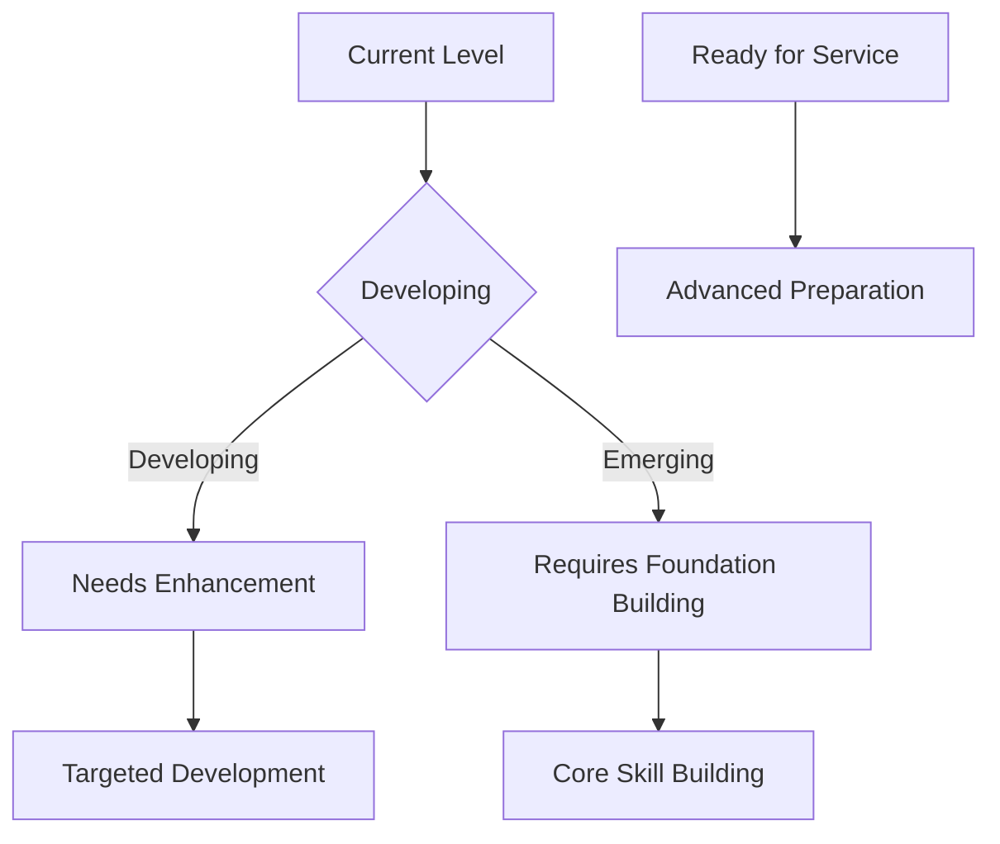
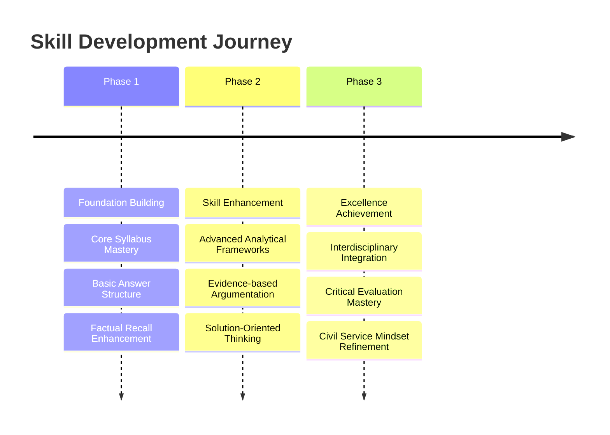
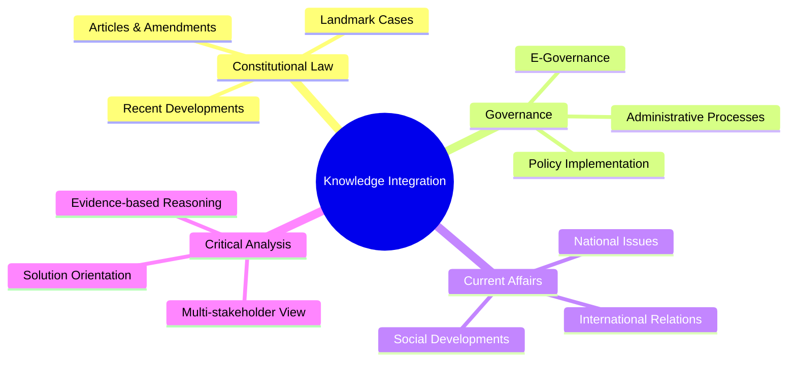

# ⚖️ UPSC GS Paper II Evaluation Report

## 📊 Overall Evaluation Dashboard

### 🎯 Performance Summary
> **Focus**: This comprehensive evaluation of Smriti Mishra's GS Paper II answer book reveals a candidate with a solid foundational understanding of governance, polity, social justice, and international relations. The answers generally demonstrate a clear comprehension of the questions' core demands and directive verbs, indicating a systematic approach to question deconstruction. A significant strength lies in the ability to recall and present relevant factual information, including constitutional articles, government initiatives, and contemporary examples, which is crucial for UPSC Mains. The candidate effectively uses diagrams and flowcharts to enhance presentation and logical flow, making the answers easier to follow. The attempt to provide multi-dimensional perspectives, especially in governance and IR questions, is commendable, showing an awareness of the complexities involved in public administration.

However, several critical areas require immediate and sustained development to elevate the answers from good to excellent, aligning them more closely with UPSC's stringent standards for top-tier performance. While factual recall is present, the answers often lack the requisite analytical depth and critical evaluation. There's a tendency towards descriptive writing rather than incisive analysis, which prevents the candidate from fully exploring the 'why' and 'how' of issues. The integration of evidence, though present, is not always strategic; specific data, landmark judgments, or committee recommendations are sometimes missing or not leveraged to strengthen arguments. A key area for improvement is the 'Solution-Orientation and Civil Servant Mindset'. While 'way forward' suggestions are provided, they often lack the administrative feasibility, innovative thinking, and holistic approach expected from a future civil servant. Furthermore, the constitutional accuracy, though generally good, needs to be absolute, and the application of constitutional principles in contemporary issues could be more nuanced. Addressing these areas systematically will transform the candidate's responses, enabling them to articulate more persuasive, well-reasoned, and high-scoring answers.

### ✅ Key Strengths
> **🌟 Impact Areas** - List 3-5 most impactful strengths:

-   **🎯 Question Comprehension and Structural Clarity**: The candidate consistently demonstrates a strong ability to grasp the core demand of the questions. The answers are generally well-structured with clear introductions, body paragraphs, and conclusions, which greatly aids readability and coherence. The use of sub-headings and bullet points, along with diagrams, effectively breaks down complex information, reflecting a systematic approach to answer writing. This foundational strength ensures that the candidate's responses are always relevant and organized.

-   **💡 Relevant Content and Examples**: A notable strength is the candidate's ability to recall and integrate relevant content, including specific government schemes (e.g., PM Ujjwala, Jan Dhan), constitutional articles (e.g., Article 148, 338A), and contemporary examples (e.g., 2G scam, Ukraine crisis, Vaccine Maitri). This shows a broad knowledge base across GS-II domains, providing a solid factual foundation for the arguments presented. The inclusion of current events demonstrates an awareness of dynamic issues impacting governance and international relations.

-   **🌐 Multi-Dimensional Perspective Attempt**: The candidate makes a conscious effort to address questions from multiple angles, particularly evident in the analysis of CAG's role, NGO-State relations, and India's foreign policy. This attempt to explore administrative, social, political, and economic dimensions, even if not always in exhaustive detail, showcases an understanding of the interconnectedness of various aspects of governance and policy, which is essential for comprehensive analysis.

### ⚠️ Primary Development Areas
> **⚡ Priority Focus** - List 3-5 most important areas for development with reasoning:

-   **⚖️ Enhance Constitutional and Factual Precision**: While constitutional articles are cited, there is a need for absolute accuracy and deeper integration of constitutional principles, landmark judgments, and specific provisions. For instance, in questions related to constitutional bodies or fundamental rights, a more precise invocation of relevant case laws and a nuanced interpretation of constitutional doctrines would significantly enhance the answer's quality. Misinterpretations or vague references can undermine the credibility of an argument, regardless of other strengths.

-   **🧠 Deepen Analytical Rigor and Critical Thinking**: The answers often tend to be descriptive rather than analytical. There is a need to move beyond merely stating facts or listing points to critically examining the 'why' and 'how' of issues, exploring underlying causes, implications, and interconnections. For example, instead of just listing challenges, a deeper analysis of the systemic or structural reasons behind those challenges, or a critical evaluation of policy effectiveness, would demonstrate higher-order thinking. This involves developing a framework for multi-stakeholder analysis and offering balanced, nuanced perspectives.

-   **📈 Strengthen Solution-Orientation and Administrative Feasibility**: While 'way forward' sections are present, they frequently lack the practical feasibility, innovation, and holistic vision expected from a civil servant. Solutions should not only be progressive but also consider implementation challenges, resource allocation, and potential constitutional/administrative hurdles. Developing a problem-solving mindset that offers concrete, actionable recommendations, possibly drawing from best practices or committee reports, is crucial for demonstrating a civil servant's aptitude.

-   **📊 Improve Evidence Integration and Substantiation**: Although examples are provided, the answers could benefit from more specific and diverse evidence, such as recent statistics, government reports (e.g., ARC, NITI Aayog), specific Supreme Court judgments, or international indices. Strategic integration of such evidence would lend greater credibility and depth to the arguments. For instance, citing specific data on poverty, education, or health would make the analysis more robust and evidence-based.

### 👮‍♂️ Civil Service Readiness
> **💡 Administrative Preparedness Assessment**

Smriti demonstrates a foundational level of administrative preparedness, marked by a clear understanding of government mechanisms and policy objectives. The ability to identify key stakeholders and challenges in various governance issues (like CAG's functioning, NGO-State relations, or welfare schemes) is a positive indicator. The answers reflect an awareness of the need for transparency, efficiency, and public trust in governance, which are core values of the civil service. The attempts at providing "way forward" suggestions, even if sometimes rudimentary, show an inclination towards problem-solving and a desire to contribute positively, which are essential civil servant qualities.

However, to transition from a developing to a strong level of readiness, several enhancements are necessary. The candidate needs to cultivate a more nuanced understanding of policy implementation complexities, including potential bottlenecks, inter-agency coordination issues, and the socio-economic impacts of policies on diverse populations. The solutions proposed should be more innovative, practical, and grounded in administrative realities, moving beyond generic recommendations to specific, implementable strategies. This involves thinking about resource constraints, political will, and the role of technology in governance. Furthermore, the ability to anticipate unintended consequences of policies and propose mitigating measures would signify a higher level of administrative foresight. Developing this deeper administrative acumen, coupled with enhanced analytical and critical thinking skills, will prepare the candidate to not just understand governance but to effectively contribute to it.

### 📈 UPSC Standard Alignment
> **🌟 Benchmarking Against Excellence**

Smriti's answer book shows a promising alignment with UPSC standards in terms of basic content coverage and structural presentation. The candidate successfully identifies the core demands of most questions and attempts to address them logically. The inclusion of relevant facts, constitutional articles, and examples demonstrates a good grasp of the syllabus and an ability to recall information under exam conditions. This forms a solid base upon which higher-order skills can be built.

However, the current performance falls short of the "Excellence Achievement" category due to a discernible gap in analytical rigor and critical depth. UPSC demands not just knowledge but the ability to dissect, evaluate, and synthesize information from multiple perspectives. The answers often lack the incisive analysis that delves into the 'why' behind phenomena, the 'how' of policy failures, or the 'what if' of alternative solutions. For instance, while challenges are listed, the systemic roots or constitutional implications are not always thoroughly explored. The critical thinking aspect, which involves challenging assumptions, identifying biases, and forming well-reasoned arguments, needs significant strengthening. Integrating static constitutional knowledge with dynamic current affairs in a seamless, analytical manner is another area where the candidate can improve to meet UPSC's high expectations. Achieving this level of depth and critical engagement will distinguish the answers, moving them from merely informative to truly insightful and persuasive, which is key to securing top marks in GS Paper II.

---

## 📝 Individual Answer Analysis

### 💬 Question 1: CAG's role
**❓ Question Text**: The role of CAG as the highest auditing authority is intrinsically linked to augmented efficacy of government policies and undertakings. In this context, examine how independent and efficient working of the CAG can ensure good governance? (10 marks, 150 words)
**📚 Syllabus Area**: `GS-II: Governance, Constitution, Accountability`

#### ✍️ Answer Comparison

##### 📝 Your Answer Summary
> **🌟 Key Points from Your Response** :
> The answer defines CAG, citing Article 148, and explains its audit processes (regulatory and performance). It lists benefits of CAG's independent working for good governance, such as transparency, efficiency, public trust, and strengthening federalism with examples like the 2G scam and cess collection. It concludes by highlighting challenges like appointment issues and post-mortem analysis, suggesting a committee-based appointment for better independence.

##### ⭐ Ideal Answer Framework
> **💡 UPSC Excellence Standard** :
> An ideal answer would begin by concisely defining the CAG as a constitutional body under Article 148, emphasizing its role as the guardian of the public purse and accountability. It would then elaborate on how its independence (secured by constitutional provisions like security of tenure, salary charged on CFI, and non-eligibility for further office) and efficiency (through comprehensive audits like regularity, propriety, performance, and compliance) contribute to good governance. Key points would include promoting transparency and accountability (e.g., through audit reports on specific scams), ensuring fiscal prudence and optimal resource utilization, strengthening parliamentary oversight, and fostering public trust. The answer would also critically examine challenges to its effectiveness (e.g., limited scope for real-time audit, post-facto nature, dependence on government for staff, lack of power to take action) and suggest concrete measures for improvement, such as expanding its mandate to PPP projects, strengthening its human resources, and ensuring timely follow-up on recommendations.

#### 📝 Evaluation Criteria

##### 💡 Relevance and Understanding
**🔎 Analysis** :
> The candidate demonstrates a good understanding of the question's core demand, which asks for an examination of how CAG's independent and efficient working ensures good governance. The answer correctly identifies the CAG as a key auditing authority and links its functions to outcomes like transparency and public trust. The inclusion of Article 148 and the distinction between regulatory and performance audits are relevant points that show foundational knowledge. The examples cited (2G scam, cess collection) are appropriate for illustrating the CAG's impact. The identification of challenges to CAG's independence and efficiency (appointment, post-mortem analysis) also indicates a comprehensive grasp of the topic's nuances. The overall structure and flow demonstrate that the candidate clearly understood the "examine" directive and addressed both "independence and efficiency" and "good governance" aspects.

**✅ Suggestions** :
-   To deepen the analysis, consider explicitly detailing *how* specific aspects of CAG's independence (e.g., security of tenure, salary charged on CFI, non-eligibility for further office) contribute to its effective functioning, rather than just stating "independent working." This would show a more profound constitutional understanding.
-   When discussing "good governance," elaborate on specific elements like accountability, transparency, efficiency, and rule of law, and then directly link CAG's actions to the achievement of these elements. For example, "CAG's audits, by identifying financial irregularities, directly enhance public accountability and deter corruption, which are pillars of good governance."

##### 🏛️ Structure and Organization
**🔎 Analysis** :
> The answer is well-structured, beginning with a clear introduction citing Article 148. The use of a flowchart to illustrate CAG's audit process (regulatory vs. performance) is an excellent visual aid that enhances clarity and organization. The subsequent points on how CAG ensures good governance are presented clearly using bullet points, making them easy to read and follow. The conclusion effectively summarizes challenges and offers a "way forward." The logical flow from defining CAG to its functions, benefits, and challenges is commendable. The answer also adheres well to the word limit, which indicates good time management and conciseness.

**✅ Suggestions** :
-   While the flowchart for audit processes is good, consider using similar visual aids or structured lists for the "benefits" and "challenges" sections to further enhance visual appeal and information retention. This could involve using small icons or distinct shapes for each point.
-   Ensure that the introduction clearly sets the stage by briefly mentioning CAG's constitutional status and its overarching importance before diving into details. This creates a stronger opening that immediately establishes the answer's relevance.

##### ⚖️ Constitutional and Governance Knowledge
**🔎 Analysis** :
> The answer demonstrates a good grasp of CAG's constitutional basis by citing Article 148. The understanding of its dual audit functions (regulatory and performance) is accurate and shows knowledge of its operational aspects. The examples provided, such as the 2G scam and cess collection, reflect awareness of contemporary governance issues where CAG has played a significant role. However, the constitutional knowledge could be deepened by explicitly mentioning other constitutional provisions that safeguard CAG's independence, such as its salary being charged on the Consolidated Fund of India (Article 148(6)), its non-eligibility for further government office (Article 148(4)), and the security of its tenure. While the challenges are noted, a deeper dive into specific governance reforms recommended by bodies like the Administrative Reforms Commission (ARC) concerning CAG would add significant value.

**📚 Study Recommendations** :
-   **Deep Dive into CAG's Constitutional Safeguards**: Thoroughly study Articles 148-151 of the Indian Constitution, focusing on all provisions that ensure CAG's independence (appointment process, removal, salary, non-eligibility for re-employment, etc.). Understand *why* each of these provisions is critical for its impartial functioning.
-   **Explore ARC Reports on Accountability**: Refer to the Second Administrative Reforms Commission (ARC) reports, particularly those dealing with financial management and accountability. Identify specific recommendations made to strengthen the CAG's role, expand its mandate (e.g., to PPP projects), or improve its effectiveness.
-   **Analyze Recent CAG Reports and Their Impact**: Stay updated on recent major CAG audit reports and their public and governmental impact. Understand the nature of the irregularities highlighted and the subsequent actions or policy changes, if any. This will provide more current and impactful examples.

##### 🧠 Analytical Rigor and Critical Thinking
**🔎 Analysis** :
> **⚡ HIGH PRIORITY** - The answer provides a descriptive account of CAG's role and benefits, but the analytical rigor could be significantly enhanced. While it states that CAG "brings transparency" or "preserves tenets of democracy," it doesn't deeply analyze *how* these mechanisms operate or *what* systemic changes they bring about. For example, how does a CAG report, despite being post-facto, influence future policy-making or administrative behavior? The critical examination of challenges is present, but could be more incisive. For instance, why does a "post-mortem analysis" limit efficacy? Is it due to the inability to prevent real-time corruption, or the difficulty in recovering lost funds? A deeper analysis of the structural and political impediments to CAG's full independence and effectiveness would elevate this section.

**✅ Suggestions** :
-   For each benefit identified (e.g., transparency, efficiency), delve deeper into the causal link. For example, "CAG's performance audits, by evaluating the economy, efficiency, and effectiveness of government programs, provide actionable insights that can lead to significant cost savings and improved service delivery, thereby directly enhancing administrative efficiency."
-   Critically analyze the proposed solution (committee-based appointment). Consider its potential benefits (e.g., reducing executive influence) and possible limitations (e.g., political consensus, expertise of committee members) to demonstrate a more nuanced understanding.

##### 📊 Evidence and Substantiation
**🔎 Analysis** :
> The answer provides relevant examples like the 2G scam and the cess collection report, which effectively substantiate the points on transparency and strengthening federalism. However, the evidence could be more diverse and quantitative. For instance, citing specific figures or the scale of financial irregularities identified by CAG reports would add more weight. While the examples are good, incorporating references to specific committee recommendations (like ARC) or landmark judgments that have reinforced CAG's role would further strengthen the arguments. The substantiation is present but could be more robust and varied to meet UPSC's high standards.

**⚡ Value Addition Suggestions** :
-   Integrate more specific, quantifiable data where possible. For instance, instead of just "off-budget borrowings were increasing," mentioning the approximate scale or impact of such borrowings as highlighted by CAG would be more impactful.
-   Include references to expert committees or official reports that have either lauded CAG's role or suggested reforms. For example, "The Second ARC report emphasized the need to expand CAG's audit jurisdiction to all entities receiving substantial public funds, including PPPs, to ensure comprehensive accountability."

##### 👮‍♂️ Solution Orientation and Civil Service Mindset
**🔎 Analysis** :
> **⚡ HIGH PRIORITY** - The answer does provide a solution-oriented conclusion by suggesting a "committee-based appointment" for the CAG. This reflects a positive intent to address the identified challenge of executive influence. However, the solution could be more detailed and explore other facets of strengthening the CAG's functioning from an administrative perspective. A civil servant mindset would also consider the practical feasibility and potential implications of such a change, as well as alternative or complementary solutions. The current suggestion, while valid, is somewhat singular and could be expanded to demonstrate a more comprehensive problem-solving approach.

**✅ Suggestions** :
-   Elaborate on the "committee-based appointment" by suggesting the composition of such a committee (e.g., involving the Prime Minister, Chief Justice of India, Leader of Opposition) and the criteria for selection, drawing parallels from other independent appointments.
-   Beyond appointment, suggest other administrative measures to enhance CAG's efficiency and independence, such as providing it with greater autonomy over its budget and staffing, or empowering it to conduct real-time audits for select critical projects to prevent rather than merely detect irregularities.

#### 💡 Key Insights
> **🌟 Strategic Takeaways** - 3-4 core strategic lessons from this answer:

-   🎯 **Constitutional Foundations are Paramount**: While Article 148 was mentioned, a deeper exploration of all constitutional provisions safeguarding CAG's independence is crucial. UPSC expects a thorough understanding of the constitutional framework of institutions.
-   💡 **Beyond Description to Analysis**: The answer successfully describes CAG's functions and benefits. The next step is to analyze *how* these functions translate into tangible outcomes for good governance and *why* certain challenges persist, linking them to systemic issues.
-   🌐 **Holistic Problem-Solving**: The suggestion for committee-based appointment is good, but a civil servant should envision a broader set of solutions that address multiple dimensions of a problem (e.g., administrative, financial, legal, technological) for comprehensive improvement.

#### 📝 Next Steps
> **🚀 Action Plan** - 3-4 specific, actionable tasks for the student:

-   [ ] **In-depth Study of Constitutional Provisions**: Dedicate specific study time to master all constitutional articles related to key institutions (e.g., CAG, ECI, UPSC, SC/HC). Understand their powers, functions, and the constitutional safeguards for their independence. Practice writing answers that explicitly integrate these provisions and relevant Supreme Court judgments.
-   [ ] **Practice Analytical Questioning**: For every topic, train yourself to ask "why," "how," and "what are the implications?" beyond just "what." Practice converting descriptive notes into analytical frameworks, focusing on cause-and-effect relationships and critical evaluation of policies and institutions.
-   [ ] **Research Governance Reports and Best Practices**: Systematically incorporate findings and recommendations from key governance reports (e.g., ARC, NITI Aayog strategies, Lokpal reports) into your answers. Also, study successful administrative reforms or policy implementations (national and international) to enhance your "way forward" suggestions with practical examples.

---

### 💬 Question 2: NGO-State alliance
**❓ Question Text**: Sustainable alliance between Non-Governmental Organizations (NGOs) and the State is critical for social change and development. Highlighting hurdles in this developmental alliance, suggest remedial measures for a more productive partnership. (10 marks, 150 words)
**📚 Syllabus Area**: `GS-II: Governance, Social Justice, Development Processes`

#### ✍️ Answer Comparison

##### 📝 Your Answer Summary
> **🌟 Key Points from Your Response** :
> The answer defines NGOs as voluntary associations working for social causes, providing examples like Bachpan Bachao Andolan. It illustrates the NGO-State interaction with a simple diagram. Key hurdles identified include trust deficit (citing FCRA norms), NGOs creating barriers, and misuse of NGO routes for illicit activities. Remedial measures suggested are platforms for interaction, streamlining funding, single-window engagement, and NGO representation in policy committees, concluding with the example of ASER India's data use by the government.

##### ⭐ Ideal Answer Framework
> **💡 UPSC Excellence Standard** :
> An ideal answer would start by defining NGOs and their indispensable role as catalysts for social change and development, especially in last-mile delivery and advocacy. It would emphasize that a sustainable State-NGO alliance is crucial for achieving inclusive growth and SDG targets. The answer would then comprehensively highlight hurdles, such as trust deficit (due to FCRA regulations, allegations of foreign interference, or misuse of funds), lack of transparency and accountability from both sides, capacity gaps within NGOs, bureaucratic hurdles, and ideological differences. Remedial measures would focus on fostering mutual trust (e.g., by streamlining FCRA, easing compliance burdens), enhancing transparency and accountability (e.g., third-party audits, social audits), strengthening capacity building for NGOs, promoting collaborative platforms (e.g., NITI Aayog's NGO Darpan portal), and establishing clear policy frameworks for partnership. Specific examples of successful collaborations and policy reforms would reinforce the points.

#### 📝 Evaluation Criteria

##### 💡 Relevance and Understanding
**🔎 Analysis** :
> The candidate has accurately identified the core demand of the question, which is to discuss the critical nature of the NGO-State alliance, highlight hurdles, and suggest remedial measures. The definition of NGOs and the examples provided are relevant. The diagram, though simple, effectively conveys the interaction. The identified hurdles (trust deficit, FCRA, misuse) are pertinent and reflect contemporary concerns regarding NGOs. The remedial measures are practical and directly address the identified challenges, showing a good grasp of policy solutions. The concluding example of ASER India reinforces the importance of such partnerships.

**✅ Suggestions** :
-   While "trust deficit" is identified, consider briefly explaining *why* this deficit exists from both the State's perspective (e.g., concerns about foreign funding, political activism) and NGOs' perspective (e.g., perceived government overreach, bureaucratic hurdles).
-   For "remedial measures," explicitly link each suggestion back to a specific hurdle it aims to overcome, thereby demonstrating a more targeted problem-solving approach.

##### 🏛️ Structure and Organization
**🔎 Analysis** :
> The answer follows a logical and coherent structure, starting with a definition, moving to hurdles, and then remedial measures. The use of a simple diagram is effective for visual representation. Bullet points are used appropriately for listing hurdles and measures, contributing to readability. The flow is smooth, and the conclusion brings in a relevant example. This clear organization helps in presenting complex information in an accessible manner, which is a strong point for UPSC Mains.

**✅ Suggestions** :
-   To further enhance structural excellence, consider using slightly more descriptive sub-headings for the hurdles and measures, perhaps reflecting the nature of the challenge or solution (e.g., "Regulatory Hurdles," "Measures for Enhanced Collaboration").
-   Ensure that the introduction clearly establishes the *criticality* of the alliance for social change and development, perhaps by mentioning specific sectors where NGOs are indispensable.

##### ⚖️ Constitutional and Governance Knowledge
**🔎 Analysis** :
> The answer touches upon key governance aspects related to NGOs, particularly the Foreign Contribution Regulation Act (FCRA) norms, which is a crucial piece of legislation governing NGOs. The mention of "illicit activities" and "forced conversions" reflects an awareness of the government's concerns regarding the misuse of NGO platforms, demonstrating knowledge of contemporary governance debates. The suggestion for NGO representation in policy committees indicates an understanding of participatory governance. However, the answer could benefit from explicitly mentioning the legal framework for NGOs (e.g., Societies Registration Act, Trusts Act) and the NITI Aayog's NGO Darpan portal, which is a key government initiative for transparency and partnership.

**📚 Study Recommendations** :
-   **Deepen Understanding of FCRA and its Implications**: Study the key provisions of the FCRA, its amendments, and the ongoing debates surrounding its impact on civil society. Understand both the government's rationale for stringent regulation and civil society's concerns about its potential for stifling legitimate activities.
-   **Explore NITI Aayog's Role in NGO Sector**: Research the role of NITI Aayog, particularly the NGO Darpan portal, as a platform for State-NGO collaboration, transparency, and data sharing. Understand how such initiatives aim to build trust and streamline engagement.
-   **Study Government Policies and Schemes for NGO Support**: Identify government policies or schemes that specifically aim to support or partner with NGOs (e.g., grants, capacity building initiatives). This will provide more concrete examples for "remedial measures."

##### 🧠 Analytical Rigor and Critical Thinking
**🔎 Analysis** :
> **⚡ HIGH PRIORITY** - The answer identifies relevant hurdles and measures but could benefit from deeper analytical rigor. While it mentions "trust deficit" and "FCRA norms," it doesn't critically analyze *how* these norms contribute to the deficit, or *what* the specific concerns are from both sides. For instance, is the FCRA genuinely about national security, or is it perceived as a tool to curb dissent? Similarly, when suggesting "streamlining funding," a critical analysis of the current complexities and *why* they need streamlining would add depth. The answer largely describes the problems and solutions rather than critically evaluating their underlying causes or potential impacts.

**✅ Suggestions** :
-   For each hurdle, analyze its root cause. For example, for "trust deficit," discuss whether it stems from a lack of transparency from NGOs, perceived political activism, or bureaucratic suspicion. This will lead to more targeted solutions.
-   When suggesting remedial measures, critically evaluate their potential effectiveness and challenges in implementation. For instance, "While single-window engagement is crucial, its success depends on inter-agency coordination and a genuine shift in bureaucratic mindset towards facilitation rather than control."

##### 📊 Evidence and Substantiation
**🔎 Analysis** :
> The answer provides good examples like Bachpan Bachao Andolan and ASER India, which effectively illustrate the points. However, the substantiation could be strengthened by including more specific data or reports. For instance, while FCRA is mentioned, citing specific instances of its application or the number of NGOs whose licenses have been cancelled would add factual weight. Additionally, referencing government reports or expert committee recommendations on NGO-State partnerships would enhance credibility.

**⚡ Value Addition Suggestions** :
-   Include more specific data or reports on the NGO sector in India, such as the number of NGOs, their contribution to GDP, or the scale of foreign funding received. This would provide a broader context and quantitative evidence.
-   Reference specific case studies of successful NGO-State collaborations (e.g., in disaster management, health, or education) that demonstrate effective partnership models and their positive impact.

##### 👮‍♂️ Solution Orientation and Civil Service Mindset
**🔎 Analysis** :
> **⚡ HIGH PRIORITY** - The remedial measures suggested are practical and solution-oriented, aligning with a civil servant mindset focused on improving governance. Suggestions like "platforms for interaction," "streamlining funding," and "representation in policy committees" are constructive. However, the answer could further demonstrate administrative feasibility by elaborating on *how* these measures would be implemented (e.g., specific digital platforms, inter-ministerial coordination, clear guidelines for committee representation). A more holistic approach might also consider capacity building for smaller NGOs or promoting a culture of social auditing.

**✅ Suggestions** :
-   For "streamlining funding," suggest concrete steps like developing a transparent online portal for grant applications, clear disbursement timelines, and simplified reporting mechanisms, reducing bureaucratic burden.
-   Beyond representation, suggest mechanisms for active participation and feedback incorporation from NGOs in policy formulation, ensuring their on-ground insights are truly valued and integrated into governance.

#### 💡 Key Insights
> **🌟 Strategic Takeaways** - 3-4 core strategic lessons from this answer:

-   🎯 **Contextualizing Legal Frameworks**: When mentioning acts like FCRA, it's important to briefly explain their purpose and the controversies surrounding them to demonstrate a comprehensive understanding.
-   💡 **Specificity in Solutions**: While general solutions are good, UPSC rewards specific, actionable, and administratively feasible recommendations. Think about the 'how' of implementation.
-   🌐 **Balanced Perspective**: When discussing challenges like "misuse," it's important to maintain a balanced view, acknowledging legitimate concerns while also advocating for a facilitative environment for genuine NGOs.

#### 📝 Next Steps
> **🚀 Action Plan** - 3-4 specific, actionable tasks for the student:

-   [ ] **Research Key Acts Governing NGOs**: Study the Societies Registration Act, Indian Trusts Act, and Foreign Contribution Regulation Act (FCRA) in detail. Understand their historical context, key provisions, and recent amendments.
-   [ ] **Analyze Government Initiatives for NGOs**: Familiarize yourself with government platforms and initiatives like NGO Darpan, and understand their objectives and impact. This will help in providing concrete examples of State-NGO collaboration.
-   [ ] **Develop Case Studies on NGO-State Partnerships**: Identify and analyze 2-3 successful and 2-3 challenging NGO-State collaborations in different sectors (e.g., health, education, environment) to understand the dynamics, best practices, and lessons learned.

---

### 💬 Question 3: Subsidies as populist tool
**❓ Question Text**: Subsidies have morphed into a populist tool to achieve electoral objectives rather than developmental goals. Examine. (10 marks, 150 words)
**📚 Syllabus Area**: `GS-II: Governance, Economy, Social Justice`

#### ✍️ Answer Comparison

##### 📝 Your Answer Summary
> **🌟 Key Points from Your Response** :
> The answer defines subsidies as financial aid for growth and development, citing food and fertilizer subsidies as examples of original intent (food security, vulnerable upliftment, equitable public goods). It then argues how subsidies have morphed into populist tools, influencing voters and affecting free and fair elections, giving examples of free electricity/water and competitive freebies in election manifestos, including Punjab's electricity subsidy. It highlights the negative impact on groundwater depletion and suggests proper targeting for inclusive growth.

##### ⭐ Ideal Answer Framework
> **💡 UPSC Excellence Standard** :
> An ideal answer would begin by defining subsidies and their original developmental intent – promoting equity, ensuring welfare, correcting market failures, and fostering specific sectors. It would then critically "examine" how this intent has been diluted, leading to subsidies morphing into populist tools. This would involve discussing the short-term electoral gains overriding long-term developmental goals, the creation of dependency, fiscal unsustainability, distortion of market signals, and the disproportionate benefits often accruing to non-poor sections (exclusion errors). Examples like free electricity leading to groundwater depletion, loan waivers, and competitive freebies in election manifestos would be crucial. The answer should also provide a balanced perspective, acknowledging the continued necessity of *targeted* subsidies for vulnerable sections. The conclusion would offer a nuanced "way forward" emphasizing rationalization, direct benefit transfer (DBT), universal basic income (UBI) as alternatives, and greater fiscal prudence.

#### 📝 Evaluation Criteria

##### 💡 Relevance and Understanding
**🔎 Analysis** :
> The candidate has accurately grasped the core demand of the question, which is to "examine" how subsidies have shifted from developmental tools to populist ones. The answer clearly defines subsidies and correctly identifies their original developmental objectives (food security, upliftment, equitable provision). It then effectively presents the "morphing" aspect with relevant examples of electoral freebies and their negative consequences (e.g., Punjab's groundwater depletion). The distinction between original intent and current practice is well-articulated, demonstrating a clear understanding of the question's premise.

**✅ Suggestions** :
-   To strengthen the "examine" directive, consider explicitly discussing the *mechanisms* through which subsidies become populist tools (e.g., competitive populism among political parties, lack of voter awareness regarding fiscal costs).
-   Briefly touch upon the economic implications of populist subsidies, such as their impact on fiscal deficit or investment in productive sectors, to provide a more comprehensive examination.

##### 🏛️ Structure and Organization
**🔎 Analysis** :
> The answer follows a logical progression, starting with the definition and original intent of subsidies, then moving to how they have morphed into populist tools, and concluding with a brief suggestion for improvement. The use of bullet points helps in presenting the arguments clearly. The Punjab electricity subsidy example is well-integrated to illustrate the point. The overall structure is coherent and easy to follow, indicating good organizational skills.

**✅ Suggestions** :
-   Consider adding a brief introductory sentence that sets the context of the debate around subsidies in India, before defining them. This would provide a stronger opening.
-   Ensure that the conclusion, while brief, explicitly reiterates the core argument and provides a forward-looking perspective on balancing welfare with fiscal prudence.

##### ⚖️ Constitutional and Governance Knowledge
**🔎 Analysis** :
> The answer demonstrates a general understanding of government welfare mechanisms (subsidies) and their policy objectives. The mention of Ujjwala Scheme as a developmental goal is accurate. The discussion on "free and fair elections" and "luring voters" touches upon critical governance issues related to electoral integrity and the role of the Election Commission. However, the answer could integrate more specific governance knowledge, such as the challenges of subsidy targeting (inclusion/exclusion errors), the role of Direct Benefit Transfer (DBT) in reducing leakages, or specific recommendations from NITI Aayog or other expert bodies on subsidy rationalization. While the Election Commission is mentioned implicitly, its role in regulating "freebies" could be explicitly discussed.

**📚 Study Recommendations** :
-   **Understand Different Types of Subsidies and Their Impact**: Study various types of subsidies (e.g., food, fertilizer, power, interest) and their economic and social impacts, including their benefits, costs, and unintended consequences.
-   **Focus on Direct Benefit Transfer (DBT)**: Research the evolution and impact of DBT as a governance reform aimed at improving the efficiency and targeting of subsidies. Understand its successes and limitations.
-   **Study Election Commission's Stance on Freebies**: Familiarize yourself with the Election Commission of India's views and proposals regarding the regulation of electoral freebies, including the legal challenges and debates surrounding them.

##### 🧠 Analytical Rigor and Critical Thinking
**🔎 Analysis** :
> **⚡ HIGH PRIORITY** - The answer describes the shift of subsidies towards populism effectively, but the analytical depth could be enhanced. While it states that freebies "lure voters" and "have no direct relation with development," a deeper analysis of the *political economy* of subsidies would strengthen the argument. For instance, why do political parties resort to freebies? What are the long-term socio-economic consequences beyond groundwater depletion (e.g., debt burden, distorted investment, disincentives for work)? The criticism of freebies is present, but a more nuanced view, acknowledging that some subsidies are indeed necessary for social justice, would demonstrate greater critical thinking.

**✅ Suggestions** :
-   When discussing the negative impacts, analyze the *opportunity cost* of populist subsidies – what developmental expenditures are foregone when large sums are spent on untargeted freebies?
-   Introduce a balanced perspective by acknowledging that *some* subsidies, when well-targeted, are essential for social justice and poverty alleviation, thus differentiating between "good" and "bad" subsidies.

##### 📊 Evidence and Substantiation
**🔎 Analysis** :
> The answer uses relevant examples like food subsidy, Ujjwala Scheme, and free electricity in Punjab, which are effective in illustrating the points. The mention of competitive freebies with "Party X" and "Party Y" is a good way to generalize the phenomenon. However, the substantiation could be strengthened by including specific data points or official reports. For instance, citing the total fiscal cost of certain subsidies, or the extent of groundwater depletion in Punjab due to free power, would add quantitative weight. References to economic surveys or NITI Aayog reports on subsidy rationalization would also enhance credibility.

**⚡ Value Addition Suggestions** :
-   Include specific financial data related to subsidies. For example, "Subsidies constitute a significant portion of government expenditure, often leading to a high fiscal deficit, as highlighted in recent Economic Surveys."
-   Cite specific examples of states or sectors where untargeted subsidies have led to significant environmental degradation or economic inefficiencies, beyond just Punjab.

##### 👮‍♂️ Solution Orientation and Civil Service Mindset
**🔎 Analysis** :
> **⚡ HIGH PRIORITY** - The answer concludes with a solution-oriented statement about "proper targeting" of subsidies. This reflects a civil servant mindset focused on efficiency and equitable distribution. However, the suggestion is quite broad and could be elaborated upon to demonstrate deeper administrative feasibility. A comprehensive solution would consider *how* proper targeting can be achieved (e.g., through Aadhaar-linked DBT, better beneficiary identification, technology utilization) and what administrative challenges might arise in the process. It could also explore alternative welfare delivery mechanisms.

**✅ Suggestions** :
-   Elaborate on "proper targeting" by suggesting concrete methods like leveraging technology (Aadhaar, JAM trinity), robust beneficiary identification mechanisms, and exclusion criteria to ensure subsidies reach only the truly needy.
-   Suggest exploring alternative welfare delivery mechanisms like Universal Basic Income (UBI) as a potential replacement for multiple fragmented subsidies, discussing its pros and cons from an administrative and social justice perspective.

#### 💡 Key Insights
> **🌟 Strategic Takeaways** - 3-4 core strategic lessons from this answer:

-   🎯 **Nuance in Policy Analysis**: Distinguish between the original, legitimate intent of policies (like subsidies for development) and their distorted, populist applications.
-   💡 **Fiscal Responsibility**: When discussing economic policies, always consider their fiscal implications and sustainability. Link populist measures to their impact on government finances.
-   🌐 **Multi-Sectoral Impact**: Recognize that policies in one sector (e.g., electricity subsidy) can have significant impacts on others (e.g., environment, agriculture).

#### 📝 Next Steps
> **🚀 Action Plan** - 3-4 specific, actionable tasks for the student:

-   [ ] **In-depth Study of Subsidy Reforms**: Research government initiatives and expert recommendations on subsidy rationalization, including the role of DBT, the PDS reforms, and the challenges in implementing these.
-   [ ] **Analyze the Political Economy of Welfare**: Study how political incentives influence policy-making, particularly in the context of welfare schemes and electoral promises. Understand the tension between short-term electoral gains and long-term developmental goals.
-   [ ] **Practice Integrated Economic and Governance Analysis**: Choose economic topics (e.g., fiscal policy, inflation, employment) and practice integrating them with governance challenges and solutions, focusing on their social justice implications.

---

### 💬 Question 4: NCST effectiveness
**❓ Question Text**: National Commission for Scheduled Tribes (NCST) can be most effective when its tasks are adequately supported by other mechanisms that improve the voice of the tribals. Discuss. (10 marks, 150 words)
**📚 Syllabus Area**: `GS-II: Constitution, Social Justice, Vulnerable Sections`

#### ✍️ Answer Comparison

##### 📝 Your Answer Summary
> **🌟 Key Points from Your Response** :
> The answer begins by stating the NCST's establishment through the 89th Constitutional Amendment Act (Article 338A) and outlines its primary tasks. It then discusses how NCST's effectiveness is enhanced by other mechanisms. These include separate health departments for tribals, political representation at various levels, and preservation of tribal culture. The answer concludes by acknowledging India's minimal efforts for tribals and suggests the need for a holistic tribal plan and urgent implementation.

##### ⭐ Ideal Answer Framework
> **💡 UPSC Excellence Standard** :
> An ideal answer would start by establishing the constitutional mandate of the NCST (Article 338A, 89th CAA) as a guardian of tribal rights and interests. It would then elaborate on its primary functions (investigating grievances, advising on development, monitoring safeguards). The core of the answer would discuss how NCST's effectiveness is significantly augmented by complementary mechanisms that empower tribal voices. These include the Panchayats (Extension to Scheduled Areas) Act (PESA), 1996, which grants self-governance rights; the Forest Rights Act (FRA), 2006, recognizing forest dwellers' rights; specific tribal sub-plans and budgetary allocations; political representation through reserved constituencies; and dedicated ministries (Ministry of Tribal Affairs). The answer would critically analyze challenges like inadequate implementation of PESA/FRA, lack of awareness among tribals, and resource constraints of NCST. The conclusion would emphasize a multi-pronged approach involving strengthening NCST's autonomy, better coordination among agencies, and community-centric development models to truly improve tribal voices and achieve social justice.

#### 📝 Evaluation Criteria

##### 💡 Relevance and Understanding
**🔎 Analysis** :
> The candidate has correctly interpreted the question's demand, which focuses on the NCST's effectiveness being supported by other mechanisms that amplify tribal voices. The mention of Article 338A and the 89th Constitutional Amendment Act is accurate and relevant. The primary tasks of NCST are correctly outlined. The suggested "other mechanisms" (health, political representation, culture preservation) are valid, though some are more direct in "improving tribal voice" than others. The conclusion about India doing "bare minimum" and the need for a "holistic plan" is a good critical assessment.

**✅ Suggestions** :
-   When discussing "other mechanisms," focus more directly on those that *empower* tribal voices and participation, such as specific legislative acts (e.g., PESA, FRA) or community-level institutions, rather than general welfare measures.
-   Explicitly state the "discuss" directive by presenting arguments for *why* these mechanisms are crucial for NCST's effectiveness, beyond just listing them.

##### 🏛️ Structure and Organization
**🔎 Analysis** :
> The answer begins with a strong constitutional foundation by citing the correct Article and Amendment. It then logically proceeds to outline NCST's role and subsequently discusses supporting mechanisms. The use of bullet points makes the content easy to follow. The flow is generally good, and the conclusion provides a summary and a forward-looking statement. The organization is clear and helps in conveying the information effectively within the word limit.

**✅ Suggestions** :
-   Consider adding a brief introductory sentence that emphasizes the historical marginalization of tribal communities to set the context for the need for NCST and other empowering mechanisms.
-   Ensure that the transition between NCST's role and "other mechanisms" is smoother, perhaps with a linking sentence that explicitly states the complementary nature of these mechanisms.

##### ⚖️ Constitutional and Governance Knowledge
**🔎 Analysis** :
> The answer accurately identifies the constitutional basis of NCST (Article 338A, 89th CAA) and its primary functions, demonstrating sound knowledge of constitutional bodies. The mention of high IMR, MMR, and poor nutritional outcomes among tribals shows awareness of their socio-economic vulnerabilities, which is relevant for social justice. However, the answer could significantly enhance its governance knowledge by including specific legislation designed to empower tribal communities and improve their voice, such as the Panchayats (Extension to Scheduled Areas) Act (PESA), 1996, and the Forest Rights Act (FRA), 2006. These acts are directly aimed at community governance and resource rights, which are central to tribal empowerment.

**📚 Study Recommendations** :
-   **In-depth Study of PESA Act, 1996**: Understand the key provisions of the PESA Act, its objectives (self-governance for tribal communities), and its significance in empowering Gram Sabhas in Scheduled Areas. This is a critical governance mechanism for tribal voice.
-   **Comprehensive Study of Forest Rights Act (FRA), 2006**: Learn about the FRA, its purpose (recognizing forest dwellers' rights), and its role in addressing historical injustices against tribal communities.
-   **Explore Tribal Sub-Plan and Eklavya Model Residential Schools**: Familiarize yourself with government initiatives like the Tribal Sub-Plan (TSP) and Eklavya Model Residential Schools (EMRS) as concrete examples of policy support for tribal development and welfare.

##### 🧠 Analytical Rigor and Critical Thinking
**🔎 Analysis** :
> **⚡ HIGH PRIORITY** - While the answer lists mechanisms for NCST's effectiveness, it lacks deep analytical rigor in explaining *how* these mechanisms specifically "improve the voice of tribals." For instance, how does a "separate health department" directly improve their voice, as opposed to just improving health outcomes? The core of the question lies in the *empowerment* aspect. A critical analysis would explain how PESA or FRA, by granting land rights and self-governance, directly empower tribal communities to articulate their needs and participate in decision-making. The answer describes elements related to tribal welfare but does not sufficiently analyze their direct contribution to enhancing tribal voice or NCST's effectiveness in that regard.

**✅ Suggestions** :
-   For each "mechanism," explicitly explain the *causal link* to "improving tribal voice." For example, "Political representation ensures that tribal concerns are voiced in legislative bodies, providing a direct channel for their issues to be addressed at the policy-making level."
-   Critically analyze the *limitations* of the listed mechanisms. For instance, while political representation exists, are there challenges in ensuring genuine representation or preventing co-option? This adds a layer of depth.

##### 📊 Evidence and Substantiation
**🔎 Analysis** :
> The answer makes a good start by citing Article 338A and mentioning socio-economic indicators like IMR and MMR for tribals. However, the evidence could be more specific and varied. For example, when discussing political representation, mentioning the number of reserved constituencies for STs or the presence of tribal ministers would add concrete detail. More importantly, the absence of references to key legislation like PESA or FRA, which are direct mechanisms for tribal empowerment, is a significant gap in substantiation for this question.

**⚡ Value Addition Suggestions** :
-   Cite specific legislative acts like the Panchayats (Extension to Scheduled Areas) Act (PESA), 1996, and the Forest Rights Act (FRA), 2006, as crucial mechanisms for empowering tribal communities and enhancing their voice.
-   Include examples of successful tribal self-governance initiatives or community-led development projects that demonstrate the positive impact of improved tribal voice.

##### 👮‍♂️ Solution Orientation and Civil Service Mindset
**🔎 Analysis** :
> **⚡ HIGH PRIORITY** - The answer concludes with a solution-oriented statement about the need for a "Holistic Tribal Plan" and urgent implementation. This reflects a progressive outlook. However, from a civil servant's perspective, the solution lacks administrative specificity and feasibility. What would a "holistic tribal plan" entail? How would it be urgently implemented? A stronger solution would propose concrete steps like strengthening the NCST's investigative powers, ensuring better coordination between central and state tribal welfare departments, or enhancing awareness campaigns among tribal communities about their rights and available mechanisms.

**✅ Suggestions** :
-   Elaborate on the "Holistic Tribal Plan" by suggesting key pillars such as land rights, access to education and healthcare, livelihood generation, and preservation of culture, with specific policy instruments for each.
-   Suggest administrative measures like capacity building for local tribal self-governance bodies (e.g., Gram Sabhas under PESA), ensuring timely and transparent utilization of tribal sub-plan funds, and leveraging technology for better service delivery in tribal areas.

#### 💡 Key Insights
> **🌟 Strategic Takeaways** - 3-4 core strategic lessons from this answer:

-   🎯 **Legislative Knowledge is Key**: For questions on vulnerable sections, knowledge of specific acts (like PESA, FRA) designed for their empowerment is indispensable.
-   💡 **Beyond Welfare to Empowerment**: Distinguish between general welfare measures and mechanisms that specifically empower communities to have a voice and participate in governance.
-   🌐 **Integrated Development Approach**: Emphasize that tribal development requires a multi-faceted approach, integrating constitutional safeguards, legislative measures, economic opportunities, and cultural preservation.

#### 📝 Next Steps
> **🚀 Action Plan** - 3-4 specific, actionable tasks for the student:

-   [ ] **Master Social Justice Legislation**: Create detailed notes on key acts related to social justice and vulnerable sections (e.g., PESA, FRA, SC/ST Prevention of Atrocities Act, Rights of Persons with Disabilities Act). Understand their provisions, implementation challenges, and impact.
-   [ ] **Analyze Tribal Development Models**: Research successful and innovative tribal development models in India (e.g., in states like Chhattisgarh, Odisha) that demonstrate effective community participation and sustainable livelihoods.
-   [ ] **Practice Question-Specific Analysis**: For questions asking for "mechanisms to improve voice," specifically tailor your points to how they facilitate participation, advocacy, and decision-making, rather than just general welfare.

---

### 💬 Question 5: Poverty normalization
**❓ Question Text**: Normalization of poverty as a feature of large population overshadows the lack of intent and capacity of political and administrative institutions. Do you agree? Justify using suitable examples. (10 marks, 150 words)
**📚 Syllabus Area**: `GS-II: Governance, Social Justice, Development Processes`

#### ✍️ Answer Comparison

##### 📝 Your Answer Summary
> **🌟 Key Points from Your Response** :
> The answer defines poverty in terms of income and human dimensions (UNDP). It then states that the normalization of poverty (traditional understanding of large population diluting growth benefits) overshadows the lack of intent and capacity. It justifies this by citing China's poverty reduction success and India's minimum standards. The answer further lists issues like leakages, understaffed institutions, and lack of funding as evidence of capacity gaps, concluding that poverty is a complex issue requiring an integrated approach to achieve SDG 1.

##### ⭐ Ideal Answer Framework
> **💡 UPSC Excellence Standard** :
> An ideal answer would begin by acknowledging the complex nature of poverty and then directly address the statement, agreeing that the narrative of large population often masks deeper systemic failures. It would justify this by arguing that while population size can be a factor, it is not destiny, as demonstrated by countries like China. The core argument would focus on the "lack of intent" (e.g., political will, focus on short-term gains, absence of comprehensive, rights-based approaches) and "lack of capacity" (e.g., inefficient public administration, corruption, inadequate resource allocation, poor policy implementation, skill gaps) within political and administrative institutions. Specific examples of policy failures, implementation gaps, or institutional weaknesses (e.g., PDS leakages, inadequate social security schemes, delays in justice delivery for the poor) would substantiate the argument. The answer would conclude by emphasizing that robust governance, political commitment, and strong administrative machinery are paramount for sustainable poverty eradication, rather than merely attributing it to population size.

#### 📝 Evaluation Criteria

##### 💡 Relevance and Understanding
**🔎 Analysis** :
> The candidate has successfully grasped the core argument of the question and directly addressed it by agreeing with the statement. The initial definitions of poverty (income, human) are relevant. The answer effectively uses China's example as a counter-argument to the population narrative, which is a strong justification. The subsequent listing of issues like leakages, understaffed institutions, and funding gaps directly supports the "lack of intent and capacity" argument. The conclusion linking poverty to complexity and SDG 1 is also relevant.

**✅ Suggestions** :
-   While agreeing with the statement, briefly explain *why* the large population narrative is problematic (e.g., it can be used as an excuse, diverts attention from governance failures).
-   When discussing "lack of intent," consider delving deeper into *why* political intent might be lacking (e.g., electoral calculations, elite capture, absence of a rights-based approach to poverty).

##### 🏛️ Structure and Organization
**🔎 Analysis** :
> The answer is logically structured, starting with a definition, directly addressing the question's premise, and then providing justifications and challenges. The use of bullet points for issues like leakages and understaffing enhances readability. The flow from a general understanding of poverty to a critical examination of institutional failures is coherent. The conclusion, though brief, brings in the SDG context.

**✅ Suggestions** :
-   Consider using a clear topic sentence for the paragraph that justifies agreement with the statement, explicitly stating that institutional failures are the primary drivers of persistent poverty.
-   Ensure that the introduction sets the stage by briefly acknowledging the conventional view of population and then immediately presenting the counter-argument that the question asks to examine.

##### ⚖️ Constitutional and Governance Knowledge
**🔎 Analysis** :
> The answer demonstrates an understanding of governance failures through its discussion of "leakages," "understaffed, overworked institutions," and "lack of funding." The mention of Janani Suraksha Yojana in Bihar and the Fodder scam as examples of leakages and scams indicates awareness of real-world governance challenges. However, the answer could incorporate more explicit constitutional or governance principles. For instance, linking the "lack of intent" to the Directive Principles of State Policy (DPSP) or fundamental rights (e.g., Right to Life under Article 21, Right to Livelihood) would strengthen the constitutional grounding. Discussing specific governance reforms aimed at poverty alleviation (e.g., PDS reforms, JAM trinity) would also enhance the administrative knowledge.

**📚 Study Recommendations** :
-   **Connect Poverty to Constitutional Provisions**: Study the Directive Principles of State Policy (DPSP), particularly Articles 38, 39, 41, 43, and 47, and understand how they mandate the state to work towards poverty eradication. Link these to the fundamental right to a dignified life (Article 21).
-   **Analyze Governance Reforms for Poverty Alleviation**: Research specific governance reforms and schemes aimed at reducing poverty and improving service delivery, such as the Public Distribution System (PDS) reforms, Direct Benefit Transfer (DBT), and initiatives like the National Rural Livelihoods Mission (NRLM).
-   **Study Reports on Poverty and Inequality**: Refer to government reports (e.g., Economic Survey, NITI Aayog's Multidimensional Poverty Index) and international reports (e.g., UNDP Human Development Report) to gain a deeper understanding of poverty dynamics and institutional challenges.

##### 🧠 Analytical Rigor and Critical Thinking
**🔎 Analysis** :
> **⚡ HIGH PRIORITY** - The answer successfully agrees with the statement but could deepen its analytical rigor. While it lists issues like "leakages" and "understaffed institutions," it doesn't critically analyze *why* these persist. Is it due to corruption, lack of training, bureaucratic inertia, or systemic design flaws? A deeper analysis would explore the complex interplay between political will (intent) and administrative capacity. For example, "lack of intent" can manifest as a preference for populist measures over structural reforms, while "lack of capacity" can be seen in inefficient delivery mechanisms or poor monitoring. The answer describes symptoms rather than analyzing the root causes of institutional failure.

**✅ Suggestions** :
-   For "lack of intent," analyze specific ways it manifests (e.g., policy paralysis, focus on vote-bank politics rather than long-term structural reforms, insufficient budget allocation to critical social sectors).
-   For "lack of capacity," delve into specific administrative bottlenecks such as corruption, weak accountability mechanisms, skill deficits in bureaucracy, or inadequate use of technology in service delivery.

##### 📊 Evidence and Substantiation
**🔎 Analysis** :
> The answer uses relevant examples like China's poverty reduction success, Janani Suraksha Yojana, and the Fodder scam, which are effective in supporting the arguments. The mention of "tied funds" and "centrally sponsored schemes" also shows an awareness of real-world financial challenges in governance. However, the evidence could be strengthened by incorporating more specific data or reports. For instance, citing the percentage of leakages in certain schemes, or referencing specific committee reports on administrative reforms that highlight capacity gaps, would add quantitative and authoritative weight.

**⚡ Value Addition Suggestions** :
-   Include more specific data on poverty in India (e.g., number of multidimensionally poor, progress on specific SDG targets) to provide a factual backdrop.
-   Reference expert committee reports or government surveys (e.g., Economic Survey) that have highlighted institutional weaknesses, corruption, or implementation gaps in poverty alleviation programs.

##### 👮‍♂️ Solution Orientation and Civil Service Mindset
**🔎 Analysis** :
> **⚡ HIGH PRIORITY** - The answer concludes with a solution-oriented statement about poverty being a complex issue requiring an integrated approach to achieve SDG 1. While this is a valid general statement, it lacks the administrative specificity and feasibility expected from a civil servant. A strong civil servant mindset would propose concrete, actionable strategies to overcome the "lack of intent and capacity," focusing on institutional reforms. This could include measures for enhancing accountability, improving administrative efficiency, leveraging technology, and fostering political commitment.

**✅ Suggestions** :
-   Propose specific administrative reforms to address "lack of capacity," such as civil service capacity building, performance-based incentives, and strengthening grievance redressal mechanisms.
-   Suggest measures to foster "political intent," such as promoting evidence-based policy-making, strengthening democratic accountability through informed public discourse, and advocating for long-term structural reforms over short-term populist measures.

#### 💡 Key Insights
> **🌟 Strategic Takeaways** - 3-4 core strategic lessons from this answer:

-   🎯 **Beyond Blame to Systemic Analysis**: While population is a factor, focus on analyzing systemic governance failures (lack of intent, capacity, corruption) as primary drivers of persistent problems.
-   💡 **Policy-Implementation Gap**: Always consider the gap between well-intentioned policies and their on-ground implementation. Analyze the administrative and political reasons for this gap.
-   🌐 **Data-Driven Arguments**: Strengthen arguments with specific data, reports, and expert committee recommendations to move beyond general statements to evidence-based analysis.

#### 📝 Next Steps
> **🚀 Action Plan** - 3-4 specific, actionable tasks for the student:

-   [ ] **In-depth Study of Governance Challenges**: Research common governance challenges in India (corruption, inefficiency, lack of accountability, bureaucratic inertia) and their impact on policy outcomes, especially in social justice.
-   [ ] **Analyze Administrative Reforms**: Study various administrative reforms (e.g., e-governance, citizen charters, Lokpal, RTI) and their effectiveness in improving governance and reducing poverty.
-   [ ] **Practice Root Cause Analysis**: For any socio-economic problem, practice identifying the underlying political, administrative, and systemic root causes, rather than just listing symptoms.

---

### 💬 Question 6: Manual scavenging
**❓ Question Text**: While manual scavenging is legally banned, socio-economic realities perpetuate this practice in the society. Comment. Suggest measured to deal with the menace of this social evil. (10 marks, 150 words)
**📚 Syllabus Area**: `GS-II: Social Justice, Vulnerable Sections, Governance`

#### ✍️ Answer Comparison

##### 📝 Your Answer Summary
> **🌟 Key Points from Your Response** :
> The answer defines manual scavenging and correctly identifies its legal prohibition under the 2013 Act. It then details the socio-economic realities that perpetuate the practice, including low literacy, skills, social integration, and lack of social security among the affected communities, often leading to it being their only livelihood. Measures suggested include immediate actions like machine deployment (Kerala model) and strong regulation, and medium/long-term measures like upskilling, awareness generation, and community-based rehabilitation, emphasizing social security to prevent re-entry into the profession.

##### ⭐ Ideal Answer Framework
> **💡 UPSC Excellence Standard** :
> An ideal answer would begin by defining manual scavenging as a dehumanizing practice, explicitly stating its legal prohibition under the Prohibition of Employment as Manual Scavengers and their Rehabilitation Act, 2013. It would then "comment" on how socio-economic realities perpetuate it, focusing on the deep-rooted caste-based discrimination (linked to the caste system and notions of purity/pollution), lack of alternative livelihoods, poor socio-economic status (low education, skill deficits), social exclusion, and inadequate rehabilitation measures. The answer would also highlight the failure of implementation of the Act. Remedial measures should be comprehensive and multi-pronged: technological solutions (mechanization, robotic cleaners), effective rehabilitation (skill development, alternative livelihoods, financial assistance), strict enforcement of the law (penalties for employers), social awareness campaigns to address caste prejudice, and ensuring dignity and social security (health, housing, education) for the affected communities. Constitutional provisions like Article 17 (abolition of untouchability) and Article 21 (right to dignified life) should be integrated.

#### 📝 Evaluation Criteria

##### 💡 Relevance and Understanding
**🔎 Analysis** :
> The candidate has a clear understanding of the question, accurately defining manual scavenging and citing the Prohibition of Employment as Manual Scavengers Act, 2013. The answer effectively addresses the "comment" directive by detailing the socio-economic realities that perpetuate the practice, such as low literacy, lack of skills, social integration, and social security. The suggested remedial measures are comprehensive, covering immediate, medium, and long-term actions, demonstrating a practical approach to the "suggest measures" directive. The Kerala model example is also relevant.

**✅ Suggestions** :
-   To strengthen the "comment" section, explicitly link the socio-economic realities to the historical caste system and its perpetuation of this practice, emphasizing the deep-rooted social prejudice involved.
-   Briefly mention the failure of the implementation of the 2013 Act as a key reason for the perpetuation of the practice, beyond just socio-economic realities.

##### 🏛️ Structure and Organization
**🔎 Analysis** :
> The answer is very well-structured, beginning with a definition and legal context, followed by a clear section on perpetuating socio-economic realities. The suggestions are categorized into "immediate" and "medium & long-term" measures, which is an excellent way to organize solutions and demonstrates a systematic approach. The use of bullet points and clear sub-headings enhances readability. The flow is logical and coherent, making the answer easy to follow and comprehensive within the word limit.

**✅ Suggestions** :
-   While the structure is already strong, consider adding a brief introductory sentence that emphasizes the dehumanizing nature of manual scavenging and its status as a grave social evil to set a stronger tone.
-   Ensure that the conclusion succinctly summarizes the multi-pronged approach required and reiterates the commitment to dignity for manual scavengers.

##### ⚖️ Constitutional and Governance Knowledge
**🔎 Analysis** :
> The answer correctly identifies the Prohibition of Employment as Manual Scavengers and their Rehabilitation Act, 2013, which is a key piece of legislation. The discussion of "strong regulation and heavy penalties" indicates an understanding of enforcement mechanisms. The emphasis on "social security" and "community-based rehabilitation" reflects knowledge of social welfare and justice principles. However, the answer could significantly benefit from explicitly linking the practice of manual scavenging to constitutional provisions like Article 17 (Abolition of Untouchability) and Article 21 (Right to Life with Dignity). Mentioning specific Supreme Court judgments on manual scavenging (e.g., Safai Karamchari Andolan vs. Union of India) would further strengthen the legal and governance grounding.

**📚 Study Recommendations** :
-   **Deep Dive into Constitutional Provisions**: Thoroughly study Article 17 (Abolition of Untouchability) and its relevance to manual scavenging. Also, understand how Article 21 (Right to Life and Personal Liberty) encompasses the right to a dignified life, which is violated by this practice.
-   **Analyze the Prohibition of Employment as Manual Scavengers Act, 2013**: Study the key provisions of this Act, including definitions, prohibitions, penalties, and rehabilitation measures. Understand its strengths and weaknesses in implementation.
-   **Research Supreme Court Judgments**: Familiarize yourself with landmark Supreme Court judgments related to manual scavenging, particularly Safai Karamchari Andolan vs. Union of India, and their directives for the eradication and rehabilitation of manual scavengers.

##### 🧠 Analytical Rigor and Critical Thinking
**🔎 Analysis** :
> **⚡ HIGH PRIORITY** - The answer provides a good descriptive analysis of socio-economic realities but could deepen its analytical rigor. While it lists factors like "low literacy, low skills," it doesn't critically examine *how* these factors are intertwined with the caste system and the historical exclusion that traps communities in this profession. A deeper analysis would explore the intergenerational nature of this occupation and the systemic barriers to upward mobility. For example, why do rehabilitation schemes often fail? Is it due to lack of political will, insufficient funding, or the persistence of social stigma? The answer describes the problem well but could offer more profound insights into its root causes and the complex challenges in breaking the cycle.

**✅ Suggestions** :
-   When discussing socio-economic realities, explicitly analyze the role of *social stigma* and *discrimination* as key perpetuating factors, beyond just economic disempowerment.
-   Critically evaluate the *implementation challenges* of the 2013 Act, such as inadequate identification of manual scavengers, insufficient rehabilitation packages, and weak enforcement mechanisms, to provide a more complete picture.

##### 📊 Evidence and Substantiation
**🔎 Analysis** :
> The answer effectively uses the Prohibition of Employment as Manual Scavengers Act, 2013, as a primary piece of evidence. The mention of the Kerala model for machine deployment is a good practical example. However, the substantiation could be enhanced by including specific statistics on the number of manual scavengers identified, the progress of rehabilitation programs, or the extent of mechanization achieved. References to government surveys or reports by the National Commission for Safai Karamcharis (NCSK) would also add authoritative weight.

**⚡ Value Addition Suggestions** :
-   Include specific data on the number of manual scavengers identified and rehabilitated under government schemes, and highlight the gaps in implementation.
-   Reference reports from the National Commission for Safai Karamcharis (NCSK) or social audits conducted by civil society organizations, which provide detailed insights into the ground realities and effectiveness of rehabilitation efforts.

##### 👮‍♂️ Solution Orientation and Civil Service Mindset
**🔎 Analysis** :
> **⚡ HIGH PRIORITY** - The remedial measures proposed are comprehensive and demonstrate a strong solution-oriented approach, covering technological, rehabilitative, and social aspects. Suggestions like "machine deployment," "upskilling," "awareness generation," and "community-based rehabilitation" reflect a practical and progressive civil servant mindset. The emphasis on "social security" to prevent re-entry is particularly insightful. This section is a strong point, as it offers actionable and feasible solutions to a complex social problem.

**✅ Suggestions** :
-   Beyond "awareness generation," suggest specific strategies for *behavioral change communication* to address the deep-seated social prejudices against manual scavengers, involving community leaders and public figures.
-   Consider adding a point on ensuring access to justice and legal aid for manual scavengers, enabling them to report violations and seek redressal under the Act, which is crucial for enforcement.

#### 💡 Key Insights
> **🌟 Strategic Takeaways** - 3-4 core strategic lessons from this answer:

-   🎯 **Integrate Constitutional Morality**: For social justice issues, always link the problem to fundamental rights and constitutional principles (e.g., Article 17, 21) to provide a strong moral and legal foundation.
-   💡 **Multi-pronged Approach to Social Evils**: Solutions to deep-rooted social problems must be holistic, combining legal enforcement, technological intervention, socio-economic rehabilitation, and attitudinal change.
-   🌐 **Beyond Legislation to Implementation**: Recognize that merely banning a practice is insufficient; the focus must shift to effective implementation, addressing the socio-economic realities and systemic failures that perpetuate it.

#### 📝 Next Steps
> **🚀 Action Plan** - 3-4 specific, actionable tasks for the student:

-   [ ] **Comprehensive Study of Social Exclusion**: Research the various dimensions of social exclusion in India (caste, gender, disability) and their manifestations, including specific discriminatory practices and their impact on vulnerable groups.
-   [ ] **Analyze Rehabilitation and Social Security Schemes**: Study government schemes for the rehabilitation of manual scavengers and other marginalized groups. Understand the design, benefits, and implementation challenges of such schemes.
-   [ ] **Practice Rights-Based Analysis**: For questions on social issues, practice structuring your answer with a strong focus on the rights violated, the constitutional provisions, the legal framework, and the rights-based solutions.

---

### 💬 Question 7: India's response to Ukraine
**❓ Question Text**: India's response to Ukraine crisis is an expression of strategic autonomy and not a reflection of strategic compulsions. Examine. (10 marks, 150 words)
**📚 Syllabus Area**: `GS-II: International Relations, India's Foreign Policy`

#### ✍️ Answer Comparison

##### 📝 Your Answer Summary
> **🌟 Key Points from Your Response** :
> The answer defines the Ukraine crisis and India's abstention from voting at the UN. It then presents the critics' view, attributing India's stance to "strategic compulsions" such as dependence on Russia for defense, the need to counter China, and historical friendship. Subsequently, it argues that India's response is an expression of "strategic autonomy," citing continued import of cheaper oil and prioritizing national interest. Further points include India's principled stand, call for dialogue, adherence to Panchsheel, condemnation of violence, and MEA Jaishankar's assertion of an "assertive" and non-bandwagoning foreign policy.

##### ⭐ Ideal Answer Framework
> **💡 UPSC Excellence Standard** :
> An ideal answer would begin by concisely setting the context of the Ukraine crisis and India's unique position of abstention in UN votes. It would then directly "examine" the statement by presenting both sides of the argument. First, it would address the "strategic compulsions" narrative, citing India's historical defense ties with Russia, dependence on Russian military hardware, and Russia's role in balancing China. Second, and more emphatically, it would argue for "strategic autonomy" as the primary driver. This would involve highlighting India's commitment to multilateralism, non-alignment 2.0 principles, its national interest (e.g., energy security through cheaper oil, food security, student safety), its emphasis on dialogue and diplomacy, and its refusal to be drawn into bloc politics. Examples of India's independent foreign policy decisions in other contexts would reinforce the argument. The conclusion would synthesize these points, asserting that India's response reflects a matured foreign policy rooted in its core values and long-term strategic interests in a multipolar world.

#### 📝 Evaluation Criteria

##### 💡 Relevance and Understanding
**🔎 Analysis** :
> The candidate has a clear understanding of the question, which asks to "examine" whether India's response to the Ukraine crisis is strategic autonomy or strategic compulsion. Both sides of the argument are presented with relevant points. The initial context-setting (Ukraine crisis, UN abstention) is appropriate. The points on defense dependence, countering China, and historical friendship accurately capture the "compulsion" argument. Similarly, the points on cheaper oil, national interest, principled stand, and S. Jaishankar's statement effectively support the "strategic autonomy" narrative. This demonstrates a good grasp of the nuanced debate surrounding India's foreign policy.

**✅ Suggestions** :
-   To deepen the "examine" directive, consider briefly discussing the *implications* of each interpretation (strategic autonomy vs. compulsion) for India's global standing and future foreign policy choices.
-   Explicitly mention that India's stance is a reflection of its long-standing principle of non-alignment and its evolution into "multi-alignment" or "non-alignment 2.0" in a multipolar world.

##### 🏛️ Structure and Organization
**🔎 Analysis** :
> The answer is well-structured, presenting both sides of the argument (compulsions vs. autonomy) in distinct sections, which aids clarity. The use of bullet points for each argument makes the content easy to follow. The flow from setting the context to presenting arguments and concluding with an emphasis on strategic autonomy is logical. The inclusion of MEA S. Jaishankar's quote adds authenticity to the conclusion.

**✅ Suggestions** :
-   Ensure that the introduction clearly states the central debate (strategic autonomy vs. compulsion) that the answer will "examine."
-   While the arguments for both sides are present, consider a stronger concluding synthesis that explicitly states which interpretation is more dominant and why, rather than just listing points.

##### ⚖️ Constitutional and Governance Knowledge
**🔎 Analysis** :
> While this question primarily falls under International Relations, a strong answer can subtly weave in governance principles. The mention of "national interest" and "strengthening federalism" (in the context of cess collection, though not directly related to Ukraine) shows an understanding of the objectives of the Indian state. The reference to "Panchsheel" reflects knowledge of India's diplomatic principles. However, the answer could implicitly link India's foreign policy choices to its constitutional values, such as promoting international peace and security (DPSP, Article 51). While not explicitly constitutional, understanding the decision-making process in foreign policy (role of MEA, Cabinet Committee on Security) would be part of governance knowledge.

**📚 Study Recommendations** :
-   **Study India's Foreign Policy Principles**: Familiarize yourself with the fundamental principles guiding India's foreign policy, such as non-alignment, strategic autonomy, multilateralism, and Act East Policy. Understand their evolution and contemporary relevance.
-   **Analyze India's Geopolitical Interests**: Research India's core geopolitical and geo-economic interests, including energy security, trade routes, diaspora welfare, and regional stability. Understand how these interests shape India's foreign policy decisions.
-   **Follow Key International Relations Thinkers**: Read analyses by prominent Indian and international foreign policy experts and think tanks (e.g., ORF, Observer Research Foundation) to gain deeper insights into complex global issues and India's stance.

##### 🧠 Analytical Rigor and Critical Thinking
**🔎 Analysis** :
> **⚡ HIGH PRIORITY** - The answer effectively presents arguments for both sides, but the analytical rigor could be deepened. While it lists factors like "defense dependence," it doesn't critically analyze the *extent* of this dependence or *how* India is diversifying its defense procurement. Similarly, for "cheaper oil," a deeper analysis would discuss the economic benefits and the trade-offs involved (e.g., potential diplomatic pressure). The answer describes the arguments well but could delve deeper into the *nuances* and *complexities* of India's decision-making process, demonstrating a more sophisticated understanding of strategic choices in a multipolar world.

**✅ Suggestions** :
-   For each point, critically analyze the degree to which it influences India's stance. For example, for "defense dependence," discuss India's efforts to indigenize defense production and diversify sources of military hardware.
-   Introduce the concept of "multi-alignment" or "non-alignment 2.0" as the contemporary manifestation of India's strategic autonomy, explaining how India engages with multiple powers without necessarily aligning with any single bloc.

##### 📊 Evidence and Substantiation
**🔎 Analysis** :
> The answer provides good examples like India's abstention at the UN and the import of cheaper oil. The citation of SIPRI for Russia's share in defense imports adds a quantitative dimension, which is excellent. The mention of MEA S. Jaishankar's statements also strengthens the arguments. However, the evidence could be further diversified to include other instances of India's independent foreign policy in recent times or specific details on India's UN voting record on other contentious issues.

**⚡ Value Addition Suggestions** :
-   Include more specific data on India's energy imports from Russia before and after the crisis to quantify the "cheaper oil" argument.
-   Reference other instances where India has demonstrated strategic autonomy, such as its stance on climate change negotiations, trade agreements, or its engagement with various geopolitical blocs (e.g., Quad, SCO, BRICS).

##### 👮‍♂️ Solution Orientation and Civil Service Mindset
**🔎 Analysis** :
> **⚡ HIGH PRIORITY** - While this question doesn't directly ask for solutions, a civil servant mindset can be demonstrated by a forward-looking perspective on India's foreign policy. The answer effectively highlights India's principled stance and prioritization of national interest. To further demonstrate a civil servant mindset, one could subtly suggest the long-term implications of India's strategic autonomy for its role as a global power or its ability to navigate future geopolitical complexities. This involves thinking about the sustainability and future direction of India's foreign policy.

**✅ Suggestions** :
-   Beyond just stating strategic autonomy, suggest its long-term implications for India's global role, such as becoming a net security provider in the Indian Ocean Region, a voice for the Global South, or a bridge-builder between different blocs.
-   Consider how India's stance on such crises contributes to its "soft power" and its image as a responsible global actor, which are crucial for its diplomatic influence.

#### 💡 Key Insights
> **🌟 Strategic Takeaways** - 3-4 core strategic lessons from this answer:

-   🎯 **Nuanced Foreign Policy Analysis**: Understand that foreign policy decisions are rarely driven by single factors; they are a complex interplay of historical ties, economic interests, geopolitical calculations, and core principles.
-   💡 **Strategic Autonomy as a Core Principle**: Recognize strategic autonomy as a defining feature of India's foreign policy, allowing it to pursue its national interests independently in a multipolar world.
-   🌐 **Beyond Bilateral to Multilateral**: Analyze India's foreign policy not just in bilateral terms but also in the context of multilateral institutions (UN, BRICS, SCO) and global challenges.

#### 📝 Next Steps
> **🚀 Action Plan** - 3-4 specific, actionable tasks for the student:

-   [ ] **Deep Dive into India's Foreign Policy Doctrines**: Study the evolution of India's foreign policy from Non-Alignment to Strategic Autonomy 2.0/Multi-alignment. Understand the historical context and contemporary relevance of each phase.
-   [ ] **Analyze India's Role in Key Global Events**: Select 3-4 major international events (e.g., Ukraine crisis, Afghanistan withdrawal, climate change negotiations) and analyze India's response, identifying the underlying principles and national interests at play.
-   [ ] **Follow Foreign Policy Debates**: Regularly read analyses from reputable Indian and international think tanks (e.g., MEA publications, IDSA, ORF, Chatham House) on India's foreign policy to grasp diverse perspectives and evolving dynamics.

---

### 💬 Question 8: Soft power vs. Hard power
**❓ Question Text**: Comment on the utility and effectiveness of soft power for furthering national interest. Can soft power replace hard power in international politics? (10 marks, 150 words)
**📚 Syllabus Area**: `GS-II: International Relations, Diplomacy`

#### ✍️ Answer Comparison

##### 📝 Your Answer Summary
> **🌟 Key Points from Your Response** :
> The answer defines soft power using Joseph Nye's concept and explains its utility in furthering national interest through culture and long-lasting influence, citing India's vaccine maitri. It then discusses limitations of hard power (destruction, instability, ineffectiveness in modern warfare) but argues that hard power is still crucial for deterrence, using the Ukraine example. The answer concludes that while soft power cannot fully replace hard power, it significantly raises a country's stature, citing India's vaccine diplomacy during the global crisis.

##### ⭐ Ideal Answer Framework
> **💡 UPSC Excellence Standard** :
> An ideal answer would begin by defining soft power (Joseph Nye's concept of attraction through culture, political values, and foreign policy) and hard power (military and economic coercion). It would then "comment" on the utility and effectiveness of soft power in furthering national interest, highlighting its ability to build trust, foster long-term influence, enhance diplomatic leverage, attract tourism and investment, and shape global norms and narratives (e.g., India's Yoga, Bollywood, spiritual tourism, Vaccine Maitri). The answer would then critically address whether soft power can *replace* hard power. It would argue that while soft power is increasingly vital in a networked world, it cannot entirely substitute hard power, which remains indispensable for national security, deterrence, protecting vital interests, and upholding international law (e.g., in cases of territorial aggression, counter-terrorism). The conclusion would emphasize that effective foreign policy relies on a smart combination of both soft and hard power, adapting to specific contexts and challenges, to achieve comprehensive national interest.

#### 📝 Evaluation Criteria

##### 💡 Relevance and Understanding
**🔎 Analysis** :
> The candidate has a clear understanding of the question, accurately defining soft power through Joseph Nye's concept. The answer effectively addresses both parts of the question: the utility and effectiveness of soft power (e.g., vaccine maitri) and whether it can replace hard power. The discussion on the limitations of hard power and its continued relevance for deterrence (Ukraine example) demonstrates a balanced perspective. The conclusion, emphasizing that soft power cannot entirely replace hard power but enhances stature, directly answers the central dilemma posed by the question.

**✅ Suggestions** :
-   To strengthen the "comment" directive, consider briefly explaining *how* soft power operates – through attraction and persuasion, rather than coercion, making it a more sustainable form of influence.
-   When discussing "national interest," elaborate on the specific aspects it furthers, such as economic diplomacy, cultural outreach, or multilateral cooperation.

##### 🏛️ Structure and Organization
**🔎 Analysis** :
> The answer is well-structured, starting with a definition of soft power. It then logically moves to its utility, followed by a discussion of hard power's limitations and its continued necessity. The use of examples like Vaccine Maitri and the Ukraine crisis is effective. The conclusion provides a clear and concise answer to the central question. The overall flow is coherent, making the arguments easy to follow within the word limit.

**✅ Suggestions** :
-   Consider using distinct sub-headings for "Utility of Soft Power" and "Can Soft Power Replace Hard Power?" to further enhance structural clarity and signal the shift in argument.
-   Ensure that the introduction briefly sets the context of the evolving nature of power in international relations before defining soft power.

##### ⚖️ Constitutional and Governance Knowledge
**🔎 Analysis** :
> While primarily an International Relations question, the answer can implicitly draw on governance principles related to foreign policy objectives. The concept of "national interest" is central to governance. The mention of "integration and influence" and "economic might" touches upon aspects of state capacity and economic governance that underpin a nation's power. However, direct constitutional or governance references are not explicitly required for this question, but understanding how state machinery facilitates soft power projection (e.g., through cultural diplomacy, public diplomacy) would be part of governance knowledge.

**📚 Study Recommendations** :
-   **Explore India's Soft Power Assets**: Research India's various soft power assets, including Yoga, Ayurveda, Bollywood, spiritual tourism, diaspora, and its democratic values. Understand how the government leverages these assets for diplomatic outreach.
-   **Study Public Diplomacy Initiatives**: Familiarize yourself with the Ministry of External Affairs' public diplomacy initiatives and cultural outreach programs aimed at enhancing India's global image and influence.
-   **Analyze Case Studies of Soft Power Diplomacy**: Look at examples of how countries (e.g., South Korea with K-Pop, Japan with anime) have effectively used soft power to further their national interests and draw lessons for India.

##### 🧠 Analytical Rigor and Critical Thinking
**🔎 Analysis** :
> **⚡ HIGH PRIORITY** - The answer provides a good descriptive overview of soft and hard power, but the analytical rigor could be deepened. While it states that soft power "reduces opportunity costs" or "builds public trust," it doesn't deeply analyze *how* these mechanisms operate. For instance, how does vaccine diplomacy specifically translate into diplomatic gains or enhanced trust? For the "can it replace" part, a deeper analysis would explore the concept of "smart power" – the strategic combination of both – as the optimal approach. The answer describes the roles of both types of power but could offer more profound insights into their symbiotic relationship and the contexts in which each is more effective.

**✅ Suggestions** :
-   When discussing the utility of soft power, analyze the *long-term, sustainable nature* of its influence compared to the often temporary or coercive nature of hard power.
-   Introduce the concept of "smart power" as the optimal approach, where a nation strategically combines its soft and hard power assets to achieve its foreign policy objectives in a complex global environment.

##### 📊 Evidence and Substantiation
**🔎 Analysis** :
> The answer uses excellent and highly relevant examples like India's Vaccine Maitri and the Ukraine crisis to substantiate its arguments. The mention of "McDonaldisation" is a creative way to illustrate cultural integration. However, the substantiation could be further strengthened by including specific data or other quantitative measures of soft power (e.g., global soft power indices where India ranks). More diverse examples of India's soft power beyond vaccine diplomacy (e.g., Yoga, Bollywood, spiritual tourism) would also add breadth.

**⚡ Value Addition Suggestions** :
-   Include India's ranking in global soft power indices (e.g., Brand Finance Global Soft Power Index) and briefly mention what factors contribute to its score.
-   Cite specific examples of India's cultural diplomacy initiatives (e.g., ICCR programs, International Yoga Day) that contribute to its soft power projection.

##### 👮‍♂️ Solution Orientation and Civil Service Mindset
**🔎 Analysis** :
> **⚡ HIGH PRIORITY** - While this question doesn't explicitly ask for solutions, a civil servant mindset can be demonstrated through a forward-looking perspective on India's foreign policy. The answer effectively concludes that soft power enhances a country's stature. To further demonstrate a solution-oriented approach, one could subtly suggest how India can strategically enhance its soft power projection in the future, or how policy-makers can better integrate soft and hard power tools. This involves thinking about practical diplomatic strategies.

**✅ Suggestions** :
-   Suggest administrative strategies for India to enhance its soft power projection, such as investing more in cultural exchanges, promoting educational tourism, leveraging the diaspora, and strengthening public diplomacy initiatives.
-   Discuss how a nation's domestic governance (e.g., democratic values, social justice, economic development) itself acts as a source of soft power, demonstrating a holistic understanding of state strength.

#### 💡 Key Insights
> **🌟 Strategic Takeaways** - 3-4 core strategic lessons from this answer:

-   🎯 **Conceptual Clarity**: Ensure a precise understanding of key IR concepts like soft power and hard power, including their theoretical underpinnings and practical applications.
-   💡 **Balanced Perspective**: Avoid taking extreme positions. Most complex IR questions require a nuanced, balanced perspective, often leading to a synthesis of different approaches (e.g., smart power).
-   🌐 **Contemporary Relevance**: Always connect theoretical concepts to current global events and India's foreign policy initiatives, using recent examples to substantiate arguments.

#### 📝 Next Steps
> **🚀 Action Plan** - 3-4 specific, actionable tasks for the student:

-   [ ] **Master IR Theories and Concepts**: Study key theories of International Relations (e.g., Realism, Liberalism, Constructivism, Smart Power) and apply them to analyze India's foreign policy and global events.
-   [ ] **Build a Repository of India's Soft Power Examples**: Systematically collect and categorize examples of India's soft power projection (e.g., cultural festivals, educational initiatives, humanitarian aid, diaspora engagement) to use as evidence.
-   [ ] **Practice Analytical Comparison Questions**: Practice questions that require comparing and contrasting different concepts (e.g., democracy vs. authoritarianism, regionalism vs. globalization) or approaches, ensuring a balanced and critical assessment.

---

### 💬 Question 9: India-Japan relations
**❓ Question Text**: India and Japan may have long enjoyed very cordial relations with substantial shared interests, but it also tends to be one that has been low on ambition, limited in outcomes and high in rhetoric. Critically examine. (10 marks, 150 words)
**📚 Syllabus Area**: `GS-II: International Relations, Bilateral Relations`

#### ✍️ Answer Comparison

##### 📝 Your Answer Summary
> **🌟 Key Points from Your Response** :
> The answer notes India and Japan celebrating 70 years of diplomatic ties. It identifies shared interests: being diamond democracies, cultural ties (spirituality, Buddhism), global governance reforms (G4 group for UNSC), and a vision for a free Indo-Pacific. However, it critically examines challenges: low ambition (limited trade, Sikei Bunsi policy on China), limited outcomes (delayed bullet train, no major defense deal, stalled projects), and high rhetoric (no progress on global initiatives like SCRI). The answer concludes by acknowledging India's benefits (ODA, para-diplomacy, space research) and calls them "natural partners" needing further cooperation.

##### ⭐ Ideal Answer Framework
> **💡 UPSC Excellence Standard** :
> An ideal answer would begin by acknowledging the historical depth and cordiality of India-Japan relations, emphasizing their shared democratic values and strategic convergence in the Indo-Pacific. It would then "critically examine" the statement by presenting a balanced view. It would agree on "substantial shared interests" (e.g., Quad, Supply Chain Resilience Initiative, economic cooperation, regional stability, global governance reform like UNSC expansion). However, it would then address the "low ambition, limited outcomes, high rhetoric" aspects. "Low ambition" could refer to the slow pace of economic integration (e.g., CEPA not fully leveraged, low FDI compared to potential). "Limited outcomes" could point to delayed mega-projects (e.g., Mumbai-Ahmedabad Bullet Train), gaps in defense cooperation, and challenges in translating strategic convergence into tangible benefits. "High rhetoric" could refer to grand pronouncements not always matched by concrete, timely implementation. The answer would then offer a counter-narrative, highlighting recent positive developments and strategic convergence (e.g., Quad, bilateral defense exercises, technology transfer, ODA). The conclusion would emphasize the immense untapped potential and the need for greater political will and administrative efficiency to translate strategic alignment into concrete, outcome-oriented collaboration, especially in critical and emerging technologies.

#### 📝 Evaluation Criteria

##### 💡 Relevance and Understanding
**🔎 Analysis** :
> The candidate has a clear understanding of the question's core demand, which is to "critically examine" India-Japan relations, specifically addressing shared interests versus the "low ambition, limited outcomes, high rhetoric" critique. The answer accurately identifies key shared interests (democracy, culture, global governance, Indo-Pacific) and directly addresses the critical aspects with relevant examples (CEPA, bullet train, defense deals). The mention of "Sikei Bunsi" policy is a good nuanced point. The conclusion, acknowledging benefits and calling them "natural partners," shows a balanced perspective.

**✅ Suggestions** :
-   To strengthen the "critically examine" directive, explicitly state whether you largely agree or disagree with the premise of the question, and then justify your stance through your arguments.
-   When discussing "low ambition," consider elaborating on *why* this might be the case, perhaps due to bureaucratic hurdles, differing economic priorities, or the sheer scale of projects.

##### 🏛️ Structure and Organization
**🔎 Analysis** :
> The answer is well-structured, starting with a brief introduction of the bilateral ties. It then clearly separates "shared interests" from "challenges" (low ambition, limited outcomes, high rhetoric), which directly addresses the question's premise. The use of bullet points for both sections enhances readability. The examples provided are well-integrated. The conclusion succinctly summarizes the relationship and its future potential. The organization is logical and effective in presenting a balanced argument.

**✅ Suggestions** :
-   Consider using a clear topic sentence for the paragraph discussing "shared interests" that directly links them to the "cordial relations" mentioned in the question.
-   Ensure that the introduction also briefly mentions the strategic importance of the India-Japan partnership in the current geopolitical landscape.

##### ⚖️ Constitutional and Governance Knowledge
**🔎 Analysis** :
> While primarily an International Relations question, the answer touches upon governance aspects through "global governance reforms" (UNSC expansion) and "policy" (Sikei Bunsi, Act East). The mention of "ODA" (Overseas Development Assistance) as a benefit for India reflects knowledge of international financial cooperation and its role in development. The challenges identified (delayed projects, stalled projects) implicitly point to administrative inefficiencies or implementation challenges within governance structures. However, the answer could implicitly connect the shared democratic values to constitutional governance, as both nations are vibrant democracies.

**📚 Study Recommendations** :
-   **Deep Dive into India's Bilateral Relations with Key Partners**: Systematically study India's relations with its key strategic partners (e.g., Japan, USA, Australia, France, Germany, ASEAN, Russia) across political, economic, defense, and cultural dimensions.
-   **Analyze Strategic Initiatives**: Understand the objectives and progress of key strategic initiatives like the Quad, Supply Chain Resilience Initiative (SCRI), and Indo-Pacific Economic Framework (IPEF) in the context of India-Japan cooperation.
-   **Study Economic Agreements**: Familiarize yourself with major economic agreements like CEPA (Comprehensive Economic Partnership Agreement) between India and Japan, and analyze their impact and implementation challenges.

##### 🧠 Analytical Rigor and Critical Thinking
**🔎 Analysis** :
> **⚡ HIGH PRIORITY** - The answer does a good job of presenting the arguments, but the analytical rigor could be deepened. While it lists "low ambition" and "limited outcomes," it doesn't always critically analyze the *underlying reasons* for these. For instance, why is CEPA not fully leveraged? Is it due to non-tariff barriers, differing regulatory standards, or lack of business-to-business connect? For "high rhetoric," a deeper analysis would explore how this gap between rhetoric and reality impacts the credibility of the partnership. The answer describes the problems well but could offer more profound insights into the systemic or political reasons for these challenges.

**✅ Suggestions** :
-   For "low ambition," analyze the role of bureaucratic hurdles, differing administrative cultures, or the cautious approach of Japanese companies compared to Chinese counterparts.
-   For "limited outcomes," critically examine the implementation challenges of mega-projects like the bullet train, including land acquisition issues, cost overruns, or technical complexities.

##### 📊 Evidence and Substantiation
**🔎 Analysis** :
> The answer provides relevant examples like the 70 years of diplomatic ties, G4 group, CEPA, bullet train, and SCRI, which are effective in substantiating the arguments. The mention of "Sikei Bunsi" policy is a nuanced detail. However, the substantiation could be strengthened by including specific data where possible. For instance, citing actual trade volumes, FDI figures from Japan, or the extent of ODA received would add quantitative weight. More specific details on defense cooperation or joint projects would also be beneficial.

**⚡ Value Addition Suggestions** :
-   Include specific trade and investment figures between India and Japan to quantify the "low ambition" argument in the economic sphere.
-   Reference specific joint defense exercises or technology transfer agreements as evidence of outcomes in the security domain, or the lack thereof.

##### 👮‍♂️ Solution Orientation and Civil Service Mindset
**🔎 Analysis** :
> **⚡ HIGH PRIORITY** - The answer concludes with a positive and solution-oriented statement, calling India and Japan "natural partners" who need "further cooperation" with "Trust-Transparency-Timeline" in mind. This reflects a progressive outlook. To further demonstrate a civil servant mindset, one could elaborate on *how* to achieve this "further cooperation" and address the identified challenges. This involves proposing concrete administrative or policy measures to enhance efficiency and accelerate project implementation.

**✅ Suggestions** :
-   Propose specific administrative measures to address "limited outcomes," such as establishing high-level joint task forces for monitoring mega-projects, streamlining regulatory approvals, or creating dedicated single-window clearance mechanisms for Japanese investments.
-   Suggest initiatives to bridge the "rhetoric-reality gap," such as focusing on achievable, measurable targets for cooperation, regular performance reviews, and enhanced public communication about concrete progress.

#### 💡 Key Insights
> **🌟 Strategic Takeaways** - 3-4 core strategic lessons from this answer:

-   🎯 **Balanced Criticism**: When asked to "critically examine" a relationship, provide a balanced view, acknowledging strengths and shared interests before delving into challenges and limitations.
-   💡 **Specificity in Challenges and Solutions**: Move beyond general statements like "delayed projects" to specific reasons for delays (e.g., land acquisition, bureaucratic hurdles) and then propose targeted solutions.
-   🌐 **Connecting Policy to Outcomes**: Analyze how policy pronouncements and strategic alignments translate into tangible outcomes on the ground, identifying the factors that facilitate or hinder this translation.

#### 📝 Next Steps
> **🚀 Action Plan** - 3-4 specific, actionable tasks for the student:

-   [ ] **Detailed Study of India's Bilateral Economic Relations**: Research trade volumes, FDI, and specific economic projects with key countries. Understand the factors that facilitate or impede economic cooperation.
-   [ ] **Analyze Project Implementation Challenges**: Study common challenges in implementing large-scale infrastructure and defense projects in India, particularly those involving international partners, and identify best practices for overcoming them.
-   [ ] **Practice "Critically Examine" Questions**: For such questions, always structure your answer to first present the positive/agreed-upon aspects, then critically analyze the negative/challenging aspects with specific examples, and conclude with a balanced, forward-looking synthesis.

---

### 💬 Question 10: India-West Asia relations
**❓ Question Text**: India's relation with West Asia has acquired depth and diversity that can navigate geopolitical hurdles. Comment. (10 marks, 150 words)
**📚 Syllabus Area**: `GS-II: International Relations, Bilateral Relations`

#### ✍️ Answer Comparison

##### 📝 Your Answer Summary
> **🌟 Key Points from Your Response** :
> The answer begins by acknowledging India's energy dependence on West Asia, followed by a map illustrating the region. It then details geopolitical hurdles: external players (US, Pakistan, China) and internal conflicts (Saudi-Iran, Israel-Palestine). Despite these, it argues that relations have gained depth and diversity beyond oil, citing the large Indian expat community, rework of FTA with GCC, investments (e.g., UAE food corridor), strategic partnerships (e.g., I2U2), worker protection, and India's role as a net security provider. It concludes with the quote "West Asia is Looking East," emphasizing the region's potential.

##### ⭐ Ideal Answer Framework
> **💡 UPSC Excellence Standard** :
> An ideal answer would begin by acknowledging the historical ties and the traditional energy-centric nature of India's relationship with West Asia. It would then "comment" on how this relationship has indeed acquired "depth and diversity," enabling it to navigate geopolitical hurdles. This "depth and diversity" would be elaborated through various dimensions:
> 1.  **Economic**: Beyond oil, growing trade, investments (e.g., in infrastructure, food security), remittances from large Indian diaspora.
> 2.  **Strategic/Security**: Counter-terrorism cooperation, defense partnerships, maritime security collaboration (e.g., IOR), joint exercises, intelligence sharing.
> 3.  **People-to-People**: Large Indian diaspora, cultural exchanges, religious tourism.
> 4.  **Multilateral Engagement**: Cooperation in various regional and international forums.
> The answer would then discuss how this diversified engagement allows India to "navigate geopolitical hurdles" like the Israel-Palestine conflict, Saudi-Iran rivalry, and external power interventions (e.g., China's growing presence), by maintaining independent, multi-aligned relationships. The conclusion would emphasize the strategic importance of West Asia for India's national interests and its evolving role as a comprehensive partner in the region, focusing on future potential.

#### 📝 Evaluation Criteria

##### 💡 Relevance and Understanding
**🔎 Analysis** :
> The candidate has a clear understanding of the question's core demand, which is to "comment" on the depth and diversity of India-West Asia relations and their ability to navigate geopolitical hurdles. The initial acknowledgment of energy dependence and the inclusion of a map effectively set the context. The identification of both external and internal geopolitical hurdles is accurate. The subsequent points on expat community, FTA, investments, strategic partnerships (I2U2), and security provider role effectively demonstrate the "depth and diversity" beyond traditional oil ties. The concluding quote is relevant.

**✅ Suggestions** :
-   To strengthen the "comment" directive, consider explicitly stating *how* the acquired depth and diversity *enable* India to navigate geopolitical hurdles (e.g., multi-alignment, independent engagement with rival factions).
-   Briefly mention the historical and cultural ties between India and West Asia in the introduction to provide a more holistic context.

##### 🏛️ Structure and Organization
**🔎 Analysis** :
> The answer is well-structured, starting with context and a map. It then logically proceeds to identify geopolitical hurdles before detailing the various dimensions of "depth and diversity" in the relationship. The use of bullet points for both hurdles and diverse aspects enhances readability. The flow is coherent, and the conclusion provides a relevant quote. The map is a good visual aid that supports the geographical context.

**✅ Suggestions** :
-   Ensure that the introduction clearly states the central argument that India's relations have indeed acquired depth and diversity.
-   While the map is good, ensure it's integrated seamlessly, perhaps by referring to it explicitly in the text (e.g., "As depicted in the map...").

##### ⚖️ Constitutional and Governance Knowledge
**🔎 Analysis** :
> While primarily an International Relations question, the answer touches upon governance aspects related to foreign policy objectives and economic diplomacy. The mention of "national interest" is key to governance. The discussion of "Free Trade Agreement with GCC" and "investments" reflects knowledge of economic governance and policy. "Worker protection" is a social justice and governance concern related to diaspora welfare. India's role as a "net security provider" also reflects a strategic governance objective. The answer could implicitly connect India's engagement with West Asia to its energy security and economic growth, which are vital governance responsibilities.

**📚 Study Recommendations** :
-   **Deep Dive into India's West Asia Policy**: Study the evolution of India's foreign policy towards West Asia, moving beyond traditional energy and diaspora ties to a more comprehensive engagement (e.g., security, counter-terrorism, technology).
-   **Analyze Regional Dynamics**: Familiarize yourself with the complex geopolitical dynamics of West Asia, including key regional rivalries (e.g., Saudi-Iran), major conflicts (e.g., Yemen), and the role of external powers.
-   **Research Economic and Strategic Initiatives**: Study specific economic and strategic initiatives involving India and West Asian countries, such as the I2U2 group (India, Israel, UAE, USA), strategic oil reserves, and joint counter-terrorism efforts.

##### 🧠 Analytical Rigor and Critical Thinking
**🔎 Analysis** :
> **⚡ HIGH PRIORITY** - The answer describes the "depth and diversity" well, but the analytical rigor could be deepened, especially in explaining *how* this diversity helps navigate geopolitical hurdles. For instance, how does the large expat community specifically help navigate the Saudi-Iran rivalry? Or how does FTA with GCC help mitigate US intervention? A deeper analysis would explore India's multi-aligned diplomacy, its ability to engage with rival factions independently, and its focus on economic and security partnerships that transcend regional conflicts. The answer lists the elements but could better analyze their functional significance in navigating complex geopolitical landscapes.

**✅ Suggestions** :
-   For each dimension of "depth and diversity," analyze *how* it contributes to India's strategic leverage and resilience in navigating regional conflicts and external power interventions.
-   Critically evaluate the *limitations* of this diversified engagement. Are there still areas where geopolitical hurdles significantly constrain India's options? This adds a layer of nuance.

##### 📊 Evidence and Substantiation
**🔎 Analysis** :
> The answer provides relevant examples like the Indian expat community (8 million), the I2U2 group, and the UAE food corridor investment ($7 billion), which are excellent and specific. The mention of GCC FTA and India's role as a net security provider also adds weight. The map is a good visual aid. However, the substantiation could be further strengthened by including more specific data on trade volumes, defense cooperation, or counter-terrorism efforts. More specific examples of cultural ties or people-to-people exchanges would also add breadth.

**⚡ Value Addition Suggestions** :
-   Include specific trade and investment figures between India and key West Asian countries to quantify the economic dimension of "depth and diversity."
-   Reference specific instances of defense cooperation or counter-terrorism intelligence sharing with West Asian nations to substantiate the security dimension.

##### 👮‍♂️ Solution Orientation and Civil Service Mindset
**🔎 Analysis** :
> **⚡ HIGH PRIORITY** - The answer concludes with a forward-looking statement, quoting "West Asia is Looking East" and emphasizing the region's tremendous potential. This reflects a progressive and optimistic outlook, characteristic of a civil servant. To further demonstrate a solution-oriented mindset, one could subtly suggest administrative or diplomatic strategies for India to capitalize on this potential and further deepen its engagement, particularly in emerging areas like renewable energy, technology, and food security.

**✅ Suggestions** :
-   Suggest specific administrative and diplomatic strategies for India to capitalize on the "tremendous potential," such as promoting joint ventures in renewable energy, facilitating technology transfer, and strengthening food security partnerships through investment in agricultural infrastructure.
-   Discuss how India can leverage its soft power (e.g., cultural ties, diaspora) to further enhance its diplomatic influence and foster greater understanding in the region, contributing to regional stability.

#### 💡 Key Insights
> **🌟 Strategic Takeaways** - 3-4 core strategic lessons from this answer:

-   🎯 **Beyond Traditional Ties**: When analyzing bilateral relations, move beyond traditional points (e.g., oil, diaspora) to explore emerging dimensions (e.g., security, technology, food security).
-   💡 **Geopolitical Acumen**: Understand the complex geopolitical landscape of key regions and how India navigates these challenges through multi-aligned and independent foreign policy.
-   🌐 **Future-Oriented Vision**: Conclude IR answers with a forward-looking perspective, outlining potential areas of cooperation and India's strategic objectives for the future.

#### 📝 Next Steps
> **🚀 Action Plan** - 3-4 specific, actionable tasks for the student:

-   [ ] **Comprehensive IR Regional Study**: Systematically study India's relations with key regions (e.g., West Asia, South Asia, ASEAN, Africa, Europe) covering historical context, economic ties, strategic interests, and cultural connections.
-   [ ] **Build a Geopolitical Map**: For each region, understand the internal dynamics (conflicts, alliances) and external power interventions. Practice drawing simple maps to aid visualization and recall.
-   [ ] **Follow Current Affairs on IR**: Regularly read news analyses, government press releases, and reputable IR journals to stay updated on the latest developments in India's foreign policy and global affairs.

---

## 🚀 Comprehensive Development Plan

### ⚡ Immediate Priorities
> **🔥 Critical Focus Areas** - 3 key areas requiring immediate attention:

#### ⚖️ Priority 1: Constitutional and Factual Precision
**🎯 Improvement Strategy** :
> This is the most critical area for immediate improvement. While the candidate demonstrates broad knowledge, specific constitutional articles, landmark judgments, and precise factual details are sometimes missing or vaguely referenced. UPSC demands absolute accuracy in these areas. The strategy involves dedicated, systematic study of foundational texts like the Indian Constitution (specifically articles related to key institutions, fundamental rights, DPSPs, and amendments), and key government acts (e.g., FCRA, PESA, FRA, RPA). For each topic, create concise notes that highlight relevant articles, sections, and the year of the act. Additionally, maintain a separate log of landmark Supreme Court judgments (e.g., SR Bommai for Article 356, Safai Karamchari Andolan for Manual Scavenging) and their precise implications. Practice incorporating these exact references into answers, not just mentioning the topic but citing the specific provision. For example, instead of "CAG's independence," write "CAG's independence, enshrined in Article 148 of the Constitution, is further protected by provisions like its salary being charged on the Consolidated Fund of India (Article 148(6))." Regular revision of these specific facts and self-quizzing will solidify retention and enable accurate recall under exam pressure.

#### 🧠 Priority 2: Enhanced Analytical Rigor and Critical Thinking
**🎯 Improvement Strategy** :
> The current answers tend to be descriptive. To move to a higher analytical plane, the candidate must develop the ability to critically dissect issues, explore underlying causes, and evaluate implications. The strategy involves practicing "root cause analysis" for every problem identified: instead of merely listing "leakages," delve into *why* they occur (e.g., corruption, systemic design flaws, lack of accountability). For policies, move beyond stating benefits/challenges to critically *evaluating* their effectiveness, feasibility, and unintended consequences. Employ frameworks like multi-stakeholder analysis (considering perspectives of citizens, government, civil society, private sector, international actors) and a "pros and cons" approach for every solution. Practice Socratic questioning while reviewing notes and answers: "Why is this significant?", "How does this work?", "What are the counter-arguments?", "What are the long-term implications?". This continuous self-interrogation will foster a deeper, more critical engagement with the subject matter, transforming descriptive points into incisive analytical arguments.

#### 📈 Priority 3: Strategic Solution-Orientation and Administrative Feasibility
**🎯 Improvement Strategy** :
> While "way forward" sections are present, they often lack administrative specificity and innovative thinking. UPSC seeks candidates who can offer practical, implementable, and holistic solutions that demonstrate a civil servant's mindset. The strategy involves researching successful administrative reforms and policy innovations (both Indian and international best practices). For every problem, brainstorm solutions that are not just desirable but also feasible, considering resource constraints, political will, and bureaucratic capacity. Think about the 'how' of implementation: e-governance tools, capacity building, inter-agency coordination, legislative reforms, citizen participation. For example, instead of "proper targeting of subsidies," suggest "leveraging JAM trinity (Jan Dhan-Aadhaar-Mobile) for Direct Benefit Transfer (DBT) to reduce leakages and ensure last-mile delivery." Develop a habit of thinking about solutions that are progressive, inclusive, and sustainable, reflecting empathy for vulnerable sections and a commitment to good governance.

### 🗺️ Skill Building Roadmap

#### 📚 Phase 1: Foundation Building
**🌟 Focus Areas**:
-   🎯 **Core Syllabus Mastery**: Develop a strong foundational understanding of all topics in GS Paper II (Constitution, Governance, Social Justice, International Relations). This involves covering standard textbooks and official government sources.
-   🎯 **Basic Answer Structure**: Practice structuring answers with clear introductions, body paragraphs (with sub-headings/bullet points), and conclusions, ensuring logical flow and adherence to word limits.
-   🎯 **Factual Recall Enhancement**: Focus on accurately memorizing key articles, acts, schemes, committees, and relevant data points across all GS-II domains.

**✅ Activities**:
-   ✅ **Structured Reading**: Read standard textbooks (e.g., M. Laxmikanth for Polity, Governance by M. Laxmikanth, Vision IAS notes for IR/Social Justice) systematically. Create concise notes highlighting key concepts, definitions, and classifications.
-   ✅ **Daily Current Affairs Integration**: Regularly read newspapers (The Hindu, Indian Express) and monthly current affairs magazines. Map current events to specific GS-II syllabus topics and note down relevant facts, policies, and debates.
-   ✅ **Basic Answer Writing Practice**: Attempt 2-3 questions daily, focusing on structuring answers and including relevant facts. Start with 10-mark questions to build speed and conciseness, then move to 15-mark questions.

#### 💡 Phase 2: Skill Enhancement
**🌟 Focus Areas**:
-   🎯 **Advanced Analytical Frameworks**: Learn and apply frameworks for critical analysis (e.g., SWOT, PESTEL for policies, multi-stakeholder analysis, root cause analysis).
-   🎯 **Evidence-based Argumentation**: Develop the skill of integrating diverse evidence (statistics, reports, judgments, case studies) strategically to strengthen arguments.
-   🎯 **Solution-Oriented Thinking**: Practice developing actionable, feasible, and innovative solutions, considering administrative realities and long-term impact.

**✅ Activities**:
-   ✅ **Thematic Analysis**: Pick a GS-II theme (e.g., federalism, judicial activism, poverty alleviation) and analyze it from multiple dimensions (constitutional, political, economic, social, international). Identify interlinkages.
-   ✅ **Case Study Approach**: For social justice and governance questions, research real-world case studies (successful policies, implementation failures, specific social issues). Analyze their causes, impacts, and lessons learned.
-   ✅ **Debate and Discussion**: Engage in discussions on current affairs with peers or mentors. Practice articulating your arguments, defending your stance, and considering counter-arguments to sharpen critical thinking.

#### 🌐 Phase 3: Excellence Achievement
**🌟 Focus Areas**:
-   🎯 **Interdisciplinary Integration**: Master the art of seamlessly connecting knowledge across different GS papers (e.g., GS-II with GS-I history/society, GS-III economy/environment) to provide holistic answers.
-   🎯 **Critical Evaluation Mastery**: Develop the ability to offer nuanced, balanced, and insightful critiques of policies, institutions, and events, avoiding extreme positions.
-   🎯 **Civil Service Mindset Refinement**: Internalize the values of empathy, integrity, impartiality, and problem-solving, reflecting them explicitly in "way forward" sections and overall answer tone.

**✅ Activities**:
-   ✅ **Mock Tests and Self-Evaluation**: Regularly attempt full-length mock tests under timed conditions. Critically evaluate your own answers against UPSC criteria, identifying recurring errors and areas for improvement.
-   ✅ **Peer Review and Expert Feedback**: Seek feedback from peers and experienced mentors. Engage in constructive discussions about your answers to gain different perspectives and identify blind spots.
-   ✅ **Practice High-Difficulty Questions**: Focus on questions with complex directive verbs (e.g., "critically evaluate," "elucidate," "substantiate") that require advanced analytical and synthesis skills.

---

## 🧠 Meta Learning Guidance

### 💡 Self-Assessment Skills
> **🌟 Developing Internal Evaluation Capabilities**

Developing strong self-assessment skills is paramount for continuous improvement in UPSC preparation. After attempting any answer, don't just move on; take 10-15 minutes to critically review your own response before looking at a model answer or getting external feedback. Ask yourself:
1.  **Question Understanding**: Did I address all parts of the question? Did I correctly interpret the directive verb (examine, discuss, analyze, comment)? Is my answer directly relevant?
2.  **Structure**: Is my introduction compelling and clear? Is the body logically organized with clear headings/subheadings? Does my conclusion offer a strong way forward?
3.  **Content**: Is my factual information accurate (articles, acts, data)? Are there any knowledge gaps? Have I included sufficient relevant examples?
4.  **Analysis**: Have I gone beyond description to truly analyze the 'why' and 'how'? Have I presented multiple perspectives? Is my argument coherent and well-reasoned?
5.  **Evidence**: Have I substantiated my points with specific evidence (reports, judgments, data)? Is the evidence integrated effectively to support my arguments?
6.  **Civil Servant Mindset**: Are my solutions practical, feasible, and progressive? Do they reflect empathy and inclusivity?

By internalizing these criteria, you train your mind to think like an evaluator, which naturally improves your answer-writing quality. This meta-learning process transforms every answer you write into a learning opportunity, making your preparation highly efficient and targeted.

### 🔄 Error Pattern Recognition
> **⚡ Identifying and Breaking Negative Cycles**

One of the most effective strategies for systematic improvement is to identify and address recurring error patterns. After reviewing multiple answers (either self-evaluated or externally graded), create an "Error Log." For each answer, note down:
1.  **Type of Error**: E.g., "Lack of constitutional precision," "Descriptive answers," "Generic solutions," "Poor time management," "Missing multi-dimensional analysis."
2.  **Specific Example**: Cite a line or paragraph from your answer that exemplifies this error.
3.  **Root Cause**: Why did this error occur? (e.g., "Insufficient revision of articles," "Didn't practice analytical questions," "Lack of administrative knowledge").
4.  **Action Plan**: What specific steps will you take to correct this error in future answers? (e.g., "Revise Article 338A daily for one week," "Practice 2 analytical questions on governance every day," "Read ARC reports on public administration").

Regularly review this error log. You'll start noticing patterns – perhaps you consistently struggle with "solution feasibility" or "integrating current affairs." Once identified, these patterns become your immediate priorities for focused study and practice. This systematic approach ensures that you're not just practicing, but *improving* in a targeted manner, breaking negative cycles and building upon your strengths.

### 🔗 Integration Mastery
> **🌐 Connecting Knowledge Across Domains**

UPSC GS Paper II demands a holistic understanding, requiring candidates to integrate knowledge across Constitution, Governance, Social Justice, and International Relations. This means seeing the interconnectedness of issues. For instance:
*   A question on **social justice** (e.g., manual scavenging) requires knowledge of **constitutional provisions** (Article 17, 21), **governance mechanisms** (specific acts, rehabilitation schemes, administrative challenges), and potentially **international best practices**.
*   A question on **governance** (e.g., CAG) links to **constitutional provisions** (Article 148), **economic implications** (fiscal prudence), and **accountability** principles.
*   A question on **international relations** (e.g., India-Japan ties) often has **economic dimensions** (trade, investment), **strategic implications** (regional security), and **governance aspects** (policy implementation, diplomatic efforts).

To achieve integration mastery:
1.  **Mind Mapping**: Create mind maps for core topics, branching out to related constitutional articles, government schemes, international conventions, and socio-economic indicators.
2.  **Cross-Referencing**: While studying, consciously cross-reference topics. If reading about federalism, think about its implications for social justice schemes or Centre-State relations in international agreements.
3.  **Holistic Problem Solving**: When proposing solutions, think across domains. For poverty, consider not just economic solutions but also governance reforms, social empowerment, and legal safeguards.
4.  **Practice Integrated Questions**: Seek out or frame questions that explicitly require interdisciplinary knowledge. This active practice will train your mind to draw connections organically.

---

## 🌟 End of Evaluation Report

**🚀 Remember**: Excellence is a journey, not a destination. Keep growing! 📈

