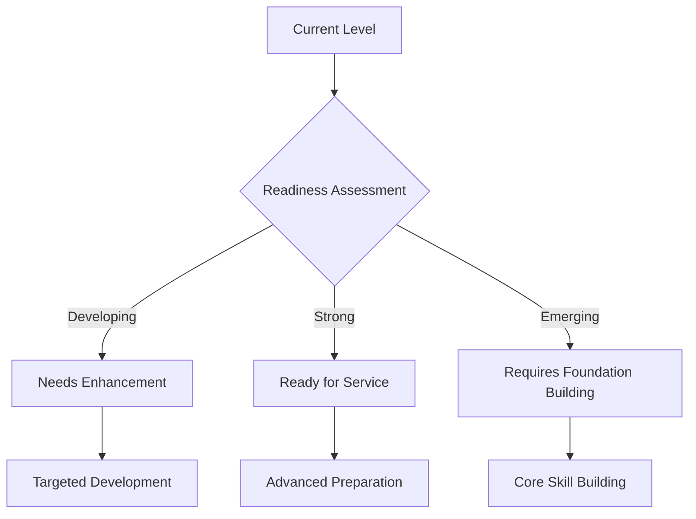
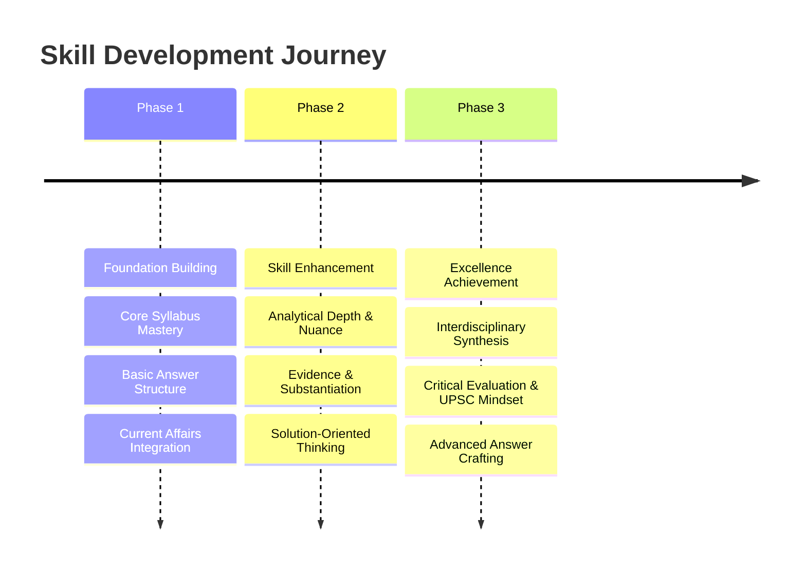
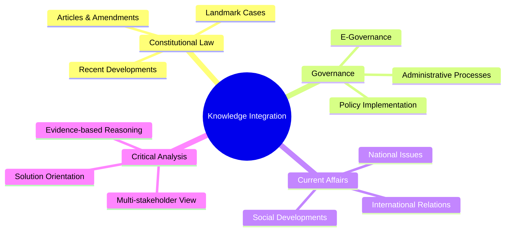

# ⚖️ UPSC GS Paper II Evaluation Report

## 📊 Overall Evaluation Dashboard

### 📈 Performance Summary
> **Focus**: Srishti Dabas demonstrates a foundational understanding of GS Paper II topics, particularly in Governance and Social Justice. Her answers generally touch upon the core demands of the questions, reflecting a decent breadth of knowledge. A notable strength is the consistent effort to provide contemporary examples and government initiatives, which is crucial for UPSC Mains. The candidate also attempts to structure answers with introductions, body points, and conclusions, indicating an awareness of presentation requirements.

> However, the evaluation reveals significant areas requiring systematic improvement to meet the rigorous UPSC standards. The primary challenge lies in the depth of constitutional and analytical rigor. Many answers provide descriptive information rather than a critical examination of the underlying issues, often missing multi-dimensional perspectives. The integration of static constitutional knowledge with dynamic current affairs is present but often superficial, lacking the nuanced connections required for higher marks. Evidence and substantiation, while present, frequently lack precision (e.g., specific articles, landmark judgments, or committee recommendations are often generalized or missing).

> A critical area for development is the 'solution-orientation' and 'civil servant mindset'. While "way forward" sections are attempted, they often lack practical feasibility, constitutional backing, or a comprehensive understanding of implementation challenges. The arguments presented sometimes lack the balanced, objective, and multi-stakeholder analysis characteristic of a civil servant's approach. There's a tendency to enumerate points rather than build a cohesive, well-reasoned argument, leading to a fragmented presentation. To truly excel, the candidate must transition from merely knowing facts to critically analyzing them, demonstrating a profound understanding of governance intricacies and constitutional principles. This involves a shift from descriptive recall to incisive analytical synthesis, focusing on the 'why' and 'how' of issues, and proposing implementable solutions.

### ✅ Key Strengths
> **🌟 Impact Areas** - List 3-5 most impactful strengths:

-   **💡 Breadth of Coverage**: The candidate consistently attempts to address various facets of the questions, covering different dimensions like social, economic, and political aspects, especially in questions related to social justice and governance (e.g., SHGs, Disability, Digital tools in welfare). This shows an ability to think broadly about topics.
-   **🗓️ Current Affairs Integration**: There is a commendable effort to weave in contemporary examples, government schemes, and recent developments (e.g., JJ Act 2021, ABDM, Lateral Entry debate, Ukraine crisis, G20 Presidency). This demonstrates awareness of current events and their relevance to static syllabus topics.
-   **📝 Structural Adherence**: The answers generally follow a basic introduction-body-conclusion structure. The use of bullet points and subheadings, though sometimes inconsistent, contributes to readability and indicates an understanding of the presentation requirements for Mains answers.
-   **🌍 Global Awareness**: In International Relations questions, the candidate shows a good grasp of global dynamics and India's foreign policy objectives (e.g., Non-Alignment, India-France ties, New Cold War). The attempt to quote dignitaries like S. Jaishankar adds value.

### ⚠️ Primary Development Areas
> **⚡ Priority Focus** - List 3-5 most important areas for development with reasoning:

-   **⚖️ Constitutional and Governance Depth (Critical Priority)**: The most significant gap is the lack of in-depth constitutional and governance knowledge. Answers often lack precise constitutional articles, landmark judgments, or specific committee recommendations. For instance, in questions on rights or governance mechanisms, the absence of specific legal frameworks or administrative reforms weakens the argument and limits the score. This impacts the foundational accuracy and analytical rigor, which are paramount for GS-II.
-   **🧠 Analytical Rigor & Critical Thinking (High Priority)**: Answers tend to be descriptive rather than analytical. There's a missed opportunity to delve into the 'why' and 'how' of issues, examine multiple perspectives, or critically evaluate policies. For example, in the lateral entry question, a deeper analysis of its implications for civil service ethos or administrative culture is needed beyond mere pros and cons. This limits the ability to score high marks as UPSC values critical evaluation over mere information recall.
-   **🎯 Solution-Orientation & Feasibility (High Priority)**: While "way forward" sections are present, they are often generic, lack practical implementability, or do not reflect a clear civil servant mindset. Solutions rarely consider multi-stakeholder implications or constitutional constraints. For instance, in the health question, proposed solutions need to be more specific and actionable, linked to existing frameworks or innovative ideas. This is crucial for demonstrating problem-solving aptitude, a core civil service quality.
-   **📚 Evidence & Substantiation Precision (Medium Priority)**: Although evidence is used, it often lacks specificity. Citing "Supreme Court cases" without naming them, or referring to "committee recommendations" without specific names (e.g., ARC, Punchhi Commission) or years, reduces the credibility and impact of the answer. This prevents the candidate from demonstrating mastery of the subject matter.

### 🏛️ Civil Service Readiness
> **🎯 Administrative Preparedness Assessment**

The candidate is currently at a 'Developing' stage in terms of civil service readiness. While there's a clear intent to address governance issues and an awareness of social challenges, the depth of administrative understanding and the nuanced problem-solving approach required for civil service are still evolving. The answers show an ability to identify problems and suggest general solutions, but they often fall short in demonstrating the practical feasibility, multi-stakeholder perspective, and detailed implementation strategies that a civil servant must consider.

For instance, in the question on NGOs, while the complementary role is highlighted, the regulatory challenges are discussed without a strong 'way forward' that balances autonomy with accountability, a real-world administrative dilemma. Similarly, in health and education questions, the focus remains largely on policy description rather than a critical assessment of implementation bottlenecks or innovative administrative solutions. The lack of precise constitutional and legal backing for arguments also indicates a need for more rigorous grounding in the administrative and legal frameworks within which civil servants operate. To move towards 'Ready for Service', the candidate needs to cultivate a more analytical, solution-oriented mindset that is grounded in practical governance realities, constitutional principles, and an understanding of administrative ethics and challenges. This involves rigorous study of governance reports, policy documents, and a deeper engagement with the intricacies of public administration.

### 🏆 UPSC Standard Alignment
> **🎯 Benchmarking Against Excellence**

The candidate's answers align moderately with UPSC standards, primarily in terms of attempting a comprehensive structure and integrating current affairs. However, there's a significant gap in meeting the 'depth and critical thinking' benchmarks. UPSC demands not just factual recall but a sophisticated ability to analyze, evaluate, and synthesize information, drawing connections across different domains of GS-II. The current responses often present information in a fragmented manner, lacking a strong, coherent argument that flows logically from constitutional principles to practical implications.

For example, in the 'New Cold War' question, while various points are made about US-China dynamics, the evaluation of its *long shadow on India's strategic interests* could be more incisive, discussing specific economic, security, or diplomatic challenges and opportunities for India. The 'multi-dimensional analysis' is present but needs refinement to move beyond superficial listing to a more integrated discussion. The 'solution-oriented' aspect, crucial for UPSC, is underdeveloped; ideal answers provide practical, progressive, and implementable recommendations that reflect a nuanced understanding of governance. To achieve higher alignment, the candidate must focus on developing a robust analytical framework, ensuring every argument is well-substantiated with precise evidence, and cultivating a writing style that is both concise and profound, reflecting the intellectual rigor expected of future civil servants.

---

## 📝 Individual Answer Analysis

### 🎯 Question 1: Self Help Groups (SHGs) and Women-led Development
**❓ Question Text**: To what extent, in your opinion, Self Help Groups (SHGs) in India have enabled women led development at grassroot level? (10m)
**📚 Syllabus Area**: `Social Justice (Women Empowerment), Governance (Grassroots Development)`

#### 📝 Answer Comparison

##### 📝 Your Answer Summary
> **🌟 Key Points from Your Response** :
The candidate defines SHGs and states their vast presence. The answer lists several enablers of women-led development by SHGs, including boosting entrepreneurship (e.g., Lijjat Papad), providing microfinance through NABARD, political empowerment via PRIs, self-respect, and association with private entities (e.g., Amazon Saheli). Challenges like patriarchal mindset, difficulty in credit, skewed regional growth, and lack of expertise are identified. The answer concludes by linking SHGs to political, social, and economic empowerment.

##### ⭐ Ideal Answer Framework
> **🌟 UPSC Excellence Standard** :
An ideal answer would begin by defining SHGs and their genesis (e.g., microfinance movement, SGSY/NRLM). It would then systematically evaluate the extent of their success in enabling women-led development, categorizing impacts across economic (income generation, financial inclusion), social (literacy, health, domestic violence reduction, decision-making), and political (local governance participation, awareness of rights) dimensions, substantiated with examples like Kudumbashree, SEWA, or specific government programs. Challenges such as sustainability, financial irregularities, external dependence, and regional disparities would be critically examined. The conclusion would offer a balanced perspective on SHGs as a powerful but imperfect tool for women's empowerment, suggesting a 'way forward' like enhanced capacity building, greater market linkages, technology integration, and policy support to overcome limitations and fully realize their potential for inclusive grassroots development.

#### 📝 Evaluation Criteria

##### ⚖️ Relevance and Understanding
**✍️ Analysis** :
The candidate largely understands the core demand of the question, which asks to what extent SHGs have enabled women-led development and to provide an opinion. The answer correctly identifies both the positive contributions (enablers) and the challenges, indicating a balanced understanding. The mention of specific examples like `Lijjat Papad` and `Amazon Saheli` demonstrates good recall and relevance. The inclusion of `NABARD's Bank Linkage program` is also a relevant point. However, the depth of analysis regarding the "extent" is somewhat limited to listing points rather than elaborating on the *degree* of impact or the *mechanisms* through which these impacts occur. For instance, "political empowerment" is mentioned but without explaining *how* association with PRIs leads to this empowerment. The answer could delve deeper into the transformative aspect beyond mere economic upliftment.

**✅ Suggestions** :
-   To better address "to what extent", quantify or qualify the impact where possible (e.g., "significant increase in women's financial independence" or "limited success in breaking deeply entrenched patriarchal norms"). Use stronger analytical verbs to describe the degree of enablement.
-   Elaborate on the *process* of empowerment. For example, how does microfinance translate into social and political empowerment beyond just economic gains? Discuss the role of collective action and peer support within SHGs.

##### ⚖️️ Structure and Organization
**✍️ Analysis** :
The structure is clear, with a definition, a section on "enablers," and a section on "challenges." This logical flow is commendable. The use of bullet points makes the answer easy to read. The introduction is concise, though it could define SHGs more comprehensively, perhaps mentioning their voluntary nature and focus on micro-savings. The conclusion, while brief, attempts to summarize the impact by linking to the "trinity of empowerment." However, the answer could benefit from a more explicit "way forward" section to offer concrete solutions to the identified challenges, which is a crucial component of UPSC answers.

**✅ Suggestions** :
-   Strengthen the introduction by explicitly stating the "thesis" or the overall extent of enablement you will argue for.
-   Add a dedicated "Way Forward" section after challenges, outlining actionable steps to address them (e.g., enhanced capacity building, market linkages, policy support). This demonstrates a solution-oriented mindset.

##### ⚖️ Constitutional and Governance Knowledge
**✍️ Analysis** :
This question primarily falls under Social Justice and Governance, rather than direct constitutional provisions. The answer shows good governance understanding by mentioning `NABARD` and `PRIs`, which are key institutional mechanisms at the grassroots. The concept of "women-led development" is understood. However, the answer could incorporate more specific governance frameworks or policies beyond just `NABARD` (e.g., `NRLM - National Rural Livelihoods Mission`, `SGSY - Swarnajayanti Gram Swarozgar Yojana`, or specific state-led initiatives like `Kudumbashree` in Kerala) to demonstrate a deeper understanding of the governmental ecosystem supporting SHGs. The "trinity of empowerment" is a good conceptual framework, but its link to specific policy objectives could be stronger.

**📚 Study Recommendations** :
-   **Deep Dive into `NRLM`**: Study the objectives, strategies, and key achievements of the National Rural Livelihoods Mission (Aajeevika) which is the primary government program for SHGs. Understand its different components like financial inclusion, skill development, and market linkages.
-   **Case Studies**: Research successful SHG models and programs in India (e.g., `Kudumbashree` in Kerala, `SEWA` in Gujarat). Understand their unique approaches and the factors contributing to their success.
-   **Government Reports**: Refer to reports from the Ministry of Rural Development, NITI Aayog, or NABARD concerning SHGs. These reports often provide data, challenges, and recommendations.

##### ⚖️ Analytical Rigor and Critical Thinking
**✍️ Analysis** :
> **⚡ HIGH PRIORITY** - The analysis is largely descriptive, listing points rather than critically examining them. For instance, while "patriarchal mindset" is identified as a challenge, the answer does not delve into *how* it specifically hinders SHG activities or *how* SHGs attempt to challenge it. The point "skewed regional growth in SHGs - mostly concentrated in South India" is a good observation, but it lacks an analysis of *why* this is the case or its implications. The answer could benefit from a more nuanced discussion of the complexities involved in empowering women through SHGs, such as the internal power dynamics within SHGs or the challenge of moving beyond micro-entrepreneurship to larger enterprises.

**✅ Suggestions** :
-   For each point, ask "why" and "how". For example, "Why is credit difficult?" (e.g., lack of collateral, bureaucratic hurdles, low financial literacy). "How do these challenges impact the sustainability or scale of SHGs?"
-   Introduce a critical perspective by acknowledging trade-offs or limitations. For instance, while microfinance is beneficial, discuss its potential pitfalls like debt traps or over-indebtedness if not managed well.

##### ⚖️ Evidence and Substantiation
**✍️ Analysis** :
The answer uses specific examples like `Lijjat Papad` and `Amazon Saheli`, which are excellent for substantiation. The mention of `NABARD` is also appropriate. However, the lack of specific data points (e.g., number of SHGs, financial turnover statistics, or impact assessments) limits the quantitative substantiation. While the figure "70 lakh SHGs in India" is given, it's not contextualized with a source or comparative data. Stronger evidence would include specific government reports, NITI Aayog findings, or academic studies to reinforce the arguments.

**⚡ Value Addition Suggestions** :
-   **Quantify where possible**: If exact figures are not known, use approximate percentages or qualitative descriptions like "significant increase" or "limited impact" but based on general knowledge of reports.
-   **Cite reports/committees**: Mentioning `NITI Aayog's strategy for New India @ 75` which emphasizes SHGs, or `NABARD's annual reports` on SHG-Bank Linkage, would add significant weight.

##### ⚖️ Solution Orientation and Civil Service Mindset
**✍️ Analysis** :
> **⚡ HIGH PRIORITY** - The answer identifies challenges but does not explicitly provide a "way forward" or solution-oriented suggestions to address them. The conclusion mentions "empowerment" but doesn't translate it into concrete steps for policy makers or administrators. A civil servant's answer must always offer practical, implementable solutions to the problems identified. For instance, for "lack of expertise," what specific capacity-building measures can be undertaken? For "patriarchal mindset," what social sensitization campaigns or legal reforms are needed?

**✅ Suggestions** :
-   **Develop a "Way Forward" section**: Propose concrete, actionable solutions for each challenge identified. For example:
    -   *For patriarchal mindset*: Community awareness programs, gender sensitization training within SHGs, leadership development for women.
    -   *For lack of expertise*: Skill development programs, digital literacy training, specialized training in specific trades.
    -   *For skewed regional growth*: Targeted interventions in lagging regions, replication of successful models, incentivizing local administration.
-   **Focus on administrative feasibility**: Ensure the proposed solutions are practical and can be implemented within the existing governance framework, possibly leveraging technology or public-private partnerships.

#### 📝 Key Insights
> **🌟 Strategic Takeaways** - 3-4 core strategic lessons from this answer:

-   **Balancing Description with Analysis**: While the candidate provides good descriptive points, the emphasis should shift towards analytical depth. Every point should be followed by its implications, causes, or effects, linking it to the broader theme of women-led development.
-   **Evidence-based Argumentation**: The use of specific examples is good, but integrating precise data, government reports, or landmark case studies (where applicable) would elevate the quality of substantiation and credibility.
-   **Solution-Oriented Approach**: A crucial aspect for UPSC is the ability to offer constructive, implementable solutions. The candidate needs to develop a stronger "way forward" section for every answer, demonstrating a problem-solving aptitude.
-   **Holistic Empowerment**: While economic empowerment is well-covered, the answer could expand on the social and political dimensions of women-led development, perhaps discussing how SHGs foster leadership, reduce social evils, or enhance community participation.

#### 📝 Next Steps
> **✅ Action Plan** - 3-4 specific, actionable tasks for the student:

-   [ ] **Review `NRLM` and `Kudumbashree`**: Conduct a detailed study of the National Rural Livelihoods Mission and the Kudumbashree model, focusing on their multi-dimensional impact on women's empowerment and the specific strategies employed.
-   [ ] **Practice Analytical Questioning**: For every point you write, ask yourself "Why is this happening?", "How does this impact the situation?", and "What are the long-term implications?". This will help deepen your analysis beyond mere description.
-   [ ] **Develop a "Way Forward" Template**: Practice concluding answers with a dedicated "Way Forward" section. Brainstorm 3-5 practical, implementable, and multi-stakeholder solutions for common challenges in governance and social justice topics.
-   [ ] **Incorporate Data/Reports**: Make it a habit to include at least one relevant data point (even if approximate) or a reference to a government report/committee recommendation in your answers to substantiate arguments effectively.

---

### 🎯 Question 2: Narrow Understanding of Disability
**❓ Question Text**: Narrow understanding of disability has marginalised people suffering from mental disorders. Elucidate. (10m)
**📚 Syllabus Area**: `Social Justice (Vulnerable Sections - Persons with Disabilities, Mental Health), Governance`

#### 📝 Answer Comparison

##### 📝 Your Answer Summary
> **🌟 Key Points from Your Response** :
The candidate highlights that 2.24% of India's population are PWDs. It uses examples of Sudha Chandran and a boy denied flight entry to illustrate insensitivity. The answer identifies the narrow understanding as focusing only on "physical and visible disabilities," excluding mental disability which is seen as a "construct of mind." It points out societal issues like parents hushing mental health issues, people failing to accept anxiety/depression as serious, and rising suicides (18% rise in student suicides per NCRB). The solution proposed is understanding 'Disease' as 'Dis-ease' (psychological as well), normalizing psychologist/psychiatric support, and more communication/empathy, linking it to `SDG-3 (Health & Well-being)`.

##### ⭐ Ideal Answer Framework
> **🌟 UPSC Excellence Standard** :
An ideal answer would start by defining disability, contrasting the medical model with the social model, and emphasizing the shift towards a rights-based approach (e.g., `RPwD Act 2016`). It would then elucidate how a narrow understanding, primarily focusing on physical/sensory impairments, marginalizes those with mental disorders. This marginalization would be elaborated across dimensions: legal (lack of recognition/rights), social (stigma, discrimination, exclusion, inadequate support systems), economic (employment barriers, poverty), and healthcare (lack of access to mental health services, inadequate infrastructure). Specific challenges faced by people with mental disorders (e.g., `Mental Healthcare Act 2017`, `NCRB data on suicides`) would be highlighted. The conclusion would offer a comprehensive 'way forward' involving legal reforms, destigmatization campaigns, integration of mental health into primary healthcare, community-based support, and promotion of inclusivity to ensure holistic well-being and rights for all persons with disabilities, aligning with `SDG-3` and `Article 21`.

#### 📝 Evaluation Criteria

##### ⚖️ Relevance and Understanding
**✍️ Analysis** :
The candidate correctly grasps the core of the question, which is to elucidate how a narrow understanding of disability marginalizes people with mental disorders. The examples used (Sudha Chandran, boy denied entry) effectively illustrate insensitivity, though they are more related to physical disability awareness rather than directly mental disorders. The points about parents hushing, societal non-acceptance of anxiety/depression, and student suicides due to mental health issues are highly relevant to the question's demand. The proposed solutions also directly address the identified problems. Overall, the answer is relevant and shows a good understanding of the issue.

**✅ Suggestions** :
-   While the examples of physical disability highlight general insensitivity, try to include specific examples related to mental health stigma or discrimination, if possible, to strengthen the direct relevance to the question's focus.
-   Explicitly mention the `Rights of Persons with Disabilities (RPwD) Act, 2016` and the `Mental Healthcare Act, 2017` in the introduction or body to immediately establish the legal framework for understanding disability in India.

##### ⚖️️ Structure and Organization
**✍️ Analysis** :
The answer is logically structured, starting with an introductory context, followed by examples, then a section defining the "narrow understanding," and finally, "what we need." This flow is easy to follow. The use of bullet points enhances readability. The `SDG-3` mention in the conclusion provides a good global framework. However, the introduction could be more formal, perhaps defining mental disorders or the broader concept of disability before diving into examples. The conclusion is concise but could be expanded to offer a more comprehensive `way forward` for policy and societal change.

**✅ Suggestions** :
-   Consider starting with a brief definition of disability (e.g., `RPwD Act, 2016` definition) and then directly linking it to the narrow societal perception.
-   Ensure a clear distinction between the *problem* (narrow understanding and its consequences) and the *solutions* (what needs to be done) for better organization.

##### ⚖️ Constitutional and Governance Knowledge
**✍️ Analysis** :
The answer demonstrates an awareness of social issues and `SDG-3`, which is a global governance goal. The mention of `NCRB` data indicates knowledge of government reporting. However, the answer significantly misses key legal frameworks that are central to disability rights and mental health in India. There is no mention of the `Rights of Persons with Disabilities (RPwD) Act, 2016`, which includes mental illness as a specified disability and mandates inclusive measures. Crucially, the `Mental Healthcare Act, 2017`, which decriminalized suicide attempts and provides rights to persons with mental illness, is completely absent. These acts are fundamental to addressing the "narrow understanding" and marginalization.

**📚 Study Recommendations** :
-   **Master `RPwD Act, 2016`**: Understand its key provisions, categories of disabilities included, and the rights it confers. Focus on how it promotes inclusivity and non-discrimination.
-   **Study `Mental Healthcare Act, 2017`**: Learn about its objectives, key provisions (e.g., decriminalization of suicide, advance directives, rights of persons with mental illness), and how it aims to provide access to mental healthcare.
-   **Constitutional Provisions**: Review `Article 21 (Right to Life and Personal Liberty)` and `Article 41 (Right to work, to education and to public assistance in certain cases)` in the context of disability rights, as these form the constitutional basis for welfare provisions.

##### ⚖️ Analytical Rigor and Critical Thinking
**✍️ Analysis** :
> **⚡ HIGH PRIORITY** - The analysis correctly identifies the societal issues stemming from the narrow understanding. The connection between "hushing" mental health issues and rising suicides is a good analytical link. However, the analysis could be deeper. For example, *why* do parents hush? (e.g., social stigma, lack of awareness, fear of discrimination). *How* does treating mental illness as a "construct of mind" rather than a medical condition lead to marginalization? (e.g., lack of professional help, victim-blaming, denial of support systems). The answer could also explore the role of media, education, and cultural norms in perpetuating this narrow understanding.

**✅ Suggestions** :
-   Delve deeper into the root causes of the narrow understanding (e.g., historical perceptions, lack of public health campaigns, inadequate curriculum).
-   Expand on the socio-economic consequences of marginalization beyond just "suicides" (e.g., unemployment, social isolation, poor quality of life, increased burden on caregivers).
-   Consider using the `social model of disability` vs. `medical model` to frame your analysis of the "narrow understanding." This provides a strong analytical lens.

##### ⚖️ Evidence and Substantiation
**✍️ Analysis** :
The use of `2.24% PWD` and `18% rise in student suicides per NCRB` are good statistical points that add credibility. The examples of Sudha Chandran and the boy are effective but, as noted, are more illustrative of physical disability insensitivity. To strengthen substantiation, specific examples of discrimination or challenges faced by *mentally ill individuals* (e.g., in employment, housing, or access to justice) would be more impactful. The answer could also cite specific government reports or surveys on mental health.

**⚡ Value Addition Suggestions** :
-   **Cite `National Mental Health Survey (NMHS)`**: This survey provides comprehensive data on the prevalence of mental disorders in India and the treatment gap. Mentioning its findings would add significant weight.
-   **Illustrative Cases**: If possible, briefly mention a real-world case or a policy challenge that specifically highlights the marginalization of people with mental disorders (e.g., challenges in accessing state-funded mental health services).

##### ⚖️ Solution Orientation and Civil Service Mindset
**✍️ Analysis** :
> **⚡ HIGH PRIORITY** - The solutions proposed ("Disease as Dis-ease," normalizing support, communication/empathy) are positive and relevant. Linking to `SDG-3` is also good. However, they lack the administrative and policy depth expected from a civil servant's perspective. For instance, "normalizing psychologist/psychiatric support" is a goal, but *how* can the government achieve this? (e.g., increasing mental health professionals, integrating mental health into primary healthcare, tele-counselling services, reducing cost barriers). The solutions need to be more concrete and actionable from a policy implementation standpoint.

**✅ Suggestions** :
-   **Propose concrete policy actions**:
    -   *Awareness campaigns*: Large-scale public awareness campaigns to destigmatize mental illness, involving celebrities and community leaders.
    -   *Healthcare integration*: Integrating mental health services into primary healthcare (`Ayushman Bharat`).
    -   *Capacity building*: Training more mental health professionals, including community health workers.
    -   *Legal enforcement*: Ensuring strict implementation of the `RPwD Act, 2016` and `Mental Healthcare Act, 2017`.
    -   *Workplace inclusivity*: Promoting mentally healthy workplaces and anti-discrimination policies.
-   **Emphasize a multi-sectoral approach**: Solutions should involve not just health, but education, social welfare, and law enforcement.

#### 📝 Key Insights
> **🌟 Strategic Takeaways** - 3-4 core strategic lessons from this answer:

-   **Legal Framework is Foundational**: For questions on rights or social issues, always ground your answer in relevant constitutional provisions and specific acts (e.g., `RPwD Act, 2016`, `Mental Healthcare Act, 2017`). This provides a strong legal and policy basis.
-   **Distinguish and Connect**: While general examples of insensitivity are useful, ensure the primary focus and examples directly address the specific "marginalization of people with mental disorders" as asked by the question.
-   **Policy-Oriented Solutions**: Move beyond general suggestions to concrete, implementable policy recommendations. Think about what a government *can* and *should* do, considering various stakeholders and administrative realities.
-   **Data and Reports**: Leverage official data (`NCRB`, `NMHS`) and government reports to substantiate arguments and highlight the scale of the problem.

#### 📝 Next Steps
> **✅ Action Plan** - 3-4 specific, actionable tasks for the student:

-   [ ] **In-depth study of `RPwD Act, 2016` and `Mental Healthcare Act, 2017`**: Prepare detailed notes on the key provisions, objectives, and impact of these two acts. Understand how they address the rights and well-being of persons with disabilities, especially those with mental illness.
-   [ ] **Research `National Mental Health Survey`**: Familiarize yourself with the key findings and recommendations of the National Mental Health Survey (NMHS) of India.
-   [ ] **Practice Policy Recommendation Questions**: Take past UPSC questions on social issues and practice writing detailed, multi-faceted, and implementable policy recommendations, considering various government ministries/departments.
-   [ ] **Mind Mapping for Social Issues**: Create mind maps for vulnerable sections (e.g., PwDs, women, children, elderly) covering: constitutional/legal provisions, government schemes, challenges, and solutions.

---

### 🎯 Question 3: Ayushman Bharat Digital Mission (ABDM)
**❓ Question Text**: Ayushman Bharat Digital Mission (ABDM) addresses the need for interoperability in health services through a unified health interface. Elaborate its significance in digitising healthcare ecosystem. (10m)
**📚 Syllabus Area**: `Governance (E-governance, Health Policy), Social Justice`

#### 📝 Answer Comparison

##### 📝 Your Answer Summary
> **🌟 Key Points from Your Response** :
The candidate defines ABDM as a milestone towards transforming healthcare infrastructure. It addresses interoperability through digital technology, mentioning e-Sanjeevani (telemedicine) and digital health records for accessibility. The answer then elaborates on its significance in digitizing healthcare, stating it fulfills the "trinity" of health (accessibility, availability, affordability), bridges the rural-urban divide, and improves access for vulnerable sections (SC, ST, OBC, disabled, women, elderly, transgender). Challenges identified are digital illiteracy, digital divide, and data privacy issues. The conclusion emphasizes addressing these for `SWASTHA BHARAT`.

##### ⭐ Ideal Answer Framework
> **🌟 UPSC Excellence Standard** :
An ideal answer would begin by concisely defining `ABDM` as a digital public good aiming to create a seamless online platform for healthcare, emphasizing its core components: `Ayushman Bharat Health Account (ABHA)`, `Healthcare Professionals Registry (HPR)`, `Health Facility Registry (HFR)`, and `Ayushman Bharat Digital Records (ABDR)`. It would then elaborate on its significance in digitizing the healthcare ecosystem by enabling interoperability, improving efficiency, enhancing accessibility (especially in rural/remote areas via telemedicine like `e-Sanjeevani`), promoting data-driven policy-making, reducing out-of-pocket expenditure, and empowering patients. Challenges such as data security and privacy (`Personal Data Protection Bill`), digital literacy, digital divide, and infrastructure gaps would be critically examined. The conclusion would offer a balanced `way forward` emphasizing robust data protection laws, infrastructure development, digital literacy campaigns, and public-private partnerships to realize the vision of `Universal Health Coverage` and `SDG-3`.

#### 📝 Evaluation Criteria

##### ⚖️ Relevance and Understanding
**✍️ Analysis** :
The candidate correctly identifies `ABDM`'s core purpose of interoperability and its significance in digitizing healthcare. The initial definition and the points on `e-Sanjeevani` and digital health records are relevant. The answer's strength lies in directly addressing the "significance" by linking it to the "trinity of health" and bridging the rural-urban divide, which are key benefits. The inclusion of vulnerable sections as beneficiaries is also highly relevant. The challenges identified are pertinent and show a good understanding of the practical hurdles in digital health.

**✅ Suggestions** :
-   To enhance the definition of `ABDM`, briefly mention its key building blocks like `ABHA (Ayushman Bharat Health Account)`, `HPR (Healthcare Professionals Registry)`, and `HFR (Health Facility Registry)`. This demonstrates a more comprehensive understanding of the mission's architecture.
-   Elaborate slightly more on *how* digital health records contribute to interoperability and patient empowerment.

##### ⚖️️ Structure and Organization
**✍️ Analysis** :
The structure is clear: a brief introduction, followed by "It addresses..." section, then "Significance," and "Challenges." This logical flow is easy to follow. The use of bullet points and a small table to illustrate the rural-urban divide is effective for presentation. The conclusion `SWASTHA BHARAT` is a good aspirational statement. However, the introduction could be more comprehensive in setting the context for `ABDM` as a digital public good. The challenges section is well-placed, but a dedicated "Way Forward" after it would strengthen the solution-orientation.

**✅ Suggestions** :
-   Begin the introduction by positioning `ABDM` within India's broader digital transformation and health sector reforms.
-   Add a distinct "Way Forward" section after "challenges" to outline specific measures (e.g., robust data protection law, infrastructure development, digital literacy campaigns) to overcome these hurdles.

##### ⚖️ Constitutional and Governance Knowledge
**✍️ Analysis** :
The answer demonstrates a good understanding of a key government initiative (`ABDM`) and its policy objectives (interoperability, access, equity). The mention of `e-Sanjeevani` and `digital health records` shows knowledge of practical components. The linkage to "social justice" by focusing on vulnerable sections is commendable. However, the answer lacks explicit constitutional or legal grounding. While `SDG-3` is mentioned, the connection to India's constitutional commitment to health (e.g., `Article 21` on right to health, `DPSP Article 47` on improving public health) could be made to enrich the answer. Moreover, the critical aspect of data privacy needs to be linked to the `Personal Data Protection Bill` (or `Digital Personal Data Protection Act, 2023` if updated).

**📚 Study Recommendations** :
-   **Constitutional Basis of Health**: Understand how `Article 21 (Right to Life)` has been interpreted by the Supreme Court to include the `Right to Health`. Also, study `DPSP Article 47` and its implications for public health.
-   **`Digital Personal Data Protection Act, 2023`**: Familiarize yourself with the key provisions of this act, especially its implications for `ABDM` and patient data. This is crucial for addressing data privacy concerns.
-   **National Health Policy**: Review the `National Health Policy 2017` and how `ABDM` aligns with its goals of universal health coverage and digital health.

##### ⚖️ Analytical Rigor and Critical Thinking
**✍️ Analysis** :
> **⚡ HIGH PRIORITY** - The analysis of significance is good, categorizing benefits into accessibility, availability, and affordability, and bridging divides. However, the depth of analysis could be enhanced. For example, *how* does interoperability specifically improve efficiency or reduce costs? (e.g., seamless data exchange, reduced duplication of tests, faster diagnosis). The challenges are identified, but their implications are not fully explored. For instance, *how* does digital illiteracy specifically hinder `ABDM`'s success? (e.g., inability to use digital tools, lack of trust, exclusion of rural/elderly population). The answer could also critically discuss the potential for data misuse or the ethical implications of a centralized health database.

**✅ Suggestions** :
-   For each benefit, provide a brief analytical explanation of *how* it is achieved through `ABDM`. For example, "Interoperability, enabled by `ABHA`, ensures seamless access to patient records across different healthcare providers, leading to faster diagnosis and reduced medical errors."
-   For challenges, discuss their *consequences* for `ABDM`'s success and for equitable healthcare delivery. For instance, "The digital divide means that `ABDM`'s benefits may disproportionately reach urban, digitally literate populations, exacerbating existing health inequalities."

##### ⚖️ Evidence and Substantiation
**✍️ Analysis** :
The answer provides `e-Sanjeevani` as a relevant example, which is good. The statistics for rural/urban population and healthcare are presented as a table, which is a nice touch, but the source or context for these numbers is missing, limiting their credibility. No specific data on `ABDM`'s reach or impact, or any pilot project successes, are mentioned. Mentioning specific government initiatives like `PM-JAY` (Ayushman Bharat Pradhan Mantri Jan Arogya Yojana) as a key user/integrator of `ABDM` would also strengthen the answer.

**⚡ Value Addition Suggestions** :
-   **Cite `e-Sanjeevani` impact**: Mention its success in conducting a large number of tele-consultations, demonstrating practical significance.
-   **Refer to `NITI Aayog` or `Ministry of Health` reports**: These often provide statistics and progress reports on `ABDM` or digital health initiatives.
-   **Mention `PM-JAY` integration**: Highlight how `ABDM` aims to integrate with existing schemes like `PM-JAY` to provide comprehensive digital health services.

##### ⚖️ Solution Orientation and Civil Service Mindset
**✍️ Analysis** :
> **⚡ HIGH PRIORITY** - The conclusion points to addressing challenges for `SWASTHA BHARAT`, which is a good vision. However, the "Way Forward" is implicitly stated within the challenges (e.g., "These need to be addressed by ensuring data protection law and universalization of healthcare") but not elaborated as concrete, actionable steps. A civil servant's answer should clearly outline *how* these challenges can be addressed. For instance, *how* to ensure data protection? (e.g., robust legal framework, strong encryption, regular audits, public awareness on data privacy). *How* to universalize healthcare? (e.g., public health infrastructure development, subsidies, digital literacy campaigns).

**✅ Suggestions** :
-   **Formulate a dedicated "Way Forward" section**:
    -   *Data Protection*: Implement and enforce the `Digital Personal Data Protection Act, 2023`, conduct regular cybersecurity audits, and launch public awareness campaigns on data privacy.
    -   *Digital Literacy*: Develop targeted digital literacy programs for rural, elderly, and vulnerable populations, possibly leveraging `Common Service Centres (CSCs)`.
    -   *Infrastructure Development*: Invest in robust digital infrastructure, especially in remote areas, to bridge the digital divide.
    -   *Public-Private Partnerships*: Foster collaborations with tech companies and healthcare providers to innovate and expand `ABDM`'s reach.
-   **Emphasize a rights-based approach**: Link solutions to ensuring the right to health and privacy for all citizens.

#### 📝 Key Insights
> **🌟 Strategic Takeaways** - 3-4 core strategic lessons from this answer:

-   **Comprehensive Scheme Knowledge**: For government schemes, understand not just their benefits but also their core components, underlying architecture, and how they interact with other policies.
-   **Legal & Policy Interlinkages**: Always connect government initiatives to relevant constitutional articles, acts, and national policies (e.g., `DPDP Act, 2023` for data privacy, `National Health Policy` for overall health goals).
-   **Detailed Problem-Solution Mapping**: When identifying challenges, ensure that the proposed solutions are specific, actionable, and directly address the root causes of those challenges, reflecting a practical administrative approach.
-   **Beyond Description**: While listing benefits is good, analyze *how* these benefits are achieved and *what* their broader implications are for the healthcare ecosystem and societal well-being.

#### 📝 Next Steps
> **✅ Action Plan** - 3-4 specific, actionable tasks for the student:

-   [ ] **Detailed study of `ABDM`**: Research the official `ABDM` website and related government documents to understand its architecture (ABHA, HPR, HFR), components, and current progress.
-   [ ] **Read `Digital Personal Data Protection Act, 2023` summary**: Focus on its key provisions related to personal data and its implications for large digital initiatives like `ABDM`.
-   [ ] **Practice "Policy Evaluation" questions**: Select past UPSC questions that ask to evaluate a policy or scheme. Practice writing answers that include its objectives, features, significance, challenges, and a comprehensive 'way forward'.
-   [ ] **Analyze `SDG-3`**: Understand the targets and indicators of `SDG-3 (Good Health and Well-being)` and how India's health policies contribute to achieving them.

---

### 🎯 Question 4: Lateral Entry in Civil Services
**❓ Question Text**: Assess the relevance of lateral entry in civil services in making the governance structure more effective, efficient & people oriented. (10m)
**📚 Syllabus Area**: `Governance (Civil Service Reforms, Public Administration)`

#### 📝 Answer Comparison

##### 📝 Your Answer Summary
> **🌟 Key Points from Your Response** :
The candidate introduces civil services as the "steel frame" facing "rusting" due to corruption, apathy, nepotism, and political pressure, presenting lateral entry as a "panacea." The answer then discusses the relevance of lateral entry (bringing expertise, improving efficiency & competitiveness) and "more issues than relevance" (clashing with existing officers, difficulty in synchronizing, lack of field experience). It also mentions concerns like undermining experience, rising challenges (cyber security, blockchain), lack of specialists, unresolved existing issues, and nepotism/political influence. The conclusion suggests ensuring transparency in selection, code of conduct, and training for "AGENTS OF GOOD & SMART GOVERNANCE" for `SU-RAJ`.

##### ⭐ Ideal Answer Framework
> **🌟 UPSC Excellence Standard** :
An ideal answer would begin by defining lateral entry in the context of civil services and its rationale (e.g., to infuse specialized talent, enhance efficiency, and bring fresh perspectives, aligning with `ARC reports`). It would then assess its relevance in making governance effective, efficient, and people-oriented by discussing benefits such as: specialized domain expertise, fresh perspectives, performance orientation, accountability, and bridging the gap between policy and implementation. Critically, it would also evaluate the concerns: potential for demotivation among career civil servants, lack of field experience, issues of integration and organizational culture, accountability challenges, and potential for political patronage. The conclusion would offer a balanced 'way forward' emphasizing a calibrated approach, transparent selection processes, robust induction and integration programs, clear performance metrics, and a focus on capacity building for existing civil servants, ensuring that lateral entry complements rather than undermines the existing "steel frame" for `Good Governance`.

#### 📝 Evaluation Criteria

##### ⚖️ Relevance and Understanding
**✍️ Analysis** :
The candidate clearly understands the core demand of the question, which is to assess the relevance of lateral entry in improving governance. The answer addresses both the positive aspects ("relevance") and the negative aspects ("more issues than relevance"), demonstrating a balanced approach. The introduction, using the "steel frame" analogy and linking it to governance challenges, effectively sets the context. The proposed solutions in the conclusion are also relevant to addressing the concerns raised.

**✅ Suggestions** :
-   In the introduction, briefly mention the context of civil service reforms or the changing demands of governance that necessitate such innovations, to further strengthen the relevance.
-   Ensure that all points, both for and against, are directly linked back to the core objectives of making governance "effective, efficient & people oriented."

##### ⚖️️ Structure and Organization
**✍️ Analysis** :
The structure is commendable, with a clear introduction, two distinct sections for "relevance" and "issues," and a concluding "way forward." The use of bullet points and sub-sections (`Allow Lateral Entry` vs. `More Issues than Relevance`) makes the argument easy to follow. The conclusion is strong in its aspiration for `SU-RAJ`. However, within the "More issues than relevance" section, some points could be grouped more logically (e.g., "rising challenges like cyber security" and "lack of specialists" could be combined with "lack of field experience" as challenges related to domain-specific knowledge or practical administrative exposure).

**✅ Suggestions** :
-   Refine the sub-points under "More issues than relevance" for better thematic grouping (e.g., group points related to integration/culture, and points related to skill/experience gaps).
-   Consider adding a brief sentence at the end of the "relevance" and "issues" sections to summarize their overall impact before moving to the next section.

##### ⚖️ Constitutional and Governance Knowledge
**✍️ Analysis** :
The answer demonstrates a good understanding of the challenges facing the civil services ("steel frame," corruption, apathy). The concept of `lateral entry` and its intended benefits (expertise, efficiency) are well-grasped. However, the answer lacks specific references to administrative reform commissions or committees that have recommended lateral entry (e.g., `Second Administrative Reforms Commission (ARC) Report` on "Capacity Building for Conflict Resolution"). Mentioning such reports would add significant weight and demonstrate deeper governance knowledge. The term `SU-RAJ` is a good aspirational goal, but its connection to specific governance principles could be made more explicit.

**📚 Study Recommendations** :
-   **`Second ARC Reports`**: Study relevant recommendations from the Second Administrative Reforms Commission, especially those on "Capacity Building for Conflict Resolution" (which discusses lateral entry) and "Ethics in Governance."
-   **NITI Aayog Documents**: Review NITI Aayog's strategy documents or reports that discuss civil service reforms and the rationale for lateral entry.
-   **Constitutional Provisions for Civil Services**: Briefly recall `Articles 309-323` related to public services and `Article 311` related to dismissal, removal or reduction in rank of persons employed in civil capacities under the Union or a State. This provides a constitutional backdrop.

##### ⚖️ Analytical Rigor and Critical Thinking
**✍️ Analysis** :
> **⚡ HIGH PRIORITY** - The analysis identifies valid pros and cons. However, it remains largely descriptive. For instance, "will clash with existing officers" is stated, but *why* would they clash? (e.g., difference in work culture, perceived threat to promotion avenues, lack of understanding of bureaucratic processes by lateral entrants, resistance to change). The point about "lack of field experience" is crucial, but its implications (e.g., disconnect from ground realities, inability to handle complex administrative challenges) are not fully explored. A more critical analysis would weigh the benefits against the challenges, perhaps suggesting conditions under which lateral entry could be most effective or areas where it is less suitable.

**✅ Suggestions** :
-   For each point, delve into the "why" and "how." For example, "Lateral entry can bring specialized domain expertise from the private sector or academia, which is crucial for complex policy areas like cyber security or financial regulation, where traditional civil service training may be inadequate."
-   Introduce a nuanced perspective by discussing the `calibrated approach` to lateral entry, acknowledging that it's not a "panacea" but a tool that needs careful implementation.

##### ⚖️ Evidence and Substantiation
**✍️ Analysis** :
The answer uses the "steel frame" analogy effectively. However, it lacks concrete evidence or examples of lateral entry's success or failure in India or other countries. While the debate is ongoing, specific instances or pilot programs (e.g., `NITI Aayog's push for lateral entry` at Joint Secretary level) could have been mentioned to substantiate the arguments. The points about "cyber security" and "blockchain" are relevant examples of new challenges requiring specialized expertise, which indirectly substantiates the need for lateral entry.

**⚡ Value Addition Suggestions** :
-   **Mention `NITI Aayog`'s role**: Briefly mention `NITI Aayog`'s recommendations and the government's attempts to recruit lateral entrants at `Joint Secretary` level since 2018.
-   **Refer to global practices**: If possible, briefly mention how other countries (e.g., UK, US) utilize lateral entry in their civil services to provide a comparative perspective.

##### ⚖️ Solution Orientation and Civil Service Mindset
**✍️ Analysis** :
> **⚡ HIGH PRIORITY** - The conclusion effectively transitions to a "way forward" by suggesting transparency in selection, code of conduct, and training for "AGENTS OF GOOD & SMART GOVERNANCE" for `SU-RAJ`. These are good aspirational goals. However, the suggestions could be more specific and actionable from an administrative perspective. For instance, *how* to ensure transparency? (e.g., independent selection panels, objective criteria, public disclosure of selection process). *What kind* of training is needed for lateral entrants to integrate? (e.g., induction programs on government rules, administrative procedures, ethics, and field visits).

**✅ Suggestions** :
-   **Expand on specific recommendations for the "Way Forward"**:
    -   *Transparent Selection*: Establish an independent body for selection, clearly defined eligibility criteria, and a merit-based, objective recruitment process.
    -   *Integration & Training*: Implement robust induction programs for lateral entrants, focusing on administrative procedures, government ethos, and field realities. Foster mentorship by experienced civil servants.
    -   *Performance Management*: Develop clear performance indicators for lateral entrants and integrate them into the existing performance appraisal system.
    -   *Cultural Sensitivity*: Promote a culture of collaboration and mutual respect between career civil servants and lateral entrants.
-   **Emphasize a phased and calibrated approach**: Suggest that lateral entry should be introduced in a cautious and experimental manner, with regular reviews and adjustments.

#### 📝 Key Insights
> **🌟 Strategic Takeaways** - 3-4 core strategic lessons from this answer:

-   **Balanced Assessment**: For "assess" type questions, always provide a balanced view, presenting both the pros and cons, and then synthesizing them into a nuanced conclusion.
-   **Contextualize Reforms**: Place administrative reforms like lateral entry within the broader context of governance challenges and the evolving demands on civil services.
-   **Administrative Feasibility in Solutions**: Solutions should be practical, implementable, and consider the administrative implications (e.g., training, integration, cultural aspects).
-   **Referencing Key Reports**: Incorporate recommendations from relevant government reports or commissions (e.g., `ARC`, `NITI Aayog`) to add authority and depth to arguments.

#### 📝 Next Steps
> **✅ Action Plan** - 3-4 specific, actionable tasks for the student:

-   [ ] **Study `Second ARC Report` (Capacity Building for Conflict Resolution)**: Focus on the sections discussing lateral entry and its implications for civil service capacity and efficiency.
-   [ ] **Research current lateral entry initiatives**: Look for recent government notifications, NITI Aayog's role, and any evaluations of the lateral entry scheme in India.
-   [ ] **Practice "Pros and Cons" questions**: Select questions that require a balanced assessment of a policy or reform. Ensure you analyze the implications of both sides.
-   [ ] **Develop "Way Forward" for Civil Service Reforms**: Create a template of common solutions for civil service challenges (e.g., capacity building, ethics, transparency, digital integration) to apply across different questions.

---

### 🎯 Question 5: Juvenile Justice Amendment Act, 2021
**❓ Question Text**: Objectives of a welfare government remain incomplete without a progressive ecosystem for children's development. Discuss with special emphasis to recently passed Juvenile Justice Amendment Act, 2021. (10m)
**📚 Syllabus Area**: `Social Justice (Children, Vulnerable Sections), Governance (Welfare Policy)`

#### 📝 Answer Comparison

##### 📝 Your Answer Summary
> **🌟 Key Points from Your Response** :
The candidate starts by linking welfare government objectives to a progressive ecosystem for children, stating India is a "welfare state" guided by DPSP. It then outlines elements of this ecosystem: children education (Art 21A), healthcare (Ayushman Bharat), preventing malnutrition (POSHAN Abhiyan), safe and secure environment, and no oppression/harassment. Regarding the `JJ Act, 2021`, the answer states it focuses on crimes against children under 16, makes `CARA` a nodal point for adoption, gives authority to DM for adoption, ensures child-friendly investigation, and addresses juvenile delinquency as a "socially constructed Act." It concludes that the act establishes a progressive ecosystem for children's "DIGNITY and SAFETY."

##### ⭐ Ideal Answer Framework
> **🌟 UPSC Excellence Standard** :
An ideal answer would begin by affirming that a welfare state's objectives are incomplete without a robust child development ecosystem, citing `Constitutional provisions` like `Articles 21A, 24, 39(e)&(f), 45`. It would then briefly outline key pillars of child development (health, education, protection, participation). The answer would then critically discuss the `Juvenile Justice (Care and Protection of Children) Amendment Act, 2021`, highlighting its key objectives and provisions: empowering `District Magistrates (DMs)` for adoption orders and monitoring child care institutions, classifying certain offenses as non-cognizable, and strengthening `Child Welfare Committees (CWCs)`. The discussion would analyze how these amendments aim to streamline adoption, enhance child protection, and ensure speedy justice, thereby contributing to a progressive ecosystem. It would also briefly touch upon any concerns (e.g., overburdening DMs, impact on child rights). The conclusion would offer a 'way forward' emphasizing effective implementation, inter-agency coordination, community participation, and continuous review to ensure comprehensive child welfare and protection.

#### 📝 Evaluation Criteria

##### ⚖️ Relevance and Understanding
**✍️ Analysis** :
The candidate clearly understands the question's core demand to discuss children's development in the context of a welfare government, with a special emphasis on the `JJ Act, 2021`. The initial points on education (`Art 21A`), healthcare (`Ayushman Bharat`), and nutrition (`POSHAN Abhiyan`) are highly relevant and form a good foundation for the children's ecosystem. The key provisions of the `JJ Act, 2021` mentioned are also accurate and relevant (DM's role in adoption, `CARA`, child-friendly investigation). The answer effectively links the act to `DIGNITY and SAFETY`.

**✅ Suggestions** :
-   While `Ayushman Bharat` is a health scheme, specify `Ayushman Bharat Pradhan Mantri Jan Arogya Yojana (PM-JAY)` or `Ayushman Bharat Health and Wellness Centres` for better precision.
-   Ensure a seamless transition between the general ecosystem for children and the specific provisions of the `JJ Act, 2021`, explicitly stating how the Act strengthens the ecosystem.

##### ⚖️️ Structure and Organization
**✍️ Analysis** :
The structure is logical: an introduction linking welfare to children's development, general components of a progressive ecosystem, followed by a dedicated section on the `JJ Act, 2021`, and a conclusion. The use of bullet points is effective. However, the transition from the general ecosystem to the `JJ Act, 2021` could be smoother. The answer could also benefit from a more explicit "way forward" section that addresses implementation challenges of the `JJ Act` or broader child development issues.

**✅ Suggestions** :
-   Improve the flow by explicitly stating how the `JJ Act, 2021` specifically contributes to or amends the existing framework for children's development.
-   Add a short "Way Forward" section at the end, suggesting measures for effective implementation of the `JJ Act, 2021` and further strengthening child protection.

##### ⚖️ Constitutional and Governance Knowledge
**✍️ Analysis** :
The answer correctly identifies `DPSP` as a guiding principle for a welfare state and accurately cites `Article 21A` for education. The mention of `Ayushman Bharat` and `POSHAN Abhiyan` shows knowledge of key government welfare schemes. The understanding of `CARA (Central Adoption Resource Authority)` as a nodal body and the `District Magistrate's (DM)` new role in adoption under the `JJ Act, 2021` is accurate and demonstrates good governance knowledge. However, other crucial constitutional provisions related to children (`Article 24 (Prohibition of employment of children in factories, etc.)`, `Article 39(e)&(f) (DPSP on health and development of children)`) are missing, which would have significantly strengthened the constitutional backing of the answer. The explanation of "juvenile delinquency as a socially constructed Act" is a good conceptual point, but its legal implications could be clearer.

**📚 Study Recommendations** :
-   **Comprehensive Constitutional Provisions for Children**: Study `Articles 21A, 24, 39(e)&(f), and 45` of the Indian Constitution, and how they form the bedrock of child rights and welfare in India.
-   **`Juvenile Justice (Care and Protection of Children) Act, 2015` (and its 2021 Amendment)**: Understand the complete `JJ Act, 2015` and then specifically the key amendments introduced in 2021, especially regarding the `DM's role` and `adoption procedures`.
-   **National Policies for Children**: Review the `National Policy for Children` and other relevant government policies and schemes for child protection and development.

##### ⚖️ Analytical Rigor and Critical Thinking
**✍️ Analysis** :
> **⚡ HIGH PRIORITY** - The analysis provides a good overview of the `JJ Act, 2021` provisions. However, it is largely descriptive. For example, while the `DM`'s new role is mentioned, the *implications* of this change (e.g., streamlining adoption, reducing judicial burden, potential for overburdening DMs, need for specialized training for DMs) are not deeply analyzed. The statement "juvenile delinquency as a socially constructed Act" is a critical thought, but it needs to be elaborated on *how* this understanding influences the approach of the Act (e.g., focus on rehabilitation, restorative justice, child-friendly procedures). The answer could also critically discuss the challenges in implementing these provisions or any potential unintended consequences.

**✅ Suggestions** :
-   For each provision of the `JJ Act, 2021`, analyze its *intended purpose* and *potential impact* (both positive and negative). For instance, "Empowering DMs aims to fast-track adoption processes, reducing delays and ensuring more children find permanent families, but it also necessitates adequate training and resources for DMs."
-   Critically evaluate if the Act fully addresses the stated "objectives of a welfare government" or if there are still gaps.

##### ⚖️ Evidence and Substantiation
**✍️ Analysis** :
The answer correctly cites `Article 21A` and mentions `Ayushman Bharat` and `POSHAN Abhiyan`, which are relevant schemes. The specific provisions of the `JJ Act, 2021` are also mentioned. However, the answer lacks specific data or reports to substantiate the claims (e.g., statistics on adoption rates, child protection issues, or the impact of existing welfare schemes). Quoting `DPSP` as a guiding principle is good, but specific `DPSP` articles related to children (e.g., `Article 39(e)&(f)`) would add more weight.

**⚡ Value Addition Suggestions** :
-   **Cite `NCRB` data on crimes against children**: If relevant, briefly mention statistics on child abuse or trafficking to highlight the need for robust protection laws.
-   **Refer to `UNICEF` or `Ministry of Women and Child Development` reports**: These reports often provide data and insights into the status of children's development and protection in India.
-   **Mention the `National Commission for Protection of Child Rights (NCPCR)`**: Briefly refer to its role in monitoring the implementation of child protection laws.

##### ⚖️ Solution Orientation and Civil Service Mindset
**✍️ Analysis** :
> **⚡ HIGH PRIORITY** - The answer concludes with a positive statement about the act establishing a progressive ecosystem for `DIGNITY and SAFETY`. However, it does not provide a separate "way forward" section or concrete, actionable recommendations for further strengthening the ecosystem or addressing implementation challenges of the `JJ Act, 2021`. A civil servant's answer should always offer practical solutions. For instance, what needs to be done for effective implementation of the `JJ Act`? (e.g., training for DMs and police, strengthening Child Welfare Committees, community awareness, robust monitoring mechanisms).

**✅ Suggestions** :
-   **Add a dedicated "Way Forward" section**:
    -   *Effective Implementation*: Ensure adequate training and resources for `DMs`, `CWCs`, and `Juvenile Justice Boards (JJBs)`.
    -   *Awareness Campaigns*: Launch public awareness campaigns about child rights and the provisions of the `JJ Act`.
    -   *Inter-agency Coordination*: Strengthen coordination between police, judiciary, social welfare departments, and NGOs.
    -   *Rehabilitation & Reintegration*: Focus on post-release support and social reintegration for children in conflict with the law.
    -   *Data-driven Monitoring*: Establish robust data collection and monitoring systems to track the act's effectiveness.
-   **Emphasize a holistic approach**: Solutions should cover prevention, protection, prosecution, and rehabilitation.

#### 📝 Key Insights
> **🌟 Strategic Takeaways** - 3-4 core strategic lessons from this answer:

-   **Comprehensive Constitutional Linkage**: For questions on welfare or rights, always link to all relevant constitutional articles, not just one. This shows a holistic understanding of the constitutional framework.
-   **Beyond Description of Acts**: When discussing an Act, go beyond merely listing its provisions. Analyze its objectives, its impact (intended and unintended), and its implementation challenges.
-   **Practical Implementation Focus**: Always include actionable "way forward" points that address the practical aspects of policy implementation, reflecting a civil servant's problem-solving approach.
-   **Multi-dimensional Coverage**: Ensure that the "progressive ecosystem" covers all relevant dimensions: health, education, protection, and participation, linking them to specific schemes or policies.

#### 📝 Next Steps
> **✅ Action Plan** - 3-4 specific, actionable tasks for the student:

-   [ ] **Create a comprehensive note on child rights in India**: Include relevant `Constitutional Articles (21A, 24, 39(e)&(f), 45)`, key `Acts (JJ Act, POCSO Act)`, `National Policies`, `schemes (ICDS, POSHAN Abhiyan)`, and institutional mechanisms (`NCPCR`, `CWCs`).
-   [ ] **Analyze the `JJ Act, 2021` amendments**: Focus on the *rationale* behind each amendment, its *intended impact*, and potential *implementation challenges*.
-   [ ] **Practice "Discuss with special emphasis" questions**: Learn to integrate specific details (like an Act) seamlessly into a broader discussion, ensuring the emphasis is clear but the overall context is not lost.
-   [ ] **Develop a "Way Forward" for Child Protection**: Brainstorm concrete strategies for improving child protection, covering legal, administrative, social, and technological aspects.

---

### 🎯 Question 6: Decriminalisation of Homosexuality & LGBTQIA+ Rights
**❓ Question Text**: Decriminalisation of homosexuality by SC in Navtej Singh Jauhar case remains task half done, specially without socio-political sensitisation about issues faced by LGBTQIA+. Elaborate in light of ongoing debates on same sex marriage. (10m)
**📚 Syllabus Area**: `Social Justice (Vulnerable Sections - LGBTQIA+), Polity (Judiciary, Fundamental Rights)`

#### 📝 Answer Comparison

##### 📝 Your Answer Summary
> **🌟 Key Points from Your Response** :
The candidate acknowledges the decriminalization of homosexuality by the Supreme Court in `Navtej Singh Jauhar` case, stating it was "half done" without socio-political sensitization. It correctly mentions `Section 377 IPC` was decriminalized, enabling "freedom of bodily autonomy & choice." The answer identifies why it's "half done": `SC` brought legal change without social acceptance (top-down approach) and lack of consensus & dialogue among masses. It then lists issues faced by `LGBTQIA+` community: lack of access to education, healthcare, employment; psychological well-being hampered by social taboo; mental health issues due to stigma/exclusion. The answer then details the `same-sex marriage` debate, with arguments "in favour" (Art 21, freedom to choose partner, state shouldn't dictate) and "against" (hampers social order/norms, against law of nature, against culture/traditions). It concludes by emphasizing realizing that transgenders are human and need love, care, acceptance, transitioning from `TRANSPHOBIC` to `TRANSFRIENDLY` society.

##### ⭐ Ideal Answer Framework
> **🌟 UPSC Excellence Standard** :
An ideal answer would begin by concisely stating the `Navtej Singh Jauhar v. Union of India (2018)` judgment, which decriminalized consensual homosexual acts by reading down `Section 377 IPC`, affirming `LGBTQIA+` rights to dignity, privacy, and equality under `Articles 14, 15, 19, 21`. It would then elaborate *why* it's "task half done": the legal change, while monumental, hasn't translated into full social acceptance due to deep-seated stigma, discrimination in areas like employment, housing, inheritance, and healthcare, and lack of inclusive policies. The answer would then elaborate on the ongoing debates on `same-sex marriage`, presenting arguments for (e.g., `Right to marry as a facet of Article 21`, equality, non-discrimination, `Special Marriage Act`) and against (e.g., legislative domain, religious/social norms, definition of marriage). The conclusion would offer a comprehensive 'way forward' emphasizing the need for socio-political sensitization through public awareness campaigns, legislative action to ensure comprehensive non-discrimination, legal recognition of partnerships, and a shift towards an inclusive, rights-based approach, fostering a `TRANSFRIENDLY` society while balancing societal values with fundamental rights.

#### 📝 Evaluation Criteria

##### ⚖️ Relevance and Understanding
**✍️ Analysis** :
The candidate demonstrates a very strong understanding of the question's core demand. It accurately identifies the `Navtej Singh Jauhar` case and `Section 377 IPC` decriminalization. The central argument that it's a "task half done" due to lack of socio-political sensitization is well-articulated and directly addresses the question. The elaboration of issues faced by the `LGBTQIA+` community (education, health, employment, psychological well-being) is highly relevant. The presentation of arguments for and against `same-sex marriage` is balanced and directly addresses the "ongoing debates" aspect. The conclusion on `TRANSPHOBIC` to `TRANSFRIENDLY` society is apt.

**✅ Suggestions** :
-   While "freedom of bodily autonomy & choice" is good, explicitly mention the fundamental rights affirmed by the `Navtej Singh Jauhar` judgment: `Articles 14 (Equality), 15 (Non-discrimination), 19 (Freedom of Expression), and 21 (Life and Personal Liberty)`.
-   To strengthen the "half done" argument, perhaps briefly mention how the judgment *did* contribute to social change, even if slowly, before elaborating on the gaps.

##### ⚖️️ Structure and Organization
**✍️ Analysis** :
The structure is excellent and logical. It begins with the context of the `Navtej Singh Jauhar` judgment, moves to why it's "half done," then details the issues faced by the community, elaborates on the `same-sex marriage` debate (with clear pros and cons), and concludes with a forward-looking statement. The use of bullet points and clear sub-sections (`Those in favour`, `Those against`) greatly enhances readability and clarity. The conclusion is impactful and summarizes the desired societal shift.

**✅ Suggestions** :
-   Consider adding a brief introductory sentence that sets the stage for `LGBTQIA+` rights as a critical aspect of social justice and human rights in India.
-   Ensure a consistent tone throughout, maintaining objectivity while discussing sensitive issues.

##### ⚖️ Constitutional and Governance Knowledge
**✍️ Analysis** :
The answer correctly identifies `Section 377 IPC` and `Navtej Singh Jauhar` case. The mention of `Article 21` as a basis for the right to choose a life partner is accurate and a strong constitutional point. However, the answer misses other crucial fundamental rights that underpin `LGBTQIA+` rights, such as `Article 14 (Equality before law)` and `Article 15 (Prohibition of discrimination on grounds of religion, race, caste, sex or place of birth)`, which have been extensively used in `LGBTQIA+` jurisprudence. The `Special Marriage Act, 1954`, which is central to the `same-sex marriage` debate, is not explicitly mentioned. `Nalsa v. Union of India (2014)` judgment recognizing transgender rights is also a significant omission.

**📚 Study Recommendations** :
-   **Key Judgments on `LGBTQIA+` Rights**: Study `Navtej Singh Jauhar v. UOI (2018)` in detail, focusing on the fundamental rights invoked. Also, review `Nalsa v. UOI (2014)` which recognized transgender persons as the "third gender" and affirmed their rights.
-   **Constitutional Articles**: Deeply understand `Articles 14, 15, 19, 21` and their expansive interpretation by the Supreme Court to include various facets of human dignity, equality, and liberty for `LGBTQIA+` individuals.
-   **`Special Marriage Act, 1954`**: Understand the provisions of this act as it is the primary legal framework for civil marriages in India and central to the `same-sex marriage` debate.

##### ⚖️ Analytical Rigor and Critical Thinking
**✍️ Analysis** :
> **⚡ HIGH PRIORITY** - The analysis of "half done" is strong, effectively contrasting legal change with social acceptance. The points on "top-down approach" and "lack of consensus" are good critical observations. The issues faced by the community are well-analyzed in terms of their marginalizing effects (e.g., psychological well-being due to taboo). The `same-sex marriage` debate is presented with balanced arguments, showcasing critical thinking. The distinction between `TRANSPHOBIC` and `TRANSFRIENDLY` reflects a nuanced understanding of societal evolution. The answer could further analyze the role of specific institutions (e.g., family, religious bodies, political parties) in perpetuating or challenging discrimination.

**✅ Suggestions** :
-   For "lack of consensus & dialogue among masses," analyze *why* this consensus is difficult to achieve (e.g., deep-rooted cultural/religious beliefs, lack of education, moral policing).
-   Briefly discuss the `judicial activism vs. judicial restraint` debate in the context of `same-sex marriage` to add another layer of analytical depth.

##### ⚖️ Evidence and Substantiation
**✍️ Analysis** :
The answer correctly names the `Navtej Singh Jauhar` case and mentions `Section 377 IPC`, which are key pieces of evidence. The arguments for and against `same-sex marriage` are well-substantiated with common societal and legal arguments. However, the answer lacks specific data or reports on the discrimination faced by the `LGBTQIA+` community in India (e.g., surveys on employment discrimination, access to healthcare). While `Article 21` is mentioned, citing `Nalsa v. UOI (2014)` would be crucial for establishing the legal precedent for transgender rights, which are part of the `LGBTQIA+` umbrella.

**⚡ Value Addition Suggestions** :
-   **Cite `Nalsa v. UOI (2014)`**: This judgment is fundamental to transgender rights in India and provides a strong legal basis for discussing `LGBTQIA+` issues.
-   **Refer to `UN` or `NGO` reports**: Briefly mention reports from `UN` bodies or Indian `NGOs` working on `LGBTQIA+` rights that document discrimination and challenges.
-   **Mention the `Transgender Persons (Protection of Rights) Act, 2019`**: While controversial, it's a specific legal framework that should be acknowledged.

##### ⚖️ Solution Orientation and Civil Service Mindset
**✍️ Analysis** :
> **⚡ HIGH PRIORITY** - The conclusion on moving towards a `TRANSFRIENDLY` society is very positive and reflects a progressive mindset. However, it implicitly suggests solutions without outlining concrete, actionable steps. A civil servant's answer should explicitly propose a "way forward." For instance, *how* can socio-political sensitization be achieved? (e.g., public awareness campaigns, educational curriculum reform, role models in media). *What legal measures* are needed beyond decriminalization? (e.g., anti-discrimination laws, recognition of civil partnerships).

**✅ Suggestions** :
-   **Formulate a dedicated "Way Forward" section**:
    -   *Public Awareness & Sensitization*: Launch large-scale campaigns to educate the public, dismantle stereotypes, and foster empathy.
    -   *Legislative Action*: Enact comprehensive anti-discrimination laws covering employment, housing, and public services. Consider a `Civil Partnerships Act` to recognize `same-sex` relationships.
    -   *Inclusive Policies*: Ensure `LGBTQIA+` inclusion in health policies, educational institutions, and employment opportunities.
    -   *Judicial Role*: Continue judicial interpretations to protect rights while urging legislative action.
    -   *Community Engagement*: Support `LGBTQIA+` community organizations and their advocacy efforts.
-   **Emphasize a multi-pronged approach**: Solutions must address legal, social, economic, and psychological dimensions.

#### 📝 Key Insights
> **🌟 Strategic Takeaways** - 3-4 core strategic lessons from this answer:

-   **Deep Dive into Judgments**: For legal questions, understand the specific articles invoked, the nuances of the judgment, and its broader implications.
-   **Comprehensive Rights Framework**: Always link `LGBTQIA+` rights to a broader set of fundamental rights (`Articles 14, 15, 19, 21`) and other relevant legal frameworks (`Nalsa`, `SMA`).
-   **Beyond Decriminalization**: Focus on the socio-economic and political challenges that persist even after legal changes, highlighting the gap between de jure and de facto equality.
-   **Actionable Policy Recommendations**: Propose specific policy and social interventions to bridge this gap, demonstrating a practical, progressive civil servant's approach.

#### 📝 Next Steps
> **✅ Action Plan** - 3-4 specific, actionable tasks for the student:

-   [ ] **Detailed study of `Navtej Singh Jauhar` and `Nalsa` judgments**: Read summaries of these landmark cases, focusing on the fundamental rights they affirmed and the legal principles established.
-   [ ] **Research the `Special Marriage Act, 1954`**: Understand its provisions and why it is central to the `same-sex marriage` debate in India.
-   [ ] **Prepare a note on `LGBTQIA+` issues**: Cover legal aspects, social challenges, economic discrimination, and potential solutions from a policy perspective.
-   [ ] **Practice "Task Half Done" type questions**: Learn to analyze the limitations of a policy or legal change and propose how to achieve its full potential.

---

### 🎯 Question 7: India's Balancing Act in Ukraine Crisis
**❓ Question Text**: India's "balancing act" in the ongoing Ukraine crisis is borne out of mature strategic thinking rather than mere necessities. Explain. (10m)
**📚 Syllabus Area**: `International Relations (India's Foreign Policy, Geopolitics)`

#### 📝 Answer Comparison

##### 📝 Your Answer Summary
> **🌟 Key Points from Your Response** :
The candidate introduces India's balancing act with S. Jaishankar's quote on "strategic courage." It explains India's foreign policy is guided by "Strategic Autonomy" in decision-making. The answer then contrasts "Necessities" (oil imports from Russia, dependence on Russian defense equipment) with "Mature Strategic Thinking" (India's historical stance for peace and harmony, Russia for defense and humanitarian assistance, Russia as an old friend, PM Modi's "This is not era of war" statement, focus on dialogue, and national interest including wheat exports and cheap oil imports). The overall act is described as `Samvad, Samadhan, Samman, Samriddhi, Sahyog (5S)`.

##### ⭐ Ideal Answer Framework
> **🌟 UPSC Excellence Standard** :
An ideal answer would begin by defining India's "balancing act" in the Ukraine crisis as a diplomatic strategy of principled non-alignment and strategic autonomy, avoiding outright condemnation of Russia while calling for peace and respecting sovereignty. It would then explain *how* this act is borne out of mature strategic thinking:
1.  **Strategic Autonomy**: Upholding independent foreign policy choices, not aligning with any bloc (`Non-Alignment 2.0`).
2.  **National Interest**: Securing energy security (discounted Russian oil), defense ties (critical military hardware), and economic stability (food security, trade).
3.  **Multipolar World Order**: Advocating for a multipolar world by engaging with diverse partners and not being drawn into bloc politics.
4.  **Principled Stand**: Consistent call for dialogue, diplomacy, and respect for international law and UN Charter.
5.  **Historical Ties**: Acknowledging long-standing, time-tested friendship with Russia.
It would also briefly mention "necessities" (e.g., energy, defense) but emphasize that these are *part* of the broader strategic calculus, not the *sole* drivers. The conclusion would reinforce India's growing stature as a responsible global power capable of navigating complex geopolitical landscapes, contributing to global peace and stability.

#### 📝 Evaluation Criteria

##### ⚖️ Relevance and Understanding
**✍️ Analysis** :
The candidate demonstrates a very good understanding of the question's core demand: to explain India's balancing act as strategic thinking rather than mere necessity. The introduction with S. Jaishankar's quote and the concept of "Strategic Autonomy" immediately sets the right tone. The clear distinction between "Necessities" and "Mature Strategic Thinking" is well-executed. The points under "Mature Strategic Thinking" are highly relevant, especially `PM Modi's "This is not era of war"` statement and the focus on `dialogue` and `national interest`. The `5S` framework is an excellent value addition.

**✅ Suggestions** :
-   To strengthen the argument that it's *more* than mere necessity, explicitly state that while necessities exist, they are integrated into a larger, coherent foreign policy doctrine.
-   Elaborate slightly on how "national interest" in the Ukraine context goes beyond just energy/defense to include India's aspirations for a multipolar world order.

##### ⚖️️ Structure and Organization
**✍️ Analysis** :
The structure is highly effective. It starts with a strong quote, defines "Strategic Autonomy," and then clearly segregates points into "Necessities" and "Mature Strategic Thinking" using a visual distinction (two columns). This makes the argument very easy to follow and directly addresses the "rather than mere necessities" part of the question. The conclusion with the `5S` framework provides a comprehensive summary. The flow is logical and coherent.

**✅ Suggestions** :
-   While the column format is good, ensure that the points under "Mature Strategic Thinking" are sufficiently elaborated to demonstrate depth beyond just listing.
-   Consider adding a very brief overarching statement in the introduction to explicitly agree with the premise ("India's balancing act... *is indeed* borne out of mature strategic thinking...").

##### ⚖️ Constitutional and Governance Knowledge
**✍️ Analysis** :
This question is primarily about International Relations and Foreign Policy, so direct constitutional articles are less relevant. However, the answer demonstrates a strong understanding of India's foreign policy principles like "Strategic Autonomy" and "Non-Alignment 2.0" (implicitly through the concept of independent decision-making). The mention of `PM Modi's statement` and `S. Jaishankar's quote` shows awareness of contemporary diplomatic discourse. The overall approach reflects a sound understanding of India's strategic culture.

**📚 Study Recommendations** :
-   **India's Foreign Policy Doctrines**: Deeply understand concepts like "Strategic Autonomy," "Multi-alignment," "Neighborhood First," and "Act East Policy."
-   **Role of `Ministry of External Affairs`**: Familiarize yourself with the objectives and functions of `MEA` and key foreign policy documents/statements.
-   **Evolution of Non-Alignment**: Understand how `Non-Alignment` has evolved into `Strategic Autonomy` in the contemporary multipolar world.

##### ⚖️ Analytical Rigor and Critical Thinking
**✍️ Analysis** :
> **⚡ HIGH PRIORITY** - The analysis is strong in differentiating between necessity and strategic thinking. By presenting both sides and then emphasizing the latter, the candidate demonstrates good critical thinking. The inclusion of `PM Modi's "This is not era of war"` statement is a good example of how India's principled stand is part of its strategic thinking, aiming for a diplomatic resolution. The `5S` framework effectively synthesizes India's approach. To further deepen the analysis, one could explicitly connect India's stance to its aspirations for a permanent UNSC seat or its role as a voice for the Global South.

**✅ Suggestions** :
-   For each point under "Mature Strategic Thinking," briefly explain *how* it reflects maturity (e.g., "India's consistent call for dialogue reflects its commitment to peaceful resolution of disputes, a hallmark of responsible global power, rather than succumbing to pressure to take sides.").
-   Briefly discuss the `geopolitical implications` for India of *not* maintaining this balancing act (e.g., alienating a long-standing partner, losing access to critical defense supplies, being drawn into Western-centric alliances).

##### ⚖️ Evidence and Substantiation
**✍️ Analysis** :
The `S. Jaishankar` quote is an excellent piece of evidence. The mention of `oil imports` and `defense equipment` from Russia provides concrete examples of "necessities." `PM Modi's "This is not era of war"` statement is also a very strong and relevant quote. The `5S` framework, though conceptual, is a recognized articulation of India's foreign policy. The answer is well-substantiated with relevant examples and official statements.

**⚡ Value Addition Suggestions** :
-   **Mention specific defense deals**: For example, `S-400 missile systems` to highlight the defense dependence.
-   **Briefly refer to `UN` votes**: India's abstentions in `UNGA` resolutions condemning Russia could be cited as practical manifestations of the balancing act.
-   **Economic data**: If possible, mention the increase in India's oil imports from Russia post-Ukraine crisis to quantify the "necessity."

##### ⚖️ Solution Orientation and Civil Service Mindset
**✍️ Analysis** :
> **⚡ HIGH PRIORITY** - This question doesn't directly ask for solutions in the traditional sense, but rather an explanation of India's strategic thinking. The answer effectively provides this explanation, which is the primary demand. The `5S` framework can be seen as India's "solution-oriented" approach to global challenges (dialogue, solution, respect, prosperity, cooperation). This demonstrates a sophisticated understanding of how foreign policy itself is a form of problem-solving on a global scale.

**✅ Suggestions** :
-   While not explicitly a "way forward," you could subtly emphasize how this strategic thinking positions India as a `net security provider` or a `bridge-builder` in global affairs, which are aspects of a responsible civil servant mindset in international relations.
-   Conclude by linking India's strategic autonomy to its aspiration of becoming a `leading power` rather than just a `balancing power`.

#### 📝 Key Insights
> **🌟 Strategic Takeaways** - 3-4 core strategic lessons from this answer:

-   **Quoting Dignitaries**: Using relevant quotes from prominent figures (like `S. Jaishankar` or `PM Modi`) adds authenticity and weight to arguments in IR questions.
-   **Conceptual Clarity**: Clearly defining and applying concepts like "Strategic Autonomy" and "Non-Alignment 2.0" is crucial for IR answers.
-   **Argumentation Structure**: For "explain" or "evaluate" questions with a specific premise, structuring the answer to directly address and support/refute that premise (e.g., "Necessities vs. Strategic Thinking") is highly effective.
-   **Multidimensional IR Analysis**: Analyze foreign policy decisions not just from a security perspective, but also economic, diplomatic, and value-based angles.

#### 📝 Next Steps
> **✅ Action Plan** - 3-4 specific, actionable tasks for the student:

-   [ ] **In-depth study of India's Foreign Policy**: Create a comprehensive note on India's foreign policy principles, key relationships (major powers, neighborhood), and its approach to global challenges.
-   [ ] **Analyze `Strategic Autonomy`**: Understand its historical evolution and contemporary relevance, especially in the context of emerging geopolitical blocs.
-   [ ] **Practice "Explain/Evaluate Foreign Policy" questions**: Focus on structuring answers to clearly articulate India's position and the rationale behind it, using contemporary examples.
-   [ ] **Follow `MEA` statements and reports**: Regularly read official statements from the Ministry of External Affairs and reports from think tanks on India's foreign policy.

---

### 🎯 Question 8: Non-Aligned Movement (NAM) and India's Foreign Policy
**❓ Question Text**: What do you understand by Non Aligned Movement (NAM)? Is India's foreign policy still guided by principles of non-alignment? Justify. (10m)
**📚 Syllabus Area**: `International Relations (India's Foreign Policy, International Institutions)`

#### 📝 Answer Comparison

##### 📝 Your Answer Summary
> **🌟 Key Points from Your Response** :
The candidate defines `NAM` with Indira Gandhi's quote as the "biggest peace movement of the world." It attributes `NAM` as a brainchild of `Pt. Jawaharlal Nehru` who didn't want to join blocs. `NAM` principles are identified as pragmatism (not isolation), interest-based alignments, focusing on internal development, and not opportunism but necessity. The answer then argues India's foreign policy is still guided by `NAM` in a "modified version": India focuses on `Multi-Alignment` (Quad, SCO, RIC), prioritizes "National Interests" (defense deals with Russia, USA), practices "Strategic Tightrope" (Israel & Palestine), and is now more active on global platforms (ISA, CDRI). It concludes India aims to be a "Developed nation (PANCHPRAN)" and "VISHWA GURU" through re-oriented/rejuvenated `Non-Alignment`.

##### ⭐ Ideal Answer Framework
> **🌟 UPSC Excellence Standard** :
An ideal answer would begin by defining `NAM` as a movement of states not formally aligned with or against any major power bloc during the Cold War, founded on principles of independent foreign policy, peaceful coexistence, and anti-colonialism. It would then address the second part: "Is India's foreign policy still guided by principles of non-alignment?"
1.  **Continuity**: Argue that the core principles of strategic autonomy, pursuit of national interest, advocacy for a multipolar world, and South-South cooperation remain central to India's foreign policy. Examples: India's stance on Ukraine, purchase of defense equipment from diverse sources, leadership in `G77`.
2.  **Change/Evolution**: Explain that `NAM` has evolved into "Non-Alignment 2.0" or "Multi-alignment" to suit the contemporary multipolar world order. India now actively engages with multiple powers/blocs (e.g., Quad, BRICS, SCO, I2U2) based on issue-specific convergences, rather than strict non-bloc affiliation.
3.  **Justification**: Provide evidence for this evolution, such as India's increasing global stature, economic growth, security challenges, and the diminished relevance of traditional Cold War blocs.
The conclusion would summarize that while the *form* of `Non-Alignment` has changed, its *spirit* of independent decision-making and pursuit of national interest continues to guide India's foreign policy, making it a "re-oriented" or "rejuvenated" approach for a `VISHWA GURU` role.

#### 📝 Evaluation Criteria

##### ⚖️ Relevance and Understanding
**✍️ Analysis** :
The candidate demonstrates a good understanding of both `NAM` and India's evolving foreign policy. The definition of `NAM` and its core principles are relevant. The argument that India's foreign policy is still guided by `NAM` in a "modified version" is a correct and nuanced stance. The examples provided (`Multi-Alignment` with `Quad, SCO, RIC`, `National Interests`, `Strategic Tightrope`, active global platforms) are highly relevant and effectively justify the argument. The mention of `PANCHPRAN` and `VISHWA GURU` in the conclusion adds an aspirational and relevant touch.

**✅ Suggestions** :
-   In the definition of `NAM`, briefly mention its historical context (Cold War) and its key founding principles beyond just "not joining blocs" (e.g., anti-colonialism, peaceful coexistence, disarmament).
-   To strengthen the "modified version" argument, explicitly state that the *spirit* of `NAM` (strategic autonomy) persists, while its *form* has adapted to a multipolar world.

##### ⚖️️ Structure and Organization
**✍️ Analysis** :
The structure is clear and logical: definition of `NAM`, followed by an assessment of India's current foreign policy through the lens of `NAM`'s evolution. The use of bullet points makes the answer easy to read. The subheadings (`NAM included`, `India's foreign policy is still guided...`) effectively guide the reader. The conclusion provides a good summary of India's current foreign policy orientation.

**✅ Suggestions** :
-   Consider adding a brief introductory sentence that contextualizes `NAM`'s historical significance before defining it.
-   Ensure a smooth transition between the historical `NAM` and its contemporary relevance to India's foreign policy.

##### ⚖️ Constitutional and Governance Knowledge
**✍️ Analysis** :
This question primarily concerns International Relations and India's foreign policy. The answer demonstrates a strong grasp of India's foreign policy principles (`Strategic Autonomy`, `Multi-alignment`, `National Interests`). The mention of `PANCHPRAN` (from PM Modi's Independence Day speech) and `VISHWA GURU` reflects awareness of contemporary national goals. The examples of defense deals and `Strategic Tightrope` (Israel & Palestine) show an understanding of India's pragmatic approach.

**📚 Study Recommendations** :
-   **Evolution of `NAM`**: Study how `NAM` adapted from the Cold War era to the post-Cold War and current multipolar world order. Understand its relevance today.
-   **`Multi-alignment` vs. `Non-alignment`**: Clearly differentiate these concepts and explain how India navigates multiple relationships without being part of a fixed bloc.
-   **India's role in international forums**: Research India's participation and objectives in key multilateral platforms like `Quad`, `BRICS`, `SCO`, `G20`, `ISA`, `CDRI`.

##### ⚖️ Analytical Rigor and Critical Thinking
**✍️ Analysis** :
> **⚡ HIGH PRIORITY** - The analysis is strong in arguing for the evolution of `NAM` into `Multi-alignment` while retaining the core spirit of strategic autonomy. The contrast between `pragmatism` (not isolation) and `interest-based alignments` is a good analytical point. The concept of `Strategic Tightrope` for Israel and Palestine is an excellent example of India's nuanced diplomatic approach. The answer successfully justifies its stance that India's foreign policy is still guided by `NAM` principles in a modified form. To deepen the analysis, one could briefly discuss the criticisms of `NAM` (e.g., its perceived irrelevance post-Cold War) and how India's evolved approach addresses these criticisms.

**✅ Suggestions** :
-   Elaborate on *why* India shifted from traditional `Non-alignment` to `Multi-alignment` (e.g., changing global power dynamics, rise of new challenges like terrorism and climate change, India's economic growth and global aspirations).
-   Briefly touch upon the concept of `Non-Alignment 2.0` (from the `Jawaharlal Nehru University (JNU)` document) as a modern interpretation.

##### ⚖️ Evidence and Substantiation
**✍️ Analysis** :
The `Indira Gandhi` quote is a good starting point, though it might be more appropriate to use a quote from `Nehru` or `Tito` for the definition of `NAM`. The mention of `Pt. Jawaharlal Nehru` as a founder is accurate. The examples of `Quad, SCO, RIC` and defense deals with `Russia/USA` are strong and relevant. The `Strategic Tightrope` example is also very effective. The answer is well-substantiated with relevant contemporary examples of India's foreign policy actions.

**⚡ Value Addition Suggestions** :
-   **Historical Context**: Briefly mention the `Bandung Conference (1955)` or the `Belgrade Summit (1961)` as key milestones in `NAM`'s formation.
-   **Economic Diplomacy**: Briefly mention how India's foreign policy also prioritizes economic partnerships and trade diversification, which is another aspect of its `Multi-alignment`.
-   **India's role in Global South**: Emphasize India's continued leadership and voice for the `Global South` as a core `NAM` principle.

##### ⚖️ Solution Orientation and Civil Service Mindset
**✍️ Analysis** :
> **⚡ HIGH PRIORITY** - This question primarily asks for explanation and justification, not direct solutions. However, the candidate's conclusion, linking India's evolved `Non-alignment` to its aspiration of becoming a `Developed Nation` and `VISHWA GURU`, implicitly demonstrates a strategic, solution-oriented mindset for India's global role. India's foreign policy, as described, is itself a "solution" to navigating a complex world and achieving national objectives.

**✅ Suggestions** :
-   While direct solutions are not required, you could briefly state how India's current foreign policy approach contributes to global stability, peace, and development, reflecting a responsible global actor's mindset.
-   Conclude by emphasizing India's unique position and its potential to act as a `bridge-builder` or `consensus-maker` in a fragmented world, which is a key aspect of its diplomatic leadership.

#### 📝 Key Insights
> **🌟 Strategic Takeaways** - 3-4 core strategic lessons from this answer:

-   **Historical Evolution of Concepts**: For IR concepts like `NAM`, understand their historical context and how they have evolved to remain relevant in contemporary times.
-   **Nuanced Argumentation**: For "Is India's foreign policy still guided by..." type questions, adopt a nuanced stance (e.g., "Yes, but in a modified/evolved form") and provide strong justifications.
-   **Illustrative Examples**: Use specific and diverse examples (bilateral relations, multilateral forums, specific diplomatic stances) to substantiate arguments in IR.
-   **Connecting Foreign Policy to National Goals**: Link India's foreign policy strategies to its broader national objectives (e.g., economic development, global leadership, `VISHWA GURU` aspiration).

#### 📝 Next Steps
> **✅ Action Plan** - 3-4 specific, actionable tasks for the student:

-   [ ] **Comprehensive Study of `NAM`**: Research its origins, principles, key summits, and its evolution from the Cold War era to the present day.
-   [ ] **Distinguish `Non-Alignment`, `Strategic Autonomy`, `Multi-alignment`**: Prepare clear definitions and examples to differentiate these related but distinct concepts in India's foreign policy.
-   [ ] **Practice IR Justification Questions**: Work on questions that require you to justify India's foreign policy stances or its role in global affairs, ensuring strong arguments and evidence.
-   [ ] **Regularly read IR analyses**: Follow reputable foreign policy journals, think tank reports, and news analyses to stay updated on India's evolving diplomatic strategies.

---

### 🎯 Question 9: India-France Bilateral Ties
**❓ Question Text**: Built upon common democratic values & shared vision of strategic autonomy, India-France bilateral ties exude a promise of stability, growth & security in time of geopolitical flux & uncertainty. Do you agree? (10m)
**📚 Syllabus Area**: `International Relations (Bilateral Relations - India-France)`

#### 📝 Answer Comparison

##### 📝 Your Answer Summary
> **🌟 Key Points from Your Response** :
The candidate agrees with the statement, noting the world order is in "geopolitical flux" with US hegemony declining and Chinese aggression rising. It states India-France partnership has gained significance, completing 25 years of cooperation. The answer highlights the foundations of ties: "Common Democratic values" (rules-based world order, fair and inclusive global architecture) and "Shared vision of Strategic Autonomy" (preventing dominance of USA/China, deciding own policies without external influence). Strategic aspects include: defense ties (Rafale jets, Barak), common vision for Indo-Pacific (secure sea lines, prevent piracy, regulate fishing/pollution), `VISION 2047` (convergence, collaboration), Science & Technology (irrigation, space exploration), Developmental assistance, Cultural ties, and counter-revanchist China. It concludes with `4Ds: Defence, Democracy, Diplomacy, Digital Technology`.

##### ⭐ Ideal Answer Framework
> **🌟 UPSC Excellence Standard** :
An ideal answer would strongly agree with the statement, contextualizing India-France ties as a `privileged strategic partnership` that has deepened over decades, especially in a turbulent global environment. It would elaborate on the foundations:
1.  **Common Democratic Values**: Shared commitment to pluralism, rule of law, and human rights.
2.  **Strategic Autonomy**: Both nations value independent foreign policy, resisting bloc politics, and fostering a multipolar world order.
3.  **Converging Strategic Interests**:
    *   **Indo-Pacific**: Shared vision for a free, open, and inclusive Indo-Pacific, countering China's assertiveness.
    *   **Defense & Security**: Deep cooperation (Rafale deal, joint exercises, defense technology transfer, `VISION 2047` roadmap).
    *   **Counter-Terrorism**: Strong intelligence sharing and cooperation.
    *   **Climate Change & Global Issues**: Shared commitment to multilateralism, sustainable development, and global governance reform.
    *   **Space & Nuclear**: Long-standing cooperation in civilian nuclear energy and space.
The conclusion would emphasize how this partnership, built on trust and shared values, serves as a pillar of stability and a model for bilateral relations in a complex world, contributing to global peace, security, and sustainable development.

#### 📝 Evaluation Criteria

##### ⚖️ Relevance and Understanding
**✍️ Analysis** :
The candidate clearly understands the question and directly agrees with the statement, which is appropriate for a "Do you agree?" question. The initial context-setting regarding "geopolitical flux" and the decline of US hegemony/rise of Chinese aggression is highly relevant. The answer effectively identifies the two foundational pillars: "Common Democratic values" and "Shared vision of Strategic Autonomy." The subsequent enumeration of strategic aspects (defense, Indo-Pacific, `VISION 2047`, S&T, Dev. assistance, Cultural, China) provides comprehensive coverage of the bilateral relationship, making the answer highly relevant. The `4Ds` conclusion is a nice summary.

**✅ Suggestions** :
-   While the `4Ds` is a good summary, ensure the full form of terms like `Barak` (missile) are either written or assumed to be common knowledge.
-   For "Common Democratic values," briefly elaborate on what these values entail (e.g., rule of law, pluralism, human rights) beyond just "rules based world order."

##### ⚖️️ Structure and Organization
**✍️ Analysis** :
The structure is very good. It starts with a clear agreement and context, elaborates on the foundational values, then systematically lists various strategic aspects of cooperation, and concludes with a concise summary (`4Ds`). The use of bullet points makes the content easy to digest. The flow from broad principles to specific areas of cooperation is logical.

**✅ Suggestions** :
-   Consider adding a brief concluding sentence after the `4Ds` to reiterate how these aspects collectively contribute to stability, growth, and security, directly answering the prompt's core.
-   Ensure that the points under "Common Democratic values" and "Shared vision of Strategic Autonomy" are clearly distinct and not overlapping too much.

##### ⚖️ Constitutional and Governance Knowledge
**✍️ Analysis** :
This question is purely about International Relations. The answer demonstrates a strong understanding of India's foreign policy concept of "Strategic Autonomy" and `France`'s similar independent foreign policy stance. The mention of `Rafale jets` and `VISION 2047` shows knowledge of specific defense and strategic cooperation initiatives. The focus on `Indo-Pacific`, `counter-revanchist China`, and `secured sea lines` reflects a sound grasp of contemporary geopolitical challenges and India's strategic responses.

**📚 Study Recommendations** :
-   **India-France Strategic Partnership**: Deeply study the history and evolution of this partnership, particularly its key pillars (defense, space, nuclear, counter-terrorism, Indo-Pacific).
-   **Key Bilateral Agreements/Dialogues**: Familiarize yourself with important agreements, joint statements, and high-level dialogues between India and France.
-   **Indo-Pacific Strategy**: Understand India's and France's respective Indo-Pacific strategies and how they converge.

##### ⚖️ Analytical Rigor and Critical Thinking
**✍️ Analysis** :
> **⚡ HIGH PRIORITY** - The analysis effectively connects the shared values and strategic vision to the promise of stability, growth, and security. By listing diverse areas of cooperation, the candidate demonstrates the breadth and depth of the partnership. The analysis of `Indo-Pacific` and `counter-revanchist China` is particularly strong, highlighting the convergence of interests in challenging regional assertiveness. The `VISION 2047` mention shows forward-looking thinking. To further enhance, one could briefly analyze how this partnership contributes to India's `Net Security Provider` role or its `multilateral diplomacy`.

**✅ Suggestions** :
-   For each strategic aspect, briefly analyze *how* it contributes to stability, growth, or security. For example, "Defense ties, exemplified by the Rafale deal, enhance India's security capabilities and contribute to regional stability by strengthening its deterrent posture."
-   Briefly discuss how this partnership serves as a model for other bilateral relations, highlighting its unique characteristics.

##### ⚖️ Evidence and Substantiation
**✍️ Analysis** :
The mention of `Rafale jets` and `Barak` (missile) is good specific evidence for defense ties. `VISION 2047` is also a strong forward-looking initiative. The `25 years of cooperation` is a good historical marker. The `4Ds` framework is a strong concluding summary. However, the answer could benefit from citing specific joint exercises (e.g., `Varuna` for naval, `Garuda` for air) or specific defense technology transfers to further substantiate the defense cooperation.

**⚡ Value Addition Suggestions** :
-   **Specific Joint Exercises**: Mention `Varuna` (Navy), `Garuda` (Air Force), and `Shakti` (Army) to show the depth of defense engagement.
-   **Civilian Nuclear Cooperation**: Briefly refer to the `Jaitapur Nuclear Power Project` as a symbol of long-standing civilian nuclear cooperation.
-   **Space Cooperation**: Mention `ISRO-CNES` (French Space Agency) collaboration on satellite missions or space debris management.

##### ⚖️ Solution Orientation and Civil Service Mindset
**✍️ Analysis** :
> **⚡ HIGH PRIORITY** - This question asks "Do you agree?" and requires an explanation, not a direct solution. The answer successfully provides this explanation, which is the primary demand. The comprehensive coverage of the bilateral ties inherently demonstrates how this partnership is a "solution" to navigating geopolitical flux and ensuring stability, growth, and security. The focus on `Indo-Pacific` and `counter-revanchist China` reflects a strategic, problem-solving approach to regional challenges.

**✅ Suggestions** :
-   While not a "way forward" in the traditional sense, you could conclude by emphasizing how the India-France partnership contributes to a `multipolar world order` and global common good, reflecting a broader civil servant perspective on international cooperation.
-   Briefly mention the potential for future collaboration in emerging areas like `cybersecurity` and `AI` to show a forward-looking perspective.

#### 📝 Key Insights
> **🌟 Strategic Takeaways** - 3-4 core strategic lessons from this answer:

-   **Structure for "Do you agree?" questions**: Start with a clear stance, then justify it with strong, multi-dimensional arguments, providing ample evidence.
-   **Comprehensive Bilateral Coverage**: For bilateral relations questions, cover diverse aspects like defense, economic, cultural, technological, and strategic convergences.
-   **Connecting to Geopolitics**: Link bilateral ties to broader geopolitical trends (e.g., Indo-Pacific dynamics, rise of China) to show a deeper understanding of IR.
-   **Specific Examples**: Use concrete examples (e.g., `Rafale`, joint exercises, specific projects) to substantiate claims and demonstrate detailed knowledge.

#### 📝 Next Steps
> **✅ Action Plan** - 3-4 specific, actionable tasks for the student:

-   [ ] **Detailed study of India-France Strategic Partnership**: Focus on its evolution, key pillars, and recent developments.
-   [ ] **Research `VISION 2047`**: Understand the objectives and areas of cooperation outlined in the India-France `Horizon 2047` roadmap.
-   [ ] **Prepare notes on `Indo-Pacific` strategies**: Compare and contrast India's, France's, and other major powers' approaches to the Indo-Pacific region.
-   [ ] **Practice "Bilateral Relations" questions**: Focus on structuring answers to cover all major aspects of the relationship and provide strong evidence.

---

### 🎯 Question 10: Knowledge Diplomacy
**❓ Question Text**: As an important attribute of soft power, 'knowledge diplomacy' has the potential to further various objectives of foreign policy. Explain. (10m)
**📚 Syllabus Area**: `International Relations (Soft Power, Diplomacy)`

#### 📝 Answer Comparison

##### 📝 Your Answer Summary
> **🌟 Key Points from Your Response** :
The candidate explains that `knowledge diplomacy` is an attribute of `soft power` that helps achieve foreign policy objectives. It defines India's foreign policy objectives as development, peace, and security, achieved through `soft power` (`KITE: Knowledge, Information, Technology, Economy`). `Knowledge diplomacy` is seen in student exchange programs (Indo-German collaboration), Indian doctors/nurses/technicians/teachers providing developmental assistance globally (especially Africa for capacity building), MOUs in education (expanding excellence centers with Australia, establishing universities), Indian diaspora spreading knowledge, and the knowledge of Indian traditional medicine (Ayurveda) and Yoga. It concludes India is moving towards `Vasudhaiva Kutumbhakam`.

##### ⭐ Ideal Answer Framework
> **🌟 UPSC Excellence Standard** :
An ideal answer would begin by defining `soft power` (Joseph Nye) and positioning `knowledge diplomacy` as a key component, involving the exchange of ideas, expertise, and educational resources to build understanding and influence. It would then explain how `knowledge diplomacy` furthers various objectives of foreign policy:
1.  **Building Goodwill & Trust**: Through academic collaborations, cultural exchanges, and capacity building programs (e.g., `ITEC`, scholarships).
2.  **Economic Objectives**: Promoting trade, investment, and technology transfer by fostering a skilled workforce and innovation ecosystems.
3.  **Strategic Influence**: Shaping global narratives, promoting shared values, and fostering long-term relationships with future leaders.
4.  **Addressing Global Challenges**: Collaborating on research in areas like climate change, health (e.g., vaccine development), and sustainable development.
5.  **Projecting a Positive Image**: Showcasing a nation's scientific, technological, and cultural prowess (e.g., `Yoga`, `Ayurveda`, `ISRO`).
The answer would provide relevant examples from India's initiatives (`ITEC`, `Study in India`, diaspora engagement). The conclusion would emphasize `knowledge diplomacy` as a powerful, sustainable tool for advancing India's global interests and contributing to a peaceful, prosperous, and cooperative world order, embodying `Vasudhaiva Kutumbhakam`.

#### 📝 Evaluation Criteria

##### ⚖️ Relevance and Understanding
**✍️ Analysis** :
The candidate demonstrates a good understanding of `knowledge diplomacy` as part of `soft power` and its role in achieving foreign policy objectives. The `KITE` acronym is a good attempt to define `soft power` elements. The various examples provided (student exchange, Indian professionals abroad, education MOUs, diaspora, traditional medicine, Yoga) are highly relevant and effectively illustrate different facets of `knowledge diplomacy`. The conclusion linking to `Vasudhaiva Kutumbhakam` is apt for India's foreign policy.

**✅ Suggestions** :
-   Start with a more formal definition of `soft power` (e.g., Joseph Nye's concept) before introducing `knowledge diplomacy` as its attribute.
-   Elaborate on *how* each example furthers foreign policy objectives. For instance, how do Indian doctors providing assistance build goodwill or influence policy?

##### ⚖️️ Structure and Organization
**✍️ Analysis** :
The structure is logical: introduction of `knowledge diplomacy` as `soft power`, `KITE` framework, and then various examples illustrating its application. The use of bullet points makes the answer easy to read. The flow is generally coherent. The conclusion is concise and relevant.

**✅ Suggestions** :
-   Group similar examples under broader thematic headings (e.g., "Educational Exchange," "Capacity Building," "Cultural Outreach") to enhance organization.
-   Ensure a consistent level of detail for each example, explaining its relevance to foreign policy objectives.

##### ⚖️ Constitutional and Governance Knowledge
**✍️ Analysis** :
This question is primarily about International Relations and `soft power` concepts. The answer demonstrates knowledge of India's foreign policy objectives and its approach to `soft power`. The mention of specific initiatives like `Indo-German collaboration` and `MOUs with Australia` in education shows awareness of bilateral educational diplomacy. The inclusion of `Indian diaspora` and `traditional medicine/Yoga` reflects a good understanding of India's unique `soft power` assets.

**📚 Study Recommendations** :
-   **`Soft Power` Concept**: Study the concept of `soft power` in detail (Joseph Nye's work). Understand its various components (culture, political values, foreign policy) and how it differs from `hard power`.
-   **India's `Soft Power` Initiatives**: Research key Indian `soft power` initiatives like `ITEC (Indian Technical and Economic Cooperation) program`, `Study in India` program, `ICCR (Indian Council for Cultural Relations)`.
-   **Public Diplomacy**: Understand the role of public diplomacy and how `knowledge diplomacy` fits within it.

##### ⚖️ Analytical Rigor and Critical Thinking
**✍️ Analysis** :
> **⚡ HIGH PRIORITY** - The analysis correctly identifies various channels of `knowledge diplomacy`. However, it tends to be descriptive, listing examples rather than deeply analyzing *how* each example furthers foreign policy objectives. For instance, *how* do student exchange programs specifically contribute to peace or security objectives beyond just "building goodwill"? (e.g., fostering future leaders sympathetic to India, creating long-term strategic alliances, promoting shared values). The `KITE` framework is a good attempt at analysis, but it needs to be integrated more smoothly into the explanation. The answer could also analyze the challenges of `knowledge diplomacy` (e.g., brain drain, competition from other nations, funding limitations).

**✅ Suggestions** :
-   For each example, explicitly state the specific foreign policy objective it serves (e.g., "Student exchange programs foster deep understanding and create a network of future leaders, thereby building long-term strategic influence and goodwill for India.")
-   Briefly discuss the `long-term vs. short-term impact` of `knowledge diplomacy`.

##### ⚖️ Evidence and Substantiation
**✍️ Analysis** :
The examples provided (Indo-German collaboration, MOUs with Australia, Indian diaspora, traditional medicine, Yoga) are good and relevant. The mention of `Silicon Valley` and `IT` contributes to the `knowledge` and `technology` aspects. However, the answer lacks specific data or names of prominent `knowledge diplomacy` initiatives by India (e.g., `ITEC program`, `Study in India` program, `ICCR` initiatives). This would add more concrete substantiation.

**⚡ Value Addition Suggestions** :
-   **Cite `ITEC Program`**: This is a flagship capacity-building program of India and a prime example of `knowledge diplomacy`.
-   **Mention `Study in India` program**: This initiative encourages foreign students to study in India, enhancing educational exchange.
-   **Refer to `ICCR`**: Briefly mention the Indian Council for Cultural Relations and its role in promoting Indian culture and education abroad.
-   **Data on diaspora**: If possible, briefly mention the size and influence of the Indian diaspora globally to support that point.

##### ⚖️ Solution Orientation and Civil Service Mindset
**✍️ Analysis** :
> **⚡ HIGH PRIORITY** - This question asks to "explain" how `knowledge diplomacy` furthers foreign policy objectives, so direct "solutions" are not the primary demand. The answer successfully explains this. The concluding remark about `Vasudhaiva Kutumbhakam` reflects a positive and inclusive mindset, which aligns with India's civil service values in international relations. The answer implicitly highlights `knowledge diplomacy` as a strategic tool for achieving foreign policy goals in a non-coercive way.

**✅ Suggestions** :
-   While not strictly a "way forward," you could briefly suggest ways to further strengthen India's `knowledge diplomacy` efforts (e.g., increased funding for `ITEC`, expanding scholarships, leveraging digital platforms for cultural exchange).
-   Conclude by emphasizing the `sustainable` and `mutually beneficial` nature of `knowledge diplomacy` compared to `hard power`, reflecting a mature foreign policy perspective.

#### 📝 Key Insights
> **🌟 Strategic Takeaways** - 3-4 core strategic lessons from this answer:

-   **Conceptual Clarity**: Clearly define key terms (`soft power`, `knowledge diplomacy`) at the outset to establish a strong foundation.
-   **Diverse Examples**: Illustrate concepts with a wide range of relevant examples, covering different dimensions (education, culture, science, diaspora).
-   **Analytical Linkage**: For each example, explicitly explain *how* it contributes to the foreign policy objectives mentioned in the question.
-   **Official Initiatives**: Refer to specific government programs and organizations related to the topic (e.g., `ITEC`, `ICCR`, `Study in India`) to add credibility and specificity.

#### 📝 Next Steps
> **✅ Action Plan** - 3-4 specific, actionable tasks for the student:

-   [ ] **Study `Soft Power` in detail**: Understand Joseph Nye's original concept and its application in different countries, especially India.
-   [ ] **Create a list of India's `Soft Power` initiatives**: Compile a comprehensive list of government programs and organizations involved in `knowledge diplomacy`, cultural exchange, and capacity building.
-   [ ] **Practice "Explain/Analyze" questions on `Soft Power`**: Focus on breaking down the concept and illustrating its application with strong examples and analytical connections.
-   [ ] **Research India's `Public Diplomacy` efforts**: Understand how India projects its image and values globally through various diplomatic channels.

---

### 🎯 Question 11: Digital Tools in Welfare Programmes
**❓ Question Text**: The profound impact of data revolution & widespread smartphone usage has necessitated the use of digital tools in welfare programmes. Discuss. (15m)
**📚 Syllabus Area**: `Governance (E-governance, Welfare Schemes, Technology), Social Justice`

#### 📝 Answer Comparison

##### 📝 Your Answer Summary
> **🌟 Key Points from Your Response** :
The candidate introduces the necessity of digital tools in welfare due to data revolution and smartphone usage, stating it revolutionizes governance and service delivery. It attributes this to profound impact of data revolution (cheap internet, India's second largest internet users, Jio & Airtel) and widespread smartphone usage (India as manufacturing hub, PLI, Make in India, freebies). The answer then discusses the use of digital tools in welfare programs: Education (e-Diksha, Swayam, MOOCs), Health (e-Sanjeevani, Ayushman Bharat Digital Mission, Telemedicine), Agriculture (drones, precision agriculture, e-NAM for market access), Aadhar-linked subsidies (reducing inclusion/exclusion errors, leakages, PDS), Women safety (HIMMAT app, SHE-BOX, NARI SHAKTI portal), Tribal welfare (e-HAATS, Tech for Tribals by TRIFED), and Rural Development (SVAMITVA, MGNREGA). Challenges include digital illiteracy (90%), digital divide (30% internet in rural), data privacy, cyber crimes (Pegasus, Bully Bai), frauds, data leakage, and lack of acceptance. The conclusion emphasizes awareness, financing, security to utilize data as "New Oil."

##### ⭐ Ideal Answer Framework
> **🌟 UPSC Excellence Standard** :
An ideal answer would begin by acknowledging the transformative impact of the data revolution and smartphone penetration, necessitating digital tools in welfare to enhance efficiency, transparency, and reach. It would discuss *how* digital tools have been integrated:
1.  **Direct Benefit Transfer (DBT)**: Using `Aadhar`, `Jan Dhan`, `Mobile (JAM Trinity)` to eliminate leakages (`PDS`, subsidies).
2.  **Health**: `ABDM`, `e-Sanjeevani`, `CoWIN` for vaccine delivery, telemedicine.
3.  **Education**: `SWAYAM`, `e-Pathshala`, `DIKSHA`, `online learning platforms`.
4.  **Agriculture**: `e-NAM`, `PM-KISAN`, `drone technology` for precision farming.
5.  **Employment & Social Security**: `MGNREGA` (digital attendance), `UMANG` app for various services.
The answer would then critically discuss associated challenges: digital divide (rural-urban, gender), digital illiteracy, data security and privacy concerns (`DPDP Act, 2023`), cyber fraud, exclusion errors, and resistance to change. The conclusion would offer a comprehensive `way forward` emphasizing: bridging the digital divide, strengthening digital literacy, robust data protection frameworks, cybersecurity infrastructure, grievance redressal mechanisms, and fostering a human-centric approach to digital governance to ensure equitable and inclusive welfare delivery, leveraging data as the "new oil" responsibly.

#### 📝 Evaluation Criteria

##### ⚖️ Relevance and Understanding
**✍️ Analysis** :
The candidate shows an excellent understanding of the question's demand. The introduction clearly links data revolution and smartphone usage to the necessity of digital tools in welfare. The categorization of reasons (data revolution impact, smartphone usage) and then the detailed discussion of various welfare programs (Education, Health, Agriculture, Aadhar, Women safety, Tribal, Rural Dev.) where digital tools are used is highly relevant and comprehensive. The challenges identified are also pertinent and cover a wide range of issues. The conclusion linking data as "New Oil" is a good contemporary reference.

**✅ Suggestions** :
-   In the introduction, briefly mention the `JAM Trinity (Jan Dhan, Aadhaar, Mobile)` as the foundational pillar that enabled this digital transformation in welfare.
-   For each welfare program, briefly explain *how* digital tools specifically enhance it (e.g., for `e-NAM`, how it connects farmers to markets, increasing transparency and better prices).

##### ⚖️️ Structure and Organization
**✍️ Analysis** :
The structure is commendable for its comprehensive coverage. It has a clear introduction, a section on the "so due to" (reasons for necessity), followed by "Use of Digital tools in welfare programs" (benefits/applications), and then "Challenges." The use of bullet points and sub-points makes the answer very readable. The conclusion effectively summarizes the need for responsible use of data.

**✅ Suggestions** :
-   Consider using a brief transition sentence between the "reasons for necessity" and "use of digital tools" to ensure smooth flow.
-   While the challenges are listed well, a dedicated "Way Forward" section after them would strengthen the solution-orientation, rather than just concluding with the "New Oil" metaphor.

##### ⚖️ Constitutional and Governance Knowledge
**✍️ Analysis** :
The answer demonstrates strong governance knowledge by listing a wide array of government welfare programs (`e-Diksha, Swayam, ABDM, e-Sanjeevani, e-NAM, PM-KISAN (implied), Aadhar-linked DBT, HIMMAT, SHE-BOX, NARI SHAKTI, e-HAATS, TRIFED, SVAMITVA, MGNREGA`). This shows extensive factual knowledge of government initiatives. The understanding of concepts like `inclusion/exclusion errors` and `leakages` in `PDS` is also good. However, the constitutional grounding is largely missing. There's no mention of `DPSP` (`Article 38, 39, 41, 47`) which forms the constitutional basis for welfare programs, or `Article 21` for the right to life which includes dignified living conditions. The critical issue of data privacy needs to be explicitly linked to the `Digital Personal Data Protection Act, 2023`.

**📚 Study Recommendations** :
-   **Constitutional Basis of Welfare**: Review `DPSP Articles 38, 39, 41, 47` and their relevance to welfare programs and social justice. Also, understand how `Article 21` (`Right to Life`) has been interpreted to include various welfare rights.
-   **`Digital Personal Data Protection Act, 2023`**: Deeply study the provisions of this Act, especially regarding data fiduciary responsibilities, data principal rights, and consent mechanisms, as they are crucial for digital welfare programs.
-   **`JAM Trinity`**: Understand the `Jan Dhan-Aadhaar-Mobile` trinity as the backbone of India's digital public infrastructure for welfare delivery.

##### ⚖️ Analytical Rigor and Critical Thinking
**✍️ Analysis** :
> **⚡ HIGH PRIORITY** - The analysis is strong in identifying the *necessity* and *applications* of digital tools. The points on `inclusion/exclusion errors` and `leakages` show analytical depth in understanding the problems digital tools solve. However, for the "Discuss" directive, a deeper critical analysis of the *impact* and *challenges* is needed. For example, *how* does digital illiteracy specifically create an `exclusion error`? (e.g., inability to access benefits, lack of awareness, dependence on intermediaries). *What are the trade-offs* of digital dependence? (e.g., increased vulnerability to cyber attacks, issues with biometric authentication, reduced human interaction). The answer could also discuss the ethical implications of data collection in welfare.

**✅ Suggestions** :
-   For each application, briefly analyze its *impact* (e.g., "e-NAM has empowered farmers by providing transparent market access, reducing intermediaries and ensuring better price realization, thereby boosting agricultural incomes.").
-   For challenges, analyze their *consequences* for welfare delivery and *who* is most affected. For instance, "Cyber crimes like `Pegasus` undermine trust in digital systems, potentially leading to beneficiaries shying away from digital platforms due to fear of data misuse."

##### ⚖️ Evidence and Substantiation
**✍️ Analysis** :
The answer provides a wealth of specific schemes and apps (`e-Diksha, Swayam, e-Sanjeevani, Ayushman Bharat Digital Mission, e-NAM, HIMMAT, SHE-BOX, NARI SHAKTI, e-HAATS, TRIFED, SVAMITVA, MGNREGA`), which is excellent substantiation. The mention of `Jio & Airtel` and `PLI/Make in India` for smartphone usage are also relevant. The "90% digital illiteracy" and "30% internet in rural" are good statistics, though the source could be mentioned. The `Pegasus` and `Bully Bai` examples are strong for cyber crimes.

**⚡ Value Addition Suggestions** :
-   **Data on DBT savings**: Briefly mention the significant savings achieved through `DBT` by eliminating ghost beneficiaries and leakages.
-   **Specific reports**: If possible, refer to `NITI Aayog` or `Ministry of Electronics and IT (MeitY)` reports on digital governance or `Digital India` initiatives.
-   **Case studies**: Briefly mention a specific success story of digital tools transforming a welfare program in a particular state or region.

##### ⚖️ Solution Orientation and Civil Service Mindset
**✍️ Analysis** :
> **⚡ HIGH PRIORITY** - The conclusion identifies key areas for action ("awareness, financing, security to utilize Data as the New Oil"). This is a good starting point. However, it needs to be expanded into a more structured and actionable "Way Forward" section. A civil servant's answer should provide concrete steps to address the identified challenges. For instance, *how* to increase awareness? (e.g., targeted campaigns, leveraging `CSCs`). *How* to ensure data security? (e.g., robust legal framework, regular audits, public-key infrastructure).

**✅ Suggestions** :
-   **Formulate a dedicated "Way Forward" section**:
    -   *Bridging Digital Divide*: Invest in digital infrastructure (broadband, mobile towers) in rural and remote areas.
    -   *Digital Literacy*: Implement targeted digital literacy programs for vulnerable groups (elderly, women, rural population) using local languages.
    -   *Robust Data Protection*: Ensure strict implementation of the `Digital Personal Data Protection Act, 2023`, and invest in cybersecurity infrastructure.
    -   *Grievance Redressal*: Establish easily accessible and responsive grievance redressal mechanisms for digital welfare programs.
    -   *Human-Centric Design*: Design digital platforms with user-friendliness and inclusivity in mind, ensuring they complement human interaction rather than replacing it.
    -   *Capacity Building*: Train frontline workers to assist beneficiaries in using digital tools.

#### 📝 Key Insights
> **🌟 Strategic Takeaways** - 3-4 core strategic lessons from this answer:

-   **Comprehensive Scheme Knowledge**: Demonstrate extensive knowledge of relevant government schemes and initiatives, showing how technology is integrated.
-   **Root Cause Analysis for Challenges**: For each challenge, analyze its underlying causes and consequences for effective welfare delivery.
-   **Integrated "Way Forward"**: Develop a comprehensive "way forward" that addresses all identified challenges with specific, actionable, and administratively feasible solutions.
-   **Beyond Benefits**: While listing benefits is important, a "Discuss" question requires critical analysis of both positive and negative impacts, and ethical considerations.

#### 📝 Next Steps
> **✅ Action Plan** - 3-4 specific, actionable tasks for the student:

-   [ ] **Compile a comprehensive list of digital welfare initiatives**: Categorize them by sector (health, education, agriculture, social security) and understand their specific digital components.
-   [ ] **In-depth study of `Digital Personal Data Protection Act, 2023`**: Focus on its implications for government data collection and usage in welfare programs.
-   [ ] **Practice "Discuss/Analyze" questions on E-governance**: Focus on outlining benefits, challenges, and a robust "way forward" that includes policy, technological, and human aspects.
-   [ ] **Research reports on `Digital India`**: Look for progress reports and evaluations of `Digital India` initiatives from `NITI Aayog` or `MeitY` to get data and insights.

---

### 🎯 Question 12: Poor Public Health Indicators & Statutory Framework
**❓ Question Text**: The critical reason for poor public health indicators in India goes beyond recognition of right to health as fundamental right. Do you think that a statutory framework alone can ameliorate situation? (15m)
**📚 Syllabus Area**: `Social Justice (Health), Polity (Fundamental Rights, DPSP), Governance (Policy Implementation)`

#### 📝 Answer Comparison

##### 📝 Your Answer Summary
> **🌟 Key Points from Your Response** :
The candidate agrees with the premise, stating "Health is real wealth" (M.K. Gandhi quote). It presents India's dismal health picture with statistics on stunting (35%), wasting (21%), anemia (57%), and underweight (32%), noting India has maximum malnourished children. The answer attributes poor health despite `Right to Health` (implied from Art 47) to: lack of doctors (1:1600 vs WHO 1:1000), lack of infrastructure (1:1000 beds vs WHO 3:1000), excessive focus on wheat/rice (poor diet diversification), poverty (270 million below poverty line), huge out-of-pocket expenditure (>50%), and low government expenditure (1.5% vs 3% target). It argues that statutory framework alone cannot ameliorate the situation, suggesting: `SHRI-ANNA`, proper implementation of schemes (`POSHAN Abhiyan`, `Ayushman Bharat`, `PM Jan Aushadhi`), innovative approach (`PROJECT SAMPOORNA`, Ladakh model, Mohalla Clinics), `ONE HEALTH`, and `WASH`. It concludes for `SWASTH BHARAT, SAMRUDDHA Bharat`.

##### ⭐ Ideal Answer Framework
> **🌟 UPSC Excellence Standard** :
An ideal answer would strongly agree that poor health indicators are multifaceted and a statutory framework alone is insufficient. It would begin by acknowledging the judicial interpretation of `Article 21` to include `Right to Health` and `DPSP Article 47`'s directive. It would then elaborate on the critical reasons *beyond mere recognition*:
1.  **Socio-Economic Determinants**: Poverty, malnutrition, lack of sanitation (`WASH`), illiteracy, gender inequality.
2.  **Healthcare System Deficiencies**:
    *   **Infrastructure Gaps**: Shortage of hospitals, beds, diagnostic facilities (especially rural).
    *   **Human Resources**: Acute shortage of doctors, nurses, paramedics (rural-urban disparity).
    *   **Funding**: Low public health expenditure (`1.5% of GDP`), high `Out-of-Pocket Expenditure (OOPE)`.
    *   **Access & Quality**: Geographical barriers, affordability, lack of quality primary healthcare.
3.  **Implementation Challenges**: Ineffective delivery of existing schemes, corruption, lack of awareness.
The answer would then argue *why* a statutory framework alone is insufficient: laws need political will, adequate funding, robust infrastructure, trained human resources, and societal behavioral change. It would propose a `multi-pronged approach`: universal health coverage (`Ayushman Bharat`), strengthening primary healthcare (`Health & Wellness Centres`), increased public health spending, `WASH` initiatives, addressing malnutrition (`POSHAN Abhiyan`), digital health (`ABDM`), public awareness, and inter-sectoral convergence (e.g., `ONE HEALTH`). The conclusion would emphasize a holistic, rights-based, and equity-focused approach for `Universal Health Coverage` and `SDG-3`.

#### 📝 Evaluation Criteria

##### ⚖️ Relevance and Understanding
**✍️ Analysis** :
The candidate demonstrates excellent understanding of the question's core demand: analyzing reasons for poor health beyond legal recognition and assessing if a statutory framework alone suffices. The `M.K. Gandhi` quote is a good start. The presentation of dismal health indicators with specific statistics is highly relevant and impactful. The identified reasons (lack of doctors/infra, diet, poverty, OOPE, low govt. spending) are very pertinent. The argument that a statutory framework alone is insufficient is well-supported by proposing a multi-faceted approach, including specific schemes and innovative models.

**✅ Suggestions** :
-   While `SHRI-ANNA` is relevant to nutrition, ensure its direct link to health amelioration is explicit.
-   For `PROJECT SAMPOORNA`, `Ladakh model`, and `Mohalla Clinics`, briefly explain what they are and how they contribute to health improvement to maximize their impact as examples.

##### ⚖️️ Structure and Organization
**✍️ Analysis** :
The structure is commendable. It begins with a clear stance and quote, presents alarming health statistics, details the "critical reasons" for poor health, and then transitions to "Hence, given the reasons above, mere statutory framework alone can't ameliorate situation," followed by a comprehensive set of solutions. The use of bullet points and clear headings makes the answer very readable. The conclusion with `SWASTH BHARAT, SAMRUDDHA Bharat` is strong.

**✅ Suggestions** :
-   Ensure a very smooth transition between the "reasons for poor health" and the arguments against "statutory framework alone." Explicitly state that these reasons are *beyond* legal recognition.
-   While the solutions are listed, perhaps group them under broader themes like "Policy & Programmatic Interventions," "Health System Strengthening," and "Behavioral Change" for enhanced organization.

##### ⚖️ Constitutional and Governance Knowledge
**✍️ Analysis** :
The answer implicitly refers to the `Right to Health` and explicitly mentions `Article 47` (though not directly quoting it for `DPSP`), which is good. The statistics on doctor-population ratio (1:1600 vs WHO 1:1000) and bed-population ratio (1:1000 vs WHO 3:1000) are excellent and show specific governance knowledge. The mention of `Ayushman Bharat`, `POSHAN Abhiyan`, `PM Jan Aushadhi Pariyojana`, `PROJECT SAMPOORNA`, `Mohalla Clinics`, `ONE HEALTH`, and `WASH` demonstrates extensive knowledge of government schemes and policy approaches. The understanding of `DPSP` as obliging the state is accurate.

**📚 Study Recommendations** :
-   **Constitutional Basis of Health**: Thoroughly study `Article 21 (Right to Life and Personal Liberty)` and its judicial interpretation to include the `Right to Health`. Also, master `DPSP Article 47` and its implications for public health.
-   **National Health Policy**: Review the `National Health Policy 2017` and its objectives, targets, and strategies.
-   **Health Sector Reports**: Familiarize yourself with key findings and recommendations from `NITI Aayog` reports, `Economic Survey`, and `National Family Health Survey (NFHS)` for health indicators and policy analyses.

##### ⚖️ Analytical Rigor and Critical Thinking
**✍️ Analysis** :
> **⚡ HIGH PRIORITY** - The analysis is robust in identifying the multifaceted reasons for poor health indicators beyond just legal recognition. The critical assessment of `statutory framework alone` is well-argued by implicitly stating that laws need complementary actions. The `M.K. Gandhi` quote and the `DPSP` reference add philosophical and constitutional depth. The proposed solutions demonstrate a multi-pronged approach, reflecting strong critical thinking. To further enhance, one could briefly analyze the `inter-sectoral linkages` of health (e.g., health and education, health and environment).

**✅ Suggestions** :
-   For each reason identified, briefly analyze *how* it contributes to poor health outcomes (e.g., "High `Out-of-Pocket Expenditure` pushes millions into poverty, creating a vicious cycle where ill-health leads to financial ruin, and financial ruin prevents access to healthcare.").
-   Explicitly state that health is a `state subject`, and thus, `federal cooperation` and `state-specific interventions` are crucial, adding a governance dimension.

##### ⚖️ Evidence and Substantiation
**✍️ Analysis** :
The use of specific statistics for stunting, wasting, anemia, underweight, doctor-population ratio, bed-population ratio, OOPE, and government health expenditure is outstanding and provides strong quantitative substantiation. The `M.K. Gandhi` quote is also a good rhetorical device. The numerous government schemes (`Ayushman Bharat`, `POSHAN Abhiyan`, etc.) are excellent examples. The answer is exceptionally well-substantiated.

**⚡ Value Addition Suggestions** :
-   **Source of statistics**: Briefly mention `NFHS` or `WHO` as the source for the health indicators and ratios to enhance credibility.
-   **Specific `DPSP` Article**: Explicitly state `Article 47` when referring to `DPSP` for public health.

##### ⚖️ Solution Orientation and Civil Service Mindset
**✍️ Analysis** :
> **⚡ HIGH PRIORITY** - The answer provides a very comprehensive and actionable "Way Forward," demonstrating a strong solution-oriented and civil servant mindset. The proposed solutions (`SHRI-ANNA`, implementation of schemes, innovative models like `PROJECT SAMPOORNA`, `ONE HEALTH`, `WASH`) are specific, practical, and cover multiple dimensions of public health. The emphasis on proper implementation reflects an administrative understanding. The conclusion `SWASTH BHARAT, SAMRUDDHA Bharat` is an excellent aspirational vision.

**✅ Suggestions** :
-   For `PROJECT SAMPOORNA`, `Ladakh model`, and `Mohalla Clinics`, briefly explain what they are (e.g., `PROJECT SAMPOORNA` as a community-based malnutrition management model) to ensure clarity for the reader.
-   Consider adding a point on `digital health initiatives` (e.g., `ABDM`, telemedicine) as a key solution for improving access and efficiency.

#### 📝 Key Insights
> **🌟 Strategic Takeaways** - 3-4 core strategic lessons from this answer:

-   **Quantitative Substantiation**: The effective use of specific statistics and ratios significantly strengthens the arguments and demonstrates in-depth knowledge.
-   **Multi-faceted Problem Analysis**: Breaking down a complex problem (poor health indicators) into various contributing factors (socio-economic, systemic, financial) is crucial for comprehensive analysis.
-   **Holistic Solution Framework**: Providing a wide array of solutions, covering policy, programmatic, administrative, and behavioral aspects, showcases a robust solution-oriented approach.
-   **Connecting to National Vision**: Linking the discussion to national aspirational goals (e.g., `SWASTH BHARAT`) elevates the answer and demonstrates a broader vision.

#### 📝 Next Steps
> **✅ Action Plan** - 3-4 specific, actionable tasks for the student:

-   [ ] **Master Health Indicators**: Create a cheat sheet of key health indicators (stunting, wasting, IMR, MMR, doctor-population ratio) with their latest figures and sources (`NFHS`, `Economic Survey`).
-   [ ] **Deep Dive into Health Schemes**: Study `Ayushman Bharat (PM-JAY, HWCs)`, `POSHAN Abhiyan`, `National Health Mission`, and `PM Jan Aushadhi Pariyojana` in detail.
-   [ ] **Practice "Beyond Statutory Framework" questions**: Learn to analyze issues that require multi-sectoral solutions beyond just legal provisions, focusing on implementation challenges and comprehensive strategies.
-   [ ] **Research `ONE HEALTH` concept**: Understand its importance and how it integrates human, animal, and environmental health for holistic well-being.

---

### 🎯 Question 13: Digital Interventions in Education
**❓ Question Text**: Reforming the education infrastructure through digital interventions is a progressive step, but it has its limitations too. Comment. (15m)
**📚 Syllabus Area**: `Social Justice (Education), Governance (E-governance, Technology)`

#### 📝 Answer Comparison

##### 📝 Your Answer Summary
> **🌟 Key Points from Your Response** :
The candidate agrees that digital interventions are progressive but have limitations. It highlights India's low ranking in QS World Rankings as indicative of the need for digital transformation. The significance of digital interventions includes enabling availability, accessibility, and affordability of education (e.g., e-Diksha), and reaching the marginalized (Tribals, SC/ST, OBC, LGBTQIA+ women). It then lists limitations: focus on rote learning over practical knowledge, lack of emphasis on vocational/skill development, digital divide (poor tribals affording smartphones, internet), disabled-unfriendly digital infrastructure, harm from digital technology (boys locker room, Instagram, misled/misinformed). The conclusion suggests measures like parental scrutiny, teacher accountability, reaching hinterlands, and dynamic/practical education to achieve `SDG 4 (Education for All)` and `VIKSIT BHARAT/SIKSHIT BHARAT`.

##### ⭐ Ideal Answer Framework
> **🌟 UPSC Excellence Standard** :
An ideal answer would begin by acknowledging digital interventions as a progressive step in reforming education, especially post-COVID-19, enhancing accessibility, quality, and personalized learning. It would elaborate on their significance: bridging geographical barriers (`SWAYAM`, `e-Pathshala`), enhancing learning resources (`DIKSHA`, `MOOCs`), promoting skill development, improving administration, and fostering `inclusive education` (for differently-abled through assistive tech).
However, it would then critically discuss the significant limitations:
1.  **Digital Divide**: Unequal access to devices, internet, and electricity (rural-urban, socio-economic disparities).
2.  **Digital Illiteracy**: Lack of skills among students, teachers, and parents.
3.  **Pedagogical Challenges**: Over-reliance on passive learning, lack of interactive content, inadequate teacher training for online pedagogy.
4.  **Equity & Inclusion**: Exclusion of vulnerable groups, accessibility issues for `PwDs`, potential for increased rote learning.
5.  **Data Privacy & Cybersecurity**: Risks of data misuse, cyberbullying, and online safety.
6.  **Mental Health & Screen Time**: Concerns about excessive screen time and its impact on well-being.
The conclusion would offer a comprehensive `way forward`: hybrid learning models, bridging the digital divide through public digital infrastructure, robust teacher training, content localization, promoting digital literacy, ensuring data security, and focusing on holistic child development to achieve `SDG 4` and `National Education Policy (NEP) 2020` goals for inclusive and equitable quality education.

#### 📝 Evaluation Criteria

##### ⚖️ Relevance and Understanding
**✍️ Analysis** :
The candidate demonstrates a very good understanding of the question, accurately identifying both the progressive nature and limitations of digital interventions in education. The mention of `QS World Rankings` is a good contextual point. The arguments for significance (availability, accessibility, affordability, reaching marginalized) are relevant. The identified limitations (rote learning, digital divide, disabled-unfriendly infra, digital harm) are pertinent and cover a wide range of issues. The conclusion with `SDG 4` and `VIKSIT BHARAT/SIKSHIT BHARAT` is relevant and aspirational.

**✅ Suggestions** :
-   For "reaching the marginalized," elaborate briefly on *how* digital interventions specifically help (e.g., `e-content` in regional languages, `assistive technologies` for `PwDs`).
-   To strengthen the argument about "progressive step," perhaps briefly mention the role of digital education during the `COVID-19` pandemic.

##### ⚖️️ Structure and Organization
**✍️ Analysis** :
The structure is clear: introduction with a stance, "Significance" section, "Limitations" section, and a "Way Forward" conclusion. The use of bullet points and clear headings (`Significance of Digital`, `But, it has limitations`) makes the answer very readable. The flow from benefits to limitations and then solutions is logical.

**✅ Suggestions** :
-   Consider adding a brief introductory sentence that defines "digital interventions" in education (e.g., `online learning platforms`, `digital content`, `ICT tools`).
-   Ensure that the points under "limitations" are distinct and do not overlap too much, or if they do, explicitly state the connection.

##### ⚖️ Constitutional and Governance Knowledge
**✍️ Analysis** :
The answer implicitly refers to `Article 21A (Right to Education)` through `SDG 4 (Education for All)`. The mention of specific government initiatives like `e-Diksha`, `Swayam`, `MOOCs` and `NISH THA` (NISHTHA) demonstrates good governance knowledge regarding digital education platforms and teacher training. The understanding of the `digital divide` is also a key governance challenge. However, the answer misses the `National Education Policy (NEP) 2020`, which is the primary policy framework for education reform and extensively discusses digital education. This is a significant omission for a question on education infrastructure reform. `RPwD Act 2016` could also be linked to `disabled-unfriendly` infrastructure.

**📚 Study Recommendations** :
-   **`National Education Policy (NEP) 2020`**: Deeply study the `NEP 2020`, especially its recommendations on `digital education`, `teacher training`, `skill development`, and `inclusive education`.
-   **Constitutional Basis of Education**: Review `Article 21A (Right to Education)`, `DPSP Article 45`, and `Article 39(f)` and `51A(k)` for children's education.
-   **`Right of Children to Free and Compulsory Education (RTE) Act, 2009`**: Understand its provisions and how digital tools can support its implementation.

##### ⚖️ Analytical Rigor and Critical Thinking
**✍️ Analysis** :
> **⚡ HIGH PRIORITY** - The analysis effectively presents both sides of the argument. The points on `rote learning`, `digital divide`, and `digital harm` (e.g., `boys locker room`) demonstrate critical thinking beyond just listing benefits. However, the analysis could be deeper. For example, *why* does digital intervention sometimes lead to rote learning? (e.g., poorly designed content, lack of interactive pedagogy). *How* does "disabled-unfriendly" infrastructure specifically limit access? (e.g., lack of screen readers, inaccessible platforms). The answer could also analyze the `pedagogical challenges` of digital education or the `socio-emotional impact` of increased screen time.

**✅ Suggestions** :
-   For each limitation, analyze its *consequences* for learning outcomes and equity. For instance, "The `digital divide` means that students from socio-economically weaker sections, who lack access to devices or internet, are further marginalized, widening educational inequalities."
-   Briefly discuss the `quality of digital content` and `teacher training` as critical analytical points for effective digital interventions.

##### ⚖️ Evidence and Substantiation
**✍️ Analysis** :
The mention of `QS World Rankings` is a good contextual point. The examples of `e-Diksha`, `Swayam`, `MOOCs`, and `NISH THA` are excellent government initiatives that substantiate the "progressive step." The use of `boys locker room` and `Instagram` for "digital harm" is a relevant contemporary reference. However, the statistics for `digital illiteracy` (90%) and `internet in rural` (30%) would be stronger with a source.

**⚡ Value Addition Suggestions** :
-   **Cite `ASER (Annual Status of Education Report)` or `National Achievement Survey (NAS)`**: These reports often provide data on learning outcomes and digital access in education.
-   **Mention `PM e-VIDYA`**: This is a comprehensive initiative for digital education under `NEP 2020`.
-   **Refer to `UNESCO` or `UNICEF` reports**: These organizations often provide data and recommendations on digital education globally.

##### ⚖️ Solution Orientation and Civil Service Mindset
**✍️ Analysis** :
> **⚡ HIGH PRIORITY** - The conclusion provides a good set of "Way Forward" suggestions ("parental scrutiny, teacher accountability, reaching hinterlands, dynamic & practical education"). Linking to `SDG 4` and `VIKSIT BHARAT/SIKSHIT BHARAT` is also excellent. However, these suggestions could be more specific and actionable from an administrative perspective. For instance, *how* to ensure "parental scrutiny"? (e.g., parental awareness programs, digital literacy for parents). *How* to ensure "teacher accountability"? (e.g., performance metrics, continuous professional development).

**✅ Suggestions** :
-   **Formulate a dedicated "Way Forward" section with concrete steps**:
    -   *Bridging Digital Divide*: Invest in affordable devices, low-cost internet, and public access points (`Common Service Centres`).
    -   *Teacher Training*: Provide comprehensive training for teachers in digital pedagogy and content creation, as per `NISHTHA` and `NEP 2020`.
    -   *Content & Pedagogy*: Develop high-quality, interactive, localized digital content, promoting experiential and critical thinking rather than rote learning.
    -   *Digital Literacy & Safety*: Implement digital literacy and online safety programs for students, parents, and teachers.
    -   *Inclusive Design*: Ensure digital platforms and content are accessible for `PwDs` as per `RPwD Act 2016`.
    -   *Hybrid Learning*: Promote a blended learning approach that combines online and offline methods.
-   **Emphasize a holistic approach**: Solutions should address infrastructure, human resources, content, and pedagogy.

#### 📝 Key Insights
> **🌟 Strategic Takeaways** - 3-4 core strategic lessons from this answer:

-   **Policy Integration**: Always link questions on education reform to the `National Education Policy (NEP) 2020` as the primary policy framework.
-   **Balanced Perspective**: For "Comment" questions, ensure a balanced discussion of both the positive aspects and the limitations, with equal weight given to analysis for both.
-   **Actionable & Multi-faceted Solutions**: Provide a wide range of practical solutions that address the various dimensions of the problem (e.g., infrastructure, human resources, content, social aspects).
-   **Beyond Technology**: While discussing digital interventions, remember to address the human element – teachers, students, parents – and the pedagogical implications.

#### 📝 Next Steps
> **✅ Action Plan** - 3-4 specific, actionable tasks for the student:

-   [ ] **In-depth study of `National Education Policy (NEP) 2020`**: Focus on its vision, key pillars, and specific recommendations, especially those related to digital education, teacher development, and skill building.
-   [ ] **Research government digital education initiatives**: Compile a list of platforms (`SWAYAM`, `DIKSHA`, `PM e-VIDYA`) and their features.
-   [ ] **Practice "Comment/Evaluate" questions on social sector reforms**: Focus on critically analyzing the pros and cons, and then providing a comprehensive, implementable `way forward`.
-   [ ] **Understand the `digital divide` and `digital literacy`**: Research their definitions, causes, and strategies to bridge them, especially in the Indian context.

---

### 🎯 Question 14: NGOs and Government Complementarity & Regulation
**❓ Question Text**: The unique attributes & strengths of NGOs & government make them complimentary to one another in governance & developmental process. Comment. Evaluate the need for effective & progressive regulation of NGOs. (15m)
**📚 Syllabus Area**: `Governance (NGOs, Civil Society, Transparency, Accountability)`

#### 📝 Answer Comparison

##### 📝 Your Answer Summary
> **🌟 Key Points from Your Response** :
The candidate defines NGOs as voluntary organizations working for social welfare. It discusses how NGOs and government are complementary: NGOs provide inputs to policy-making (e.g., PRATHAM's ASER report, Oxfam's `Right to Care` report), provide feedback on government programs, reach where government cannot (Gadchiroli, acid victims), assist government in social change (`Chaane`), and support during crises (Doctors for You during Covid, Goonj). The answer uses a diagram to show `NGOs` bridging political/social/economic gaps and their unique strengths leading to complementarity and wider reach. It then evaluates the need for regulation due to: foreign influence (Khalistanis), diversion of funds, disrupting development (Vishnigam poly), and fake/bogus NGOs. It mentions the `Vijay Kumar Committee` recommending balancing regulation & autonomy, and `FCRA` regulating foreign contributions. It concludes that NGOs are the "guiding light" for social change, needing "Ease of Service."

##### ⭐ Ideal Answer Framework
> **🌟 UPSC Excellence Standard** :
An ideal answer would begin by defining `NGOs` and acknowledging their critical role as civil society actors. It would `comment` on how `NGOs` and government are complementary:
1.  **NGO Strengths**: Grassroots reach, flexibility, innovation, specialized expertise, community participation, advocacy, last-mile delivery, voice for marginalized.
2.  **Government Strengths**: Resources, legal authority, scalability, policy formulation, infrastructure.
3.  **Complementarity**: `NGOs` fill gaps in service delivery, provide feedback, mobilize communities, innovate solutions, and hold government accountable; government provides policy framework, funding, and scalability.
The answer would then `evaluate` the need for effective and progressive regulation of `NGOs`:
1.  **Need for Regulation**: Ensuring transparency, accountability, preventing financial irregularities (e.g., money laundering, foreign funding misuse, terror financing), maintaining national security (`FCRA`), preventing political interference, and ensuring adherence to ethical standards.
2.  **Challenges of Over-regulation**: Hindering legitimate activities, stifling innovation, shrinking civic space, burdening small `NGOs`, impacting foreign funding for development.
It would propose a `progressive regulatory framework` that balances oversight with autonomy: `streamlined registration`, `transparent reporting`, `capacity building`, `digital platforms for accountability`, `multi-stakeholder dialogue`, and `clarity in FCRA rules`. The conclusion would emphasize fostering a collaborative environment where `NGOs` and government work in synergy, guided by principles of transparency and mutual trust, for inclusive and sustainable development.

#### 📝 Evaluation Criteria

##### ⚖️ Relevance and Understanding
**✍️ Analysis** :
The candidate clearly understands both parts of the question: the complementarity of `NGOs` and government, and the need for their regulation. The definition of `NGOs` is appropriate. The points on complementarity (grassroots reach, policy input, crisis support) are highly relevant and well-illustrated with examples (`ASER report`, `Chaane`, `Doctors for You`, `Goonj`). The diagram is a good visual aid. The reasons for regulation (foreign influence, fund diversion, disruption, fake NGOs) are also highly pertinent. The mention of `FCRA` and `Vijay Kumar Committee` is accurate.

**✅ Suggestions** :
-   For "NGOs provide inputs to policy making," briefly elaborate on *how* (e.g., through research, advocacy, public consultations).
-   Ensure that the examples for "complementarity" clearly show how `NGOs` are doing what the government cannot or doing it better.

##### ⚖️️ Structure and Organization
**✍️ Analysis** :
The structure is logical: definition, complementarity (with a diagram), then evaluation of regulation, and a conclusion. The use of bullet points is effective. The diagram is a good attempt at visual representation. However, the diagram could be more integrated into the text, and some of the points under "reasons for regulation" could be grouped more thematically (e.g., financial irregularities, national security, operational issues). The conclusion `Ease of Service` is a good aspirational point but could be elaborated.

**✅ Suggestions** :
-   Refine the diagram to more clearly show the *interplay* and *complementarity* rather than just listing strengths.
-   Add a dedicated "Way Forward" section after the regulation part, outlining specific recommendations for progressive regulation.

##### ⚖️ Constitutional and Governance Knowledge
**✍️ Analysis** :
The answer demonstrates good governance knowledge regarding the role of `NGOs` in development and the challenges of their regulation. The mention of `PRATHAM's ASER report` and `Oxfam's Right to Care report` are excellent specific examples of `NGO` contributions to policy input. `FCRA (Foreign Contribution (Regulation) Act)` is correctly identified as a key regulatory framework. The `Vijay Kumar Committee` reference is also accurate. The understanding of concepts like `transparency`, `accountability`, `foreign influence`, and `fund diversion` is good.

**📚 Study Recommendations** :
-   **`FCRA (Foreign Contribution (Regulation) Act)`**: Study its key provisions, recent amendments, and the debates surrounding its impact on `NGO` functioning.
-   **Role of `Civil Society Organizations (CSOs)/NGOs` in Governance**: Understand their various roles (service delivery, advocacy, accountability, capacity building) and their relationship with the state.
-   **`NITI Aayog` and `NGOs`**: Research `NITI Aayog`'s efforts to foster collaboration with `NGOs` (e.g., `DARPAN portal`).

##### ⚖️ Analytical Rigor and Critical Thinking
**✍️ Analysis** :
> **⚡ HIGH PRIORITY** - The analysis of complementarity is strong, providing diverse examples. The critical evaluation of regulation is also well-done, identifying various malpractices. The mention of `Vijay Kumar Committee` and `FCRA` shows analytical depth in understanding the regulatory landscape. However, the answer could delve deeper into the *implications* of over-regulation (e.g., shrinking civic space, stifling innovation, impacting legitimate humanitarian work) to present a more balanced and nuanced view of regulation's double-edged sword. The "Comment" directive also invites a deeper opinion on the *balance* between autonomy and accountability.

**✅ Suggestions** :
-   For the "need for regulation," briefly analyze the *consequences* of lack of regulation (e.g., loss of public trust, national security threats).
-   Explicitly discuss the `balance` between `autonomy` and `accountability` in `NGO` regulation, which is a key analytical point.

##### ⚖️ Evidence and Substantiation
**✍️ Analysis** :
The answer provides strong evidence through specific examples: `PRATHAM's ASER report`, `Oxfam's Right to Care report`, `Chaane` (for acid victims), `Doctors for You` (Covid), `Goonj` (rehabilitation), and `Vishnigam poly` (for disruption). The `FCRA` and `Vijay Kumar Committee` are excellent references. The diagram is a good visual aid. The answer is very well-substantiated with relevant examples.

**⚡ Value Addition Suggestions** :
-   **`NITI Aayog's NGO-DARPAN portal`**: Mention this as a government initiative for transparency and collaboration with `NGOs`.
-   **Specific `NGO` success stories**: Briefly mention a few more well-known `NGOs` and their specific contributions (e.g., `Barefoot College` for rural empowerment, `Teach for India` for education).

##### ⚖️ Solution Orientation and Civil Service Mindset
**✍️ Analysis** :
> **⚡ HIGH PRIORITY** - The conclusion "NGOs are the guiding light... hence we need Ease of Service" is a good aspirational statement. However, it implicitly suggests solutions without explicitly outlining concrete, actionable steps for "effective & progressive regulation." A civil servant's answer should propose specific policy recommendations. For instance, *how* to ensure "Ease of Service"? (e.g., simplified registration, online portals, single-window clearance). *How* to balance regulation and autonomy? (e.g., clear guidelines, independent oversight, differentiated approach for small vs. large NGOs).

**✅ Suggestions** :
-   **Formulate a dedicated "Way Forward" section for progressive regulation**:
    -   *Simplified Registration*: Streamline registration and compliance procedures to reduce burden on legitimate `NGOs`.
    -   *Digital Platforms*: Leverage technology for transparent reporting and public disclosure of `NGO` activities and funding.
    -   *Capacity Building*: Provide support for `NGOs` to enhance their financial management and reporting capabilities.
    -   *Clear Guidelines*: Frame clear, unambiguous guidelines for `FCRA` and other regulations to avoid arbitrary interpretations.
    -   *Differentiated Approach*: Adopt a risk-based approach to regulation, with less stringent oversight for small, grassroots organizations.
    -   *Multi-stakeholder Dialogue*: Foster dialogue between government, `NGOs`, and civil society to build trust and address concerns collaboratively.

#### 📝 Key Insights
> **🌟 Strategic Takeaways** - 3-4 core strategic lessons from this answer:

-   **Comprehensive Role of `NGOs`**: Understand `NGOs` not just as service providers but also as policy advocates, innovators, and accountability mechanisms.
-   **Balancing Act in Regulation**: For topics involving regulation, always discuss the need for regulation *and* the potential pitfalls of over-regulation, advocating for a balanced approach.
-   **Specific Examples for Impact**: Use a variety of concrete `NGO` examples and their specific contributions to demonstrate their diverse roles and impact.
-   **Policy-Oriented Solutions**: Propose specific and actionable recommendations for `progressive regulation`, focusing on transparency, accountability, and ease of doing business for `NGOs`.

#### 📝 Next Steps
> **✅ Action Plan** - 3-4 specific, actionable tasks for the student:

-   [ ] **In-depth study of `FCRA`**: Understand its provisions, recent amendments, and the ongoing debates surrounding `NGO` funding and regulation.
-   [ ] **Research `NITI Aayog's DARPAN portal`**: Understand its objectives and how it facilitates government-`NGO` collaboration and transparency.
-   [ ] **Practice "Comment and Evaluate" questions**: Focus on structuring answers to first comment on the statement, then evaluate the need for regulation, and finally provide a comprehensive `way forward`.
-   [ ] **Read reports on `Civil Society`**: Look for reports from organizations like `Centre for Policy Research` or `PRS Legislative Research` on the state of `CSOs` in India and regulatory challenges.

---

### 🎯 Question 15: Forest Rights Act 2006 & PESA Act, 1996
**❓ Question Text**: How far have Forest Rights Act 2006 & PESA Act, 1996 been successful in attaining their desired objectives? & what needs to be done to improve implementation on ground. (15m)
**📚 Syllabus Area**: `Social Justice (Tribal Rights), Governance (Acts & Policies, Decentralisation)`

#### 📝 Answer Comparison

##### 📝 Your Answer Summary
> **🌟 Key Points from Your Response** :
The candidate introduces `FRA 2006` and `PESA 1996` as acts for tribal rights, mentioning `Schedule V and VI` and `Articles 15, 16`. `FRA 2006` success is described by providing 4 rights to tribals and giving voice to the voiceless, with a diagram illustrating `Use Rights`, `Ownership Rights`, `Rehabilitation Rights`, and `Developmental Rights`. `PESA 1996` success includes `Gram Sabha` having a say in mineral exploration and intoxicants, 50% `Gram Sabha` members being `STs` (100% chairpersons), and application to 10 states based on `Dileep Sharma Committee` recommendations for `TRIBAL LED GRASSROOT Development`. Challenges include naxalism, lack of knowledge/mainstreaming, bureaucratic apathy, and non-application of acts across states. The conclusion suggests improving implementation through consensus building, sensitization of bureaucracy/judiciary, political empowerment, `HIRA strategy`, `Tribal Panchsheel model`, and `Tripura model` for `EK BHARAT, SHRESHTHA BHARAT`.

##### ⭐ Ideal Answer Framework
> **🌟 UPSC Excellence Standard** :
An ideal answer would begin by concisely introducing `FRA 2006` and `PESA 1996` as landmark legislations aimed at empowering tribal communities and correcting historical injustices, linking them to `Constitutional provisions` (`Schedule V, VI`, `Article 244`, `DPSP`).
It would then assess their success:
1.  **Successes**: Recognition of Individual Forest Rights (`IFR`) and Community Forest Rights (`CFR`), enhanced role of `Gram Sabhas` (especially under `PESA`), improved livelihoods, protection of traditional knowledge, reduced conflict.
2.  **Limitations**: Slow implementation, low recognition of `CFRs`, lack of awareness among tribals/officials, bureaucratic hurdles, forest department resistance, non-convergence of schemes, conflicts with conservation, dilution of `PESA` by state laws, lack of political will.
The answer would then propose measures to improve implementation:
1.  **Awareness & Capacity Building**: For both tribals and officials.
2.  **Strengthening `Gram Sabhas`**: Empowering them with resources, training, and clear roles.
3.  **Inter-departmental Coordination**: Between Forest, Revenue, Tribal Affairs departments.
4.  **Technological Integration**: For mapping and demarcation of forest rights.
5.  **Addressing Conflict**: Balancing conservation with tribal rights.
6.  **Reviewing State Laws**: Aligning them with `PESA` spirit.
7.  **Political Will & Monitoring**: Regular oversight and accountability.
The conclusion would emphasize the need for holistic empowerment, ensuring tribal self-governance and sustainable development, truly embodying `inclusive growth` and `EK BHARAT, SHRESHTHA BHARAT`.

#### 📝 Evaluation Criteria

##### ⚖️ Relevance and Understanding
**✍️ Analysis** :
The candidate demonstrates a good understanding of the question, which asks about the success of `FRA 2006` and `PESA 1996` and steps to improve implementation. The introduction linking to `Schedule V and VI` and `Articles 15, 16` is relevant. The identification of key rights under `FRA` and `Gram Sabha` powers under `PESA` shows good factual knowledge. The challenges identified (naxalism, lack of awareness, bureaucratic apathy, non-application) are pertinent. The proposed solutions are also relevant.

**✅ Suggestions** :
-   For `Articles 15, 16`, briefly specify their relevance (e.g., `Article 15` for non-discrimination, `Article 16` for equality of opportunity, relevant for tribal welfare).
-   In the introduction, briefly state the historical injustices that these acts aim to address to provide a stronger context.

##### ⚖️️ Structure and Organization
**✍️ Analysis** :
The structure is clear: introduction, success of `FRA` (with diagram), success of `PESA`, then challenges, and finally solutions. The use of bullet points and a diagram enhances readability. The flow is logical. The conclusion with `EK BHARAT, SHRESHTHA BHARAT` is a good aspirational statement.

**✅ Suggestions** :
-   Ensure the diagram is clearly labeled and integrated into the text.
-   Consider adding a brief concluding sentence after the "success" section to summarize the overall extent of success before moving to limitations.

##### ⚖️ Constitutional and Governance Knowledge
**✍️ Analysis** :
The answer correctly links `FRA 2006` and `PESA 1996` to `Schedule V and VI` and `Articles 15, 16` (though the direct relevance of 15, 16 needs slight elaboration). The understanding of `Gram Sabha`'s powers under `PESA` (mineral exploration, intoxicants) is accurate. The mention of `Dileep Sharma Committee` is an excellent and specific governance reference. The challenges like `naxalism` and `bureaucratic apathy` are relevant governance issues. The proposed solutions like `HIRA strategy` and `Tribal Panchsheel model` show awareness of specific tribal development approaches.

**📚 Study Recommendations** :
-   **`Forest Rights Act (FRA) 2006`**: Study its key provisions (`IFR`, `CFR`, role of `Gram Sabha`), objectives, and implementation challenges.
-   **`PESA Act 1996`**: Understand its objectives of tribal self-rule, the powers devolved to `Gram Sabhas`, and the reasons for its limited implementation.
-   **Constitutional Provisions for Tribals**: Master `Articles 244 (Administration of Scheduled Areas and Tribal Areas)`, `Schedule V` (administration of Scheduled Areas), and `Schedule VI` (administration of Tribal Areas).
-   **Relevant Committees**: Research other committees related to tribal development and their recommendations.

##### ⚖️ Analytical Rigor and Critical Thinking
**✍️ Analysis** :
> **⚡ HIGH PRIORITY** - The analysis of `FRA` and `PESA` successes is good, detailing specific rights and powers. The identification of challenges like `naxalism` (though its direct link to `FRA/PESA` implementation could be stronger), `lack of knowledge`, and `bureaucratic apathy` shows critical thinking. The inclusion of the `Dileep Sharma Committee` for `PESA` is a strong analytical point. However, the answer could delve deeper into *why* implementation has been slow (e.g., resistance from forest bureaucracy, lack of political will, insufficient capacity building for `Gram Sabhas`, non-convergence of schemes). The "How far successful" part could be more explicit in quantifying or qualifying the degree of success (e.g., "limited success in recognizing `CFRs`").

**✅ Suggestions** :
-   For `naxalism`, explicitly link it to `FRA/PESA` by stating that `naxalism` thrives in areas where tribal rights are denied or implementation is poor, creating a cycle of deprivation and violence.
-   Analyze the inherent tension between `forest conservation` and `tribal rights` as a key challenge in `FRA` implementation.

##### ⚖️ Evidence and Substantiation
**✍️ Analysis** :
The diagram illustrating `FRA` rights is a good visual aid. The mention of `Dileep Sharma Committee` for `PESA` is excellent specific evidence. The `Tripura model` and `HIRA strategy` are good examples of specific development approaches. The answer is well-substantiated with relevant acts, committees, and models.

**⚡ Value Addition Suggestions** :
-   **Data on `IFR/CFR` recognition**: Briefly mention the percentage of `IFR` vs. `CFR` claims recognized to illustrate the "how far successful" aspect.
-   **Specific `Gram Sabha` examples**: If possible, mention a success story of a `Gram Sabha` effectively exercising its `PESA` powers.
-   **Ministry of Tribal Affairs reports**: Refer to reports from the `Ministry of Tribal Affairs` on the implementation status of `FRA` and `PESA`.

##### ⚖️ Solution Orientation and Civil Service Mindset
**✍️ Analysis** :
> **⚡ HIGH PRIORITY** - The answer provides a very good set of "what needs to be done" suggestions, demonstrating a strong solution-oriented and civil servant mindset. The proposals for `consensus building`, `sensitization of bureaucracy/judiciary`, `political empowerment`, `HIRA strategy`, `Tribal Panchsheel model`, and `Tripura model` are specific and cover multiple dimensions (administrative, social, political). The conclusion with `EK BHARAT, SHRESHTHA BHARAT` is an excellent aspirational vision.

**✅ Suggestions** :
-   Elaborate slightly on *how* each solution can be implemented. For instance, "Sensitization of bureaucracy and judiciary through regular training programs on tribal customary laws and the spirit of `FRA/PESA`."
-   Consider adding a point on `convergence of schemes`: ensuring that various tribal development schemes are integrated and implemented in synergy with `FRA` and `PESA`.

#### 📝 Key Insights
> **🌟 Strategic Takeaways** - 3-4 core strategic lessons from this answer:

-   **Deep Dive into Specific Acts**: For questions on specific acts, go beyond basic provisions to discuss their objectives, successes, limitations, and implementation challenges.
-   **Constitutional Linkages**: Always connect the acts to relevant constitutional provisions (`Schedules V & VI`, `Article 244`) to provide a strong legal foundation.
-   **Multi-faceted Implementation Strategy**: Propose solutions that address administrative, social, political, and capacity-building aspects for effective ground-level implementation.
-   **Illustrative Models**: Use specific examples of successful models or strategies (e.g., `Tripura model`, `HIRA`) to enrich the "way forward."

#### 📝 Next Steps
> **✅ Action Plan** - 3-4 specific, actionable tasks for the student:

-   [ ] **In-depth study of `FRA 2006` and `PESA 1996`**: Create comprehensive notes on their objectives, key provisions, successes, and *detailed* reasons for implementation gaps.
-   [ ] **Master Constitutional Provisions for Tribals**: Study `Articles 244, Schedule V, Schedule VI` and their implications for tribal governance.
-   [ ] **Research tribal development models**: Look into successful state-level initiatives or specific strategies for tribal empowerment.
-   [ ] **Practice "How far successful & Way Forward" questions**: Focus on critically evaluating the success of policies and then providing concrete, actionable recommendations for improvement.

---

### 🎯 Question 16: Covid-19 Pandemic, Poverty and Hunger
**❓ Question Text**: Enduring efforts of Covid 19 pandemic have exacerbated existing issues of poverty and hunger. Explain. (15m)
**📚 Syllabus Area**: `Social Justice (Poverty, Hunger, Health), Governance (Disaster Management, Welfare Schemes)`

#### 📝 Answer Comparison

##### 📝 Your Answer Summary
> **🌟 Key Points from Your Response** :
The candidate states that `Covid-19` was an unprecedented medical crisis that snowballed into economic, social, and political crises, exacerbating poverty and hunger. It explains *how*: people lost jobs due to lockdowns/company layoffs, migrants faced hardship and lack of basic needs (Roti, Kapda, Makan), government inability to provide three meals a day, most vulnerable sections (women, children, tribals) were disproportionately impacted (triple burden of stunting, underweight, wasting), insensitivity of people to help, and hoarding of food by well-off sections. The answer then details government efforts: `Common Man` helped (Sonu Sood), Corporates donated (Tatas), Government (`Aatmanirbhar Bharat`) focused on employment/production/resilience, `PMGKAY`, schemes for street vendors, `Pradhan Mantri Anna Yojana`. It concludes with a "concerted effort of all" showing "strength of solidarity."

##### ⭐ Ideal Answer Framework
> **🌟 UPSC Excellence Standard** :
An ideal answer would begin by acknowledging `COVID-19` as a black swan event that exposed and exacerbated India's pre-existing vulnerabilities in poverty and hunger. It would explain *how* this exacerbation occurred:
1.  **Economic Shock**: Widespread job losses (especially informal sector), supply chain disruptions, reduced incomes, reverse migration.
2.  **Food Insecurity**: Disruption of `PDS`, increased food prices, reduced purchasing power, impacting nutritional access.
3.  **Health System Strain**: Diversion of resources, impact on routine health services, increased `OOPE`.
4.  **Vulnerable Groups**: Disproportionate impact on migrants, daily wage earners, women, children, tribals, urban poor (e.g., `NFHS` data on nutritional decline).
5.  **Social Impact**: Increased inequalities, reduced access to education/health, mental health crisis.
The answer would also briefly mention government's efforts to mitigate the crisis (`PMGKAY`, `Atmanirbhar Bharat`, `MGNREGA` expansion, `One Nation One Ration Card`) but emphasize that despite these, the pre-existing issues were deepened. The conclusion would highlight the need for strengthening social safety nets, building resilient supply chains, investing in public health, and fostering inclusive growth to build future preparedness against such shocks, ensuring no one is left behind.

#### 📝 Evaluation Criteria

##### ⚖️ Relevance and Understanding
**✍️ Analysis** :
The candidate demonstrates a very strong understanding of the question's core demand: explaining how `Covid-19` exacerbated poverty and hunger. The introduction effectively sets the stage by describing `Covid` as a multi-dimensional crisis. The explanations for *how* it exacerbated issues (job loss, migrant hardship, impact on vulnerable groups, triple burden) are highly relevant and well-articulated. The inclusion of `insensitivity` and `hoarding` adds a societal dimension. The subsequent section on government efforts and civil society response provides a balanced view of mitigation.

**✅ Suggestions** :
-   For "migrants faced hardship," briefly elaborate on the specific challenges (e.g., lack of transport, food, shelter, discrimination).
-   To strengthen the "triple burden" point, link it to `NFHS` data if possible, or general knowledge of its findings.

##### ⚖️️ Structure and Organization
**✍️ Analysis** :
The structure is commendable. It starts with an effective introduction, moves to a clear "how" section explaining the exacerbation, and then provides a section on mitigating efforts. The use of bullet points makes the answer easy to read. The flow is logical and coherent. The conclusion with "strength of solidarity" is a good aspirational note.

**✅ Suggestions** :
-   Consider adding a brief concluding sentence after the "exacerbation" section to summarize the overall impact before moving to mitigation efforts.
-   Ensure a clear distinction between government efforts and civil society efforts for better categorization.

##### ⚖️ Constitutional and Governance Knowledge
**✍️ Analysis** :
The answer demonstrates good governance knowledge by mentioning key government initiatives (`Aatmanirbhar Bharat`, `PMGKAY`, `schemes for street vendors`, `Pradhan Mantri Anna Yojana`). This shows awareness of policy responses during the pandemic. The understanding of vulnerable sections (women, children, tribals, migrants) is also good. However, there's no direct constitutional grounding (e.g., `DPSP Articles 38, 39, 41, 47` for welfare, `Article 21` for right to dignified life and food). The `Disaster Management Act 2005` and its role during `Covid-19` could also be briefly mentioned.

**📚 Study Recommendations** :
-   **Constitutional Basis of Welfare**: Review `DPSP Articles 38, 39, 41, 47` and `Article 21` as they form the constitutional basis for addressing poverty and hunger.
-   **`Disaster Management Act 2005`**: Understand its framework and how it was invoked during the `Covid-19` pandemic for national response.
-   **Government Welfare Schemes during `Covid-19`**: Study `PMGKAY`, `Atmanirbhar Bharat Abhiyan` packages, `MGNREGA` expansion, `One Nation One Ration Card` in detail for their role in mitigating crisis.

##### ⚖️ Analytical Rigor and Critical Thinking
**✍️ Analysis** :
> **⚡ HIGH PRIORITY** - The analysis effectively explains *how* `Covid-19` exacerbated existing issues. The causal links between lockdowns, job losses, migrant crisis, and increased hunger/poverty are well-drawn. The `triple burden` on vulnerable groups is a strong analytical point. The inclusion of societal aspects like `insensitivity` and `hoarding` adds a critical dimension. To further enhance, one could analyze the `long-term implications` of this exacerbation (e.g., human capital loss, increased inequality, reduced productivity). The answer could also critically assess the effectiveness of government measures in fully mitigating the crisis.

**✅ Suggestions** :
-   For each point of exacerbation, briefly analyze its *socio-economic consequences* (e.g., "Job losses led to a significant increase in urban poverty and pushed many back into multi-dimensional poverty.").
-   Briefly discuss the `informal sector's vulnerability` as a key analytical point for job losses.

##### ⚖️ Evidence and Substantiation
**✍️ Analysis** :
The answer provides good evidence through specific examples of government initiatives (`Aatmanirbhar Bharat`, `PMGKAY`, `PM Anna Yojana`) and civil society efforts (`Sonu Sood`, `Tatas`). The `triple burden` is a relevant concept. However, specific statistics for job losses, increase in poverty/hunger (e.g., from `World Bank`, `IMF`, `NITI Aayog`, `NFHS`) would significantly strengthen the arguments.

**⚡ Value Addition Suggestions** :
-   **Cite `NFHS-5` data**: This survey provides recent data on nutritional indicators (stunting, wasting, anemia) which can be linked to the `triple burden` and pandemic's impact.
-   **Refer to `ILO` or `World Bank` reports**: These organizations often provide data on job losses and poverty increase during `Covid-19`.
-   **Mention `One Nation One Ration Card (ONORC)`**: This scheme was crucial for migrant workers' food security during the pandemic.

##### ⚖️ Solution Orientation and Civil Service Mindset
**✍️ Analysis** :
> **⚡ HIGH PRIORITY** - The answer details government and civil society responses, which can be seen as "solutions" to the crisis. The conclusion `strength of solidarity` is positive. However, the question asks to "Explain," not directly for a "way forward." While the existing content is good for explanation, a civil servant's answer would also implicitly or explicitly suggest lessons learned for future preparedness. For instance, *how* can India build resilience against future shocks? (e.g., strengthening social safety nets, universal healthcare, resilient supply chains, robust data systems for vulnerable populations).

**✅ Suggestions** :
-   While not strictly a "way forward," you could add a brief paragraph on "Lessons Learned and Future Preparedness" at the end, focusing on:
    -   *Strengthening Social Safety Nets*: Universal `PDS`, `MGNREGA` expansion, urban employment guarantee.
    -   *Building Resilient Supply Chains*: Decentralized food storage, local production.
    -   *Investing in Public Health*: `One Health` approach, `Ayushman Bharat` expansion.
    -   *Data Systems*: Robust data collection for vulnerable populations to enable targeted interventions during crises.
-   **Emphasize a `proactive` rather than `reactive` approach** to disaster management and social welfare.

#### 📝 Key Insights
> **🌟 Strategic Takeaways** - 3-4 core strategic lessons from this answer:

-   **Causal Linkages**: Clearly explain the cause-and-effect relationships (e.g., lockdown -> job loss -> income reduction -> hunger/poverty).
-   **Focus on Vulnerable Groups**: Highlight the disproportionate impact on specific marginalized communities, using relevant concepts like "triple burden."
-   **Balanced Perspective**: Present both the challenges/exacerbation *and* the mitigation efforts by government and civil society for a comprehensive answer.
-   **Lessons for Future Preparedness**: Even if not explicitly asked, implicitly or explicitly discuss lessons learned and strategies for building resilience against future shocks.

#### 📝 Next Steps
> **✅ Action Plan** - 3-4 specific, actionable tasks for the student:

-   [ ] **Study the `socio-economic impact of Covid-19` in India**: Focus on job losses, poverty increase, food insecurity, and health system strain, using data from `NFHS`, `Economic Survey`, `World Bank`, `ILO`.
-   [ ] **Research government `Covid-19` relief packages**: Understand the `Atmanirbhar Bharat Abhiyan` and `PMGKAY` in detail.
-   [ ] **Practice "Explain/Analyze Crisis Impact" questions**: Focus on drawing clear causal links and discussing the multi-dimensional impacts on various segments of society.
-   [ ] **Prepare a note on `Disaster Management`**: Understand India's disaster management framework and strategies for building resilience.

---

### 🎯 Question 17: Instability in Neighbourhood & India's Interest
**❓ Question Text**: Instability in its neighbourhood combined with displacement & humanitarian crisis don't auger well for India's interest in the region. Elucidate. (15m)
**📚 Syllabus Area**: `International Relations (India's Neighbourhood Policy, Regional Stability, Humanitarian Crisis)`

#### 📝 Answer Comparison

##### 📝 Your Answer Summary
> **🌟 Key Points from Your Response** :
The candidate states that India's national interests are safeguarded in a stable neighborhood, but currently face "PROBLEMS WITHOUT BORDERS." It then elucidates instability: `Afghanistan` (Taliban takeover), `Pakistan` (economic crisis, fueling terrorism), `Nepal` (political turmoil), `Myanmar` (military coup, spillovers). It then covers displacement & humanitarian crisis: `Rohingya` refugee crisis (persecuted community, spillover in NE India), `Sri Lanka` (Easter Bombings, instability, menace of terrorism through coastal route), `Kashmiri Pandits` (linked to Pakistan sponsored terrorism), `Human Rights` violations in `Myanmar/China` (Uyghurs) destabilizing region. It concludes with open & porous borders with `Nepal` & `Bhutan` as a challenge. The answer then details steps taken by India: bilateral coordination with `Bangladesh` (Rohingyas), aid to `Sri Lanka`, enhancing `Smart Power`, `Delhi Declaration` (terrorism), humanitarian aid (`HADR` to Afghanistan, Nepal), `first responder & net security provider` through `Diplomacy, Dialogue & Democracy`.

##### ⭐ Ideal Answer Framework
> **🌟 UPSC Excellence Standard** :
An ideal answer would begin by affirming that a stable and prosperous neighborhood is crucial for India's national interests (security, economic growth, regional connectivity, soft power projection). It would then elucidate how instability, displacement, and humanitarian crises in the neighborhood adversely affect India:
1.  **Security Implications**:
    *   **Cross-border Terrorism**: Instability in `Afghanistan` (`Taliban` rule), `Pakistan` (economic crisis, state-sponsored terrorism), `Myanmar` (insurgency) creating safe havens, increasing infiltration.
    *   **Refugee Influx**: `Rohingya` crisis impacting `NE India`, `Sri Lankan` refugees.
    *   **Drug & Arms Trafficking**: Increased illicit trade due to porous borders.
    *   **Maritime Security**: Instability in `Sri Lanka` or `Maldives` affecting sea lanes.
2.  **Economic Implications**: Disruption of trade routes, reduced connectivity projects, increased defense expenditure, loss of investment opportunities.
3.  **Diplomatic & Strategic Challenges**: Pressure to take sides, strain on bilateral relations, hindering regional cooperation (`SAARC`, `BIMSTEC`).
4.  **Humanitarian Burden**: Pressure on resources, social tensions due to refugee influx.
The answer would also briefly mention India's proactive role as a `net security provider` and `first responder` (`HADR missions`, aid) to mitigate these impacts. The conclusion would emphasize the need for continued robust neighborhood diplomacy, capacity building, and regional cooperation to foster stability and protect India's strategic interests.

#### 📝 Evaluation Criteria

##### ⚖️ Relevance and Understanding
**✍️ Analysis** :
The candidate demonstrates an excellent understanding of the question, which directly asks how neighborhood instability, displacement, and humanitarian crises affect India's interests. The concept of "PROBLEMS WITHOUT BORDERS" is a good framing device. The detailed elucidation of instability in various countries (`Afghanistan`, `Pakistan`, `Nepal`, `Myanmar`) and specific humanitarian crises (`Rohingya`, `Sri Lanka`, `Kashmiri Pandits`, `Uyghurs`) is highly relevant and comprehensive. The concluding section on India's responses is also very pertinent, showcasing a balanced approach.

**✅ Suggestions** :
-   For "open & porous borders with `Nepal` & `Bhutan`," briefly explain *how* this is a challenge in the context of instability (e.g., ease of infiltration for criminal/terrorist elements).
-   Ensure that the `Kashmiri Pandits` point clearly links their displacement to `Pakistan-sponsored terrorism` as a direct impact on India.

##### ⚖️️ Structure and Organization
**✍️ Analysis** :
The structure is very good. It starts with a contextual statement, then dedicates clear sections to "Instability in neighbourhood" and "Displacement & Humanitarian crisis," followed by "All these issues create challenge for India," and finally "To overcome all this India has taken steps." The use of bullet points and subheadings makes the information easily digestible. The flow from problem identification to impact analysis and then to India's response is logical and effective.

**✅ Suggestions** :
-   Consider adding a brief introductory sentence that emphasizes India's unique geographical position and its dependence on a stable neighborhood for its own prosperity and security.
-   Ensure that the "challenge for India" section explicitly categorizes the impacts (e.g., security, economic, diplomatic) for clearer analysis.

##### ⚖️ Constitutional and Governance Knowledge
**✍️ Analysis** :
This question primarily concerns International Relations and India's foreign policy. The answer demonstrates strong knowledge of various regional flashpoints and their implications for India's security and stability (`Taliban takeover in Afghanistan`, `Pakistan's economic crisis and terrorism`, `Myanmar coup`, `Rohingya crisis`, `Sri Lanka's instability`). The mention of India's role as a `first responder & net security provider` and `HADR` missions reflects good governance principles in international relations. The `Delhi Declaration` for terrorism is a relevant diplomatic initiative.

**📚 Study Recommendations** :
-   **India's Neighbourhood Policy**: Deeply study India's "Neighborhood First" policy and its implementation across various countries.
-   **Regional Organizations**: Understand the role and effectiveness of `SAARC`, `BIMSTEC`, and `BBIN` initiatives in fostering regional stability and connectivity.
-   **Security Challenges**: Research specific security challenges in each neighboring country and their direct implications for India's internal and external security.

##### ⚖️ Analytical Rigor and Critical Thinking
**✍️ Analysis** :
> **⚡ HIGH PRIORITY** - The analysis is strong in establishing the causal links between instability/crisis and India's interests. For instance, connecting `Pakistan's economic crisis` to `fueling terrorism` and its impact on `India's sovereignty` is a good analytical point. The concept of "spillovers" from `Myanmar` and `Rohingya` crisis impacting `NE India` shows a keen understanding of regional dynamics. The answer effectively covers security, economic, and social implications. To further enhance, one could analyze the `long-term strategic implications` of a perpetually unstable neighborhood for India's global aspirations.

**✅ Suggestions** :
-   For `Human Rights` violations in `Myanmar/China` (Uyghurs), explicitly state *how* they destabilize the region and impact India (e.g., potential for radicalization, refugee influx, diplomatic pressure).
-   Briefly analyze the `economic implications` for India beyond just "challenge" (e.g., disruption of trade routes, increased defense spending, reduced investment).

##### ⚖️ Evidence and Substantiation
**✍️ Analysis** :
The answer provides a wealth of specific examples: `Taliban takeover`, `Rohingya refugee crisis`, `Easter Bombings in Sri Lanka`, `Kashmiri Pandits`, `Uyghurs`, `Pegasus` (though `Pegasus` is more about cyber warfare, less about instability from humanitarian crisis). The mention of `Delhi Declaration` and `HADR` missions are excellent examples of India's response. The concept of `first responder & net security provider` is a strong claim. The answer is very well-substantiated with relevant geopolitical events and India's actions.

**⚡ Value Addition Suggestions** :
-   **Specific data on refugee influx**: If possible, mention the number of `Rohingya` refugees in India or `Sri Lankan Tamil` refugees.
-   **Cross-border crime data**: Briefly refer to `NCRB` reports on drug trafficking or arms smuggling across borders if relevant.
-   **Connectivity projects**: Mention `Kaladan Multi-Modal Transit Transport Project` (Myanmar) or `Trincomalee Oil Tank Farm` (Sri Lanka) and how instability impacts them.

##### ⚖️ Solution Orientation and Civil Service Mindset
**✍️ Analysis** :
> **⚡ HIGH PRIORITY** - The answer effectively details the "steps taken by India to overcome all this," which serves as a comprehensive set of solutions. The focus on `bilateral coordination`, `aid`, `smart power`, `HADR`, and `first responder` role demonstrates a proactive and responsible civil servant mindset. The concluding emphasis on `Diplomacy, Dialogue & Democracy` is an excellent summary of India's approach to regional problem-solving. This section is very strong.

**✅ Suggestions** :
-   While the solutions are well-listed, briefly elaborate on the *impact* of these steps (e.g., "India's `HADR` missions not only provide immediate relief but also build significant goodwill and strengthen bilateral ties, enhancing its soft power in the region.").
-   Consider adding a point on `economic engagement` and `connectivity projects` as solutions to foster stability and interdependence in the neighborhood.

#### 📝 Key Insights
> **🌟 Strategic Takeaways** - 3-4 core strategic lessons from this answer:

-   **Comprehensive Geopolitical Mapping**: For neighborhood questions, cover all key countries and their specific instability issues and how they impact India.
-   **Multi-dimensional Impact Analysis**: Analyze the impact of instability not just on security but also economic, social, diplomatic, and humanitarian dimensions.
-   **Proactive Role of India**: Highlight India's role as a `net security provider` and `first responder`, showcasing its active and responsible engagement in the region.
-   **Specific Policy Responses**: Detail India's specific diplomatic, aid, and defense initiatives to mitigate neighborhood challenges.

#### 📝 Next Steps
> **✅ Action Plan** - 3-4 specific, actionable tasks for the student:

-   [ ] **In-depth study of India's Neighbourhood Policy**: Create detailed notes for each neighboring country, covering their internal dynamics, bilateral issues with India, and their impact on India's interests.
-   [ ] **Research India's `HADR` missions**: Compile a list of recent `Humanitarian Assistance and Disaster Relief` operations conducted by India in its neighborhood and beyond.
-   [ ] **Practice "Elucidate Impact" questions**: Focus on drawing clear causal links between events/trends and their consequences for India's interests.
-   [ ] **Follow `MEA` reports on regional developments**: Regularly read official statements and reports concerning India's neighborhood.

---

### 🎯 Question 18: New Cold War & India's Strategic Interests
**❓ Question Text**: The new cold war between the USA and China may have the effect of casting a long shadow on India's strategic interests from Pacific to Atlantic. Evaluate. (15m)
**📚 Syllabus Area**: `International Relations (Global Power Dynamics, India's Strategic Autonomy)`

#### 📝 Answer Comparison

##### 📝 Your Answer Summary
> **🌟 Key Points from Your Response** :
The candidate agrees with the statement, noting the current geopolitical world order is in "flux." It mentions `Pax Americana` is "dead" and the world is shifting to `Pax Sinica`. It identifies factors contributing to `Pax Americana` "deadthing": US exit from `Afghanistan`, `JCPOA` withdrawal, `Unesco` exit, `Covid` setback. It identifies factors for `Pax Sinica`: `rising Chinese preponderance`, `clashes in South China Sea`, `BRI`, `Maritime Silk Route`, `alternative financing` (`AIIB`). The answer then explains how China's presence casts a long shadow on India: `secret satellite balloon` over America, `Indian Ocean Region` forum without India, `Yuan Wang` at `Hambantota` (surveillance over India). It lists specific border skirmishes (`Doklam, Galwan, Tawang`), China's `4x` military expenditure to India, `100bn` trade deficit, `predatory hegemon` towards neighbors (Nepal, Bhutan), `China delivers` (stalled projects), `String of Pearls`, and `debt trap diplomacy`. India's counter-measures include `Necklace of Diamonds`, `supply chain resilience` (`IPEF`, `China plus one`), `Quad`, `I2U2`, `Aatmanirbhar Bharat`, and establishing itself as a `power pole`.

##### ⭐ Ideal Answer Framework
> **🌟 UPSC Excellence Standard** :
An ideal answer would strongly agree with the statement, contextualizing the "new cold war" as a growing strategic competition between the `USA` and `China` across military, economic, technological, and ideological domains. It would then `evaluate` how this casts a long shadow on India's strategic interests:
1.  **Strategic Choices & Autonomy**: Increased pressure to align, challenging India's `strategic autonomy` and `multi-alignment`.
2.  **Regional Security**: Intensified competition in `Indo-Pacific` (e.g., `South China Sea`), border disputes with China, `String of Pearls` strategy, `debt trap diplomacy` in neighborhood.
3.  **Economic Impact**: Trade imbalances, supply chain disruptions, decoupling, challenges to `BRI` projects, intellectual property theft.
4.  **Technological Competition**: Pressure to choose tech partners, impact on `5G` rollout, critical technologies access.
5.  **Multilateralism**: Weakening of global institutions as powers pursue unilateral interests, hindering global governance reforms (`UNSC`).
6.  **Opportunities (Briefly)**: India's growing importance as a strategic partner, potential for diversified supply chains, `Quad` and other mini-laterals.
The answer would emphasize that India must navigate this complex landscape by strengthening its comprehensive national power (`Atmanirbhar Bharat`), diversifying partnerships (`Quad`, `I2U2`), enhancing regional connectivity, and advocating for a `multipolar world order` to safeguard its interests "from Pacific to Atlantic." The conclusion would reiterate India's resolve to maintain strategic autonomy while contributing to global stability.

#### 📝 Evaluation Criteria

##### ⚖️ Relevance and Understanding
**✍️ Analysis** :
The candidate demonstrates a very strong understanding of the question and directly agrees with the premise. The attempt to conceptualize the shift from `Pax Americana` to `Pax Sinica` is a good analytical framework. The identification of factors contributing to both (US exits, Chinese preponderance, `BRI`, `MSC`, `AIIB`) is relevant. The detailed explanation of `China's presence` casting a long shadow on India (surveillance, border skirmishes, trade deficit, `debt trap`, `String of Pearls`) is highly relevant and comprehensive. The inclusion of India's counter-measures (`Necklace of Diamonds`, `Quad`, `IPEF`, `I2U2`, `Atmanirbhar Bharat`) showcases a balanced and proactive understanding of India's strategy.

**✅ Suggestions** :
-   While `Pax Americana` "deadthing" is a strong statement, consider a more nuanced phrasing like "waning influence" or "recalibration" to avoid an overly definitive tone.
-   For "secret satellite balloon over America," ensure the direct link to India's strategic interests is explicit, as this is primarily a US-China issue.

##### ⚖️️ Structure and Organization
**✍️ Analysis** :
The structure is commendable. It starts with a clear stance and contextualization, then analyzes the shift in global power dynamics (`Pax Americana` vs. `Pax Sinica`), followed by a detailed section on `China's shadow on India`, and concludes with India's counter-measures. The use of bullet points makes the answer easy to read. The flow is logical and comprehensive, covering various dimensions of the issue.

**✅ Suggestions** :
-   Ensure that the transition from `Pax Americana` and `Pax Sinica` to China's direct impact on India is very smooth.
-   Consider grouping `China's shadow` points under broader themes like `security`, `economic`, and `strategic` implications for better categorization.

##### ⚖️ Constitutional and Governance Knowledge
**✍️ Analysis** :
This question primarily concerns International Relations. The answer demonstrates strong knowledge of contemporary geopolitical dynamics, particularly the US-China rivalry and its manifestations (`South China Sea`, `BRI`, `Maritime Silk Route`, `AIIB`). The understanding of `China's String of Pearls` and `debt trap diplomacy` is accurate and crucial for India's strategic interests. India's counter-measures (`Necklace of Diamonds`, `IPEF`, `Quad`, `I2U2`, `Aatmanirbhar Bharat`) reflect a good grasp of India's foreign policy and economic strategies.

**📚 Study Recommendations** :
-   **US-China Rivalry**: Deeply study the various dimensions of the `US-China strategic competition` (economic, technological, military, ideological) and its global implications.
-   **India's `Indo-Pacific` Strategy**: Understand India's approach to the Indo-Pacific region, its collaborations (`Quad`, `IPEF`), and its efforts to counter China's assertiveness.
-   **`BRI` and `Debt Trap Diplomacy`**: Research `China's Belt and Road Initiative` and concerns about `debt trap diplomacy` in India's neighborhood.

##### ⚖️ Analytical Rigor and Critical Thinking
**✍️ Analysis** :
> **⚡ HIGH PRIORITY** - The analysis is highly critical and well-argued. The conceptualization of `Pax Americana` and `Pax Sinica` provides a strong analytical framework. The detailed breakdown of `China's shadow` on India (border, military, trade, neighborhood, strategic projects) is excellent, showing deep analytical insight. The inclusion of `India's counter-measures` demonstrates a comprehensive understanding of India's proactive strategy to safeguard its interests. To further enhance, one could briefly analyze the `opportunities` this new cold war presents for India (e.g., increased strategic importance, diversification of supply chains).

**✅ Suggestions** :
-   For "secret satellite balloon over America," analyze its relevance to India in terms of `dual-use technology` or `surveillance capabilities` that China might employ against India.
-   Briefly discuss the `dilemma` India faces in choosing between `US-led alliances` and maintaining `strategic autonomy` in this new cold war.

##### ⚖️ Evidence and Substantiation
**✍️ Analysis** :
The answer provides a wealth of specific evidence: `US exits (Afghanistan, JCPOA, Unesco)`, `clashes in South China Sea`, `BRI`, `Maritime Silk Route`, `AIIB`, `Yuan Wang` at `Hambantota`, `Doklam, Galwan, Tawang` (border skirmishes), `100bn` trade deficit, `String of Pearls`, `Necklace of Diamonds`, `IPEF`, `Quad`, `I2U2`. This level of specific substantiation is outstanding and significantly strengthens the answer.

**⚡ Value Addition Suggestions** :
-   **Specific dates for border skirmishes**: While years are given, mentioning specific dates (e.g., `Galwan Valley clash - June 2020`) can add precision.
-   **`5G` technology**: Briefly mention the pressure on India regarding `Huawei` and `5G` as an example of technological competition.
-   **India's specific stance on `South China Sea`**: Briefly mention India's call for `UNCLOS` adherence and freedom of navigation.

##### ⚖️ Solution Orientation and Civil Service Mindset
**✍️ Analysis** :
> **⚡ HIGH PRIORITY** - This question asks to "evaluate," and the candidate has done an excellent job of presenting the problem (long shadow) and India's strategic responses (counter-measures). This comprehensive detailing of India's strategy itself serves as the "solution-oriented" aspect from a civil servant's perspective. The emphasis on `Atmanirbhar Bharat` and becoming a `power pole` reflects a strong, self-reliant, and aspirational mindset for India's global role.

**✅ Suggestions** :
-   While the counter-measures are well-listed, briefly elaborate on their *intended impact* as a way of demonstrating solution effectiveness (e.g., "`Quad` aims to promote a free and open `Indo-Pacific`, thereby countering China's aggressive expansionism and contributing to regional stability.").
-   Conclude by emphasizing India's aspiration to shape a `multipolar world order` where it is a `leading power`, not just a `balancing one`.

#### 📝 Key Insights
> **🌟 Strategic Takeaways** - 3-4 core strategic lessons from this answer:

-   **Deep Geopolitical Analysis**: Demonstrate a sophisticated understanding of global power shifts, new rivalries, and their multi-dimensional implications for India.
-   **Comprehensive Challenge Mapping**: Identify and articulate all major challenges posed by the new geopolitical landscape to India's strategic interests.
-   **Proactive Strategic Responses**: Detail India's multi-pronged strategy to safeguard its interests, including strategic partnerships, economic initiatives, and self-reliance.
-   **Strong Substantiation**: Use a wide array of specific examples, events, and initiatives to support every argument, showcasing detailed knowledge of IR.

#### 📝 Next Steps
> **✅ Action Plan** - 3-4 specific, actionable tasks for the student:

-   [ ] **In-depth study of `US-China rivalry`**: Research its historical context, current manifestations, and future trajectories, particularly its impact on the `Indo-Pacific`.
-   [ ] **Master India's `Indo-Pacific Strategy`**: Understand its components, key partnerships (`Quad`, `IPEF`, `I2U2`), and its role in regional security and economic integration.
-   [ ] **Prepare a note on `China's foreign policy tools`**: Study `BRI`, `String of Pearls`, `debt trap diplomacy`, and their implications for India's neighborhood.
-   [ ] **Practice "Evaluate Global Dynamics" questions**: Focus on critically analyzing complex geopolitical shifts and their multi-dimensional impacts on India, proposing strategic responses.

---

### 🎯 Question 19: UNSC Reforms & India's Permanent Membership
**❓ Question Text**: For creation of a stable, peaceful & prosperous multipolar order, UNSC reforms are an urgent imperative. Examine the statement & present a case for India's permanent membership in UNSC. (15m)
**📚 Syllabus Area**: `International Relations (International Institutions, Global Governance, India's Role)`

#### 📝 Answer Comparison

##### 📝 Your Answer Summary
> **🌟 Key Points from Your Response** :
The candidate agrees with the statement, quoting `PM Manmohan Singh` on the need to reform `UNSC` to remain relevant. It states `UNSC` aims to prevent future wars, maintain peace, ensure development, and protect human rights for a stable, peaceful, multipolar world. It details `UNSC` reforms: expansion of membership (to reflect changing dynamics, give representation to developing nations/Africa/Latin America, check tyranny of `P5`), `Veto reforms` (currently misused, Russia's veto on Ukraine, China blocking terrorists), `UN peacekeeping missions` (need reform for funds, troops, allegations), and `Amendment of UN Charter` (remove `Allies` reference, change `Trusteeship` mandate, administrative efficiency, powers to `UNGA`). The case for India's permanent membership is made based on: largest population, fifth largest economy, powerful military, abiding by `Ahimsa/Panchsheel`, contributing to `UN peacekeeping`, stands for verified disarmament, responsible nuclear power (no first use), voice for fair/inclusive world order, `Net Security Provider` (`Nepal earthquake`, `Dost` in Turkey, aid to `Sri Lanka`), and `Vaccine Maitri`. It concludes India deserves membership given its `stature & significance`.

##### ⭐ Ideal Answer Framework
> **🌟 UPSC Excellence Standard** :
An ideal answer would strongly agree that `UNSC` reforms are an urgent imperative for a stable, peaceful, and prosperous multipolar order. It would `examine` the statement by highlighting the `UNSC`'s current unrepresentative and anachronistic structure (reflecting post-WWII power dynamics, `P5` veto power), which hinders its effectiveness in addressing contemporary global challenges (e.g., `Syria`, `Ukraine`, terrorism, climate change). It would argue that reforms are needed to enhance its legitimacy, effectiveness, and reflect the geopolitical realities of the 21st century.
The answer would then `present a compelling case for India's permanent membership`:
1.  **Demographic & Economic Weight**: World's largest democracy, most populous nation, fifth-largest economy, significant contributor to global growth.
2.  **Military & Peacekeeping Contributions**: Third-largest active military, consistent and largest troop contributor to `UN peacekeeping missions`.
3.  **Principled Foreign Policy**: Adherence to international law, UN Charter, `strategic autonomy`, non-proliferation (`NFU policy`).
4.  **Global Leadership**: Voice for `Global South`, leadership in `climate action`, `counter-terrorism`, `disaster relief` (`HADR`, `Vaccine Maitri`).
5.  **Historical & Civilizational Linkages**: Long-standing commitment to multilateralism and UN ideals.
The conclusion would reiterate that India's permanent seat would make the `UNSC` more representative, legitimate, and effective, fostering a truly multipolar global governance architecture essential for addressing complex global challenges and ensuring collective security.

#### 📝 Evaluation Criteria

##### ⚖️ Relevance and Understanding
**✍️ Analysis** :
The candidate demonstrates an excellent understanding of the question, agreeing with the statement and providing a comprehensive argument for `UNSC` reforms and India's permanent membership. The `PM Manmohan Singh` quote is a strong starting point. The reasons for `UNSC` reforms (unrepresentative `P5`, lack of developing nation representation, misuse of veto) are highly relevant. The case for India's membership is very well-articulated, covering demographic, economic, military, foreign policy, and global leadership aspects with specific examples (`UN peacekeeping`, `NFU`, `HADR`, `Vaccine Maitri`).

**✅ Suggestions** :
-   For `P5` tyranny, briefly elaborate on *how* their veto power hinders action on critical global issues (e.g., `Syria`, `Ukraine`).
-   Consider adding a brief introductory sentence that highlights the `UNSC`'s primary role as maintaining international peace and security.

##### ⚖️️ Structure and Organization
**✍️ Analysis** :
The structure is commendable. It starts with a strong agreement and quote, explains the need for `UNSC` reforms (categorized by membership, veto, peacekeeping, charter), and then presents a comprehensive case for India's permanent membership, followed by a concise conclusion. The use of bullet points and clear subheadings makes the answer very readable and easy to follow. The flow is logical and covers all aspects of the question.

**✅ Suggestions** :
-   Ensure that the "Need for `UNSC` reforms" section clearly links each reform area to how it contributes to a "stable, peaceful & prosperous multipolar order."
-   Consider adding a very brief overarching statement after listing the reasons for reform, summarizing why the current structure is anachronistic.

##### ⚖️ Constitutional and Governance Knowledge
**✍️ Analysis** :
This question is purely about International Relations and Global Governance. The answer demonstrates strong knowledge of `UNSC`'s structure and functions, and the ongoing debates surrounding its reform. The understanding of the `P5` and `veto power` is accurate. The arguments for India's permanent membership are well-supported by India's contributions to `UN peacekeeping`, its `responsible nuclear power` status (`NFU policy`), and its `Net Security Provider` role. The `UN Charter` amendment points also show an understanding of the legal basis of the UN.

**📚 Study Recommendations** :
-   **`UNSC` Reforms**: Study the various proposals for `UNSC` reform (e.g., `G4`, `Uniting for Consensus`), the challenges to reform, and the arguments for and against veto power.
-   **India's Case for `UNSC` Membership**: Compile a detailed list of arguments supporting India's permanent seat, backed by data and examples.
-   **`UN Peacekeeping Operations`**: Understand India's historical and contemporary contributions to `UNPKO`.
-   **Global Governance**: Research the broader concept of `global governance` and the role of international institutions in a multipolar world.

##### ⚖️ Analytical Rigor and Critical Thinking
**✍️ Analysis** :
> **⚡ HIGH PRIORITY** - The analysis is highly critical and well-argued. The explanation of *why* `UNSC` reforms are imperative (unrepresentativeness, misuse of veto, outdated structure) is strong. The case for India's membership is also very well-analyzed, linking India's attributes to its suitability for a global leadership role. The distinction between `Russia's veto on Ukraine` and `China blocking terrorists` is a good analytical point for veto misuse. To further enhance, one could briefly discuss the `geopolitical implications` of *not* reforming the `UNSC` (e.g., declining legitimacy, emergence of alternative forums).

**✅ Suggestions** :
-   For "check tyranny of `P5`," briefly elaborate on *how* expansion would mitigate this (e.g., dilution of veto power, increased accountability).
-   Briefly analyze the `challenges` to `UNSC` reform (e.g., `P5` resistance, `Uniting for Consensus` group, lack of consensus on new permanent members or veto power).

##### ⚖️ Evidence and Substantiation
**✍️ Analysis** :
The `PM Manmohan Singh` quote is an excellent piece of evidence. The arguments for `UNSC` reforms are well-substantiated with examples of `P5` veto misuse (`Russia on Ukraine`, `China blocking terrorists`). The case for India's membership is exceptionally well-substantiated with specific data and examples: `largest population`, `fifth largest economy`, `powerful military`, `UN peacekeeping contributions` (largest), `NFU policy`, `Net Security Provider` (`Nepal earthquake`, `Dost` in Turkey, `Sri Lanka aid`), and `Vaccine Maitri`. This level of detail is outstanding.

**⚡ Value Addition Suggestions** :
-   **Specific `UNPKO` missions**: If possible, briefly mention one or two specific `UNPKO` missions where India has made significant contributions.
-   **`G4` group**: Briefly mention India's membership in the `G4` (along with Brazil, Germany, Japan) which advocates for `UNSC` expansion.
-   **India's `UNSC` non-permanent terms**: Briefly mention India's past non-permanent terms as evidence of its experience and commitment to `UNSC`'s work.

##### ⚖️ Solution Orientation and Civil Service Mindset
**✍️ Analysis** :
> **⚡ HIGH PRIORITY** - This question primarily asks to "examine" and "present a case," not directly for solutions in the traditional sense. The comprehensive presentation of the case for India's permanent membership inherently reflects a solution-oriented approach for global governance reform. India's proposed role is itself a solution to making the `UNSC` more effective and legitimate. The emphasis on `stature & significance` reflects a strong, aspirational civil servant mindset for India's global role.

**✅ Suggestions** :
-   While not a "way forward" in the traditional sense, you could conclude by emphasizing how India's permanent seat would enable it to contribute more effectively to global peace, development, and a more equitable `global governance` system, reflecting a broader civil servant perspective.
-   Briefly mention India's commitment to `multilateralism` and `rule-based international order` as part of its solution-oriented approach.

#### 📝 Key Insights
> **🌟 Strategic Takeaways** - 3-4 core strategic lessons from this answer:

-   **Deep Institutional Knowledge**: Demonstrate a thorough understanding of international institutions like `UNSC`, their structure, functions, and challenges.
-   **Compelling Case Building**: For "present a case" questions, build a strong, multi-dimensional argument supported by concrete evidence across various domains.
-   **Strategic Use of Quotes**: Incorporate relevant quotes from national leaders to add authority and context to arguments.
-   **Quantitative & Qualitative Evidence**: Balance statistical data with qualitative examples of India's contributions and principled stands in international affairs.

#### 📝 Next Steps
> **✅ Action Plan** - 3-4 specific, actionable tasks for the student:

-   [ ] **In-depth study of `UNSC` and its reform proposals**: Understand the structure, functions, `P5` powers, and the various reform models proposed (`G4`, `Uniting for Consensus`).
-   [ ] **Compile India's contributions to `UN`**: Create a comprehensive list of India's contributions to `UN peacekeeping`, `UN` budget, `UN` agencies, and its leadership in various `UN` forums.
-   [ ] **Practice "Examine & Present Case" questions**: Focus on structuring answers to first examine the statement and then present a detailed, evidence-based case for India's role.
-   [ ] **Follow debates on `Global Governance`**: Stay updated on discussions regarding the reform of international institutions and India's position in these debates.

---

### 🎯 Question 20: G20 Presidency & India's Quest for Polycentric World Order
**❓ Question Text**: Presidency of G20 is but a reflection of India's quest for a more just & polycentric world order, where the voice of global South is mainstreamed not muzzled. Elucidate. (15m)
**📚 Syllabus Area**: `International Relations (Global Governance, India's Leadership, Multilateralism)`

#### 📝 Answer Comparison

##### 📝 Your Answer Summary
> **🌟 Key Points from Your Response** :
The candidate agrees with the statement, noting India's `G20` presidency (December 2023) as part of the `TROIKA` (Indonesia-India-Brazil). It states this signifies the growing relevance of the `Global South's` voice. India's quest for a just & polycentric world order is reflected in: India voicing for fair & resilient economies (without Chinese hegemony, no trade wars), aims for `Women-led Development` (`Panchpran`, `SDG 5`), focus on `Clean & Green Energy` (decarbonization, net zero, `INDCS`, `SDGs`), and `Reform global governance` (UNSC more representative, alternative institutions like `BRICS, SCO`, alternative financing like `NDB, AIIB`). Other points include `Indo-Pacific Stability` (deterring China, rules-based order), `Fight Climate Change` (ISA, Global South solidarity), and `Developmental Assistance` (Asia Africa Growth Corridor). It concludes with `Reform, Respect, Respond (RRR)` for global order, adopted at `Global South Summit`.

##### ⭐ Ideal Answer Framework
> **🌟 UPSC Excellence Standard** :
An ideal answer would strongly agree with the statement, positioning India's `G20` Presidency as a pivotal moment reflecting its aspiration for a more just, equitable, and `polycentric world order`, and its commitment to mainstreaming the `Global South's` voice. It would `elucidate` this through:
1.  **Voice of the Global South**: India's Presidency prioritized concerns of developing nations (food, energy security, climate finance, debt relief), advocating for their inclusion in global decision-making.
2.  **Multipolarity & Polycentricity**: Promoting a world order with multiple centers of power, reflecting India's `strategic autonomy` and `multi-alignment`, moving beyond `G7` dominance.
3.  **Just & Equitable Global Governance**: Advocating for reforms in multilateral institutions (`UNSC`, `Bretton Woods`), equitable burden-sharing for global challenges.
4.  **Key Priorities of India's Presidency**:
    *   **Sustainable Development**: `LiFE (Lifestyle for Environment)`, `Green Development Pact`, `Climate Finance`.
    *   **Inclusive Growth**: `Women-led Development`, Digital Public Infrastructure.
    *   **Technological Transformation**: `Digital Public Infrastructure`, `AI`.
    *   **Multilateralism**: Strengthening `UN`, `WTO`, `WHO`.
5.  **Actions during Presidency**: Inclusion of `African Union` in `G20`, `Voice of Global South Summit`.
The conclusion would emphasize that India's `G20` Presidency was a significant step towards realizing its vision of `Vasudhaiva Kutumbhakam` (One Earth, One Family, One Future), fostering a more representative and effective global governance system.

#### 📝 Evaluation Criteria

##### ⚖️ Relevance and Understanding
**✍️ Analysis** :
The candidate demonstrates an excellent understanding of the question, strongly agreeing with the statement and providing a comprehensive elucidation. The mention of `TROIKA` and `Global South's` voice immediately sets the right context. The various points reflecting India's quest for a just & polycentric world order (fair/resilient economies, women-led dev., clean energy, global governance reform, Indo-Pacific stability, climate change, developmental assistance) are highly relevant and cover diverse dimensions. The `RRR` framework and `Global South Summit` are excellent contemporary references.

**✅ Suggestions** :
-   For "without Chinese hegemony, no trade wars," briefly elaborate on *how* India's quest for fair & resilient economies contributes to this.
-   Ensure that the `SDG 5` and `INDCS` terms are either written in full or assumed to be common knowledge for clarity.

##### ⚖️️ Structure and Organization
**✍️ Analysis** :
The structure is commendable. It starts with a clear agreement and contextualization (`TROIKA`, `Global South`), then details various facets of India's quest for a just & polycentric world order, grouped effectively. The use of bullet points and clear subheadings makes the answer very readable. The `RRR` framework in the conclusion provides a strong summary of India's approach. The flow is logical and comprehensive.

**✅ Suggestions** :
-   Consider adding a brief introductory sentence that defines `polycentric world order` and its contrast with a unipolar or bipolar order.
-   Ensure that the points are explicitly linked back to "mainstreaming the voice of Global South" or "just & polycentric world order."

##### ⚖️ Constitutional and Governance Knowledge
**✍️ Analysis** :
This question is purely about International Relations and Global Governance. The answer demonstrates strong knowledge of `G20`'s structure (`TROIKA`), India's foreign policy objectives (`Global South`, `polycentric world order`), and specific initiatives/forums (`Women-led Development`, `Clean & Green Energy`, `UNSC` reforms, `BRICS`, `SCO`, `NDB`, `AIIB`, `ISA`, `Asia Africa Growth Corridor`, `Global South Summit`). The `INDCS` (India's Nationally Determined Contributions) and `SDG 5` (Gender Equality) are specific and relevant policy references.

**📚 Study Recommendations** :
-   **`G20`**: Study `G20`'s objectives, its evolution, India's priorities during its presidency, and key outcomes.
-   **`Global South`**: Understand the concept of the `Global South` and India's leadership role within it.
-   **Reform of Multilateral Institutions**: Research ongoing debates on the reform of `UNSC`, `Bretton Woods Institutions`, and India's stance.
-   **India's `Climate Change` and `Sustainable Development` policies**: Understand India's commitments (`INDCS`, `Net Zero 2070`) and its role in global climate negotiations.

##### ⚖️ Analytical Rigor and Critical Thinking
**✍️ Analysis** :
> **⚡ HIGH PRIORITY** - The analysis is highly critical and well-argued. The connection between India's `G20` presidency and its quest for a `just & polycentric world order` is well-established. The various points effectively demonstrate *how* India is mainstreaming the `Global South's` voice and advocating for a reformed global order. The differentiation between `Chinese hegemony` and `fair & resilient economies` is a good analytical point. The inclusion of `Voice of Global South Summit` is a strong analytical example. To further enhance, one could briefly analyze the `challenges` India faces in achieving this polycentric order or mainstreaming the Global South's voice.

**✅ Suggestions** :
-   For "Reform global governance," briefly analyze *why* `UNSC`, `BRICS`, `SCO`, `NDB`, `AIIB` are relevant to this reform.
-   Briefly discuss the `significance of the African Union's inclusion` in `G20` during India's presidency as a direct outcome of mainstreaming the `Global South`.

##### ⚖️ Evidence and Substantiation
**✍️ Analysis** :
The answer provides excellent specific evidence: `G20` presidency (December 2023), `TROIKA` (Indonesia-India-Brazil), `Women-led Development` as a priority, `Clean & Green Energy`, `UNSC` reforms, `BRICS`, `SCO`, `NDB`, `AIIB`, `ISA`, `Asia Africa Growth Corridor`, `Global South Summit`, `RRR` framework. This level of specific detail is outstanding and significantly strengthens the answer.

**⚡ Value Addition Suggestions** :
-   **Specific outcomes of India's `G20` presidency**: Briefly mention key declarations or initiatives launched during India's tenure (e.g., `Digital Public Infrastructure`, `One Future Alliance`).
-   **`LiFE (Lifestyle for Environment)`**: Mention this initiative as a key part of India's green development agenda during `G20`.
-   **`African Union` inclusion**: Highlight the inclusion of the `African Union` as a permanent member of the `G20` during India's presidency as a concrete achievement.

##### ⚖️ Solution Orientation and Civil Servant Mindset
**✍️ Analysis** :
> **⚡ HIGH PRIORITY** - This question asks to "elucidate," and the candidate has done an excellent job of explaining how India's `G20` presidency reflects its broader foreign policy goals. The comprehensive detailing of India's priorities and initiatives under its presidency serves as the "solution-oriented" aspect from a civil servant's perspective. The emphasis on `Women-led Development`, `Clean & Green Energy`, and `Global Governance Reform` reflects a progressive and responsible mindset for global problem-solving. The `RRR` framework is an excellent summary of India's proactive approach.

**✅ Suggestions** :
-   While the solutions are well-listed, briefly elaborate on their *intended impact* as a way of demonstrating solution effectiveness (e.g., "`Women-led Development` aims to shift the narrative from women's development to development *led by* women, empowering them as agents of change in global economic growth.").
-   Conclude by linking India's `G20` presidency to its vision of `Vasudhaiva Kutumbhakam` (One Earth, One Family, One Future) for a powerful closing statement.

#### 📝 Key Insights
> **🌟 Strategic Takeaways** - 3-4 core strategic lessons from this answer:

-   **Leadership in Multilateralism**: Demonstrate India's proactive role and leadership in key multilateral forums like `G20`, showcasing its ability to set global agendas.
-   **Connecting National & Global Goals**: Link India's domestic priorities (e.g., `women-led development`, `clean energy`) to its global advocacy and `G20` agenda.
-   **Mainstreaming `Global South`**: Highlight specific actions and initiatives undertaken to amplify the voice and address the concerns of the `Global South`.
-   **Specific Outcomes & Frameworks**: Use concrete examples of initiatives, frameworks, and achievements (e.g., `TROIKA`, `RRR`, `Global South Summit`, `African Union` inclusion) to substantiate arguments.

#### 📝 Next Steps
> **✅ Action Plan** - 3-4 specific, actionable tasks for the student:

-   [ ] **In-depth study of `G20` Presidency outcomes**: Research the official documents and declarations from India's `G20` presidency, focusing on key initiatives and commitments.
-   [ ] **Understand `Digital Public Infrastructure (DPI)`**: Research `DPI` and its potential for global application, a key aspect of India's `G20` agenda.
-   [ ] **Practice "Elucidate Leadership Role" questions**: Focus on explaining how India exerts its influence and leadership in global governance and international relations.
-   [ ] **Follow `MEA` and `G20` official communications**: Regularly check official sources for updates and insights on India's multilateral engagements.

---

## ⚡ Comprehensive Development Plan

### ⚡ Immediate Priorities
> **🔥 Critical Focus Areas** - 3 key areas requiring immediate attention:

#### ⚖️ Priority 1: Constitutional and Governance Knowledge Depth
**🎯️ Improvement Strategy** :
This is the most critical area. Many answers lack precise constitutional articles, landmark judgments, and specific committee recommendations. This fundamental gap undermines the intellectual rigor expected in GS-II.
**Strategy**:
1.  **Systematic Constitutional Study**: For each GS-II syllabus topic (Polity, Governance, Social Justice), create a list of relevant constitutional articles, amendments, and landmark Supreme Court judgments. Focus on understanding their implications rather than just memorizing.
2.  **Key Governance Reports**: Study summaries of crucial administrative reform reports (e.g., `Second ARC reports`, `Punchhi Commission`, `NITI Aayog strategy documents`). Extract key recommendations and their rationale.
3.  **Act-Specific Knowledge**: For important acts (`RPwD Act 2016`, `Mental Healthcare Act 2017`, `JJ Act 2021`, `FCRA 2010`, `FRA 2006`, `PESA 1996`, `DPDP Act 2023`), understand their objectives, key provisions, and recent amendments.
4.  **Practice `Constitutional Application`**: Solve questions that explicitly require constitutional backing or legal analysis. For every answer, ask: "What legal/constitutional provision supports this point?"

#### 🧠 Priority 2: Analytical Rigor & Critical Thinking
**🎯️ Improvement Strategy** :
Answers tend to be descriptive, missing deeper analysis, multi-dimensional perspectives, and critical evaluation. UPSC demands going beyond "what" to "why" and "how."
**Strategy**:
1.  **"Why & How" Framework**: For every point you write, consciously ask: "Why is this happening?" and "How does this impact the situation?" This forces deeper analytical thought.
2.  **Multi-dimensional Analysis**: Practice analyzing issues from multiple perspectives (constitutional, administrative, political, social, economic, ethical, international). Use a checklist to ensure comprehensive coverage.
3.  **Pros & Cons with Nuance**: For "discuss," "evaluate," or "comment" questions, present both positive and negative aspects, but then synthesize them into a nuanced conclusion. Avoid extreme positions.
4.  **Critical Assessment of Policies**: Instead of just listing government schemes, critically evaluate their effectiveness, implementation challenges, and potential unintended consequences.

#### 🎯 Priority 3: Solution Orientation & Feasibility
**🎯️ Improvement Strategy** :
While "way forward" sections are attempted, they often lack practicality, specificity, and a comprehensive understanding of implementation challenges. A civil servant's answer must offer actionable solutions.
**Strategy**:
1.  **Dedicated "Way Forward" Section**: Make it a mandatory part of every answer. Allocate specific word count for it.
2.  **SMART Solutions**: Ensure solutions are Specific, Measurable, Achievable, Relevant, and Time-bound (even if time-bound is implicit).
3.  **Multi-Stakeholder Approach**: Consider all relevant stakeholders (government, civil society, private sector, citizens) in your proposed solutions.
4.  **Administrative Feasibility**: Ground solutions in practical realities. Think about the resources, political will, and institutional mechanisms required for implementation.
5.  **Policy-Level Recommendations**: Frame solutions as policy recommendations, outlining concrete steps rather than vague ideas.

### 🗺️ Skill Building Roadmap

#### 📚 Phase 1: Foundation Building
**🌟 Focus Areas**:
-   **Core Syllabus Mastery**: Develop a strong understanding of all GS-II syllabus topics, especially Polity (Constitution, fundamental rights, DPSP, judicial interpretations) and Governance (key schemes, institutions, administrative reforms).
-   **Basic Answer Structure**: Consistently apply the introduction-body-conclusion format, with clear headings and bullet points for readability.
-   **Current Affairs Integration**: Regularly connect static syllabus topics with contemporary events, government initiatives, and recent debates.
-   **Factual Accuracy**: Ensure all factual details, names, and dates are correct.

**✅ Activities**:
-   **NCERT & Standard Books**: Re-read M. Laxmikanth for Polity, and ARC reports/Vision IAS notes for Governance. Focus on conceptual clarity and factual accuracy.
-   **Daily News Analysis**: Make detailed notes on GS-II relevant news, categorizing them by syllabus topic and identifying potential UPSC questions.
-   **Basic Answer Writing Practice**: Write 2-3 answers daily for 10-mark questions, focusing on structure and covering the main demand.
-   **Flashcards for Key Facts**: Create flashcards for constitutional articles, landmark judgments, committee names, and key government schemes.

#### 📈 Phase 2: Skill Enhancement
**🌟 Focus Areas**:
-   **Analytical Depth & Nuance**: Move beyond description to analyze the "why," "how," and "so what" of every point. Explore multiple perspectives.
-   **Evidence & Substantiation**: Systematically integrate specific constitutional references, landmark judgments, committee recommendations, and relevant data/statistics.
-   **Solution-Oriented Thinking**: Develop the ability to propose practical, implementable, and multi-stakeholder solutions.
-   **Multi-dimensional Analysis**: Analyze questions from various angles (social, economic, political, ethical, administrative).

**✅ Activities**:
-   **Advanced Answer Writing**: Practice 15-mark questions, consciously incorporating analytical points and multi-dimensional analysis.
-   **Case Study Analysis**: Read and analyze case studies related to governance and social justice to understand real-world complexities and solutions.
-   **Thematic Note-Making**: For each major topic, create notes that include: problems, causes, impacts, constitutional/legal framework, government initiatives, challenges, and detailed solutions.
-   **Peer Review/Mentor Feedback**: Seek critical feedback on your answers, specifically on analytical depth and solution quality.

#### 🏆 Phase 3: Excellence Achievement
**🌟 Focus Areas**:
-   **Interdisciplinary Synthesis**: Seamlessly integrate knowledge across GS-II domains (Polity, Governance, Social Justice, IR) and even other GS papers where relevant.
-   **Critical Evaluation & UPSC Mindset**: Develop a highly critical and balanced approach to policy analysis, reflecting the objectivity and problem-solving aptitude of a civil servant.
-   **Advanced Answer Crafting**: Master concise yet comprehensive writing, effective use of diagrams/flowcharts, and impactful introductions/conclusions.
-   **Current Affairs Mastery**: Integrate dynamic current affairs with static knowledge in a sophisticated, analytical manner.

**✅ Activities**:
-   **Full-Length Mock Tests**: Regularly attempt full-length GS-II mock tests under timed conditions to refine time management and comprehensive answer writing.
-   **Cross-Linkage Practice**: Identify potential cross-linkages between different syllabus topics and practice writing answers that draw on these connections.
-   **Editorial Analysis**: Read editorials and opinion pieces from reputable sources (The Hindu, Indian Express, Livemint) to develop critical analytical skills and diverse perspectives.
-   **Government Reports Deep Dive**: Read selected chapters from `Economic Survey`, `NITI Aayog` reports, and `ARC reports` for in-depth understanding and data.

---

## 💡 Meta Learning Guidance

### 🧠 Self-Assessment Skills
> **🌟 Developing Internal Evaluation Capabilities**

Developing robust self-assessment skills is paramount for continuous improvement. After writing an answer, don't just move on. Dedicate time to critically review your own work, acting as your toughest UPSC examiner. Start by comparing your answer to the ideal answer framework provided here. Ask yourself:
1.  **Did I address the core demand and all parts of the question?** (Relevance)
2.  **Is my introduction impactful, and does my conclusion offer a strong way forward? Is the flow logical?** (Structure)
3.  **Have I provided accurate facts, constitutional articles, and specific examples? Are there any knowledge gaps?** (Content & Evidence)
4.  **Have I analyzed the 'why' and 'how'? Did I explore multiple dimensions (social, economic, political, ethical)? Is my argument balanced?** (Analysis & Critical Thinking)
5.  **Are my solutions practical, implementable, and do they reflect a civil servant's mindset?** (Solution-Orientation)
Use a checklist based on the evaluation criteria provided in this report. Be honest about your weaknesses. This iterative process of writing, self-assessing, and refining will internalize the UPSC evaluation standards and significantly accelerate your learning curve.

### 🔄 Error Pattern Recognition
> **🌟 Identifying and Breaking Negative Cycles**

It's common to repeat certain mistakes. The key is to identify these recurring error patterns and systematically address them. Review all your evaluated answers and look for common threads:
-   **Constitutional Blanks**: Do you consistently miss citing relevant articles or judgments? (Action: Create a constitutional cheat sheet per topic).
-   **Descriptive vs. Analytical**: Do your answers often describe rather than analyze? (Action: Practice the "why & how" framework).
-   **Generic Solutions**: Are your "way forward" sections vague? (Action: Develop SMART solution templates for common problems).
-   **Lack of Specificity**: Do you use general terms instead of specific examples, data, or committee names? (Action: Maintain a 'facts and figures' diary for each syllabus topic).
-   **Time Management**: Are you consistently running out of time or exceeding word limits for certain questions? (Action: Practice timed writing and concise expression).
Maintain an "Error Log" where you record the type of mistake, the question where it occurred, and the specific strategy you will use to correct it. Regularly revisit this log to track your progress and ensure you're not falling into old habits.

### 🔗 Integration Mastery
> **🌟 Connecting Knowledge Across Domains**

UPSC GS-II questions often require an integrated understanding across Constitution, Governance, Social Justice, and International Relations. This means drawing connections between seemingly disparate topics. For example, a question on `Digital India` might involve `Governance` (e-governance), `Social Justice` (digital divide affecting vulnerable sections), and `Polity` (data privacy concerns under `Article 21`).
**Strategies for Integration**:
1.  **Mind Mapping**: Create mind maps for core concepts, branching out to connect them with different syllabus topics, constitutional provisions, government schemes, and current affairs.
2.  **Thematic Studies**: Instead of studying topics in isolation, adopt a thematic approach. For instance, study "Human Rights" not just from a constitutional angle but also how it applies to `LGBTQIA+` rights (Social Justice), `UN` conventions (IR), and administrative accountability (Governance).
3.  **Cross-Referencing**: When making notes, explicitly cross-reference related topics from other parts of the syllabus.
4.  **Practice Interdisciplinary Questions**: Seek out and practice questions that explicitly demand knowledge from multiple GS-II domains. This will train your mind to make connections under pressure.

---

## 🚀 End of Evaluation Report

**🌟 Remember**: Excellence is a journey, not a destination. Keep growing! 🚀

