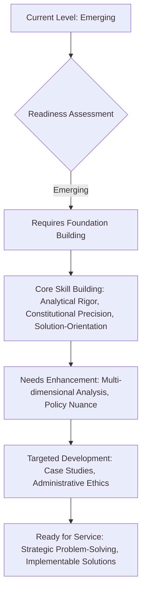

# ⚖️ UPSC GS Paper II Evaluation Report

## 📊 Overall Evaluation Dashboard

### 🎯 Performance Summary
> **Focus**: The candidate, Vaishali, demonstrates a commendable foundational understanding of General Studies Paper II, covering a broad spectrum of topics from Constitutional Law and Governance to Social Justice and International Relations. A significant strength lies in the ability to recall key concepts, articles, and relevant examples such as landmark judgments and government initiatives. The structural organization of answers generally follows a logical flow, with clear introductions, distinct body paragraphs, and concluding remarks. This indicates a disciplined approach to answer writing under examination conditions.

However, the evaluation reveals consistent patterns indicating areas for strategic improvement to elevate answers to UPSC excellence. While factual recall is present, the depth of multi-dimensional analysis and critical examination often remains superficial. Answers tend to be descriptive rather than analytical, missing the nuanced 'why' and 'how' required for higher scores. The integration of static constitutional knowledge with dynamic current affairs, though attempted, needs greater sophistication and precision.

Specifically, the candidate needs to develop a more robust analytical framework that goes beyond listing points to establishing cause-effect relationships, identifying underlying issues, and exploring multi-stakeholder perspectives. The 'way forward' sections, while present, often lack the administrative feasibility and innovative thinking characteristic of a civil servant mindset. Constitutional accuracy, though generally good, occasionally falters in specific details or interpretations, which are high-impact errors in GS-II. Emphasis must be placed on rigorous cross-referencing of constitutional provisions with contemporary governance challenges and judicial pronouncements.

The journey towards UPSC excellence demands a shift from broad coverage to deep, incisive analysis and a solution-oriented approach rooted in constitutional principles and administrative realities. By systematically addressing these analytical and conceptual gaps, Vaishali can significantly enhance the quality and impact of her responses, moving closer to the standards required for civil service.

### ✅ Key Strengths
> **🌟 Impact Areas** - List 3-5 most impactful strengths:

-   **🧠 Foundational Knowledge Base**: The candidate possesses a solid base of knowledge across the diverse GS-II syllabus. This is evident in the recall of constitutional articles (e.g., Art 148 for CAG, Art 356 for Governor), landmark Supreme Court cases (e.g., Kesavananda Bharati, SR Bommai, MC Mehta, Prakash Singh), and various government schemes (e.g., PMJAY, MNREGA, PM Awas Yojana). This strong factual foundation is crucial for building comprehensive answers.
-   **📝 Structured Answer Writing**: Answers generally adhere to a well-defined structure, including an introduction, distinct body paragraphs often with sub-headings, and a conclusion. This systematic approach enhances readability and ensures that all parts of the question are addressed, demonstrating good organizational skills under time pressure. For instance, in the CAG question, the clear division into 'Role Played' and 'Limitations' is effective.
-   **🌐 Broad Coverage of Dimensions**: The candidate attempts to incorporate multiple dimensions in answers, such as social, economic, political, and administrative aspects. In the COVID-19 vaccination question, challenges were categorized, and the PMO's role was discussed across various domains, showcasing an awareness of the multi-faceted nature of governance issues.
-   **💡 Awareness of Contemporary Issues**: There is a clear effort to link static concepts with current affairs, as seen in the discussion of IT Rules 2021, COVID-19 challenges, and the role of QUAD in geopolitical scenarios. This demonstrates an understanding of the dynamic nature of the GS-II syllabus and the need to stay updated.

### ⚡ Primary Development Areas
> **⚠️ Priority Focus** - List 3-5 most important areas for development with reasoning:

-   **🎯 Enhancing Analytical Depth and Critical Thinking**: The most significant area for improvement is moving beyond descriptive listing to in-depth analysis. While points are presented, the 'why' and 'how' are often missing. For example, in the Judicial Activism answer, roles are listed but a deeper critique of its implications for separation of powers or checks and balances is needed. This limits the ability to score high marks as UPSC demands incisive, multi-layered analysis.
-   **⚖️ Precision in Constitutional Interpretation and Application**: Although constitutional articles and cases are cited, there are instances where their application or specific nuances are not fully accurate or deeply explored. For instance, the distinction between 'equality before law' and 'equal protection of laws' in the context of Article 14 or a more detailed constitutional basis for quasi-federalism could be provided. Absolute accuracy and nuanced interpretation of constitutional provisions are non-negotiable for GS-II.
-   **🛠️ Developing a Robust Solution-Oriented Mindset**: While 'way forward' sections are present, they often comprise generic suggestions. The solutions lack administrative feasibility, innovation, and a clear understanding of implementation challenges and stakeholder considerations. For example, in the urban governance answer, while measures are listed, a more practical, implementable roadmap for ULBs would be beneficial. A civil servant's role is to provide actionable solutions, not just identify problems.
-   **🔗 Strategic Evidence Integration**: The use of evidence (articles, cases, committee reports, data) is present but often not integrated strategically to strengthen arguments. Rather, they appear as add-ons. For instance, in the Good Governance answer, while RTI is mentioned, a specific example of its impact on reducing information asymmetry with data could be more impactful. Evidence should logically flow to substantiate claims, elevating the quality of argumentation.

### 🏛️ Civil Service Readiness
> **🎯 Administrative Preparedness Assessment**

The candidate's current performance indicates an **Emerging** stage of civil service readiness in the context of GS Paper II. The foundational knowledge and structured approach are commendable, forming a solid base upon which to build. This signifies that Vaishali has grasped the basic requirements of the examination and can articulate information coherently. The attempt to connect static concepts with current events and demonstrate an awareness of governance issues is a positive indicator of an evolving administrative perspective.

However, the transition from an "Emerging" to a "Developing" and eventually "Ready for Service" level requires a significant qualitative leap. The current responses, while factually informed, often lack the depth of critical analysis, the nuanced understanding of policy implications, and the practical, implementable solution-orientation that defines a competent civil servant. A civil servant is not merely a repository of facts but a problem-solver, a critical thinker, and a strategic planner capable of navigating complex governance challenges. The answers currently tend to describe problems and list potential solutions without delving into the administrative feasibility, resource implications, or potential pitfalls of proposed measures.

To progress, the candidate needs to cultivate a more proactive and analytical mindset. This involves not just understanding 'what' but deeply exploring 'why' and 'how.' For instance, when discussing limitations of a constitutional body like CAG, a civil servant would analyze the systemic reasons behind these limitations and propose specific, actionable reforms, rather than just listing them. Similarly, in social justice issues, empathy for vulnerable sections must translate into concrete, inclusive policy recommendations grounded in an understanding of ground realities. The ability to synthesize diverse information, anticipate challenges, and formulate balanced, multi-stakeholder solutions is paramount. This requires extensive practice in applying theoretical knowledge to real-world scenarios, developing a keen sense of administrative ethics, and fostering a progressive outlook towards national development.

### 📈 UPSC Standard Alignment
> **🎯 Benchmarking Against Excellence**

The candidate's performance currently aligns with the average to above-average range in UPSC standards, reflecting a good grasp of the syllabus but a need for significant enhancement in analytical depth and critical thinking to achieve top scores. UPSC demands not just factual accuracy but a profound ability to dissect issues, present multi-dimensional perspectives, and offer well-reasoned arguments.

While the candidate demonstrates an understanding of the demand of the question, the analysis often remains at a descriptive level. For instance, in questions requiring "critical examination" or "evaluation," the responses tend to list pros and cons rather than offering a synthesized, evaluative judgment based on constitutional principles or administrative effectiveness. The multi-dimensional analysis, though attempted, sometimes feels like an enumeration of points rather than an integrated, coherent argument that connects constitutional, administrative, political, social, and economic aspects seamlessly. Top-scoring answers weave these dimensions together, showing how they interact and influence each other.

The crucial aspect of "solution-orientation" and demonstrating a "civil servant mindset" is present but requires refinement. UPSC examiners look for practical, implementable, and progressive "way forward" suggestions that reflect an understanding of governance complexities, resource constraints, and the constitutional framework. The current solutions, while well-intentioned, often lack this administrative feasibility and innovative edge.

Furthermore, the integration of static constitutional knowledge with dynamic current affairs, though attempted, lacks the seamlessness and precision seen in high-scoring answers. Contemporary examples should not just be mentioned but be critically analyzed to illustrate a point or substantiate an argument, demonstrating a deeper understanding of their implications. The rigorous balance required in presenting different perspectives, avoiding political bias, and maintaining constitutional objectivity is an area that needs continuous practice. Achieving UPSC excellence means transcending mere knowledge reproduction to demonstrating a mature, balanced, and insightful understanding of governance and constitutional issues, coupled with a strong problem-solving aptitude.

---

## 📝 Individual Answer Analysis

### 🎯 Question 1: Indian Constitution: Borrowed Features and Spirit of Indianness
**⭐ Question Text**: Constitution of India is a living document that is the outcome of detailed deliberations and debates of wisdom of our forefathers; preserving the ideals of democracy, sovereignty, unity & integrity of India. Despite amalgamation of various borrowings Indian constitution is unique in itself ("sui generis"). Discuss.
**📚 Syllabus Area**: `Constitution - Salient Features`

#### 🔄 Answer Comparison

##### 📝 Your Answer Summary
> **💡 Key Points from Your Response** *(50-80 words)*:
The candidate effectively identified several borrowed features such as Parliamentary System, Independence of Judiciary, Emergency Provisions, Fundamental Duties, and DPSP. They also highlighted unique aspects like the quasi-federal nature, flexibility in interpretation through judicial pronouncements (Kesavananda Bharati, Puttaswamy, Maneka Gandhi), and affirmative action for inclusion (Art 25-28, 29-30, 330-332, 350-B). The answer emphasized the blend of universal ideas with Indian needs.

##### ⭐ Ideal Answer Framework
> **🌟 UPSC Excellence Standard** *(150-200 words for 15m questions)*:
An ideal answer would systematically introduce the Indian Constitution as a synthesis of borrowed principles and indigenous adaptations, a "living document." It would categorize borrowed features (e.g., British: Parliamentary form, Rule of Law; US: Fundamental Rights, Judicial Review; Irish: DPSP; German: Emergency) with specific articles or concepts. The 'Spirit of Indianness' or 'sui generis' nature should then be elaborated, emphasizing:
1.  **Philosophical Uniqueness**: Preamble's ideals (Justice, Liberty, Equality, Fraternity), blend of rigidity/flexibility.
2.  **Structural Uniqueness**: Quasi-federalism with strong unitary bias (Art 1, 246, Governor's role, Art 356, All India Services) tailored for Indian diversity.
3.  **Fundamental Rights & Duties**: Scope, reasonable restrictions, and enforceability, tailored for social reform.
4.  **Directive Principles**: Their non-justiciable yet fundamental nature for governance, reflecting socio-economic goals.
5.  **Judicial Creativity**: Doctrine of Basic Structure (Kesavananda Bharati), extensive Judicial Review (Art 13, 32, 226), Public Interest Litigation (PIL) as an Indian innovation.
6.  **Socio-economic Transformation**: Emphasis on social justice, affirmative action (Arts 15, 16, 46, reservations) to address historical inequalities.
7.  **Adaptive Capacity**: Amendments (Art 368), judicial interpretations, and political practices.
It should conclude by reiterating that India's Constitution is a living document, evolving to meet the nation's unique challenges while upholding its core values, embodying a unique blend of universal principles and indigenous adaptations.

#### 📝 Evaluation Criteria

##### 💡 Relevance and Understanding
**🔎 Analysis** *(400-800 words)*:
The candidate has a clear understanding of the core demand of the question, which is to discuss both the borrowed features and the unique "spirit of Indianness" of the Indian Constitution. The answer directly addresses both parts, first listing borrowed features and then elaborating on the unique aspects. The mention of "living document" and "sui generis" in the introduction and conclusion indicates a good grasp of the philosophical underpinning of the question. However, the initial listing of borrowed features could be more precise (e.g., specifying which aspects of the Parliamentary system are borrowed from which source). The connection between the borrowed features and the "spirit of Indianness" could be more explicitly articulated – how India adapted these features to its unique socio-political context, rather than just presenting them as separate lists. For instance, how the Westminster model was adapted to a quasi-federal structure with a strong unitary bias, or how US-inspired Fundamental Rights were balanced with DPSP reflecting Indian socio-economic goals. The answer successfully avoids tangential points, staying focused on the core constitutional aspects.

**✅ Suggestions** *(1-2 actionable suggestions, 100-250 words each)*:
-   **✅ Enhance the Nexus between Borrowed and Unique Features**: Instead of presenting borrowed and unique features as two distinct lists, strive to show how borrowed features were *adapted* and *transformed* to suit India's unique circumstances. For example, explain how the British parliamentary system was integrated into a quasi-federal setup with a written constitution, or how the US concept of judicial review was expanded through PIL to address Indian social realities. This demonstrates a deeper analytical understanding of the Constitution's evolution.
-   **✅ Clarify Specificity of Borrowed Features**: For each borrowed feature, be more specific about the exact source and the particular aspect borrowed. For instance, for "Parliamentary System," mention the Westminster model and its key characteristics like nominal/real executive. For "Independence of Judiciary," specify the source (US) and key provisions like security of tenure, removal process, and fixed service conditions. This precision adds significant value to the content.

##### 🏗️ Structure and Organization
**🔎 Analysis** *(300-600 words)*:
The answer's structure is commendable. It begins with a relevant introduction, clearly setting the context of the Indian Constitution as a living document. The use of bullet points for "Borrowed Features" and then numbered points for "Spirit of Indianness" (though not explicitly titled as such) provides clarity and ease of reading. The conclusion effectively summarizes the unique blend. The flow between sections is generally logical, moving from the influences to the indigenous adaptations. However, the sub-headings within the "Spirit of Indianness" section could be more explicit and thematic (e.g., "Judicial Innovations," "Socio-economic Justice Orientation") to provide a clearer framework for the arguments. The use of concise sentences and legible handwriting also contributes positively to the presentation. The answer effectively utilizes space and adheres to a point-wise format, which is generally preferred in UPSC.

**✅ Suggestions** *(1-2 actionable suggestions, 100-250 words each)*:
-   **✅ Improve Thematic Sub-headings**: For the "Spirit of Indianness" section, consider using more descriptive and thematic sub-headings that encapsulate the essence of the points. For instance, instead of just numbered points, use "Quasi-Federal Structure," "Judicial Creativity and Basic Structure Doctrine," "Emphasis on Social Justice and Affirmative Action," and "Balance of Rigidity and Flexibility." This provides a clearer conceptual map for the examiner.
-   **✅ Strengthen the Concluding Synthesis**: While the conclusion is present, it could offer a more powerful synthesis. Reiterate how the "living document" nature allows for continuous adaptation while preserving core ideals. Emphasize that the "sui generis" character is a result of conscious choices made by the framers to create a constitution that is both universal in its principles and uniquely suited to India's diverse and complex realities.

##### ⚖️ Constitutional and Governance Knowledge
**🔎 Analysis** *(400-800 words)*:
The candidate demonstrates a good grasp of constitutional provisions and landmark judgments. Specific articles like Art 356, Art 25-28, 29-30, 330-332, and 350-B are mentioned, indicating factual knowledge. The reference to `Kesavananda Bharati case` and `Maneka Gandhi Judgement` is accurate in the context of flexibility and judicial reinterpretation. However, some references could be more precise. For instance, while `Art 356` is linked to "strong unitary features," a brief explanation of how it enables central control would enhance clarity. The mention of `Art 21` with `Maneka Gandhi` is accurate, highlighting "Due Process of Law." For `K.S. Puttuswamy Judgement`, linking it to `Right to Privacy` (Art 21) is crucial. The discussion on affirmative action is conceptually sound, relating it to `SC/ST representation` and `linguistic diversity`. Overall, the knowledge base is strong, but a deeper dive into the specific implications and historical context of these provisions and judgments would be beneficial.

**📚 Study Recommendations** *(2-3 specific recommendations, 100-250 words each)*:
-   **📚 Master Constitutional Articles and Their Nuances**: Focus on not just memorizing article numbers but understanding their full scope, exceptions, and interconnections. For example, when discussing federalism, also refer to Articles 245-255 (legislative relations), 256-263 (administrative relations), and 268-281 (financial relations) to show a comprehensive understanding beyond just the unitary features.
-   **📚 In-depth Study of Landmark Judgments**: For each landmark case mentioned, delve deeper into the specific constitutional questions it addressed, the principles it established, and its long-term impact on constitutional interpretation. For example, `Kesavananda Bharati` should be discussed not just as "basic structure" but also as a check on parliamentary amending power. Similarly, `Maneka Gandhi` transformed the interpretation of `Art 21`.
-   **📚 Systematize "Spirit of Indianness" Categories**: Create clear, distinct categories for the "Spirit of Indianness" (e.g., Adaptive Federalism, Judicial Activism/Innovation, Socio-Economic Justice, Unique Rights Framework) and gather specific constitutional provisions, examples, and debates under each. This will allow for a more structured and comprehensive presentation of India's constitutional distinctiveness.

##### 🧠 Analytical Rigor and Critical Thinking
**⚡ Analysis** *(500-1000 words)*:
> **⚠️ HIGH PRIORITY** - The candidate demonstrates an emerging capacity for analytical thinking but needs to significantly enhance its depth. While points like "flexibility in interpretation" and "affirmative action for inclusiveness" are analytical in nature, the analysis often stops at mere assertion rather than detailed explanation. For instance, stating that "Judiciary has time and time reinterpreted ideals of constitution" is an analytical point, but a deeper analysis would explore *how* this reinterpretation occurred (e.g., expanding the scope of `Art 21`, evolving understanding of `Art 14`), *why* it was necessary (e.g., to keep pace with societal changes, fill legislative gaps), and its *implications* (e.g., judicial activism, balance of power). The multi-dimensional aspect is present, connecting constitutional provisions to social upliftment, but a more rigorous examination of the challenges or debates surrounding these aspects (e.g., the debate around reservations or the balance between secularism and state's role in religion) would elevate the answer. Critical thinking requires evaluating strengths and weaknesses, offering nuanced perspectives, and developing a coherent argument that goes beyond description.

**✅ Suggestions** *(2-3 actionable suggestions, 100-250 words each)*:
-   **✅ Practice "Why" and "How" Questions**: For every point you make, ask yourself "Why is this important?" and "How does this work/manifest?" For example, when discussing "quasi-federal nature," explain *why* India adopted this model (historical context, diversity) and *how* it manifests (e.g., distribution of powers, emergency provisions, role of Governor). This forces deeper engagement with the topic.
-   **✅ Incorporate Debates and Nuances**: For topics with inherent debates (e.g., secularism, federalism, judicial activism), briefly acknowledge differing perspectives or the challenges involved. This demonstrates a mature, balanced understanding. For instance, while discussing affirmative action, a brief mention of the debates around creamy layer or the need for a relook at reservation policies could add depth.
-   **✅ Develop a Framework for Interlinking Concepts**: Practice connecting constitutional principles (e.g., federalism) with governance mechanisms (e.g., NITI Aayog) and current affairs (e.g., GST Council). This interdisciplinary approach is crucial for GS-II. For this question, consider how the "spirit of Indianness" influences governance and policy-making in contemporary India.

##### 📚 Evidence and Substantiation
**🔎 Analysis** *(300-600 words)*:
The candidate uses constitutional articles and landmark judgments as evidence, which is good practice. `Kesavananda Bharati`, `Puttuswamy`, and `Maneka Gandhi` are relevant cases. However, the substantiation could be more robust. For instance, while `Art 356` is mentioned for unitary features, providing a specific historical instance of its use and subsequent judicial pronouncements (`SR Bommai case`) would strengthen the argument. Similarly, for affirmative action, while articles are cited, a brief mention of specific policies or their outcomes would make the point more concrete. The evidence currently serves more as a mention rather than a powerful substantiator of the argument. There's an opportunity to integrate more committee reports (e.g., Sarkaria Commission for Centre-State relations) or academic insights where relevant to deepen the analysis.

**⚡ Value Addition Suggestions** *(1-2 suggestions, 100-250 words each)*:
-   **⚡ Integrate Evidence to Bolster Arguments**: Instead of merely listing articles or cases, explicitly explain *how* they support your point. For example, "The `Kesavananda Bharati judgment (1973)` established the `Doctrine of Basic Structure`, serving as a critical check on parliamentary power and thus reinforcing the Constitution's unique blend of rigidity and flexibility." This shows a clear link between evidence and argument.
-   **⚡ Use Specific Examples from Governance**: When discussing concepts like affirmative action or flexibility, bring in concrete examples from recent policy decisions, government initiatives, or societal developments to illustrate the practical application of these constitutional principles. For example, for affirmative action, refer to specific reservation policies or schemes for SC/ST/OBCs.

##### 🎯 Solution Orientation and Civil Service Mindset
**⚡ Analysis** *(400-800 words)*:
> **⚠️ HIGH PRIORITY** - While this question is more theoretical and descriptive, an underlying civil servant mindset can still be reflected. The answer implicitly demonstrates a progressive outlook by highlighting "affirmative action for inclusiveness" and the Constitution's dynamic nature to meet societal needs. This indicates an understanding that the Constitution is a tool for social engineering and progress. However, the "solution-orientation" is less directly applicable here as it's not a problem-solution question. Nonetheless, the emphasis on a "blend of universal ideas and dynamic needs of Indian society" reflects an adaptive and pragmatic approach, which is a civil servant quality. To further enhance this, one could briefly touch upon how this "living document" nature allows administrators to interpret and apply constitutional principles in a way that fosters inclusive growth and good governance.

**✅ Suggestions** *(1-2 actionable suggestions, 100-250 words each)*:
-   **✅ Frame the "Living Document" as an Administrative Tool**: Conclude by emphasizing how the "living document" nature of the Constitution empowers civil servants to interpret and apply its principles dynamically to address contemporary challenges, ensuring that governance remains responsive to the evolving needs of society while upholding core constitutional values. This links the theoretical concept directly to administrative practice.
-   **✅ Highlight the Constitution's Role in National Unity**: Given the question's mention of "unity & integrity of India," you could reinforce how the unique features (e.g., quasi-federalism, secularism, fundamental rights) are designed to foster national integration amidst diversity, a crucial aspect for any civil servant.

#### 💡 Key Insights
> **🌟 Strategic Takeaways** - 3-4 core strategic lessons from this answer:

-   **🎯 Balance Depth and Breadth**: While broad coverage is good, UPSC demands depth. For foundational questions, analyze *why* specific features were adopted and *how* they function in the Indian context, rather than just listing them.
-   **🔗 Interlink Concepts**: The Indian Constitution is a cohesive document. Practice showing the interconnections between different parts (e.g., how Fundamental Rights interact with DPSP, or how borrowed features were indigenized).
-   **⚖️ Precision in Constitutional Details**: Accuracy in citing articles, amendments, and specific rulings of landmark cases is paramount. Minor errors can significantly impact scores.
-   **📈 Cultivate Analytical Nuance**: Develop the ability to present nuanced arguments, acknowledging complexities and debates, rather than providing simplistic descriptions.

#### 📝 Next Steps
> **✅ Action Plan** - 3-4 specific, actionable tasks for the student:

-   [ ] **Review M. Laxmikanth (or similar text) on 'Salient Features of Indian Constitution'**: Focus specifically on the *rationale* behind the adoption of each feature and how they have been *adapted* in the Indian context. Pay close attention to the specific articles associated with each feature.
-   [ ] **Create a "Mind Map" for Key Constitutional Concepts**: For concepts like 'Federalism,' 'Separation of Powers,' 'Judicial Review,' list relevant articles, landmark cases, and contemporary examples. This will help in interlinking information.
-   [ ] **Practice Analytical Writing**: Take 2-3 past UPSC questions on constitutional features and practice writing answers, explicitly focusing on the 'why,' 'how,' and 'implications' of each point, rather than just descriptive information. Seek feedback on the depth of analysis.

---

### 🎯 Question 2: Role and Limitations of CAG
**⭐ Question Text**: Comptroller and Auditor General (CAG) is a constitutional body established under Art 148 to ensure financial propriety, accountability & transparency in fiscal & administrative governance in India. To impart impartiality CAG has been provided with security of tenure, no reappointment & States of Supreme court Judge. Discuss the role played by CAG and its limitations/shortcomings in functioning.
**📚 Syllabus Area**: `Constitutional Bodies - CAG`

#### 🔄 Answer Comparison

##### 📝 Your Answer Summary
> **💡 Key Points from Your Response** *(50-80 words)*:
The candidate accurately defined CAG as a constitutional body under `Art 148` and highlighted its independence through security of tenure. The answer then listed CAG's roles, including conducting audits of government departments and PSUs, laying detailed reports in Parliament, and unearthing flaws (citing `2G Scam`, `Coalgate Scandal`). It also correctly identified CAG as "Friend, Philosopher & Guide" to PAC. Limitations like political appointment, undue delay in reports, limited role in "course correction," and lack of trained manpower were also discussed.

##### ⭐ Ideal Answer Framework
> **🌟 UPSC Excellence Standard** *(100-150 words for 10m questions, 150-200 words for 15m questions)*:
An ideal answer would introduce CAG as the guardian of the public purse and a bulwark of the democratic system, established under `Article 148` to ensure financial accountability. It would briefly mention its independence (security of tenure, non-eligibility for re-appointment, removal process) to set the context for its effectiveness.
**Role of CAG**:
1.  **Auditor General**: Audits accounts of Union & State governments, PSUs, and bodies substantially financed by government (Art 149).
2.  **Accountability Enforcer**: Submits audit reports (appropriation, finance, public undertakings) to President/Governor, laid before Parliament/State Legislature (Art 151).
3.  **Financial Watchdog**: Exposes financial irregularities, waste, and inefficiency, promoting transparency.
4.  **Friend, Philosopher, Guide to PAC**: Assists the Public Accounts Committee in examining audit reports.
**Limitations/Challenges**:
1.  **Post-facto Audit**: Primarily an expenditure auditor, not involved in policy formulation or pre-audit of all transactions.
2.  **Executive Influence**: Appointment process (executive decision) can compromise perceived independence.
3.  **Scope Limitations**: Private-public partnerships (PPPs) and some local bodies are outside its direct audit purview.
4.  **Lack of Manpower/Expertise**: Challenges in auditing complex sectors (e.g., defense, IT) requiring specialized skills.
5.  **Advisory Role**: CAG's recommendations are advisory, and executive action depends on political will.
A strong conclusion would suggest reforms (e.g., bringing all PPPs under audit, strengthening manpower, empowering CAG with pre-audit in certain cases) to enhance its efficacy as a pillar of good governance.

#### 📝 Evaluation Criteria

##### 💡 Relevance and Understanding
**🔎 Analysis** *(400-800 words)*:
The candidate demonstrates a very good understanding of the question's core demand. The introduction is precise, citing `Art 148` and the core functions of CAG. The division of the answer into "Role Played by CAG" and "Limitations/Shortcomings" directly addresses the two main components of the question. The examples of `2G Scam` and `Coalgate Scandal` effectively illustrate CAG's role in unearthing flaws, showcasing a good grasp of current affairs. The identification of CAG as "Friend, Philosopher & Guide" to PAC is a key conceptual point correctly included. The answer is highly relevant and avoids any tangential information, focusing squarely on the functions and challenges of this constitutional body.

**✅ Suggestions** *(1-2 actionable suggestions, 100-250 words each)*:
-   **✅ Structure Roles for UPSC Impact**: While roles are listed, consider categorizing them for greater impact. For instance, divide into 'Statutory/Constitutional Roles' (e.g., audit of Union/State accounts), 'Oversight/Accountability Roles' (e.g., exposing irregularities, PAC assistance), and 'Advisory Roles'. This thematic grouping enhances clarity and analytical depth.
-   **✅ Briefly Explain Each Limitation**: For each limitation, provide a very brief explanation of *why* it is a limitation. For example, for "political appointment," briefly state how it "can compromise perceived independence," as you did. For "undue delay," explain how it "defeats the purpose of timely correction." This adds explanatory power.

##### 🏗️ Structure and Organization
**🔎 Analysis** *(300-600 words)*:
The answer is well-structured and organized. The introduction sets the stage effectively, providing the constitutional basis and core purpose of CAG. The use of clear headings like "ROLE PLAYED BY CAG" and "Limitations/Shortcoming in functioning" makes the answer easy to navigate. The points under each heading are presented in a concise, bulleted format, which aids readability. The conclusion, suggesting systemic and structural reforms, provides a forward-looking perspective. The overall presentation is neat, contributing to a positive impression. The logical flow from definition to roles, then to limitations, and finally to a way forward is excellent.

**✅ Suggestions** *(1-2 actionable suggestions, 100-250 words each)*:
-   **✅ Enhance Intro-Body-Conclusion Linkage**: While the current structure is good, explicitly link the introduction to the body's themes and then to the conclusion. For instance, the introduction states CAG's role in "financial propriety, accountability & transparency." The conclusion could then explicitly state how the proposed reforms will strengthen these aspects, creating a full circle.
-   **✅ Use Numbering for Points Consistently**: Ensure consistent numbering or bulleting throughout the body for all points. This maintains uniformity and makes the answer systematically organized.

##### ⚖️ Constitutional and Governance Knowledge
**🔎 Analysis** *(400-800 words)*:
The candidate demonstrates accurate constitutional knowledge by citing `Art 148` for the establishment of CAG and mentioning its security of tenure and non-eligibility for re-appointment, which are key aspects of its independence. The understanding of CAG's role in auditing various government entities (State, Central, PSUs) is correct. The reference to `2G Scam` and `Coalgate Scandal` shows awareness of specific instances where CAG's reports had significant governance impact. The knowledge of CAG's relationship with the `Public Accounts Committee` is also accurate. The discussion of limitations like "political executive influence" and "lack of trained manpower" reflects a practical understanding of governance challenges faced by constitutional bodies. The answer correctly highlights CAG's role as a post-facto auditor, limiting its "course correction" ability.

**📚 Study Recommendations** *(2-3 specific recommendations, 100-250 words each)*:
-   **📚 Deepen Understanding of CAG's Audit Scope**: Study the various types of audits conducted by CAG (e.g., financial audit, compliance audit, performance audit, regularity audit). Understanding these different dimensions will allow for a more nuanced discussion of its role.
-   **📚 Research Committee Recommendations on CAG Reforms**: Explore recommendations from various committees (e.g., Administrative Reforms Commissions, expert committees) on strengthening CAG's autonomy, expanding its audit scope (especially for PPPs), and enhancing its capacity. This shows a holistic understanding of the institution's evolution and challenges.
-   **📚 Understand CAG's International Counterparts**: Briefly researching how supreme audit institutions function in other countries can provide a comparative perspective, which can be useful for value addition in such questions.

##### 🧠 Analytical Rigor and Critical Thinking
**⚡ Analysis** *(500-1000 words)*:
> **⚠️ HIGH PRIORITY** - The analytical rigor is good in identifying limitations beyond mere description. For instance, stating that "Appointment of CAG is under political executive. Thus neutrality in selection is compromised" shows analytical thinking by linking the appointment process to a potential compromise of neutrality. Similarly, "No role of Comptroller to CAG restricts the power of course correction" is an analytical observation about the nature of its audit. However, the analysis could be deepened by exploring the *implications* of these limitations. For example, what are the broader consequences of "undue delay in tabling reports" for parliamentary oversight or public accountability? How does the "lack of trained manpower" affect the quality and depth of audits in complex sectors? A more critical examination of the trade-offs involved (e.g., between pre-audit and efficiency, or between autonomy and accountability) would elevate the answer.

**✅ Suggestions** *(2-3 actionable suggestions, 100-250 words each)*:
-   **✅ Analyze Implications of Limitations**: For each limitation identified, briefly explain its practical implications for governance, accountability, and transparency. For example, "Undue delay in tabling reports not only defeats the purpose of audit but also delays corrective action, potentially allowing financial irregularities to persist." This demonstrates a deeper analytical understanding.
-   **✅ Propose Solutions Grounded in Analysis**: Ensure that the "Thus in order to retain CAG..." section directly addresses the limitations identified. For example, if "political appointment" is a limitation, suggest reforms like a collegium for appointment. If "lack of course correction" is an issue, suggest empowering CAG with more teeth in specific cases.

##### 📚 Evidence and Substantiation
**🔎 Analysis** *(300-600 words)*:
The use of `Art 148` and the examples of `2G Scam` and `Coalgate Scandal` are effective pieces of evidence. These instances strongly substantiate CAG's role in unearthing financial irregularities. Mentioning "Friend, Philosopher & Guide to Public Accounts Committee" is also a good conceptual substantiation of its relationship with parliamentary oversight. However, for limitations, while the points are valid, specific instances or reports (e.g., ARC reports on CAG's functioning, or specific NITI Aayog recommendations) could be cited to add weight. The substantiation for its limitations is more general.

**⚡ Value Addition Suggestions** *(1-2 suggestions, 100-250 words each)*:
-   **⚡ Bolster Limitations with Expert Views/Reports**: To substantiate limitations, consider referencing relevant Administrative Reforms Commission (ARC) reports or observations from parliamentary committees that have highlighted these challenges. For example, "The Second ARC report noted concerns regarding the scope of CAG's audit in emerging areas like PPPs."
-   **⚡ Quantify Impact (if possible)**: While not always feasible, if any statistics or data related to CAG's performance or the financial impact of its unearthed scams are known, a brief mention can add significant weight. For instance, "CAG's audit of the `2G spectrum allocation` highlighted a presumptive loss of Rs. 1.76 lakh crore, underscoring its crucial role in accountability."

##### 🎯 Solution Orientation and Civil Service Mindset
**⚡ Analysis** *(400-800 words)*:
> **⚠️ HIGH PRIORITY** - The conclusion effectively demonstrates a solution-oriented civil servant mindset. The call for "systemic and structural reforms in appointment and devolution of powers" directly addresses the identified shortcomings and aims to enhance CAG's effectiveness. This shows a progressive outlook towards institutional strengthening. The phrase "guardian of public purse" in the conclusion reinforces the understanding of CAG's critical role in good governance. This section is concise but impactful, clearly identifying the need for actionable change to optimize a vital constitutional body.

**✅ Suggestions** *(1-2 actionable suggestions, 100-250 words each)*:
-   **✅ Detail Specific Reforms**: Instead of general calls for "systemic and structural reforms," briefly detail one or two key reforms. For example, "Systemic reforms should include a collegium-based appointment process for CAG to enhance its independence, similar to the process for CBI Director." This makes the solution more concrete and implementable.
-   **✅ Connect Solutions to Outcomes**: Explicitly state how the suggested reforms would lead to better outcomes. For instance, "Such reforms would not only enhance CAG's neutrality but also strengthen its capacity to ensure greater financial accountability and transparency in public expenditure, crucial for good governance."

#### 💡 Key Insights
> **🌟 Strategic Takeaways** - 3-4 core strategic lessons from this answer:

-   **🎯 Comprehensive Coverage**: Ensure all parts of the question are addressed distinctly and comprehensively (e.g., roles AND limitations).
-   **🔗 Connect to Governance Principles**: Link the functions and challenges of constitutional bodies to broader principles of good governance like accountability, transparency, and propriety.
-   **⚖️ Substantiate with Examples**: Use specific, well-known examples (scams, reports) to illustrate points and add credibility.
-   **📈 Propose Actionable Reforms**: Conclude with practical, implementable suggestions for improvement that demonstrate a civil servant's problem-solving approach.

#### 📝 Next Steps
> **✅ Action Plan** - 3-4 specific, actionable tasks for the student:

-   [ ] **Deep Dive into CAG's Audit Functions**: Read up on the various types of audits CAG performs (performance, compliance, financial) and their significance. Understand the difference between pre-audit and post-audit.
-   [ ] **Research ARC Reports on CAG**: Specifically, look for recommendations from the Administrative Reforms Commissions regarding CAG's autonomy, scope, and capacity. Note down 2-3 key actionable recommendations.
-   [ ] **Practice "Reform-Oriented" Conclusions**: Select 2-3 past UPSC questions on other constitutional bodies (e.g., Election Commission, UPSC) and practice writing conclusions that propose specific, implementable reforms to address their challenges.

---

### 🎯 Question 3: Challenges in COVID-19 Vaccination
**⭐ Question Text**: COVID-19 Pandemic had been an unprecedented challenge that had affected the people in multifaceted manner (Social, economical, environmental). Vaccination is a tool to fight against its epidemic with war-footing. It has been associated with MULTIPLE challenges:- Discuss. Also suggest way forward.
**📚 Syllabus Area**: `Social Justice - Health; Governance - Public Health`

#### 🔄 Answer Comparison

##### 📝 Your Answer Summary
> **💡 Key Points from Your Response** *(50-80 words)*:
The candidate clearly outlined multiple challenges in India's COVID-19 vaccination drive, categorizing them effectively. These included `persuading citizens` (skepticism), `supply bottlenecks`, `minimizing wastage`, `poor Center-State coordination`, `digital divide`, `inadequate healthcare workers`, and `poor cold storage`. For the way forward, suggestions focused on `availability` (international collaborations, private sector), `awareness` (information, role models), and `infrastructural` improvements (incentives, WMA relaxation, on-site registration).

##### ⭐ Ideal Answer Framework
> **🌟 UPSC Excellence Standard** *(100-150 words for 10m questions, 150-200 words for 15m questions)*:
An ideal answer would introduce the COVID-19 pandemic as an unprecedented global health crisis and vaccination as the primary tool for mitigation, setting the context of India's large and diverse population.
**Challenges in Vaccination**:
1.  **Supply Chain & Production**: Limited domestic production, reliance on imports, raw material shortages.
2.  **Logistical & Cold Chain**: Maintaining ultra-cold chain, last-mile delivery to remote areas, vaccine wastage.
3.  **Vaccine Hesitancy**: Misinformation, rumors, lack of trust, fear of side effects, religious/cultural beliefs.
4.  **Equity & Accessibility**: Digital divide (CoWIN registration), urban-rural disparity, access for vulnerable groups (elderly, disabled, migrant workers).
5.  **Human Resources**: Shortage of trained vaccinators, healthcare workers, administrative staff.
6.  **Centre-State Coordination**: Issues in vaccine procurement, distribution, and differing policies.
7.  **Financial Constraints**: States' burden for vaccine procurement, impact on other health services.
**Way Forward**:
1.  **Boost Production**: Licensing more manufacturers, technology transfer, public-private partnerships.
2.  **Strengthen Supply Chain**: Robust cold chain infrastructure, efficient distribution, minimizing wastage.
3.  **Address Hesitancy**: Targeted public awareness campaigns, community engagement, leveraging local leaders, fact-checking.
4.  **Ensure Equity**: Offline registration, mobile vaccination camps, prioritizing vulnerable groups, universal access.
5.  **Human Resource Development**: Training more vaccinators, incentivizing healthcare workers.
6.  **Cooperative Federalism**: Coordinated procurement, transparent distribution, sharing best practices.
7.  **Global Collaboration**: TRIPS waiver, international aid, vaccine diplomacy.
Conclude by emphasizing a holistic, multi-pronged approach involving government, civil society, and citizens for successful mass vaccination and building future pandemic preparedness.

#### 📝 Evaluation Criteria

##### 💡 Relevance and Understanding
**🔎 Analysis** *(400-800 words)*:
The candidate demonstrates a strong understanding of the question's demand, which is to identify challenges in the COVID-19 vaccination drive and suggest a way forward. The introduction correctly frames the pandemic as an "unprecedented challenge." The identified challenges are relevant and cover critical aspects such as `citizen persuasion`, `supply bottlenecks`, `wastage`, `Center-State coordination`, `digital divide`, `healthcare worker inadequacy`, and `cold storage`. The way forward suggestions are logically categorized into `Availability`, `Awareness`, and `Infrastructural` improvements, directly addressing the identified problems. The answer is highly relevant and directly addresses the core issues of the question. The multi-faceted impact mentioned in the prompt (social, economic, environmental) is implicitly covered through the challenges of human capital.

**✅ Suggestions** *(1-2 actionable suggestions, 100-250 words each)*:
-   **✅ Prioritize and Elaborate Key Challenges**: While all listed challenges are valid, briefly elaborate on the *impact* of the most critical ones. For example, for "digital divide," explain how the reliance on `CoWIN` portal excluded a significant portion of the population without smartphone access or digital literacy, leading to inequitable access.
-   **✅ Ensure Way Forward Directly Addresses Challenges**: Double-check that each suggestion in the "Way Forward" section directly provides a solution to a previously identified challenge. For instance, "on-site registration" directly tackles the "digital divide" challenge. This explicit linkage strengthens the logical coherence of the answer.

##### 🏗️ Structure and Organization
**🔎 Analysis** *(300-600 words)*:
The answer's structure is very good. It starts with a concise introduction, sets the context, and then moves into a clearly demarcated section on "MULTIPLE challenges." The use of numbered points for challenges and then categorized sub-sections (`AVAILABILITY`, `AWARENESS`, `INFRASTRUCTURAL`) for the "Way Forward" is highly effective. This systematic presentation enhances readability and ensures comprehensive coverage. The overall flow is logical, moving from problem identification to solution generation. The neat presentation and legible handwriting further contribute to the answer's quality.

**✅ Suggestions** *(1-2 actionable suggestions, 100-250 words each)*:
-   **✅ Use Stronger Concluding Remark**: While the answer has a way forward, a brief concluding sentence that summarizes the need for a holistic, inclusive approach would make the answer feel more complete and impactful. For example, "Thus, a multi-pronged strategy encompassing enhanced availability, pervasive awareness, and robust infrastructure is essential to ensure equitable and swift vaccination for all."
-   **✅ Categorize Challenges Thematically**: Consider grouping similar challenges under broader themes (e.g., 'Logistical Challenges,' 'Behavioral Challenges,' 'Systemic Challenges') to provide a more analytical framework, even if using numbered points within them. This shows a deeper conceptual understanding.

##### ⚖️ Constitutional and Governance Knowledge
**🔎 Analysis** *(400-800 words)*:
The candidate demonstrates a good understanding of governance challenges in public health. The points on `supply bottlenecks`, `Center-State coordination`, `digital divide`, `healthcare workers`, and `cold storage` reflect practical administrative knowledge. The suggestions in the way forward, such as `international collaborations` (Sputnik-V), `private sector engagement`, `leveraging diplomacy` (TRIPS waiver), `Role Model Approach` for awareness, and `Way and Means Advance relaxation` for states, indicate a good grasp of policy tools and multi-stakeholder approaches in governance. The mention of `RBI` for `Way and Means Advance` is a specific and accurate detail. The overall knowledge is strong, showing awareness of both the problems and the mechanisms to address them within the Indian governance framework.

**📚 Study Recommendations** *(2-3 specific recommendations, 100-250 words each)*:
-   **📚 Deepen Knowledge of Public Health Governance**: Study the structure and functioning of India's public health system, including primary, secondary, and tertiary care. Understand the roles of various ministries, NITI Aayog, and state health departments in policy formulation and implementation.
-   **📚 Research Specific Government Initiatives**: For each challenge, identify specific government initiatives (e.g., `National Health Mission`, `Ayushman Bharat Digital Mission` for digital health) that could be leveraged or improved. This adds concreteness to your suggestions.
-   **📚 Explore International Best Practices**: For global challenges like pandemics, research how other countries or international organizations (WHO, GAVI) have tackled similar issues, especially regarding vaccine equity and supply chain management. This can provide valuable comparative insights.

##### 🧠 Analytical Rigor and Critical Thinking
**⚡ Analysis** *(500-1000 words)*:
> **⚠️ HIGH PRIORITY** - The analytical rigor is evident in the categorization of challenges and the logical progression to the way forward. For example, linking "persuading citizens" to "skepticism and fears" shows a cause-effect understanding. Similarly, identifying "digital divide" as an inhibition to accessibility is an analytical point. However, the analysis could go deeper. For instance, for "poor Center-State coordination," what are the *underlying reasons* for this (e.g., federal structure, differing political priorities, resource allocation)? For "supply bottlenecks," what are the *specific policy failures* or systemic issues contributing to it (e.g., lack of advance orders, raw material dependency)? The answer is strong on *what* the challenges are, but could be stronger on *why* they exist and *how* they impact the overall drive.

**✅ Suggestions** *(2-3 actionable suggestions, 100-250 words each)*:
-   **✅ Analyze Root Causes of Challenges**: For each challenge, briefly touch upon its root cause. For example, for "digital divide," explain it's a symptom of deeper issues like socio-economic inequality and lack of digital infrastructure in rural areas. This adds analytical depth.
-   **✅ Evaluate Interconnectedness of Challenges**: Briefly analyze how different challenges are interconnected. For example, "supply bottlenecks exacerbated vaccine hesitancy due to uncertainty, while poor Center-State coordination further complicated equitable distribution." This demonstrates a holistic analytical perspective.
-   **✅ Propose Innovative Solutions**: Beyond traditional solutions, think of innovative or technology-driven solutions. For instance, for "digital divide," suggest leveraging `Common Service Centres (CSCs)` or local self-help groups for assisted registration.

##### 📚 Evidence and Substantiation
**🔎 Analysis** *(300-600 words)*:
The candidate effectively uses examples like `Sputnik-V manufacturing in Himachal Pradesh` and `Pfizer/Moderna` for international collaborations, which substantiates the "availability" point. The mention of `TRIPS waiver` and `Patent sharing` shows awareness of global policy debates. The point on `Way and Means Advance relaxation by RBI` is a specific and accurate example of financial governance. For challenges, the mention of `digital divide` is a well-known issue. Overall, the evidence is relevant and supports the arguments made.

**⚡ Value Addition Suggestions** *(1-2 suggestions, 100-250 words each)*:
-   **⚡ Use Data/Statistics for Impact**: Where possible, use relevant data to highlight the scale of the challenge. For example, "The `digital divide` meant that a significant portion of the rural population (approx. 67% without internet access in 2019) faced barriers to `CoWIN` registration." (Use approximate or indicative data if precise figures are not recalled).
-   **⚡ Reference Government Programs**: When suggesting solutions, refer to existing government programs or frameworks that can be leveraged. For instance, for `awareness`, mention leveraging `IEC (Information, Education, Communication)` campaigns under `National Health Mission`.

##### 🎯 Solution Orientation and Civil Service Mindset
**⚡ Analysis** *(400-800 words)*:
> **⚠️ HIGH PRIORITY** - The answer demonstrates a strong solution-oriented civil servant mindset. The "Way Forward" section is comprehensive, covering `availability`, `awareness`, and `infrastructural` aspects. Suggestions like `international collaborations`, `engaging private sector`, `leveraging diplomacy for TRIPS waiver`, `Role Model Approach`, `Way and Means Advance relaxation`, and `on-site registration` are all practical, progressive, and implementable. They show an understanding of multi-stakeholder engagement and leveraging various policy levers (economic, diplomatic, administrative) to address a complex public health crisis. The concluding sentence "Thus an inclusive approach is required to boost vaccination drive in India" reinforces a commitment to equitable and effective governance.

**✅ Suggestions** *(1-2 actionable suggestions, 100-250 words each)*:
-   **✅ Prioritize Solutions by Impact**: Briefly indicate which solutions would have the most immediate or long-term impact. For example, "While all measures are crucial, immediate focus on `boosting domestic production` and `addressing vaccine hesitancy` through localized campaigns would yield rapid results."
-   **✅ Consider Ethical Dimensions**: Briefly touch upon the ethical implications of vaccine distribution, especially concerning equity and prioritizing vulnerable groups. This adds a layer of depth to the civil servant mindset.

#### 💡 Key Insights
> **🌟 Strategic Takeaways** - 3-4 core strategic lessons from this answer:

-   **🎯 Problem-Solution Approach**: Clearly identify problems and then logically connect solutions to them.
-   **🔗 Multi-Dimensional Solutions**: Propose solutions that span various domains (economic, social, technological, administrative, international).
-   **⚖️ Implementable Suggestions**: Ensure "Way Forward" points are practical and consider existing frameworks or resources.
-   **📈 Contextualize with Current Events**: Use contemporary examples to illustrate challenges and solutions, demonstrating up-to-date knowledge.

#### 📝 Next Steps
> **✅ Action Plan** - 3-4 specific, actionable tasks for the student:

-   [ ] **Deep Dive into India's Vaccine Strategy**: Research the detailed components of India's National COVID-19 Vaccination Program, including `CoWIN`, vaccine procurement, and distribution mechanisms.
-   [ ] **Analyze Government Reports/Economic Survey**: Look for relevant sections in the Economic Survey or NITI Aayog reports that discuss public health infrastructure, digital health, and pandemic preparedness, noting down key data points or recommendations.
-   [ ] **Practice "Policy Prescription" Questions**: Select 2-3 past UPSC questions on social sector issues (e.g., education, poverty, gender equality) and practice writing answers with a strong emphasis on practical, multi-stakeholder policy solutions.

---

### 🎯 Question 4: Multi-dimensional Role of PMO
**⭐ Question Text**: Prime minister office is the most Strategic department to ensure evidence based policy making and participative governance in India. It has played multi-dimensional role in coordinating multiple stakeholders. Discuss.
**📚 Syllabus Area**: `Governance - Executive; PMO`

#### 🔄 Answer Comparison

##### 📝 Your Answer Summary
> **💡 Key Points from Your Response** *(50-80 words)*:
The candidate correctly identified PMO as a strategic department for evidence-based policy-making and participative governance. It then outlined PMO's multi-dimensional role across various domains: `Vertical and Horizontal Accountability` (via PRAGATI, MyGov), `Science and Technology` (through PM-STIAC, champion sectors), `Diplomatic Relations` (foreign policy, strategic partnerships), `Cooperative and Competitive Federalism` (NITI Aayog), and `Security` (internal and external, coordinating defense/intelligence).

##### ⭐ Ideal Answer Framework
> **🌟 UPSC Excellence Standard** *(100-150 words for 10m questions, 150-200 words for 15m questions)*:
An ideal answer would introduce the Prime Minister's Office (PMO) as the nerve center of the Union government, a powerful extra-constitutional body, and the principal staff agency for the Prime Minister, crucial for evidence-based policy-making and participative governance.
**Multi-dimensional Role of PMO**:
1.  **Policy Formulation & Coordination**: Assists PM in policy decisions, inter-ministerial coordination, and resolving departmental disputes.
2.  **Strategic Planning**: Plays a key role in long-term strategic planning (e.g., `New India Vision`, `NITI Aayog` coordination).
3.  **Accountability & Monitoring**: Monitors policy implementation (`PRAGATI`), ensures vertical and horizontal accountability.
4.  **National Security & Foreign Policy**: Advises PM on national security, shapes foreign policy, coordinates intelligence agencies (NSA is part of PMO).
5.  **Economic & Developmental Oversight**: Influences key economic policies, monitors major projects, coordinates with financial institutions.
6.  **Public Grievances & Citizen Interface**: Handles public grievances, leverages platforms like `MyGov` for participative governance.
7.  **Science & Technology**: Guides national S&T policies, promotes innovation (e.g., `PM-STIAC`).
8.  **Crisis Management**: Coordinates responses during national crises (e.g., natural disasters, pandemics).
The conclusion should emphasize its evolving role, reflecting the increasing centralization of power and the need for PMO to balance efficiency with democratic accountability, becoming a key driver for good governance and national development.

#### 📝 Evaluation Criteria

##### 💡 Relevance and Understanding
**🔎 Analysis** *(400-800 words)*:
The candidate demonstrates excellent understanding of the question, accurately identifying PMO as a "strategic department" central to "evidence-based policy making and participative governance." The answer directly addresses the "multi-dimensional role" by organizing points into distinct domains: `Vertical and Horizontal Accountability`, `Science and Technology`, `Diplomatic Relations`, `Cooperative and Competitive Federalism`, and `Security`. The examples cited, such as `PRAGATI`, `MyGov`, `PM-STIAC`, `Asia-Africa growth corridor`, `NITI Aayog`'s role, and `Kulbhushan Jadhav case`, are highly relevant and effectively substantiate the PMO's influence in these areas. The answer is well-focused and directly tackles the core demand of the question.

**✅ Suggestions** *(1-2 actionable suggestions, 100-250 words each)*:
-   **✅ Expand on "Evidence-Based" Aspect**: While the introduction mentions "evidence-based policy making," explicitly link specific roles to this. For example, explain how `PRAGATI` (Pro-Active Governance and Timely Implementation) provides real-time data for monitoring, thus feeding into evidence-based decisions.
-   **✅ Clarify "Participative Governance" Link**: For `MyGov`, briefly explain *how* it facilitates citizen participation (e.g., crowdsourcing ideas, seeking public opinion) beyond just mentioning the platform. This strengthens the connection to the question's premise.

##### 🏗️ Structure and Organization
**🔎 Analysis** *(300-600 words)*:
The answer is very well-structured. The introduction is crisp and sets the context. The use of numbered points with bolded headings for each domain (e.g., **Vertical and Horizontal Accountability**) clearly delineates the multi-dimensional roles. This formatting greatly enhances readability and highlights the key areas of PMO's functioning. The examples within each point are integrated effectively. The conclusion summarizes the PMO's envisioned role in "New India" and comprehensive approach, providing a good wrap-up. The logical flow is strong, moving from a general statement to specific, categorized examples.

**✅ Suggestions** *(1-2 actionable suggestions, 100-250 words each)*:
-   **✅ Add a Concluding Thought on Evolution**: While the conclusion is good, consider adding a sentence about the *evolving nature* of PMO's role, perhaps touching upon debates regarding its increasing power or its balancing act between coordination and centralization, to reflect a more critical understanding.
-   **✅ Ensure Consistent Formatting for Examples**: While examples are good, ensure consistent use of `backticks` for specific programs/cases (e.g., `PRAGATI`, `MyGov`, `Kulbhushan Jadhav case`) to make them stand out clearly.

##### ⚖️ Constitutional and Governance Knowledge
**🔎 Analysis** *(400-800 words)*:
The candidate demonstrates strong governance knowledge regarding the PMO's functioning. The understanding of PMO's role in `Vertical and Horizontal Accountability` via `PRAGATI` (a key monitoring tool) and `MyGov` (a citizen engagement platform) is accurate. The awareness of `PM-STIAC` and its `champion sectors` reflects knowledge of current policy initiatives in science and technology. The discussion on `Diplomatic Relations` and specific strategic partnerships (e.g., `Asia-Africa Growth Corridor`, `Look East`, `Russia`, `Israel`, `USA`) is very good, showing a contemporary grasp of India's foreign policy. The inclusion of `Cooperative and Competitive Federalism` through `NITI Aayog` (Team India division) is also highly relevant. Finally, the mention of PMO's `Security` role (internal and external, coordinating intelligence/defense) is crucial. The `Kulbhushan Jadhav case` as an example of `UNHRC` intervention is a good, specific detail.

**📚 Study Recommendations** *(2-3 specific recommendations, 100-250 words each)*:
-   **📚 Deepen Understanding of PMO's Historical Evolution**: Briefly research how the PMO's role has evolved over time since its inception, including its increasing influence under different Prime Ministers. This historical context can add depth to your analysis.
-   **📚 Explore PMO's Internal Structure**: Understand the key wings and advisors within the PMO (e.g., National Security Advisor, Principal Secretary) and how they contribute to its multi-dimensional functions.
-   **📚 Read ARC Reports on Executive Functioning**: Refer to relevant Administrative Reforms Commission reports or other governance reform documents that discuss the role and powers of the PMO, including any recommendations for optimizing its functioning while maintaining accountability.

##### 🧠 Analytical Rigor and Critical Thinking
**⚡ Analysis** *(500-1000 words)*:
> **⚠️ HIGH PRIORITY** - The analysis is quite strong in identifying *how* the PMO exercises its multi-dimensional role through specific mechanisms and initiatives. For instance, linking `PRAGATI` to `timely reporting of policy implementation` is an analytical connection. Similarly, identifying `PM-STIAC` as a mechanism for `identifying champion sectors` shows an understanding of its strategic function. The conclusion also attempts a higher-level analysis by mentioning the "vision of New India" and a "comprehensive approach." However, the answer could benefit from a more critical evaluation of the PMO's role. For example, is its expanding role always beneficial, or does it sometimes lead to over-centralization of power, undermining ministerial autonomy? A brief discussion of this debate would demonstrate a more nuanced and critical perspective, moving beyond mere description of functions.

**✅ Suggestions** *(2-3 actionable suggestions, 100-250 words each)*:
-   **✅ Introduce a Critical Perspective**: While discussing the PMO's multi-dimensional role, briefly acknowledge the ongoing debate regarding its increasing power and potential for centralization of authority, and how it impacts the `Cabinet Secretariat` or individual ministries. This demonstrates a balanced and critical understanding.
-   **✅ Analyze the Impact of PMO's Role**: For each dimension, briefly analyze the *impact* of PMO's involvement. For example, for `Diplomatic Relations`, explain how PMO's direct involvement has allowed for "swift decision-making and personalized diplomacy," enhancing India's global standing.
-   **✅ Connect to Governance Principles**: Explicitly link each role to a governance principle. For instance, `PRAGATI` enhances `accountability` and `transparency`, while `MyGov` promotes `citizen participation` and `responsiveness`.

##### 📚 Evidence and Substantiation
**🔎 Analysis** *(300-600 words)*:
The candidate provides strong substantiation through concrete examples of programs and initiatives. `PRAGATI`, `MyGov`, `PM-STIAC`, `NITI Aayog's Team India division`, and specific diplomatic engagements (`Asia-Africa Growth Corridor`, `Russia`, `Israel`, `USA`) are excellent pieces of evidence. The `Kulbhushan Jadhav case` as an example of `UNHRC` intervention is also a relevant and specific detail. This robust use of contemporary examples significantly strengthens the answer's credibility and demonstrates up-to-date knowledge.

**⚡ Value Addition Suggestions** *(1-2 suggestions, 100-250 words each)*:
-   **⚡ Quantify Impact (if available)**: If any data or statistics related to the effectiveness of PMO initiatives (e.g., number of projects monitored by `PRAGATI`, citizen engagement on `MyGov`) are known, a brief mention can further strengthen the evidence.
-   **⚡ Use Official Reports/Documents**: Where appropriate, reference official government documents or reports that elaborate on the PMO's role or specific initiatives (e.g., `Economic Survey`, `NITI Aayog` documents). This adds authoritative weight to your claims.

##### 🎯 Solution Orientation and Civil Service Mindset
**⚡ Analysis** *(400-800 words)*:
> **⚠️ HIGH PRIORITY** - The answer implicitly demonstrates a civil servant mindset by focusing on the PMO's role in `evidence-based policy making`, `participative governance`, and `coordination` for national development. The conclusion, envisioning "New India" and a "comprehensive approach in policy making & governance," reflects a progressive and forward-looking outlook. While this question doesn't directly ask for solutions to problems, highlighting the PMO's strategic role in ensuring timely implementation and coordination (through `PRAGATI`) shows an understanding of administrative efficiency and problem-solving at the highest level of governance.

**✅ Suggestions** *(1-2 actionable suggestions, 100-250 words each)*:
-   **✅ Explicitly State PMO's Role in "Way Forward"**: In the conclusion, you could explicitly state that the PMO, through its coordinating and monitoring functions, plays a crucial role in shaping the "way forward" for India's development trajectory, ensuring policy coherence and effective implementation.
-   **✅ Balance Efficiency with Accountability**: Briefly touch upon the importance of balancing the PMO's enhanced efficiency and coordination powers with mechanisms to ensure accountability and transparency, a key concern for good governance.

#### 💡 Key Insights
> **🌟 Strategic Takeaways** - 3-4 core strategic lessons from this answer:

-   **🎯 Understand Institutional Dynamics**: Go beyond mere definitions to understand the practical influence and operational mechanisms of key government institutions like the PMO.
-   **🔗 Connect Mechanisms to Outcomes**: Link specific initiatives (`PRAGATI`, `MyGov`) to their intended outcomes (accountability, participation).
-   **⚖️ Integrate Current Affairs Seamlessly**: Use contemporary examples to illustrate roles, demonstrating up-to-date knowledge and its application.
-   **📈 Think Strategically**: Frame the role of such high-level bodies in terms of national strategy, vision, and comprehensive development.

#### 📝 Next Steps
> **✅ Action Plan** - 3-4 specific, actionable tasks for the student:

-   [ ] **Study `PRAGATI` and `MyGov` in Detail**: Understand their features, objectives, and how they contribute to governance. Look for any official reports on their impact.
-   [ ] **Research India's Foreign Policy Priorities**: Deepen your understanding of India's current foreign policy objectives and key strategic partnerships, focusing on the economic and security dimensions.
-   [ ] **Practice "Institutional Role" Questions**: Select 2-3 past UPSC questions on other high-level government bodies (e.g., Cabinet Secretariat, National Security Council) and practice analyzing their multi-dimensional roles and functions.

---

### 🎯 Question 5: Public Interest Litigation (PIL)
**⭐ Question Text**: Public Interest litigation diluted the principle of Locus standi and hence served as a tool to ensure distributive Justice as envisaged in our constitution. The concept popularised by Justice PN Bhagwati developed in decades of 1970-80s and had multiple Ramification with various judicial pronouncements. Discuss.
**📚 Syllabus Area**: `Constitution - Judiciary; Social Justice`

#### 🔄 Answer Comparison

##### 📝 Your Answer Summary
> **💡 Key Points from Your Response** *(50-80 words)*:
The candidate defined PIL as diluting `locus standi` for distributive justice, crediting Justice `P.N. Bhagwati`. It then discussed multiple ramifications through various judicial pronouncements: `Hussainara Khatoon` (right to life of prisoners), `MC Mehta` (clean environment), `TSR Subramanian` (bureaucratic transfers), `Prakash Singh` (police reforms), `PUCL` (RTI), and `Naz Foundation` (`Section 377`). The answer also acknowledged PIL's impact on judicial workload and its constructive use for social justice.

##### ⭐ Ideal Answer Framework
> **🌟 UPSC Excellence Standard** *(100-150 words for 10m questions, 150-200 words for 15m questions)*:
An ideal answer would introduce Public Interest Litigation (PIL) as a revolutionary tool of judicial activism, initiated by the Supreme Court to ensure access to justice for the marginalized, fundamentally altering the traditional rule of `locus standi` (where only an aggrieved party could approach the court). It would credit Justice `P.N. Bhagwati` and Justice `V.R. Krishna Iyer` for its popularization.
**Ramifications & Judicial Pronouncements**:
1.  **Ensuring Distributive Justice**: Expanded rights beyond fundamental rights to socio-economic rights (e.g., right to clean environment, food, education).
2.  **Accountability & Governance Reforms**: Held executive accountable, led to reforms in public administration.
3.  **Environmental Protection**: Landmark cases like `MC Mehta` series led to environmental jurisprudence.
4.  **Prison Reforms**: Cases like `Hussainara Khatoon` addressed rights of undertrials.
5.  **Human Rights Protection**: Broadened scope of `Art 21` to include dignity, privacy, speedy trial.
6.  **Social Justice**: Addressed issues of bonded labor, child labor, women's rights (`Vishakha Guidelines`).
7.  **Institutional Reforms**: `Prakash Singh` (police reforms), `Vineet Narain` (CBI autonomy) for good governance.
**Challenges/Concerns**:
1.  **Judicial Overreach**: Blurring lines of separation of powers.
2.  **Frivolous PILs**: Misuse for personal gain or publicity.
3.  **Judicial Workload**: Increased burden on courts.
4.  **Lack of Expertise**: Courts sometimes venture into administrative domains without specialized knowledge.
The conclusion should offer a balanced perspective, acknowledging PIL's transformative potential for social justice while stressing the need for judicial self-restraint and responsible use to maintain its efficacy and credibility.

#### 📝 Evaluation Criteria

##### 💡 Relevance and Understanding
**🔎 Analysis** *(400-800 words)*:
The candidate demonstrates a strong understanding of the question's core demand, which is to discuss PIL's role in diluting `locus standi` for distributive justice and its ramifications through judicial pronouncements. The introduction correctly attributes PIL's popularization to Justice `P.N. Bhagwati` and links it to `distributive justice`. The selection of cases (`Hussainara Khatoon`, `MC Mehta`, `TSR Subramanian`, `Prakash Singh`, `PUCL`, `Naz Foundation`) is excellent, showcasing a wide range of PIL's impact across social justice, governance, and human rights. The inclusion of the impact on "judicial workload" and the potential for "constructive use" provides a balanced perspective. The answer is highly relevant and directly addresses all aspects of the question.

**✅ Suggestions** *(1-2 actionable suggestions, 100-250 words each)*:
-   **✅ Categorize Ramifications Thematically**: To enhance analytical depth, consider grouping the cases under broader thematic categories. For example, `Hussainara Khatoon` under 'Prison Reforms/Right to Speedy Trial,' `MC Mehta` under 'Environmental Jurisprudence,' `Prakash Singh` and `TSR Subramanian` under 'Governance and Administrative Reforms,' and `Naz Foundation` under 'Social Rights/LGBTQ+ Rights.' This provides a clearer structure for the impact.
-   **✅ Briefly Explain Each Case's Significance**: For each case, briefly state *what* it was about and *how* it demonstrated a specific ramification of PIL. For example, for `PUCL vs UOI`, mention its role in `Right to Information Act 2005` beyond just the act.

##### 🏗️ Structure and Organization
**🔎 Analysis** *(300-600 words)*:
The answer is well-structured. It begins with a clear definition and historical context of PIL. The transition to "multiple Ramification with various judicial pronouncements" is smooth. The use of numbered points for each case, along with a brief description and an "Impact" sub-heading, is effective for presenting information clearly. The final paragraph, discussing the challenges (judicial workload) and the constructive use of PIL, provides a balanced conclusion. The overall flow is logical, moving from concept to examples and then to broader implications. The neat handwriting and clear presentation further enhance readability.

**✅ Suggestions** *(1-2 actionable suggestions, 100-250 words each)*:
-   **✅ Use Consistent Formatting for Case Names**: Ensure all case names are consistently formatted (e.g., in `backticks` or underlined) to make them stand out.
-   **✅ Strengthen the Conclusion's Nuance**: While the conclusion is balanced, it could explicitly call for judicial self-restraint or guidelines for PIL to prevent misuse, ensuring its primary objective of social justice is not diluted by frivolous petitions.

##### ⚖️ Constitutional and Governance Knowledge
**🔎 Analysis** *(400-800 words)*:
The candidate demonstrates strong constitutional and governance knowledge regarding PIL. The understanding of `locus standi` and its dilution by PIL is fundamental and correctly stated. The attribution to Justice `P.N. Bhagwati` is accurate. The selection of cases is impressive and covers diverse areas: `Hussainara Khatoon` (rights of undertrials, `Art 21`), `MC Mehta` (environmental protection, `Art 21`, `Art 48A`), `TSR Subramanian` (bureaucratic autonomy), `Prakash Singh` (police reforms), `PUCL` (RTI, `Art 19(1)(a)`), and `Naz Foundation` (`Section 377`, `Art 21`, `14`, `15`). The mention of `NALSA Act 1987` in the context of `Hussainara Khatoon` is a good historical detail. The recognition of PIL's impact on "judicial workload" and its potential for "imposing" on executive functions (e.g., `beef ban`, `love jihad`) shows a nuanced understanding of its implications for governance.

**📚 Study Recommendations** *(2-3 specific recommendations, 100-250 words each)*:
-   **📚 Systematize PIL Case Law**: Create a categorized list of landmark PIL cases based on the area of law (e.g., Environment, Human Rights, Governance, Social Justice) and remember the key principle or reform each case established. This will help in recalling and applying them efficiently.
-   **📚 Understand the Evolution of Judicial Activism**: Place PIL within the broader context of judicial activism and judicial review. Understand the arguments for and against judicial activism, and how PIL contributes to both its positive and negative aspects.
-   **📚 Read Up on Guidelines for PILs**: Research any guidelines or rules laid down by the Supreme Court or High Courts to regulate the filing and hearing of PILs, aimed at preventing frivolous petitions and judicial overreach.

##### 🧠 Analytical Rigor and Critical Thinking
**⚡ Analysis** *(500-1000 words)*:
> **⚠️ HIGH PRIORITY** - The analytical rigor is good, especially in identifying the *ramifications* of PIL through specific cases. For instance, linking `TSR Subramanian` to "political interference in bureaucratic transfer" is an analytical observation. Similarly, `Prakash Singh` leading to "guidelines for police reforms" highlights PIL's role in institutional change. The acknowledgment of PIL's role in increasing "judicial workload" and hampering "judicial capacity" shows critical thinking about its downsides. The concluding statement about "if used constructively" demonstrates a balanced analytical perspective. However, the analysis could delve deeper into the *nature* of judicial intervention in each case. For example, did the court merely interpret, or did it legislate/administer? A brief discussion on the `separation of powers` principle in the context of these judgments would enhance the critical analysis.

**✅ Suggestions** *(2-3 actionable suggestions, 100-250 words each)*:
-   **✅ Analyze PIL's Impact on Separation of Powers**: For each case, briefly consider how the judicial pronouncement impacted the traditional `separation of powers` between the judiciary, executive, and legislature. For example, `Prakash Singh` involved the judiciary stepping into the executive domain of police administration.
-   **✅ Distinguish between Policy-making and Policy-monitoring**: Analyze whether PILs are primarily for monitoring the implementation of existing laws/policies or for compelling the executive/legislature to formulate new policies. This distinction adds a layer of analytical depth.
-   **✅ Explore the Concept of "Judicial Legislation"**: Briefly touch upon whether certain PIL judgments can be seen as "judicial legislation," and the implications of this for democratic accountability.

##### 📚 Evidence and Substantiation
**🔎 Analysis** *(300-600 words)*:
The candidate provides excellent substantiation through a wide array of landmark Supreme Court cases. The cases chosen (`Hussainara Khatoon`, `MC Mehta`, `TSR Subramanian`, `Prakash Singh`, `PUCL`, `Naz Foundation`) are highly relevant and effectively illustrate the diverse impacts of PIL. The mention of `NALSA Act 1987` as a result of `Hussainara Khatoon` is a strong piece of evidence. The use of these specific examples significantly strengthens the arguments regarding PIL's ramifications.

**⚡ Value Addition Suggestions** *(1-2 suggestions, 100-250 words each)*:
-   **⚡ Add Specific Articles for Each Case**: Where applicable, briefly associate the primary constitutional article (e.g., `Art 21` for `Hussainara Khatoon`, `MC Mehta`) that was interpreted or expanded by the judgment. This reinforces constitutional knowledge.
-   **⚡ Mention the Year of Key Judgments**: Adding the year of the landmark judgments (e.g., `Kesavananda Bharati (1973)`, `Prakash Singh (2006)`) can add precision and historical context to the substantiation.

##### 🎯 Solution Orientation and Civil Service Mindset
**⚡ Analysis** *(400-800 words)*:
> **⚠️ HIGH PRIORITY** - The answer demonstrates a balanced and solution-oriented civil servant mindset. By acknowledging both the positive ("constructively improve the social justice outcomes") and negative ("judicial workload reduces efficiency") aspects of PIL, the candidate shows a pragmatic understanding. The implicit solution is to leverage PIL's potential while mitigating its downsides. A civil servant would appreciate PIL as a tool for public accountability and social change, but also recognize the need for judicial discipline and administrative efficiency. The ability to see the "way forward" in utilizing such a powerful legal instrument effectively for national welfare is well-reflected.

**✅ Suggestions** *(1-2 actionable suggestions, 100-250 words each)*:
-   **✅ Propose Administrative Measures to Reduce PIL Burden**: As a civil servant, think of how the executive can reduce the need for PILs. For example, "Strengthening grievance redressal mechanisms, ensuring timely policy implementation, and proactive transparency by the executive can reduce the necessity for citizens to resort to PILs."
-   **✅ Emphasize Collaborative Governance**: Suggest that PIL can be most effective when it fosters a collaborative approach between the judiciary and the executive/legislature, rather than an adversarial one, to achieve common goals of justice and good governance.

#### 💡 Key Insights
> **🌟 Strategic Takeaways** - 3-4 core strategic lessons from this answer:

-   **🎯 Master Case Law Application**: Know not just the names of cases, but their specific rulings, the constitutional principles they established, and their impact.
-   **🔗 Connect Law to Social Outcomes**: Show how legal mechanisms like PIL translate into tangible social justice and governance reforms.
-   **⚖️ Present Balanced Perspectives**: Critically evaluate both the strengths and weaknesses of a concept, demonstrating a mature understanding.
-   **📈 Think about Institutional Implications**: Analyze how legal tools affect the functioning and balance of power among different branches of government.

#### 📝 Next Steps
> **✅ Action Plan** - 3-4 specific, actionable tasks for the student:

-   [ ] **Create a "PIL Case Compendium"**: For 10-15 key PIL cases, create flashcards or a short summary noting: Case Name, Year, Core Issue, Constitutional Article(s) involved, Principle Established, and Impact on Governance/Society.
-   [ ] **Read Articles/Reports on Judicial Activism**: Explore academic articles or committee reports that discuss the concept of judicial activism, its pros and cons, and its relationship with PIL in India.
-   [ ] **Practice "Critical Analysis" Questions on Judiciary**: Select 2-3 past UPSC questions that require a critical examination of the judiciary's role (e.g., judicial review, judicial overreach) and practice structuring answers with clear arguments for and against, backed by specific examples.

---

### 🎯 Question 6: Good Governance
**⭐ Question Text**: Good governance refers to practices of implementing policies and procedure in fair, transparent, efficient and Inclusive manner. Discuss. Also explain how Good Governance promotes and facilitates development.
**📚 Syllabus Area**: `Governance - Good Governance`

#### 🔄 Answer Comparison

##### 📝 Your Answer Summary
> **💡 Key Points from Your Response** *(50-80 words)*:
The candidate defined good governance clearly and listed its promotional aspects: `citizen participation`, `sustainable development`, `inclusive growth`, `social mobility & justice`, `weeding out corruption`, and `systemic efficiency & accountability`. It then explained how good governance facilitates development through initiatives like `RTI`, `e-governance` (`DBT`, `e-Nam`), `social initiatives` (`Skill India`, `Startup India`), and `institutional reforms` (`Lokpal/Lokayukta`). The answer also touched upon "Development reinforcing good governance" through `Financial Inclusion` and `Demographic Transition`.

##### ⭐ Ideal Answer Framework
> **🌟 UPSC Excellence Standard** *(100-150 words for 10m questions, 150-200 words for 15m questions)*:
An ideal answer would introduce good governance as an approach to government committed to creating a stable and conducive environment for development through effective, transparent, and accountable institutions, ensuring justice and equity for all citizens. It could reference definitions by UNDP or World Bank.
**How Good Governance Promotes Development**:
1.  **Transparency & Accountability**: Reduces corruption (`RTI`, `Lokpal`), fosters trust, encourages investment.
2.  **Rule of Law & Justice**: Ensures fair legal system, protects property rights, provides speedy justice, crucial for economic activity.
3.  **Citizen Participation**: Empowers citizens (`MyGov`, `Gram Sabhas`), ensures policies are responsive to needs, promotes ownership of development.
4.  **Efficiency & Effectiveness**: Optimal resource utilization, timely service delivery (`DBT`), reduces bureaucratic hurdles, boosts productivity.
5.  **Equity & Inclusiveness**: Ensures benefits reach all sections (`social justice schemes`), reduces disparities, promotes social cohesion necessary for sustainable development.
6.  **Sound Financial Management**: Prudent fiscal policies, efficient tax collection, responsible public spending.
7.  **Innovation & Technology**: Leverages `e-governance` for service delivery, digital transformation, `Start-up ecosystem`.
**How Good Governance Facilitates Development (examples)**:
-   **Economic Development**: Stable policy environment, investor confidence, ease of doing business.
-   **Human Development**: Improved access to education, health, social services.
-   **Sustainable Development**: Balanced growth, environmental protection, inter-generational equity.
The conclusion should emphasize good governance as both a means and an end for achieving sustainable, inclusive, and equitable development, essential for realizing India's aspirations.

#### 📝 Evaluation Criteria

##### 💡 Relevance and Understanding
**🔎 Analysis** *(400-800 words)*:
The candidate demonstrates a clear and accurate understanding of "good governance," aligning with its widely accepted definition. The question's two main parts – how good governance `promotes` and `facilitates` development – are well addressed. The list of aspects promoted by good governance (citizen participation, sustainable development, etc.) is comprehensive and relevant. The distinction between `promoting` and `facilitating` is subtle but implied through the two separate sections of the answer. The examples provided for facilitation (`RTI`, `e-governance`, `Skill India`, `Lokpal`) are highly pertinent. The inclusion of "Development reinforcing good governance" is a value addition, showing a cyclical understanding of the relationship. The answer is highly relevant and directly tackles the core demand.

**✅ Suggestions** *(1-2 actionable suggestions, 100-250 words each)*:
-   **✅ Explicitly Differentiate "Promotes" and "Facilitates"**: While implicitly done, explicitly state how the first set of points explains *what* good governance inherently aims to achieve (promotes), and the second set provides *mechanisms/initiatives* through which it achieves development (facilitates). This adds analytical precision.
-   **✅ Connect Each Point to Development Outcome**: For each aspect of good governance (e.g., transparency, participation), briefly explain *how* it directly leads to a development outcome. For example, "Transparency (promoted by RTI) builds public trust, which in turn facilitates investment and economic development."

##### 🏗️ Structure and Organization
**🔎 Analysis** *(300-600 words)*:
The answer is very well-structured. It begins with a clear definition, followed by a section on what good governance "promotes," using a mind-map like diagram, which is visually appealing and effective. The section on "Good Governance facilitating development" provides concrete examples, further organized with numbered points. The additional section "Development reinforcing good governance" adds depth. The use of clear headings and sub-headings (even with a diagram) ensures logical flow and easy readability. The conclusion is implied through the last point, though a more explicit concluding sentence could be added.

**✅ Suggestions** *(1-2 actionable suggestions, 100-250 words each)*:
-   **✅ Add an Explicit Concluding Statement**: While the last point "Thus good governance if channelised effectively can make India a global super power" serves as a conclusion, a more formal concluding paragraph that synthesizes the arguments and reiterates the importance of good governance for India's aspirations would be beneficial.
-   **✅ Clarify Diagram Linkage**: While the diagram is good, ensure the points within it are clearly linked to "promotes" in the preceding text, and the subsequent numbered points are explicitly linked to "facilitates."

##### ⚖️ Constitutional and Governance Knowledge
**🔎 Analysis** *(400-800 words)*:
The candidate demonstrates strong knowledge of governance concepts and mechanisms. The definition of good governance is accurate and comprehensive. The inclusion of core pillars like `citizen participation`, `accountability`, `efficiency`, and `inclusivity` is appropriate. The examples for `facilitating development` are highly relevant: `RTI` (reducing information asymmetry), `e-governance` (`DBT` in fertilizer subsidy, `e-Nam` in agriculture markets), `Skill India`, `Startup India` (human resource development), and `Lokpal and Lokayukta` (checking corruption, citizen-centric administration). These examples showcase a good understanding of various government initiatives and their role in promoting good governance and development. The points on `financial inclusion` (`Jan Dhan Yojana`) and `demographic transition` reinforcing good governance are also insightful.

**📚 Study Recommendations** *(2-3 specific recommendations, 100-250 words each)*:
-   **📚 Systematize Good Governance Pillars**: Memorize and understand the key pillars of good governance (e.g., UNDP or World Bank frameworks) and be able to provide 1-2 concrete examples for each.
-   **📚 Read Administrative Reforms Commission (ARC) Reports**: The ARC reports (especially the 2nd ARC) have extensive sections on good governance, transparency, accountability, and citizen-centric administration. Referring to these can provide authoritative insights and specific recommendations.
-   **📚 Study Key Government Schemes and their Governance Aspects**: For major schemes (e.g., `Digital India`, `Swachh Bharat`, `Ayushman Bharat`), understand not just their objectives but also how they embody principles of good governance (e.g., `DBT` for efficiency and transparency, `MyGov` for participation).

##### 🧠 Analytical Rigor and Critical Thinking
**⚡ Analysis** *(500-1000 words)*:
> **⚠️ HIGH PRIORITY** - The analytical rigor is good in categorizing the aspects promoted by good governance and providing concrete examples for how it facilitates development. Linking `RTI` to "decreasing information asymmetry" and `e-governance` to "targetted mapping of beneficiaries" demonstrates analytical understanding of *how* these tools enhance governance. The distinction between good governance `promoting` and `facilitating` development, and then showing `development reinforcing` good governance, indicates a sophisticated analytical grasp of the cyclical relationship. However, the analysis could be deepened by briefly discussing the *challenges* in achieving good governance (e.g., bureaucratic inertia, political will, digital divide) and how they impede development. This would provide a more balanced and critical perspective.

**✅ Suggestions** *(2-3 actionable suggestions, 100-250 words each)*:
-   **✅ Briefly Acknowledge Challenges**: For a more comprehensive analytical perspective, briefly mention one or two key challenges in achieving good governance in India (e.g., corruption, red tape, lack of citizen awareness) and how they impede the promotional and facilitative aspects.
-   **✅ Analyze the Interplay of Pillars**: Briefly discuss how different pillars of good governance are interconnected and mutually reinforcing. For example, "Increased transparency (RTI) fosters accountability, which in turn enhances citizen participation and trust in institutions."
-   **✅ Use a Framework for Impact**: When discussing how good governance facilitates development, think in terms of broader impact areas: `Economic Development` (e.g., ease of doing business, investment), `Social Development` (e.g., human development indices, social justice), and `Environmental Sustainability`.

##### 📚 Evidence and Substantiation
**🔎 Analysis** *(300-600 words)*:
The candidate provides strong evidence through specific government initiatives and concepts. `RTI`, `DBT`, `e-Nam`, `Skill India`, `Startup India`, `Lokpal and Lokayukta`, `Jan Dhan Yojana` are all excellent examples that directly substantiate how good governance is being promoted and how it facilitates development. The use of these contemporary and well-known schemes significantly strengthens the answer's credibility.

**⚡ Value Addition Suggestions** *(1-2 suggestions, 100-250 words each)*:
-   **⚡ Use Relevant Data/Indices**: To further substantiate, briefly mention India's performance in relevant global indices (e.g., `Ease of Doing Business Index`, `Corruption Perception Index`) or national surveys that reflect aspects of good governance. This adds a quantitative dimension.
-   **⚡ Reference Government Reports**: Where applicable, refer to specific government reports (e.g., `NITI Aayog` documents, `Economic Survey`) that discuss the impact or progress of these good governance initiatives.

##### 🎯 Solution Orientation and Civil Service Mindset
**⚡ Analysis** *(400-800 words)*:
> **⚠️ HIGH PRIORITY** - The answer demonstrates a strong solution-oriented civil servant mindset. By detailing how good governance `facilitates development` through concrete initiatives, the candidate shows an understanding of practical policy implementation. The emphasis on `citizen participation`, `transparency`, `efficiency`, and `inclusivity` reflects a progressive outlook. The concluding sentence, "Thus good governance if channelised effectively can make India a global super power," is visionary and aspirational, characteristic of a civil servant committed to national development. The understanding that good governance is not just an ideal but a set of practical steps towards tangible outcomes is well-reflected.

**✅ Suggestions** *(1-2 actionable suggestions, 100-250 words each)*:
-   **✅ Propose Future-Oriented Solutions**: Beyond existing initiatives, briefly suggest future directions for good governance (e.g., leveraging AI/ML for predictive governance, ethical AI in public services, strengthening local self-governance).
-   **✅ Emphasize Capacity Building**: Briefly mention the importance of capacity building for civil servants and strengthening institutional frameworks to effectively implement good governance principles.

#### 💡 Key Insights
> **🌟 Strategic Takeaways** - 3-4 core strategic lessons from this answer:

-   **🎯 Define and Elaborate**: Always start with a clear, comprehensive definition before delving into discussion.
-   **🔗 Connect Principles to Practice**: Show how abstract principles of good governance are translated into concrete policies and initiatives.
-   **⚖️ Holistic Perspective**: Understand that good governance is cyclical, influencing and being influenced by development.
-   **📈 Use Specific Examples**: Substantiate every point with relevant and contemporary government schemes, acts, or concepts.

#### 📝 Next Steps
> **✅ Action Plan** - 3-4 specific, actionable tasks for the student:

-   [ ] **Memorize Good Governance Frameworks**: Study the `UNDP` or `World Bank` frameworks for good governance and their key characteristics. Be prepared to cite them.
-   [ ] **Compile Governance Case Studies**: For each pillar of good governance (e.g., transparency, accountability, participation), identify 1-2 successful Indian case studies or initiatives that exemplify it.
-   [ ] **Practice "Challenges and Solutions" for Governance**: Select 2-3 past UPSC questions on challenges to good governance (e.g., corruption, red tape) and practice framing solutions with a civil servant mindset, focusing on administrative feasibility.

---

### 🎯 Question 7: Challenges in Managing Human Capital due to COVID-19
**⭐ Question Text**: COVID- Pandemic has resulted into straining of fundamental resources of economy resulting into serious developmental challenges. Being 2nd most populous country, the onus is to shield Human capital from perils of pandemic. Discuss challenges in Managing Human capital. Also suggest measures to address it.
**📚 Syllabus Area**: `Social Justice - Human Development; Governance - Disaster Management`

#### 🔄 Answer Comparison

##### 📝 Your Answer Summary
> **💡 Key Points from Your Response** *(50-80 words)*:
The candidate identified various challenges in managing human capital due to COVID-19, including impacts on `equality of opportunity` (healthcare, education), `nutritious food`, `decent employment`, `basic sanitation and hygiene`, and `credit growth`. It cited `PMJAY` and `ASER` for healthcare/education. Measures to address these included a `Keynesian model` of public expenditure, `bridging the digital divide`, `social security`, `private participation in infrastructure`, and `financial linkage`.

##### ⭐ Ideal Answer Framework
> **🌟 UPSC Excellence Standard** *(100-150 words for 10m questions, 150-200 words for 15m questions)*:
An ideal answer would introduce the COVID-19 pandemic as a dual crisis (health and economic) that severely strained India's human capital, highlighting its critical role in national development.
**Challenges in Managing Human Capital**:
1.  **Health Capital Erosion**: Overburdened healthcare system, delayed non-COVID treatments (`PMJAY` stalled), mental health crisis, long COVID effects.
2.  **Education Disruption**: Digital divide impacting online learning, learning losses (`ASER` reports), increased dropout rates, especially for girls and marginalized children.
3.  **Nutritional Deficiencies**: Supply chain disruptions, income loss leading to food insecurity, exacerbating malnutrition (NFHS data on stunting, anemia).
4.  **Employment & Livelihoods**: Massive job losses (especially informal sector), reverse migration, increased unemployment, reduced labor force participation.
5.  **Social Protection Gaps**: Inadequate social security for informal workers, exclusion from welfare schemes, increased vulnerability.
6.  **Sanitation & Hygiene**: Challenges in maintaining hygiene in crowded areas, access to clean water and sanitation.
7.  **Skill Development Setback**: Training centers closed, reduced opportunities for skill enhancement.
**Measures to Address Challenges**:
1.  **Strengthen Health Systems**: Universal healthcare access, robust public health infrastructure, mental health support.
2.  **Bridging Education Gaps**: Hybrid learning models, digital infrastructure, remedial classes, focus on foundational literacy/numeracy.
3.  **Food & Nutrition Security**: Universal PDS, mid-day meals expansion, fortification, targeted nutrition interventions.
4.  **Employment Generation**: Urban employment guarantee, support for MSMEs, re-skilling/up-skilling programs.
5.  **Universal Social Security**: Expanding formalization, portable benefits, comprehensive social safety nets.
6.  **Digital Inclusion**: Affordable internet, digital literacy, `Common Service Centres`.
7.  **Targeted Fiscal Stimulus**: `Keynesian` approach for public expenditure, direct benefit transfers.
Conclusion should emphasize a holistic, long-term strategy centered on human-centric development, investing in health, education, and social protection to build resilient human capital for future shocks.

#### 📝 Evaluation Criteria

##### 💡 Relevance and Understanding
**🔎 Analysis** *(400-800 words)*:
The candidate demonstrates a good understanding of the question, which asks for challenges in managing human capital due to COVID-19 and measures to address them. The introduction sets the context well, highlighting the strain on resources. The challenges identified (healthcare, education, nutrition, employment, sanitation, credit growth) cover crucial aspects of human capital. The use of `PMJAY` and `ASER` reports as examples to illustrate the impact on healthcare and education is relevant. The suggested measures are also pertinent, covering fiscal stimulus (`Keynesian model`), `digital divide`, `social security`, `private participation`, and `financial linkage`. The answer is well-focused and directly addresses the core demands.

**✅ Suggestions** *(1-2 actionable suggestions, 100-250 words each)*:
-   **✅ Elaborate on the "Why" for Each Challenge**: Briefly explain *why* each aspect of human capital was challenged. For example, for "equality of opportunity in education," explain *how* the digital divide led to learning loss and increased inequality, especially for rural and poor students.
-   **✅ Ensure Specificity in Measures**: While measures are good, make them more specific where possible. For instance, instead of just "bridging digital divide," mention specific initiatives like `BharatNet` or `Common Service Centres (CSCs)` for digital literacy and access.

##### 🏗️ Structure and Organization
**🔎 Analysis** *(300-600 words)*:
The answer is well-structured. It begins with a relevant introduction, establishing the context of the pandemic's impact on human capital. The challenges are presented using clear bullet points under relevant sub-headings (e.g., `Healthcare`, `Education`), which aids readability. The "Measures to Address" section also uses bullet points, providing a clear pathway forward. The overall flow is logical, moving from problem identification to solution. The neat presentation enhances the answer's appeal.

**✅ Suggestions** *(1-2 actionable suggestions, 100-250 words each)*:
-   **✅ Use Consistent Thematic Grouping**: For the "Challenges" section, consider using consistent thematic grouping (e.g., `Health Capital`, `Educational Capital`, `Livelihood Capital`) for better organization, even if using sub-points within.
-   **✅ Strengthen the Concluding Synthesis**: A brief concluding sentence that reiterates the importance of human capital for national resilience and the need for a sustained, multi-sectoral approach would make the answer feel more complete.

##### ⚖️ Constitutional and Governance Knowledge
**🔎 Analysis** *(400-800 words)*:
The candidate demonstrates good governance knowledge regarding human capital management. The awareness of `PMJAY` (Ayushman Bharat), `ASER` reports, and `NFHS` data (on stunting, anemia) indicates factual accuracy and knowledge of key social sector indicators. The discussion on `digital divide` is relevant. The suggested measures incorporate administrative and economic principles: `Keynesian model` (fiscal policy), `Bharat Net` (digital infrastructure), `Common Service Centres` (service delivery), `PM Jeevan Jyoti Beema` (`social security`), `EPFO`, `ESIC` (formal sector benefits), and `private participation in infrastructure` for health. The mention of `NABARD` and `SIDBI` for financial linkage is also specific and relevant. This shows a good understanding of various policy instruments and institutional roles.

**📚 Study Recommendations** *(2-3 specific recommendations, 100-250 words each)*:
-   **📚 Deepen Knowledge of Social Security Schemes**: Study major social security schemes in India, differentiating between formal and informal sector coverage, and their implementation challenges.
-   **📚 Research National Health and Education Policies**: Familiarize yourself with the National Health Policy and National Education Policy, understanding their objectives, strategies, and how they address issues like digital access and nutrition.
-   **📚 Explore Disaster Management Frameworks**: Understand how human capital management fits into broader disaster management frameworks and policies in India.

##### 🧠 Analytical Rigor and Critical Thinking
**⚡ Analysis** *(500-1000 words)*:
> **⚠️ HIGH PRIORITY** - The analytical rigor is evident in identifying specific impacts of the pandemic on various human capital components. For instance, linking `PMJAY` treatment stalling to `COVID Pandemic` and `ASER` reports to `serious fall in learning outcomes` shows a cause-effect analysis. The discussion on `NFHS-V` data (stunting, anemia) is a good use of evidence for analytical substantiation. The `Keynesian model` as a measure is an analytical choice for fiscal stimulus. However, the analysis could delve deeper into the *interconnectedness* of these challenges. For example, how does lack of `decent employment` exacerbate `nutritional deficiencies` and impact `healthcare access`? A more holistic analytical framework would connect these dots.

**✅ Suggestions** *(2-3 actionable suggestions, 100-250 words each)*:
-   **✅ Analyze Interlinkages of Challenges**: Briefly discuss how the various challenges to human capital are interconnected and create a vicious cycle. For example, "Job losses and reduced income directly impacted access to nutritious food and healthcare, exacerbating existing health disparities."
-   **✅ Propose Multi-sectoral Solutions**: Frame solutions as multi-sectoral and integrated, recognizing that human capital challenges cannot be addressed in silos. For example, "Addressing `digital divide` in education requires not just connectivity but also affordable devices and digital literacy programs, linking technology with education and economic policy."
-   **✅ Focus on Long-term Resilience**: Emphasize how the proposed measures contribute to building long-term resilience of human capital against future shocks, moving beyond immediate relief.

##### 📚 Evidence and Substantiation
**🔎 Analysis** *(300-600 words)*:
The candidate provides good substantiation with specific reports and schemes. `PMJAY`, `ASER` reports, `NFHS-V` data (stunting, anemia), `Bharat Net`, `PM Jeevan Jyoti Beema`, `EPFO`, `ESIC`, `NABARD`, `SIDBI` are all relevant pieces of evidence that strengthen the arguments. The mention of `Dharavi slums` for sanitation shows contextual awareness. This comprehensive use of schemes and reports effectively supports the discussion on challenges and measures.

**⚡ Value Addition Suggestions** *(1-2 suggestions, 100-250 words each)*:
-   **⚡ Use Specific Data Points for Impact**: Where data is mentioned (e.g., NFHS-V), try to recall a specific percentage or figure to make the impact more concrete. For example, "NFHS-V data indicating that `35.5%` of children under 5 are stunted highlights the severity of nutritional challenges." (Use approximate figures if precise ones are not recalled).
-   **⚡ Reference Government Reports**: Cite relevant sections from `Economic Survey` or `NITI Aayog` reports that discuss human capital, social sector spending, and COVID-19's impact to add authoritative weight.

##### 🎯 Solution Orientation and Civil Service Mindset
**⚡ Analysis** *(400-800 words)*:
> **⚠️ HIGH PRIORITY** - The answer demonstrates a strong solution-oriented civil servant mindset. The "Measures to Address" section is comprehensive and pragmatic, covering fiscal policy (`Keynesian model`), `digital inclusion`, `social security expansion`, `private sector engagement`, and `financial support` for states. These are implementable solutions that reflect a multi-pronged approach to a complex crisis. The concluding thought, "Thus a holistic approach engaging government, civil society & private sector is needed to augment human capital," is visionary and emphasizes collaborative governance, a key civil servant quality. The focus on `human capital` as a resource to be protected and augmented for national development is a progressive outlook.

**✅ Suggestions** *(1-2 actionable suggestions, 100-250 words each)*:
-   **✅ Emphasize Equity and Inclusivity in Solutions**: For each solution, briefly highlight how it will specifically benefit vulnerable sections or reduce disparities, reinforcing the social justice aspect of the civil servant mindset.
-   **✅ Prioritize and Sequence Solutions**: Briefly indicate a logical prioritization or sequencing of the suggested measures (e.g., immediate relief measures vs. long-term structural reforms).

#### 💡 Key Insights
> **🌟 Strategic Takeaways** - 3-4 core strategic lessons from this answer:

-   **🎯 Human Capital Focus**: Understand the multi-dimensional components of human capital (health, education, nutrition, employment) and their interlinkages.
-   **🔗 Crisis-Management Perspective**: Analyze how crises impact these components and what immediate and long-term measures are required.
-   **⚖️ Multi-stakeholder Solutions**: Propose solutions involving various actors (government, private sector, civil society, international).
-   **📈 Data-Driven Arguments**: Use relevant reports and data (e.g., `ASER`, `NFHS`) to substantiate challenges.

#### 📝 Next Steps
> **✅ Action Plan** - 3-4 specific, actionable tasks for the student:

-   [ ] **Deep Dive into Human Development Indices**: Study the various components of India's Human Development Index, Global Hunger Index, and other social indicators to understand the context of human capital challenges.
-   [ ] **Research India's Social Protection Programs**: Compile a list of major social security, food security, and employment generation schemes, focusing on their target beneficiaries and implementation challenges.
-   [ ] **Practice "Impact Assessment" Questions**: Select 2-3 past UPSC questions on the impact of major events (e.g., climate change, economic reforms) on social sectors and practice structuring answers that analyze both challenges and comprehensive solutions.

---

### 🎯 Question 8: Role and Challenges of NGOs
**⭐ Question Text**: The principle of DEMOCRACY flourishes with citizen awareness, participation and empowerment. NGO play a wide in assisting common people by leveraging their aspiration and bringing them in public domain. Discuss the Role of NGO in promoting participatory Governance. Also discuss Challenges in Functioning of NGO.
**📚 Syllabus Area**: `Governance - Role of NGOs`

#### 🔄 Answer Comparison

##### 📝 Your Answer Summary
> **💡 Key Points from Your Response** *(50-80 words)*:
The candidate introduced NGOs as crucial for democracy and citizen participation. It then outlined NGOs' roles in promoting participatory governance: `enhancing inclusive growth`, `ensuring accountability` (citing `Parivartan NGO`), `improving standard of living`, and `promoting social harmony`. Challenges identified included `financial propriety` (unauthorized money transfers), `development vs. environment conflicts` (citing `Greenpeace` in `Kudankulam`), `endangering national security` (citing `Amnesty Intl.` for `Art 370`), and `fostering parallel economy`.

##### ⭐ Ideal Answer Framework
> **🌟 UPSC Excellence Standard** *(100-150 words for 10m questions, 150-200 words for 15m questions)*:
An ideal answer would introduce NGOs (Non-Governmental Organizations) as non-profit, voluntary citizen groups organized at local, national or international levels, playing a vital role as intermediaries between the state and citizens, crucial for deepening democracy and promoting participatory governance.
**Role of NGOs in Promoting Participatory Governance**:
1.  **Mobilization & Awareness**: Mobilize marginalized groups, raise awareness on rights and policies, empower citizens.
2.  **Advocacy & Policy Input**: Represent citizen voices, advocate for policy changes, provide expert inputs to government.
3.  **Service Delivery**: Fill gaps in government service delivery (health, education, WASH) reaching remote areas.
4.  **Accountability & Transparency**: Act as watchdogs, monitor government programs, expose corruption (`RTI activism`).
5.  **Capacity Building**: Train local communities, build leadership skills, strengthen local self-governance.
6.  **Social Justice & Empowerment**: Work for rights of women, children, minorities, disabled, tribal communities.
7.  **Conflict Resolution & Harmony**: Promote inter-community dialogue, peace-building, social cohesion.
**Challenges in Functioning of NGOs**:
1.  **Funding Issues**: Lack of sustainable funding, over-reliance on foreign grants, financial irregularities.
2.  **Transparency & Accountability**: Lack of internal democracy, opaque financial reporting, credibility issues.
3.  **Capacity Constraints**: Shortage of skilled manpower, limited outreach, weak organizational structure.
4.  **Government Scrutiny & Regulation**: Stringent regulations (`FCRA`), allegations of anti-development activities, ideological clashes.
5.  **Credibility & Public Perception**: Instances of misuse of funds, politicization, "briefcase NGOs."
6.  **Inter-NGO Coordination**: Fragmentation of efforts, lack of synergy.
Conclusion should emphasize the need for a conducive regulatory environment, enhanced self-regulation, and greater collaboration between government and credible NGOs for effective participatory governance and inclusive development.

#### 📝 Evaluation Criteria

##### 💡 Relevance and Understanding
**🔎 Analysis** *(400-800 words)*:
The candidate demonstrates a very good understanding of the question, which requires discussing the role of NGOs in promoting participatory governance and the challenges they face. The introduction effectively sets the context by linking NGOs to democracy, citizen awareness, and empowerment. The identified roles (`inclusive growth`, `accountability`, `standard of living`, `social harmony`) are relevant and directly connect to participatory governance. The selection of challenges (`financial propriety`, `development vs. environment conflicts`, `national security`, `parallel economy`) is also highly pertinent and reflects contemporary debates surrounding NGOs in India. The specific examples (`Parivartan NGO`, `Greenpeace`, `Amnesty Intl.`, `Art 370`) are well-chosen and effectively illustrate the points. The answer is highly relevant and directly addresses the core demands.

**✅ Suggestions** *(1-2 actionable suggestions, 100-250 words each)*:
-   **✅ Elaborate on "Participatory Governance" Link**: For each role, briefly explain *how* it contributes to participatory governance. For example, for "enhancing inclusive growth," explain how NGOs facilitate the participation of marginalized groups in development processes.
-   **✅ Use More Governance-Specific Examples for Roles**: While roles are good, consider adding examples of NGOs' work in specific governance areas, such as `budget analysis`, `social audits`, or `grievance redressal` to strengthen the link to participatory governance.

##### 🏗️ Structure and Organization
**🔎 Analysis** *(300-600 words)*:
The answer is well-structured. It begins with a clear introduction, followed by a section on "Role of NGO in promoting participatory Governance" with numbered points, and then a dedicated section for "Challenges in Functioning of NGO," also with numbered points. This clear demarcation enhances readability and ensures comprehensive coverage of both parts of the question. The examples are integrated within the points, which is effective. The conclusion, while brief, hints at the potential of NGOs if regulated and monitored. The overall flow is logical and easy to follow.

**✅ Suggestions** *(1-2 actionable suggestions, 100-250 words each)*:
-   **✅ Strengthen the Conclusion**: Expand the conclusion to explicitly state the "way forward" for NGOs, perhaps suggesting measures like `self-regulation`, `capacity building`, `streamlining FCRA`, and `fostering government-NGO collaboration` to maximize their positive impact.
-   **✅ Ensure Consistent Formatting for NGO Names**: When citing NGOs, ensure consistent formatting (e.g., `backticks` for `SEWA`, `Greenpeace`, `Amnesty Intl.`) for clarity and professionalism.

##### ⚖️ Constitutional and Governance Knowledge
**🔎 Analysis** *(400-800 words)*:
The candidate demonstrates strong governance knowledge regarding NGOs. The understanding of NGOs' role in `citizen awareness`, `participation`, and `empowerment` is accurate. The examples of NGOs for specific roles like `Bachpan Bachao Andolan` (child rights), `Helpage India` (elderly promotion), and `Parivartan NGO` (Lokpal movement, accountability) are well-chosen and reflect their diverse contributions. The challenges identified are highly relevant to contemporary governance debates: `financial propriety` (`unauthorised money transfers`), `development vs. environment` conflicts (`Greenpeace` and `Kudankulam`), `national security` (`Amnesty Intl.` and `Art 370`), and `parallel economy`. This shows a good grasp of the regulatory environment and the complexities associated with NGO functioning in India.

**📚 Study Recommendations** *(2-3 specific recommendations, 100-250 words each)*:
-   **📚 Understand `FCRA` (Foreign Contribution Regulation Act)**: Study the key provisions of the `FCRA 2010` (and its amendments), which is the primary legislation governing foreign funding to NGOs, and understand the ongoing debates surrounding it.
-   **📚 Research Government-NGO Interfaces**: Explore various government initiatives and platforms that facilitate collaboration with NGOs (e.g., `NITI Aayog Darpan portal`, `CSOs/NGOs in development programs`).
-   **📚 Study Reports on NGOs**: Look for reports by government bodies, think tanks, or academic institutions that analyze the role, impact, and challenges of NGOs in India.

##### 🧠 Analytical Rigor and Critical Thinking
**⚡ Analysis** *(500-1000 words)*:
> **⚠️ HIGH PRIORITY** - The analytical rigor is strong in identifying the *nexus* between NGOs and participatory governance, and critically examining the *challenges*. For instance, linking `Parivartan NGO` to the `Lokpal movement` and `accountability` shows an understanding of NGOs as agents of change. The analysis of challenges is particularly sharp, directly linking `financial propriety` to "unauthorised money transfers," `development vs. environment` conflicts to `Greenpeace`'s actions, and `national security` concerns to `Amnesty Intl.`'s stance on `Art 370`. This demonstrates a critical awareness of controversial aspects and the government's perspective. The concluding thought, "Thus NGO have the potential to augment good governance if regulated and monitored efficiently," provides a balanced analytical judgment.

**✅ Suggestions** *(2-3 actionable suggestions, 100-250 words each)*:
-   **✅ Analyze the Impact of Challenges**: For each challenge, briefly explain its broader impact on NGO effectiveness or public trust. For example, "Instances of financial impropriety not only erode public trust but also provide grounds for stricter government regulation, impacting the entire sector."
-   **✅ Discuss the Balance of Regulation and Autonomy**: Briefly analyze the delicate balance between government regulation (e.g., `FCRA`) to ensure accountability and the need for NGOs' operational autonomy to effectively perform their roles.
-   **✅ Explore the "Why" Behind Challenges**: Briefly delve into the underlying reasons for certain challenges. For example, why do some NGOs face `financial propriety` issues (e.g., lack of capacity, weak internal controls)?

##### 📚 Evidence and Substantiation
**🔎 Analysis** *(300-600 words)*:
The candidate provides strong substantiation with specific examples of NGOs and their work, or controversies associated with them. `Bachpan Bachao Andolan`, `Helpage India`, `Parivartan NGO`, `SEWA`, `Greenpeace`, and `Amnesty Intl.` are all relevant and well-known examples that effectively illustrate the points made. The reference to `Art 370` for `Amnesty Intl.` is a specific and impactful detail. This robust use of examples significantly strengthens the answer's credibility.

**⚡ Value Addition Suggestions** *(1-2 suggestions, 100-250 words each)*:
-   **⚡ Use Data/Reports on NGO Sector**: If possible, mention any relevant data on the number of registered NGOs, their contribution to GDP, or findings from government reports on their impact.
-   **⚡ Reference Legal Frameworks**: Briefly mention specific legal frameworks governing NGOs (e.g., `Societies Registration Act`, `Trust Act`, `FCRA`) to show comprehensive legal understanding.

##### 🎯 Solution Orientation and Civil Service Mindset
**⚡ Analysis** *(400-800 words)*:
> **⚠️ HIGH PRIORITY** - The answer demonstrates a balanced and solution-oriented civil servant mindset. By acknowledging both the immense potential of NGOs ("augment good governance") and the necessity of "regulation and monitoring," the candidate shows a pragmatic approach. This reflects an understanding that while NGOs are vital for democracy and development, they must also operate within a framework of accountability and transparency. The concluding thought indicates a desire to harness the positive power of NGOs for national development, which is a progressive outlook. A civil servant would seek to enable effective NGOs while addressing genuine concerns.

**✅ Suggestions** *(1-2 actionable suggestions, 100-250 words each)*:
-   **✅ Propose Specific Regulatory Reforms**: Suggest concrete reforms for the `FCRA` or other regulatory frameworks that balance strictness with ease of doing business for genuine NGOs (e.g., clear guidelines, faster processing, differentiated regulation based on size/funding).
-   **✅ Emphasize Capacity Building for NGOs**: Propose measures for strengthening the internal capacity of NGOs in terms of financial management, governance, and project implementation, perhaps through government support or collaborative platforms.

#### 💡 Key Insights
> **🌟 Strategic Takeaways** - 3-4 core strategic lessons from this answer:

-   **🎯 Understand Dual Nature**: For any institution, understand both its positive contributions and the challenges/criticisms it faces.
-   **🔗 Connect to Governance Pillars**: Link the role of institutions like NGOs to fundamental principles of democracy and governance (e.g., participation, accountability).
-   **⚖️ Substantiate with Specific Examples**: Use real-world examples, including controversial ones, to back your arguments and demonstrate informed awareness.
-   **📈 Propose Balanced Solutions**: Offer recommendations that address the challenges while preserving the core positive functions of the institution.

#### 📝 Next Steps
> **✅ Action Plan** - 3-4 specific, actionable tasks for the student:

-   [ ] **Deep Dive into `FCRA` and its Debates**: Read up on the `FCRA 2010` and its recent amendments, understanding the government's rationale and the concerns raised by NGOs.
-   [ ] **Research Prominent Indian NGOs**: Identify 5-7 major NGOs working in different sectors (e.g., environment, human rights, education, health) and understand their models of operation and impact.
-   [ ] **Practice "Government-Civil Society Relations" Questions**: Select 2-3 past UPSC questions on government-civil society interface or challenges in public service delivery and practice framing answers that propose collaborative solutions.

---

### 🎯 Question 9: India-Sri Lanka Relations
**⭐ Question Text**: Indian - Sri Lankan Relation had long historical cum cultural connections since 1000 of years representing powerful and strong diplomatic Relationship. Discuss Strategic importance in South Asian & Indian Ocean Region. Also discuss Structural challenges.
**📚 Syllabus Area**: `International Relations - India and its Neighborhood`

#### 🔄 Answer Comparison

##### 📝 Your Answer Summary
> **💡 Key Points from Your Response** *(50-80 words)*:
The candidate acknowledged India-Sri Lanka's historical ties. It then discussed Sri Lanka's strategic importance in the South Asian and Indian Ocean Region, citing `maritime security` (countering China's debt-trap, String of Pearls), `navigational autonomy`, `SAGAR Doctrine`, `trade`, `infrastructure development` (Colombo port), and `food processing`. Structural challenges included `fishermen issues`, `China's increasing assertiveness` (Hambantota lease), and the `Tamil refugee issue`. The answer concluded by suggesting multilateral dialogue.

##### ⭐ Ideal Answer Framework
> **🌟 UPSC Excellence Standard** *(100-150 words for 10m questions, 150-200 words for 15m questions)*:
An ideal answer would introduce India-Sri Lanka relations as deeply rooted in shared history, culture, religion (Buddhism), and civilizational links, emphasizing their proximity and mutual interests in the Indian Ocean Region (IOR).
**Strategic Importance in IOR**:
1.  **Geopolitical Location**: Sri Lanka's strategic position in the IOR, commanding key sea lanes of communication (SLOCs).
2.  **Maritime Security**: Crucial for India's maritime security, counter-piracy, HADR (Humanitarian Assistance and Disaster Relief), and combating maritime terrorism. Part of India's `SAGAR` (Security and Growth for All in the Region) vision.
3.  **Countering China's Influence**: Prevents China's increasing foothold (e.g., `Hambantota Port`, `Port City Colombo`) which could undermine India's security interests.
4.  **Economic & Connectivity**: Enhances regional trade, investment, and energy security. India's connectivity projects (e.g., Trincomalee oil tank farm).
5.  **Multilateral Cooperation**: Supports India's role in regional groupings (`BIMSTEC`, `IOR-ARC`) and global forums.
**Structural Challenges**:
1.  **Fishermen Issue**: Frequent arrests of Indian fishermen by Sri Lankan Navy (e.g., `Palk Bay`), livelihood concerns, poaching.
2.  **Tamil Issue**: Legacy of civil war, demand for devolution of powers to Tamil provinces (13th Amendment), rehabilitation of Tamil refugees.
3.  **China Factor**: Sri Lanka's growing economic and strategic ties with China (debt trap diplomacy, security implications for India).
4.  **Economic Instability in Sri Lanka**: Recent economic crisis impacting India's aid, trade, and investment.
5.  **Big Brother Syndrome**: Sri Lankan apprehension of India's size and influence.
Conclusion should emphasize the need for continued high-level engagement, addressing core issues with empathy, and fostering economic cooperation to build a resilient, mutually beneficial partnership, crucial for regional stability.

#### 📝 Evaluation Criteria

##### 💡 Relevance and Understanding
**🔎 Analysis** *(400-800 words)*:
The candidate demonstrates a good understanding of the question's demand, which is to discuss the strategic importance of India-Sri Lanka relations and the structural challenges. The introduction rightly highlights the long-standing historical and cultural ties. The points listed under "STRATEGIC IMPORTANCE" (`maritime security`, `navigational autonomy`, `SAGAR Doctrine`, `trade`, `infrastructure development`, `food processing`) are highly relevant to India's interests in the Indian Ocean Region. The inclusion of `China's debt-trap diplomacy` and `String of Pearls policy` shows a contemporary understanding of the geopolitical context. The identified "Structural challenges" (`fishermen issue`, `China's increasing assertiveness`, `Tamil refugees`, `deep-sea trawling`) are also accurate and crucial. The answer is well-focused on the core demands.

**✅ Suggestions** *(1-2 actionable suggestions, 100-250 words each)*:
-   **✅ Elaborate on Each Strategic Point**: For each strategic importance point, briefly explain *why* it is important. For example, for `maritime security`, explain how Sri Lanka's location at the crossroads of major shipping lanes makes it vital for India's energy security and trade.
-   **✅ Deepen "Tamil Issue" Context**: For the `Tamil refugee issue`, briefly explain its historical context and the ongoing demand for devolution of powers (`13th Amendment`) for a more complete understanding.

##### 🏗️ Structure and Organization
**🔎 Analysis** *(300-600 words)*:
The answer is well-structured. It begins with a concise introduction, setting the historical context. The sections for "STRATEGIC IMPORTANCE" and "Structural challenges" are clearly demarcated with bold headings and numbered points, which enhances readability. The examples within each point are effectively integrated. The conclusion, suggesting `multilateral dialogue`, provides a forward-looking perspective. The overall flow is logical, moving from importance to challenges and then to a general solution.

**✅ Suggestions** *(1-2 actionable suggestions, 100-250 words each)*:
-   **✅ Strengthen the Conclusion with Specific Mechanisms**: While `multilateral dialogue` is good, mention specific platforms or mechanisms for this (e.g., `BIMSTEC`, `SAARC`, `IOR-ARC`) or direct bilateral mechanisms (e.g., Joint Working Group on Fisheries).
-   **✅ Consistent Formatting for Examples**: Ensure consistent use of `backticks` for specific concepts or locations (e.g., `Hambantota`, `Palk Bay`) to make them stand out.

##### ⚖️ Constitutional and Governance Knowledge
**🔎 Analysis** *(400-800 words)*:
The candidate demonstrates good knowledge of India's foreign policy and regional dynamics. The understanding of `SAGAR Doctrine` (Security and Growth for All in the Region) and its relevance to India's maritime strategy is accurate. The awareness of `China's debt-trap diplomacy` and `String of Pearls policy` in the Indian Ocean Region reflects contemporary geopolitical understanding. The mention of `Colombo port` development with India's assistance is a relevant example of infrastructure cooperation. The structural challenges identified, such as the `fishermen issue` (in `Palk Bay`), `China's assertiveness` (Hambantota lease), and the `Tamil refugee issue`, are all critical points in bilateral relations. The suggestion of `multilateral dialogue` through `BIMSTEC` and `SAARC` shows a grasp of regional diplomatic platforms.

**📚 Study Recommendations** *(2-3 specific recommendations, 100-250 words each)*:
-   **📚 Deepen Understanding of India's IOR Strategy**: Study India's broader strategy in the Indian Ocean Region, including `SAGAR`, `Indo-Pacific vision`, and its engagement with other littoral states.
-   **📚 Research Specific Bilateral Projects**: Familiarize yourself with key development projects, connectivity initiatives, and defense cooperation agreements between India and Sri Lanka.
-   **📚 Understand the 13th Amendment Issue**: Research the history and current status of the `13th Amendment` to the Sri Lankan Constitution and its implications for the Tamil minority.

##### 🧠 Analytical Rigor and Critical Thinking
**⚡ Analysis** *(500-1000 words)*:
> **⚠️ HIGH PRIORITY** - The analytical rigor is good in identifying both the strategic importance and the structural challenges, and linking them to broader geopolitical dynamics. For instance, connecting `maritime security` to `China's debt-trap diplomacy` and `String of Pearls` shows a high level of analytical understanding of regional power play. Similarly, identifying `China's increasing assertiveness` (with `Hambantota lease`) as a structural challenge demonstrates critical thinking about external influences on bilateral ties. The analysis of `fishermen issue` and `Tamil refugees` as domestic-level challenges impacting bilateral relations is also strong. However, the answer could benefit from a deeper analysis of the *interplay* between these challenges and the strategic importance (e.g., how the `Tamil issue` might be exploited by third parties).

**✅ Suggestions** *(2-3 actionable suggestions, 100-250 words each)*:
-   **✅ Analyze the "Why" Behind Challenges**: For each challenge, briefly explain the underlying reasons. For instance, for `fishermen issue`, explain the complexities of `International Maritime Boundary Line (IMBL)` and depletion of resources in `Palk Bay`.
-   **✅ Explore the Trade-offs/Dilemmas**: Briefly analyze the dilemmas India faces in balancing its strategic interests with addressing the concerns of the Sri Lankan government and its own domestic constituencies (e.g., Tamil Nadu).
-   **✅ Propose Multi-pronged Solutions**: Instead of just `multilateral dialogue`, suggest a combination of diplomatic, economic, and security measures to address the challenges.

##### 📚 Evidence and Substantiation
**🔎 Analysis** *(300-600 words)*:
The candidate provides strong substantiation with specific examples. `China's debt-trap diplomacy`, `String of Pearls policy`, `Hambantota port` (200-year lease), and `Colombo port` development are all relevant and accurate pieces of evidence. The mention of `deep-sea trawling` for the fishermen issue is also a specific detail. The references to `BIMSTEC` and `SAARC` for multilateral dialogue are appropriate. This effective use of contemporary examples strengthens the credibility of the arguments.

**⚡ Value Addition Suggestions** *(1-2 suggestions, 100-250 words each)*:
-   **⚡ Use Relevant Data/Statistics**: If possible, briefly mention data related to trade volumes, Indian investment in Sri Lanka, or details of specific projects to add quantitative weight.
-   **⚡ Reference Official Statements/Agreements**: Briefly refer to any recent joint statements, MOUs, or agreements between India and Sri Lanka to substantiate ongoing cooperation.

##### 🎯 Solution Orientation and Civil Service Mindset
**⚡ Analysis** *(400-800 words)*:
> **⚠️ HIGH PRIORITY** - The answer demonstrates a solution-oriented civil servant mindset by concluding with the need for `multilateral dialogue` and `consultations` through regional platforms like `BIMSTEC` and `SAARC` to "bridge differences and increase cooperation." This reflects a diplomatic and collaborative approach to addressing complex bilateral challenges. The implicit understanding is that long-term strategic interests require sustained engagement and problem-solving. A civil servant would prioritize stable and cooperative neighborhood relations for India's overall strategic objectives.

**✅ Suggestions** *(1-2 actionable suggestions, 100-250 words each)*:
-   **✅ Detail Specific Solutions for Challenges**: For each structural challenge, propose a concrete, implementable solution. For example, for the `fishermen issue`, suggest `joint patrolling`, `sustainable fishing practices`, or `alternative livelihood options`. For `China factor`, suggest `debt restructuring support` or `alternative development models`.
-   **✅ Emphasize People-to-People Ties**: Briefly mention the importance of leveraging historical and cultural ties through educational exchanges, tourism, and cultural programs to strengthen people-to-people connections, which are crucial for long-term bilateral relations.

#### 💡 Key Insights
> **🌟 Strategic Takeaways** - 3-4 core strategic lessons from this answer:

-   **🎯 Geopolitical Awareness**: Understand the broader regional and global power dynamics impacting bilateral relations.
-   **🔗 Interplay of Factors**: Analyze how historical, cultural, economic, and security factors interact in international relations.
-   **⚖️ Address Core Challenges**: Focus on the persistent, structural issues that define bilateral ties.
-   **📈 Propose Diplomatic Solutions**: Suggest mechanisms for resolving disputes and fostering cooperation.

#### 📝 Next Steps
> **✅ Action Plan** - 3-4 specific, actionable tasks for the student:

-   [ ] **Deep Dive into India's Neighborhood First Policy**: Understand its objectives, key initiatives, and specific engagements with each neighboring country.
-   [ ] **Research India's Maritime Diplomacy**: Learn about India's maritime security strategy, naval exercises (e.g., `SLINEX` with Sri Lanka), and its role in regional maritime security frameworks.
-   [ ] **Practice "Bilateral Relations" Questions**: Select 2-3 past UPSC questions on India's relations with other neighbors (e.g., Nepal, Bangladesh) and practice structuring answers that cover historical context, strategic importance, and current challenges.

---

### 🎯 Question 10: Significance of Economic Diplomacy
**⭐ Question Text**: India's Foreign Policy has been multifaceted with economic, technological, cultural, political & environmental considerations in its agenda. However in contemporary issues of global economic slowdown induced by COVID-19, Tariff wars and protectionism has made economic diplomacy more significant than previous times. Discuss arguments to support.
**📚 Syllabus Area**: `International Relations - India's Foreign Policy`

#### 🔄 Answer Comparison

##### 📝 Your Answer Summary
> **💡 Key Points from Your Response** *(50-80 words)*:
The candidate agreed that economic diplomacy has gained significance. Arguments to support this included `countering rising China's assertiveness` (CPEC, debt trap diplomacy), `bridging Current Account Deficit` (to stabilize Rupee), `boosting investor confidence` (for wealth creation in various sectors like logistics, insurance, digital services), and `easing stressed banking sector` (NPA crisis, National Infrastructure Pipeline). It also mentioned `Norway's Sovereign Pension Fund` and `BTIA` as examples.

##### ⭐ Ideal Answer Framework
> **🌟 UPSC Excellence Standard** *(100-150 words for 10m questions, 150-200 words for 15m questions)*:
An ideal answer would introduce India's foreign policy as evolving from an ideological non-alignment to a pragmatic, multi-aligned approach, with economic considerations gaining prominence, especially in the backdrop of global economic slowdown, trade wars, and the COVID-19 pandemic.
**Arguments Supporting Increased Significance of Economic Diplomacy**:
1.  **Post-COVID Economic Recovery**: Essential for attracting FDI, boosting exports, ensuring supply chain resilience, and post-pandemic economic revival.
2.  **Trade & Investment Promotion**: Securing markets for Indian goods/services, attracting foreign capital for infrastructure and industry (`National Infrastructure Pipeline`).
3.  **Countering Geopolitical Rivals**: Economic engagement as a tool to counter influence of rivals (e.g., China's `Belt and Road Initiative` and `debt-trap diplomacy` through alternative development models, `Blue Dot Network`).
4.  **Energy & Resource Security**: Diversifying energy sources, securing critical minerals and raw materials through economic partnerships.
5.  **Technology Access & Transfer**: Facilitating access to cutting-edge technologies crucial for India's development and strategic autonomy.
6.  **Diaspora Engagement**: Leveraging the Indian diaspora for remittances, investment, and soft power.
7.  **Multilateral Economic Engagements**: Actively participating in `WTO`, `G20`, `BRICS`, `SCO` to shape global economic order.
8.  **Addressing Domestic Economic Challenges**: `CAD reduction`, `Rupee stability`, `employment generation` through trade and investment.
Conclusion should emphasize economic diplomacy as a vital instrument to achieve India's strategic autonomy, national development goals, and enhance its global stature in a multipolar world.

#### 📝 Evaluation Criteria

##### 💡 Relevance and Understanding
**🔎 Analysis** *(400-800 words)*:
The candidate demonstrates a very good understanding of the question's core demand, which is to discuss the increasing significance of economic diplomacy in India's foreign policy. The introduction accurately sets the context of a multifaceted foreign policy and the impact of global economic slowdown, `COVID-19`, `Tariff wars`, and `protectionism`. The arguments provided (`countering China`, `bridging CAD`, `boosting investor confidence`, `easing banking sector stress`) are highly relevant and effectively support the premise. The examples like `CPEC`, `debt trap diplomacy`, `logistics`, `insurance`, `digital services`, `NPA crisis`, `National Infrastructure Pipeline`, `Norway's Sovereign Pension Fund`, and `BTIA` are well-chosen and specific, enhancing the credibility of the arguments. The answer is well-focused and directly addresses the core demand.

**✅ Suggestions** *(1-2 actionable suggestions, 100-250 words each)*:
-   **✅ Broaden Scope of Economic Diplomacy**: While the points are strong, consider broadening the scope to include other aspects of economic diplomacy like `energy security` (diversifying oil imports), `food security` (agri-exports/imports), or `technology transfer` beyond just investment.
-   **✅ Clarify Acronyms**: For acronyms like `CAD` and `NPA`, briefly write out their full form at first mention to ensure clarity for all readers.

##### 🏗️ Structure and Organization
**🔎 Analysis** *(300-600 words)*:
The answer is well-structured. It begins with a clear introduction that paraphrases the question's premise effectively. The use of numbered points for "Arguments to support" clearly delineates each reason. The examples are integrated within the points, which is effective. The conclusion, mentioning `economic diplomacy` as a tool for `diversifying the economic basket`, provides a good summary. The overall flow is logical and easy to follow.

**✅ Suggestions** *(1-2 actionable suggestions, 100-250 words each)*:
-   **✅ Strengthen the Conclusion**: Expand the conclusion to explicitly state how effective economic diplomacy contributes to India's `strategic autonomy`, `national development goals`, and `global influence`, thereby providing a more impactful closure.
-   **✅ Use Consistent Formatting for Examples**: Ensure consistent use of `backticks` for specific concepts or initiatives (e.g., `CPEC`, `BTIA`, `NPA crisis`) to make them stand out clearly.

##### ⚖️ Constitutional and Governance Knowledge
**🔎 Analysis** *(400-800 words)*:
The candidate demonstrates strong knowledge of India's economic and foreign policy. The understanding of concepts like `Current Account Deficit (CAD)`, `Rupee undervaluation`, `FDI`, `FPI`, `NPA crisis`, and `National Infrastructure Pipeline` is accurate and relevant to economic governance. The awareness of `China's CPEC` and `debt trap diplomacy` reflects a good grasp of contemporary geopolitical-economic challenges. The examples of sectors like `Logistics`, `Insurance`, and `Digital Services` for investment attraction are current and apt. The mention of `Norway's Sovereign Pension Fund` and `BTIA` (India-EU Broad-based Trade and Investment Agreement) as specific instances of economic engagement is excellent and shows detailed knowledge of India's global economic partnerships.

**📚 Study Recommendations** *(2-3 specific recommendations, 100-250 words each)*:
-   **📚 Deepen Knowledge of India's Trade Policy**: Study India's current trade policy, major trade agreements (FTAs, BTIA), and its stance on `WTO` issues.
-   **📚 Research Global Economic Groupings**: Understand India's role and objectives in key global economic groupings like `G20`, `BRICS`, `SCO`, and `RCEP` (even if not joined).
-   **📚 Follow `Economic Survey` Chapters on External Sector**: Regularly read the `Economic Survey`'s chapters on India's external sector, trade, and investment, as they provide up-to-date data and policy insights.

##### 🧠 Analytical Rigor and Critical Thinking
**⚡ Analysis** *(500-1000 words)*:
> **⚠️ HIGH PRIORITY** - The analytical rigor is very good in establishing the link between global economic shifts and the increased significance of economic diplomacy. The arguments are well-reasoned. For example, explicitly linking `bridging CAD` and `Rupee stabilization` to economic diplomacy shows a clear understanding of macroeconomic objectives. Similarly, connecting `boosting investor confidence` to `wealth creation` and specific sectors reflects analytical depth. The analysis of `countering China's assertiveness` through economic means (e.g., `debt trap diplomacy`) is a strong geopolitical-economic analysis. The phrase "diversifying the economic basket of India" analytically summarizes the strategic objective. The answer successfully moves beyond mere description to explain *why* economic diplomacy is crucial now.

**✅ Suggestions** *(2-3 actionable suggestions, 100-250 words each)*:
-   **✅ Analyze the "How" of Economic Diplomacy**: Briefly explain *how* economic diplomacy is conducted (e.g., through bilateral trade agreements, investment promotion agencies, participation in multilateral economic forums, public-private partnerships).
-   **✅ Discuss Challenges to Economic Diplomacy**: For a more balanced analysis, briefly touch upon challenges to India's economic diplomacy (e.g., global protectionism, trade disputes, domestic policy inconsistencies, lack of cohesive strategy across ministries).
-   **✅ Connect to India's "Soft Power"**: Briefly analyze how economic diplomacy, especially through investments and development partnerships, also enhances India's `soft power` and global influence.

##### 📚 Evidence and Substantiation
**🔎 Analysis** *(300-600 words)*:
The candidate provides strong substantiation with specific economic concepts and examples. `CPEC`, `debt trap diplomacy`, `CAD`, `Rupee undervaluation`, `FDI`, `FPI`, `NPA crisis`, `National Infrastructure Pipeline`, `Norway's Sovereign Pension Fund`, and `BTIA` are all relevant and accurate pieces of evidence. The mention of `Economic Survey 2020-21` for `digital services` is a good reference. This robust use of specific examples and economic terms significantly strengthens the answer's credibility.

**⚡ Value Addition Suggestions** *(1-2 suggestions, 100-250 words each)*:
-   **⚡ Use Relevant Data/Statistics**: If possible, briefly mention recent FDI inflows into India, export/import growth figures, or `CAD` data to add quantitative weight and demonstrate command over economic trends.
-   **⚡ Reference Government Initiatives**: Briefly mention specific government initiatives aimed at promoting trade and investment (e.g., `Make in India`, `PLI schemes`) to further illustrate economic diplomacy efforts.

##### 🎯 Solution Orientation and Civil Service Mindset
**⚡ Analysis** *(400-800 words)*:
> **⚠️ HIGH PRIORITY** - The answer implicitly demonstrates a solution-oriented civil servant mindset by focusing on how economic diplomacy can address critical national economic challenges like `CAD`, `Rupee stabilization`, `investment attraction`, and `banking sector stress`. The emphasis on `wealth creation` and `diversifying the economic basket` reflects a progressive and pragmatic outlook for national development. A civil servant would view economic diplomacy as a vital tool to achieve these tangible economic outcomes and enhance India's global economic standing, thus contributing to overall national prosperity and strategic objectives.

**✅ Suggestions** *(1-2 actionable suggestions, 100-250 words each)*:
-   **✅ Propose Specific Policy Recommendations**: Based on the arguments, suggest 1-2 specific policy recommendations for strengthening India's economic diplomacy (e.g., `single-window clearance for investors`, `negotiating more FTAs`, `strengthening commercial wings of embassies`).
-   **✅ Emphasize Capacity Building**: Briefly mention the need for specialized training for diplomats in economic and commercial aspects to effectively conduct economic diplomacy.

#### 💡 Key Insights
> **🌟 Strategic Takeaways** - 3-4 core strategic lessons from this answer:

-   **🎯 Interlink Economy and Foreign Policy**: Understand how economic factors increasingly drive foreign policy decisions and vice-versa.
-   **🔗 Macroeconomic Understanding**: Apply macroeconomic concepts (`CAD`, `FDI`, `NPA`) to international relations questions.
-   **⚖️ Geopolitical-Economic Nexus**: Analyze how economic tools are used in geopolitical competition (e.g., countering China).
-   **📈 Data and Specific Examples**: Use concrete data, specific agreements, and initiatives to substantiate arguments.

#### 📝 Next Steps
> **✅ Action Plan** - 3-4 specific, actionable tasks for the student:

-   [ ] **Regularly Read `Economic Survey` and `Union Budget`**: Pay close attention to sections on external sector, trade, investment, and government's economic foreign policy objectives.
-   [ ] **Study Key FTAs/BTAs India is Negotiating**: Understand the progress and significance of agreements like `BTIA` with EU, `FTA` with UK, Australia, etc.
-   [ ] **Practice "India's Global Role" Questions**: Select 2-3 past UPSC questions on India's rising global stature, its role in multilateral forums, and practice integrating economic dimensions into your answers.

---

### 🎯 Question 11: Governor's Role and Politicization
**⭐ Question Text**: The office of Governor under [Art] is a constitutional post to undertake centre-state coordination and ensure effective governance. Discuss Functions discharged by Governor. Also discuss Incidents associated with Politicization of Governor. Also suggest Way Forward.
**📚 Syllabus Area**: `Constitution - State Executive; Federalism`

#### 🔄 Answer Comparison

##### 📝 Your Answer Summary
> **💡 Key Points from Your Response** *(50-80 words)*:
The candidate defined the Governor's office as a constitutional post for Center-State coordination. It listed functions: `appointment of CM/Ministers`, `executive appointments` (PSCs, District Judges), `judicial pardons`, `discretionary powers` (no-confidence, Art 356), and `promulgating ordinances` (Art 213). Incidents of politicization included `misuse of Art 356`, `repromulgation of ordinance`, `violating neutrality`, `delays in confidence votes`, and `lack of security of tenure`. The `SR Bommai judgment` and `fixed tenure` were suggested as way forward.

##### ⭐ Ideal Answer Framework
> **🌟 UPSC Excellence Standard** *(100-150 words for 10m questions, 150-200 words for 15m questions)*:
An ideal answer would introduce the Governor's office (`Article 153`) as a dual role: constitutional head of the state executive and a vital link between the Union and State governments, crucial for Center-State coordination and effective governance.
**Functions of Governor**:
1.  **Executive**: Appoints CM, Ministers, Advocate General, SEC, Chairman/members of SPSC. Administers UTs (as Administrator).
2.  **Legislative**: Summons/prorogues state legislature, dissolves assembly, addresses, sends messages, nominates Anglo-Indian member, assents to bills (Art 200), promulgates ordinances (Art 213).
3.  **Financial**: Ensures annual financial statement, demands for grants, money bills.
4.  **Judicial**: Pardoning powers (Art 161), consults HC judges for District Judges appointments.
5.  **Discretionary**: Appointing CM (hung assembly), dismissing ministry (loss of confidence), reserving bills for President (Art 200, 201), seeking President's Rule (Art 356).
**Incidents of Politicization**:
1.  **Misuse of Art 356**: Frequent imposition of President's Rule for political reasons (e.g., `SR Bommai case`).
2.  **Appointment/Dismissal of CM**: Controversies in inviting parties to form government, arbitrary dismissals.
3.  **Delay in Assenting Bills**: Withholding assent to bills passed by state legislatures (e.g., Kerala, Tamil Nadu).
4.  **Role in Floor Test**: Delaying/advancing floor tests, interfering in legislative proceedings.
5.  **Repromulgation of Ordinances**: Repeatedly issuing ordinances without legislative approval (`D.C. Wadhwa case`).
6.  **Lack of Security of Tenure**: Governors often removed/transferred with change in central government.
**Way Forward**:
1.  **Sarkaria/Punchhi Commissions**: Implement recommendations (e.g., collegium for appointment, fixed tenure, clear guidelines for discretionary powers).
2.  **`SR Bommai Judgment`**: Strict adherence to its guidelines for `Art 356` imposition.
3.  **Code of Conduct**: Develop a code of conduct for Governors.
4.  **Inter-State Council**: Strengthen this body for better Center-State dialogue.
5.  **Constitutional Amendment**: Consider fixed tenure to ensure neutrality.
Conclusion should emphasize the need to restore the dignity and impartiality of the Governor's office for the healthy functioning of cooperative federalism and democratic governance.

#### 📝 Evaluation Criteria

##### 💡 Relevance and Understanding
**🔎 Analysis** *(400-800 words)*:
The candidate demonstrates a very good understanding of the question's demand, which requires discussing the Governor's functions, incidents of politicization, and the way forward. The introduction effectively defines the Governor's dual role. The listed functions (`appointment of CM/Ministers`, `executive appointments`, `judicial pardons`, `discretionary powers`, `promulgating ordinances`) are accurate and cover major aspects. The "Incidents associated with Politicization" (`misuse of Art 356`, `repromulgation of ordinance`, `violating neutrality`, `delays in confidence votes`, `lack of security of tenure`) are highly relevant and reflect contemporary debates. The `SR Bommai judgment` and `fixed tenure` are appropriate suggestions for the way forward. The answer is well-focused and directly addresses the core demands.

**✅ Suggestions** *(1-2 actionable suggestions, 100-250 words each)*:
-   **✅ Categorize Functions Thematically**: To enhance clarity, categorize the Governor's functions into `Executive`, `Legislative`, `Financial`, and `Judicial` powers, with specific examples under each. This is a standard and effective way to present them.
-   **✅ Elaborate on Discretionary Powers**: Briefly explain *why* discretionary powers are a source of controversy, especially in the context of politicization. For example, `Art 356` allows the Governor to recommend President's Rule, which has historically been misused.

##### 🏗️ Structure and Organization
**🔎 Analysis** *(300-600 words)*:
The answer is very well-structured. It begins with a concise introduction, setting the context of the Governor's office. The sections for "Functions discharged by Governor," "Incidents associated with Politicization of Governor," and "Way Forward" are clearly demarcated with bold headings and numbered points, enhancing readability. The examples within each point are effectively integrated (e.g., `Art 356`, `Art 213`, `D.C. Wadhwa case`, `Maharashtra`, `Uttarakhand`, `Madhya Pradesh`). The overall flow is logical, moving from functions to problems and then to solutions. The neat presentation further contributes to the answer's quality.

**✅ Suggestions** *(1-2 actionable suggestions, 100-250 words each)*:
-   **✅ Use Consistent Formatting for Case Names**: Ensure all case names (e.g., `D.C. Wadhwa`) are consistently formatted (e.g., in `backticks` or underlined) to make them stand out clearly.
-   **✅ Strengthen the Conclusion**: While the "Way Forward" serves as a conclusion, a brief concluding sentence that reiterates the importance of restoring the dignity and impartiality of the Governor's office for healthy federalism would be impactful.

##### ⚖️ Constitutional and Governance Knowledge
**🔎 Analysis** *(400-800 words)*:
The candidate demonstrates strong constitutional and governance knowledge regarding the Governor's office. The mention of `Art 153` (implied by "[Art]") and `Art 148` (for CAG) for CAG is correct in the context of the answer. The functions listed are accurate, covering key executive, legislative, and judicial powers. The understanding of `discretionary powers` and their link to `Art 356` is crucial. The examples of politicization are highly relevant: `misuse of Art 356` (citing `Punjab`, `J&K`), `repromulgation of ordinance` (`D.C. Wadhwa case`), `violating neutrality`, `delays in confidence votes` (`Maharashtra`, `Uttarakhand`, `Madhya Pradesh`), and `lack of security of tenure` (citing Indira Gandhi era). The `SR Bommai judgment` is correctly identified as a key guideline. The knowledge is comprehensive and accurate.

**📚 Study Recommendations** *(2-3 specific recommendations, 100-250 words each)*:
-   **📚 Deepen Understanding of Governor's Discretionary Powers**: Study the specific situations where the Governor can exercise discretion (e.g., appointment of CM in a hung assembly, reserving bills for President) and the controversies associated with them.
-   **📚 Read Sarkaria and Punchhi Commission Reports**: These commissions have extensively analyzed the Governor's role and made significant recommendations to address politicization and strengthen cooperative federalism. Familiarize yourself with their key suggestions.
-   **📚 Analyze `Art 200` and `Art 201`**: Understand the process of Governor's assent to bills and the power to reserve bills for the President, and how these powers have been a source of friction between the Governor and state legislature.

##### 🧠 Analytical Rigor and Critical Thinking
**⚡ Analysis** *(500-1000 words)*:
> **⚠️ HIGH PRIORITY** - The analytical rigor is very good in identifying the core issues of politicization and linking them to specific constitutional provisions and historical instances. For example, connecting `misuse of Art 356` to "Opposition government in center" and "tool to make state government defunct" is a strong analytical point. Similarly, linking `D.C. Wadhwa case` to "rampant misuse of ordinance making powers" shows a deep understanding of judicial pronouncements on executive overreach. The analysis of `delays in confidence votes` leading to "political biasness" is also sharp. The "Way Forward" section, by suggesting adherence to `SR Bommai` and `fixed tenure`, demonstrates critical thinking towards institutional reforms. The answer successfully moves beyond description to analyze the causes and consequences of politicization.

**✅ Suggestions** *(2-3 actionable suggestions, 100-250 words each)*:
-   **✅ Analyze the Impact of Politicization**: For each incident of politicization, briefly explain its broader impact on federalism, democratic principles, and the state's governance. For example, "Misuse of `Art 356` undermines the autonomy of states and the spirit of cooperative federalism."
-   **✅ Explore the "Why" Behind Politicization**: Briefly delve into the underlying political motivations for the central government to politicize the Governor's office (e.g., to destabilize opposition governments, extend central control).
-   **✅ Discuss the Balance of Power**: Analyze how the politicization of the Governor's office distorts the `separation of powers` and `checks and balances` envisioned by the Constitution.

##### 📚 Evidence and Substantiation
**🔎 Analysis** *(300-600 words)*:
The candidate provides strong substantiation through specific constitutional articles (`Art 356`, `Art 213`), landmark judgments (`SR Bommai`, `D.C. Wadhwa`), and historical/contemporary examples (`Punjab`, `J&K`, `Maharashtra`, `Uttarakhand`, `Madhya Pradesh`, `Indira Gandhi era`). These are highly relevant and accurate pieces of evidence that effectively illustrate the functions and politicization of the Governor's office.

**⚡ Value Addition Suggestions** *(1-2 suggestions, 100-250 words each)*:
-   **⚡ Use Specific Dates/Years for Judgments**: Adding the year of landmark judgments (e.g., `SR Bommai (1994)`, `D.C. Wadhwa (1987)`) adds precision and historical context.
-   **⚡ Reference Commission Recommendations**: Briefly mention recommendations from `Sarkaria Commission` or `Punchhi Commission` in the "Way Forward" section to add authoritative weight to your suggestions.

##### 🎯 Solution Orientation and Civil Service Mindset
**⚡ Analysis** *(400-800 words)*:
> **⚠️ HIGH PRIORITY** - The "Way Forward" section demonstrates a strong solution-oriented civil servant mindset. The suggestions—adherence to `SR Bommai guidelines`, ensuring `Art 356` usage is justified, treating `ordinance making power` as an exception, `adequate judicial review`, and granting `fixed tenure`—are all pragmatic, constitutionally sound, and aim to restore the neutrality and dignity of the Governor's office. This reflects a progressive outlook towards strengthening cooperative federalism and democratic governance. The understanding that the sanctity of the Governor's post must be preserved from political gains is a key civil servant quality.

**✅ Suggestions** *(1-2 actionable suggestions, 100-250 words each)*:
-   **✅ Detail Specific Recommendations of Commissions**: Instead of just mentioning `SR Bommai`, briefly elaborate on one or two key recommendations from `Sarkaria` or `Punchhi Commissions` (e.g., collegium for appointment, fixed tenure, criteria for `Art 356`).
-   **✅ Emphasize Constitutional Morality**: Briefly mention the importance of upholding `constitutional morality` by all stakeholders (Union government, Governor, state government) to ensure the office functions as intended.

#### 💡 Key Insights
> **🌟 Strategic Takeaways** - 3-4 core strategic lessons from this answer:

-   **🎯 Master Constitutional Roles**: Understand the exact constitutional provisions governing key offices and their intended roles.
-   **🔗 Connect Theory to Practice**: Link constitutional theory (e.g., federalism) to real-world incidents of politicization.
-   **⚖️ Leverage Landmark Judgments**: Use `SR Bommai` and other relevant cases as critical tools for analysis and proposing solutions.
-   **📈 Propose Institutional Reforms**: Focus on concrete, implementable reforms to strengthen institutions and uphold constitutional principles.

#### 📝 Next Steps
> **✅ Action Plan** - 3-4 specific, actionable tasks for the student:

-   [ ] **Comprehensive Study of Governor's Powers**: Read a dedicated chapter on the Governor from a standard polity textbook (e.g., M. Laxmikanth), focusing on the nuances of discretionary powers and their historical misuse.
-   [ ] **Case Study Analysis of `Art 356` Misuse**: Research 2-3 specific instances of `Art 356` imposition that were controversial and how `SR Bommai` judgment impacted subsequent uses.
-   [ ] **Practice "Federalism Challenges" Questions**: Select 2-3 past UPSC questions on Center-State relations, federal tensions, or cooperative/competitive federalism, and practice structuring answers that include institutional roles and reform proposals.

---

### 🎯 Question 12: IT Rules 2021
**⭐ Question Text**: With the increasing incidents of cyber theft, espionage and privacy breach, Ministry of Information Technology & Electronics has released IT (Intermediary guidelines & Digital media Ethics code) Rules 2021 to regulate, and control social media and digital news agencies. Discuss broad framework of Guidelines. Also discuss Issues Involved in the rules. Also discuss Significance of Policy.
**📚 Syllabus Area**: `Governance - e-governance, media; Social Justice - Privacy, Freedom of Speech`

#### 🔄 Answer Comparison

##### 📝 Your Answer Summary
> **💡 Key Points from Your Response** *(50-80 words)*:
The candidate introduced IT Rules 2021 as a response to cyber threats and privacy breaches. It outlined the framework: `mandatory appointment of Nodal Officer/Grievance Redressal`, `monthly compliance reports`, `disclosing first originator`, and `48-hour deadline for content removal`. Issues included `breach of privacy` (encrypted data), `undue government interference`, being `against freedom of speech`, `financial burden` on tech giants, and `digital autocracy`. Significance covered `recent incidents` (CAA, Farm Bill) and `protecting social fabric`.

##### ⭐ Ideal Answer Framework
> **🌟 UPSC Excellence Standard** *(100-150 words for 10m questions, 150-200 words for 15m questions)*:
An ideal answer would introduce the `Information Technology (Intermediary Guidelines and Digital Media Ethics Code) Rules, 2021` as a regulatory framework for social media intermediaries and digital news publishers, aimed at addressing concerns of online safety, misinformation, and accountability, in response to rising cybercrime and misuse of platforms.
**Broad Framework of Guidelines**:
1.  **Due Diligence by Intermediaries**: Publish rules, privacy policy, user agreements.
2.  **Grievance Redressal Mechanism**: Appoint Chief Compliance Officer, Nodal Contact Person, Resident Grievance Officer, and establish a grievance redressal system.
3.  **Traceability Clause**: Significant social media intermediaries (SSMIs) must enable identification of the 'first originator' of information (for specific serious offenses).
4.  **Voluntary User Verification**: Option for users to verify their accounts.
5.  **Content Removal**: Within 24 hours of complaint for specific content (nudity, sexual act).
6.  **Digital Media Ethics Code**: For OTT platforms and digital news publishers, a three-tier grievance redressal mechanism and adherence to a Code of Ethics (e.g., `Press Council of India` Norms).
**Issues Involved**:
1.  **Privacy Concerns**: Traceability clause (`first originator`) potentially breaks end-to-end encryption, violating right to privacy (`Puttaswamy judgment`).
2.  **Freedom of Speech & Expression**: Risk of over-censorship, chilling effect on dissent, `Section 69A` powers.
3.  **Government Surveillance**: Potential for mass surveillance and control over online content.
4.  **Judicial Oversight**: Lack of independent judicial oversight for content removal.
5.  **Financial Burden**: Compliance costs for smaller intermediaries.
6.  **Definition Ambiguity**: Lack of clarity on "digital media news publishers," "significant social media intermediaries."
**Significance of Policy**:
1.  **Accountability**: Brings accountability to large tech companies.
2.  **Combating Misinformation**: Helps in tackling fake news, hate speech, and incitement to violence.
3.  **Citizen Safety**: Protects users from online abuse, cybercrime, and privacy violations.
4.  **Level Playing Field**: Regulates digital news publishers similar to traditional media.
Conclusion should emphasize the need for a balanced approach that protects citizen rights (privacy, free speech) while ensuring online safety and platform accountability, perhaps through parliamentary debate and multi-stakeholder consultations.

#### 📝 Evaluation Criteria

##### 💡 Relevance and Understanding
**🔎 Analysis** *(400-800 words)*:
The candidate demonstrates a very good understanding of the question, which asks for the framework, issues, and significance of the IT Rules 2021. The introduction accurately sets the context of `cyber theft`, `espionage`, and `privacy breach`. The broad framework elements (`nodal officer`, `monthly report`, `first originator`, `48-hour deadline`) are correctly identified. The issues raised (`breach of privacy`, `undue government interference`, `against freedom of speech`, `financial burden`, `digital autocracy`) are highly relevant and reflect the major criticisms of the rules. The significance, linking to `CAA` and `Farm Bill` incidents and `protecting social fabric`, is also pertinent. The answer is well-focused and directly addresses the core demands.

**✅ Suggestions** *(1-2 actionable suggestions, 100-250 words each)*:
-   **✅ Elaborate on "First Originator" Impact**: For `disclosing first originator`, explicitly state *how* it impacts end-to-end encryption and the `Right to Privacy`, linking it to the `Puttaswamy judgment` where relevant.
-   **✅ Add More Specificity to `Digital Media Ethics Code`**: Briefly mention that the rules also cover `OTT platforms` and `digital news publishers` with a three-tier grievance redressal mechanism, beyond just social media.

##### 🏗️ Structure and Organization
**🔎 Analysis** *(300-600 words)*:
The answer is well-structured. It begins with a concise introduction, setting the context for the IT Rules 2021. The sections for "Broad framework of Guidelines," "Issues Involved in the rules," and "Significance of Policy" are clearly demarcated with bold headings and numbered points, enhancing readability. The examples are integrated within the points, which is effective. The overall flow is logical, moving from the framework to its contentious issues and then to its broader importance. The neat presentation further contributes to the answer's quality.

**✅ Suggestions** *(1-2 actionable suggestions, 100-250 words each)*:
-   **✅ Strengthen the Conclusion with a Balanced Way Forward**: Add a concluding paragraph that suggests a balanced way forward, emphasizing the need to protect both `privacy` and `freedom of speech` while ensuring `online safety` and `platform accountability`, perhaps through parliamentary debate or multi-stakeholder consultations.
-   **✅ Consistent Formatting for Key Terms**: Ensure consistent use of `backticks` for specific terms like `end-to-end encryption`, `digital autocracy`, `chilling effect`, etc., to make them stand out.

##### ⚖️ Constitutional and Governance Knowledge
**🔎 Analysis** *(400-800 words)*:
The candidate demonstrates strong constitutional and governance knowledge regarding the IT Rules 2021. The understanding of the rules as a response to `cyber theft`, `espionage`, and `privacy breach` is accurate. The framework elements (`Nodal officer`, `Grievance redressal`, `monthly report`, `first originator`, `48-hour deadline`) are correct and reflect key provisions. The issues raised are deeply rooted in constitutional principles: `breach of privacy` (linking to `Puttaswamy judgment` and `Art 21` implicitly), `undue interference by government` (implying `Art 19(1)(a)`), and `against freedom of speech`. The concept of `digital autonomy` is also relevant. The significance in addressing `misinformation` related to `CAA` and `Farm Bill` shows good contemporary awareness. The knowledge is comprehensive and accurate, reflecting the multi-faceted debate around these rules.

**📚 Study Recommendations** *(2-3 specific recommendations, 100-250 words each)*:
-   **📚 Deepen Understanding of `Right to Privacy`**: Study the `Puttaswamy judgment` in detail, understanding the concept of `informational privacy` and its implications for data governance and state surveillance.
-   **📚 Understand `Art 19(1)(a)` and Reasonable Restrictions**: Review `Article 19(1)(a)` (Freedom of Speech and Expression) and `Article 19(2)` (reasonable restrictions), and how they apply to online content and intermediary liability.
-   **📚 Research Global Approaches to Content Regulation**: Briefly research how other countries (e.g., EU's `GDPR`, `Digital Services Act`) are regulating social media and digital content, providing a comparative perspective.

##### 🧠 Analytical Rigor and Critical Thinking
**⚡ Analysis** *(500-1000 words)*:
> **⚠️ HIGH PRIORITY** - The analytical rigor is very good in identifying the core tensions within the IT Rules 2021. For instance, linking the `first originator` rule to `breach of privacy` and `encrypted data` shows a deep analytical understanding of the technical and legal implications. Similarly, identifying `undue government interference` and `against freedom of speech` as issues highlights critical thinking about potential misuse. The concept of "digital autocracy" is an analytical term that captures the fear of excessive state control. The significance section also demonstrates analytical capacity by linking the policy to real-world events (`CAA`, `Farm Bill`) and broader societal impacts (`protecting social fabric`). The answer moves beyond mere description to analyze the pros and cons, and the underlying implications.

**✅ Suggestions** *(2-3 actionable suggestions, 100-250 words each)*:
-   **✅ Analyze the Balance Between Rights and Regulation**: Explicitly analyze the inherent tension between the state's need for regulation (for online safety, combating misinformation) and citizens' fundamental rights (`privacy`, `free speech`). This is a key analytical challenge for such policies.
-   **✅ Discuss the Role of Technology in Governance**: Briefly analyze how technology (e.g., encryption) creates new challenges for traditional regulatory frameworks, necessitating new policy responses like the IT Rules.
-   **✅ Explore Alternatives to Tracability**: Briefly discuss alternative approaches to combating misinformation that do not compromise end-to-end encryption (e.g., media literacy, fact-checking, platform-level content moderation).

##### 📚 Evidence and Substantiation
**🔎 Analysis** *(300-600 words)*:
The candidate provides strong substantiation with relevant concepts and examples. `Cyber theft`, `espionage`, `privacy breach` set the context. `Nodal officer`, `Grievance redressal`, `monthly report`, `first originator`, `48-hour deadline` are accurate references to the rules' framework. The issues are well-substantiated by linking to `encrypted data`, `WhatsApp's official statement` (though this could be more specific, e.g., their lawsuit), `freedom of speech`, and `financial burden` on tech giants. The `CAA Protests` and `Farm Bill riots` are excellent examples to demonstrate the significance of combating misinformation and hate speech. This comprehensive use of examples significantly strengthens the answer.

**⚡ Value Addition Suggestions** *(1-2 suggestions, 100-250 words each)*:
-   **⚡ Cite `Puttaswamy Judgment` Explicitly**: When discussing `breach of privacy`, explicitly cite the `K.S. Puttaswamy judgment` and `Article 21` to strengthen the constitutional grounding of your argument.
-   **⚡ Reference Specific Sections of IT Act**: If possible, briefly mention `Section 69A` of the `IT Act` (which empowers the government to block content) as the underlying power for content removal.

##### 🎯 Solution Orientation and Civil Service Mindset
**⚡ Analysis** *(400-800 words)*:
> **⚠️ HIGH PRIORITY** - The answer demonstrates a balanced and solution-oriented civil servant mindset by acknowledging both the necessity of regulation ("Significance of Policy") and the critical issues involved. The implicit solution is to find a balance between `online safety`, `accountability`, and `fundamental rights`. The understanding that policies must address real-world challenges (`CAA`, `Farm Bill`) while respecting constitutional principles is crucial for a civil servant. The call for "suitable deliberation with all stakeholders" to improve effectiveness and balance `privacy` with `media regulation` reflects a progressive and inclusive approach to policy-making.

**✅ Suggestions** *(1-2 actionable suggestions, 100-250 words each)*:
-   **✅ Propose a Multi-stakeholder Consultative Process**: Suggest that future policy-making on digital regulation should involve extensive consultations with tech companies, civil society, legal experts, and citizens to build consensus and ensure rights protection.
-   **✅ Emphasize Independent Oversight**: Propose the establishment of an independent, quasi-judicial body to oversee content moderation and grievance redressal, rather than direct government intervention, to enhance public trust and reduce concerns of bias.

#### 💡 Key Insights
> **🌟 Strategic Takeaways** - 3-4 core strategic lessons from this answer:

-   **🎯 Understand Digital Governance**: Grasp the complexities of regulating the digital space, balancing innovation, safety, and rights.
-   **🔗 Connect to Fundamental Rights**: Always analyze policies through the lens of `Articles 14, 19, 21` and other relevant constitutional provisions.
-   **⚖️ Present Balanced Arguments**: Critically evaluate both the stated objectives and the potential negative implications of a policy.
-   **📈 Propose Inclusive Solutions**: Suggest a way forward that involves multi-stakeholder dialogue and respects democratic principles.

#### 📝 Next Steps
> **✅ Action Plan** - 3-4 specific, actionable tasks for the student:

-   [ ] **In-depth Study of `IT Rules 2021`**: Read the official document or detailed summaries, focusing on the specific provisions and the rationale behind them.
-   [ ] **Research `Digital India Act` (Proposed)**: Understand the ongoing discussions about replacing the `IT Act 2000` with a new `Digital India Act` and its potential implications for digital governance.
-   [ ] **Practice "Technology & Governance" Questions**: Select 2-3 past UPSC questions on topics like `e-governance`, `data protection`, or `cybersecurity` and practice structuring answers that integrate legal, ethical, and administrative dimensions.

---

### 🎯 Question 13: Judicial Activism
**⭐ Question Text**: Judicial Activism refers to the proactive stand taken by judiciary to check constitutionality of legislative, executive & administrative pronouncements. Judicial review though implicitly mentioned in Art 13,14 is augmented by Judicial activism when judiciary steps into domain of legislature. Discuss Role of Judicial activism. Also discuss Concerns.
**📚 Syllabus Area**: `Constitution - Judiciary`

#### 🔄 Answer Comparison

##### 📝 Your Answer Summary
> **💡 Key Points from Your Response** *(50-80 words)*:
The candidate defined judicial activism as the judiciary's proactive role in checking constitutional pronouncements, augmenting judicial review. It then listed roles: `checking illegal usurpation of power` (TSR Subramanian), `promoting social justice` (Vishakha Guidelines), `reinterpreting the constitution` (Keshavananda Bharati), `promoting good governance` (Prakash Singh), `sustainable economic development` (MC Mehta), and `checking corruption`. Concerns included `judicial overreach` (NJAC Bill), `undue interference` (Allahabad HC on government schools), and `interference in personal laws` (marriage on religious grounds).

##### ⭐ Ideal Answer Framework
> **🌟 UPSC Excellence Standard** *(100-150 words for 10m questions, 150-200 words for 15m questions)*:
An ideal answer would introduce judicial activism as a dynamic role adopted by the Indian judiciary, where it moves beyond mere interpretation of law to actively shaping public policy and ensuring social justice, often filling legislative or executive vacuums. It would distinguish it from `judicial review` (Art 13, 32, 226) as a more proactive stance.
**Role of Judicial Activism**:
1.  **Ensuring Social Justice**: Expands fundamental rights (Art 21's scope), protects marginalized groups (`Vishakha Guidelines`, prison reforms).
2.  **Executive Accountability**: Holds executive accountable for inaction or arbitrary decisions (e.g., environmental protection, `MC Mehta`).
3.  **Governance Reforms**: Directs reforms in public administration, police (`Prakash Singh`).
4.  **Constitutional Morality**: Upholds the spirit of the Constitution, including the `Basic Structure Doctrine` (`Kesavananda Bharati`).
5.  **Filling Legislative Vacuum**: Addresses issues where legislature is slow or inactive (e.g., environmental laws before specific acts).
6.  **Public Interest Litigation (PIL)**: A key instrument for judicial activism, making justice accessible.
**Concerns/Criticisms**:
1.  **Judicial Overreach**: Blurs `separation of powers`, encroaching on legislative or executive domains (e.g., `NJAC` striking down, `Allahabad HC` on government schools).
2.  **Undermining Rule of Law**: Potential for subjective decision-making, rather than strict adherence to legal text.
3.  **Lack of Expertise**: Judiciary may lack technical expertise in policy areas (e.g., economic decisions).
4.  **Accountability**: Judges are not directly accountable to the public, unlike elected representatives.
5.  **Frivolous PILs**: Misuse for personal gain or publicity.
6.  **Judicial Burden**: Increases workload, leading to delays.
Conclusion should emphasize the need for judicial self-restraint and caution, ensuring that judicial activism remains a tool for justice and constitutional upholding, without undermining the democratic principle of `separation of powers` and `checks and balances`.

#### 📝 Evaluation Criteria

##### 💡 Relevance and Understanding
**🔎 Analysis** *(400-800 words)*:
The candidate demonstrates a very good understanding of judicial activism, accurately defining it as a proactive stance augmenting judicial review. The question's two main parts – role and concerns – are well addressed. The identified roles (`checking usurpation of power`, `promoting social justice`, `reinterpreting constitution`, `good governance`, `sustainable economic development`, `checking corruption`) are highly relevant and substantiated with pertinent cases (`TSR Subramanian`, `Vishakha`, `Keshavananda Bharati`, `Prakash Singh`, `MC Mehta`). The concerns (`judicial overreach`, `undue interference`, `personal laws interference`) are also accurate and reflect major criticisms. The answer is well-focused and directly addresses the core demands.

**✅ Suggestions** *(1-2 actionable suggestions, 100-250 words each)*:
-   **✅ Elaborate on "Augmenting Judicial Review"**: Briefly explain *how* judicial activism augments judicial review – it's not just about legality but also about `policy efficacy`, `social justice`, and filling `legislative vacuums`.
-   **✅ Clarify `Kesavananda Bharati` Context**: While `Kesavananda Bharati` is a key case for `reinterpreting the constitution` (`Basic Structure`), it's more foundational for `judicial review` than a direct example of `judicial activism` itself, which typically involves more proactive policy-making by the court. Clarify this nuance.

##### 🏗️ Structure and Organization
**🔎 Analysis** *(300-600 words)*:
The answer is well-structured. It begins with a clear definition, setting the context of judicial activism. The sections for "Role of Judicial activism" and "Concerns" are clearly demarcated with bold headings and numbered points, enhancing readability. The examples within each point are effectively integrated. The conclusion, emphasizing `caution` and `respecting separation of powers`, provides a balanced wrap-up. The overall flow is logical, moving from definition to roles, then to problems, and finally to a principled conclusion.

**✅ Suggestions** *(1-2 actionable suggestions, 100-250 words each)*:
-   **✅ Use Consistent Formatting for Case Names**: Ensure all case names (e.g., `TSR Subramanian`, `Vishakha Guidelines`, `Keshavananda Bharati`, `Prakash Singh`, `MC Mehta`, `NJAC`, `Allahabad HC`) are consistently formatted (e.g., in `backticks` or underlined) to make them stand out clearly.
-   **✅ Strengthen the Conclusion with Specific Principles**: The conclusion is good, but could explicitly mention `judicial self-restraint` and `checks and balances` as key principles to guide judicial activism.

##### ⚖️ Constitutional and Governance Knowledge
**🔎 Analysis** *(400-800 words)*:
The candidate demonstrates strong constitutional and governance knowledge regarding judicial activism. The definition accurately distinguishes it from judicial review and links it to `Art 13, 14`. The selection of cases to illustrate roles is excellent: `TSR Subramanian` (bureaucratic autonomy), `Vishakha Guidelines` (women's rights at workplace), `Keshavananda Bharati` (`Basic Structure Doctrine`), `Prakash Singh` (police reforms), `MC Mehta` (environmental protection, `Art 21`). The concerns are also well-substantiated: `judicial overreach` (`NJAC Bill` being struck down), `undue interference` (Allahabad HC on government schools), and `interference in personal laws` (marriage on religious grounds). The knowledge is comprehensive and accurate, reflecting the multi-faceted debate around judicial activism.

**📚 Study Recommendations** *(2-3 specific recommendations, 100-250 words each)*:
-   **📚 Deepen Understanding of `Basic Structure Doctrine`**: Study the `Basic Structure Doctrine` as a foundational concept limiting parliamentary amending power, and how `Keshavananda Bharati` established it.
-   **📚 Research Different Dimensions of Judicial Activism**: Explore how judicial activism has manifested in various areas like environmental law, human rights, administrative law, and electoral reforms.
-   **📚 Read Reports on Judiciary**: Look for reports by Law Commissions, Administrative Reforms Commissions, or expert bodies that discuss judicial activism, its impact, and suggestions for ensuring judicial accountability and self-restraint.

##### 🧠 Analytical Rigor and Critical Thinking
**⚡ Analysis** *(500-1000 words)*:
> **⚠️ HIGH PRIORITY** - The analytical rigor is very good in identifying specific instances where judicial activism has played a role and the concerns it raises. For instance, linking `TSR Subramanian` to "political interference in bureaucratic transfer" shows an analytical understanding of administrative governance. Similarly, using `NJAC Bill` as an example of `judicial overreach` is a strong analytical point about the balance of power. The analysis of `Allahabad HC judgment` on government schools as "undue judicial interference" and `marriage on religious grounds` as against `freedom of religion` (`Art 25-28`) demonstrates critical thinking about the boundaries of judicial intervention. The conclusion, emphasizing `caution` and `separation of powers`, reflects a balanced analytical judgment.

**✅ Suggestions** *(2-3 actionable suggestions, 100-250 words each)*:
-   **✅ Analyze the "Why" Behind Judicial Activism**: Briefly discuss the reasons that compel the judiciary to resort to activism (e.g., legislative inaction, executive apathy, protection of rights in a developing society).
-   **✅ Explore the Positive and Negative Implications**: For each instance, briefly analyze both the positive outcomes (e.g., social justice achieved) and the potential negative implications (e.g., undermining democratic institutions, judicial burden).
-   **✅ Discuss the Balance of Power**: Explicitly analyze how judicial activism impacts the `separation of powers` and `checks and balances` among the three branches of government.

##### 📚 Evidence and Substantiation
**🔎 Analysis** *(300-600 words)*:
The candidate provides strong substantiation through a wide array of landmark Supreme Court and High Court cases. `TSR Subramanian`, `Vishakha Guidelines`, `Keshavananda Bharati`, `Prakash Singh`, `MC Mehta`, `NJAC`, and `Allahabad HC judgment` are all highly relevant and effectively illustrate the roles and concerns of judicial activism. The mention of specific articles like `Art 13, 14` and `Art 21` further strengthens the constitutional grounding. The use of `Art 25-28` for religious freedom in the context of marriage is also a good, specific detail.

**⚡ Value Addition Suggestions** *(1-2 suggestions, 100-250 words each)*:
-   **⚡ Use Specific Dates/Years for Judgments**: Adding the year of the landmark judgments (e.g., `Kesavananda Bharati (1973)`, `Vishakha (1997)`, `Prakash Singh (2006)`) adds precision and historical context.
-   **⚡ Reference Legal Scholarship**: Briefly mentioning any prominent legal scholars or jurists who have commented on judicial activism (e.g., Granville Austin, Upendra Baxi) can add academic depth.

##### 🎯 Solution Orientation and Civil Service Mindset
**⚡ Analysis** *(400-800 words)*:
> **⚠️ HIGH PRIORITY** - The conclusion demonstrates a solution-oriented civil servant mindset by advocating for `adequate caution` and `respecting separation of powers` in the exercise of judicial activism. This reflects a pragmatic approach that recognizes the importance of judicial intervention for justice while emphasizing the need to uphold institutional boundaries. A civil servant would appreciate the judiciary's role as a protector of rights but also understand the need for predictability and adherence to the rule of law for effective governance. The call for balance is a key quality for navigating complex governance issues.

**✅ Suggestions** *(1-2 actionable suggestions, 100-250 words each)*:
-   **✅ Propose Mechanisms for Judicial Self-Restraint**: Suggest concrete mechanisms for judicial self-restraint (e.g., stricter guidelines for PILs, larger benches for constitutional matters, emphasis on `stare decisis`).
-   **✅ Emphasize Legislative and Executive Responsibility**: Propose that the legislature and executive should be more proactive in fulfilling their duties, thereby reducing the need for judicial activism to fill vacuums.

#### 💡 Key Insights
> **🌟 Strategic Takeaways** - 3-4 core strategic lessons from this answer:

-   **🎯 Define Clearly**: Distinguish `judicial activism` from `judicial review` and `judicial overreach`.
-   **🔗 Connect to Constitutional Principles**: Link discussions on judicial behavior to `separation of powers`, `checks and balances`, and fundamental rights.
-   **⚖️ Master Case Law for Illustration**: Use a diverse range of landmark cases to illustrate both the positive roles and the concerns of judicial activism.
-   **📈 Propose Balanced Solutions**: Conclude with suggestions that promote accountability and self-restraint while preserving the judiciary's role as a guardian of the Constitution.

#### 📝 Next Steps
> **✅ Action Plan** - 3-4 specific, actionable tasks for the student:

-   [ ] **Comprehensive Study of Judicial Concepts**: Read a dedicated chapter on `Judicial Review`, `Judicial Activism`, and `PIL` from a standard polity textbook, focusing on their historical evolution and contemporary debates.
-   [ ] **Analyze Supreme Court Judgments**: For 5-7 key judgments (e.g., `Kesavananda Bharati`, `Vishakha`, `Prakash Singh`, `NJAC`), identify the specific judicial pronouncement, the constitutional issue, and its impact on governance.
-   [ ] **Practice "Judiciary-Executive-Legislature" Interaction Questions**: Select 2-3 past UPSC questions on the relationship between the three branches of government and practice structuring answers that critically analyze their interactions.

---

### 🎯 Question 14: Parliamentary Procedures and Challenges
**⭐ Question Text**: Indian constitution has adopted the British model of parliamentary form of governance. It works on the idea of representative democracy where every stakeholder's interest is being taken into account to avoid the majoritarianism in decision making. Discuss Relevance of Parliamentary procedures. Also discuss Issues regarding bypassing of Parliamentary procedure.
**📚 Syllabus Area**: `Constitution - Parliament`

#### 🔄 Answer Comparison

##### 📝 Your Answer Summary
> **💡 Key Points from Your Response** *(50-80 words)*:
The candidate introduced India's adoption of the British parliamentary model for representative democracy. It then discussed the relevance of parliamentary procedures: `sending bills to committees`, `motions` (adjournment, censure), `bicameral legislature` for scrutiny, and `opposition's role` in criticism. Issues regarding bypassing included `degrading quality of debate` (low productivity), `politicization of speaker`, `vacant Deputy Speaker post`, `not recommending bills to committees`, and `diminishing role of private member bills`.

##### ⭐ Ideal Answer Framework
> **🌟 UPSC Excellence Standard** *(100-150 words for 10m questions, 150-200 words for 15m questions)*:
An ideal answer would introduce the Indian parliamentary system as a Westminster-model derivative adapted to India's unique socio-political context, aiming for representative democracy and inclusive decision-making, with parliamentary procedures being crucial for its effective functioning.
**Relevance of Parliamentary Procedures**:
1.  **Ensuring Accountability**: Through `Question Hour`, `Zero Hour`, `motions` (censure, no-confidence), procedures hold executive accountable.
2.  **Deliberation & Scrutiny**: Bills undergo detailed scrutiny by `Standing Committees`, `Select Committees`, ensuring robust legislation.
3.  **Citizen Representation**: Procedures allow MPs to raise issues of public importance, represent constituent interests.
4.  **Minority Rights & Opposition Space**: Provide platforms for opposition to voice dissent, prevent `majoritarianism`.
5.  **Checks & Balances**: `Bicameralism` (Lok Sabha & Rajya Sabha) ensures double scrutiny of legislation.
6.  **Consensus Building**: Facilitate debate, discussion, and eventual consensus on national policies.
7.  **Capacity Building**: Provide a forum for MPs to learn legislative processes and policy nuances.
**Issues Regarding Bypassing/Dilution of Procedures**:
1.  **Ordinance Route**: Frequent use of ordinances circumvents parliamentary debate.
2.  **Money Bill Classification**: Misuse of `Money Bill` classification to bypass `Rajya Sabha` scrutiny.
3.  **Limited Committee Scrutiny**: Bills often passed without referral to or adequate time in parliamentary committees.
4.  **Disruption & Low Productivity**: Frequent disruptions, walkouts, low working hours.
5.  **Politicization of Speaker's Office**: Speaker's decisions perceived as partisan, affecting impartiality.
6.  **Vacant Deputy Speaker Post**: Undermines legislative functioning and opposition's representation.
7.  **Lack of Debate**: Bills passed with minimal discussion, especially through voice vote.
Conclusion should emphasize the need to uphold parliamentary sanctity, strengthen procedures, and foster a spirit of constructive dialogue to ensure effective governance and robust democracy.

#### 📝 Evaluation Criteria

##### 💡 Relevance and Understanding
**🔎 Analysis** *(400-800 words)*:
The candidate demonstrates a very good understanding of the question, which asks for the relevance of parliamentary procedures and issues related to their bypassing. The introduction accurately sets the context of India's adoption of the `British parliamentary model` and its aim for `representative democracy`. The identified relevance points (`sending bills to committees`, `motions`, `bicameral legislature`, `opposition's role`) are accurate and cover crucial aspects of parliamentary functioning. The issues regarding bypassing (`degrading quality of debate`, `politicization of speaker`, `vacant Deputy Speaker`, `not recommending bills to committees`, `diminishing private member bills`, `misuse of privilege`) are highly relevant and reflect contemporary concerns. The answer is well-focused and directly addresses the core demands.

**✅ Suggestions** *(1-2 actionable suggestions, 100-250 words each)*:
-   **✅ Elaborate on Specific Motions**: For `motions`, briefly mention common ones like `censure motion`, `no-confidence motion`, or `adjournment motion` and *how* they ensure accountability.
-   **✅ Link Issues to Democratic Deficit**: For each issue of bypassing, briefly explain *how* it contributes to a `democratic deficit` or `weakens legislative oversight`. For example, `bypassing committee scrutiny` leads to `poorly drafted legislation`.

##### 🏗️ Structure and Organization
**🔎 Analysis** *(300-600 words)*:
The answer is very well-structured. It begins with a clear introduction, setting the constitutional context. The sections for "Relevance of Parliamentary procedures" and "Issues regarding bypassing of Parliamentary procedure" are clearly demarcated with bold headings and numbered points, enhancing readability. The examples within each point are effectively integrated (e.g., `ADR` for productivity, `Aadhaar Bill` for money bill misuse, `Farm Bill` for voice vote). The conclusion, emphasizing `preservation of democracy` and `neutral role of speaker`, provides a balanced wrap-up. The overall flow is logical and easy to follow.

**✅ Suggestions** *(1-2 actionable suggestions, 100-250 words each)*:
-   **✅ Strengthen the Conclusion with Specific Reforms**: While the conclusion points to necessary actions, specifically mention recommendations from `ARC` or `PRS Legislative Research` (e.g., mandatory committee scrutiny, fixed parliamentary calendar, clear rules for money bills) to enhance the "way forward."
-   **✅ Consistent Formatting for Examples**: Ensure consistent use of `backticks` for specific bills or reports (e.g., `Aadhaar Bill`, `Farm Bill`, `ADR`) to make them stand out clearly.

##### ⚖️ Constitutional and Governance Knowledge
**🔎 Analysis** *(400-800 words)*:
The candidate demonstrates strong constitutional and governance knowledge regarding parliamentary procedures. The understanding of the `British model` and `representative democracy` is accurate. The relevance points (`Standing Committees`, `Select Committees`, `Question Hour`, `Zero Hour`, `motions`, `bicameralism`) are correct. The issues identified are highly relevant to contemporary debates: `degrading quality of debate` (`ADR` productivity), `politicization of Speaker` (`Farm Bill` voice vote), `vacant Deputy Speaker post`, `not recommending bills to committees` (`Farm Bills`, `Transgender Bills`), `diminishing role of private member bills`, and `misuse of parliamentary privilege` (Karnataka journalist arrest). The `Aadhaar Bill` as an example of `Money Bill` misuse is a key detail. The knowledge is comprehensive and accurate.

**📚 Study Recommendations** *(2-3 specific recommendations, 100-250 words each)*:
-   **📚 Deepen Understanding of Parliamentary Devices**: Study all parliamentary devices (e.g., resolutions, points of order, calling attention motion) and their specific purposes in ensuring accountability and deliberation.
-   **📚 Research Speaker's Powers and Controversies**: Understand the Speaker's constitutional powers and the controversies surrounding their role, especially regarding `anti-defection law` and `money bill certification`.
-   **📚 Follow `PRS Legislative Research` Reports**: `PRS Legislative Research` provides excellent analysis of parliamentary functioning, bill scrutiny, and productivity, which can offer valuable data and insights.

##### 🧠 Analytical Rigor and Critical Thinking
**⚡ Analysis** *(500-1000 words)*:
> **⚠️ HIGH PRIORITY** - The analytical rigor is very good in identifying both the relevance and the issues of bypassing parliamentary procedures. For instance, linking `degrading quality of debate` to `low productivity` and `ADR` data shows an analytical connection. The analysis of `politicization of Speaker` and `voice vote` leading to "guillotine of procedure" is sharp and critical. Similarly, linking `not recommending bills to committees` to `dilution of scrutiny` is a strong analytical point. The conclusion, emphasizing `preservation of democracy`, `neutral role of Speaker`, and `effective judicial review`, demonstrates a balanced and critical understanding of the challenges to parliamentary democracy. The answer successfully moves beyond description to analyze the systemic issues.

**✅ Suggestions** *(2-3 actionable suggestions, 100-250 words each)*:
-   **✅ Analyze the Impact of Bypassing**: For each issue, briefly explain its broader impact on `democratic legitimacy`, `quality of legislation`, `public trust`, and `accountability`. For example, "Bypassing `Rajya Sabha` through `Money Bill` classification undermines the purpose of bicameralism and reduces legislative scrutiny."
-   **✅ Explore the "Why" Behind Bypassing**: Briefly delve into the underlying reasons for the bypassing of procedures (e.g., executive's desire for quick legislation, lack of consensus, political polarization).
-   **✅ Discuss the Role of Opposition**: Analyze how the `diminishing role of opposition` (e.g., through less private member bills or not referring bills to committees) weakens parliamentary oversight.

##### 📚 Evidence and Substantiation
**🔎 Analysis** *(300-600 words)*:
The candidate provides strong substantiation with relevant data and examples. `ADR` productivity data (<40%), `Aadhaar Bill` for `Money Bill` misuse, `Farm Bills` and `Transgender Bills` not being sent to committees, `Farm Bill` passed by `voice vote`, and `Karnataka journalist arrest` for `parliamentary privilege` are all highly relevant and accurate pieces of evidence. This robust use of specific examples significantly strengthens the answer's credibility.

**⚡ Value Addition Suggestions** *(1-2 suggestions, 100-250 words each)*:
-   **⚡ Use Specific Data Points**: For `ADR` productivity, if possible, mention the exact percentage or range (e.g., `Lok Sabha productivity below 40%`).
-   **⚡ Reference Commission/Committee Reports**: Briefly mention recommendations from `Sarkaria Commission`, `Punchhi Commission`, or `PRS Legislative Research` on parliamentary reforms to add authoritative weight to your suggestions.

##### 🎯 Solution Orientation and Civil Service Mindset
**⚡ Analysis** *(400-800 words)*:
> **⚠️ HIGH PRIORITY** - The conclusion demonstrates a strong solution-oriented civil servant mindset by advocating for `preserving the essence of democracy` through `following the due process of law of parliament` and ensuring a `neutral role of Speaker` and `effective judicial review`. This reflects a commitment to strengthening democratic institutions and ensuring accountability. The understanding that robust parliamentary procedures are essential for good governance and inclusive decision-making is a key civil servant quality. The call for a balanced approach that allows for efficiency while safeguarding democratic norms is pragmatic.

**✅ Suggestions** *(1-2 actionable suggestions, 100-250 words each)*:
-   **✅ Propose Specific Reforms**: Detail 1-2 specific reforms for strengthening parliamentary procedures (e.g., `mandatory pre-legislative scrutiny`, `fixed parliamentary calendar`, `clear rules for Money Bills`).
-   **✅ Emphasize Political Will**: Briefly mention that ultimately, the effectiveness of parliamentary procedures depends on the `political will` of all parties to uphold democratic norms and engage in constructive debate.

#### 💡 Key Insights
> **🌟 Strategic Takeaways** - 3-4 core strategic lessons from this answer:

-   **🎯 Institutional Functioning**: Understand the detailed working of key democratic institutions like Parliament.
-   **🔗 Norms vs. Practice**: Analyze the gap between ideal parliamentary procedures and actual practices.
-   **⚖️ Impact of Bypassing**: Critically evaluate the consequences of procedural bypasses on democratic health.
-   **📈 Reform-Oriented Thinking**: Propose concrete, implementable reforms to address identified issues.

#### 📝 Next Steps
> **✅ Action Plan** - 3-4 specific, actionable tasks for the student:

-   [ ] **Comprehensive Study of Parliamentary Procedures**: Read a dedicated chapter on Parliament from a standard polity textbook, focusing on the various legislative and non-legislative devices.
-   [ ] **Follow `PRS Legislative Research` for Parliament Updates**: Regularly check `PRS Legislative Research` website for data on parliamentary productivity, bill analysis, and reports on legislative functioning.
-   [ ] **Practice "Democratic Institutions" Questions**: Select 2-3 past UPSC questions on strengthening democratic institutions, electoral reforms, or accountability mechanisms, and practice structuring answers with specific reform proposals.

---

### 🎯 Question 15: PHC as Enabler in Healthcare
**⭐ Question Text**: Healthcare Infrastructure is crucial to improve human-development indication in india where >37% children are stunted, >50% women are anaemic and has world largest diabetes patient count. Broad Patient Base in Primary healthcare signifies that the more emphasis is laid on preventing disease at early stage PHC will lower the burden will be on specialised profesional. Discuss PHC as Enabler in. Also discuss Constraints faced by PHC.
**📚 Syllabus Area**: `Social Justice - Health; Governance - Public Health`

#### 🔄 Answer Comparison

##### 📝 Your Answer Summary
> **💡 Key Points from Your Response** *(50-80 words)*:
The candidate highlighted India's poor health indicators and the importance of disease prevention through PHCs. It discussed PHC as an enabler in `Life Expectancy` (improving maternal-child health, `ANM/ASHA` role, breastfeeding), `preventing lifestyle diseases` (diabetes, hypertension, polio vaccination), and `pre-empting need for secondary/tertiary care` (referral system). Constraints included `lack of skilled professionals`, `financial scarcity` (low GDP spend), `poor medicine availability`, `low citizen literacy`, and `low insurance penetration`.

##### ⭐ Ideal Answer Framework
> **🌟 UPSC Excellence Standard** *(100-150 words for 10m questions, 150-200 words for 15m questions)*:
An ideal answer would introduce Primary Healthcare Centres (PHCs) as the first point of contact between the community and the healthcare system, crucial for achieving Universal Health Coverage (UHC) and improving India's human development indicators given its vast rural population and health challenges.
**PHC as an Enabler in Healthcare**:
1.  **Preventive & Promotive Care**: Focus on health education, sanitation, immunization (`Mission Indradhanush`), nutrition (`POSHAN Abhiyaan`), family planning, reducing burden of communicable/non-communicable diseases.
2.  **Early Diagnosis & Treatment**: Timely identification and management of common illnesses, reducing progression to severe stages.
3.  **Maternal & Child Health (MCH)**: Antenatal/postnatal care, institutional deliveries, immunization, child nutrition (`ANMs`, `ASHA` workers).
4.  **Accessibility & Equity**: Provides affordable, accessible care in rural and remote areas, reducing urban-rural health disparities.
5.  **Community Engagement**: Facilitates community participation, builds trust, promotes health-seeking behaviors.
6.  **Referral System**: Acts as a gateway to secondary/tertiary care, ensuring appropriate utilization of specialized services.
7.  **Data Collection & Surveillance**: Vital for public health surveillance, disease outbreak detection, and health planning.
**Constraints Faced by PHCs**:
1.  **Infrastructure Gaps**: Inadequate buildings, lack of electricity, water, sanitation.
2.  **Human Resource Shortage**: Lack of doctors, nurses, specialists (especially in rural areas), high absenteeism, brain drain.
3.  **Financial Scarcity**: Low public health spending, insufficient funds for medicines, equipment, and maintenance.
4.  **Supply Chain Issues**: Irregular supply of essential medicines, vaccines, and diagnostics.
5.  **Quality of Care**: Suboptimal services, lack of standardized protocols, low patient satisfaction.
6.  **Digital Divide**: Limited digital infrastructure and literacy, hindering `e-health` initiatives.
7.  **Public Perception**: Lack of trust, preference for private doctors, leading to bypass.
Conclusion should emphasize strengthening PHCs through increased investment, human resource development, technological integration, and community participation to build a resilient, equitable, and accessible healthcare system, essential for India's human development goals.

#### 📝 Evaluation Criteria

##### 💡 Relevance and Understanding
**🔎 Analysis** *(400-800 words)*:
The candidate demonstrates a very good understanding of the question, which asks for PHC's role as an enabler and the constraints it faces. The introduction effectively highlights India's health challenges (`stunted children`, `anaemic women`, `diabetes`) and frames the importance of PHCs in `preventive care`. The identified roles of PHCs (`Life Expectancy`, `preventing lifestyle diseases`, `pre-empting need for secondary/tertiary care`) are relevant and cover key aspects of primary healthcare. The constraints (`lack of skilled professionals`, `financial scarcity`, `poor medicine availability`, `low citizen literacy`, `low insurance penetration`) are also accurate and reflect real-world challenges. The overall answer is highly relevant and directly addresses the core demands.

**✅ Suggestions** *(1-2 actionable suggestions, 100-250 words each)*:
-   **✅ Elaborate on Specific PHC Services**: For each enabling role, briefly mention specific services provided by PHCs. For example, for `Life Expectancy`, mention `antenatal care`, `immunization`, `family planning`.
-   **✅ Differentiate between `Preventive`, `Promotive`, `Curative`**: Explicitly link PHCs to `preventive` and `promotive` healthcare, and how this reduces the burden on `curative` (secondary/tertiary) care, as you implicitly did with the pyramid diagram.

##### 🏗️ Structure and Organization
**🔎 Analysis** *(300-600 words)*:
The answer is well-structured. It begins with a strong introduction, setting the context and highlighting the need for PHCs. The use of a "pyramid" diagram (though not explicitly labeled as such) for `Optimum Healthcare Pyramind` and `Situation in India` is a creative and effective visual aid. The sections for "PHC as Enabler in" and "Constraints faced by PHC" are clearly demarcated with bold headings and numbered points, enhancing readability. The examples within each point are effectively integrated (`ANM/ASHA`, `PM Jan Arogya Yojana`). The conclusion, emphasizing `Ayushman Bharat` as a step towards `SDG 3`, provides a good wrap-up. The overall flow is logical and easy to follow.

**✅ Suggestions** *(1-2 actionable suggestions, 100-250 words each)*:
-   **✅ Clearly Label Diagrams**: Ensure diagrams are explicitly labeled (e.g., "Healthcare Pyramid: Ideal vs. India's Reality") and briefly referenced in the text to ensure the examiner understands their purpose.
-   **✅ Strengthen the Conclusion with Broader Vision**: While `SDG 3` is a good link, conclude with a broader vision for PHCs, emphasizing their role in achieving `Universal Health Coverage` and building a `resilient public health system`.

##### ⚖️ Constitutional and Governance Knowledge
**🔎 Analysis** *(400-800 words)*:
The candidate demonstrates strong knowledge of public health governance. The initial statistics (`37% children stunted`, `50% women anaemic`, `diabetes patient count`) are relevant indicators of India's health challenges. The understanding of PHCs' role in `preventive care` and `reducing burden on specialists` is accurate. The examples of `ANM/ASHA` workers, `PM Jan Arogya Yojana` (`Ayushman Bharat`), and `PPP mode` for `diagnostic labs` show awareness of government initiatives and policy approaches. The identified constraints (`lack of skilled professionals`, `low GDP expenditure` on health, `poor medicine availability`, `low citizen literacy`, `low insurance penetration`) are accurate and reflect real administrative challenges. The mention of `WHO standard` for doctor-patient ratio is a good benchmark. The link to `SDG 3` (Good Health and Well-being) is also appropriate.

**📚 Study Recommendations** *(2-3 specific recommendations, 100-250 words each)*:
-   **📚 Deepen Knowledge of `Ayushman Bharat` Program**: Study the two pillars of `Ayushman Bharat` - `Health and Wellness Centres (HWCs)` (which are upgraded PHCs/sub-centres) and `PMJAY` (health insurance). Understand how HWCs aim to transform primary healthcare.
-   **📚 Research National Health Policy (NHP)**: Familiarize yourself with the objectives and strategies of the `National Health Policy 2017`, especially its emphasis on strengthening primary healthcare.
-   **📚 Study Recommendations for PHC Strengthening**: Look for recommendations from various expert committees or government reports (e.g., `National Health Systems Resource Centre`, `NITI Aayog`) on improving PHCs.

##### 🧠 Analytical Rigor and Critical Thinking
**⚡ Analysis** *(500-1000 words)*:
> **⚠️ HIGH PRIORITY** - The analytical rigor is good in identifying specific ways PHCs enable healthcare and the constraints they face. The pyramid diagram is an analytical tool to compare ideal vs. actual healthcare structure. Linking `preventive care` to `lowering burden on specialists` is a clear analytical connection. Similarly, identifying `financial scarcity` (low GDP spend) as a core constraint is analytical. The connection of `low citizen literacy` to `reliance on quacks` is also a sharp analytical observation. However, the analysis could delve deeper into the *interplay* between constraints. For example, how does `lack of skilled manpower` exacerbate `poor quality of care` and `public perception issues`? A more critical examination of the systemic failures that lead to these constraints would strengthen the analysis.

**✅ Suggestions** *(2-3 actionable suggestions, 100-250 words each)*:
-   **✅ Analyze the Root Causes of Constraints**: For each constraint, briefly explain the underlying systemic reasons. For example, `lack of skilled professionals` is due to inadequate medical education infrastructure, rural-urban doctor imbalance, and poor incentives for rural service.
-   **✅ Explore the Interconnectedness of Enablers**: Briefly analyze how different enabling roles of PHCs are interconnected. For example, "Strong `Maternal & Child Health` services at PHCs (`ANM/ASHA` workers) directly contribute to improved `Life Expectancy` and reduced `lifestyle disease` burden in the long run."
-   **✅ Discuss the Impact of Constraints**: Briefly discuss the *impact* of each constraint on the overall effectiveness of PHCs and the health outcomes. For example, "Low `GDP expenditure` on health directly translates to inadequate infrastructure and medicine supply, hindering PHCs' ability to provide quality care."

##### 📚 Evidence and Substantiation
**🔎 Analysis** *(300-600 words)*:
The candidate provides strong substantiation with relevant data, schemes, and concepts. The initial statistics on `stunted children` and `anaemic women` are impactful. `ANM/ASHA` workers, `PM Jan Arogya Yojana`, `PPP mode`, `CoWIN`, `WHO standard` (doctor-patient ratio), `Ayushman Bharat`, and `SDG 3` are all relevant and accurate pieces of evidence. This comprehensive use of specific examples significantly strengthens the answer's credibility.

**⚡ Value Addition Suggestions** *(1-2 suggestions, 100-250 words each)*:
-   **⚡ Use Specific Data Points for Health Indicators**: For `stunting` and `anemia`, if possible, mention the exact percentages from `NFHS-V` to add precision (e.g., `35.5% children stunted`, `57% women anaemic`).
-   **⚡ Reference Government Reports**: Briefly mention reports like `National Health Policy` or `NITI Aayog` documents that advocate for strengthening primary healthcare.

##### 🎯 Solution Orientation and Civil Service Mindset
**⚡ Analysis** *(400-800 words)*:
> **⚠️ HIGH PRIORITY** - The conclusion demonstrates a strong solution-oriented civil servant mindset by linking `Ayushman Bharat` and `engaging private and civil society` to achieve `SDG 3` (Universal affordable health). This reflects a progressive and collaborative approach to public health. The implicit understanding is that strengthening PHCs is crucial for achieving equitable health outcomes and reducing the burden on specialized care. The call for `investment` and leveraging `private and civil society` shows a pragmatic and inclusive vision for healthcare delivery.

**✅ Suggestions** *(1-2 actionable suggestions, 100-250 words each)*:
-   **✅ Propose Concrete Solutions for Constraints**: For each identified constraint, suggest 1-2 specific, implementable solutions. For example, for `lack of skilled professionals`, suggest `incentivizing rural service`, `task-shifting`, or `telemedicine`. For `financial scarcity`, suggest `increased public spending` or `innovative financing models`.
-   **✅ Emphasize Community Participation**: Briefly highlight the importance of involving local communities and Panchayati Raj Institutions in the planning, monitoring, and delivery of primary healthcare services.

#### 💡 Key Insights
> **🌟 Strategic Takeaways** - 3-4 core strategic lessons from this answer:

-   **🎯 Health System Understanding**: Grasp the layered structure of healthcare (primary, secondary, tertiary) and the role of each.
-   **🔗 Connect to Human Development**: Link health outcomes directly to broader human development indicators and SDGs.
-   **⚖️ Analyze Constraints and Solutions**: Identify both the systemic problems and practical, implementable solutions.
-   **📈 Data-Driven Arguments**: Use relevant health statistics and government schemes to substantiate your points.

#### 📝 Next Steps
> **✅ Action Plan** - 3-4 specific, actionable tasks for the student:

-   [ ] **Comprehensive Study of `Ayushman Bharat` and `Health and Wellness Centres`**: Understand their design, objectives, and implementation status.
-   [ ] **Research Public Health Expenditure in India**: Analyze trends in public health spending (GDP percentage) and compare it with global benchmarks. Understand the recommendations for increasing it.
-   [ ] **Practice "Health Sector Reforms" Questions**: Select 2-3 past UPSC questions on health policy, healthcare access, or nutrition, and practice structuring answers that include challenges, enablers, and reform proposals.

---

### 🎯 Question 16: Poverty and Capability Approach
**⭐ Question Text**: Amartya Sen and Mahbub ul Haq in devising Human development Index conceptualised the idea of "CAPABILITY APPROACH" in poverty alleviation. It refers to providing basic amenities eg health, education, Shelter, water etc to upgrade the Standard of living and hence provide opportunity to realise one's true potential to get out of vicious cycle of poverty. Discuss Dimensions of Poverty. Also discuss Efforts taken by Government to address Poverty.
**📚 Syllabus Area**: `Social Justice - Poverty; Human Development`

#### 🔄 Answer Comparison

##### 📝 Your Answer Summary
> **💡 Key Points from Your Response** *(50-80 words)*:
The candidate introduced the `Capability Approach` by `Amartya Sen` and `Mahbub ul Haq` in relation to HDI and poverty alleviation, focusing on basic amenities for human potential. It then discussed dimensions of poverty: `per capita income`, `learning outcomes`, `access to facilities` (health, education, water, housing), `social empowerment`, `political participation`, and `access to credit`. Government efforts included `improving social infrastructure` (Sarva Shiksha Abhiyan, PMJAY), `housing`, `financial inclusion`, `social mobility`, `nutrition`, `employment` (MNREGA), and `horticulture`.

##### ⭐ Ideal Answer Framework
> **🌟 UPSC Excellence Standard** *(100-150 words for 10m questions, 150-200 words for 15m questions)*:
An ideal answer would introduce poverty as a multi-dimensional phenomenon extending beyond mere income deprivation, best understood through the `Capability Approach` championed by `Amartya Sen` and `Mahbub ul Haq`. This approach views poverty as a deprivation of basic capabilities, limiting individuals from leading lives they value.
**Dimensions of Poverty**:
1.  **Income/Consumption**: Traditional measure (e.g., poverty line, `Per Capita Income`).
2.  **Health**: Malnutrition, lack of access to healthcare, high mortality rates.
3.  **Education**: Illiteracy, lack of schooling, poor learning outcomes.
4.  **Living Standards**: Lack of access to clean water, sanitation, electricity, housing, cooking fuel.
5.  **Vulnerability & Risk**: Exposure to shocks (economic, climatic), lack of social protection.
6.  **Empowerment & Participation**: Lack of voice, political exclusion, discrimination.
7.  **Access to Assets**: Land, financial assets, productive resources.
(These align with `Multidimensional Poverty Index - MPI` components: Health, Education, Living Standards).
**Efforts by Government to Address Poverty**:
1.  **Income & Employment**: `MNREGA`, `PM-KISAN`, `PM-SVANidhi`, `Start-up India`, `Skill India`, `PM MUDRA Yojana`.
2.  **Food & Nutrition Security**: `National Food Security Act (NFSA)`, `PM POSHAN`, `ICDS`.
3.  **Health**: `Ayushman Bharat` (`PMJAY`, `HWCs`), `National Health Mission`.
4.  **Education**: `Sarva Shiksha Abhiyan`, `Samagra Shiksha`, `NEP 2020`, `DIKSHA`.
5.  **Housing & Basic Amenities**: `PM Awas Yojana`, `Jal Jeevan Mission`, `Swachh Bharat Mission`, `Saubhagya`.
6.  **Financial Inclusion**: `PM Jan Dhan Yojana`, `PM Jeevan Jyoti Bima Yojana`, `PM Suraksha Bima Yojana`.
7.  **Social Protection**: `National Social Assistance Programme (NSAP)`.
Conclusion should emphasize a holistic, multi-dimensional strategy, leveraging economic growth, social protection, and human capital development to achieve `SDG 1` (No Poverty) and build an inclusive, equitable society.

#### 📝 Evaluation Criteria

##### 💡 Relevance and Understanding
**🔎 Analysis** *(400-800 words)*:
The candidate demonstrates a very good understanding of the question, which asks for the `Capability Approach` to poverty, its dimensions, and government efforts. The introduction correctly attributes the approach to `Amartya Sen` and `Mahbub ul Haq`, linking it to `HDI` and `poverty alleviation`, and defining it in terms of `basic amenities` and `human potential`. The identified dimensions of poverty (`per capita income`, `learning outcomes`, `access to facilities`, `social empowerment`, ``political participation`, `access to credit`) are relevant and align with a multi-dimensional understanding. The government efforts (`social infrastructure`, `housing`, `financial inclusion`, `social mobility`, `nutrition`, `employment`, `horticulture`) are pertinent and cover various sectors. The answer is well-focused and directly addresses the core demands.

**✅ Suggestions** *(1-2 actionable suggestions, 100-250 words each)*:
-   **✅ Align Dimensions with `MPI`**: Explicitly mention that the dimensions align with the `Multidimensional Poverty Index (MPI)` framework (Health, Education, Living Standards) to add a globally recognized perspective.
-   **✅ Elaborate on "Capability Approach"**: Briefly explain *how* providing basic amenities translates into `capabilities` (e.g., health enables one to work and learn, education enables one to make informed choices) that break the `vicious cycle of poverty`.

##### 🏗️ Structure and Organization
**🔎 Analysis** *(300-600 words)*:
The answer is well-structured. It begins with a clear introduction, defining the `Capability Approach`. The sections for "Dimensions of Poverty" and "Efforts taken by Government to address Poverty" are clearly demarcated with bold headings and numbered points, enhancing readability. The examples within each point are effectively integrated (`Sarva Shiksha Abhiyan`, `PMJAY`, `PM Awas Yojana`, `MNREGA`). The overall flow is logical, moving from conceptual understanding to dimensions and then to government interventions. The conclusion, emphasizing a `multifaceted approach` for `SDG 1`, provides a good wrap-up.

**✅ Suggestions** *(1-2 actionable suggestions, 100-250 words each)*:
-   **✅ Strengthen the Introduction's Flow**: Ensure a smooth transition from `HDI` to the `Capability Approach` and then to the `Dimensions of Poverty`.
-   **✅ Consistent Formatting for Schemes**: Ensure consistent use of `backticks` for all government schemes (e.g., `Sarva Shiksha Abhiyan`, `SWAYAM Prabha`, `DIKSHA Portal`) to make them stand out clearly.

##### ⚖️ Constitutional and Governance Knowledge
**🔎 Analysis** *(400-800 words)*:
The candidate demonstrates strong knowledge of poverty alleviation strategies and government schemes. The understanding of the `Capability Approach` by `Amartya Sen` and `Mahbub ul Haq` is accurate. The dimensions listed cover key aspects of deprivation. The government efforts are well-substantiated with relevant schemes: `Sarva Shiksha Abhiyan`, `SWAYAM Prabha`, `DIKSHA Portal` (education); `PMJAY` (`Ayushman Bharat`) (health); `PM Awas Yojana` (housing); `PM Jan Dhan Yojana` (financial inclusion); `MNREGA`, `Skill India`, `Startup India` (employment); `National Nutrition Mission` (nutrition); and `National Horticulture Mission` (agricultural diversification). This comprehensive use of schemes reflects a good grasp of India's social sector policies.

**📚 Study Recommendations** *(2-3 specific recommendations, 100-250 words each)*:
-   **📚 Deepen Understanding of `Multidimensional Poverty Index (MPI)`**: Study the `MPI` framework (developed by Oxford Poverty and Human Development Initiative - OPHI and UNDP) and its three dimensions (Health, Education, Living Standards) and 10 indicators. This will help structure your answer more robustly.
-   **📚 Research Key Poverty Alleviation Schemes**: Group major poverty alleviation schemes into categories (e.g., income support, health, education, housing, social security) and understand their objectives, target groups, and implementation challenges.
-   **📚 Follow `Economic Survey` Chapters on Social Sector**: Regularly read the `Economic Survey`'s chapters on poverty, human development, and social sector spending, as they provide up-to-date data and policy insights.

##### 🧠 Analytical Rigor and Critical Thinking
**⚡ Analysis** *(500-1000 words)*:
> **⚠️ HIGH PRIORITY** - The analytical rigor is good in defining the `Capability Approach` and outlining the multi-dimensional nature of poverty. The categorization of government efforts is also analytical. The answer successfully links the problem (poverty) to its conceptual understanding (`Capability Approach`) and then to practical government interventions. The conclusion, emphasizing a "multifaceted approach" for `SDG 1`, shows a holistic analytical perspective. However, the analysis could be deepened by briefly discussing the *challenges* in implementing these government efforts (e.g., leakages, digital divide, last-mile delivery issues) and *why* poverty persists despite numerous schemes. This would provide a more critical and nuanced perspective.

**✅ Suggestions** *(2-3 actionable suggestions, 100-250 words each)*:
-   **✅ Analyze the "Why" Behind Persistent Poverty**: Briefly discuss the structural reasons for persistent poverty in India despite government efforts (e.g., inequality, informal economy, lack of human capital development, climate shocks).
-   **✅ Evaluate the Efficacy of Government Efforts**: Briefly assess the effectiveness of some of the listed government efforts, acknowledging both successes and areas needing improvement. For instance, while `MNREGA` provides employment, its impact on permanent asset creation or skill development is debated.
-   **✅ Discuss the Interlinkages of Dimensions**: Briefly analyze how different dimensions of poverty are interconnected (e.g., poor health leads to low education and reduced income-earning capabilities).

##### 📚 Evidence and Substantiation
**🔎 Analysis** *(300-600 words)*:
The candidate provides strong substantiation through a wide array of government schemes. `Sarva Shiksha Abhiyan`, `SWAYAM Prabha`, `DIKSHA Portal`, `PMJAY`, `PM Awas Yojana`, `PM Jan Dhan Yojana`, `MNREGA`, `Skill India`, `Startup India`, `PM MUDRA Yojana`, `National Nutrition Mission`, and `National Horticulture Mission` are all relevant and accurate pieces of evidence. This comprehensive use of schemes significantly strengthens the answer's credibility.

**⚡ Value Addition Suggestions** *(1-2 suggestions, 100-250 words each)*:
-   **⚡ Use Relevant Data/Statistics**: If possible, briefly mention recent poverty estimates (e.g., from `NITI Aayog` or `World Bank`) or progress on `MPI` indicators to add quantitative weight.
-   **⚡ Reference Official Reports**: Briefly mention relevant sections from the `Economic Survey`, `NITI Aayog` reports, or `UNDP HDI` reports that discuss poverty and human development in India.

##### 🎯 Solution Orientation and Civil Service Mindset
**⚡ Analysis** *(400-800 words)*:
> **⚠️ HIGH PRIORITY** - The answer demonstrates a strong solution-oriented civil servant mindset by comprehensively listing government efforts across various dimensions of poverty. This reflects an understanding of the multi-faceted nature of poverty and the need for diverse interventions. The implicit goal is to break the `vicious cycle of poverty` and enable individuals to `realize their true potential`. The concluding call for a "multifaceted approach" for `SDG 1` (`No Poverty`) is visionary and aligns with national and global development goals. A civil servant would focus on leveraging these schemes effectively to achieve tangible outcomes in poverty reduction.

**✅ Suggestions** *(1-2 actionable suggestions, 100-250 words each)*:
-   **✅ Propose Specific Policy Recommendations**: Based on the analysis, suggest 1-2 specific policy recommendations for improving poverty alleviation efforts (e.g., strengthening last-mile delivery, enhancing convergence of schemes, focusing on urban poverty).
-   **✅ Emphasize Human-Centric Development**: Conclude by reiterating that poverty alleviation is ultimately about human dignity and capability enhancement, which should be at the core of all policy interventions.

#### 💡 Key Insights
> **🌟 Strategic Takeaways** - 3-4 core strategic lessons from this answer:

-   **🎯 Multi-dimensional Poverty**: Understand poverty beyond income, incorporating health, education, and living standards.
-   **🔗 Capability Approach**: Link poverty alleviation to empowering individuals to achieve their full potential.
-   **⚖️ Comprehensive Scheme Knowledge**: Demonstrate in-depth knowledge of various government schemes across sectors.
-   **📈 SDG Alignment**: Frame poverty alleviation efforts within the context of Sustainable Development Goals.

#### 📝 Next Steps
> **✅ Action Plan** - 3-4 specific, actionable tasks for the student:

-   [ ] **In-depth Study of `Multidimensional Poverty Index (MPI)`**: Understand its methodology, indicators, and India's performance on it.
-   [ ] **Categorize Government Schemes by SDG**: Group major government schemes under relevant Sustainable Development Goals (e.g., `SDG 1 - No Poverty`, `SDG 2 - Zero Hunger`, `SDG 3 - Good Health`).
-   [ ] **Practice "Poverty Alleviation" Questions**: Select 2-3 past UPSC questions on poverty, inequality, or social security, and practice structuring answers that include conceptual understanding, dimensions, and comprehensive government efforts.

---

### 🎯 Question 17: Manual Scavenging
**⭐ Question Text**: Manual Scavenging in India is an evil, inhumane and discriminatory practices that puts lives of hundreds of people in danger and is menace indicating social exclusion in our society. Discuss Structural challenges to eliminate Manual Scavenging. Also discuss Initiatives to curb menace of Manual scavenging.
**📚 Syllabus Area**: `Social Justice - Vulnerable Sections; Governance`

#### 🔄 Answer Comparison

##### 📝 Your Answer Summary
> **💡 Key Points from Your Response** *(50-80 words)*:
The candidate introduced manual scavenging as an inhumane, discriminatory practice. It then discussed structural challenges: `lack of technology` for mechanization, `poor monitoring` of implementation, `Dalits being discriminated` and forced into it, `structurally unfeasible drains`, and `government failure to rehabilitate`. Initiatives included `Rashtriya Garima Abhiyan`, `strict vigilance`, `NHRC role` (compensation), and `field surveys`. The conclusion emphasized `political will` and `effective implementation`.

##### ⭐ Ideal Answer Framework
> **🌟 UPSC Excellence Standard** *(100-150 words for 10m questions, 150-200 words for 15m questions)*:
An ideal answer would introduce manual scavenging as a dehumanizing practice, largely sustained by caste-based discrimination, violating fundamental rights (`Art 21`, `Art 17`) and dignity. It would reference the `Prohibition of Employment as Manual Scavengers and their Rehabilitation Act, 2013` as a legislative attempt to eradicate it.
**Structural Challenges to Eliminate Manual Scavenging**:
1.  **Caste-based Discrimination**: Deep-rooted social hierarchy, forcing `Dalit` communities (especially `Safai Karamcharis`) into this occupation due to historical oppression.
2.  **Lack of Mechanization**: Insufficient investment in and deployment of modern, safe cleaning technologies (`robotics`, `sewer cleaning machines`).
3.  **Inadequate Infrastructure**: Poorly designed and maintained sewage systems (narrow drains, lack of manholes) make mechanization difficult.
4.  **Rehabilitation Gaps**: Ineffective rehabilitation schemes (skill training, financial assistance) leading to scavengers returning to manual work due to lack of alternative livelihoods.
5.  **Weak Enforcement**: Poor implementation of the 2013 Act, lack of prosecution of offenders, inadequate monitoring.
6.  **Urbanization & Migrant Labor**: Rapid urbanization creating new informal settlements with poor sanitation, often relying on manual labor.
7.  **Attitudinal Barriers**: Societal stigma, lack of empathy, and a perception that it's a 'caste-ordained' job.
**Initiatives to Curb the Menace**:
1.  **Legal Framework**: `Prohibition of Employment as Manual Scavengers and their Rehabilitation Act, 2013` (bans manual scavenging, mandates rehabilitation).
2.  **Rehabilitation Schemes**: `Self Employment Scheme for Rehabilitation of Manual Scavengers (SRMS)`, `Rashtriya Garima Abhiyan`.
3.  **Technological Solutions**: Promoting mechanization, procurement of sewer cleaning machines by ULBs.
4.  **Awareness & Sensitization**: Campaigns to change societal attitudes, remove stigma.
5.  **Monitoring & Enforcement**: `NHRC` and `NCSC` oversight, strict penalties for violations.
6.  **Alternative Livelihoods**: Skill development programs, financial assistance for starting new ventures.
Conclusion should emphasize the need for strong political will, robust enforcement, technological solutions, and a fundamental societal shift to eradicate this practice and ensure dignity for all.

#### 📝 Evaluation Criteria

##### 💡 Relevance and Understanding
**🔎 Analysis** *(400-800 words)*:
The candidate demonstrates a very good understanding of the question's demand, which is to discuss structural challenges and initiatives to eliminate manual scavenging. The introduction effectively defines manual scavenging as an `inhumane` and `discriminatory` practice linked to `social exclusion`. The identified structural challenges (`lack of technology`, `poor monitoring`, `Dalits discriminated`, `structurally unfeasible drains`, `government failure to rehabilitate`) are highly relevant and comprehensive. The initiatives (`Rashtriya Garima Abhiyan`, `strict vigilance`, `NHRC role`, `field surveys`) are also pertinent. The conclusion, emphasizing `political will` and `effective implementation`, provides a strong way forward. The answer is well-focused and directly addresses the core demands.

**✅ Suggestions** *(1-2 actionable suggestions, 100-250 words each)*:
-   **✅ Explicitly Mention Caste Basis**: While `Dalits` are mentioned, explicitly state that manual scavenging is primarily rooted in the `caste system` and `untouchability`, violating `Art 17` of the Constitution. This is a critical dimension.
-   **✅ Elaborate on `2013 Act`**: Briefly explain the key provisions of the `Prohibition of Employment as Manual Scavengers and their Rehabilitation Act, 2013` beyond just stating it banned the practice, including its rehabilitation aspects.

##### 🏗️ Structure and Organization
**🔎 Analysis** *(300-600 words)*:
The answer is well-structured. It begins with a clear introduction, defining the menace. The sections for "STRUCTURAL CHALLENGES TO ELIMINATE MANUAL SCAVENGING" and "Initiatives to curb menace of Manual scavenging" are clearly demarcated with bold headings and numbered points, enhancing readability. The examples within each point are effectively integrated (`Delhi Municipal Corporation`). The conclusion, emphasizing `political will` and `effective implementation`, provides a strong wrap-up. The overall flow is logical and easy to follow.

**✅ Suggestions** *(1-2 actionable suggestions, 100-250 words each)*:
-   **✅ Strengthen the Conclusion with Specific Actions**: While `political will` is important, detail 1-2 specific actions that demonstrate it (e.g., `mandatory mechanization`, `stringent prosecution of offenders`).
-   **✅ Consistent Formatting for Examples**: Ensure consistent use of `backticks` for specific organizations or concepts (e.g., `NHRC`, `Rashtriya Garima Abhiyan`) to make them stand out clearly.

##### ⚖️ Constitutional and Governance Knowledge
**🔎 Analysis** *(400-800 words)*:
The candidate demonstrates strong constitutional and governance knowledge regarding manual scavenging. The introduction correctly identifies it as `inhumane` and `discriminatory`, implying violations of `Art 21` (Right to Life with Dignity) and `Art 17` (Abolition of Untouchability). The mention of the `Prohibition of Manual Scavenging 2013 legislation` is accurate. The identified structural challenges (`lack of technology`, `poor monitoring`, `Dalits discriminated`, `unfeasible drains`, `government failure to rehabilitate`) are highly relevant and reflect systemic issues. The initiatives (`Rashtriya Garima Abhiyan`, `strict vigilance`, `NHRC role` in compensation) are pertinent government efforts. The mention of `Delhi Municipal Corporation` as an example of poor monitoring shows contextual awareness. The knowledge is comprehensive and accurate.

**📚 Study Recommendations** *(2-3 specific recommendations, 100-250 words each)*:
-   **📚 In-depth Study of `Prohibition of Employment as Manual Scavengers and their Rehabilitation Act, 2013`**: Understand its key provisions, definitions, penalties, and rehabilitation measures.
-   **📚 Research `Safai Karamchari Andolan` and Related Movements**: Learn about the history of the movement for eradication of manual scavenging and the role of civil society organizations.
-   **📚 Explore Technological Solutions**: Research various technological solutions and machines developed for sewer cleaning and waste management that can replace manual scavenging.

##### 🧠 Analytical Rigor and Critical Thinking
**⚡ Analysis** *(500-1000 words)*:
> **⚠️ HIGH PRIORITY** - The analytical rigor is good in identifying the *structural* nature of the challenges. For instance, linking `Dalits` to the practice and stating they are "socially discriminated and due to poor finances are helpless" shows an analytical understanding of the socio-economic roots. Identifying `structurally unfeasible drains` as a barrier to mechanization is also a sharp analytical observation. The analysis of `government's failure to rehabilitate` leading to "revert back to same process" highlights a critical flaw in policy implementation. The conclusion, emphasizing `political will` and `effective implementation`, demonstrates critical thinking towards overcoming systemic inertia.

**✅ Suggestions** *(2-3 actionable suggestions, 100-250 words each)*:
-   **✅ Analyze the Interplay of Social and Economic Factors**: Briefly discuss how social stigma (`caste-based discrimination`) and economic vulnerability (`lack of alternative livelihoods`) create a vicious cycle that perpetuates manual scavenging.
-   **✅ Evaluate the Efficacy of Existing Initiatives**: Briefly assess why existing initiatives have not fully succeeded (e.g., `2013 Act`'s implementation gaps, inadequate funding for rehabilitation).
-   **✅ Discuss the Role of Attitudinal Change**: Analyze how societal attitudes and lack of empathy contribute to the problem and the importance of widespread awareness campaigns for attitudinal shifts.

##### 📚 Evidence and Substantiation
**🔎 Analysis** *(300-600 words)*:
The candidate provides strong substantiation with relevant legal frameworks and initiatives. The `Prohibition of Manual Scavenging 2013 legislation` is a key piece of evidence. `Rashtriya Garima Abhiyan`, `NHRC`, and `Delhi Municipal Corporation` are relevant examples that support the arguments. The mention of `political will` and `effective implementation` in the conclusion serves as a strong call to action, reflecting a civil servant mindset.

**⚡ Value Addition Suggestions** *(1-2 suggestions, 100-250 words each)*:
-   **⚡ Use Data/Statistics**: If possible, mention the number of manual scavengers identified (`Swachhta Abhiyan` data) or deaths due to manual scavenging (`NCRB data`) to highlight the scale and severity of the problem.
-   **⚡ Reference Court Directives**: Briefly mention any specific Supreme Court directives or High Court judgments that have pushed for the eradication of manual scavenging and rehabilitation.

##### 🎯 Solution Orientation and Civil Service Mindset
**⚡ Analysis** *(400-800 words)*:
> **⚠️ HIGH PRIORITY** - The conclusion demonstrates a strong solution-oriented civil servant mindset by advocating for `political will`, `administrative rigor`, and `effective implementation` of `regimes` and `policies` to curb the menace. The suggestions for `NHRC role` (compensation) and `field surveys` for compliance are pragmatic and implementable. The implicit goal is to ensure `human dignity` and `social justice` for the most vulnerable. The understanding that this is a systemic problem requiring multi-pronged solutions (technological, social, administrative, legal) is well-reflected.

**✅ Suggestions** *(1-2 actionable suggestions, 100-250 words each)*:
-   **✅ Propose Specific Policy Interventions**: For each structural challenge, suggest a concrete policy intervention. For example, for `structurally unfeasible drains`, propose `modernizing sewage infrastructure` and `mandating mechanical cleaning technologies`. For `rehabilitation gaps`, propose `enhanced skill development` and `financial incentives for alternative livelihoods`.
-   **✅ Emphasize Social and Behavioral Change**: Propose comprehensive awareness campaigns to eliminate the social stigma associated with manual scavenging and promote dignity of labor.

#### 💡 Key Insights
> **🌟 Strategic Takeaways** - 3-4 core strategic lessons from this answer:

-   **🎯 Human Dignity & Rights**: Frame the issue around fundamental rights and human dignity, linking to constitutional provisions.
-   **🔗 Structural Analysis**: Go beyond superficial causes to identify deep-rooted social, economic, and infrastructural challenges.
-   **⚖️ Legal Framework & Implementation**: Understand the existing legal provisions and the gaps in their enforcement.
-   **📈 Multi-pronged Solutions**: Propose solutions that address legal, technological, social, and rehabilitation aspects.

#### 📝 Next Steps
> **✅ Action Plan** - 3-4 specific, actionable tasks for the student:

-   [ ] **Comprehensive Study of `Prohibition of Employment as Manual Scavengers and their Rehabilitation Act, 2013`**: Understand its key provisions, definitions, and enforcement mechanisms.
-   [ ] **Research Government Schemes for `Safai Karamcharis`**: Compile a list of specific schemes for rehabilitation, skill development, and financial assistance for manual scavengers.
-   [ ] **Practice "Vulnerable Sections" Questions**: Select 2-3 past UPSC questions on issues related to `Dalits`, `tribals`, or other marginalized groups, and practice structuring answers that include historical context, constitutional provisions, challenges, and government interventions.

---

### 🎯 Question 18: Urban Governance Challenges
**⭐ Question Text**: India's >33% population lives in urban areas and by 2030 this trend will reach to >40%. Despite rampant rural to urban migration, the standard of living has not been in consonance with rising population pressure. Discuss Challenges in Urban governance. Also discuss Challenges to be overcome by Urban Local Bodies. Also suggest Measures to improve functioning.
**📚 Syllabus Area**: `Governance - Urban Local Governance`

#### 🔄 Answer Comparison

##### 📝 Your Answer Summary
> **💡 Key Points from Your Response** *(50-80 words)*:
The candidate highlighted India's rapid urbanization and population pressure. It discussed challenges in urban governance: `overburdening` (concretization, heat island), `lack of planned construction`, `increasing vehicle density` (pollution), `poor solid waste management`, and `absence of green spaces`. Challenges for ULBs included `paucity of funds`, `lack of trained professionals`, `existence of parastatal bodies`, `less accountability`, and `public protest`. Measures included `financial sources` (Green Bonds), `master plans`, `accountability`, `judicial intervention`, and `leveraging schemes`.

##### ⭐ Ideal Answer Framework
> **🌟 UPSC Excellence Standard** *(100-150 words for 10m questions, 150-200 words for 15m questions)*:
An ideal answer would introduce India's rapid urbanization as a transformative demographic shift, presenting both opportunities and complex challenges for urban governance, especially for Urban Local Bodies (ULBs), which are at the forefront of managing population pressure.
**Challenges in Urban Governance**:
1.  **Infrastructure Deficit**: Inadequate housing, water supply, sanitation, public transport, leading to slums and poor living conditions.
2.  **Environmental Degradation**: Air/water pollution, solid waste management issues, loss of green spaces, urban heat island effect.
3.  **Urban Sprawl & Unplanned Growth**: Uncontrolled expansion, illegal constructions, informal settlements.
4.  **Traffic Congestion**: Increasing vehicle density, inadequate road networks, poor public transport.
5.  **Disaster Vulnerability**: Urban floods, heatwaves, seismic risks due to poor planning.
6.  **Social Exclusion**: Marginalization of migrants, urban poor, lack of access to basic services.
**Challenges for Urban Local Bodies (ULBs)**:
1.  **Financial Weakness**: Over-reliance on state grants, limited own revenue sources (property tax), poor collection mechanisms.
2.  **Lack of Autonomy**: Excessive state control, interference, transfer of functions without funds/functionaries.
3.  **Human Resource Deficit**: Shortage of skilled technical staff (urban planners, engineers), low capacity building.
4.  **Parastatal Bodies**: Multiple agencies (e.g., development authorities, water boards) leading to fragmentation of functions and lack of coordination.
5.  **Accountability Gaps**: Weak internal controls, corruption, lack of citizen participation mechanisms.
6.  **Digital Divide**: Limited adoption of `e-governance`, poor digital literacy among staff/citizens.
**Measures to Improve Functioning**:
1.  **Financial Strengthening**: `Municipal Bonds` (Green Bonds), property tax reforms, user charges, `GIS-based property surveys`.
2.  **Capacity Building**: Training for ULB staff, recruiting urban planning professionals.
3.  **Integrated Planning**: `Master Plans`, `Local Area Plans`, convergence of schemes, `SPVs` for smart city projects.
4.  **Citizen Participation**: `Ward Committees`, `Area Sabhas`, `MyGov`, `e-governance` for transparency.
5.  **Inter-Agency Coordination**: Clear demarcation of roles for parastatal bodies, unified planning.
6.  **Leveraging Technology**: `Smart City Mission` initiatives, `IoT`, `AI` for urban services.
Conclusion should emphasize strengthening ULBs as true institutions of local self-governance, crucial for building sustainable, resilient, and inclusive cities, aligned with `SDG 11` (Sustainable Cities and Communities).

#### 📝 Evaluation Criteria

##### 💡 Relevance and Understanding
**🔎 Analysis** *(400-800 words)*:
The candidate demonstrates a very good understanding of the question's demand, which is to discuss challenges in urban governance, specifically for ULBs, and suggest improvements. The introduction effectively highlights India's rapid `urbanization` and `population pressure`. The identified challenges in urban governance (`overburdening`, `unplanned construction`, `vehicle density`, `waste management`, `absence of green spaces`) are relevant and cover key urban issues. The challenges specific to ULBs (`paucity of funds`, `lack of trained professionals`, `parastatal bodies`, `less accountability`, `public protest`) are also accurate and crucial. The suggested measures (`financial sources`, `master plans`, `accountability`, `judicial intervention`, `leveraging schemes`) are pertinent. The answer is well-focused and directly addresses the core demands.

**✅ Suggestions** *(1-2 actionable suggestions, 100-250 words each)*:
-   **✅ Differentiate between Urban Governance and ULB Challenges**: While the answer does this implicitly, explicitly state that urban governance challenges are broad, while ULB challenges are specific to the institutions responsible for managing them. This adds analytical clarity.
-   **✅ Elaborate on "Overburdening"**: Briefly explain *what* is overburdened (e.g., infrastructure, services, resources) due to rapid urbanization.

##### 🏗️ Structure and Organization
**🔎 Analysis** *(300-600 words)*:
The answer is very well-structured. It begins with a clear introduction, setting the context of urbanization. The sections for "Challenges in Urban governance," "Challenges to be overcome by Urban Local Bodies," and "Measures to improve functioning" are clearly demarcated with bold headings and numbered points, enhancing readability. The examples within each point are effectively integrated (`Pune`, `Hyderabad`, `Chennai` for floods; `Ghazipur landfill` for waste; `Delhi MCD Salaries Strike`). The conclusion, emphasizing `citizen participation` and `ULBs` for `SDG 8` (should be `SDG 11`), provides a good wrap-up. The overall flow is logical and easy to follow.

**✅ Suggestions** *(1-2 actionable suggestions, 100-250 words each)*:
-   **✅ Correct SDG Reference**: The conclusion mentions `SDG GOAL 8: of Sustainable cities`. This should be `SDG GOAL 11: Sustainable Cities and Communities`. Please correct this for accuracy.
-   **✅ Strengthen the Conclusion with Broader Vision**: While `SDG 11` is a good link, conclude with a broader vision for ULBs as true institutions of local self-governance, empowered to build resilient and inclusive cities.

##### ⚖️ Constitutional and Governance Knowledge
**🔎 Analysis** *(400-800 words)*:
The candidate demonstrates strong constitutional and governance knowledge regarding urban governance. The initial statistics on `urban population` (33% reaching 40% by 2030) are relevant. The identified challenges (`overburdening`, `unplanned growth`, `traffic`, `waste management`, `green spaces`) are accurate and reflect common urban issues. The challenges for ULBs (`paucity of funds`, `lack of professionals`, `parastatal bodies`, `less accountability`) are highly relevant and rooted in the `74th Constitutional Amendment Act`'s implementation gaps. The examples (`Delhi MCD Salaries Strike`, `Jal Board`) are specific and accurate. The suggested measures (`Green Bonds`, `Municipal Bonds`, `Master plans`, `RTI`, `Citizen Charter`, `AMRUT`, `SMART CITIES`, `HRIDAY`) are pertinent government initiatives and policy tools. The knowledge is comprehensive and accurate.

**📚 Study Recommendations** *(2-3 specific recommendations, 100-250 words each)*:
-   **📚 In-depth Study of `74th Constitutional Amendment Act`**: Understand its provisions, the three Fs (Funds, Functions, Functionaries), and the challenges in its implementation for empowering ULBs.
-   **📚 Research Key Urban Missions**: Familiarize yourself with major urban development missions (`Smart Cities Mission`, `AMRUT`, `HRIDAY`, `Swachh Bharat Mission`, `PM Awas Yojana (Urban)`) and their objectives, components, and progress.
-   **📚 Study ULB Financial Reforms**: Research different avenues for strengthening ULB finances (e.g., property tax reforms, municipal bonds, user charges, inter-governmental fiscal transfers).

##### 🧠 Analytical Rigor and Critical Thinking
**⚡ Analysis** *(500-1000 words)*:
> **⚠️ HIGH PRIORITY** - The analytical rigor is good in identifying distinct challenges for urban governance generally and then specifically for ULBs. Linking `overburdening` to `concretization` and `heat island effect` is an analytical connection. The analysis of `parastatal bodies` leading to "fragmentation of functions and lack of coordination" is also sharp. The `Delhi MCD Salaries Strike` as an example of `paucity of funds` is a strong analytical substantiation. The conclusion, emphasizing `citizen participation` and `ULBs` for `SDG 11`, demonstrates a holistic analytical perspective. However, the analysis could delve deeper into the *interplay* between these challenges. For example, how does `paucity of funds` prevent `mechanization of waste management` and lead to `environmental degradation`?

**✅ Suggestions** *(2-3 actionable suggestions, 100-250 words each)*:
-   **✅ Analyze the "Why" Behind Challenges**: For each challenge, briefly explain the underlying reasons. For example, `paucity of funds` is due to a narrow tax base, poor collection efficiency, and over-reliance on state grants.
-   **✅ Explore the Impact of Challenges**: Briefly discuss the broader impact of these challenges on urban residents' quality of life, economic activity, and environmental sustainability.
-   **✅ Discuss the `74th Amendment`'s Vision vs. Reality**: Briefly analyze the gap between the constitutional vision for ULBs (as institutions of self-governance) and the ground reality of their limited autonomy and capacity.

##### 📚 Evidence and Substantiation
**🔎 Analysis** *(300-600 words)*:
The candidate provides strong substantiation with relevant examples. `Pune`, `Hyderabad`, `Chennai` (urban floods), `SMOG in Delhi`, `Ghazipur landfill`, `Delhi MCD Salaries Strike`, `Jal Board` are all relevant and accurate pieces of evidence. The suggested measures are also substantiated by referencing government schemes like `Green Bonds`, `Municipal Bonds`, `RTI`, `Citizen Charter`, `AMRUT`, `SMART CITIES`, and `HRIDAY`. This comprehensive use of examples significantly strengthens the answer's credibility.

**⚡ Value Addition Suggestions** *(1-2 suggestions, 100-250 words each)*:
-   **⚡ Use Relevant Data/Statistics**: If possible, mention data on urban population growth, number of slums, or waste generation to highlight the scale of the challenges.
-   **⚡ Reference Official Reports**: Briefly mention reports from `NITI Aayog`, `Ministry of Housing and Urban Affairs`, or `World Bank` studies on urban governance in India.

##### 🎯 Solution Orientation and Civil Service Mindset
**⚡ Analysis** *(400-800 words)*:
> **⚠️ HIGH PRIORITY** - The "Measures to improve functioning" section demonstrates a strong solution-oriented civil servant mindset. Suggestions like `smooth financial sources` (`Green Bonds`, `Municipal Bonds`), `specialized master plans`, `accountability` through `RTI` and `Citizen Charter`, `judicial intervention`, and `leveraging government schemes` are all pragmatic and implementable. The emphasis on `citizen participation` and `ULBs` for `SDG 11` (correcting from 8) reflects a progressive and inclusive vision for urban development. A civil servant would focus on empowering ULBs and fostering collaborative governance for sustainable cities.

**✅ Suggestions** *(1-2 actionable suggestions, 100-250 words each)*:
-   **✅ Propose Specific Financial Reforms**: Detail 1-2 specific financial reforms for ULBs (e.g., `strengthening property tax administration`, `implementing user charges for services`, `accessing capital markets`).
-   **✅ Emphasize Digital Transformation**: Propose leveraging technology for `e-governance`, `smart city solutions`, and `data-driven urban planning` to enhance efficiency and transparency.

#### 💡 Key Insights
> **🌟 Strategic Takeaways** - 3-4 core strategic lessons from this answer:

-   **🎯 Urbanization as a Challenge**: Understand the multi-faceted challenges arising from rapid urbanization.
-   **🔗 ULB Empowerment**: Focus on the specific institutional and financial weaknesses of Urban Local Bodies.
-   **⚖️ Multi-pronged Solutions**: Propose solutions that cover financial, administrative, planning, and citizen engagement aspects.
-   **📈 SDG Alignment**: Frame urban governance within the context of Sustainable Development Goals, especially `SDG 11`.

#### 📝 Next Steps
> **✅ Action Plan** - 3-4 specific, actionable tasks for the student:

-   [ ] **Comprehensive Study of `74th Constitutional Amendment Act`**: Understand its provisions, the devolution of powers, and the reasons for its limited success.
-   [ ] **Research Key Urban Missions**: Deep dive into `Smart Cities Mission`, `AMRUT`, and `HRIDAY`, understanding their components, objectives, and implementation status.
-   [ ] **Practice "Urban Planning and Governance" Questions**: Select 2-3 past UPSC questions on urban issues, smart cities, or local self-governance, and practice structuring answers that include challenges, policy interventions, and reform proposals.

---

### 🎯 Question 19: Indian Diaspora
**⭐ Question Text**: Indian diaspora is the largest in world in terms of volume of remittance having settled across America to Gulf nations to europe (As per Global migration Report). Discuss Role of Diaspora in Nation Building. Also discuss Role of diaspora in achieving goal of Atmanirbhar Bharat.
**📚 Syllabus Area**: `International Relations - Indian Diaspora`

#### 🔄 Answer Comparison

##### 📝 Your Answer Summary
> **💡 Key Points from Your Response** *(50-80 words)*:
The candidate introduced the Indian diaspora as the world's largest, highlighting its significant remittances. It then discussed the diaspora's role in `Nation Building`: `cultural unity`, `spirit of Indianness`, `soft power`, and `global reputation`. For `Atmanirbhar Bharat`, roles included `economic sphere` (NRI investment, forex inflows, liberalized remittance), `education` (Vajra Scheme), `technological` (international collaboration), and `cultural` (promoting heritage).

##### ⭐ Ideal Answer Framework
> **🌟 UPSC Excellence Standard** *(100-150 words for 10m questions, 150-200 words for 15m questions)*:
An ideal answer would introduce the Indian diaspora as the world's largest (around 18 million), known for its high remittances, strong cultural ties, and professional achievements, making it a unique asset for India's nation-building and `Atmanirbhar Bharat` goals.
**Role of Diaspora in Nation Building**:
1.  **Economic Contributions**: Remittances (largest recipient globally), FDI, investment in infrastructure, entrepreneurship.
2.  **Soft Power Projection**: Promotes Indian culture, values, yoga, festivals, enhancing India's global image.
3.  **Knowledge & Technology Transfer**: Reverse brain drain, expertise in high-tech sectors, R&D collaboration (`VAJRA Faculty Scheme`).
4.  **Political Lobbying**: Influences host country policies in India's favor, strengthens bilateral ties.
5.  **Branding India**: Acts as ambassadors, showcasing India's capabilities and opportunities.
6.  **Crisis Management**: Provides support during natural disasters or crises in India (e.g., COVID-19 relief).
**Role in Achieving Atmanirbhar Bharat**:
1.  **Investment & Capital Inflow**: Direct investment in manufacturing, technology, startups, contributing to self-reliance.
2.  **Technology & Innovation**: Collaboration in R&D, bringing cutting-edge technologies, fostering indigenous innovation.
3.  **Skill Development & Capacity Building**: Sharing expertise, training Indian workforce, enhancing human capital.
4.  **Market Access**: Facilitating access to global markets for Indian products, boosting exports.
5.  **Supply Chain Resilience**: Helping diversify global supply chains, reducing dependence on single sources.
6.  **Diaspora Bonds/Funds**: Attracting foreign exchange for domestic projects.
Conclusion should emphasize the need for continued strategic engagement with the diaspora through platforms like `Pravasi Bharatiya Divas` and tailored policies to fully leverage their potential for India's comprehensive development and global positioning.

#### 📝 Evaluation Criteria

##### 💡 Relevance and Understanding
**🔎 Analysis** *(400-800 words)*:
The candidate demonstrates a very good understanding of the question, which asks for the role of the Indian diaspora in `Nation Building` and `Atmanirbhar Bharat`. The introduction correctly highlights the diaspora's size and `remittances`. The identified roles in `Nation Building` (`cultural unity`, `spirit of Indianness`, `soft power`, `global reputation`) are relevant and cover key aspects. The roles for `Atmanirbhar Bharat` (`economic sphere`, `education`, `technological`, `cultural`) are also pertinent and effectively link the diaspora to India's self-reliance goals. The specific examples (`Vajra Scheme`, `CSIR`, `Colombo port`) are well-chosen and illustrate the points effectively. The answer is well-focused and directly addresses the core demands.

**✅ Suggestions** *(1-2 actionable suggestions, 100-250 words each)*:
-   **✅ Elaborate on "Spirit of Indianness"**: Briefly explain *how* the diaspora maintains and promotes the "spirit of Indianness" (e.g., through cultural festivals, language schools, community organizations).
-   **✅ Clarify `Atmanirbhar Bharat` Link**: For each point under `Atmanirbhar Bharat`, explicitly state *how* the diaspora's contribution leads to self-reliance. For example, `NRI investment` provides `capital` for `domestic production`, reducing reliance on foreign capital.

##### 🏗️ Structure and Organization
**🔎 Analysis** *(300-600 words)*:
The answer is well-structured. It begins with a clear introduction, setting the context of the Indian diaspora. The sections for "Role of Diaspora in Nation Building" and "Role of diaspora in achieving goal of Atmanirbhar Bharat" are clearly demarcated with bold headings and numbered points, enhancing readability. The examples within each point are effectively integrated (`Vajra Scheme`, `CSIR`). The conclusion, emphasizing `building image` and `diversifying economic basket`, provides a good wrap-up. The overall flow is logical and easy to follow.

**✅ Suggestions** *(1-2 actionable suggestions, 100-250 words each)*:
-   **✅ Strengthen the Conclusion**: Expand the conclusion to explicitly state the need for continued strategic engagement with the diaspora (e.g., `Pravasi Bharatiya Divas`, `Know India Program`) to fully leverage their potential for India's development.
-   **✅ Consistent Formatting for Schemes/Acronyms**: Ensure consistent use of `backticks` for schemes/acronyms (e.g., `Vajra Scheme`, `BTIA`, `CSIR`) to make them stand out clearly.

##### ⚖️ Constitutional and Governance Knowledge
**🔎 Analysis** *(400-800 words)*:
The candidate demonstrates strong knowledge of India's diaspora policy. The initial statistics on `remittances` (largest globally) and `global migration report` are relevant. The understanding of the diaspora's contribution to `soft power` and `global reputation` is accurate. The roles identified for `Atmanirbhar Bharat` (`economic sphere`, `education`, `technological`, `cultural`) are pertinent policy areas. The specific examples (`Vajra Scheme` for education, `CSIR` for R&D collaboration, `BTIA` for economic diplomacy, `Colombo port` development) are well-chosen and reflect various government initiatives and partnerships. The knowledge is comprehensive and accurate.

**📚 Study Recommendations** *(2-3 specific recommendations, 100-250 words each)*:
-   **📚 Deepen Knowledge of `Pravasi Bharatiya Divas` and Other Engagement Programs**: Study the objectives, format, and impact of key government initiatives for diaspora engagement (e.g., `Pravasi Bharatiya Divas`, `Know India Program`, `Global Indian Scientists and Technocrats` - GIST).
-   **📚 Research Diaspora's Role in Specific Sectors**: Explore how the diaspora is contributing to specific sectors like `healthcare`, `start-ups`, `education`, and `social entrepreneurship` in India.
-   **📚 Understand the `Atmanirbhar Bharat` Vision**: Familiarize yourself with the detailed components and objectives of the `Atmanirbhar Bharat` initiative across various sectors (e.g., manufacturing, defense, technology) and how diaspora engagement fits into it.

##### 🧠 Analytical Rigor and Critical Thinking
**⚡ Analysis** *(500-1000 words)*:
> **⚠️ HIGH PRIORITY** - The analytical rigor is good in categorizing the diaspora's contributions to `Nation Building` and `Atmanirbhar Bharat`. Linking `soft power` to `global reputation` and `cultural unity` demonstrates an understanding of the broader impact. For `Atmanirbhar Bharat`, connecting `NRI investment` to `forex inflow` and `liberalized remittance` shows an analytical understanding of economic mechanisms. Similarly, linking `technological collaboration` to `CSIR` is a good analytical connection. The conclusion, emphasizing `building image` and `diversifying the economic basket`, provides a strategic analytical summary. However, the analysis could be deepened by briefly discussing the *challenges* in engaging the diaspora (e.g., second/third generation disconnect, brain drain concerns, policy inconsistencies).

**✅ Suggestions** *(2-3 actionable suggestions, 100-250 words each)*:
-   **✅ Analyze the "How" of Diaspora Contributions**: For each point, briefly explain *how* the diaspora makes that contribution. For example, *how* do they promote `soft power` (e.g., through cultural centers, yoga promotion, Indian cuisine)?
-   **✅ Explore the Interplay of Roles**: Briefly analyze how different roles of the diaspora are interconnected (e.g., `economic contributions` can fund `cultural promotion`, which in turn enhances `soft power`).
-   **✅ Discuss Challenges in Diaspora Engagement**: For a more balanced analysis, briefly touch upon challenges India faces in fully leveraging its diaspora (e.g., administrative hurdles, bureaucratic delays, competition from other countries for talent/investment).

##### 📚 Evidence and Substantiation
**🔎 Analysis** *(300-600 words)*:
The candidate provides strong substantiation with relevant examples. The initial statement about `largest diaspora` and `remittances` is a key fact. `Vajra Scheme`, `CSIR`, `BTIA`, and `Colombo port` development are all relevant and accurate pieces of evidence. The mention of `Economic Survey 2020-21` for economic aspects is also a good reference. This comprehensive use of examples significantly strengthens the answer's credibility.

**⚡ Value Addition Suggestions** *(1-2 suggestions, 100-250 words each)*:
-   **⚡ Use Specific Data Points**: If possible, mention specific figures for `remittances` (e.g., `over $80 billion annually`) or `NRI investments` to add quantitative weight.
-   **⚡ Reference Official Reports**: Briefly mention relevant sections from `Ministry of External Affairs` reports or `NITI Aayog` documents that discuss diaspora engagement.

##### 🎯 Solution Orientation and Civil Service Mindset
**⚡ Analysis** *(400-800 words)*:
> **⚠️ HIGH PRIORITY** - The answer implicitly demonstrates a solution-oriented civil servant mindset by focusing on how the diaspora can be leveraged for `Nation Building` and `Atmanirbhar Bharat`. The emphasis on `economic contributions`, `technological collaboration`, and `cultural promotion` reflects a pragmatic approach to harnessing this unique resource. The conclusion, highlighting `building image` and `diversifying the economic basket`, is visionary and aligns with India's strategic objectives. A civil servant would focus on creating policies and mechanisms to facilitate these contributions and strengthen ties with the diaspora.

**✅ Suggestions** *(1-2 actionable suggestions, 100-250 words each)*:
-   **✅ Propose Specific Policy Recommendations**: Based on the analysis, suggest 1-2 specific policy recommendations for enhancing diaspora engagement (e.g., `streamlining investment processes`, `creating dedicated diaspora investment funds`, `facilitating skill transfer initiatives`).
-   **✅ Emphasize Digital Engagement**: Propose leveraging digital platforms for better engagement with the diaspora, facilitating knowledge sharing, and promoting cultural initiatives.

#### 💡 Key Insights
> **🌟 Strategic Takeaways** - 3-4 core strategic lessons from this answer:

-   **🎯 Diaspora as an Asset**: Understand the multi-faceted contributions of the Indian diaspora.
-   **🔗 Connect to National Goals**: Link diaspora engagement directly to India's `Nation Building` and `Atmanirbhar Bharat` objectives.
-   **⚖️ Multi-dimensional Contributions**: Analyze economic, cultural, technological, and political roles.
-   **📈 Data and Initiatives**: Use relevant data and specific government programs to substantiate arguments.

#### 📝 Next Steps
> **✅ Action Plan** - 3-4 specific, actionable tasks for the student:

-   [ ] **Comprehensive Study of `Indian Diaspora`**: Read a dedicated chapter or relevant government reports on the Indian diaspora, focusing on their demographic profile, contributions, and engagement policies.
-   [ ] **Research `Pravasi Bharatiya Divas`**: Understand its significance, themes, and key outcomes over the years.
-   [ ] **Practice "Soft Power" Questions**: Select 2-3 past UPSC questions on India's `soft power`, `cultural diplomacy`, or `public diplomacy`, and practice structuring answers that include the role of the diaspora.

---

### 🎯 Question 20: QUAD
**⭐ Question Text**: QUAD is an informal grouping of like-minded nations ie India, Japan, USA & Australia to engage in multilateral Collaborations posing strategic advantages. Discuss Role of QUAD in Addressing Global concerns. Also discuss Role of QUAD in addressing growing chinese power imbalance.
**📚 Syllabus Area**: `International Relations - Groupings involving India`

#### 🔄 Answer Comparison

##### 📝 Your Answer Summary
> **💡 Key Points from Your Response** *(50-80 words)*:
The candidate defined QUAD as an informal grouping of India, Japan, USA, and Australia. It discussed QUAD's role in addressing `Global concerns`: `maritime security` (Malabar exercise), `combating climate change`, and `terrorism` (Afghanistan, ISIS). For `Chinese power imbalance`, roles included `countering assertiveness` (South China Sea), `opposing String of Pearls` (`Necklace of Diamond`), `Blue-DOT network` for infrastructure, and `strong economic alliances`.

##### ⭐ Ideal Answer Framework
> **🌟 UPSC Excellence Standard** *(100-150 words for 10m questions, 150-200 words for 15m questions)*:
An ideal answer would introduce the Quadrilateral Security Dialogue (QUAD) as an informal strategic forum comprising India, Japan, the United States, and Australia, initially revived to respond to the 2004 Tsunami, now evolving as a platform for cooperation in the `Indo-Pacific Region` amidst geopolitical shifts.
**Role of QUAD in Addressing Global Concerns**:
1.  **Maritime Security**: Ensuring a `free, open, and inclusive Indo-Pacific`, upholding `UNCLOS`, joint naval exercises (`Malabar`), counter-piracy, HADR.
2.  **Climate Change**: Collaborating on climate action, clean energy technologies, climate resilience.
3.  **Global Health**: Vaccine diplomacy (`QUAD Vaccine Initiative`), pandemic preparedness, strengthening global health architecture.
4.  **Technology & Innovation**: Cooperation on critical and emerging technologies, cybersecurity, resilient supply chains.
5.  **Counter-Terrorism**: Sharing intelligence, capacity building for regional partners.
6.  **Connectivity & Infrastructure**: Promoting transparent, debt-sustainable infrastructure development (`Blue Dot Network`) as an alternative to `BRI`.
**Role in Addressing Growing Chinese Power Imbalance**:
1.  **Balancing Power**: Aims to create a counter-balance to China's growing military and economic assertiveness in the `Indo-Pacific`.
2.  **Freedom of Navigation**: Upholding `Freedom of Navigation Operations (FONOPs)` in `South China Sea` and `East China Sea`.
3.  **Alternative Development Models**: Offering transparent and sustainable infrastructure financing alternatives to China's `Belt and Road Initiative (BRI)`.
4.  **Supply Chain Resilience**: Diversifying global supply chains to reduce over-reliance on China.
5.  **Diplomatic & Economic Pressure**: Coordinated diplomatic efforts, economic alliances to deter aggressive behavior.
Conclusion should emphasize QUAD's evolution from a security-focused grouping to a broader platform for public goods provision in the `Indo-Pacific`, balancing cooperation and competition, and contributing to regional stability while navigating complex geopolitical dynamics.

#### 📝 Evaluation Criteria

##### 💡 Relevance and Understanding
**🔎 Analysis** *(400-800 words)*:
The candidate demonstrates a very good understanding of the question, accurately defining QUAD as an informal grouping of like-minded nations. The question's two main parts – role in `Addressing Global concerns` and `addressing growing Chinese power imbalance` – are well addressed. The identified roles for global concerns (`maritime security`, `combating climate change`, `terrorism`) are relevant. The roles for `Chinese power imbalance` (`countering assertiveness`, `opposing String of Pearls`, `Blue-DOT network`, `strong economic alliances`) are also highly pertinent and reflect the core strategic objectives of QUAD. The specific examples (`Malabar exercise`, `Afghanistan`, `ISIS`, `South China Sea`, `Necklace of Diamond`) are well-chosen and effectively illustrate the points. The answer is well-focused and directly addresses the core demands.

**✅ Suggestions** *(1-2 actionable suggestions, 100-250 words each)*:
-   **✅ Elaborate on "Global Concerns"**: Briefly explain *how* QUAD addresses each global concern. For example, for `climate change`, mention cooperation on `clean energy technologies` or `climate resilience`.
-   **✅ Clarify `Blue Dot Network`**: Briefly explain `Blue Dot Network` as a `multi-stakeholder initiative` for `quality infrastructure development` that offers an alternative to `China's BRI`.

##### 🏗️ Structure and Organization
**🔎 Analysis** *(300-600 words)*:
The answer is well-structured. It begins with a clear introduction, defining QUAD. The sections for "Role of QUAD in Addressing Global concerns" and "Role of QUAD in addressing growing chinese power imbalance" are clearly demarcated with bold headings and numbered points, enhancing readability. The examples within each point are effectively integrated (`Malabar`, `Afghanistan`, `ISIS`). The conclusion, emphasizing `multi-dimensional` analysis and `strategic interests`, provides a good wrap-up. The overall flow is logical and easy to follow.

**✅ Suggestions** *(1-2 actionable suggestions, 100-250 words each)*:
-   **✅ Strengthen the Conclusion with Future Trajectory**: Expand the conclusion to discuss QUAD's evolving role beyond security to public goods provision (e.g., vaccine diplomacy, supply chain resilience) and its potential for shaping the `Indo-Pacific` order.
-   **✅ Consistent Formatting for Acronyms/Concepts**: Ensure consistent use of `backticks` for specific terms like `UNCLOS`, `FONOPs`, `BRI`, `CPEC` to make them stand out clearly.

##### ⚖️ Constitutional and Governance Knowledge
**🔎 Analysis** *(400-800 words)*:
The candidate demonstrates strong knowledge of international relations and geopolitical dynamics. The understanding of QUAD as an `informal grouping` of `like-minded nations` is accurate. The roles identified for `global concerns` (`maritime security`, `Malabar exercise`, `climate change`, `terrorism` in `Afghanistan`/`ISIS`) are relevant and reflect contemporary international cooperation areas. The understanding of `Chinese power imbalance` and mechanisms to address it (`countering assertiveness` in `South China Sea`, `String of Pearls`, `Blue-DOT network` for infrastructure, `economic alliances`) is highly accurate and reflects a nuanced grasp of geopolitical strategies. The mention of `UNCLOS` (implied by `Freedom of Navigation`) and `international law` (implied by `territorial integrity`) would add further constitutional/legal depth. The knowledge is comprehensive and accurate.

**📚 Study Recommendations** *(2-3 specific recommendations, 100-250 words each)*:
-   **📚 Deepen Understanding of `Indo-Pacific` Concept**: Study the `Indo-Pacific` region, its strategic significance, and the various frameworks proposed for its governance (e.g., India's Indo-Pacific Oceans Initiative - IPOI).
-   **📚 Research `UNCLOS` and `Freedom of Navigation Operations (FONOPs)`**: Understand the international legal framework governing maritime activities and the significance of `FONOPs` in contested waters like the `South China Sea`.
-   **📚 Follow `Ministry of External Affairs` (MEA) Updates**: Regularly check MEA press releases and reports related to QUAD meetings, joint statements, and specific initiatives.

##### 🧠 Analytical Rigor and Critical Thinking
**⚡ Analysis** *(500-1000 words)*:
> **⚠️ HIGH PRIORITY** - The analytical rigor is very good in dissecting QUAD's dual role. For `global concerns`, linking `maritime security` to `Malabar exercise` and `territorial integrity` shows an analytical understanding of how cooperation works. For `Chinese power imbalance`, the analysis is particularly sharp, directly linking `countering assertiveness` to `South China Sea`, `opposing String of Pearls` to `Necklace of Diamond`, and `Blue-DOT network` as an alternative infrastructure model. This demonstrates a clear understanding of China's strategic initiatives and QUAD's counter-responses. The conclusion, emphasizing `multi-dimensional` analysis and `strategic interests`, provides a strong analytical summary. The answer successfully moves beyond description to analyze the strategic motivations and implications.

**✅ Suggestions** *(2-3 actionable suggestions, 100-250 words each)*:
-   **✅ Analyze the "Why" Behind QUAD's Evolution**: Briefly discuss the reasons for QUAD's revival and its evolution from a security dialogue to a broader platform for public goods (e.g., China's assertiveness, need for resilient supply chains, vaccine diplomacy).
-   **✅ Explore the Nature of "Informal Grouping"**: Briefly analyze the advantages and disadvantages of QUAD being an "informal grouping" (e.g., flexibility vs. lack of institutionalization).
-   **✅ Discuss Challenges to QUAD's Cohesion**: For a more balanced analysis, briefly touch upon potential challenges to QUAD's cohesion (e.g., differing national interests, lack of a formal charter, perception as an anti-China bloc).

##### 📚 Evidence and Substantiation
**🔎 Analysis** *(300-600 words)*:
The candidate provides strong substantiation with relevant examples. `Malabar exercise`, `Afghanistan`, `ISIS`, `South China Sea`, `String of Pearls`, `Necklace of Diamond`, and `Blue-DOT network